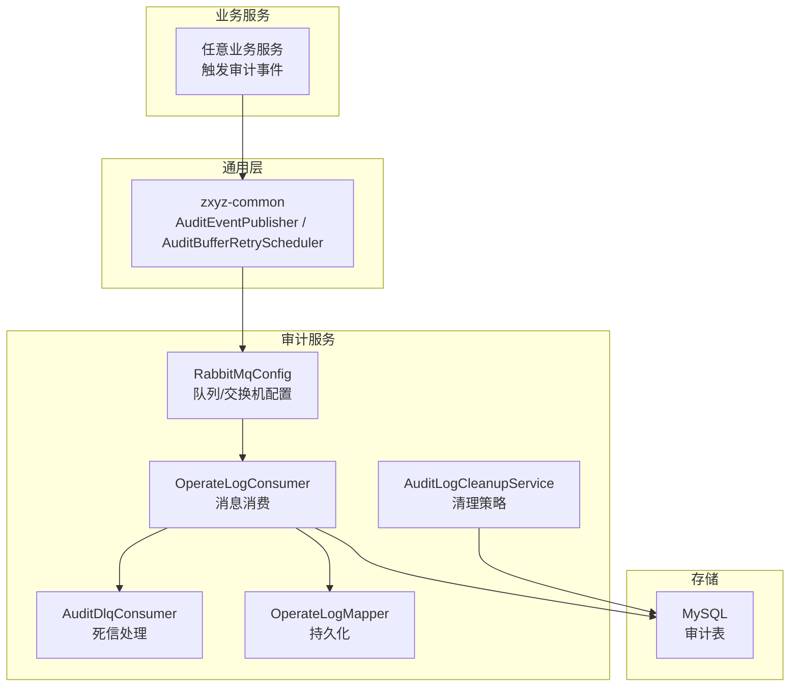
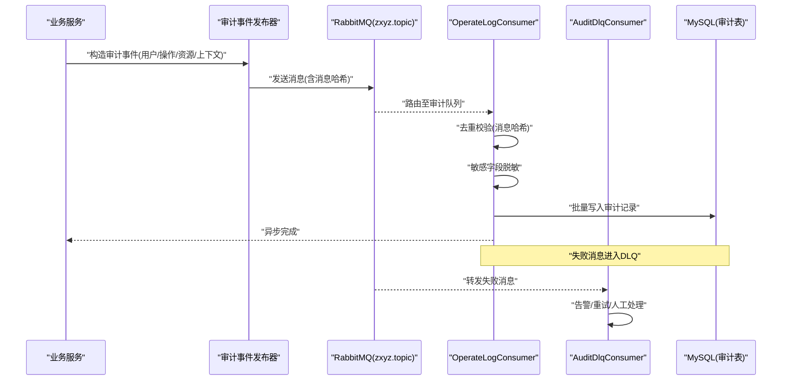
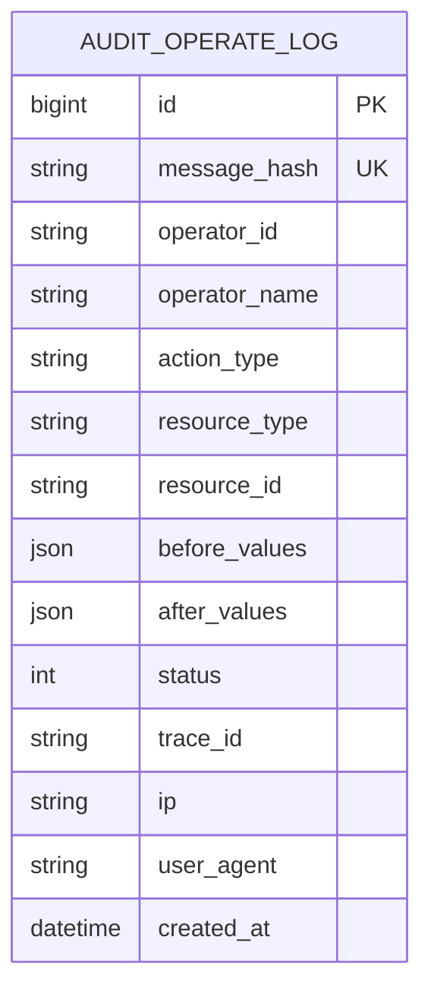
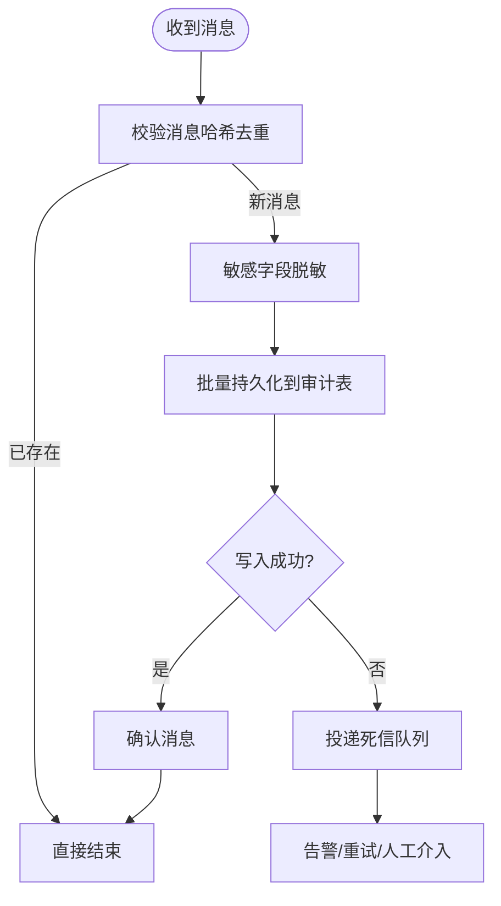
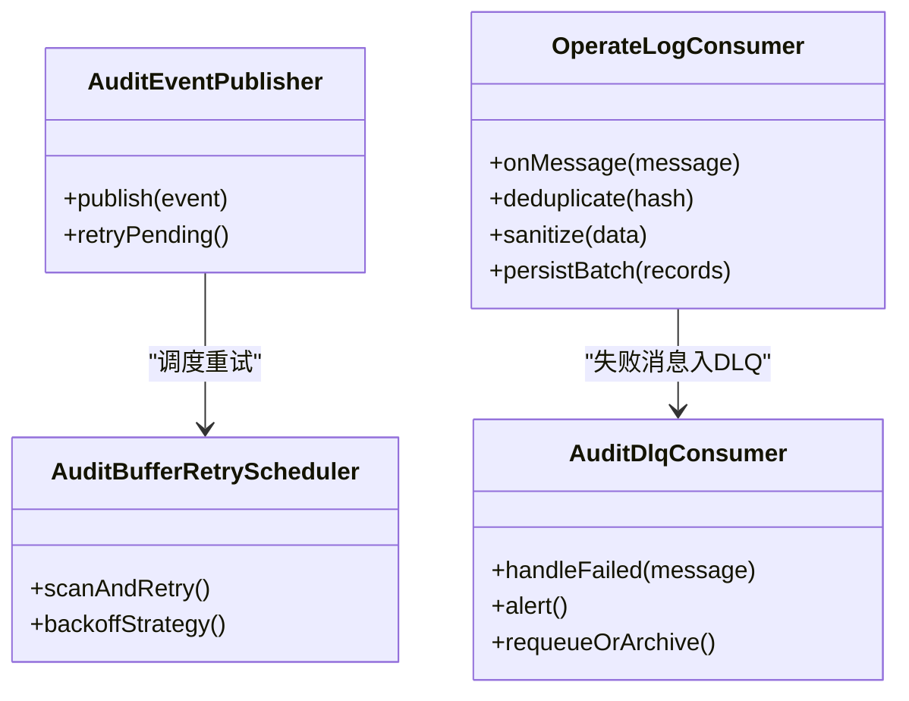
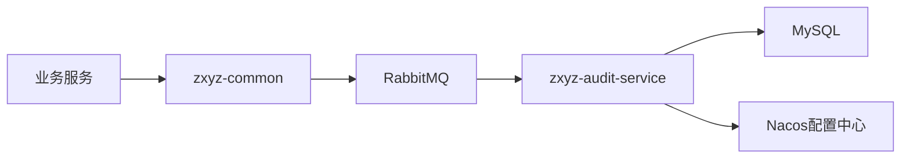

# 审计日志

<cite>
**本文引用的文件**
- [schema_audit.sql](file://ZXYZdatabaseBack/sql/schema_audit.sql)
- [V1__init_schema.sql](file://ZXYZdatabaseBack/zxyz-audit-service/src/main/resources/db/migration/V1__init_schema.sql)
- [V2__add_operate_log_before_after_values.sql](file://ZXYZdatabaseBack/zxyz-audit-service/src/main/resources/db/migration/V2__add_operate_log_before_after_values.sql)
- [V3__add_message_hash_unique.sql](file://ZXYZdatabaseBack/zxyz-audit-service/src/main/resources/db/migration/V3__add_message_hash_unique.sql)
- [OperateLogConsumer.java](file://ZXYZdatabaseBack/zxyz-audit-service/src/main/java/uno/acloud/audit/mq/OperateLogConsumer.java)
- [AuditDlqConsumer.java](file://ZXYZdatabaseBack/zxyz-audit-service/src/main/java/uno/acloud/audit/mq/AuditDlqConsumer.java)
- [RabbitMqConfig.java](file://ZXYZdatabaseBack/zxyz-audit-service/src/main/java/uno/acloud/audit/config/RabbitMqConfig.java)
- [OperateLogMapper.java](file://ZXYZdatabaseBack/zxyz-audit-service/src/main/java/uno/acloud/audit/mapper/OperateLogMapper.java)
- [AuditLogCleanupService.java](file://ZXYZdatabaseBack/zxyz-audit-service/src/main/java/uno/acloud/audit/service/AuditLogCleanupService.java)
- [OperateLogTest.java](file://ZXYZdatabaseBack/zxyz-audit-service/src/test/java/uno/acloud/audit/mq/OperateLogConsumerTest.java)
- [AuditEventPublisher.java](file://ZXYZdatabaseBack/zxyz-common/src/main/java/uno/acloud/common/audit/AuditEventPublisher.java)
- [AuditBufferRetryScheduler.java](file://ZXYZdatabaseBack/zxyz-common/src/main/java/uno/acloud/common/audit/AuditBufferRetryScheduler.java)
- [application.yml](file://ZXYZdatabaseBack/zxyz-audit-service/src/main/resources/application.yml)
- [application-dev.yml](file://ZXYZdatabaseBack/zxyz-audit-service/src/main/resources/application-dev.yml)
- [application-prod.yml](file://ZXYZdatabaseBack/zxyz-audit-service/src/main/resources/application-prod.yml)
- [zxyz-audit-service.yml](file://nacos-config/zxyz-audit-service.yml)
</cite>

## 目录
1. [简介](#简介)
2. [项目结构](#项目结构)
3. [核心组件](#核心组件)
4. [架构总览](#架构总览)
5. [详细组件分析](#详细组件分析)
6. [依赖关系分析](#依赖关系分析)
7. [性能考虑](#性能考虑)
8. [故障排查指南](#故障排查指南)
9. [结论](#结论)
10. [附录](#附录)

## 简介
本文件面向 ZXYZ 项目的审计日志体系，覆盖以下关键主题：
- OperateLog 注解使用与操作记录规范（含敏感信息脱敏）
- 异步审计日志处理：RabbitMQ 消息队列、消费者处理逻辑、重试与死信机制
- 审计数据模型：操作类型定义、前后值对比、用户行为追踪
- 合规性要求：数据保留策略、访问控制、审计报表生成
- 审计日志查询与分析方法，支持安全审计与合规检查

## 项目结构
审计相关能力分布在 zxyz-common（通用事件发布与缓冲重试）、各业务服务（通过注解或调用点触发审计事件）、zxyz-audit-service（消息消费与持久化）、以及数据库迁移脚本中。

图表来源
- [RabbitMqConfig.java](file://ZXYZdatabaseBack/zxyz-audit-service/src/main/java/uno/acloud/audit/config/RabbitMqConfig.java)
- [OperateLogConsumer.java](file://ZXYZdatabaseBack/zxyz-audit-service/src/main/java/uno/acloud/audit/mq/OperateLogConsumer.java)
- [AuditDlqConsumer.java](file://ZXYZdatabaseBack/zxyz-audit-service/src/main/java/uno/acloud/audit/mq/AuditDlqConsumer.java)
- [OperateLogMapper.java](file://ZXYZdatabaseBack/zxyz-audit-service/src/main/java/uno/acloud/audit/mapper/OperateLogMapper.java)
- [AuditLogCleanupService.java](file://ZXYZdatabaseBack/zxyz-audit-service/src/main/java/uno/acloud/audit/service/AuditLogCleanupService.java)

章节来源
- [schema_audit.sql](file://ZXYZdatabaseBack/sql/schema_audit.sql)
- [V1__init_schema.sql](file://ZXYZdatabaseBack/zxyz-audit-service/src/main/resources/db/migration/V1__init_schema.sql)
- [V2__add_operate_log_before_after_values.sql](file://ZXYZdatabaseBack/zxyz-audit-service/src/main/resources/db/migration/V2__add_operate_log_before_after_values.sql)
- [V3__add_message_hash_unique.sql](file://ZXYZdatabaseBack/zxyz-audit-service/src/main/resources/db/migration/V3__add_message_hash_unique.sql)

## 核心组件
- 审计事件发布与缓冲重试（zxyz-common）
  - 事件发布器负责将审计事件序列化并投递到 RabbitMQ；在不可用场景下提供本地缓冲与重试调度，保障最终投递。
  - 缓冲重试调度器周期性扫描未成功消息，按退避策略重发，降低瞬时失败影响。
- 审计服务（zxyz-audit-service）
  - RabbitMQ 配置：声明 Topic Exchange 与队列、绑定规则、DLQ 等。
  - 消费者：接收审计消息，去重、校验、脱敏、落库；异常进入死信队列。
  - 死信消费者：对失败消息进行告警、人工干预或二次重试。
  - 持久化：通过 Mapper 写入审计表，支持批量插入优化。
  - 清理服务：基于时间窗口或大小阈值定期归档/删除过期审计数据。
- 数据库迁移
  - 初始化审计表结构、扩展前后值字段、增加消息哈希唯一约束以去重。

章节来源
- [AuditEventPublisher.java](file://ZXYZdatabaseBack/zxyz-common/src/main/java/uno/acloud/common/audit/AuditEventPublisher.java)
- [AuditBufferRetryScheduler.java](file://ZXYZdatabaseBack/zxyz-common/src/main/java/uno/acloud/common/audit/AuditBufferRetryScheduler.java)
- [RabbitMqConfig.java](file://ZXYZdatabaseBack/zxyz-audit-service/src/main/java/uno/acloud/audit/config/RabbitMqConfig.java)
- [OperateLogConsumer.java](file://ZXYZdatabaseBack/zxyz-audit-service/src/main/java/uno/acloud/audit/mq/OperateLogConsumer.java)
- [AuditDlqConsumer.java](file://ZXYZdatabaseBack/zxyz-audit-service/src/main/java/uno/acloud/audit/mq/AuditDlqConsumer.java)
- [OperateLogMapper.java](file://ZXYZdatabaseBack/zxyz-audit-service/src/main/java/uno/acloud/audit/mapper/OperateLogMapper.java)
- [AuditLogCleanupService.java](file://ZXYZdatabaseBack/zxyz-audit-service/src/main/java/uno/acloud/audit/service/AuditLogCleanupService.java)
- [V1__init_schema.sql](file://ZXYZdatabaseBack/zxyz-audit-service/src/main/resources/db/migration/V1__init_schema.sql)
- [V2__add_operate_log_before_after_values.sql](file://ZXYZdatabaseBack/zxyz-audit-service/src/main/resources/db/migration/V2__add_operate_log_before_after_values.sql)
- [V3__add_message_hash_unique.sql](file://ZXYZdatabaseBack/zxyz-audit-service/src/main/resources/db/migration/V3__add_message_hash_unique.sql)

## 架构总览
审计日志采用“生产者-消息中间件-消费者”的异步解耦模式，确保高吞吐与高可用。

图表来源
- [OperateLogConsumer.java](file://ZXYZdatabaseBack/zxyz-audit-service/src/main/java/uno/acloud/audit/mq/OperateLogConsumer.java)
- [AuditDlqConsumer.java](file://ZXYZdatabaseBack/zxyz-audit-service/src/main/java/uno/acloud/audit/mq/AuditDlqConsumer.java)
- [RabbitMqConfig.java](file://ZXYZdatabaseBack/zxyz-audit-service/src/main/java/uno/acloud/audit/config/RabbitMqConfig.java)

## 详细组件分析

### 审计数据模型与数据库设计
- 审计表包含：操作主体、操作类型、资源标识、请求上下文、结果状态、时间戳、前后值快照、消息哈希等。
- 前后值对比：用于记录变更前后的关键字段差异，便于回溯与合规审查。
- 消息哈希唯一约束：防止重复消费导致重复审计记录。

图表来源
- [V1__init_schema.sql](file://ZXYZdatabaseBack/zxyz-audit-service/src/main/resources/db/migration/V1__init_schema.sql)
- [V2__add_operate_log_before_after_values.sql](file://ZXYZdatabaseBack/zxyz-audit-service/src/main/resources/db/migration/V2__add_operate_log_before_after_values.sql)
- [V3__add_message_hash_unique.sql](file://ZXYZdatabaseBack/zxyz-audit-service/src/main/resources/db/migration/V3__add_message_hash_unique.sql)

章节来源
- [schema_audit.sql](file://ZXYZdatabaseBack/sql/schema_audit.sql)
- [V1__init_schema.sql](file://ZXYZdatabaseBack/zxyz-audit-service/src/main/resources/db/migration/V1__init_schema.sql)
- [V2__add_operate_log_before_after_values.sql](file://ZXYZdatabaseBack/zxyz-audit-service/src/main/resources/db/migration/V2__add_operate_log_before_after_values.sql)
- [V3__add_message_hash_unique.sql](file://ZXYZdatabaseBack/zxyz-audit-service/src/main/resources/db/migration/V3__add_message_hash_unique.sql)

### 异步审计消息处理流程
- 生产者：统一封装审计事件，计算消息哈希，发送到 zxyz.topic。
- 消费者：
  - 去重：依据消息哈希判断是否已处理。
  - 脱敏：对敏感字段（如手机号、邮箱、身份证、银行卡等）进行掩码或替换。
  - 落库：批量写入审计表，提升吞吐。
  - 异常：捕获异常并投递至死信队列，避免阻塞主流程。
- 死信消费者：对失败消息进行告警、统计、二次重试或转交人工处理。

图表来源
- [OperateLogConsumer.java](file://ZXYZdatabaseBack/zxyz-audit-service/src/main/java/uno/acloud/audit/mq/OperateLogConsumer.java)
- [AuditDlqConsumer.java](file://ZXYZdatabaseBack/zxyz-audit-service/src/main/java/uno/acloud/audit/mq/AuditDlqConsumer.java)

章节来源
- [OperateLogConsumer.java](file://ZXYZdatabaseBack/zxyz-audit-service/src/main/java/uno/acloud/audit/mq/OperateLogConsumer.java)
- [AuditDlqConsumer.java](file://ZXYZdatabaseBack/zxyz-audit-service/src/main/java/uno/acloud/audit/mq/AuditDlqConsumer.java)

### 重试与死信机制
- 本地缓冲重试：当 MQ 不可用时，事件发布器将消息缓存至本地存储，定时任务按指数退避策略重发。
- 消费者侧重试：对幂等性保证的消息可设置有限重试次数；超过阈值进入死信队列。
- 死信处理：集中监控失败消息，支持自动重试、告警通知、人工复核。

图表来源
- [AuditEventPublisher.java](file://ZXYZdatabaseBack/zxyz-common/src/main/java/uno/acloud/common/audit/AuditEventPublisher.java)
- [AuditBufferRetryScheduler.java](file://ZXYZdatabaseBack/zxyz-common/src/main/java/uno/acloud/common/audit/AuditBufferRetryScheduler.java)
- [OperateLogConsumer.java](file://ZXYZdatabaseBack/zxyz-audit-service/src/main/java/uno/acloud/audit/mq/OperateLogConsumer.java)
- [AuditDlqConsumer.java](file://ZXYZdatabaseBack/zxyz-audit-service/src/main/java/uno/acloud/audit/mq/AuditDlqConsumer.java)

章节来源
- [AuditEventPublisher.java](file://ZXYZdatabaseBack/zxyz-common/src/main/java/uno/acloud/common/audit/AuditEventPublisher.java)
- [AuditBufferRetryScheduler.java](file://ZXYZdatabaseBack/zxyz-common/src/main/java/uno/acloud/common/audit/AuditBufferRetryScheduler.java)
- [OperateLogConsumer.java](file://ZXYZdatabaseBack/zxyz-audit-service/src/main/java/uno/acloud/audit/mq/OperateLogConsumer.java)
- [AuditDlqConsumer.java](file://ZXYZdatabaseBack/zxyz-audit-service/src/main/java/uno/acloud/audit/mq/AuditDlqConsumer.java)

### 操作类型与用户行为追踪
- 操作类型：建议枚举化（如创建、更新、删除、授权、登录、导出等），便于统计与报表。
- 用户行为追踪：记录操作人、IP、UA、TraceId、时间戳，结合资源类型与ID形成完整行为链。
- 前后值对比：对关键字段变更进行快照，支持差异比对与回滚分析。

章节来源
- [V2__add_operate_log_before_after_values.sql](file://ZXYZdatabaseBack/zxyz-audit-service/src/main/resources/db/migration/V2__add_operate_log_before_after_values.sql)

### 敏感信息脱敏规范
- 脱敏范围：手机号、邮箱、身份证号、银行卡号、密码、Token、密钥等。
- 脱敏策略：掩码（如前3后4）、哈希（不可逆）、替换为占位符。
- 实现位置：消费者在处理阶段执行脱敏，确保入库数据不含明文敏感信息。

章节来源
- [OperateLogConsumer.java](file://ZXYZdatabaseBack/zxyz-audit-service/src/main/java/uno/acloud/audit/mq/OperateLogConsumer.java)

### 审计数据清理与保留策略
- 保留周期：根据合规要求配置保留天数（如 180/365 天）。
- 清理策略：按时间窗口分批删除，避免锁表与性能抖动；支持归档到冷存储。
- 配置项：清理开关、批次大小、保留天数、目标库/对象存储。

章节来源
- [AuditLogCleanupService.java](file://ZXYZdatabaseBack/zxyz-audit-service/src/main/java/uno/acloud/audit/service/AuditLogCleanupService.java)

### 配置与环境
- 应用配置：RabbitMQ 连接、队列名、Exchange、消费者并发、重试参数等。
- 环境区分：dev/prod 不同配置，生产环境需开启严格脱敏与限流。
- Nacos 配置：集中管理审计服务配置，支持动态刷新。

章节来源
- [application.yml](file://ZXYZdatabaseBack/zxyz-audit-service/src/main/resources/application.yml)
- [application-dev.yml](file://ZXYZdatabaseBack/zxyz-audit-service/src/main/resources/application-dev.yml)
- [application-prod.yml](file://ZXYZdatabaseBack/zxyz-audit-service/src/main/resources/application-prod.yml)
- [zxyz-audit-service.yml](file://nacos-config/zxyz-audit-service.yml)

## 依赖关系分析
- 模块依赖
  - zxyz-common：提供审计事件发布与缓冲重试能力。
  - zxyz-audit-service：消费消息、持久化、清理、死信处理。
  - 数据库：MySQL 存储审计记录。
- 外部依赖
  - RabbitMQ：Topic Exchange 路由消息。
  - Nacos：配置中心。
  - Jasypt：敏感配置加密（部署层面）。

图表来源
- [RabbitMqConfig.java](file://ZXYZdatabaseBack/zxyz-audit-service/src/main/java/uno/acloud/audit/config/RabbitMqConfig.java)
- [AuditEventPublisher.java](file://ZXYZdatabaseBack/zxyz-common/src/main/java/uno/acloud/common/audit/AuditEventPublisher.java)

章节来源
- [RabbitMqConfig.java](file://ZXYZdatabaseBack/zxyz-audit-service/src/main/java/uno/acloud/audit/config/RabbitMqConfig.java)
- [AuditEventPublisher.java](file://ZXYZdatabaseBack/zxyz-common/src/main/java/uno/acloud/common/audit/AuditEventPublisher.java)

## 性能考虑
- 批量写入：消费者端合并多条记录批量插入，减少 IO 开销。
- 去重机制：消息哈希唯一约束避免重复处理。
- 异步解耦：业务线程不阻塞于审计落库。
- 背压与限流：合理设置消费者并发与队列长度，防止积压。
- 清理策略：分片删除与归档，避免大事务。

[本节为通用指导，无需代码来源]

## 故障排查指南
- 常见问题
  - 消息堆积：检查消费者健康、数据库写入性能、MQ 连接。
  - 重复审计：确认消息哈希去重逻辑生效。
  - 脱敏失效：核对消费者脱敏规则与字段映射。
  - 死信增多：查看失败原因（网络、权限、数据校验）。
- 定位手段
  - 查看消费者日志与指标。
  - 检查死信队列消息内容。
  - 验证数据库唯一约束与索引。
  - 核对 Nacos 配置与运行环境。

章节来源
- [OperateLogConsumerTest.java](file://ZXYZdatabaseBack/zxyz-audit-service/src/test/java/uno/acloud/audit/mq/OperateLogConsumerTest.java)
- [OperateLogConsumer.java](file://ZXYZdatabaseBack/zxyz-audit-service/src/main/java/uno/acloud/audit/mq/OperateLogConsumer.java)
- [AuditDlqConsumer.java](file://ZXYZdatabaseBack/zxyz-audit-service/src/main/java/uno/acloud/audit/mq/AuditDlqConsumer.java)

## 结论
ZXYZ 审计日志体系通过异步消息与消费者解耦，实现了高吞吐、可扩展、可观测的审计能力。配合敏感信息脱敏、前后值对比、消息去重与死信处理，满足安全审计与合规检查需求。建议在生产环境强化监控告警、定期演练清理与归档流程，确保长期稳定运行。

[本节为总结，无需代码来源]

## 附录

### OperateLog 注解使用与操作记录规范
- 注解作用：在业务方法上标注审计点，自动收集操作主体、资源、上下文等信息。
- 使用建议：
  - 明确操作类型与资源标识，保持枚举一致。
  - 仅记录必要字段，避免冗余与性能损耗。
  - 禁止记录明文敏感信息，交由消费者脱敏。
- 记录规范：
  - 必填：operator_id、action_type、resource_type、resource_id、created_at。
  - 可选：before_values、after_values、trace_id、ip、user_agent。

[本节为概念说明，无需代码来源]

### 审计报表与合规检查
- 报表维度：按用户、操作类型、资源类型、时间范围统计。
- 合规检查：导出指定时间段内的操作轨迹，支持差异比对与签名校验。
- 输出格式：CSV/JSON，支持分页与过滤。

[本节为概念说明，无需代码来源]

### 审计日志查询与分析方法
- 基础查询：按用户、操作类型、时间范围筛选。
- 高级分析：关联 TraceId 追踪跨服务调用；对比 before/after 字段定位变更。
- 工具建议：构建内部查询页面或对接 BI 工具，提供可视化看板。

[本节为概念说明，无需代码来源]