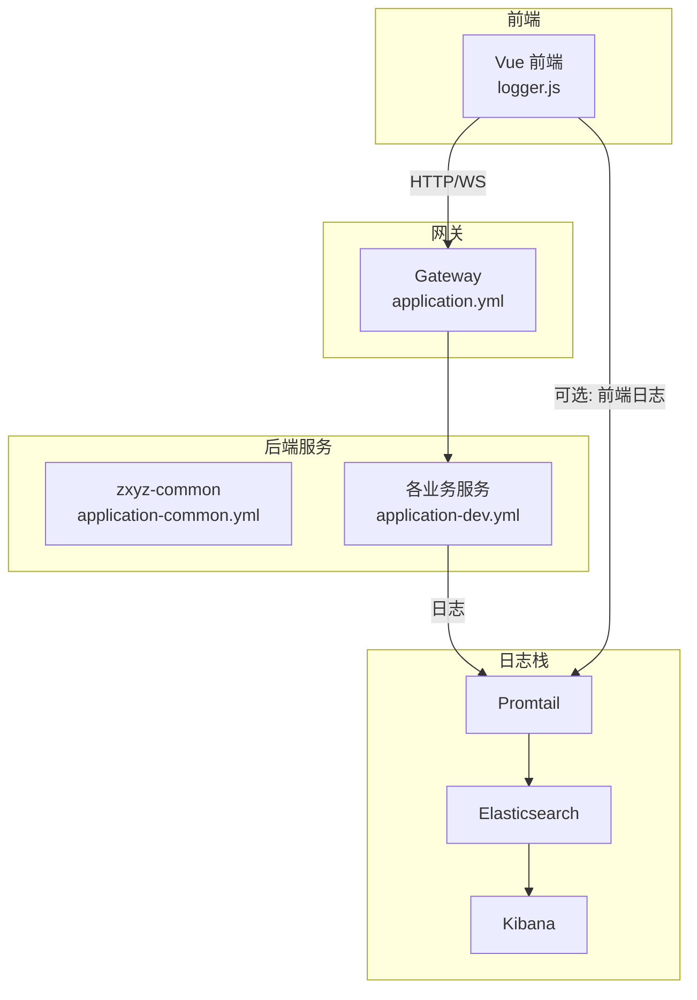
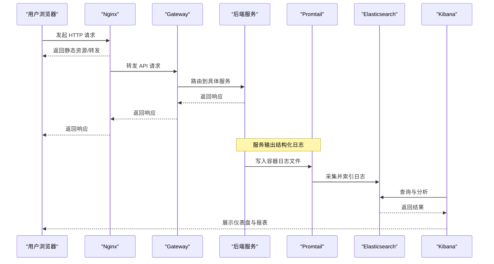
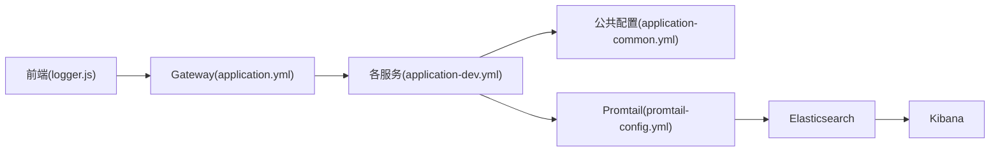

# 日志分析

<cite>
**本文引用的文件**
- [docker-compose.yml](file://docker-compose.yml)
- [deploy/nginx/default.conf](file://deploy/nginx/default.conf)
- [deploy/promtail-config.yml](file://deploy/promtail-config.yml)
- [nacos-config/zxyz-static.yml](file://nacos-config/zxyz-static.yml)
- [ZXYZdatabaseFront/src/utils/logger.js](file://ZXYZdatabaseFront/src/utils/logger.js)
- [ZXYZdatabaseFront/package.json](file://ZXYZdatabaseFront/package.json)
- [ZXYZdatabaseFront/vite.config.js](file://ZXYZdatabaseFront/vite.config.js)
- [ZXYZdatabaseBack/zxyz-common/src/main/resources/application-common.yml](file://ZXYZdatabaseBack/zxyz-common/src/main/resources/application-common.yml)
- [ZXYZdatabaseBack/zxyz-gateway/src/main/resources/application.yml](file://ZXYZdatabaseBack/zxyz-gateway/src/main/resources/application.yml)
- [ZXYZdatabaseBack/zxyz-admin-service/src/main/resources/application-dev.yml](file://ZXYZdatabaseBack/zxyz-admin-service/src/main/resources/application-dev.yml)
- [ZXYZdatabaseBack/zxyz-email-service/src/main/resources/application-dev.yml](file://ZXYZdatabaseBack/zxyz-email-service/src/main/resources/application-dev.yml)
- [ZXYZdatabaseBack/zxyz-file-service/src/main/resources/application-dev.yml](file://ZXYZdatabaseBack/zxyz-file-service/src/main/resources/application-dev.yml)
- [ZXYZdatabaseBack/zxyz-im-service/src/main/resources/application-dev.yml](file://ZXYZdatabaseBack/zxyz-im-service/src/main/resources/application-dev.yml)
- [ZXYZdatabaseBack/zxyz-project-service/src/main/resources/application-dev.yml](file://ZXYZdatabaseBack/zxyz-project-service/src/main/resources/application-dev.yml)
- [ZXYZdatabaseBack/zxyz-share-service/src/main/resources/application-dev.yml](file://ZXYZdatabaseBack/zxyz-share-service/src/main/resources/application-dev.yml)
- [ZXYZdatabaseBack/zxyz-team-service/src/main/resources/application-dev.yml](file://ZXYZdatabaseBack/zxyz-team-service/src/main/resources/application-dev.yml)
- [ZXYZdatabaseBack/zxyz-user-service/src/main/resources/application-dev.yml](file://ZXYZdatabaseBack/zxyz-user-service/src/main/resources/application-dev.yml)
</cite>

## 目录
1. [简介](#简介)
2. [项目结构](#项目结构)
3. [核心组件](#核心组件)
4. [架构总览](#架构总览)
5. [详细组件分析](#详细组件分析)
6. [依赖分析](#依赖分析)
7. [性能考虑](#性能考虑)
8. [故障排查指南](#故障排查指南)
9. [结论](#结论)
10. [附录](#附录)

## 简介
本文件面向 ZXYZ 项目的日志分析与可观测性，聚焦 Kibana 界面使用、索引模式配置、可视化仪表板创建；系统讲解日志查询语法（Lucene 语句、聚合分析、时间范围筛选）；覆盖常用分析场景（错误率统计、响应时间分析、用户行为追踪）；并给出性能监控方法（慢查询识别、资源使用分析、瓶颈定位），以及日志告警与自动化报告生成实践。文档同时结合仓库中的前端日志工具、后端应用配置与部署编排，确保落地可行。

## 项目结构
ZXYZ 采用微服务架构（多个后端 Maven 模块 + Vue 前端），通过 Docker Compose 编排容器化运行，包含基础设施与日志栈。前端统一日志输出到控制台或远端收集器，后端通过 Spring Boot 的日志框架输出结构化日志，并由日志采集组件汇聚至 Elasticsearch，最终在 Kibana 中检索与可视化。

图表来源
- [docker-compose.yml](file://docker-compose.yml)
- [deploy/promtail-config.yml](file://deploy/promtail-config.yml)
- [ZXYZdatabaseFront/src/utils/logger.js](file://ZXYZdatabaseFront/src/utils/logger.js)
- [ZXYZdatabaseBack/zxyz-gateway/src/main/resources/application.yml](file://ZXYZdatabaseBack/zxyz-gateway/src/main/resources/application.yml)
- [ZXYZdatabaseBack/zxyz-common/src/main/resources/application-common.yml](file://ZXYZdatabaseBack/zxyz-common/src/main/resources/application-common.yml)

章节来源
- [docker-compose.yml](file://docker-compose.yml)
- [deploy/promtail-config.yml](file://deploy/promtail-config.yml)
- [ZXYZdatabaseFront/src/utils/logger.js](file://ZXYZdatabaseFront/src/utils/logger.js)
- [ZXYZdatabaseBack/zxyz-gateway/src/main/resources/application.yml](file://ZXYZdatabaseBack/zxyz-gateway/src/main/resources/application.yml)
- [ZXYZdatabaseBack/zxyz-common/src/main/resources/application-common.yml](file://ZXYZdatabaseBack/zxyz-common/src/main/resources/application-common.yml)

## 核心组件
- 前端日志：基于 logger.js 统一封装，支持按级别输出、上下文注入（如用户、请求ID）、可选上报到远端日志收集器。
- 后端日志：Spring Boot 默认日志框架，配合 application-common.yml 与各服务的 application-dev.yml 进行日志级别、格式与输出目标配置。
- 日志采集：Promtail 作为 Logstash 替代方案，按路径与标签采集容器日志，转发至 Elasticsearch。
- 存储与展示：Elasticsearch 存储结构化日志，Kibana 提供索引模式、查询、可视化与告警能力。
- 网关与 Nginx：Nginx 反向代理与访问日志，Gateway 内部鉴权与路由，均纳入统一日志体系。

章节来源
- [ZXYZdatabaseFront/src/utils/logger.js](file://ZXYZdatabaseFront/src/utils/logger.js)
- [ZXYZdatabaseBack/zxyz-common/src/main/resources/application-common.yml](file://ZXYZdatabaseBack/zxyz-common/src/main/resources/application-common.yml)
- [ZXYZdatabaseBack/zxyz-gateway/src/main/resources/application.yml](file://ZXYZdatabaseBack/zxyz-gateway/src/main/resources/application.yml)
- [deploy/promtail-config.yml](file://deploy/promtail-config.yml)

## 架构总览
下图展示了从前端到后端再到日志栈的完整链路，包括 Nginx、Gateway、各服务、Promtail、Elasticsearch 与 Kibana 的交互关系。

图表来源
- [deploy/nginx/default.conf](file://deploy/nginx/default.conf)
- [ZXYZdatabaseBack/zxyz-gateway/src/main/resources/application.yml](file://ZXYZdatabaseBack/zxyz-gateway/src/main/resources/application.yml)
- [deploy/promtail-config.yml](file://deploy/promtail-config.yml)
- [docker-compose.yml](file://docker-compose.yml)

## 详细组件分析

### Kibana 界面使用与索引模式配置
- 索引模式
  - 建议以“服务名+日期”为前缀建立索引模式，例如 zxyz-api-YYYY.MM.dd、zxyz-access-YYYY.MM.dd、zxyz-error-YYYY.MM.dd。
  - 在 Kibana 的“管理 > 索引模式”中创建模式，选择时间字段（通常为 @timestamp 或自定义时间字段）。
  - 若使用多源日志（API、访问、错误），可分别创建索引模式并通过“数据视图”聚合。
- 基本操作
  - “发现”页面用于检索与预览日志；“可视化”用于创建图表；“仪表板”用于组合图表；“分析”用于执行复杂查询与聚合。
  - 时间范围筛选：顶部时间选择器支持相对时间（最近1小时、今天、本周）与绝对时间区间。
- 最佳实践
  - 统一时间字段命名（如 @timestamp），避免多时区问题。
  - 对高频过滤字段建立映射（如 service、level、traceId、userId、method、path、status）。
  - 使用别名或索引模板自动滚动新索引，便于生命周期管理。

章节来源
- [docker-compose.yml](file://docker-compose.yml)
- [deploy/promtail-config.yml](file://deploy/promtail-config.yml)

### 可视化仪表板创建
- 常见图表类型
  - 折线图：QPS、错误率、响应时间趋势。
  - 柱状图：按服务/接口/状态码分布。
  - 表格：Top N 慢接口、Top 错误堆栈。
  - 地图/饼图：地域分布、错误类型占比。
- 步骤要点
  - 新建可视化，选择对应索引模式与时间范围。
  - 设置度量（count、avg、p95、max）与分桶（service、status、method 等）。
  - 保存并加入仪表板，添加过滤器（如 level=ERROR、service=im-service）。
- 共享与权限
  - 仪表板可导出 JSON 供版本化管理；根据团队角色设置访问权限。

[本节为通用指导，不直接分析具体文件]

### 日志查询语法
- Lucene 基础
  - 字段匹配：field:value（精确匹配）、field:"value with spaces"（短语匹配）。
  - 范围查询：@timestamp:[now-1h TO now]、status:[400 TO 599]。
  - 逻辑运算：AND、OR、NOT、括号分组。
  - 通配符与正则：field:val*、field:/re*/（谨慎使用，影响性能）。
- 聚合分析
  - terms：按字段分组计数（如 service、status、method）。
  - date_histogram：按时间分桶统计（如每分钟 QPS）。
  - filter/aggs：嵌套过滤与聚合组合（如先过滤 ERROR，再按堆栈分类）。
  - pipeline：在聚合基础上做衍生计算（如移动平均、比率）。
- 时间范围筛选
  - 使用 @timestamp 或自定义时间字段，推荐统一 UTC 时间。
  - 相对时间表达式：now-1h、now-1d、now-7d/d。

[本节为通用指导，不直接分析具体文件]

### 常用分析场景
- 错误率统计
  - 指标：错误数、错误率（错误数/总数）、按服务/接口/错误码维度。
  - 查询思路：过滤 status>=400 或 level=ERROR，terms(status) 与 date_histogram(time)。
  - 可视化：折线（错误率趋势）、柱状（错误码分布）、表格（Top 错误接口）。
- 响应时间分析
  - 指标：平均、P95、P99、最大响应时间。
  - 查询思路：聚合 avg(response_time)、percentiles(response_time, 95, 99)。
  - 可视化：折线（P95/P99 趋势）、热力图（接口×时间段）。
- 用户行为追踪
  - 指标：活跃用户数、会话时长、关键事件漏斗（登录→浏览→下单）。
  - 查询思路：按 userId/sessionId 分组，date_histogram 统计事件序列。
  - 可视化：漏斗图、折线（日活）、表格（Top 用户行为）。

[本节为通用指导，不直接分析具体文件]

### 性能监控：慢查询、资源使用与瓶颈定位
- 慢查询识别
  - 后端：开启慢 SQL 日志（如 MyBatis/Druid），记录耗时阈值；在 Kibana 中按耗时分桶。
  - 前端：网络请求耗时（fetch/XHR）与渲染耗时（Performance API）上报。
- 资源使用分析
  - JVM：GC 次数、堆内存使用、线程池队列长度（通过 Micrometer/JMX 暴露）。
  - 系统：CPU、内存、磁盘 I/O、网络带宽（Node Exporter + Prometheus → Kibana 或 Grafana）。
- 瓶颈定位
  - 链路追踪：traceId 贯穿网关与服务，关联上下游调用链。
  - 热点分析：按接口/方法维度聚合耗时与错误率，定位热点与异常点。
  - 容量评估：QPS 峰值、延迟分布、错误率拐点，指导扩容与优化。

[本节为通用指导，不直接分析具体文件]

### 日志告警与自动化报告
- 告警规则
  - 错误率突增：单位时间内 ERROR 数量超过阈值。
  - 响应时间劣化：P95/P99 超过基线。
  - 服务不可用：健康检查失败或连续超时。
  - 安全事件：异常登录、权限拒绝、敏感操作审计。
- 实现方式
  - Kibana 报警：基于查询与阈值的 Alerting 规则，触发通知（邮件、Webhook）。
  - 外部集成：将告警推送至企业微信/钉钉/Slack 等。
- 自动化报告
  - 定时任务：每日/每周生成日报（错误率、响应时间、Top 问题）。
  - 导出与分发：Kibana Saved Objects 导出、脚本抓取 API 结果并发送邮件。

[本节为通用指导，不直接分析具体文件]

## 依赖分析
- 前端依赖
  - Vue 3 Composition API、Element Plus、Pinia、Composables 封装。
  - 日志工具 logger.js 统一输出，可配置上报目标。
- 后端依赖
  - Spring Boot 各服务通过 application-dev.yml 配置日志级别与输出。
  - zxyz-common 提供公共配置与工具类。
  - Gateway 负责鉴权与路由，内部端点受 SaToken 保护。
- 日志栈依赖
  - Promtail 采集容器日志，Elasticsearch 存储，Kibana 展示。
  - docker-compose.yml 定义服务间网络与卷挂载。

图表来源
- [ZXYZdatabaseFront/src/utils/logger.js](file://ZXYZdatabaseFront/src/utils/logger.js)
- [ZXYZdatabaseBack/zxyz-gateway/src/main/resources/application.yml](file://ZXYZdatabaseBack/zxyz-gateway/src/main/resources/application.yml)
- [ZXYZdatabaseBack/zxyz-common/src/main/resources/application-common.yml](file://ZXYZdatabaseBack/zxyz-common/src/main/resources/application-common.yml)
- [deploy/promtail-config.yml](file://deploy/promtail-config.yml)
- [docker-compose.yml](file://docker-compose.yml)

章节来源
- [ZXYZdatabaseFront/package.json](file://ZXYZdatabaseFront/package.json)
- [ZXYZdatabaseFront/vite.config.js](file://ZXYZdatabaseFront/vite.config.js)
- [ZXYZdatabaseBack/zxyz-common/src/main/resources/application-common.yml](file://ZXYZdatabaseBack/zxyz-common/src/main/resources/application-common.yml)
- [ZXYZdatabaseBack/zxyz-gateway/src/main/resources/application.yml](file://ZXYZdatabaseBack/zxyz-gateway/src/main/resources/application.yml)
- [deploy/promtail-config.yml](file://deploy/promtail-config.yml)
- [docker-compose.yml](file://docker-compose.yml)

## 性能考虑
- 日志采样与分级
  - 生产环境降低 DEBUG 级别，启用 INFO/WARN/ERROR 分级输出。
  - 对高吞吐接口启用采样策略，避免日志风暴。
- 字段设计与映射
  - 合理设计字段类型与分词器，减少不必要的文本索引。
  - 对高频过滤字段建立 keyword 子字段，提升聚合性能。
- 查询优化
  - 优先使用时间范围与精确匹配，避免全表扫描。
  - 合理使用聚合分桶大小，控制返回结果集。
- 存储与生命周期
  - 索引滚动与保留策略（如 7/30/90 天），冷热分离。
  - 压缩与副本数平衡，兼顾可靠性与写入吞吐。

[本节为通用指导，不直接分析具体文件]

## 故障排查指南
- 常见问题
  - 日志缺失：检查 Promtail 采集路径与权限、容器日志输出是否被重定向。
  - 时间错位：确认各服务时区与 @timestamp 字段一致性。
  - 查询缓慢：检查索引映射、分片数、聚合复杂度与时间范围过大。
  - 告警误报：调整阈值与窗口大小，增加去抖与基线对比。
- 排查步骤
  - 在 Kibana 中使用“发现”页面逐步缩小范围（时间、服务、级别、traceId）。
  - 通过 traceId 串联网关、服务、数据库与外部依赖调用链。
  - 结合系统指标（CPU、内存、GC、I/O）定位资源瓶颈。
  - 对慢查询进行 EXPLAIN 与执行计划分析，优化 SQL 与索引。

[本节为通用指导，不直接分析具体文件]

## 结论
通过统一的日志规范、完善的采集与存储、强大的查询与可视化能力，ZXYZ 项目可实现端到端的可观测性与高效的问题定位。建议持续完善索引模式与聚合模板，沉淀常用查询与仪表板，建立告警与报告机制，形成闭环的可观测性体系。

[本节为总结性内容，不直接分析具体文件]

## 附录
- 快速上手清单
  - 配置索引模式与时间字段。
  - 创建基础仪表板（QPS、错误率、响应时间）。
  - 编写常用查询（错误率、P95、Top 接口）。
  - 设置告警规则与通知渠道。
  - 生成自动化日报并分发。

[本节为补充信息，不直接分析具体文件]