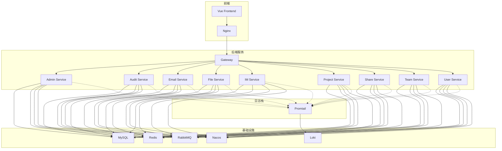
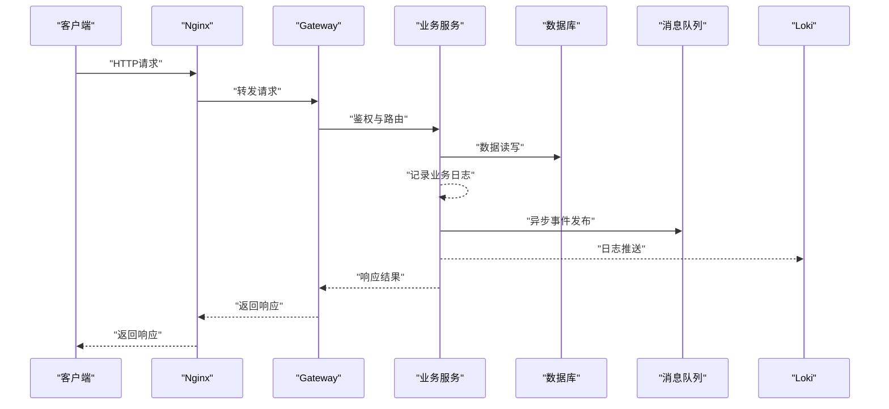
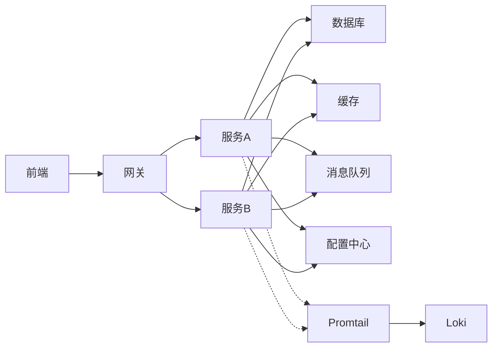

# 日志排查

<cite>
**本文引用的文件**   
- [docker-compose.yml](file://docker-compose.yml)
- [promtail-config.yml](file://deploy/promtail-config.yml)
- [application-common.yml](file://ZXYZdatabaseBack/zxyz-common/src/main/resources/application-common.yml)
- [application-dev.yml（示例）](file://ZXYZdatabaseBack/zxyz-admin-service/src/main/resources/application-dev.yml)
- [application-prod.yml（示例）](file://ZXYZdatabaseBack/zxyz-admin-service/src/main/resources/application-prod.yml)
- [logger.js（前端）](file://ZXYZdatabaseFront/src/utils/logger.js)
- [request.js（前端请求封装）](file://ZXYZdatabaseFront/src/utils/request.js)
- [errorModel.js（前端错误模型）](file://ZXYZdatabaseFront/src/utils/errorModel.js)
- [createApiClient.js（前端API客户端）](file://ZXYZdatabaseFront/src/utils/createApiClient.js)
- [health-check.sh（健康检查脚本）](file://scripts/health-check.sh)
- [validate-env.sh（环境校验脚本）](file://scripts/validate-env.sh)
- [default.conf（Nginx配置）](file://deploy/nginx/default.conf)
- [entrypoint.sh（Nginx入口脚本）](file://deploy/nginx/entrypoint.sh)
- [ci-cd.yml（CI/CD流水线）](file://.github/workflows/ci-cd.yml)
- [build.yml（前端构建）](file://ZXYZdatabaseFront/.github/workflows/build.yml)
- [deploy.yml（前端部署）](file://ZXYZdatabaseFront/.github/workflows/deploy.yml)
</cite>

## 目录
1. [简介](#简介)
2. [项目结构](#项目结构)
3. [核心组件](#核心组件)
4. [架构总览](#架构总览)
5. [详细组件分析](#详细组件分析)
6. [依赖关系分析](#依赖关系分析)
7. [性能注意事项](#性能注意事项)
8. [故障排查指南](#故障排查指南)
9. [结论](#结论)
10. [附录](#附录)

## 简介
本文件面向ZXYZ项目的运维与研发人员，聚焦“日志排查”主题。内容覆盖：
- 常见故障的日志特征：服务启动失败、数据库连接异常、第三方接口超时
- 日志分析方法：关键错误码识别、调用链追踪、依赖关系分析
- 排查工具使用：grep命令、日志过滤技巧、性能分析工具
- 问题定位流程：从现象到根因的分析步骤、快速恢复措施
- 典型故障案例与解决方案库

## 项目结构
ZXYZ采用微服务架构，后端包含多个Maven模块（如admin、audit、email、file、gateway、im、project、share、team、user等），前端为Vue应用。日志采集与展示通过Promtail + Loki实现，容器编排由Docker Compose完成，CI/CD基于GitHub Actions。

图表来源
- [docker-compose.yml](file://docker-compose.yml)
- [promtail-config.yml](file://deploy/promtail-config.yml)

章节来源
- [docker-compose.yml](file://docker-compose.yml)
- [promtail-config.yml](file://deploy/promtail-config.yml)

## 核心组件
- 后端日志框架：各服务统一使用Spring Boot默认日志框架，并通过公共配置（application-common.yml）集中管理日志级别与输出格式。
- 前端日志：前端使用统一的logger工具进行控制台与上报日志，配合错误模型对异常进行分类处理。
- 日志采集：Promtail作为日志采集器，将容器标准输出或文件日志推送到Loki；Nginx访问日志也可被采集。
- 健康检查与环境校验：提供健康检查脚本与环境变量校验脚本，辅助快速发现启动失败与配置缺失问题。

章节来源
- [application-common.yml](file://ZXYZdatabaseBack/zxyz-common/src/main/resources/application-common.yml)
- [logger.js（前端）](file://ZXYZdatabaseFront/src/utils/logger.js)
- [promtail-config.yml](file://deploy/promtail-config.yml)
- [health-check.sh（健康检查脚本）](file://scripts/health-check.sh)
- [validate-env.sh（环境校验脚本）](file://scripts/validate-env.sh)

## 架构总览
整体架构遵循“网关统一入口 + 多业务服务 + 基础设施依赖 + 日志采集”的模式。内部服务间调用通过ServiceClient与鉴权令牌保证安全，异步消息通过RabbitMQ Topic Exchange解耦。日志链路贯穿前后端与基础设施，便于全链路追踪。

图表来源
- [docker-compose.yml](file://docker-compose.yml)
- [promtail-config.yml](file://deploy/promtail-config.yml)

## 详细组件分析

### 后端日志配置与输出
- 统一日志配置：在公共配置文件中定义日志级别、输出目标与格式化规则，确保各服务日志风格一致。
- 环境差异：开发环境与生产环境的配置文件分别设置不同日志级别与输出策略，便于调试与监控。
- 关键路径：各服务的application-*.yml中可覆盖全局配置，注意优先级与生效范围。

章节来源
- [application-common.yml](file://ZXYZdatabaseBack/zxyz-common/src/main/resources/application-common.yml)
- [application-dev.yml（示例）](file://ZXYZdatabaseBack/zxyz-admin-service/src/main/resources/application-dev.yml)
- [application-prod.yml（示例）](file://ZXYZdatabaseBack/zxyz-admin-service/src/main/resources/application-prod.yml)

### 前端日志与错误处理
- 日志工具：前端统一使用logger进行信息、警告与错误日志输出，支持按模块与级别过滤。
- 错误模型：对网络异常、业务异常进行分类，统一转换为Result结构的code与message，便于前端提示与后端排查。
- API客户端：封装请求拦截与响应处理，自动附加鉴权信息与错误上报。

章节来源
- [logger.js（前端）](file://ZXYZdatabaseFront/src/utils/logger.js)
- [errorModel.js（前端错误模型）](file://ZXYZdatabaseFront/src/utils/errorModel.js)
- [createApiClient.js（前端API客户端）](file://ZXYZdatabaseFront/src/utils/createApiClient.js)
- [request.js（前端请求封装）](file://ZXYZdatabaseFront/src/utils/request.js)

### 日志采集与存储
- 采集器：Promtail负责收集容器日志并发送到Loki，支持按标签过滤与查询。
- 存储与查询：Loki提供高效日志存储与检索能力，结合Grafana可实现可视化分析。
- Nginx日志：访问日志与错误日志可通过Promtail采集，便于分析前端请求与网关行为。

章节来源
- [promtail-config.yml](file://deploy/promtail-config.yml)
- [default.conf（Nginx配置）](file://deploy/nginx/default.conf)
- [entrypoint.sh（Nginx入口脚本）](file://deploy/nginx/entrypoint.sh)

### 健康检查与环境校验
- 健康检查：通过脚本检测服务端口、依赖组件状态，快速发现启动失败或服务不可用。
- 环境校验：验证必要环境变量与配置文件是否存在，避免运行时配置缺失导致启动失败。

章节来源
- [health-check.sh（健康检查脚本）](file://scripts/health-check.sh)
- [validate-env.sh（环境校验脚本）](file://scripts/validate-env.sh)

## 依赖关系分析
- 服务间依赖：各业务服务依赖数据库、缓存、消息队列与配置中心，任一依赖异常均可能引发级联故障。
- 前端依赖：前端依赖网关与后端服务，网络异常或鉴权失败将影响用户体验。
- 日志依赖：Promtail依赖文件系统权限与网络连通性，Loki需保证存储可用。

图表来源
- [docker-compose.yml](file://docker-compose.yml)
- [promtail-config.yml](file://deploy/promtail-config.yml)

章节来源
- [docker-compose.yml](file://docker-compose.yml)
- [promtail-config.yml](file://deploy/promtail-config.yml)

## 性能注意事项
- 日志级别：生产环境建议设置为INFO或WARN，避免DEBUG级别产生过多日志影响性能。
- 异步写入：对于高吞吐场景，考虑使用异步日志写入与批量发送，减少I/O阻塞。
- 采样策略：对高频日志进行采样，保留关键错误与慢请求日志，降低存储压力。
- 查询优化：在Loki中使用精确标签与时间范围过滤，避免全量扫描。

## 故障排查指南

### 常见故障的日志特征
- 服务启动失败
  - 现象：容器无法启动或启动后立即退出
  - 日志特征：启动阶段抛出异常堆栈、依赖连接失败、配置文件解析错误
  - 关键点：关注启动日志中的ERROR与FATAL级别，检查依赖组件健康状态
- 数据库连接异常
  - 现象：业务请求频繁失败，数据库操作超时
  - 日志特征：连接池耗尽、认证失败、SQL执行超时、事务回滚
  - 关键点：检查连接池配置、数据库可用性、慢查询日志
- 第三方接口超时
  - 现象：外部服务调用失败，业务逻辑中断
  - 日志特征：HTTP状态码非2xx、超时异常、重试失败
  - 关键点：查看超时配置、重试策略、下游服务状态

### 日志分析方法
- 关键错误码识别
  - 后端：统一Result结构的code字段，1表示成功，其他值代表具体错误类型
  - 前端：错误模型中的code与message字段，用于用户提示与日志上报
- 调用链追踪
  - 通过请求ID或Trace ID关联前后端日志，定位完整调用链路
  - 网关层记录请求入口与出口日志，便于分析路由与鉴权过程
- 依赖关系分析
  - 根据日志中的依赖调用顺序，判断是上游还是下游问题
  - 结合健康检查脚本，确认依赖组件状态

### 排查工具使用
- grep命令
  - 常用模式：grep -E "ERROR|Exception|Timeout" logs.txt
  - 组合过滤：grep -A 5 -B 5 "关键字" logs.txt 查看上下文
- 日志过滤技巧
  - 按服务名、模块、级别过滤，缩小排查范围
  - 使用时间戳与请求ID精确定位特定请求
- 性能分析工具
  - 使用jstack、jmap分析线程与内存问题
  - 结合慢查询日志与数据库监控，定位性能瓶颈

### 问题定位流程
1. 现象确认：收集用户反馈与系统告警，明确故障范围与影响
2. 日志收集：从Loki或本地日志中提取相关日志，按时间与服务筛选
3. 错误分析：识别关键错误码与异常堆栈，初步判断问题类型
4. 依赖检查：验证数据库、缓存、消息队列等依赖组件状态
5. 根因定位：结合调用链与依赖关系，确定根本原因
6. 快速恢复：采取重启、降级、熔断等措施恢复服务
7. 复盘改进：总结问题原因，完善监控与告警机制

### 快速恢复措施
- 服务重启：针对临时性故障，重启服务可快速恢复
- 降级策略：关闭非核心功能，保障核心业务可用
- 熔断保护：对不稳定依赖启用熔断，防止雪崩效应
- 配置回滚：若为配置变更导致，立即回滚至稳定版本

## 结论
通过统一的日志框架、完善的采集与查询能力，以及系统化的排查方法，ZXYZ项目能够有效应对各类故障。建议持续完善监控告警与自动化恢复机制，提升系统稳定性与可维护性。

## 附录

### CI/CD与日志关联
- 构建与部署：CI/CD流水线生成镜像并推送仓库，部署时注入环境变量与配置
- 日志关联：构建ID与部署版本应记录在日志中，便于回溯问题版本

章节来源
- [ci-cd.yml（CI/CD流水线）](file://.github/workflows/ci-cd.yml)
- [build.yml（前端构建）](file://ZXYZdatabaseFront/.github/workflows/build.yml)
- [deploy.yml（前端部署）](file://ZXYZdatabaseFront/.github/workflows/deploy.yml)

### 典型故障案例与解决方案库
- 案例一：服务启动失败
  - 现象：容器启动后立即退出
  - 日志特征：启动阶段抛出配置解析异常
  - 解决方案：检查配置文件语法与必填项，验证环境变量是否正确注入
- 案例二：数据库连接池耗尽
  - 现象：业务请求大量超时
  - 日志特征：连接池获取超时、SQL执行缓慢
  - 解决方案：调整连接池大小，优化慢查询，增加数据库实例
- 案例三：第三方接口超时
  - 现象：外部服务调用失败
  - 日志特征：HTTP超时异常、重试失败
  - 解决方案：增加超时时间，启用重试与熔断，联系第三方服务商