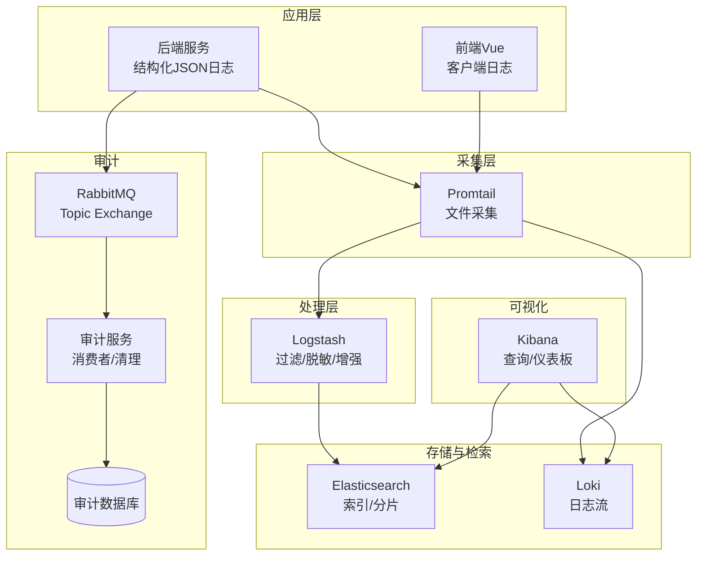
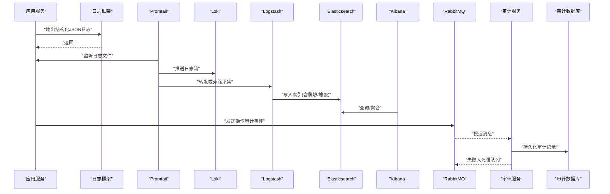
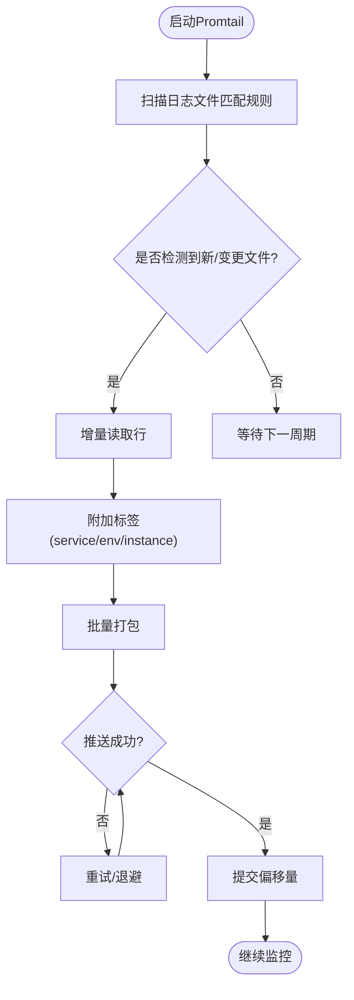
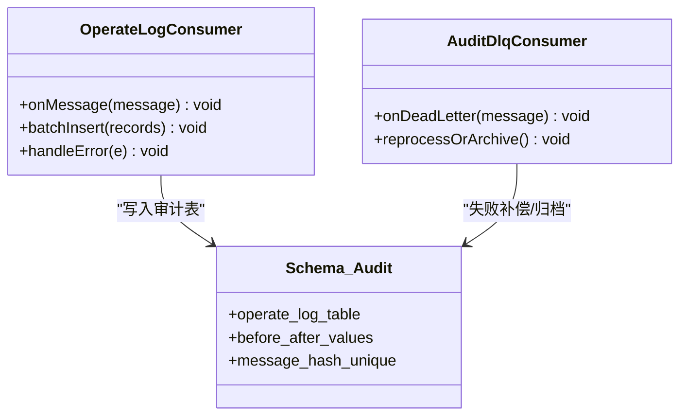
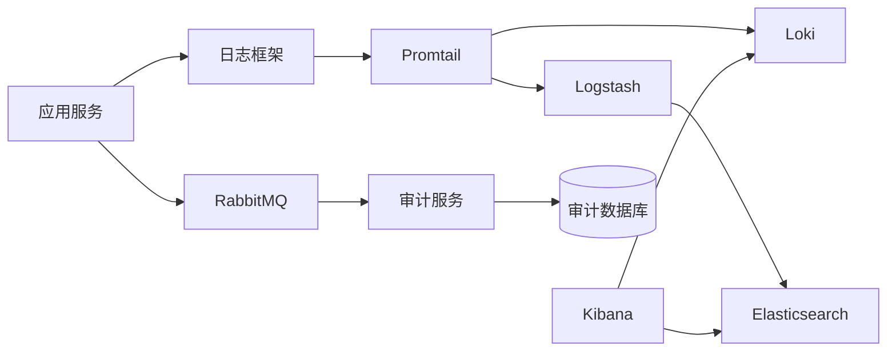

# 日志系统

<cite>
**本文引用的文件**
- [docker-compose.yml](file://docker-compose.yml)
- [promtail-config.yml](file://deploy/promtail-config.yml)
- [application-common.yml](file://ZXYZdatabaseBack/zxyz-common/src/main/resources/application-common.yml)
- [logger.js](file://ZXYZdatabaseFront/src/utils/logger.js)
- [OperateLogConsumer.java](file://ZXYZdatabaseBack/zxyz-audit-service/src/main/java/uno/acloud/audit/mq/OperateLogConsumer.java)
- [AuditDlqConsumer.java](file://ZXYZdatabaseBack/zxyz-audit-service/src/main/java/uno/acloud/audit/mq/AuditDlqConsumer.java)
- [schema_audit.sql](file://ZXYZdatabaseBack/sql/schema_audit.sql)
</cite>

## 目录
1. [简介](#简介)
2. [项目结构](#项目结构)
3. [核心组件](#核心组件)
4. [架构总览](#架构总览)
5. [详细组件分析](#详细组件分析)
6. [依赖关系分析](#依赖关系分析)
7. [性能考虑](#性能考虑)
8. [故障排查指南](#故障排查指南)
9. [结论](#结论)
10. [附录](#附录)

## 简介
本文件为 ZXYZ 项目的日志系统文档，围绕 ELK 日志分析栈、结构化日志格式、采集与处理策略、审计日志规范、以及 Kibana 查询与排障方法进行系统化说明。结合微服务架构（后端多模块 + 前端 Vue），文档覆盖从应用层日志输出、Promtail 采集、Logstash 过滤、Elasticsearch 索引设计到 Kibana 可视化的完整链路，并给出可操作的配置要点与优化建议。

## 项目结构
ZXYZ 的日志体系由以下关键部分构成：
- 应用层日志：后端使用统一日志框架输出结构化 JSON；前端通过工具函数输出客户端日志。
- 采集层：Promtail 以 DaemonSet/容器方式采集各服务日志文件，推送至 Loki。
- 处理层：Logstash 对原始日志进行解析、脱敏、字段增强，写入 Elasticsearch。
- 存储与检索：Elasticsearch 按时间分片索引，支持高吞吐写入与快速检索。
- 可视化与分析：Kibana 提供仪表盘、告警与查询界面。
- 审计日志：异步通过 RabbitMQ 投递操作日志，消费端持久化与清理。

图表来源
- [docker-compose.yml](file://docker-compose.yml)
- [promtail-config.yml](file://deploy/promtail-config.yml)

章节来源
- [docker-compose.yml](file://docker-compose.yml)
- [promtail-config.yml](file://deploy/promtail-config.yml)

## 核心组件
- 结构化日志格式：后端统一输出 JSON，包含时间戳、级别、服务名、实例、TraceId、用户上下文等关键字段；前端输出客户端侧错误与交互事件。
- 采集器 Promtail：按服务划分标签，监控日志文件路径，支持轮转与增量读取，低开销推送至 Loki。
- 过滤器 Logstash：解析 JSON、提取字段、脱敏敏感信息、补充元数据（如环境、版本、租户）。
- 存储层 Elasticsearch：按天/周分片，合理映射字段类型，启用压缩与副本提升可用性。
- 可视化 Kibana：基于索引模式构建仪表盘，常用查询语句与性能优化技巧。
- 审计日志：操作事件经 MQ 异步落库，支持死信队列与清理任务。

章节来源
- [application-common.yml](file://ZXYZdatabaseBack/zxyz-common/src/main/resources/application-common.yml)
- [logger.js](file://ZXYZdatabaseFront/src/utils/logger.js)
- [OperateLogConsumer.java](file://ZXYZdatabaseBack/zxyz-audit-service/src/main/java/uno/acloud/audit/mq/OperateLogConsumer.java)
- [AuditDlqConsumer.java](file://ZXYZdatabaseBack/zxyz-audit-service/src/main/java/uno/acloud/audit/mq/AuditDlqConsumer.java)
- [schema_audit.sql](file://ZXYZdatabaseBack/sql/schema_audit.sql)

## 架构总览
下图展示从应用日志产生到 Kibana 可视化的端到端流程，以及审计日志的异步处理链路。

图表来源
- [docker-compose.yml](file://docker-compose.yml)
- [promtail-config.yml](file://deploy/promtail-config.yml)
- [OperateLogConsumer.java](file://ZXYZdatabaseBack/zxyz-audit-service/src/main/java/uno/acloud/audit/mq/OperateLogConsumer.java)
- [AuditDlqConsumer.java](file://ZXYZdatabaseBack/zxyz-audit-service/src/main/java/uno/acloud/audit/mq/AuditDlqConsumer.java)

## 详细组件分析

### 日志采集：Promtail 配置与文件轮转
- 目标：稳定采集各服务日志文件，避免重复与丢失，支持滚动轮转。
- 关键点：
  - 文件匹配规则：按服务名与容器卷路径匹配，设置 label（如 service、env、instance）。
  - 轮转策略：识别 .log.1, .log.gz 等命名，确保新文件生成时平滑切换。
  - 批处理与缓冲：合理设置批量大小与刷新间隔，平衡吞吐与延迟。
  - 安全与权限：只读挂载日志目录，最小权限原则。
  - 健康检查：监控 Promtail 指标，关注 dropped_entries、client errors。

图表来源
- [promtail-config.yml](file://deploy/promtail-config.yml)

章节来源
- [promtail-config.yml](file://deploy/promtail-config.yml)

### 日志级别控制与结构化格式
- 后端：
  - 统一 JSON 输出，包含必要字段：timestamp、level、service、instance、trace_id、user_id、tenant、msg。
  - 级别控制：开发环境 DEBUG，生产 INFO/WARN/ERROR，关键业务 WARN+。
  - 敏感信息：禁止直接输出密码、密钥、手机号、身份证等；如需记录，必须脱敏或哈希。
- 前端：
  - 客户端日志工具封装，区分 info/warn/error，附带页面路由、用户会话标识。
  - 生产环境限制 verbose 输出，避免泄露敏感上下文。

章节来源
- [application-common.yml](file://ZXYZdatabaseBack/zxyz-common/src/main/resources/application-common.yml)
- [logger.js](file://ZXYZdatabaseFront/src/utils/logger.js)

### 日志处理：Logstash 过滤与字段增强
- 输入：接收 Promtail 推送或文件输入。
- 解析：JSON 解码，提取关键字段；非 JSON 行走备用正则解析。
- 脱敏：对邮箱、手机号、身份证号、银行卡号等字段进行掩码或哈希。
- 增强：注入环境、版本、集群、租户等元数据；标准化时间与时区。
- 输出：写入 Elasticsearch，按服务与日期分索引（如 zxyz-app-{service}-{yyyy.MM.dd}）。

章节来源
- [promtail-config.yml](file://deploy/promtail-config.yml)

### 存储与索引设计：Elasticsearch
- 索引策略：
  - 按服务与日期分片，便于生命周期管理与保留策略。
  - 主分片数根据吞吐设定，副本数保证高可用（生产建议≥1）。
- 映射设计：
  - 文本字段使用 keyword 用于精确匹配与聚合，text 用于全文检索。
  - 数值与时间字段使用 long/date，避免动态映射膨胀。
- 生命周期：
  - ILM 策略：热-温-冷分层，自动滚动与删除过期索引。
  - 压缩与合并：开启压缩，定期 force merge 减少段数量。

章节来源
- [docker-compose.yml](file://docker-compose.yml)

### 可视化与查询：Kibana 使用指南
- 索引模式：按服务前缀创建索引模式，绑定时间字段。
- 常用查询：
  - 按服务与级别筛选：service="file-service" AND level="ERROR"
  - 按 TraceId 追踪：trace_id:"abc123"
  - 时间范围与聚合：按分钟统计 ERROR 数量，定位峰值时段。
- 性能优化：
  - 优先使用 keyword 字段过滤，避免 text 全词匹配。
  - 限制时间窗口，避免跨月大查询。
  - 使用 Saved Queries 与 Dashboard 缓存结果。

章节来源
- [docker-compose.yml](file://docker-compose.yml)

### 审计日志：操作记录规范与合规性
- 事件模型：
  - 操作主体、对象、动作、前后值差异、IP、UA、时间戳。
  - 唯一消息哈希去重，防止重复消费。
- 异步处理：
  - 生产者发送 Topic Exchange 消息，消费者批量写入数据库。
  - 死信队列处理失败消息，人工介入与补偿。
- 合规要求：
  - 敏感字段脱敏存储，访问审计留痕，保留期符合法规。
  - 定期清理历史审计数据，降低存储成本。

图表来源
- [OperateLogConsumer.java](file://ZXYZdatabaseBack/zxyz-audit-service/src/main/java/uno/acloud/audit/mq/OperateLogConsumer.java)
- [AuditDlqConsumer.java](file://ZXYZdatabaseBack/zxyz-audit-service/src/main/java/uno/acloud/audit/mq/AuditDlqConsumer.java)
- [schema_audit.sql](file://ZXYZdatabaseBack/sql/schema_audit.sql)

章节来源
- [OperateLogConsumer.java](file://ZXYZdatabaseBack/zxyz-audit-service/src/main/java/uno/acloud/audit/mq/OperateLogConsumer.java)
- [AuditDlqConsumer.java](file://ZXYZdatabaseBack/zxyz-audit-service/src/main/java/uno/acloud/audit/mq/AuditDlqConsumer.java)
- [schema_audit.sql](file://ZXYZdatabaseBack/sql/schema_audit.sql)

## 依赖关系分析
- 应用服务依赖日志框架输出结构化日志。
- Promtail 依赖文件系统与容器卷挂载，向 Loki/Logstash 推送。
- Logstash 依赖上游输入与下游 ES 连接，执行过滤与增强。
- Kibana 依赖 ES 与 Loki 的数据源。
- 审计服务依赖 RabbitMQ 与数据库，实现异步持久化与清理。

图表来源
- [docker-compose.yml](file://docker-compose.yml)
- [promtail-config.yml](file://deploy/promtail-config.yml)

章节来源
- [docker-compose.yml](file://docker-compose.yml)
- [promtail-config.yml](file://deploy/promtail-config.yml)

## 性能考虑
- 采集层：
  - 调整 Promtail 批大小与刷新间隔，避免频繁小批次。
  - 使用 label 精简，减少 Loki 存储压力。
- 处理层：
  - Logstash 管道并行度与线程池调优，避免背压。
  - 脱敏规则尽量在解析阶段完成，减少后续处理开销。
- 存储层：
  - ES 分片与副本数平衡，避免过小分片导致元数据膨胀。
  - ILM 策略自动化管理冷热数据，降低查询成本。
- 查询层：
  - 使用 keyword 字段过滤，避免 text 全匹配。
  - 限制时间范围与分页深度，避免慢查询。

## 故障排查指南
- 采集问题：
  - 检查 Promtail 日志与指标，确认文件匹配与权限。
  - 验证容器卷挂载与轮转命名是否符合预期。
- 处理问题：
  - 查看 Logstash 管道状态与错误日志，确认解析规则。
  - 检查 ES 写入速率与拒绝原因（如 mapping 冲突）。
- 查询问题：
  - 确认索引模式与时间字段绑定正确。
  - 使用 _cat/indices 与 _cluster/health 检查集群状态。
- 审计问题：
  - 监控 MQ 消费延迟与死信队列积压。
  - 校验去重哈希与幂等逻辑，避免重复写入。

章节来源
- [promtail-config.yml](file://deploy/promtail-config.yml)
- [OperateLogConsumer.java](file://ZXYZdatabaseBack/zxyz-audit-service/src/main/java/uno/acloud/audit/mq/OperateLogConsumer.java)
- [AuditDlqConsumer.java](file://ZXYZdatabaseBack/zxyz-audit-service/src/main/java/uno/acloud/audit/mq/AuditDlqConsumer.java)

## 结论
ZXYZ 的日志体系以结构化输出为基础，通过 Promtail 高效采集、Logstash 灵活处理、Elasticsearch 可靠存储与 Kibana 直观可视化，形成闭环。审计日志采用异步 MQ 模式，兼顾性能与合规。建议在部署与运维中持续优化采集与处理参数，完善索引设计与查询策略，保障系统在大规模场景下的稳定性与可观测性。

## 附录
- 术语表：ELK（Elasticsearch、Logstash、Kibana）、Loki、Promtail、ILM、TraceId、Projection VO。
- 参考配置位置：
  - 应用日志配置：[application-common.yml](file://ZXYZdatabaseBack/zxyz-common/src/main/resources/application-common.yml)
  - 前端日志工具：[logger.js](file://ZXYZdatabaseFront/src/utils/logger.js)
  - 采集配置：[promtail-config.yml](file://deploy/promtail-config.yml)
  - 审计消费者：[OperateLogConsumer.java](file://ZXYZdatabaseBack/zxyz-audit-service/src/main/java/uno/acloud/audit/mq/OperateLogConsumer.java)、[AuditDlqConsumer.java](file://ZXYZdatabaseBack/zxyz-audit-service/src/main/java/uno/acloud/audit/mq/AuditDlqConsumer.java)
  - 审计表结构：[schema_audit.sql](file://ZXYZdatabaseBack/sql/schema_audit.sql)