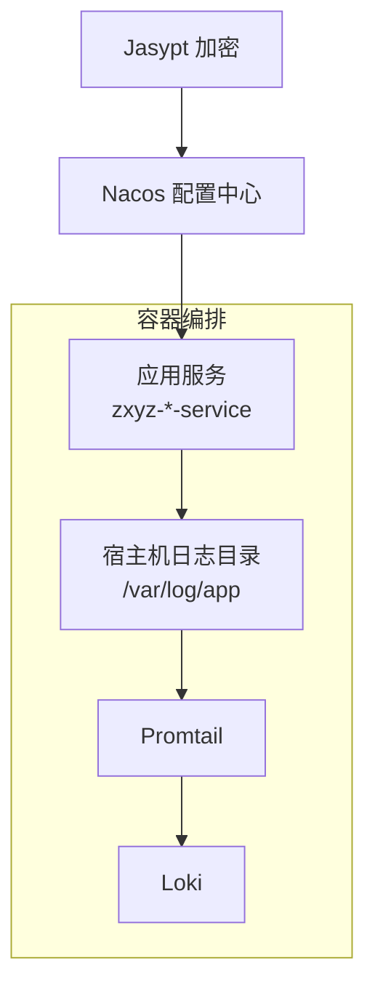
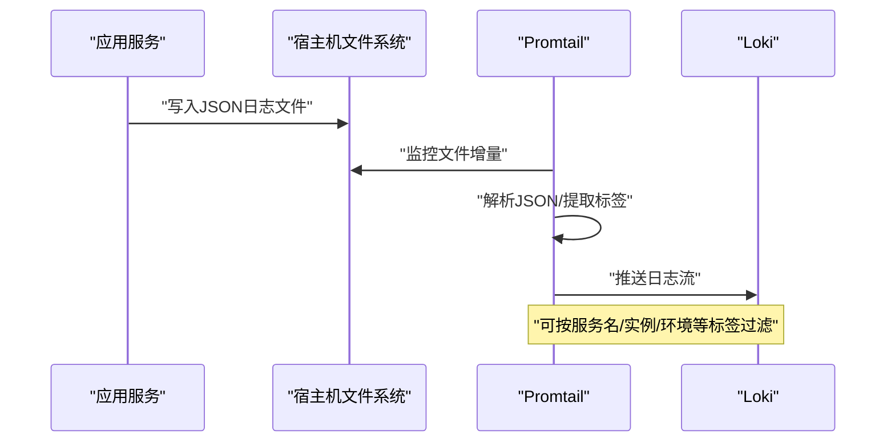
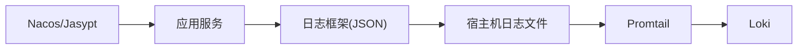

# 日志采集

<cite>
**本文引用的文件**   
- [promtail-config.yml](file://deploy/promtail-config.yml)
- [docker-compose.yml](file://docker-compose.yml)
- [application-common.yml](file://ZXYZdatabaseBack/zxyz-common/src/main/resources/application-common.yml)
- [application-dev.yml（admin-service）](file://ZXYZdatabaseBack/zxyz-admin-service/src/main/resources/application-dev.yml)
- [application-prod.yml（admin-service）](file://ZXYZdatabaseBack/zxyz-admin-service/src/main/resources/application-prod.yml)
- [application.yml（gateway）](file://ZXYZdatabaseBack/zxyz-gateway/src/main/resources/application.yml)
- [application.yml（im-service）](file://ZXYZdatabaseBack/zxyz-im-service/src/main/resources/application.yml)
- [application.yml（email-service）](file://ZXYZdatabaseBack/zxyz-email-service/src/main/resources/application.yml)
- [application.yml（file-service）](file://ZXYZdatabaseBack/zxyz-file-service/src/main/resources/application.yml)
- [application.yml（project-service）](file://ZXYZdatabaseBack/zxyz-project-service/src/main/resources/application.yml)
- [application.yml（team-service）](file://ZXYZdatabaseBack/zxyz-team-service/src/main/resources/application.yml)
- [application.yml（user-service）](file://ZXYZdatabaseBack/zxyz-user-service/src/main/resources/application.yml)
- [application.yml（share-service）](file://ZXYZdatabaseBack/zxyz-share-service/src/main/resources/application.yml)
- [application.yml（audit-service）](file://ZXYZdatabaseBack/zxyz-audit-service/src/main/resources/application.yml)
- [application.yml（config-service）](file://ZXYZdatabaseBack/zxyz-admin-service/src/main/resources/application.yml)
- [application.yml（common）](file://ZXYZdatabaseBack/zxyz-common/src/main/resources/application-common.yml)
</cite>

## 目录
1. [简介](#简介)
2. [项目结构](#项目结构)
3. [核心组件](#核心组件)
4. [架构总览](#架构总览)
5. [详细组件分析](#详细组件分析)
6. [依赖关系分析](#依赖关系分析)
7. [性能考虑](#性能考虑)
8. [故障排查指南](#故障排查指南)
9. [结论](#结论)
10. [附录](#附录)

## 简介
本文件面向 ZXYZ 项目的日志采集与治理，覆盖 Promtail 配置、文件监控规则、日志格式解析规范、各服务统一输出规范（结构化 JSON、级别控制）、异常处理日志（全局异常捕获、堆栈记录、请求上下文）、日志轮转策略（大小限制、保留策略、压缩），以及采集性能优化与常见问题排查方法。目标是让运维与研发同学快速落地可观测性方案，确保生产环境日志“采得到、看得懂、查得快”。

## 项目结构
- 后端为多模块 Maven 工程，每个服务均包含 application.yml 及 dev/prod 环境配置；公共日志基础配置集中在 zxyz-common 的 application-common.yml。
- 部署编排使用 Docker Compose，包含基础设施、后端服务、前端 Nginx 以及日志栈（Promtail + Loki）。
- Promtail 配置文件位于 deploy/promtail-config.yml，用于定义本地日志文件采集与向 Loki 推送的规则。

图表来源
- [docker-compose.yml](file://docker-compose.yml)
- [promtail-config.yml](file://deploy/promtail-config.yml)

章节来源
- [docker-compose.yml](file://docker-compose.yml)
- [promtail-config.yml](file://deploy/promtail-config.yml)

## 核心组件
- Promtail：负责在宿主机上按规则扫描并采集日志文件，转换为 Loki 可接收的流式数据。
- Loki：日志聚合与索引存储，提供查询与分析能力。
- 应用服务：统一输出结构化 JSON 日志，便于 Promtail 解析与 Loki 索引。
- Nacos/Jasypt：集中管理配置与敏感信息，保证不同环境一致的日志行为。

章节来源
- [promtail-config.yml](file://deploy/promtail-config.yml)
- [application-common.yml](file://ZXYZdatabaseBack/zxyz-common/src/main/resources/application-common.yml)

## 架构总览
下图展示了从应用服务到 Loki 的完整日志链路：应用输出 JSON 日志 → 写入宿主机文件 → Promtail 监控文件增量 → 解析并推送到 Loki → 上层通过查询/告警消费。

图表来源
- [promtail-config.yml](file://deploy/promtail-config.yml)
- [docker-compose.yml](file://docker-compose.yml)

## 详细组件分析

### Promtail 配置结构与文件监控规则
- 目标定位：基于路径匹配收集各服务的日志文件，通常以 /var/log/app/*.log 或按服务分目录形式存在。
- 流水线阶段：
  - 读取阶段：按 glob 表达式发现文件，支持增量读取与断点续传。
  - 解析阶段：将每行 JSON 文本解析为字段，提取关键字段作为 Loki 标签（如 service、level、instance、traceId 等）。
  - 转发阶段：将结构化条目发送到 Loki，附带标签以便检索。
- 关键要点：
  - 文件轮转后需识别新文件并继续采集。
  - 对非 JSON 行应降级为纯文本模式，避免中断采集。
  - 合理设置批大小与刷新间隔，平衡吞吐与延迟。

章节来源
- [promtail-config.yml](file://deploy/promtail-config.yml)

### 日志格式解析与结构化输出规范
- 统一格式：所有服务输出 JSON 单行日志，包含必要字段：时间戳、级别、服务名、实例标识、线程、消息体、可选 traceId/correlationId。
- 字段建议：
  - level：INFO/WARN/ERROR/FATAL 等
  - service：服务名（如 zxyz-admin-service）
  - instance：实例标识（主机名/IP+端口）
  - traceId：链路追踪 ID（网关/拦截器注入）
  - msg：业务消息
- 解析策略：Promtail 根据 JSON 键映射为 Loki 标签，常用 service、level、traceId 作为高频过滤维度。

章节来源
- [application-common.yml](file://ZXYZdatabaseBack/zxyz-common/src/main/resources/application-common.yml)

### 各服务日志输出规范
- 统一日志框架：推荐 SLF4J + Logback，启用 JSON 编码器（如 logstash-logback-encoder 或内置 JSON Layout）。
- 级别控制：开发环境 DEBUG，生产 INFO/WARN/ERROR，避免在生产输出 DEBUG 日志。
- 上下文注入：
  - 网关层注入 traceId 到请求头，下游透传。
  - 异常捕获时附加请求上下文（URL、参数摘要、用户标识等，注意脱敏）。
- 示例参考（仅说明位置，不展示代码内容）：
  - 网关 traceId 注入与透传逻辑参考 gateway 的 application.yml 与过滤器实现。
  - 各服务日志初始化与 JSON 布局参考各自 application.yml 与 common 公共配置。

章节来源
- [application.yml（gateway）](file://ZXYZdatabaseBack/zxyz-gateway/src/main/resources/application.yml)
- [application.yml（im-service）](file://ZXYZdatabaseBack/zxyz-im-service/src/main/resources/application.yml)
- [application.yml（email-service）](file://ZXYZdatabaseBack/zxyz-email-service/src/main/resources/application.yml)
- [application.yml（file-service）](file://ZXYZdatabaseBack/zxyz-file-service/src/main/resources/application.yml)
- [application.yml（project-service）](file://ZXYZdatabaseBack/zxyz-project-service/src/main/resources/application.yml)
- [application.yml（team-service）](file://ZXYZdatabaseBack/zxyz-team-service/src/main/resources/application.yml)
- [application.yml（user-service）](file://ZXYZdatabaseBack/zxyz-user-service/src/main/resources/application.yml)
- [application.yml（share-service）](file://ZXYZdatabaseBack/zxyz-share-service/src/main/resources/application.yml)
- [application.yml（audit-service）](file://ZXYZdatabaseBack/zxyz-audit-service/src/main/resources/application.yml)
- [application.yml（config-service）](file://ZXYZdatabaseBack/zxyz-admin-service/src/main/resources/application.yml)
- [application.yml（common）](file://ZXYZdatabaseBack/zxyz-common/src/main/resources/application-common.yml)

### 异常处理日志（全局异常捕获、堆栈、上下文）
- 全局异常处理器：在服务层或 Web 层统一捕获未处理异常，记录 ERROR 级别日志，包含异常类型、消息与堆栈。
- 请求上下文：在异常日志中补充请求 URL、方法、客户端 IP、用户标识、traceId 等，便于问题定位。
- 安全注意：避免在日志中输出敏感信息（密码、密钥、完整请求体），必要时进行脱敏。
- 建议流程：
  - 捕获异常 → 构造结构化错误日志 → 返回统一响应体（code 与 message）→ 可选上报监控/告警。

章节来源
- [application.yml（common）](file://ZXYZdatabaseBack/zxyz-common/src/main/resources/application-common.yml)

### 日志轮转策略（文件大小、保留策略、压缩）
- 文件轮转：按大小或时间滚动，避免单文件过大影响 Promtail 读取与磁盘占用。
- 保留策略：保留最近 N 天或最多 M 个历史文件，及时清理过期日志。
- 压缩：对归档日志启用 gzip 压缩，降低存储空间占用。
- 与 Promtail 协同：确保轮转后的新文件名能被 Promtail 的 glob 规则匹配，避免漏采。

章节来源
- [application-dev.yml（admin-service）](file://ZXYZdatabaseBack/zxyz-admin-service/src/main/resources/application-dev.yml)
- [application-prod.yml（admin-service）](file://ZXYZdatabaseBack/zxyz-admin-service/src/main/resources/application-prod.yml)

## 依赖关系分析
- 应用服务依赖日志框架与 JSON 编码器，输出结构化日志。
- Promtail 依赖文件系统与 Loki 服务端，负责采集与转发。
- Nacos/Jasypt 影响运行时配置（如日志级别、采样率、外部化配置项）。

图表来源
- [docker-compose.yml](file://docker-compose.yml)
- [application-common.yml](file://ZXYZdatabaseBack/zxyz-common/src/main/resources/application-common.yml)

章节来源
- [docker-compose.yml](file://docker-compose.yml)
- [application-common.yml](file://ZXYZdatabaseBack/zxyz-common/src/main/resources/application-common.yml)

## 性能考虑
- 应用侧
  - 使用异步日志（如 Logback AsyncAppender）减少 IO 阻塞。
  - 控制日志级别与采样率，生产环境避免 DEBUG。
  - 避免在热点路径打印大对象或重复日志。
- Promtail 侧
  - 调整批大小与刷新间隔，提升吞吐。
  - 合理设置文件监控频率，避免频繁 stat 开销。
  - 使用标签精简策略，减少索引体积。
- 存储侧
  - Loki 端设置合理的 retention 与压缩策略。
  - 监控磁盘 I/O 与内存使用，防止背压。

[本节为通用指导，不直接分析具体文件]

## 故障排查指南
- 无法采集日志
  - 检查 Promtail 是否运行、权限是否足够、glob 路径是否正确。
  - 确认应用日志输出到预期目录且文件未被移动或删除。
- 解析失败
  - 校验 JSON 格式，确保每行独立有效。
  - 检查 Promtail 解析阶段字段映射是否与输出一致。
- 日志缺失或乱序
  - 检查轮转策略是否导致文件重命名未被识别。
  - 确认网络到 Loki 的连接与认证配置。
- 性能问题
  - 观察 Promtail CPU/内存与 Loki 写入延迟。
  - 调整批大小、刷新间隔与并发度。

章节来源
- [promtail-config.yml](file://deploy/promtail-config.yml)
- [docker-compose.yml](file://docker-compose.yml)

## 结论
通过统一的 JSON 日志规范、Promtail 精准采集与 Loki 聚合，ZXYZ 项目可实现高效、可靠的日志可观测性。配合 Nacos/Jasypt 的配置管理与严格的异常处理规范，能够在生产环境中快速定位问题、保障稳定性。建议在上线前完成日志规范评审与采集链路验证，持续优化采集与存储策略。

## 附录
- 常见标签建议：service、level、instance、traceId、env、host
- 查询示例思路：按 service 与 level 过滤，结合 traceId 串联调用链
- 合规提示：日志脱敏、最小化原则、访问审计

[本节为通用指导，不直接分析具体文件]