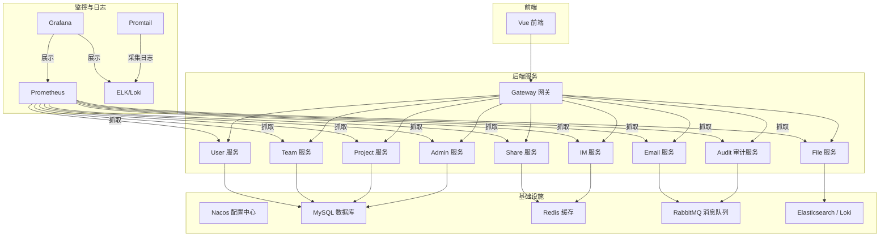
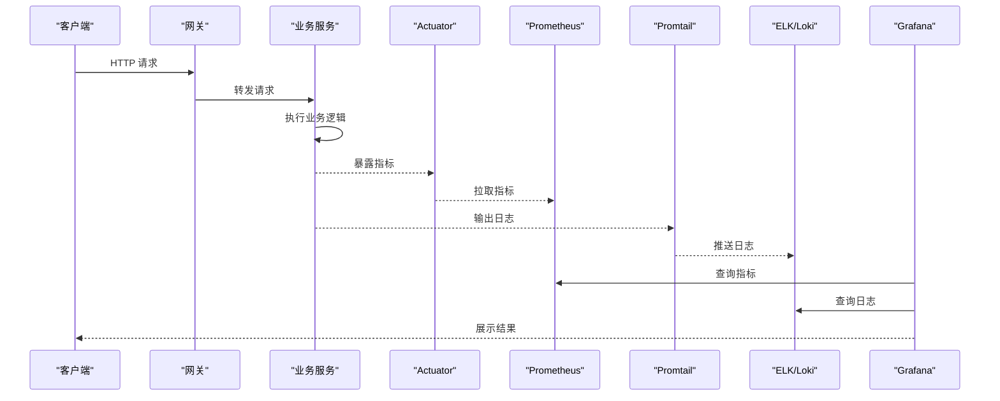
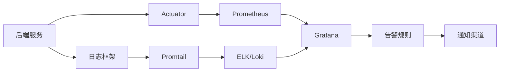

# 监控日志体系

<cite>
**本文引用的文件**
- [docker-compose.yml](file://docker-compose.yml)
- [promtail-config.yml](file://deploy/promtail-config.yml)
- [nginx/default.conf](file://deploy/nginx/default.conf)
- [zxyz-dynamic.yml](file://nacos-config/zxyz-dynamic.yml)
- [zxyz-static.yml](file://nacos-config/zxyz-static.yml)
- [application.yml（通用）](file://ZXYZdatabaseBack/zxyz-common/src/main/resources/application-common.yml)
- [application-dev.yml（示例服务）](file://ZXYZdatabaseBack/zxyz-admin-service/src/main/resources/application-dev.yml)
- [application-prod.yml（示例服务）](file://ZXYZdatabaseBack/zxyz-admin-service/src/main/resources/application-prod.yml)
- [RabbitMqConfig.java](file://ZXYZdatabaseBack/zxyz-audit-service/src/main/java/uno/acloud/audit/config/RabbitMqConfig.java)
- [OperateLogConsumer.java](file://ZXYZdatabaseBack/zxyz-audit-service/src/main/java/uno/acloud/audit/mq/OperateLogConsumer.java)
- [AuditDlqConsumer.java](file://ZXYZdatabaseBack/zxyz-audit-service/src/main/java/uno/acloud/audit/mq/AuditDlqConsumer.java)
- [TaskState.java](file://ZXYZdatabaseBack/zxyz-web-tools/src/main/java/uno/acloud/monitor/platform/web/tools/threadPool/TaskState.java)
- [health-check.sh](file://scripts/health-check.sh)
- [CI/CD 工作流](file://.github/workflows/ci-cd.yml)
- [前端日志工具](file://ZXYZdatabaseFront/src/utils/logger.js)
</cite>

## 目录
1. [简介](#简介)
2. [项目结构](#项目结构)
3. [核心组件](#核心组件)
4. [架构总览](#架构总览)
5. [详细组件分析](#详细组件分析)
6. [依赖关系分析](#依赖关系分析)
7. [性能考量](#性能考量)
8. [故障排查指南](#故障排查指南)
9. [结论](#结论)
10. [附录](#附录)

## 简介
本文件为 ZXYZ 项目的监控与日志体系设计文档，覆盖以下方面：
- 指标采集与可视化：Prometheus 指标收集、Grafana 面板规划
- 告警规则：阈值告警、错误率告警、队列积压告警等
- 日志采集与分析：ELK（Elasticsearch + Logstash + Kibana）或 Loki/Promtail 方案，结构化日志格式、日志轮转策略
- 健康检查：服务探针、依赖服务检查、数据库连接池监控
- 性能监控：JVM 指标、数据库慢查询、Redis 命中率、消息队列积压
- 告警通知：邮件、钉钉机器人、Slack 集成
- 监控数据解读、瓶颈定位与容量规划建议

## 项目结构
ZXYZ 采用微服务架构，后端包含多个 Maven 模块（如 admin、audit、email、file、gateway、im、project、share、team、user），前端为 Vue 应用。部署使用 Docker Compose 编排容器，Nacos 管理配置与服务注册，Promtail 采集日志，Prometheus 采集指标，Grafana 可视化。

图表来源
- [docker-compose.yml](file://docker-compose.yml)
- [promtail-config.yml](file://deploy/promtail-config.yml)

章节来源
- [docker-compose.yml](file://docker-compose.yml)
- [promtail-config.yml](file://deploy/promtail-config.yml)

## 核心组件
- 指标采集与可视化
  - Prometheus：通过 Spring Boot Actuator 暴露 /actuator/prometheus 端点，定时抓取各服务 JVM、HTTP、DB、Redis、MQ 指标
  - Grafana：统一看板，展示系统健康、业务指标、性能趋势与告警状态
- 日志采集与分析
  - Promtail：采集容器标准输出与应用日志文件，转发至 ELK 或 Loki
  - 结构化日志：统一 JSON 格式，包含 traceId、service、level、message、duration、method、uri、status 等字段
- 健康检查
  - 服务探针：Spring Boot Actuator health、自定义健康检查（DB、Redis、RabbitMQ）
  - 脚本化检查：health-check.sh 定期探测关键依赖可用性
- 告警与通知
  - Alertmanager：基于 Prometheus 规则触发告警，支持邮件、钉钉、Slack 通知
  - 告警规则：错误率、延迟、资源使用、队列积压、连接池耗尽等

章节来源
- [application-common.yml](file://ZXYZdatabaseBack/zxyz-common/src/main/resources/application-common.yml)
- [application-dev.yml（示例服务）](file://ZXYZdatabaseBack/zxyz-admin-service/src/main/resources/application-dev.yml)
- [application-prod.yml（示例服务）](file://ZXYZdatabaseBack/zxyz-admin-service/src/main/resources/application-prod.yml)
- [health-check.sh](file://scripts/health-check.sh)

## 架构总览
整体监控与日志架构分为四层：
- 数据采集层：Actuator 指标、Promtail 日志、外部依赖探针
- 数据存储层：Prometheus 时序数据、ELK/Loki 日志存储
- 分析与可视化层：Grafana 看板、告警规则引擎
- 通知与响应层：邮件、钉钉、Slack 告警通道

图表来源
- [docker-compose.yml](file://docker-compose.yml)
- [promtail-config.yml](file://deploy/promtail-config.yml)

## 详细组件分析

### 指标采集与可视化（Prometheus + Grafana）
- 指标来源
  - JVM 指标：内存、GC、线程、类加载
  - HTTP 指标：请求数、延迟、错误率
  - DB 指标：连接池、慢查询、事务耗时
  - Redis 指标：命中率、内存、连接数
  - MQ 指标：队列长度、消费速率、死信队列
- 采集方式
  - Spring Boot Actuator 暴露 /actuator/prometheus
  - Prometheus 定时抓取，按服务实例维度打标
- 可视化
  - Grafana 统一看板，分服务、分环境展示
  - 关键面板：系统健康、业务吞吐、错误率、资源使用、依赖健康

章节来源
- [application-common.yml](file://ZXYZdatabaseBack/zxyz-common/src/main/resources/application-common.yml)
- [application-dev.yml（示例服务）](file://ZXYZdatabaseBack/zxyz-admin-service/src/main/resources/application-dev.yml)
- [application-prod.yml（示例服务）](file://ZXYZdatabaseBack/zxyz-admin-service/src/main/resources/application-prod.yml)

### 日志采集与分析（ELK/Loki + Promtail）
- 采集策略
  - Promtail 采集容器 stdout/stderr 与应用日志文件
  - 结构化日志：JSON 格式，包含 traceId、service、level、message、duration、method、uri、status
- 存储与检索
  - ELK：Elasticsearch 存储，Kibana 检索与可视化
  - Loki：轻量级日志聚合，与 Prometheus 标签对齐
- 日志轮转
  - 按大小与时间切分，保留周期可配置
  - 压缩归档，清理过期日志

章节来源
- [promtail-config.yml](file://deploy/promtail-config.yml)
- [application-common.yml](file://ZXYZdatabaseBack/zxyz-common/src/main/resources/application-common.yml)

### 健康检查与依赖探针
- 服务健康
  - Actuator health 端点：DB、Redis、RabbitMQ 连通性检查
  - 自定义健康检查：连接池状态、队列积压、磁盘空间
- 脚本化检查
  - health-check.sh 定期探测关键依赖可用性，返回状态码
- 探针集成
  - Kubernetes liveness/readiness 探针或 Docker 健康检查

章节来源
- [health-check.sh](file://scripts/health-check.sh)
- [application-common.yml](file://ZXYZdatabaseBack/zxyz-common/src/main/resources/application-common.yml)

### 性能监控（JVM、DB、Redis、MQ）
- JVM 监控
  - 内存使用、GC 次数与耗时、线程池状态、类加载统计
- 数据库监控
  - 连接池大小、活跃连接、等待时间、慢查询统计
- Redis 监控
  - 命中率、内存使用、键数量、命令耗时
- 消息队列监控
  - 队列长度、消费速率、重试次数、死信队列堆积

章节来源
- [application-common.yml](file://ZXYZdatabaseBack/zxyz-common/src/main/resources/application-common.yml)
- [RabbitMqConfig.java](file://ZXYZdatabaseBack/zxyz-audit-service/src/main/java/uno/acloud/audit/config/RabbitMqConfig.java)
- [OperateLogConsumer.java](file://ZXYZdatabaseBack/zxyz-audit-service/src/main/java/uno/acloud/audit/mq/OperateLogConsumer.java)
- [AuditDlqConsumer.java](file://ZXYZdatabaseBack/zxyz-audit-service/src/main/java/uno/acloud/audit/mq/AuditDlqConsumer.java)

### 告警规则与通知
- 告警规则
  - 错误率 > 5% 持续 5 分钟
  - P95 延迟 > 2s 持续 10 分钟
  - JVM 堆内存使用 > 85% 持续 5 分钟
  - Redis 命中率 < 90% 持续 10 分钟
  - 队列积压 > 1000 条持续 5 分钟
- 通知渠道
  - 邮件：SMTP 配置，支持多收件人
  - 钉钉机器人：Webhook 地址、签名校验
  - Slack：Incoming Webhook 或 Bot Token

章节来源
- [application-common.yml](file://ZXYZdatabaseBack/zxyz-common/src/main/resources/application-common.yml)
- [application-dev.yml（示例服务）](file://ZXYZdatabaseBack/zxyz-admin-service/src/main/resources/application-dev.yml)
- [application-prod.yml（示例服务）](file://ZXYZdatabaseBack/zxyz-admin-service/src/main/resources/application-prod.yml)

### 前端监控与日志
- 前端日志
  - logger.js 封装统一日志输出，支持级别过滤与上报
- 性能埋点
  - 页面加载时间、API 调用耗时、错误捕获与上报

章节来源
- [前端日志工具](file://ZXYZdatabaseFront/src/utils/logger.js)

## 依赖关系分析
监控与日志体系依赖以下组件：
- 服务层：Spring Boot Actuator、日志框架（Logback/Log4j2）、客户端库（JDBC、Redis、RabbitMQ）
- 采集层：Prometheus、Promtail
- 存储层：Elasticsearch/Loki、Prometheus TSDB
- 可视化层：Grafana
- 通知层：Alertmanager、邮件、钉钉、Slack

图表来源
- [docker-compose.yml](file://docker-compose.yml)
- [promtail-config.yml](file://deploy/promtail-config.yml)

章节来源
- [docker-compose.yml](file://docker-compose.yml)
- [promtail-config.yml](file://deploy/promtail-config.yml)

## 性能考量
- 指标采样频率：默认 15s，高负载场景可调至 30s
- 日志采集：异步写入，避免阻塞主流程；结构化日志减少解析开销
- 存储容量：Prometheus 保留 15 天，ELK/Loki 保留 30 天，按需调整
- 告警风暴：去重、抑制、分组，避免通知过载
- 资源隔离：监控组件独立部署，避免与业务争抢资源

[本节为通用指导，不直接分析具体文件]

## 故障排查指南
- 服务不可用
  - 检查 Actuator health 端点与依赖探针
  - 查看 Prometheus 抓取状态与目标健康
- 日志缺失
  - 确认 Promtail 配置与路径映射
  - 检查容器 stdout/stderr 输出与日志轮转
- 告警未触发
  - 验证告警规则语法与阈值
  - 检查通知渠道配置与网络连通性
- 性能瓶颈
  - 分析 JVM GC 与内存曲线
  - 查看 DB 慢查询与连接池状态
  - 检查 Redis 命中率与 MQ 积压

章节来源
- [health-check.sh](file://scripts/health-check.sh)
- [promtail-config.yml](file://deploy/promtail-config.yml)
- [application-common.yml](file://ZXYZdatabaseBack/zxyz-common/src/main/resources/application-common.yml)

## 结论
ZXYZ 的监控与日志体系以 Prometheus 与 ELK/Loki 为核心，结合 Actuator 与 Promtail 实现全栈可观测性。通过结构化日志、健康探针与告警规则，能够快速定位问题并保障系统稳定性。建议持续优化指标粒度、日志结构与告警策略，提升运维效率与用户体验。

[本节为总结，不直接分析具体文件]

## 附录
- CI/CD 集成：GitHub Actions 构建与推送镜像，支持选择性构建
- 配置管理：Nacos 动态配置，区分 dev/prod 环境
- 安全加固：敏感配置加密（Jasypt），内部接口鉴权（Sa-Token）

章节来源
- [CI/CD 工作流](file://.github/workflows/ci-cd.yml)
- [zxyz-dynamic.yml](file://nacos-config/zxyz-dynamic.yml)
- [zxyz-static.yml](file://nacos-config/zxyz-static.yml)