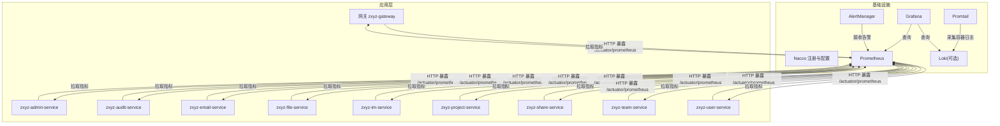
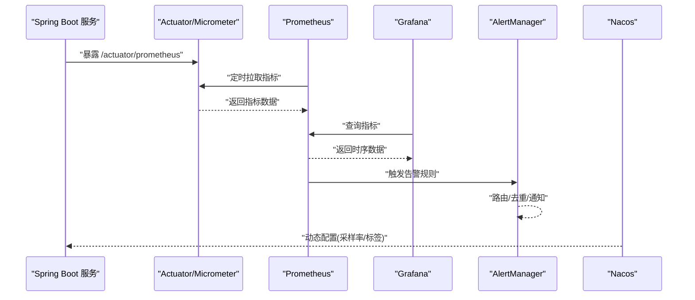
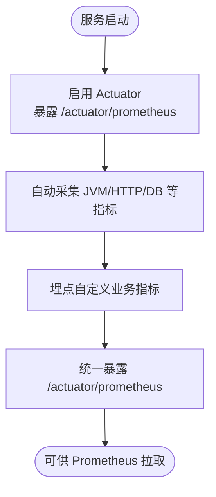
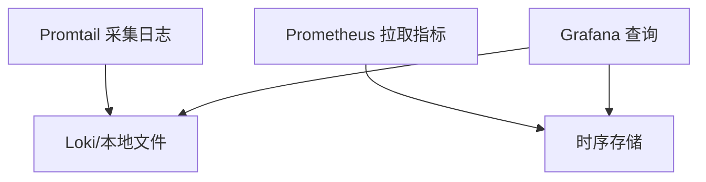
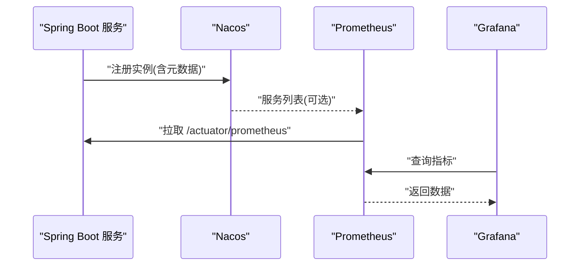
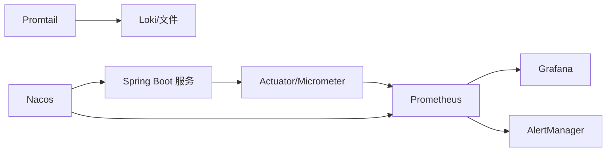

# 监控架构设计

<cite>
**本文引用的文件**   
- [docker-compose.yml](file://docker-compose.yml)
- [docker-compose.dev.yml](file://docker-compose.dev.yml)
- [nacos-config/zxyz-dynamic.yml](file://nacos-config/zxyz-dynamic.yml)
- [nacos-config/zxyz-static.yml](file://nacos-config/zxyz-static.yml)
- [ZXYZdatabaseBack/pom.xml](file://ZXYZdatabaseBack/pom.xml)
- [ZXYZdatabaseBack/ZxyzAdminApplication.java](file://ZXYZdatabaseBack/zxyz-admin-service/src/main/java/uno/acloud/admin/ZxyzAdminApplication.java)
- [ZXYZdatabaseBack/ZxyzAuditServiceApplication.java](file://ZXYZdatabaseBack/zxyz-audit-service/src/main/java/uno/acloud/audit/ZxyzAuditServiceApplication.java)
- [ZXYZdatabaseBack/ZxyzEmailApplication.java](file://ZXYZdatabaseBack/zxyz-email-service/src/main/java/uno/acloud/email/ZxyzEmailApplication.java)
- [ZXYZdatabaseBack/ZxyzFileApplication.java](file://ZXYZdatabaseBack/zxyz-file-service/src/main/java/uno/acloud/file/ZxyzFileApplication.java)
- [ZXYZdatabaseBack/ZxyzGatewayApplication.java](file://ZXYZdatabaseBack/zxyz-gateway/src/main/java/uno/acloud/gateway/ZxyzGatewayApplication.java)
- [ZXYZdatabaseBack/ZxyzImApplication.java](file://ZXYZdatabaseBack/zxyz-im-service/src/main/java/uno/acloud/im/ZxyzImApplication.java)
- [ZXYZdatabaseBack/ZxyzProjectServiceApplication.java](file://ZXYZdatabaseBack/zxyz-project-service/src/main/java/uno/acloud/project/ZxyzProjectServiceApplication.java)
- [ZXYZdatabaseBack/ZxyzShareApplication.java](file://ZXYZdatabaseBack/zxyz-share-service/src/main/java/uno/acloud/share/ZxyzShareApplication.java)
- [ZXYZdatabaseBack/ZxyzTeamServiceApplication.java](file://ZXYZdatabaseBack/zxyz-team-service/src/main/java/uno/acloud/team/ZxyzTeamServiceApplication.java)
- [ZXYZdatabaseBack/ZxyzUserApplication.java](file://ZXYZdatabaseBack/zxyz-user-service/src/main/java/uno/acloud/user/ZxyzUserApplication.java)
- [deploy/promtail-config.yml](file://deploy/promtail-config.yml)
- [scripts/health-check.sh](file://scripts/health-check.sh)
- [.github/workflows/ci-cd.yml](file://.github/workflows/ci-cd.yml)
</cite>

## 目录
1. [引言](#引言)
2. [项目结构](#项目结构)
3. [核心组件](#核心组件)
4. [架构总览](#架构总览)
5. [详细组件分析](#详细组件分析)
6. [依赖关系分析](#依赖关系分析)
7. [性能考量](#性能考量)
8. [故障排查指南](#故障排查指南)
9. [结论](#结论)
10. [附录](#附录)

## 引言
本文件为 ZXYZ 项目的监控架构设计文档，围绕 Prometheus 指标采集、Grafana 可视化面板与 AlertManager 告警管理进行系统化设计。结合现有微服务（Spring Boot）与 Nacos 注册中心，给出数据采集层（Actuator、JVM、业务指标）、数据存储层（Prometheus 时序库、日志存储策略、保留周期）、可视化层（仪表盘与实时监控视图）以及服务发现与健康检查的完整方案，并提供扩展指南与最佳实践。

## 项目结构
ZXYZ 采用多模块 Maven 后端与 Vue 前端，部署使用 Docker Compose 编排，Nacos 负责配置与服务注册。监控相关基础设施通过 Compose 启动，Promtail 采集容器日志并推送至 Loki（或本地文件），Prometheus 抓取各服务的 /actuator/prometheus 端点，Grafana 统一展示，AlertManager 处理告警规则。

图表来源
- [docker-compose.yml](file://docker-compose.yml)
- [docker-compose.dev.yml](file://docker-compose.dev.yml)
- [deploy/promtail-config.yml](file://deploy/promtail-config.yml)

章节来源
- [docker-compose.yml](file://docker-compose.yml)
- [docker-compose.dev.yml](file://docker-compose.dev.yml)

## 核心组件
- 指标采集：Spring Boot Actuator + Micrometer，统一暴露 /actuator/prometheus；JVM、Tomcat、数据库连接池、HTTP 请求等基础指标自动上报。
- 可视化：Grafana 提供系统健康、服务 QPS/延迟、错误率、资源使用率等关键面板。
- 告警：AlertManager 基于 Prometheus 规则触发，支持多渠道通知（邮件、Webhook 等）。
- 日志：Promtail 采集容器标准输出与文件日志，推送到 Loki（或本地文件），配合 Grafana 实现日志与指标联动。
- 服务发现：Nacos 作为注册与配置中心，动态刷新监控相关配置（如采样率、标签）。

章节来源
- [nacos-config/zxyz-dynamic.yml](file://nacos-config/zxyz-dynamic.yml)
- [nacos-config/zxyz-static.yml](file://nacos-config/zxyz-static.yml)
- [deploy/promtail-config.yml](file://deploy/promtail-config.yml)

## 架构总览
整体监控链路如下：
- 数据采集层：各 Spring Boot 服务启用 Actuator 与 Micrometer，暴露 /actuator/prometheus；自定义业务指标通过 Micrometer API 埋点。
- 数据存储层：Prometheus 定时拉取指标，按时间序列存储；日志由 Promtail 采集并持久化到 Loki（或本地文件）。
- 可视化层：Grafana 对接 Prometheus/Loki，构建统一监控看板。
- 告警层：AlertManager 订阅 Prometheus 告警规则，执行通知与抑制。
- 服务发现：Nacos 提供服务注册与配置下发，支持动态调整监控参数。

图表来源
- [docker-compose.yml](file://docker-compose.yml)
- [nacos-config/zxyz-dynamic.yml](file://nacos-config/zxyz-dynamic.yml)

## 详细组件分析

### 数据采集层：Spring Boot Actuator 与 JVM 指标
- 所有服务均基于 Spring Boot，建议统一引入 Actuator 与 Micrometer，暴露 /actuator/prometheus 端点。
- 自动采集 JVM、线程池、HTTP 服务器、数据库连接池、缓存等指标。
- 自定义业务指标通过 Micrometer Counter/Gauge/Histogram/Timer 埋点，建议添加稳定标签（service、instance、env）。

章节来源
- [ZXYZdatabaseBack/pom.xml](file://ZXYZdatabaseBack/pom.xml)
- [ZXYZdatabaseBack/ZxyzAdminApplication.java](file://ZXYZdatabaseBack/zxyz-admin-service/src/main/java/uno/acloud/admin/ZxyzAdminApplication.java)
- [ZXYZdatabaseBack/ZxyzAuditServiceApplication.java](file://ZXYZdatabaseBack/zxyz-audit-service/src/main/java/uno/acloud/audit/ZxyzAuditServiceApplication.java)
- [ZXYZdatabaseBack/ZxyzEmailApplication.java](file://ZXYZdatabaseBack/zxyz-email-service/src/main/java/uno/acloud/email/ZxyzEmailApplication.java)
- [ZXYZdatabaseBack/ZxyzFileApplication.java](file://ZXYZdatabaseBack/zxyz-file-service/src/main/java/uno/acloud/file/ZxyzFileApplication.java)
- [ZXYZdatabaseBack/ZxyzGatewayApplication.java](file://ZXYZdatabaseBack/zxyz-gateway/src/main/java/uno/acloud/gateway/ZxyzGatewayApplication.java)
- [ZXYZdatabaseBack/ZxyzImApplication.java](file://ZXYZdatabaseBack/zxyz-im-service/src/main/java/uno/acloud/im/ZxyzImApplication.java)
- [ZXYZdatabaseBack/ZxyzProjectServiceApplication.java](file://ZXYZdatabaseBack/zxyz-project-service/src/main/java/uno/acloud/project/ZxyzProjectServiceApplication.java)
- [ZXYZdatabaseBack/ZxyzShareApplication.java](file://ZXYZdatabaseBack/zxyz-share-service/src/main/java/uno/acloud/share/ZxyzShareApplication.java)
- [ZXYZdatabaseBack/ZxyzTeamServiceApplication.java](file://ZXYZdatabaseBack/zxyz-team-service/src/main/java/uno/acloud/team/ZxyzTeamServiceApplication.java)
- [ZXYZdatabaseBack/ZxyzUserApplication.java](file://ZXYZdatabaseBack/zxyz-user-service/src/main/java/uno/acloud/user/ZxyzUserApplication.java)

### 数据存储层：Prometheus 与日志存储策略
- Prometheus 作为时序数据库，定期从各服务 /actuator/prometheus 拉取指标，默认 15s 间隔可配置。
- 指标保留周期建议：短期（7-14天）热数据用于实时告警与近况分析，长期归档至对象存储或 TSDB 归档方案。
- 日志存储：Promtail 采集容器 stdout/stderr 与应用日志文件，推送至 Loki 或本地文件；建议按 service、instance、env 打标，便于检索与关联。

图表来源
- [deploy/promtail-config.yml](file://deploy/promtail-config.yml)
- [docker-compose.yml](file://docker-compose.yml)

章节来源
- [deploy/promtail-config.yml](file://deploy/promtail-config.yml)
- [docker-compose.yml](file://docker-compose.yml)

### 可视化层：Grafana 仪表盘设计
- 系统概览：CPU、内存、GC、线程数、JVM 堆使用率、类加载数。
- 服务健康：存活探针、QPS、P95/P99 延迟、错误率、下游调用失败率。
- 资源与容量：数据库连接池使用率、消息队列堆积、磁盘 I/O、网络吞吐。
- 日志联动：在 Grafana 中通过 Loki 数据源，按 service/instance/env 过滤，定位异常上下文。

章节来源
- [docker-compose.yml](file://docker-compose.yml)

### 告警管理：AlertManager 规则与通知
- 告警规则：基于 Prometheus 表达式定义阈值（如错误率>5%、P99>2s、JVM GC 频繁、磁盘使用率>85%）。
- 通知渠道：邮件、企业微信/钉钉 Webhook、PagerDuty 等。
- 抑制与分组：按服务/环境分组，避免风暴；相同根因告警抑制重复通知。

章节来源
- [docker-compose.yml](file://docker-compose.yml)

### 服务发现机制：Nacos 集成与健康检查
- Nacos 作为注册中心与配置中心，服务启动时自动注册实例，Prometheus 可通过 Nacos 动态发现目标（或通过静态 scrape_configs）。
- 动态配置：通过 Nacos 动态下发监控相关配置（如采样率、标签、是否开启某些指标）。
- 健康检查：Actuator 暴露 /actuator/health，供网关或外部探针检测；Prometheus 可配置 liveness/readiness 探测。

图表来源
- [nacos-config/zxyz-dynamic.yml](file://nacos-config/zxyz-dynamic.yml)
- [nacos-config/zxyz-static.yml](file://nacos-config/zxyz-static.yml)

章节来源
- [nacos-config/zxyz-dynamic.yml](file://nacos-config/zxyz-dynamic.yml)
- [nacos-config/zxyz-static.yml](file://nacos-config/zxyz-static.yml)

## 依赖关系分析
- 应用依赖：所有后端服务均为 Spring Boot 应用，需统一接入 Actuator/Micrometer。
- 基础设施依赖：Prometheus、Grafana、AlertManager、Promtail、Nacos 通过 Compose 编排，端口隔离与网络互通明确。
- 配置依赖：Nacos 集中管理动态配置，确保监控参数一致性与可变更性。

图表来源
- [docker-compose.yml](file://docker-compose.yml)
- [nacos-config/zxyz-dynamic.yml](file://nacos-config/zxyz-dynamic.yml)

章节来源
- [docker-compose.yml](file://docker-compose.yml)
- [nacos-config/zxyz-dynamic.yml](file://nacos-config/zxyz-dynamic.yml)

## 性能考量
- 指标粒度与标签基数控制：避免高基数字段（如用户 ID、请求 ID）作为标签，防止内存膨胀。
- 采样与批处理：对高频计数器使用合适的采样策略；批量写入减少 IO 压力。
- 存储与压缩：合理设置 Prometheus 保留周期与压缩策略；日志按天滚动与归档。
- 采集频率：根据业务峰值调整 scrape_interval，避免过度拉取导致抖动。

[本节为通用指导，不直接分析具体文件]

## 故障排查指南
- 指标缺失：检查服务是否暴露 /actuator/prometheus；确认 Prometheus scrape_configs 正确；查看服务日志是否有 Actuator 初始化错误。
- 告警风暴：检查 AlertManager 分组与抑制规则；确认阈值与评估窗口是否合理。
- 日志丢失：检查 Promtail 配置与权限；确认容器日志路径与滚动策略；验证 Loki/文件存储可用。
- 健康检查失败：确认 /actuator/health 响应状态；检查依赖（数据库、MQ、缓存）连通性。

章节来源
- [scripts/health-check.sh](file://scripts/health-check.sh)

## 结论
本监控架构以 Prometheus 为核心，结合 Grafana 与 AlertManager，形成“采集-存储-可视化-告警”闭环；通过 Nacos 实现服务发现与动态配置，保障可扩展性与一致性。建议在后续迭代中完善业务指标埋点、优化标签基数与存储策略，并持续完善告警规则与演练流程。

[本节为总结，不直接分析具体文件]

## 附录
- CI/CD 集成：GitHub Actions 可按路径选择性构建镜像并推送 GHCR，确保监控组件与应用同步发布。
- 快速验证：使用 health-check 脚本验证服务健康；通过 Grafana 导入官方/社区模板快速搭建看板。

章节来源
- [.github/workflows/ci-cd.yml](file://.github/workflows/ci-cd.yml)
- [scripts/health-check.sh](file://scripts/health-check.sh)