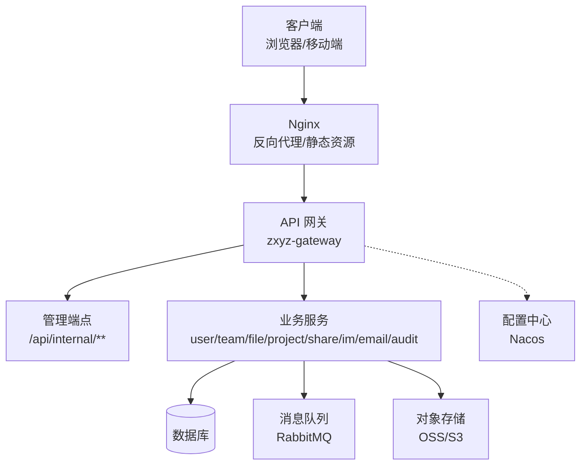
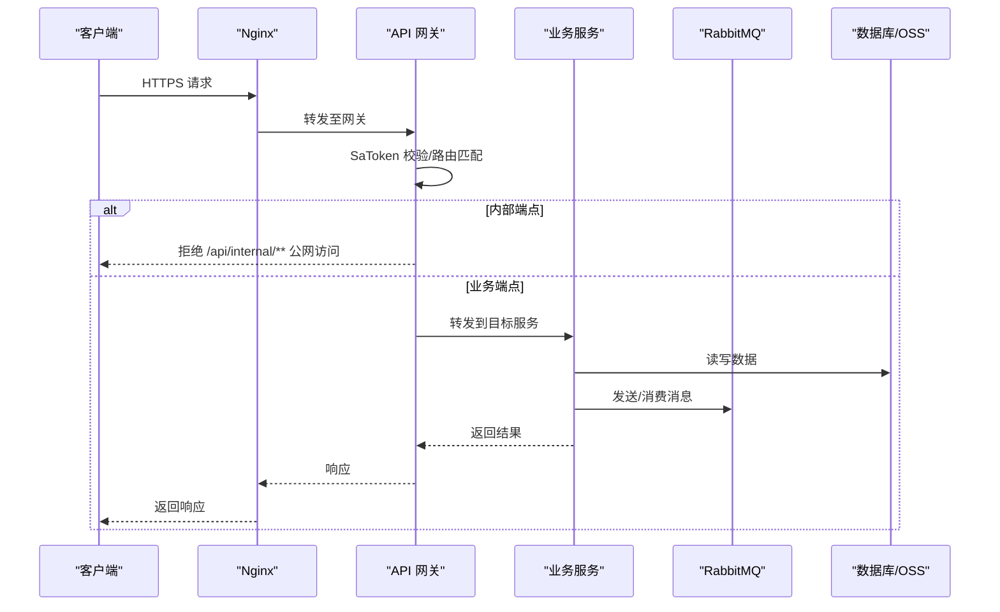
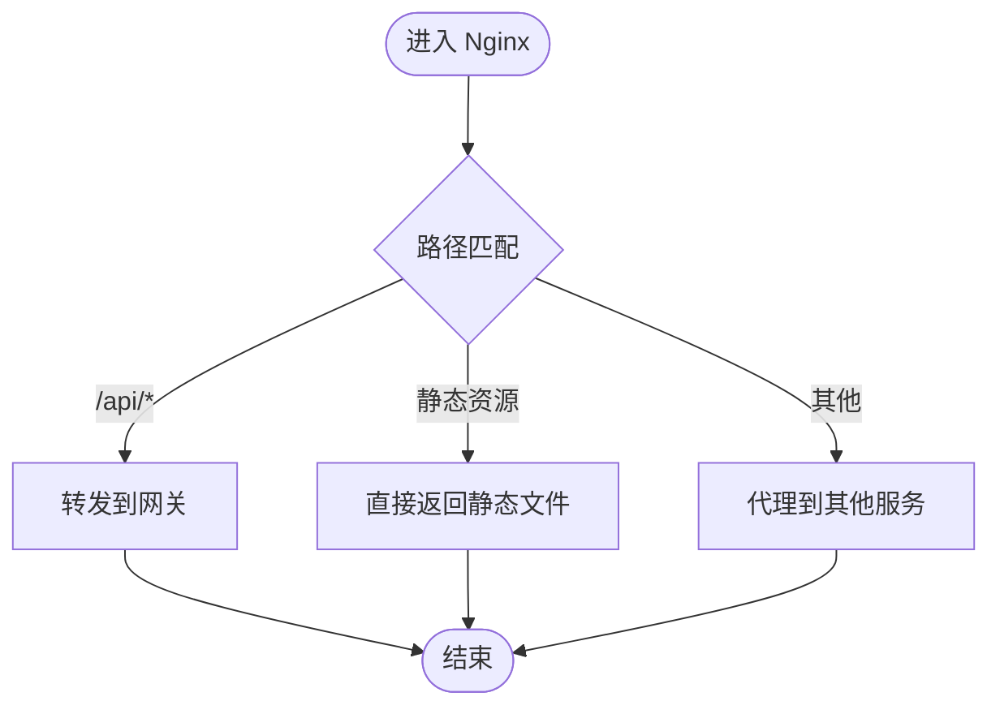
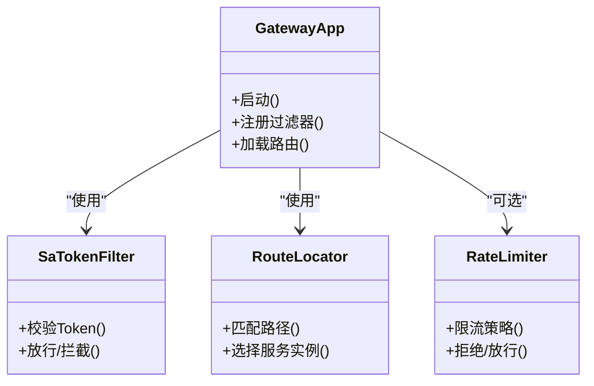
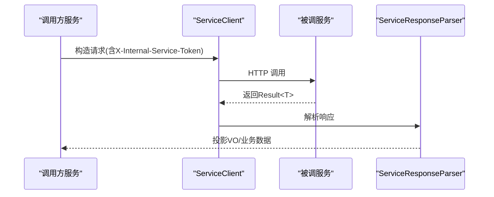
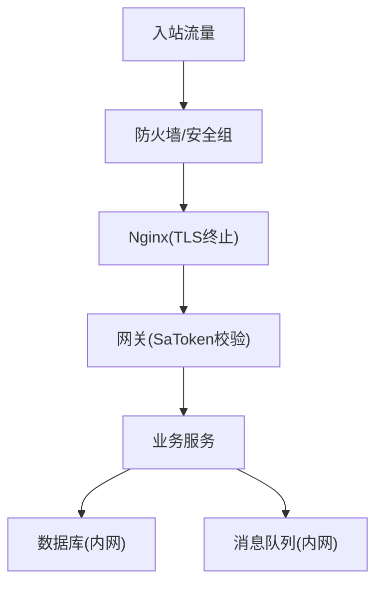
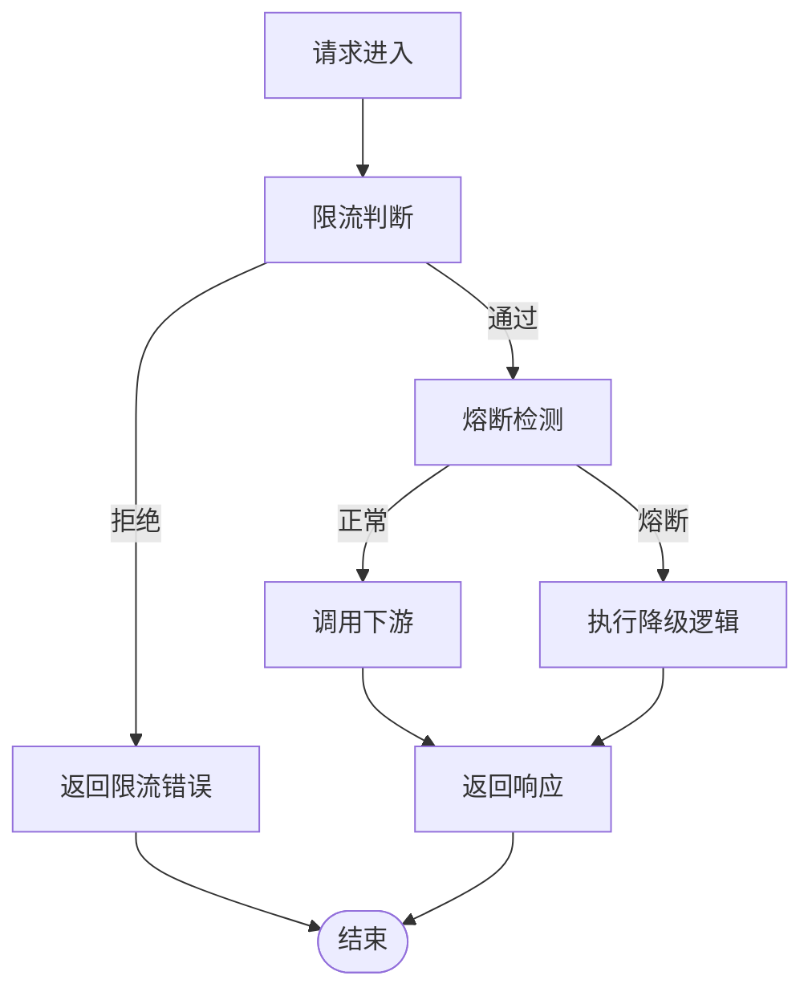
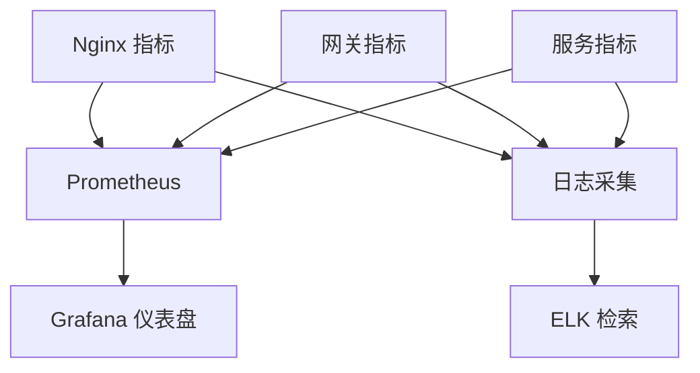
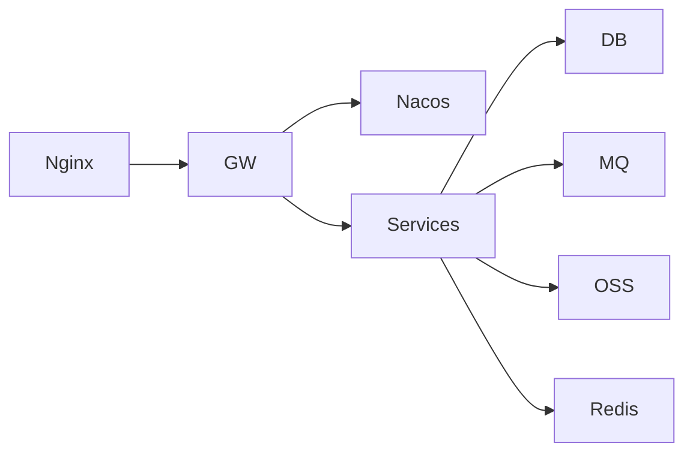
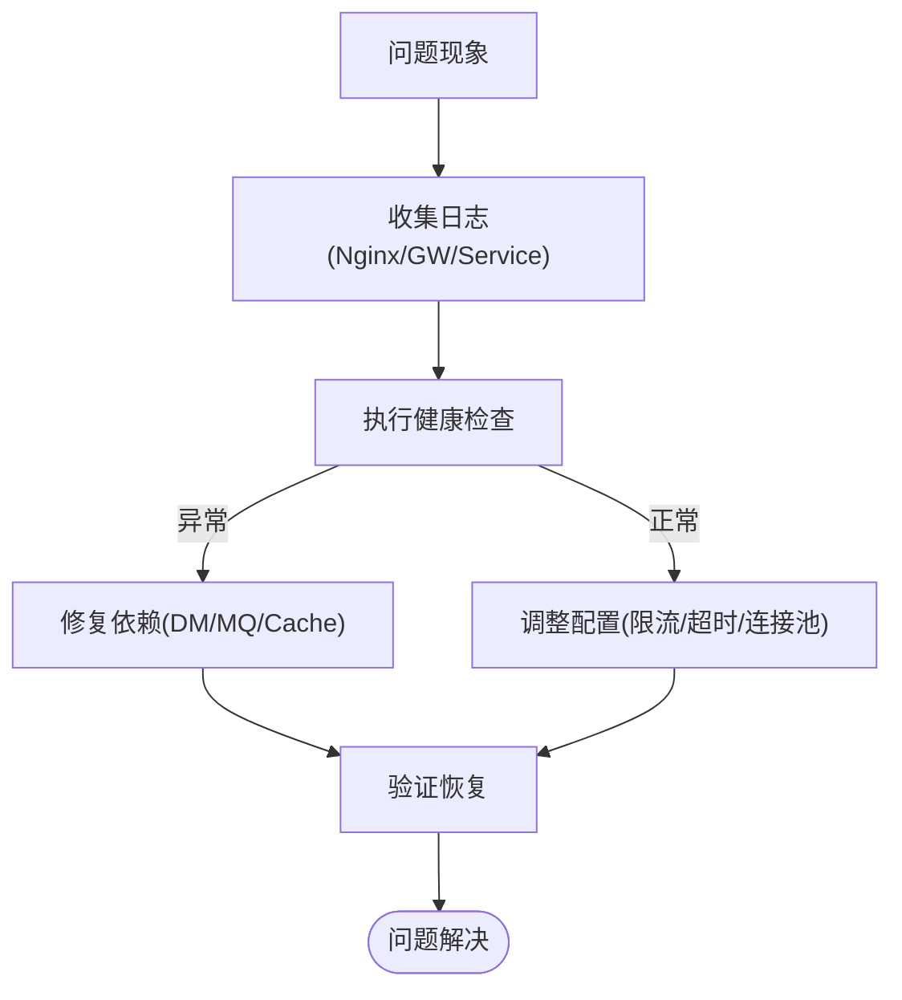

# 网络架构设计

<cite>
**本文引用的文件**
- [docker-compose.yml](file://docker-compose.yml)
- [deploy/nginx/default.conf](file://deploy/nginx/default.conf)
- [deploy/nginx/entrypoint.sh](file://deploy/nginx/entrypoint.sh)
- [ZXYZdatabaseBack/zxyz-gateway/src/main/java/uno/acloud/gateway/ZxyzGatewayApplication.java](file://ZXYZdatabaseBack/zxyz-gateway/src/main/java/uno/acloud/gateway/ZxyzGatewayApplication.java)
- [ZXYZdatabaseBack/zxyz-gateway/src/main/resources/application.yml](file://ZXYZdatabaseBack/zxyz-gateway/src/main/resources/application.yml)
- [nacos-config/zxyz-gateway.yml](file://nacos-config/zxyz-gateway.yml)
- [nacos-config/zxyz-static.yml](file://nacos-config/zxyz-static.yml)
- [nacos-config/zxyz-dynamic.yml](file://nacos-config/zxyz-dynamic.yml)
- [ZXYZdatabaseBack/zxyz-common/src/main/java/uno/acloud/common/web/WebConfig.java](file://ZXYZdatabaseBack/zxyz-common/src/main/java/uno/acloud/common/web/WebConfig.java)
- [ZXYZdatabaseBack/zxyz-common/src/main/java/uno/acloud/common/satoken/SaTokenConfigure.java](file://ZXYZdatabaseBack/zxyz-common/src/main/java/uno/acloud/common/satoken/SaTokenConfigure.java)
- [ZXYZdatabaseBack/zxyz-admin-service/src/main/java/uno/acloud/admin/config/SaTokenConfigure.java](file://ZXYZdatabaseBack/zxyz-admin-service/src/main/java/uno/acloud/admin/config/SaTokenConfigure.java)
- [ZXYZdatabaseBack/zxyz-user-service/src/main/java/uno/acloud/user/config/SaTokenConfigure.java](file://ZXYZdatabaseBack/zxyz-user-service/src/main/java/uno/acloud/user/config/SaTokenConfigure.java)
- [ZXYZdatabaseBack/zxyz-team-service/src/main/java/uno/acloud/team/config/SaTokenConfigure.java](file://ZXYZdatabaseBack/zxyz-team-service/src/main/java/uno/acloud/team/config/SaTokenConfigure.java)
- [ZXYZdatabaseBack/zxyz-file-service/src/main/java/uno/acloud/file/config/SaTokenConfigure.java](file://ZXYZdatabaseBack/zxyz-file-service/src/main/java/uno/acloud/file/config/SaTokenConfigure.java)
- [ZXYZdatabaseBack/zxyz-project-service/src/main/java/uno/acloud/project/config/SaTokenConfigure.java](file://ZXYZdatabaseBack/zxyz-project-service/src/main/java/uno/acloud/project/config/SaTokenConfigure.java)
- [ZXYZdatabaseBack/zxyz-share-service/src/main/java/uno/acloud/share/config/SaTokenConfigure.java](file://ZXYZdatabaseBack/zxyz-share-service/src/main/java/uno/acloud/share/config/SaTokenConfigure.java)
- [ZXYZdatabaseBack/zxyz-im-service/src/main/java/uno/acloud/im/config/SaTokenConfigure.java](file://ZXYZdatabaseBack/zxyz-im-service/src/main/java/uno/acloud/im/config/SaTokenConfigure.java)
- [ZXYZdatabaseBack/zxyz-email-service/src/main/java/uno/acloud/email/config/SaTokenConfigure.java](file://ZXYZdatabaseBack/zxyz-email-service/src/main/java/uno/acloud/email/config/SaTokenConfigure.java)
- [ZXYZdatabaseBack/zxyz-audit-service/src/main/java/uno/acloud/audit/config/RabbitMqConfig.java](file://ZXYZdatabaseBack/zxyz-audit-service/src/main/java/uno/acloud/audit/config/RabbitMqConfig.java)
- [ZXYZdatabaseBack/zxyz-common/src/main/java/uno/acloud/client/AbstractServiceClient.java](file://ZXYZdatabaseBack/zxyz-common/src/main/java/uno/acloud/client/AbstractServiceClient.java)
- [ZXYZdatabaseBack/zxyz-common/src/main/java/uno/acloud/client/ServiceResponseParser.java](file://ZXYZdatabaseBack/zxyz-common/src/main/java/uno/acloud/client/ServiceResponseParser.java)
- [ZXYZdatabaseBack/zxyz-common/src/main/java/uno/acloud/common/mq/MqProperties.java](file://ZXYZdatabaseBack/zxyz-common/src/main/java/uno/acloud/common/mq/MqProperties.java)
- [scripts/health-check.sh](file://scripts/health-check.sh)
- [scripts/validate-env.sh](file://scripts/validate-env.sh)
- [DEPLOYMENT.md](file://DEPLOYMENT.md)
- [docs/architecture.md](file://docs/architecture.md)
- [docs/infrastructure.md](file://docs/infrastructure.md)
</cite>

## 目录
1. [引言](#引言)
2. [项目结构](#项目结构)
3. [核心组件](#核心组件)
4. [架构总览](#架构总览)
5. [详细组件分析](#详细组件分析)
6. [依赖关系分析](#依赖关系分析)
7. [性能与容量规划](#性能与容量规划)
8. [故障排查指南](#故障排查指南)
9. [结论](#结论)
10. [附录](#附录)

## 引言
本文件面向 ZXYZ 项目的网络架构设计与运维，覆盖外部访问路由、负载均衡与反向代理、服务间通信（同步与异步）、安全网络（防火墙、网络安全组、TLS）、流量治理（限流、熔断降级、链路追踪）、网络监控（带宽、延迟、错误率）以及故障排查、性能优化与扩容策略。文档基于仓库中的网关、Nginx 配置、Docker Compose、Nacos 配置与脚本等实现进行归纳与说明，确保读者既能把握整体拓扑，也能落地到具体配置与排障要点。

## 项目结构
ZXYZ 采用微服务架构，后端包含多个独立服务模块，前端为 Vue 应用并通过 Nginx 对外提供静态资源与反向代理。关键网络相关目录与文件如下：
- 容器编排：docker-compose.yml
- 反向代理与入口：deploy/nginx/default.conf、deploy/nginx/entrypoint.sh
- API 网关：zxyz-gateway（Spring Cloud Gateway）
- 配置中心：Nacos（nacos-config/*.yml）
- 服务间调用：zxyz-common 中的 ServiceClient 抽象与响应解析器
- 消息中间件：RabbitMQ（Topic Exchange zxyz.topic）
- 健康检查与部署脚本：scripts/*

**图示来源**
- [docker-compose.yml](file://docker-compose.yml)
- [deploy/nginx/default.conf](file://deploy/nginx/default.conf)
- [ZXYZdatabaseBack/zxyz-gateway/src/main/resources/application.yml](file://ZXYZdatabaseBack/zxyz-gateway/src/main/resources/application.yml)
- [nacos-config/zxyz-gateway.yml](file://nacos-config/zxyz-gateway.yml)

**章节来源**
- [docker-compose.yml](file://docker-compose.yml)
- [docs/architecture.md](file://docs/architecture.md)
- [docs/infrastructure.md](file://docs/infrastructure.md)

## 核心组件
- 反向代理与入口（Nginx）
  - 负责静态资源托管、HTTPS 终止、请求转发至网关或特定服务、跨域与安全头设置。
- API 网关（zxyz-gateway）
  - 统一鉴权（SaToken）、路由分发、内部端点保护（拒绝公网访问 /api/internal/**）、限流与熔断扩展点。
- 服务注册与配置（Nacos）
  - 集中化管理各服务配置与服务发现；动态配置通过 nacos-config/*.yml 导入。
- 服务间通信
  - 同步：ServiceClient + X-Internal-Service-Token 鉴权，窄端点 + 投影模式。
  - 异步：RabbitMQ Topic Exchange zxyz.topic，消费者按主题订阅。
- 安全与认证
  - SaToken 统一会话与权限控制，HttpOnly Cookie 承载 Token，Redis 存储 Session。
- 可观测性与健康检查
  - 健康检查脚本、日志采集（Promtail）、指标与链路追踪可扩展接入。

**章节来源**
- [ZXYZdatabaseBack/zxyz-gateway/src/main/java/uno/acloud/gateway/ZxyzGatewayApplication.java](file://ZXYZdatabaseBack/zxyz-gateway/src/main/java/uno/acloud/gateway/ZxyzGatewayApplication.java)
- [ZXYZdatabaseBack/zxyz-gateway/src/main/resources/application.yml](file://ZXYZdatabaseBack/zxyz-gateway/src/main/resources/application.yml)
- [ZXYZdatabaseBack/zxyz-common/src/main/java/uno/acloud/client/AbstractServiceClient.java](file://ZXYZdatabaseBack/zxyz-common/src/main/java/uno/acloud/client/AbstractServiceClient.java)
- [ZXYZdatabaseBack/zxyz-common/src/main/java/uno/acloud/client/ServiceResponseParser.java](file://ZXYZdatabaseBack/zxyz-common/src/main/java/uno/acloud/client/ServiceResponseParser.java)
- [ZXYZdatabaseBack/zxyz-audit-service/src/main/java/uno/acloud/audit/config/RabbitMqConfig.java](file://ZXYZdatabaseBack/zxyz-audit-service/src/main/java/uno/acloud/audit/config/RabbitMqConfig.java)

## 架构总览
下图展示从外部到内部服务的完整网络路径，包括反向代理、网关、服务集群、消息总线与数据层。

**图示来源**
- [deploy/nginx/default.conf](file://deploy/nginx/default.conf)
- [ZXYZdatabaseBack/zxyz-gateway/src/main/resources/application.yml](file://ZXYZdatabaseBack/zxyz-gateway/src/main/resources/application.yml)
- [ZXYZdatabaseBack/zxyz-audit-service/src/main/java/uno/acloud/audit/config/RabbitMqConfig.java](file://ZXYZdatabaseBack/zxyz-audit-service/src/main/java/uno/acloud/audit/config/RabbitMqConfig.java)

## 详细组件分析

### 外部访问路由与反向代理（Nginx）
- 职责
  - 静态资源托管（前端构建产物）
  - HTTPS 终止与证书加载
  - 请求转发到网关或特定服务
  - 安全头与跨域策略
- 关键点
  - 入口域名与端口映射
  - 对 /api 前缀的请求统一转发到网关
  - 静态资源缓存与压缩
  - 健康检查探针暴露

**图示来源**
- [deploy/nginx/default.conf](file://deploy/nginx/default.conf)
- [deploy/nginx/entrypoint.sh](file://deploy/nginx/entrypoint.sh)

**章节来源**
- [deploy/nginx/default.conf](file://deploy/nginx/default.conf)
- [deploy/nginx/entrypoint.sh](file://deploy/nginx/entrypoint.sh)

### API 网关（zxyz-gateway）
- 职责
  - 统一鉴权（SaToken）
  - 路由分发与规则匹配
  - 内部端点保护（/api/internal/** 拒绝公网访问）
  - 限流、熔断、重试扩展点
- 关键点
  - 过滤器链（鉴权、审计、限流）
  - 与 Nacos 集成获取动态路由与配置
  - 健康检查与灰度发布支持

**图示来源**
- [ZXYZdatabaseBack/zxyz-gateway/src/main/java/uno/acloud/gateway/ZxyzGatewayApplication.java](file://ZXYZdatabaseBack/zxyz-gateway/src/main/java/uno/acloud/gateway/ZxyzGatewayApplication.java)
- [ZXYZdatabaseBack/zxyz-gateway/src/main/resources/application.yml](file://ZXYZdatabaseBack/zxyz-gateway/src/main/resources/application.yml)
- [nacos-config/zxyz-gateway.yml](file://nacos-config/zxyz-gateway.yml)

**章节来源**
- [ZXYZdatabaseBack/zxyz-gateway/src/main/resources/application.yml](file://ZXYZdatabaseBack/zxyz-gateway/src/main/resources/application.yml)
- [nacos-config/zxyz-gateway.yml](file://nacos-config/zxyz-gateway.yml)

### 服务间通信（同步与异步）
- 同步调用
  - 通过 AbstractServiceClient 发起 HTTP 调用，携带 X-Internal-Service-Token 进行服务间鉴权
  - ServiceResponseParser 统一解析 Result<T> 响应结构
  - 窄端点 + 投影模式：提供方仅暴露必要字段，调用方使用专用 VO 投影
- 异步通信
  - RabbitMQ Topic Exchange zxyz.topic，生产者发送事件，消费者按主题订阅处理
  - 幂等性通过消息哈希唯一约束保障

**图示来源**
- [ZXYZdatabaseBack/zxyz-common/src/main/java/uno/acloud/client/AbstractServiceClient.java](file://ZXYZdatabaseBack/zxyz-common/src/main/java/uno/acloud/client/AbstractServiceClient.java)
- [ZXYZdatabaseBack/zxyz-common/src/main/java/uno/acloud/client/ServiceResponseParser.java](file://ZXYZdatabaseBack/zxyz-common/src/main/java/uno/acloud/client/ServiceResponseParser.java)

**章节来源**
- [ZXYZdatabaseBack/zxyz-common/src/main/java/uno/acloud/client/AbstractServiceClient.java](file://ZXYZdatabaseBack/zxyz-common/src/main/java/uno/acloud/client/AbstractServiceClient.java)
- [ZXYZdatabaseBack/zxyz-common/src/main/java/uno/acloud/client/ServiceResponseParser.java](file://ZXYZdatabaseBack/zxyz-common/src/main/java/uno/acloud/client/ServiceResponseParser.java)
- [ZXYZdatabaseBack/zxyz-audit-service/src/main/java/uno/acloud/audit/config/RabbitMqConfig.java](file://ZXYZdatabaseBack/zxyz-audit-service/src/main/java/uno/acloud/audit/config/RabbitMqConfig.java)

### 安全网络（防火墙、网络安全组、TLS）
- 防火墙与网络安全组
  - 仅开放 80/443 入站，内网互通通过私有网络
  - 数据库与消息队列仅允许服务网段访问
- TLS 证书管理
  - Nginx 加载证书并启用 HTTPS
  - 建议自动续期（如 Let's Encrypt）
- 认证与授权
  - SaToken 统一鉴权，HttpOnly Cookie 存储 Token，Redis 维护会话
  - 内部端点 /api/internal/** 由网关拒绝公网访问

**图示来源**
- [deploy/nginx/default.conf](file://deploy/nginx/default.conf)
- [ZXYZdatabaseBack/zxyz-common/src/main/java/uno/acloud/common/satoken/SaTokenConfigure.java](file://ZXYZdatabaseBack/zxyz-common/src/main/java/uno/acloud/common/satoken/SaTokenConfigure.java)

**章节来源**
- [ZXYZdatabaseBack/zxyz-common/src/main/java/uno/acloud/common/satoken/SaTokenConfigure.java](file://ZXYZdatabaseBack/zxyz-common/src/main/java/uno/acloud/common/satoken/SaTokenConfigure.java)
- [ZXYZdatabaseBack/zxyz-admin-service/src/main/java/uno/acloud/admin/config/SaTokenConfigure.java](file://ZXYZdatabaseBack/zxyz-admin-service/src/main/java/uno/acloud/admin/config/SaTokenConfigure.java)
- [ZXYZdatabaseBack/zxyz-user-service/src/main/java/uno/acloud/user/config/SaTokenConfigure.java](file://ZXYZdatabaseBack/zxyz-user-service/src/main/java/uno/acloud/user/config/SaTokenConfigure.java)
- [ZXYZdatabaseBack/zxyz-team-service/src/main/java/uno/acloud/team/config/SaTokenConfigure.java](file://ZXYZdatabaseBack/zxyz-team-service/src/main/java/uno/acloud/team/config/SaTokenConfigure.java)
- [ZXYZdatabaseBack/zxyz-file-service/src/main/java/uno/acloud/file/config/SaTokenConfigure.java](file://ZXYZdatabaseBack/zxyz-file-service/src/main/java/uno/acloud/file/config/SaTokenConfigure.java)
- [ZXYZdatabaseBack/zxyz-project-service/src/main/java/uno/acloud/project/config/SaTokenConfigure.java](file://ZXYZdatabaseBack/zxyz-project-service/src/main/java/uno/acloud/project/config/SaTokenConfigure.java)
- [ZXYZdatabaseBack/zxyz-share-service/src/main/java/uno/acloud/share/config/SaTokenConfigure.java](file://ZXYZdatabaseBack/zxyz-share-service/src/main/java/uno/acloud/share/config/SaTokenConfigure.java)
- [ZXYZdatabaseBack/zxyz-im-service/src/main/java/uno/acloud/im/config/SaTokenConfigure.java](file://ZXYZdatabaseBack/zxyz-im-service/src/main/java/uno/acloud/im/config/SaTokenConfigure.java)
- [ZXYZdatabaseBack/zxyz-email-service/src/main/java/uno/acloud/email/config/SaTokenConfigure.java](file://ZXYZdatabaseBack/zxyz-email-service/src/main/java/uno/acloud/email/config/SaTokenConfigure.java)

### 流量治理（限流、熔断降级、链路追踪）
- 限流
  - 网关层可接入令牌桶/漏桶策略，按 IP/用户维度限流
  - 服务层可通过注解或过滤器实现接口级限流
- 熔断降级
  - 针对下游依赖（DB、MQ、第三方 API）配置熔断阈值与降级逻辑
  - 失败快速返回，避免雪崩
- 链路追踪
  - 建议在网关与服务中注入 TraceId，统一上报至 APM 平台
  - 结合日志采集（Promtail/ELK）进行问题定位

**图示来源**
- [ZXYZdatabaseBack/zxyz-gateway/src/main/resources/application.yml](file://ZXYZdatabaseBack/zxyz-gateway/src/main/resources/application.yml)
- [nacos-config/zxyz-dynamic.yml](file://nacos-config/zxyz-dynamic.yml)

**章节来源**
- [nacos-config/zxyz-dynamic.yml](file://nacos-config/zxyz-dynamic.yml)

### 网络监控（带宽、延迟、错误率）
- 指标采集
  - 网关与服务暴露 Prometheus 指标（QPS、延迟、错误率）
  - Nginx 访问日志与状态码统计
- 告警与可视化
  - Grafana 仪表盘展示关键指标
  - 阈值告警（错误率突增、延迟升高）
- 日志与追踪
  - Promtail 采集容器日志，ELK 检索与分析
  - 链路追踪 ID 贯穿请求全生命周期

**图示来源**
- [docker-compose.yml](file://docker-compose.yml)
- [deploy/promtail-config.yml](file://deploy/promtail-config.yml)

**章节来源**
- [docker-compose.yml](file://docker-compose.yml)
- [deploy/promtail-config.yml](file://deploy/promtail-config.yml)

## 依赖关系分析
- 组件耦合
  - Nginx 依赖网关与健康检查脚本
  - 网关依赖 Nacos 配置与服务发现
  - 服务依赖数据库、消息队列与对象存储
- 外部依赖
  - Nacos（配置中心）
  - RabbitMQ（消息中间件）
  - Redis（会话存储）
  - 对象存储（OSS/S3）

**图示来源**
- [docker-compose.yml](file://docker-compose.yml)
- [nacos-config/zxyz-static.yml](file://nacos-config/zxyz-static.yml)

**章节来源**
- [docker-compose.yml](file://docker-compose.yml)
- [nacos-config/zxyz-static.yml](file://nacos-config/zxyz-static.yml)

## 性能与容量规划
- 带宽与并发
  - 根据峰值 QPS 与平均响应时间计算所需带宽与实例数
  - 静态资源 CDN 加速，减少源站压力
- 连接池与超时
  - 合理配置数据库连接池、HTTP 客户端连接池与超时时间
  - 避免长事务与慢查询
- 水平扩容
  - 无状态服务多副本部署，网关与业务服务均可横向扩展
  - 数据库分库分表与读写分离
- 缓存策略
  - 热点数据缓存（Redis），降低数据库压力
  - 静态资源缓存（Nginx/CDN）

[本节为通用指导，不直接分析具体文件]

## 故障排查指南
- 常见问题
  - 网关鉴权失败：检查 SaToken 配置与 Cookie 传递
  - 内部端点被拒：确认请求来自内网且携带正确 Token
  - 消息丢失：检查 RabbitMQ 连接与消费者状态
- 诊断步骤
  - 查看 Nginx 访问日志与错误日志
  - 检查网关过滤器链与路由匹配
  - 验证服务健康检查与依赖可用性
- 工具与脚本
  - health-check.sh：服务健康探测
  - validate-env.sh：环境参数校验

**图示来源**
- [scripts/health-check.sh](file://scripts/health-check.sh)
- [scripts/validate-env.sh](file://scripts/validate-env.sh)

**章节来源**
- [scripts/health-check.sh](file://scripts/health-check.sh)
- [scripts/validate-env.sh](file://scripts/validate-env.sh)

## 结论
ZXYZ 的网络架构以 Nginx 为入口、API 网关为核心、微服务为业务单元，配合 Nacos、RabbitMQ、Redis 与对象存储形成完整的分布式体系。通过统一的鉴权、限流、熔断与监控能力，保障了系统的安全性与稳定性。在实际运维中，应重点关注入口安全、服务间通信可靠性与可观测性建设，持续优化性能与容量规划。

[本节为总结性内容，不直接分析具体文件]

## 附录
- 部署参考
  - DEPLOYMENT.md：部署流程与环境准备
  - docker-compose.yml：容器编排与服务依赖
- 架构文档
  - docs/architecture.md：整体架构说明
  - docs/infrastructure.md：基础设施与依赖

**章节来源**
- [DEPLOYMENT.md](file://DEPLOYMENT.md)
- [docker-compose.yml](file://docker-compose.yml)
- [docs/architecture.md](file://docs/architecture.md)
- [docs/infrastructure.md](file://docs/infrastructure.md)