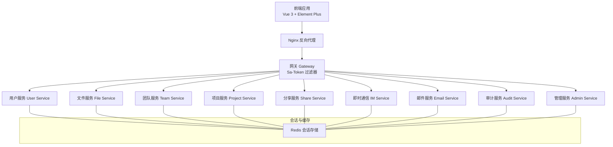
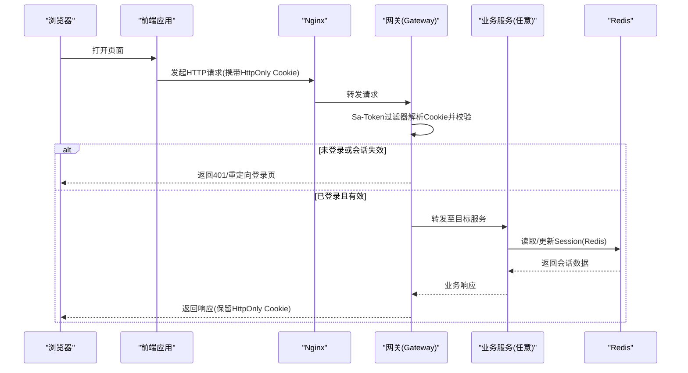
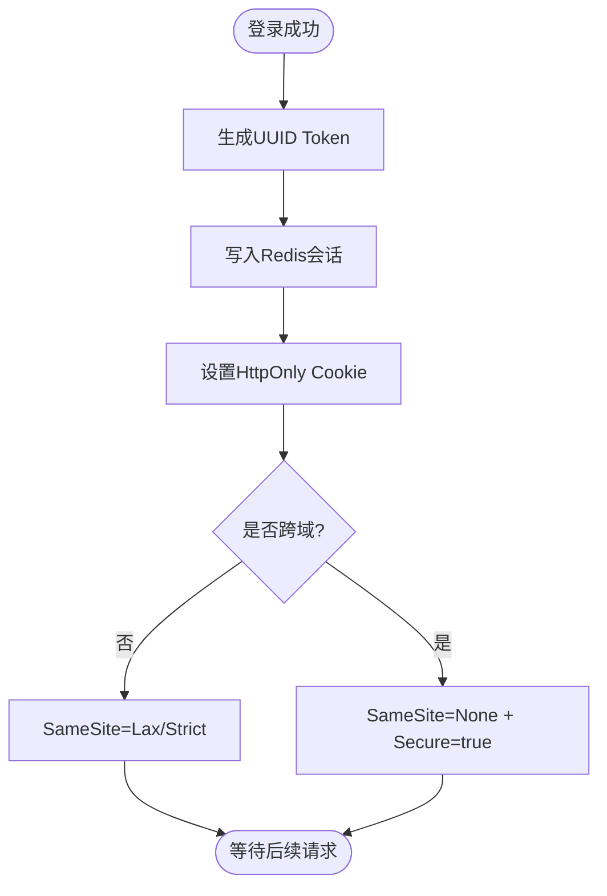
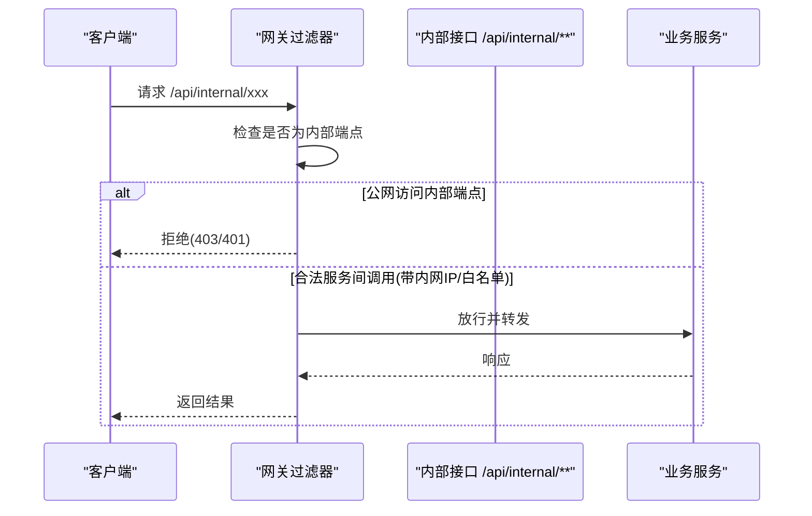
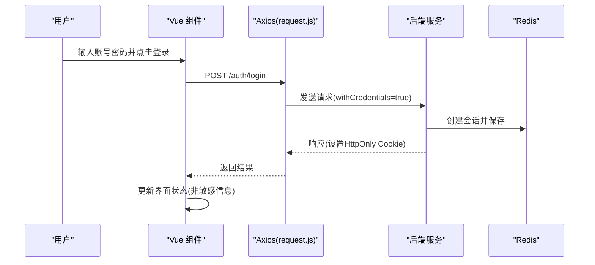
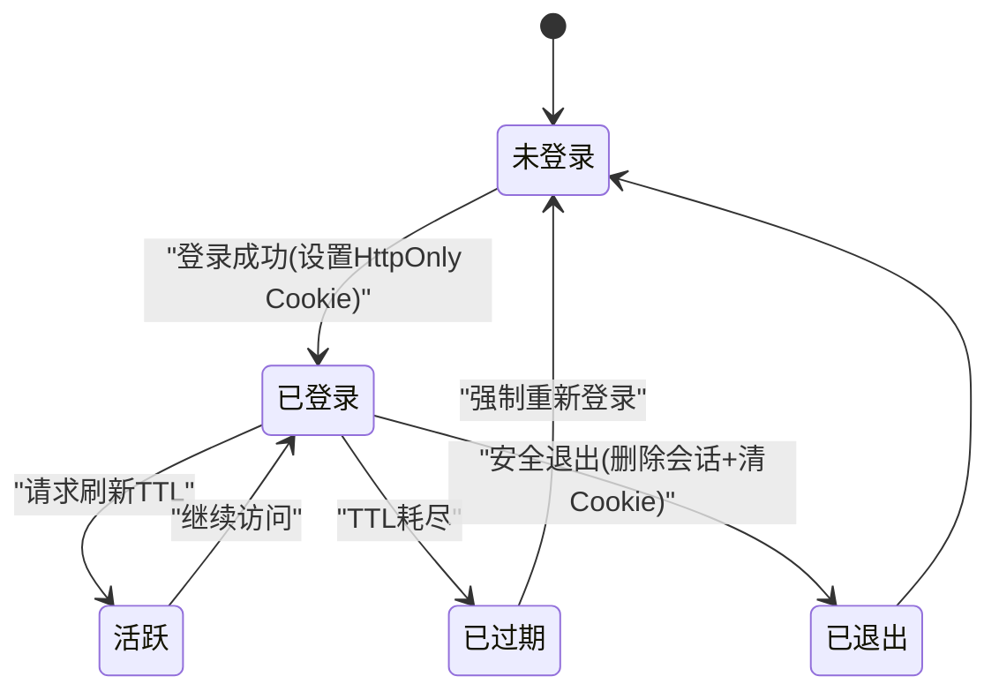
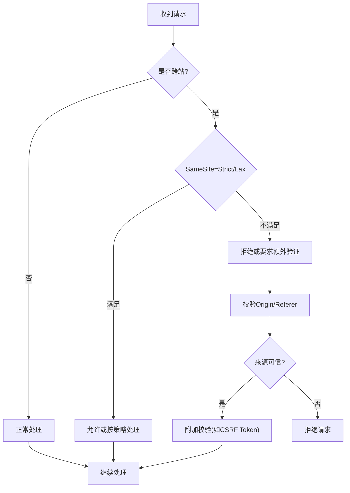
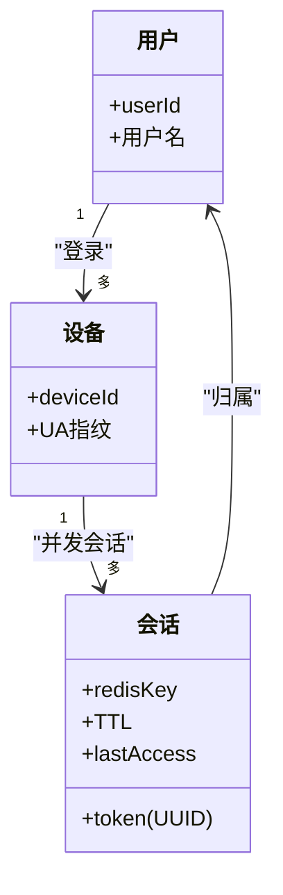
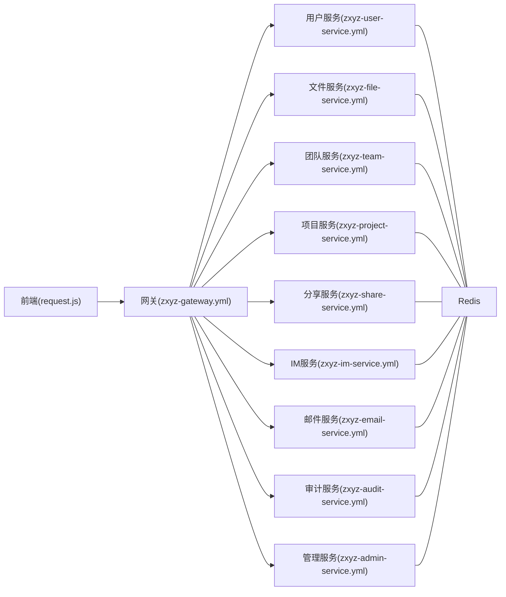

# 会话与Cookie安全

<cite>
**本文引用的文件**   
- [SaTokenConfigure.java](file://ZXYZdatabaseBack/zxyz-admin-service/src/main/java/uno/acloud/admin/config/SaTokenConfigure.java)
- [application.yml](file://ZXYZdatabaseBack/zxyz-admin-service/src/main/resources/application.yml)
- [application-dev.yml](file://ZXYZdatabaseBack/zxyz-admin-service/src/main/resources/application-dev.yml)
- [application-prod.yml](file://ZXYZdatabaseBack/zxyz-admin-service/src/main/resources/application-prod.yml)
- [zxyz-static.yml](file://nacos-config/zxyz-static.yml)
- [zxyz-user-service.yml](file://nacos-config/zxyz-user-service.yml)
- [zxyz-file-service.yml](file://nacos-config/zxyz-file-service.yml)
- [zxyz-team-service.yml](file://nacos-config/zxyz-team-service.yml)
- [zxyz-project-service.yml](file://nacos-config/zxyz-project-service.yml)
- [zxyz-share-service.yml](file://nacos-config/zxyz-share-service.yml)
- [zxyz-im-service.yml](file://nacos-config/zxyz-im-service.yml)
- [zxyz-email-service.yml](file://nacos-config/zxyz-email-service.yml)
- [zxyz-audit-service.yml](file://nacos-config/zxyz-audit-service.yml)
- [zxyz-admin-service.yml](file://nacos-config/zxyz-admin-service.yml)
- [zxyz-gateway.yml](file://nacos-config/zxyz-gateway.yml)
- [application.yml](file://ZXYZdatabaseBack/zxyz-gateway/src/main/resources/application.yml)
- [SaTokenFilterConfigTest.java](file://ZXYZdatabaseBack/zxyz-gateway/src/test/java/uno/acloud/gateway/filter/SaTokenFilterConfigTest.java)
- [auth.js](file://ZXYZdatabaseFront/src/api/auth.js)
- [request.js](file://ZXYZdatabaseFront/src/utils/request.js)
- [createApiClient.js](file://ZXYZdatabaseFront/src/utils/createApiClient.js)
- [session.js](file://ZXYZdatabaseFront/src/store/session.js)
- [currentUser.js](file://ZXYZdatabaseFront/src/store/currentUser.js)
- [index.vue](file://ZXYZdatabaseFront/src/views/login/index.vue)
- [logout-dialog.vue](file://ZXYZdatabaseFront/src/components/LogoutDialog.vue)
- [default.conf](file://deploy/nginx/default.conf)
</cite>

## 目录
1. [简介](#简介)
2. [项目结构](#项目结构)
3. [核心组件](#核心组件)
4. [架构总览](#架构总览)
5. [详细组件分析](#详细组件分析)
6. [依赖关系分析](#依赖关系分析)
7. [性能考量](#性能考量)
8. [故障排查指南](#故障排查指南)
9. [结论](#结论)
10. [附录](#附录)

## 简介
本文件面向 ZXYZ 项目的会话与 Cookie 安全，聚焦以下主题：
- HttpOnly Cookie 配置：Sa-Token UUID token 存储、Cookie 属性（HttpOnly、Secure、SameSite）、跨域 Cookie 共享策略
- 会话管理：Redis Session 存储、会话过期策略、并发会话控制、会话劫持防护
- CSRF 防护：同源策略、请求来源验证、Token 验证机制、跨站请求伪造攻击防护
- 最佳实践：会话固定攻击防护、会话超时管理、安全退出机制、多设备登录支持
- 图示：会话生命周期图、Cookie 安全配置表、CSRF 防护流程图
- 示例与常见问题解决方案

## 项目结构
ZXYZ 采用微服务架构，前后端分离。后端使用 Sa-Token + Redis 实现统一认证与会话；前端通过 HttpOnly Cookie 维持会话，并在请求中自动携带 Cookie。Nginx 作为反向代理统一入口，Gateway 层集成 Sa-Token Filter 进行鉴权拦截。

**图表来源** 
- [application.yml](file://ZXYZdatabaseBack/zxyz-gateway/src/main/resources/application.yml)
- [zxyz-gateway.yml](file://nacos-config/zxyz-gateway.yml)
- [zxyz-user-service.yml](file://nacos-config/zxyz-user-service.yml)
- [zxyz-file-service.yml](file://nacos-config/zxyz-file-service.yml)
- [zxyz-team-service.yml](file://nacos-config/zxyz-team-service.yml)
- [zxyz-project-service.yml](file://nacos-config/zxyz-project-service.yml)
- [zxyz-share-service.yml](file://nacos-config/zxyz-share-service.yml)
- [zxyz-im-service.yml](file://nacos-config/zxyz-im-service.yml)
- [zxyz-email-service.yml](file://nacos-config/zxyz-email-service.yml)
- [zxyz-audit-service.yml](file://nacos-config/zxyz-audit-service.yml)
- [zxyz-admin-service.yml](file://nacos-config/zxyz-admin-service.yml)

**章节来源**
- [application.yml](file://ZXYZdatabaseBack/zxyz-gateway/src/main/resources/application.yml)
- [zxyz-gateway.yml](file://nacos-config/zxyz-gateway.yml)

## 核心组件
- 认证与会话框架：Sa-Token（UUID Token）+ Redis Session
- 网关鉴权：Gateway 集成 Sa-Token 过滤器，拒绝公网访问内部端点
- 前端请求：基于 Axios 的封装，自动携带 Cookie（HttpOnly），统一响应处理
- Nginx 反向代理：统一入口、HTTPS、跨域与静态资源托管

关键职责：
- Sa-Token 负责生成/校验 UUID Token，维护 Redis 中的会话数据
- Gateway 在请求进入前完成鉴权与路由转发
- 前端通过 HttpOnly Cookie 保持登录态，避免 XSS 窃取 Token
- Nginx 设置跨域与安全头，确保 Cookie 安全传输

**章节来源**
- [SaTokenConfigure.java](file://ZXYZdatabaseBack/zxyz-admin-service/src/main/java/uno/acloud/admin/config/SaTokenConfigure.java)
- [application.yml](file://ZXYZdatabaseBack/zxyz-admin-service/src/main/resources/application.yml)
- [zxyz-gateway.yml](file://nacos-config/zxyz-gateway.yml)
- [request.js](file://ZXYZdatabaseFront/src/utils/request.js)
- [createApiClient.js](file://ZXYZdatabaseFront/src/utils/createApiClient.js)
- [default.conf](file://deploy/nginx/default.conf)

## 架构总览
下图展示从浏览器到各服务的完整调用链，以及会话在 Redis 中的存取路径。

**图表来源** 
- [SaTokenFilterConfigTest.java](file://ZXYZdatabaseBack/zxyz-gateway/src/test/java/uno/acloud/gateway/filter/SaTokenFilterConfigTest.java)
- [application.yml](file://ZXYZdatabaseBack/zxyz-gateway/src/main/resources/application.yml)
- [zxyz-gateway.yml](file://nacos-config/zxyz-gateway.yml)

## 详细组件分析

### Sa-Token 配置与 Cookie 行为
- Token 类型：UUID（每次登录生成唯一标识）
- 存储位置：Redis（键名由 Sa-Token 规则生成，包含用户标识与设备信息）
- Cookie 属性：
  - HttpOnly：禁止 JS 读取，降低 XSS 风险
  - Secure：仅 HTTPS 传输（生产环境建议开启）
  - SameSite：根据跨域需求选择 Lax/Strict/None（跨域需配合 Secure）
- 跨域 Cookie 共享：
  - 同主域名下子域共享：设置 Domain=.example.com
  - 跨主域共享：需将 SameSite=None 且 Secure=true，并确保前端 withCredentials=true

**图表来源** 
- [SaTokenConfigure.java](file://ZXYZdatabaseBack/zxyz-admin-service/src/main/java/uno/acloud/admin/config/SaTokenConfigure.java)
- [application.yml](file://ZXYZdatabaseBack/zxyz-admin-service/src/main/resources/application.yml)
- [zxyz-static.yml](file://nacos-config/zxyz-static.yml)

**章节来源**
- [SaTokenConfigure.java](file://ZXYZdatabaseBack/zxyz-admin-service/src/main/java/uno/acloud/admin/config/SaTokenConfigure.java)
- [application.yml](file://ZXYZdatabaseBack/zxyz-admin-service/src/main/resources/application.yml)
- [application-dev.yml](file://ZXYZdatabaseBack/zxyz-admin-service/src/main/resources/application-dev.yml)
- [application-prod.yml](file://ZXYZdatabaseBack/zxyz-admin-service/src/main/resources/application-prod.yml)
- [zxyz-static.yml](file://nacos-config/zxyz-static.yml)

### 网关 Sa-Token 过滤器与内部端点保护
- 过滤器职责：解析 Cookie、校验 Token、注入用户上下文、拒绝非法请求
- 内部端点保护：/api/internal/** 被 Gateway 拒绝公网访问，仅允许服务间调用
- 测试覆盖：SaTokenFilterConfigTest 验证过滤器行为

**图表来源** 
- [SaTokenFilterConfigTest.java](file://ZXYZdatabaseBack/zxyz-gateway/src/test/java/uno/acloud/gateway/filter/SaTokenFilterConfigTest.java)
- [application.yml](file://ZXYZdatabaseBack/zxyz-gateway/src/main/resources/application.yml)
- [zxyz-gateway.yml](file://nacos-config/zxyz-gateway.yml)

**章节来源**
- [SaTokenFilterConfigTest.java](file://ZXYZdatabaseBack/zxyz-gateway/src/test/java/uno/acloud/gateway/filter/SaTokenFilterConfigTest.java)
- [application.yml](file://ZXYZdatabaseBack/zxyz-gateway/src/main/resources/application.yml)
- [zxyz-gateway.yml](file://nacos-config/zxyz-gateway.yml)

### 前端请求与 Cookie 携带
- Axios 封装：request.js 统一拦截器，withCredentials=true 确保跨域时携带 Cookie
- API 模块：auth.js 等模块调用登录/登出接口，服务端设置 HttpOnly Cookie
- 状态管理：session.js、currentUser.js 管理本地登录态提示（不存敏感数据）

**图表来源** 
- [request.js](file://ZXYZdatabaseFront/src/utils/request.js)
- [auth.js](file://ZXYZdatabaseFront/src/api/auth.js)
- [session.js](file://ZXYZdatabaseFront/src/store/session.js)
- [currentUser.js](file://ZXYZdatabaseFront/src/store/currentUser.js)

**章节来源**
- [request.js](file://ZXYZdatabaseFront/src/utils/request.js)
- [auth.js](file://ZXYZdatabaseFront/src/api/auth.js)
- [createApiClient.js](file://ZXYZdatabaseFront/src/utils/createApiClient.js)
- [session.js](file://ZXYZdatabaseFront/src/store/session.js)
- [currentUser.js](file://ZXYZdatabaseFront/src/store/currentUser.js)

### 会话生命周期与过期策略
- 登录：生成 UUID Token，写入 Redis，设置 HttpOnly Cookie
- 活跃：每次请求刷新会话 TTL（滑动过期）
- 过期：TTL 耗尽后，下次请求被网关拒绝，跳转登录
- 安全退出：服务端删除 Redis 会话，清除 Cookie

**图表来源** 
- [SaTokenConfigure.java](file://ZXYZdatabaseBack/zxyz-admin-service/src/main/java/uno/acloud/admin/config/SaTokenConfigure.java)
- [application.yml](file://ZXYZdatabaseBack/zxyz-admin-service/src/main/resources/application.yml)
- [logout-dialog.vue](file://ZXYZdatabaseFront/src/components/LogoutDialog.vue)

**章节来源**
- [SaTokenConfigure.java](file://ZXYZdatabaseBack/zxyz-admin-service/src/main/java/uno/acloud/admin/config/SaTokenConfigure.java)
- [application.yml](file://ZXYZdatabaseBack/zxyz-admin-service/src/main/resources/application.yml)
- [logout-dialog.vue](file://ZXYZdatabaseFront/src/components/LogoutDialog.vue)

### CSRF 防护流程
- 同源策略：浏览器默认限制跨站请求携带 Cookie
- 请求来源验证：检查 Origin/Referer，必要时校验自定义 Header
- Token 验证：对敏感操作可引入一次性 CSRF Token（可选增强）
- 防御要点：SameSite、Secure、HttpOnly、严格 CORS 配置

**图表来源** 
- [default.conf](file://deploy/nginx/default.conf)
- [request.js](file://ZXYZdatabaseFront/src/utils/request.js)
- [zxyz-gateway.yml](file://nacos-config/zxyz-gateway.yml)

**章节来源**
- [default.conf](file://deploy/nginx/default.conf)
- [request.js](file://ZXYZdatabaseFront/src/utils/request.js)
- [zxyz-gateway.yml](file://nacos-config/zxyz-gateway.yml)

### 多设备登录与会话隔离
- 设备维度：Sa-Token 会话键包含设备标识，支持同一用户多设备同时在线
- 并发控制：可通过配置限制最大会话数或强制踢人（按需启用）
- 会话隔离：不同设备拥有独立 UUID Token，互不影响

**图表来源** 
- [SaTokenConfigure.java](file://ZXYZdatabaseBack/zxyz-admin-service/src/main/java/uno/acloud/admin/config/SaTokenConfigure.java)
- [application.yml](file://ZXYZdatabaseBack/zxyz-admin-service/src/main/resources/application.yml)

**章节来源**
- [SaTokenConfigure.java](file://ZXYZdatabaseBack/zxyz-admin-service/src/main/java/uno/acloud/admin/config/SaTokenConfigure.java)
- [application.yml](file://ZXYZdatabaseBack/zxyz-admin-service/src/main/resources/application.yml)

## 依赖关系分析
- 后端服务均依赖 Sa-Token 与 Redis，统一会话模型
- 网关集中鉴权，屏蔽内部端点，减少服务侧重复逻辑
- 前端通过 Axios 封装统一携带 Cookie，简化跨域与鉴权处理

**图表来源** 
- [zxyz-gateway.yml](file://nacos-config/zxyz-gateway.yml)
- [zxyz-user-service.yml](file://nacos-config/zxyz-user-service.yml)
- [zxyz-file-service.yml](file://nacos-config/zxyz-file-service.yml)
- [zxyz-team-service.yml](file://nacos-config/zxyz-team-service.yml)
- [zxyz-project-service.yml](file://nacos-config/zxyz-project-service.yml)
- [zxyz-share-service.yml](file://nacos-config/zxyz-share-service.yml)
- [zxyz-im-service.yml](file://nacos-config/zxyz-im-service.yml)
- [zxyz-email-service.yml](file://nacos-config/zxyz-email-service.yml)
- [zxyz-audit-service.yml](file://nacos-config/zxyz-audit-service.yml)
- [zxyz-admin-service.yml](file://nacos-config/zxyz-admin-service.yml)

**章节来源**
- [zxyz-gateway.yml](file://nacos-config/zxyz-gateway.yml)
- [zxyz-user-service.yml](file://nacos-config/zxyz-user-service.yml)
- [zxyz-file-service.yml](file://nacos-config/zxyz-file-service.yml)
- [zxyz-team-service.yml](file://nacos-config/zxyz-team-service.yml)
- [zxyz-project-service.yml](file://nacos-config/zxyz-project-service.yml)
- [zxyz-share-service.yml](file://nacos-config/zxyz-share-service.yml)
- [zxyz-im-service.yml](file://nacos-config/zxyz-im-service.yml)
- [zxyz-email-service.yml](file://nacos-config/zxyz-email-service.yml)
- [zxyz-audit-service.yml](file://nacos-config/zxyz-audit-service.yml)
- [zxyz-admin-service.yml](file://nacos-config/zxyz-admin-service.yml)

## 性能考量
- Redis 会话读写延迟低，建议合理设置 TTL 与序列化策略
- 滑动过期：频繁请求会刷新 TTL，注意热点用户带来的写放大
- 会话清理：定期清理过期键，避免内存膨胀
- 网关过滤：集中鉴权减少服务侧开销，但需保证过滤器高效

[本节为通用指导，无需特定文件引用]

## 故障排查指南
- 无法携带 Cookie（跨域）：
  - 检查前端 withCredentials=true
  - 检查 SameSite 与 Secure 配置是否匹配跨域场景
  - 确认 Nginx 的 CORS 头与代理转发正确
- 登录后立即失效：
  - 检查 Redis 连接与 TTL 配置
  - 核对 Sa-Token 的 cookie 名称与路径配置
  - 查看网关过滤器日志，确认 Token 校验失败原因
- 内部端点被拒：
  - 确认调用方来自内网或白名单
  - 检查 Gateway 的内部端点拦截规则

**章节来源**
- [request.js](file://ZXYZdatabaseFront/src/utils/request.js)
- [default.conf](file://deploy/nginx/default.conf)
- [application.yml](file://ZXYZdatabaseBack/zxyz-gateway/src/main/resources/application.yml)
- [zxyz-gateway.yml](file://nacos-config/zxyz-gateway.yml)

## 结论
ZXYZ 通过 Sa-Token + Redis 实现了统一的会话管理，结合 HttpOnly Cookie、网关鉴权与 Nginx 安全配置，构建了较为完善的会话与 Cookie 安全体系。建议在跨域场景谨慎配置 SameSite 与 Secure，并结合 CSRF Token 进一步增强安全性。同时，完善会话清理与监控告警，保障系统长期稳定运行。

[本节为总结性内容，无需特定文件引用]

## 附录

### Cookie 安全配置表
- HttpOnly：始终启用，防止 XSS 读取
- Secure：生产环境启用，仅 HTTPS 传输
- SameSite：
  - 同站优先：Lax
  - 严格跨站隔离：Strict
  - 跨站必需：None（必须配合 Secure）
- Domain：
  - 同主域共享：.example.com
  - 跨主域：明确指定目标域名
- Path：尽量限定最小可用路径，减少泄露面

[本节为通用配置说明，无需特定文件引用]

### 会话安全最佳实践清单
- 会话固定攻击防护：登录后更换 Token（Sa-Token 默认行为）
- 会话超时管理：合理设置 TTL，启用滑动过期
- 安全退出机制：服务端删除会话，前端清除本地非敏感状态
- 多设备登录支持：设备维度隔离会话，必要时限制并发数
- 跨域 Cookie 共享：SameSite=None + Secure=true，前端 withCredentials=true

[本节为通用最佳实践，无需特定文件引用]

### 常见安全问题与解决方案
- 问题：跨域请求未携带 Cookie
  - 解决：前端 withCredentials=true；后端允许凭证；SameSite 配置正确
- 问题：登录后立即失效
  - 解决：检查 Redis 连通性与 TTL；核对 Sa-Token 配置；查看网关日志
- 问题：内部端点被公网访问
  - 解决：Gateway 拦截 /api/internal/**；限制来源 IP；加强防火墙策略

**章节来源**
- [request.js](file://ZXYZdatabaseFront/src/utils/request.js)
- [application.yml](file://ZXYZdatabaseBack/zxyz-gateway/src/main/resources/application.yml)
- [zxyz-gateway.yml](file://nacos-config/zxyz-gateway.yml)