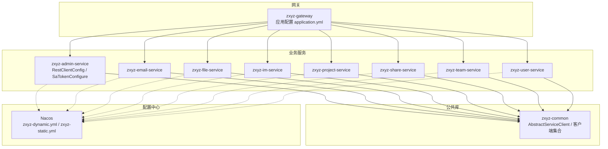
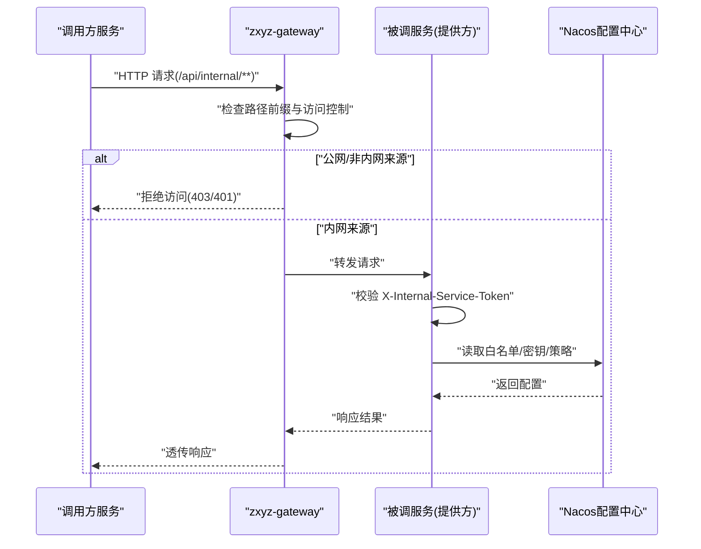
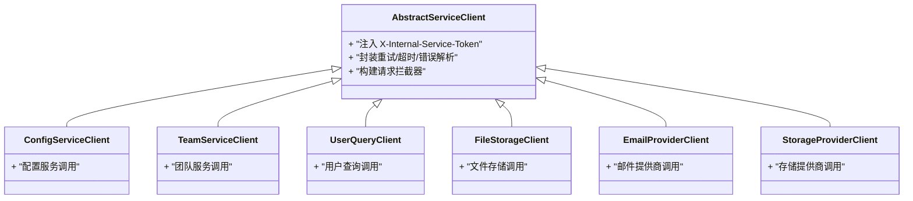
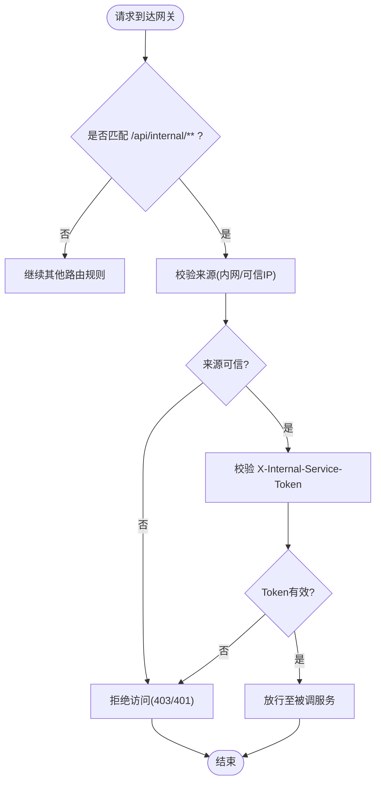
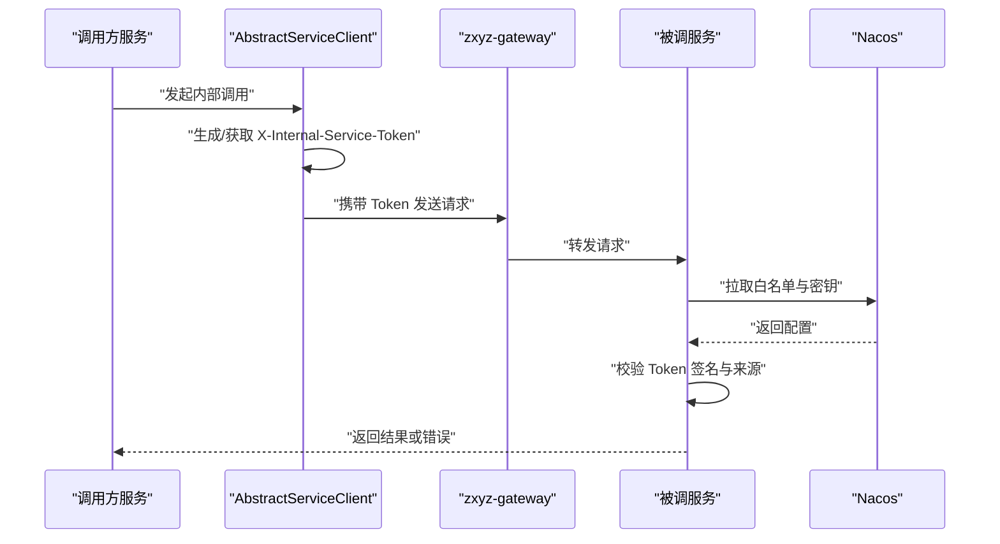
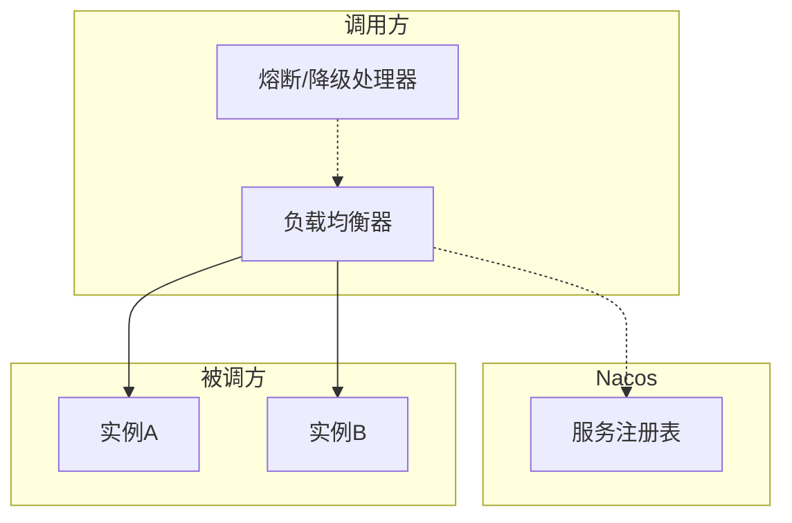
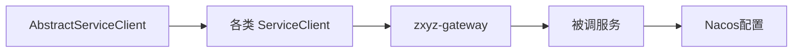

# 内部服务安全

<cite>
**本文引用的文件**
- [AbstractServiceClient.java](file://ZXYZdatabaseBack/zxyz-common/src/main/java/uno/acloud/client/AbstractServiceClient.java)
- [RestClientConfig.java](file://ZXYZdatabaseBack/zxyz-admin-service/src/main/java/uno/acloud/admin/config/RestClientConfig.java)
- [SaTokenConfigure.java](file://ZXYZdatabaseBack/zxyz-admin-service/src/main/java/uno/acloud/admin/config/SaTokenConfigure.java)
- [application.yml](file://ZXYZdatabaseBack/zxyz-gateway/src/main/resources/application.yml)
- [SaTokenFilterConfigTest.java](file://ZXYZdatabaseBack/zxyz-gateway/src/test/java/uno/acloud/gateway/filter/SaTokenFilterConfigTest.java)
- [EmailProviderClient.java](file://ZXYZdatabaseBack/ZXYZdatabaseBack/zxyz-admin-service/src/main/java/uno/acloud/admin/client/EmailProviderClient.java)
- [StorageProviderClient.java](file://ZXYZdatabaseBack/ZXYZdatabaseBack/zxyz-admin-service/src/main/java/uno/acloud/admin/client/StorageProviderClient.java)
- [ConfigServiceClient.java](file://ZXYZdatabaseBack/zxyz-common/src/main/java/uno/acloud/client/ConfigServiceClient.java)
- [TeamServiceClient.java](file://ZXYZdatabaseBack/zxyz-common/src/main/java/uno/acloud/client/TeamServiceClient.java)
- [UserQueryClient.java](file://ZXYZdatabaseBack/zxyz-common/src/main/java/uno/acloud/client/UserQueryClient.java)
- [FileStorageClient.java](file://ZXYZdatabaseBack/zxyz-common/src/main/java/uno/acloud/client/FileStorageClient.java)
- [ServiceResponseParser.java](file://ZXYZdatabaseBack/zxyz-common/src/main/java/uno/acloud/client/ServiceResponseParser.java)
- [zxyz-dynamic.yml](file://nacos-config/zxyz-dynamic.yml)
- [zxyz-static.yml](file://nacos-config/zxyz-static.yml)
- [architecture.md](file://docs/architecture.md)
</cite>

## 目录
1. [简介](#简介)
2. [项目结构](#项目结构)
3. [核心组件](#核心组件)
4. [架构总览](#架构总览)
5. [详细组件分析](#详细组件分析)
6. [依赖关系分析](#依赖关系分析)
7. [性能考量](#性能考量)
8. [故障排查指南](#故障排查指南)
9. [结论](#结论)
10. [附录](#附录)

## 简介
本文件面向 ZXYZ 微服务体系的内部服务安全，聚焦以下目标：
- 服务间调用安全：X-Internal-Service-Token 头部验证、服务白名单配置、Token 签名校验。
- 内部端点保护：/api/internal/** 路径保护、网关层访问控制、外部请求拒绝策略。
- 服务客户端安全：AbstractServiceClient 的 Token 注入、请求拦截器配置、错误处理机制。
- 微服务通信安全：服务注册发现中的安全信息、负载均衡时的安全上下文传递、熔断降级时的安全处理。
- 提供架构图、Token 验证流程图与常见攻击防护策略，并给出最佳实践与排障指引。

## 项目结构
ZXYZ 后端采用多模块 Maven 工程，包含多个业务服务（如 admin、email、file、im、project、share、team、user）以及公共库 zxyz-common 和网关 zxyz-gateway。前端为 Vue 3 + Element Plus。Nacos 负责配置与服务注册，Jasypt 加密敏感配置。

**图表来源**
- [application.yml](file://ZXYZdatabaseBack/zxyz-gateway/src/main/resources/application.yml)
- [AbstractServiceClient.java](file://ZXYZdatabaseBack/zxyz-common/src/main/java/uno/acloud/client/AbstractServiceClient.java)
- [RestClientConfig.java](file://ZXYZdatabaseBack/zxyz-admin-service/src/main/java/uno/acloud/admin/config/RestClientConfig.java)
- [SaTokenConfigure.java](file://ZXYZdatabaseBack/zxyz-admin-service/src/main/java/uno/acloud/admin/config/SaTokenConfigure.java)
- [zxyz-dynamic.yml](file://nacos-config/zxyz-dynamic.yml)
- [zxyz-static.yml](file://nacos-config/zxyz-static.yml)

**章节来源**
- [architecture.md](file://docs/architecture.md)

## 核心组件
- AbstractServiceClient：所有服务客户端的基类，统一注入 X-Internal-Service-Token 到出站请求头，封装重试、超时、错误码解析等通用逻辑。
- RestClientConfig：各服务中用于配置 RestTemplate/WebClient 的 Bean，通常绑定拦截器以注入 Token 或设置默认参数。
- SaTokenConfigure：在管理服务等中启用 Sa-Token 相关能力（例如鉴权、会话），配合网关进行统一认证。
- 网关配置 application.yml：定义路由、过滤器、安全策略，包括对 /api/internal/** 的访问控制。
- Nacos 动态配置 zxyz-dynamic.yml / zxyz-static.yml：集中管理服务白名单、Token 密钥、限流与熔断参数等。

**章节来源**
- [AbstractServiceClient.java](file://ZXYZdatabaseBack/zxyz-common/src/main/java/uno/acloud/client/AbstractServiceClient.java)
- [RestClientConfig.java](file://ZXYZdatabaseBack/zxyz-admin-service/src/main/java/uno/acloud/admin/config/RestClientConfig.java)
- [SaTokenConfigure.java](file://ZXYZdatabaseBack/zxyz-admin-service/src/main/java/uno/acloud/admin/config/SaTokenConfigure.java)
- [application.yml](file://ZXYZdatabaseBack/zxyz-gateway/src/main/resources/application.yml)
- [zxyz-dynamic.yml](file://nacos-config/zxyz-dynamic.yml)
- [zxyz-static.yml](file://nacos-config/zxyz-static.yml)

## 架构总览
下图展示从网关到业务服务的整体安全流程，重点体现内部端点保护、Token 注入与校验、以及配置中心的集中管控。

**图表来源**
- [application.yml](file://ZXYZdatabaseBack/zxyz-gateway/src/main/resources/application.yml)
- [AbstractServiceClient.java](file://ZXYZdatabaseBack/zxyz-common/src/main/java/uno/acloud/client/AbstractServiceClient.java)
- [zxyz-dynamic.yml](file://nacos-config/zxyz-dynamic.yml)

## 详细组件分析

### 服务客户端安全：AbstractServiceClient 与 Token 注入
- 职责：作为所有 ServiceClient 的基类，统一注入 X-Internal-Service-Token 到请求头；封装网络异常、超时、重试、错误码映射。
- 关键点：
  - Token 生成与注入：从配置中心或本地安全上下文获取 Token 值，写入请求头。
  - 拦截器链：通过 RestTemplate/WebClient 拦截器实现无侵入式注入。
  - 错误处理：将服务端 Result<T> 结构转换为统一异常或业务异常，便于上层处理。
- 使用示例：
  - ConfigServiceClient、TeamServiceClient、UserQueryClient、FileStorageClient 等均继承自 AbstractServiceClient，复用安全与网络能力。

**图表来源**
- [AbstractServiceClient.java](file://ZXYZdatabaseBack/zxyz-common/src/main/java/uno/acloud/client/AbstractServiceClient.java)
- [ConfigServiceClient.java](file://ZXYZdatabaseBack/zxyz-common/src/main/java/uno/acloud/client/ConfigServiceClient.java)
- [TeamServiceClient.java](file://ZXYZdatabaseBack/zxyz-common/src/main/java/uno/acloud/client/TeamServiceClient.java)
- [UserQueryClient.java](file://ZXYZdatabaseBack/zxyz-common/src/main/java/uno/acloud/client/UserQueryClient.java)
- [FileStorageClient.java](file://ZXYZdatabaseBack/zxyz-common/src/main/java/uno/acloud/client/FileStorageClient.java)
- [EmailProviderClient.java](file://ZXYZdatabaseBack/ZXYZdatabaseBack/zxyz-admin-service/src/main/java/uno/acloud/admin/client/EmailProviderClient.java)
- [StorageProviderClient.java](file://ZXYZdatabaseBack/ZXYZdatabaseBack/zxyz-admin-service/src/main/java/uno/acloud/admin/client/StorageProviderClient.java)

**章节来源**
- [AbstractServiceClient.java](file://ZXYZdatabaseBack/zxyz-common/src/main/java/uno/acloud/client/AbstractServiceClient.java)
- [ConfigServiceClient.java](file://ZXYZdatabaseBack/zxyz-common/src/main/java/uno/acloud/client/ConfigServiceClient.java)
- [TeamServiceClient.java](file://ZXYZdatabaseBack/zxyz-common/src/main/java/uno/acloud/client/TeamServiceClient.java)
- [UserQueryClient.java](file://ZXYZdatabaseBack/zxyz-common/src/main/java/uno/acloud/client/UserQueryClient.java)
- [FileStorageClient.java](file://ZXYZdatabaseBack/zxyz-common/src/main/java/uno/acloud/client/FileStorageClient.java)
- [EmailProviderClient.java](file://ZXYZdatabaseBack/ZXYZdatabaseBack/zxyz-admin-service/src/main/java/uno/acloud/admin/client/EmailProviderClient.java)
- [StorageProviderClient.java](file://ZXYZdatabaseBack/ZXYZdatabaseBack/zxyz-admin-service/src/main/java/uno/acloud/admin/client/StorageProviderClient.java)

### 网关层访问控制：/api/internal/** 保护与外部拒绝策略
- 路径保护：网关对 /api/internal/** 路径进行严格访问控制，仅允许内网来源或具备合法 Token 的请求进入。
- 过滤器：基于 Sa-Token 的过滤器在网关层执行身份校验与权限判断，未通过则直接拒绝。
- 测试用例：SaTokenFilterConfigTest 覆盖关键过滤逻辑，确保配置变更不影响安全行为。

**图表来源**
- [application.yml](file://ZXYZdatabaseBack/zxyz-gateway/src/main/resources/application.yml)
- [SaTokenFilterConfigTest.java](file://ZXYZdatabaseBack/zxyz-gateway/src/test/java/uno/acloud/gateway/filter/SaTokenFilterConfigTest.java)

**章节来源**
- [application.yml](file://ZXYZdatabaseBack/zxyz-gateway/src/main/resources/application.yml)
- [SaTokenFilterConfigTest.java](file://ZXYZdatabaseBack/zxyz-gateway/src/test/java/uno/acloud/gateway/filter/SaTokenFilterConfigTest.java)

### Token 签名验证与白名单配置
- Token 生成与校验：由调用方在服务客户端注入 Token，被调方在服务端进行签名校验与有效性检查。
- 白名单管理：通过 Nacos 动态配置维护“可信任服务列表”，只有白名单内的服务才能发起内部调用。
- 密钥管理：使用 Jasypt 加密敏感配置（如 Token 密钥），避免明文泄露。

**图表来源**
- [AbstractServiceClient.java](file://ZXYZdatabaseBack/zxyz-common/src/main/java/uno/acloud/client/AbstractServiceClient.java)
- [zxyz-dynamic.yml](file://nacos-config/zxyz-dynamic.yml)
- [zxyz-static.yml](file://nacos-config/zxyz-static.yml)

**章节来源**
- [zxyz-dynamic.yml](file://nacos-config/zxyz-dynamic.yml)
- [zxyz-static.yml](file://nacos-config/zxyz-static.yml)

### 微服务通信安全：注册发现、负载均衡与熔断降级
- 服务注册发现：Nacos 作为注册中心，承载服务元数据与安全信息（如服务名、版本、标签）。
- 负载均衡：客户端侧负载均衡时，需保证安全上下文（如 Token）随请求传递到每个实例。
- 熔断降级：当被调服务不可用或响应异常时，触发熔断与降级策略，避免雪崩；同时保持安全上下文一致，防止降级路径绕过鉴权。

[此图为概念性示意，不直接映射具体源码文件]

## 依赖关系分析
- 客户端依赖：各 ServiceClient 依赖 AbstractServiceClient，复用 Token 注入与错误处理。
- 网关依赖：zxyz-gateway 依赖 Sa-Token 过滤器与路由配置，决定 /api/internal/** 的访问策略。
- 配置依赖：Nacos 动态配置影响 Token 密钥、白名单、限流与熔断参数。

**图表来源**
- [AbstractServiceClient.java](file://ZXYZdatabaseBack/zxyz-common/src/main/java/uno/acloud/client/AbstractServiceClient.java)
- [application.yml](file://ZXYZdatabaseBack/zxyz-gateway/src/main/resources/application.yml)
- [zxyz-dynamic.yml](file://nacos-config/zxyz-dynamic.yml)

**章节来源**
- [AbstractServiceClient.java](file://ZXYZdatabaseBack/zxyz-common/src/main/java/uno/acloud/client/AbstractServiceClient.java)
- [application.yml](file://ZXYZdatabaseBack/zxyz-gateway/src/main/resources/application.yml)
- [zxyz-dynamic.yml](file://nacos-config/zxyz-dynamic.yml)

## 性能考量
- Token 生成与校验开销：尽量缓存 Token 与密钥，减少频繁计算与远程拉取。
- 连接池与超时：合理配置 RestTemplate/WebClient 的连接池大小与超时时间，避免阻塞。
- 熔断与降级：在高延迟或失败率升高时快速失败，降低系统压力。
- 日志与审计：对内部调用进行最小化审计，避免过多 I/O 影响性能。

## 故障排查指南
- 常见问题
  - 401/403 拒绝访问：检查网关来源校验与 Token 有效性。
  - Token 无效或过期：确认调用方是否正确注入 Token，被调方是否持有正确密钥。
  - 白名单缺失：核对 Nacos 配置中服务白名单是否包含调用方服务名。
  - 熔断触发：观察被调服务健康状态与错误率，调整熔断阈值。
- 排查步骤
  - 查看网关日志与过滤器测试结果（SaTokenFilterConfigTest）。
  - 检查 Nacos 动态配置项（zxyz-dynamic.yml / zxyz-static.yml）。
  - 验证客户端拦截器是否成功注入 X-Internal-Service-Token。
  - 对被调服务增加调试日志，定位 Token 校验失败原因。

**章节来源**
- [SaTokenFilterConfigTest.java](file://ZXYZdatabaseBack/zxyz-gateway/src/test/java/uno/acloud/gateway/filter/SaTokenFilterConfigTest.java)
- [zxyz-dynamic.yml](file://nacos-config/zxyz-dynamic.yml)
- [zxyz-static.yml](file://nacos-config/zxyz-static.yml)

## 结论
ZXYZ 的内部服务安全通过“网关路径保护 + 客户端 Token 注入 + 服务端签名校验 + Nacos 白名单”形成闭环。建议持续完善 Token 生命周期管理、密钥轮换、审计与监控，确保内部通信的安全性与稳定性。

## 附录
- 最佳实践
  - 强制使用 X-Internal-Service-Token 进行服务间鉴权，禁止在 URL 或 Body 中暴露敏感信息。
  - 白名单按最小权限原则配置，定期审计与清理。
  - 使用 Jasypt 加密密钥，避免硬编码。
  - 对内部端点实施严格的输入校验与输出投影，防止数据泄露。
  - 在熔断降级路径中保持安全上下文一致性，避免降级绕过鉴权。
- 参考文档
  - [architecture.md](file://docs/architecture.md)