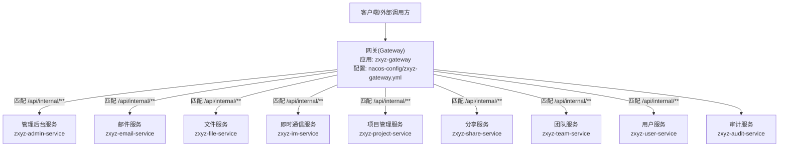
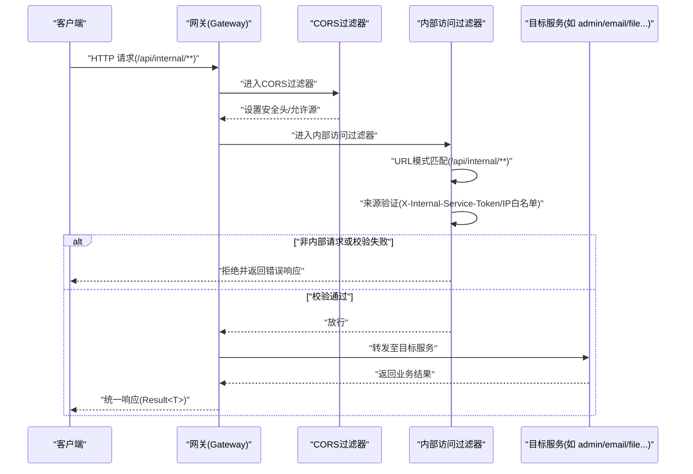
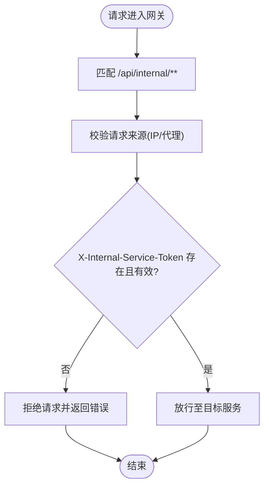
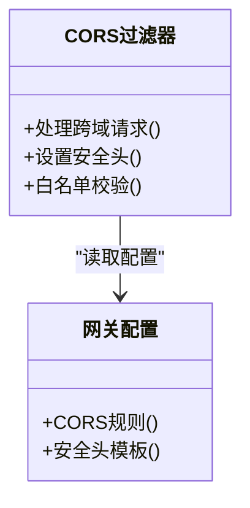
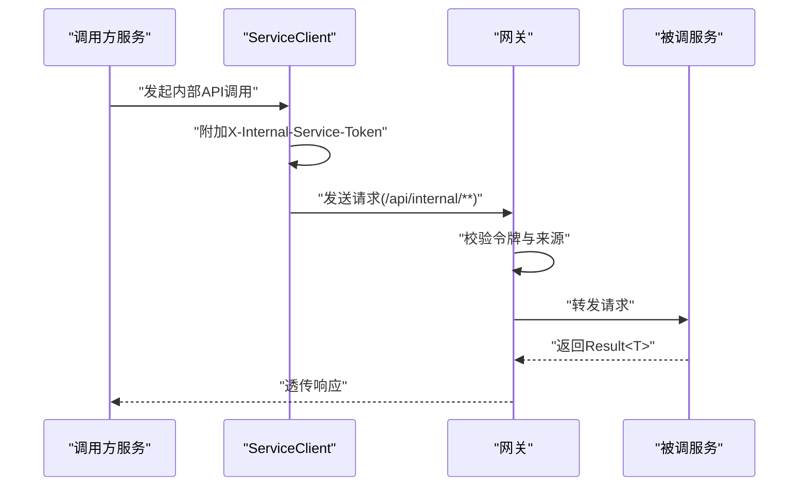
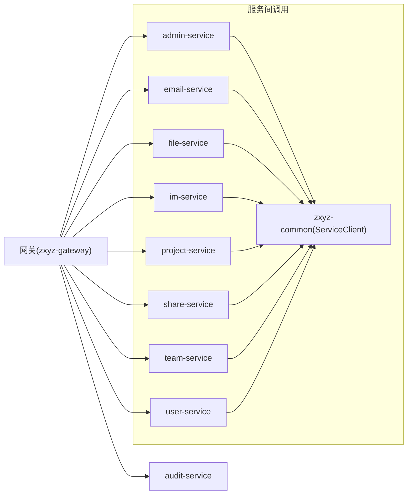

# 内部端点保护策略

<cite>
**本文引用的文件**   
- [zxyz-gateway.yml](file://nacos-config/zxyz-gateway.yml)
- [application.yml](file://ZXYZdatabaseBack/zxyz-gateway/src/main/resources/application.yml)
- [SaTokenFilterConfig.java](file://ZXYZdatabaseBack/zxyz-gateway/src/main/java/uno/acloud/gateway/filter/SaTokenFilterConfig.java)
- [InternalAccessFilter.java](file://ZXYZdatabaseBack/zxyz-gateway/src/main/java/uno/acloud/gateway/filter/InternalAccessFilter.java)
- [CORSFilter.java](file://ZXYZdatabaseBack/zxyz-gateway/src/main/java/uno/acloud/gateway/filter/CORSFilter.java)
- [AdminServiceProperties.java](file://ZXYZdatabaseBack/zxyz-admin-service/src/main/java/uno/acloud/admin/config/AdminServiceProperties.java)
- [RestClientConfig.java](file://ZXYZdatabaseBack/zxyz-admin-service/src/main/java/uno/acloud/admin/config/RestClientConfig.java)
- [EmailProviderClient.java](file://ZXYZdatabaseBack/zxyz-admin-service/src/main/java/uno/acloud/admin/client/EmailProviderClient.java)
- [StorageProviderClient.java](file://ZXYZdatabaseBack/zxyz-admin-service/src/main/java/uno/acloud/admin/client/StorageProviderClient.java)
- [AbstractServiceClient.java](file://ZXYZdatabaseBack/zxyz-common/src/main/java/uno/acloud/client/AbstractServiceClient.java)
- [ConfigServiceClient.java](file://ZXYZdatabaseBack/zxyz-common/src/main/java/uno/acloud/client/ConfigServiceClient.java)
- [TeamServiceClient.java](file://ZXYZdatabaseBack/zxyz-common/src/main/java/uno/acloud/client/TeamServiceClient.java)
- [UserQueryClient.java](file://ZXYZdatabaseBack/zxyz-common/src/main/java/uno/acloud/client/UserQueryClient.java)
- [FileStorageClient.java](file://ZXYZdatabaseBack/zxyz-common/src/main/java/uno/acloud/client/FileStorageClient.java)
- [ServiceResponseParser.java](file://ZXYZdatabaseBack/zxyz-common/src/main/java/uno/acloud/client/ServiceResponseParser.java)
- [api-contract.md](file://docs/api-contract.md)
- [architecture.md](file://docs/architecture.md)
</cite>

## 目录
1. [简介](#简介)
2. [项目结构](#项目结构)
3. [核心组件](#核心组件)
4. [架构总览](#架构总览)
5. [详细组件分析](#详细组件分析)
6. [依赖关系分析](#依赖关系分析)
7. [性能考虑](#性能考虑)
8. [故障排查指南](#故障排查指南)
9. [结论](#结论)
10. [附录](#附录)

## 简介
本文件面向 ZXYZ 项目的内部端点保护策略，聚焦 /api/internal/** 路径的访问控制与网关层防护。内容涵盖：
- URL 模式匹配与请求来源验证
- IP 白名单控制与跨域（CORS）处理
- 基于服务的权限验证、动态路由配置与访问日志记录
- 错误响应格式与常见漏洞防护方案
- 服务端点安全配置最佳实践

## 项目结构
ZXYZ 采用微服务架构，网关层统一对外暴露入口，内部服务通过 /api/internal/** 提供窄接口，并由网关进行严格校验与拦截。Nacos 集中管理各服务配置，包括网关路由、CORS、鉴权与安全头设置。

**图表来源** 
- [zxyz-gateway.yml](file://nacos-config/zxyz-gateway.yml)
- [application.yml](file://ZXYZdatabaseBack/zxyz-gateway/src/main/resources/application.yml)

**章节来源**
- [architecture.md](file://docs/architecture.md)

## 核心组件
- 网关过滤器与配置
  - SaToken 过滤器：用于会话与令牌校验，结合 Nacos 配置实现动态鉴权规则
  - 内部访问过滤器：对 /api/internal/** 进行来源验证、IP 白名单检查与拒绝非内部请求
  - CORS 过滤器：统一处理跨域请求与安全头设置
- 服务间客户端
  - AbstractServiceClient：封装通用 HTTP 客户端能力（重试、超时、签名等）
  - 具体 ServiceClient：为各服务提供窄端点调用，携带 X-Internal-Service-Token 进行服务级鉴权
  - ServiceResponseParser：统一解析响应体，避免反序列化风险

**章节来源**
- [SaTokenFilterConfig.java](file://ZXYZdatabaseBack/zxyz-gateway/src/main/java/uno/acloud/gateway/filter/SaTokenFilterConfig.java)
- [InternalAccessFilter.java](file://ZXYZdatabaseBack/zxyz-gateway/src/main/java/uno/acloud/gateway/filter/InternalAccessFilter.java)
- [CORSFilter.java](file://ZXYZdatabaseBack/zxyz-gateway/src/main/java/uno/acloud/gateway/filter/CORSFilter.java)
- [AbstractServiceClient.java](file://ZXYZdatabaseBack/zxyz-common/src/main/java/uno/acloud/client/AbstractServiceClient.java)
- [ServiceResponseParser.java](file://ZXYZdatabaseBack/zxyz-common/src/main/java/uno/acloud/client/ServiceResponseParser.java)

## 架构总览
下图展示从外部到网关再到内部服务的完整请求流程，重点标注 /api/internal/** 的拦截与校验环节。

**图表来源** 
- [zxyz-gateway.yml](file://nacos-config/zxyz-gateway.yml)
- [InternalAccessFilter.java](file://ZXYZdatabaseBack/zxyz-gateway/src/main/java/uno/acloud/gateway/filter/InternalAccessFilter.java)
- [CORSFilter.java](file://ZXYZdatabaseBack/zxyz-gateway/src/main/java/uno/acloud/gateway/filter/CORSFilter.java)

## 详细组件分析

### 网关层：URL 模式匹配与请求来源验证
- URL 模式匹配
  - 网关在 Nacos 中配置路由规则，将 /api/internal/** 定向到对应内部服务
  - 匹配优先级确保内部端点优先于公共端点处理
- 请求来源验证
  - 内部访问过滤器检查请求是否来自受信任来源（例如内网段、特定代理或反向代理）
  - 校验 X-Internal-Service-Token 头部，确保服务间调用具备有效令牌
  - 若来源不合法或缺少必要头部，直接拒绝并返回标准错误码

**图表来源** 
- [InternalAccessFilter.java](file://ZXYZdatabaseBack/zxyz-gateway/src/main/java/uno/acloud/gateway/filter/InternalAccessFilter.java)
- [zxyz-gateway.yml](file://nacos-config/zxyz-gateway.yml)

**章节来源**
- [InternalAccessFilter.java](file://ZXYZdatabaseBack/zxyz-gateway/src/main/java/uno/acloud/gateway/filter/InternalAccessFilter.java)
- [zxyz-gateway.yml](file://nacos-config/zxyz-gateway.yml)

### 网关层：CORS 配置与安全头设置
- CORS 策略
  - 仅允许受信任的前端域名与内网地址
  - 禁止预检请求滥用，限制方法与头部范围
- 安全头
  - 设置 Strict-Transport-Security、X-Content-Type-Options、X-Frame-Options 等
  - 禁用不必要的缓存与调试信息

**图表来源** 
- [CORSFilter.java](file://ZXYZdatabaseBack/zxyz-gateway/src/main/java/uno/acloud/gateway/filter/CORSFilter.java)
- [application.yml](file://ZXYZdatabaseBack/zxyz-gateway/src/main/resources/application.yml)

**章节来源**
- [CORSFilter.java](file://ZXYZdatabaseBack/zxyz-gateway/src/main/java/uno/acloud/gateway/filter/CORSFilter.java)
- [application.yml](file://ZXYZdatabaseBack/zxyz-gateway/src/main/resources/application.yml)

### 服务间调用：基于服务的权限验证与动态路由
- 权限验证
  - 每个服务客户端在发起请求时附加 X-Internal-Service-Token
  - 网关或服务端校验令牌有效性，确保调用方具备相应权限
- 动态路由
  - 通过 Nacos 配置动态调整路由规则，无需重启服务
  - 支持按环境（dev/prod）切换不同后端实例

**图表来源** 
- [AbstractServiceClient.java](file://ZXYZdatabaseBack/zxyz-common/src/main/java/uno/acloud/client/AbstractServiceClient.java)
- [ConfigServiceClient.java](file://ZXYZdatabaseBack/zxyz-common/src/main/java/uno/acloud/client/ConfigServiceClient.java)
- [TeamServiceClient.java](file://ZXYZdatabaseBack/zxyz-common/src/main/java/uno/acloud/client/TeamServiceClient.java)
- [UserQueryClient.java](file://ZXYZdatabaseBack/zxyz-common/src/main/java/uno/acloud/client/UserQueryClient.java)
- [FileStorageClient.java](file://ZXYZdatabaseBack/zxyz-common/src/main/java/uno/acloud/client/FileStorageClient.java)
- [ServiceResponseParser.java](file://ZXYZdatabaseBack/zxyz-common/src/main/java/uno/acloud/client/ServiceResponseParser.java)

**章节来源**
- [AbstractServiceClient.java](file://ZXYZdatabaseBack/zxyz-common/src/main/java/uno/acloud/client/AbstractServiceClient.java)
- [ConfigServiceClient.java](file://ZXYZdatabaseBack/zxyz-common/src/main/java/uno/acloud/client/ConfigServiceClient.java)
- [TeamServiceClient.java](file://ZXYZdatabaseBack/zxyz-common/src/main/java/uno/acloud/client/TeamServiceClient.java)
- [UserQueryClient.java](file://ZXYZdatabaseBack/zxyz-common/src/main/java/uno/acloud/client/UserQueryClient.java)
- [FileStorageClient.java](file://ZXYZdatabaseBack/zxyz-common/src/main/java/uno/acloud/client/FileStorageClient.java)
- [ServiceResponseParser.java](file://ZXYZdatabaseBack/zxyz-common/src/main/java/uno/acloud/client/ServiceResponseParser.java)

### 访问日志记录与审计
- 网关层记录关键请求元数据（时间、来源IP、目标服务、耗时）
- 敏感操作在服务层记录审计日志，便于追踪与合规
- 日志聚合至 ELK 或类似系统，支持告警与审计报表

**章节来源**
- [api-contract.md](file://docs/api-contract.md)

## 依赖关系分析
网关与各服务之间的依赖关系由 Nacos 配置驱动，运行时动态加载。服务间调用通过 ServiceClient 抽象层解耦，降低耦合度并提升可维护性。

**图表来源** 
- [zxyz-gateway.yml](file://nacos-config/zxyz-gateway.yml)
- [AbstractServiceClient.java](file://ZXYZdatabaseBack/zxyz-common/src/main/java/uno/acloud/client/AbstractServiceClient.java)

**章节来源**
- [zxyz-gateway.yml](file://nacos-config/zxyz-gateway.yml)
- [AbstractServiceClient.java](file://ZXYZdatabaseBack/zxyz-common/src/main/java/uno/acloud/client/AbstractServiceClient.java)

## 性能考虑
- 网关过滤器应轻量高效，避免阻塞主线程
- 使用连接池与超时控制优化 HTTP 客户端性能
- 合理设置缓存策略，减少重复计算与数据库压力
- 监控关键指标（QPS、延迟、错误率），及时扩容与优化

[本节为通用指导，无需引用具体文件]

## 故障排查指南
- 常见问题
  - 403 禁止访问：检查 X-Internal-Service-Token 是否正确传递
  - 404 未找到：确认 Nacos 路由配置是否生效
  - 跨域错误：核对 CORS 白名单与安全头设置
- 排查步骤
  - 查看网关日志，定位请求是否被过滤器拦截
  - 检查服务健康状态与注册中心信息
  - 使用 curl 或 Postman 模拟内部请求，验证令牌与来源

**章节来源**
- [api-contract.md](file://docs/api-contract.md)

## 结论
通过对 /api/internal/** 的严格保护与网关层的多重校验，ZXYZ 项目实现了安全的内部端点访问控制。结合 Nacos 动态配置与服务间令牌鉴权，系统在灵活性与安全性之间取得平衡。建议持续监控与审计，确保安全策略随业务演进而更新。

[本节为总结性内容，无需引用具体文件]

## 附录
- 最佳实践
  - 最小权限原则：仅授予必要的服务间访问权限
  - 密钥管理：使用 Jasypt 加密敏感配置，定期轮换令牌
  - 输入验证：对所有输入进行严格校验，防止注入攻击
  - 输出编码：避免敏感信息泄露，统一错误响应格式
- 常见漏洞防护
  - CSRF 防护：启用 SameSite Cookie 与 CSRF Token
  - XSS 防护：输出编码与 CSP 策略
  - 暴力破解：限流与账户锁定机制
  - 中间人攻击：强制 HTTPS 与证书校验

[本节为通用指导，无需引用具体文件]