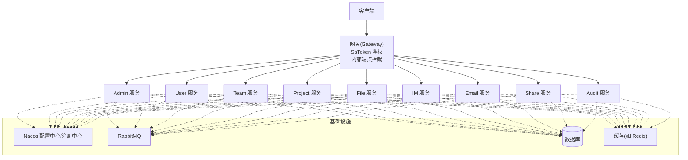
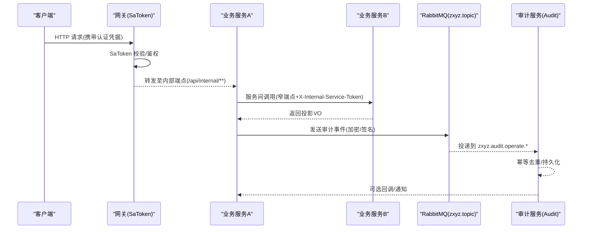
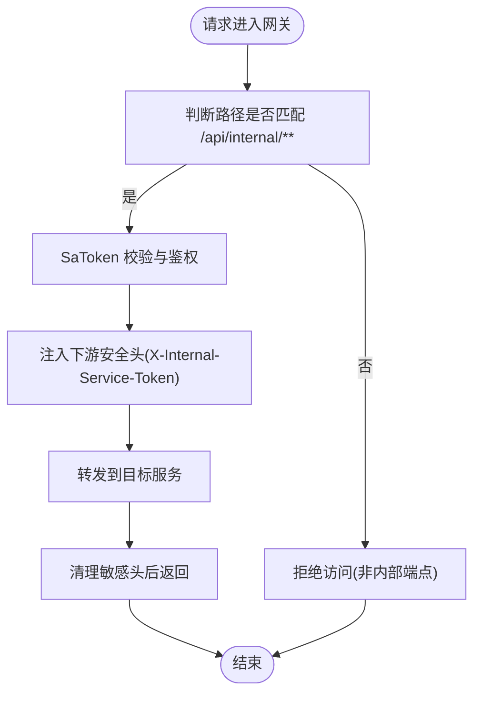
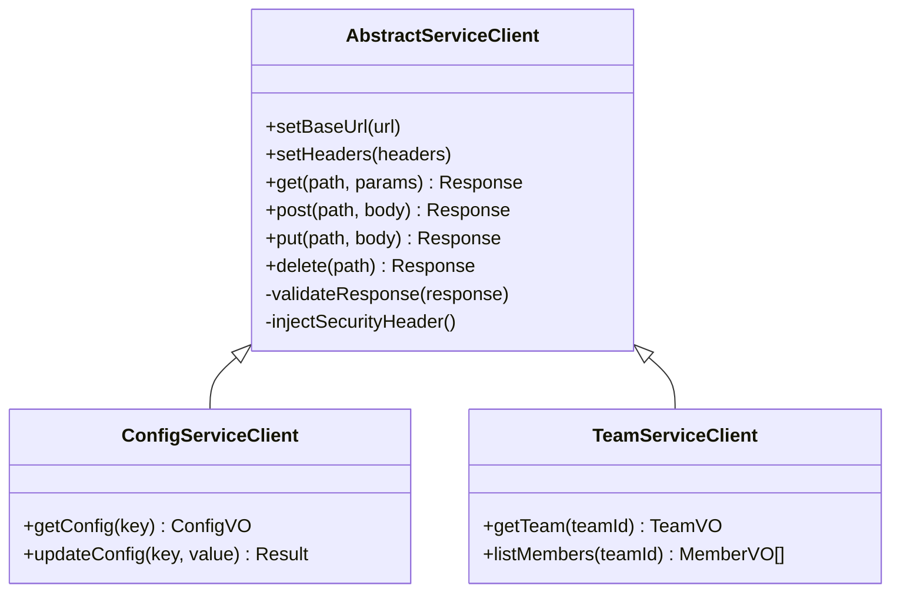
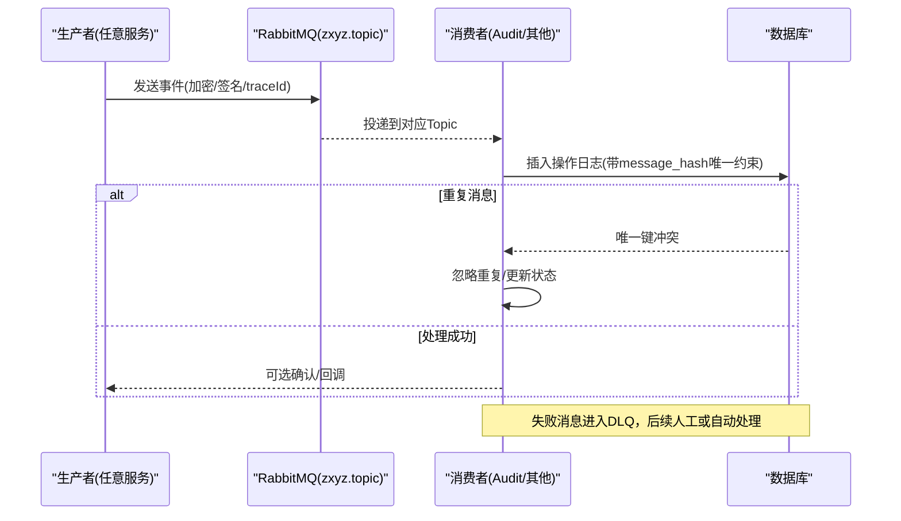
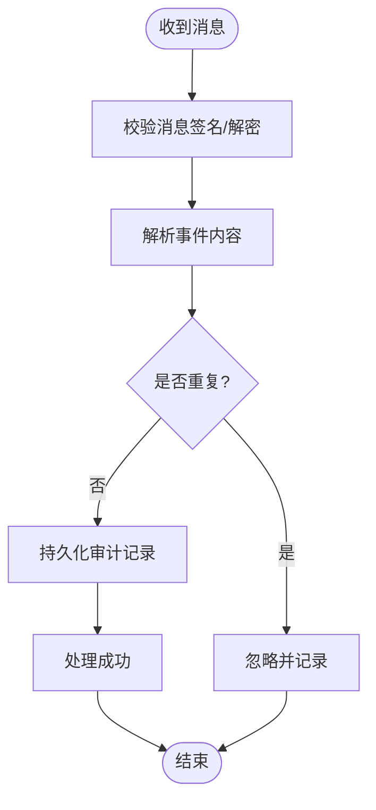
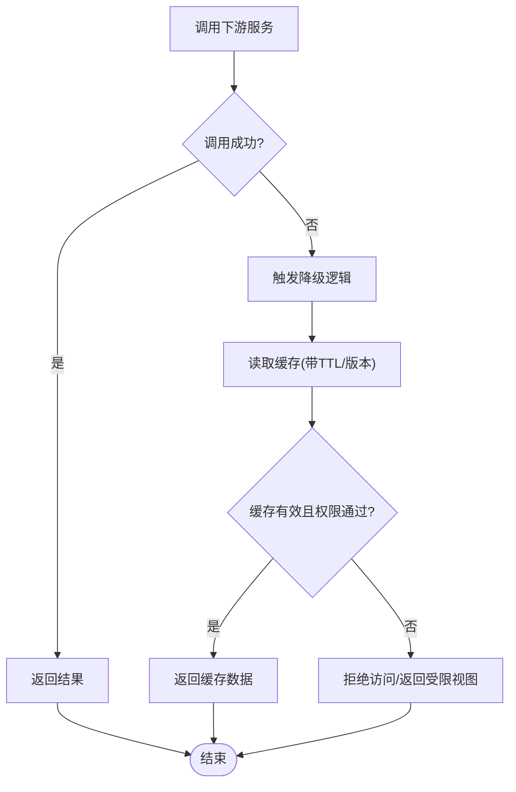
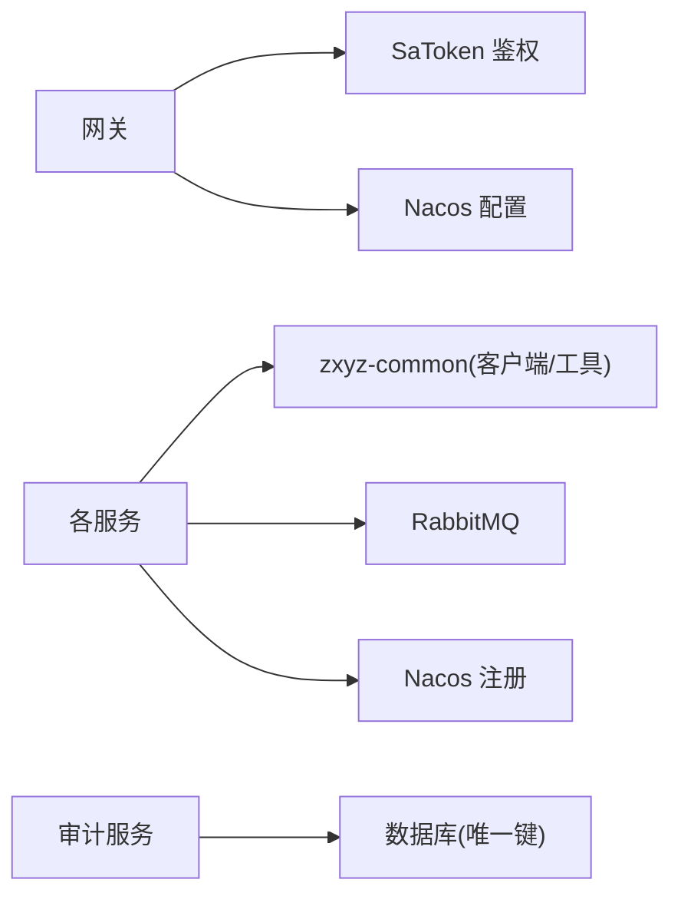

# 微服务通信安全

<cite>
**本文引用的文件**   
- [zxyz-gateway/src/main/java/uno/acloud/gateway/filter/SaTokenFilterConfig.java](file://ZXYZdatabaseBack/zxyz-gateway/src/main/java/uno/acloud/gateway/filter/SaTokenFilterConfig.java)
- [zxyz-common/src/main/java/uno/acloud/client/AbstractServiceClient.java](file://ZXYZdatabaseBack/zxyz-common/src/main/java/uno/acloud/client/AbstractServiceClient.java)
- [zxyz-common/src/main/java/uno/acloud/common/mq/AuditEventPublisher.java](file://ZXYZdatabaseBack/zxyz-common/src/main/java/uno/acloud/common/mq/AuditEventPublisher.java)
- [zxyz-audit-service/src/main/java/uno/acloud/audit/config/RabbitMqConfig.java](file://ZXYZdatabaseBack/zxyz-audit-service/src/main/java/uno/acloud/audit/config/RabbitMqConfig.java)
- [zxyz-audit-service/src/main/java/uno/acloud/audit/mq/OperateLogConsumer.java](file://ZXYZdatabaseBack/zxyz-audit-service/src/main/java/uno/acloud/audit/mq/OperateLogConsumer.java)
- [zxyz-audit-service/src/main/java/uno/acloud/audit/mq/AuditDlqConsumer.java](file://ZXYZdatabaseBack/zxyz-audit-service/src/main/java/uno/acloud/audit/mq/AuditDlqConsumer.java)
- [zxyz-audit-service/src/main/resources/db/migration/V3__add_message_hash_unique.sql](file://ZXYZdatabaseBack/zxyz-audit-service/src/main/resources/db/migration/V3__add_message_hash_unique.sql)
- [zxyz-common/src/main/java/uno/acloud/satoken/SaTokenContextUtil.java](file://ZXYZdatabaseBack/zxyz-common/src/main/java/uno/acloud/satoken/SaTokenContextUtil.java)
- [nacos-config/zxyz-static.yml](file://nacos-config/zxyz-static.yml)
- [nacos-config/zxyz-dynamic.yml](file://nacos-config/zxyz-dynamic.yml)
- [docker-compose.yml](file://docker-compose.yml)
- [deploy/nginx/default.conf](file://deploy/nginx/default.conf)
- [scripts/health-check.sh](file://scripts/health-check.sh)
</cite>

## 目录
1. [引言](#引言)
2. [项目结构](#项目结构)
3. [核心组件](#核心组件)
4. [架构总览](#架构总览)
5. [详细组件分析](#详细组件分析)
6. [依赖分析](#依赖分析)
7. [性能考虑](#性能考虑)
8. [故障排查指南](#故障排查指南)
9. [结论](#结论)
10. [附录](#附录)

## 引言
本文件面向 ZXYZ 项目的微服务通信安全，覆盖以下关键主题：
- 服务注册发现中的安全信息传递：服务元数据加密、健康检查安全、负载均衡时的上下文保持
- 异步通信安全保障：RabbitMQ 消息加密、Topic 权限控制、死信队列安全处理
- 熔断降级时的安全处理：降级策略中的安全校验、缓存数据的时效性、故障恢复时的权限验证
- 提供架构图、消息流转图与故障场景处理方案
- 给出监控指标、日志记录与审计追踪方案

## 项目结构
ZXYZ 采用多模块 Maven 工程（后端 11 个服务 + 前端 Vue），通过 Nacos 进行配置与服务治理，Gateway 统一鉴权与路由，RabbitMQ 承载异步事件。内部端点以 /api/internal/** 前缀暴露，并由 Gateway 的 SaToken 过滤器拒绝公网访问。



图表来源
- [docker-compose.yml](file://docker-compose.yml)
- [deploy/nginx/default.conf](file://deploy/nginx/default.conf)

章节来源
- [docker-compose.yml](file://docker-compose.yml)
- [deploy/nginx/default.conf](file://deploy/nginx/default.conf)

## 核心组件
- 网关与鉴权：Gateway 集成 SaToken，负责统一鉴权、内部端点拦截、跨服务上下文透传
- 服务间同步调用：基于 zxyz-common 的 ServiceClient（继承 AbstractServiceClient）实现窄端点调用与令牌注入
- 异步消息：RabbitMQ Topic Exchange（zxyz.topic），生产方使用统一发布器，消费方按 Topic 订阅并幂等处理
- 配置与安全：Nacos 管理动态配置，Jasypt 加密敏感项；静态配置集中化

章节来源
- [zxyz-gateway/src/main/java/uno/acloud/gateway/filter/SaTokenFilterConfig.java](file://ZXYZdatabaseBack/zxyz-gateway/src/main/java/uno/acloud/gateway/filter/SaTokenFilterConfig.java)
- [zxyz-common/src/main/java/uno/acloud/client/AbstractServiceClient.java](file://ZXYZdatabaseBack/zxyz-common/src/main/java/uno/acloud/client/AbstractServiceClient.java)
- [zxyz-common/src/main/java/uno/acloud/common/mq/AuditEventPublisher.java](file://ZXYZdatabaseBack/zxyz-common/src/main/java/uno/acloud/common/mq/AuditEventPublisher.java)
- [zxyz-audit-service/src/main/java/uno/acloud/audit/config/RabbitMqConfig.java](file://ZXYZdatabaseBack/zxyz-audit-service/src/main/java/uno/acloud/audit/config/RabbitMqConfig.java)
- [nacos-config/zxyz-static.yml](file://nacos-config/zxyz-static.yml)
- [nacos-config/zxyz-dynamic.yml](file://nacos-config/zxyz-dynamic.yml)

## 架构总览
下图展示从请求进入网关到服务间同步/异步调用的整体流程，以及安全边界与控制点。



图表来源
- [zxyz-gateway/src/main/java/uno/acloud/gateway/filter/SaTokenFilterConfig.java](file://ZXYZdatabaseBack/zxyz-gateway/src/main/java/uno/acloud/gateway/filter/SaTokenFilterConfig.java)
- [zxyz-common/src/main/java/uno/acloud/client/AbstractServiceClient.java](file://ZXYZdatabaseBack/zxyz-common/src/main/java/uno/acloud/client/AbstractServiceClient.java)
- [zxyz-common/src/main/java/uno/acloud/common/mq/AuditEventPublisher.java](file://ZXYZdatabaseBack/zxyz-common/src/main/java/uno/acloud/common/mq/AuditEventPublisher.java)
- [zxyz-audit-service/src/main/java/uno/acloud/audit/config/RabbitMqConfig.java](file://ZXYZdatabaseBack/zxyz-audit-service/src/main/java/uno/acloud/audit/config/RabbitMqConfig.java)

## 详细组件分析

### 网关与上下文透传（SaToken）
- 职责：统一鉴权、内部端点拦截、跨服务上下文透传（用户/租户/会话）
- 关键点：
  - 仅允许内网访问 /api/internal/**，外部直接拒绝
  - 将 SaToken 上下文转换为下游服务可识别的安全头（如 X-Internal-Service-Token）
  - 在响应阶段清理敏感头，避免泄露



图表来源
- [zxyz-gateway/src/main/java/uno/acloud/gateway/filter/SaTokenFilterConfig.java](file://ZXYZdatabaseBack/zxyz-gateway/src/main/java/uno/acloud/gateway/filter/SaTokenFilterConfig.java)

章节来源
- [zxyz-gateway/src/main/java/uno/acloud/gateway/filter/SaTokenFilterConfig.java](file://ZXYZdatabaseBack/zxyz-gateway/src/main/java/uno/acloud/gateway/filter/SaTokenFilterConfig.java)

### 服务间同步调用（ServiceClient + Token）
- 职责：封装对下游服务的窄端点调用，自动注入安全令牌，限制响应为投影 VO
- 关键点：
  - 继承 AbstractServiceClient，统一设置超时、重试、错误码映射
  - 自动附加 X-Internal-Service-Token，确保调用方身份可信
  - 禁止返回“胖 DTO”，只返回调用方所需的 Projection VO



图表来源
- [zxyz-common/src/main/java/uno/acloud/client/AbstractServiceClient.java](file://ZXYZdatabaseBack/zxyz-common/src/main/java/uno/acloud/client/AbstractServiceClient.java)

章节来源
- [zxyz-common/src/main/java/uno/acloud/client/AbstractServiceClient.java](file://ZXYZdatabaseBack/zxyz-common/src/main/java/uno/acloud/client/AbstractServiceClient.java)

### 异步通信（RabbitMQ Topic 与幂等）
- 职责：跨服务事件驱动，审计与解耦
- 关键点：
  - Topic Exchange：zxyz.topic，按 zxyz.{domain}.{action}.* 命名空间隔离
  - 消息体加密与签名：防止篡改与窃听
  - 幂等处理：基于消息哈希唯一键去重（数据库约束）
  - 死信队列：失败消息入 DLQ，人工或自动化复核



图表来源
- [zxyz-common/src/main/java/uno/acloud/common/mq/AuditEventPublisher.java](file://ZXYZdatabaseBack/zxyz-common/src/main/java/uno/acloud/common/mq/AuditEventPublisher.java)
- [zxyz-audit-service/src/main/java/uno/acloud/audit/config/RabbitMqConfig.java](file://ZXYZdatabaseBack/zxyz-audit-service/src/main/java/uno/acloud/audit/config/RabbitMqConfig.java)
- [zxyz-audit-service/src/main/resources/db/migration/V3__add_message_hash_unique.sql](file://ZXYZdatabaseBack/zxyz-audit-service/src/main/resources/db/migration/V3__add_message_hash_unique.sql)

章节来源
- [zxyz-common/src/main/java/uno/acloud/common/mq/AuditEventPublisher.java](file://ZXYZdatabaseBack/zxyz-common/src/main/java/uno/acloud/common/mq/AuditEventPublisher.java)
- [zxyz-audit-service/src/main/java/uno/acloud/audit/config/RabbitMqConfig.java](file://ZXYZdatabaseBack/zxyz-aircuit/config/RabbitMqConfig.java)
- [zxyz-audit-service/src/main/resources/db/migration/V3__add_message_hash_unique.sql](file://ZXYZdatabaseBack/zxyz-audit-service/src/main/resources/db/migration/V3__add_message_hash_unique.sql)

### 审计与死信队列（DLQ）
- 职责：审计日志落库、异常兜底、合规审计
- 关键点：
  - OperateLogConsumer：消费 zxyz.audit.operate.*，写入审计表
  - AuditDlqConsumer：消费 DLQ，告警与人工介入
  - 唯一键约束：message_hash 防重放



图表来源
- [zxyz-audit-service/src/main/java/uno/acloud/audit/mq/OperateLogConsumer.java](file://ZXYZdatabaseBack/zxyz-audit-service/src/main/java/uno/acloud/audit/mq/OperateLogConsumer.java)
- [zxyz-audit-service/src/main/java/uno/acloud/audit/mq/AuditDlqConsumer.java](file://ZXYZdatabaseBack/zxyz-audit-service/src/main/java/uno/acloud/audit/mq/AuditDlqConsumer.java)
- [zxyz-audit-service/src/main/resources/db/migration/V3__add_message_hash_unique.sql](file://ZXYZdatabaseBack/zxyz-audit-service/src/main/resources/db/migration/V3__add_message_hash_unique.sql)

章节来源
- [zxyz-audit-service/src/main/java/uno/acloud/audit/mq/OperateLogConsumer.java](file://ZXYZdatabaseBack/zxyz-audit-service/src/main/java/uno/acloud/audit/mq/OperateLogConsumer.java)
- [zxyz-audit-service/src/main/java/uno/acloud/audit/mq/AuditDlqConsumer.java](file://ZXYZdatabaseBack/zxyz-audit-service/src/main/java/uno/acloud/audit/mq/AuditDlqConsumer.java)
- [zxyz-audit-service/src/main/resources/db/migration/V3__add_message_hash_unique.sql](file://ZXYZdatabaseBack/zxyz-audit-service/src/main/resources/db/migration/V3__add_message_hash_unique.sql)

### 上下文保持与负载均衡
- 上下文保持：通过网关注入 X-Internal-Service-Token，下游服务解析并复用用户/租户上下文
- 负载均衡：Nacos 注册的服务实例由客户端侧或网关层均衡，保证每次调用上下文一致
- 健康检查：服务启动时上报健康状态，异常时剔除实例

```mermaid
sequenceDiagram
participant LB as "负载均衡(Nacos/Gateway)"
participant S as "服务实例A"
participant T as "服务实例B"
participant H as "健康检查"
H->>S : 健康探测
S-->>H : 健康OK
H->>T : 健康探测
T-->>H : 健康异常
LB-->>S : 流量分发(仅健康实例)
Note over LB,S,T : 上下文随请求头透传，不依赖连接状态
```

图表来源
- [nacos-config/zxyz-static.yml](file://nacos-config/zxyz-static.yml)
- [nacos-config/zxyz-dynamic.yml](file://nacos-config/zxyz-dynamic.yml)
- [scripts/health-check.sh](file://scripts/health-check.sh)

章节来源
- [nacos-config/zxyz-static.yml](file://nacos-config/zxyz-static.yml)
- [nacos-config/zxyz-dynamic.yml](file://nacos-config/zxyz-dynamic.yml)
- [scripts/health-check.sh](file://scripts/health-check.sh)

### 熔断降级与缓存安全
- 降级策略：当下游不可用时，启用缓存或默认值，但需进行安全校验（如权限、范围）
- 缓存时效：短 TTL + 版本号/时间戳，避免过期数据长期生效
- 恢复验证：服务恢复后重新校验权限与数据一致性，必要时刷新缓存



图表来源
- [zxyz-common/src/main/java/uno/acloud/client/AbstractServiceClient.java](file://ZXYZdatabaseBack/zxyz-common/src/main/java/uno/acloud/client/AbstractServiceClient.java)
- [zxyz-common/src/main/java/uno/acloud/satoken/SaTokenContextUtil.java](file://ZXYZdatabaseBack/zxyz-common/src/main/java/uno/acloud/satoken/SaTokenContextUtil.java)

章节来源
- [zxyz-common/src/main/java/uno/acloud/client/AbstractServiceClient.java](file://ZXYZdatabaseBack/zxyz-common/src/main/java/uno/acloud/client/AbstractServiceClient.java)
- [zxyz-common/src/main/java/uno/acloud/satoken/SaTokenContextUtil.java](file://ZXYZdatabaseBack/zxyz-common/src/main/java/uno/acloud/satoken/SaTokenContextUtil.java)

## 依赖分析
- 网关依赖 SaToken 与 Nacos 配置，拦截内部端点并注入安全头
- 服务间调用依赖 zxyz-common 的抽象客户端，统一安全头与错误处理
- 异步通信依赖 RabbitMQ 配置与消费者，审计服务依赖数据库唯一键约束
- 配置中心 Nacos 统一管理静态与动态配置，支持热更新



图表来源
- [zxyz-gateway/src/main/java/uno/acloud/gateway/filter/SaTokenFilterConfig.java](file://ZXYZdatabaseBack/zxyz-gateway/src/main/java/uno/acloud/gateway/filter/SaTokenFilterConfig.java)
- [zxyz-common/src/main/java/uno/acloud/client/AbstractServiceClient.java](file://ZXYZdatabaseBack/zxyz-common/src/main/java/uno/acloud/client/AbstractServiceClient.java)
- [zxyz-audit-service/src/main/resources/db/migration/V3__add_message_hash_unique.sql](file://ZXYZdatabaseBack/zxyz-audit-service/src/main/resources/db/migration/V3__add_message_hash_unique.sql)

章节来源
- [zxyz-gateway/src/main/java/uno/acloud/gateway/filter/SaTokenFilterConfig.java](file://ZXYZdatabaseBack/zxyz-gateway/src/main/java/uno/acloud/gateway/filter/SaTokenFilterConfig.java)
- [zxyz-common/src/main/java/uno/acloud/client/AbstractServiceClient.java](file://ZXYZdatabaseBack/zxyz-common/src/main/java/uno/acloud/client/AbstractServiceClient.java)
- [zxyz-audit-service/src/main/resources/db/migration/V3__add_message_hash_unique.sql](file://ZXYZdatabaseBack/zxyz-audit-service/src/main/resources/db/migration/V3__add_message_hash_unique.sql)

## 性能考虑
- 服务间调用：合理设置超时与重试次数，避免雪崩；优先使用投影 VO 减少序列化开销
- 消息处理：批量消费与异步落库，提升吞吐；DLQ 独立线程池隔离
- 缓存：热点数据短 TTL，配合版本号失效；避免大对象缓存
- 健康检查：轻量探测，避免频繁 IO

## 故障排查指南
- 网关鉴权失败：检查 SaToken 配置与 Cookie/Session；确认内部端点未被公网访问
- 服务间调用异常：查看 X-Internal-Service-Token 是否正确注入；核对下游窄端点权限
- 消息重复/丢失：检查 message_hash 唯一键；观察 DLQ 堆积情况
- 健康检查失败：查看服务日志与资源占用；确认端口与依赖可用

章节来源
- [zxyz-gateway/src/main/java/uno/acloud/gateway/filter/SaTokenFilterConfig.java](file://ZXYZdatabaseBack/zxyz-gateway/src/main/java/uno/acloud/gateway/filter/SaTokenFilterConfig.java)
- [zxyz-audit-service/src/main/resources/db/migration/V3__add_message_hash_unique.sql](file://ZXYZdatabaseBack/zxyz-audit-service/src/main/resources/db/migration/V3__add_message_hash_unique.sql)
- [scripts/health-check.sh](file://scripts/health-check.sh)

## 结论
ZXYZ 的微服务通信安全围绕“网关鉴权 + 内部令牌 + 窄端点 + 消息加密与幂等 + 健康检查与熔断”构建。通过统一的客户端与发布器，降低安全实现差异；通过 Nacos 与 Docker Compose 保障部署与配置一致性。建议持续完善监控与审计，确保可观测性与合规性。

## 附录
- 监控指标建议：
  - 网关：鉴权成功率、内部端点访问频率、拒绝率
  - 服务调用：成功率、延迟分布、超时率、重试次数
  - 消息：投递成功率、消费延迟、DLQ 堆积量、重复率
  - 健康检查：实例健康比例、健康检查失败次数
- 日志记录建议：
  - 全链路 traceId 透传
  - 敏感字段脱敏（手机号、邮箱、密钥）
  - 审计事件包含操作主体、对象、时间、IP、结果
- 审计追踪方案：
  - 所有写操作与敏感读操作入审计队列
  - 审计表具备唯一键与索引，便于检索与导出
  - DLQ 消息纳入审计看板，定期巡检