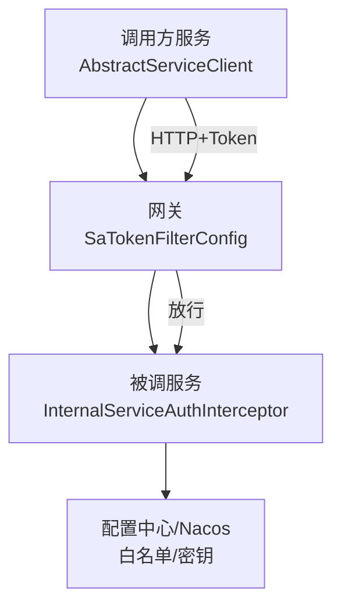
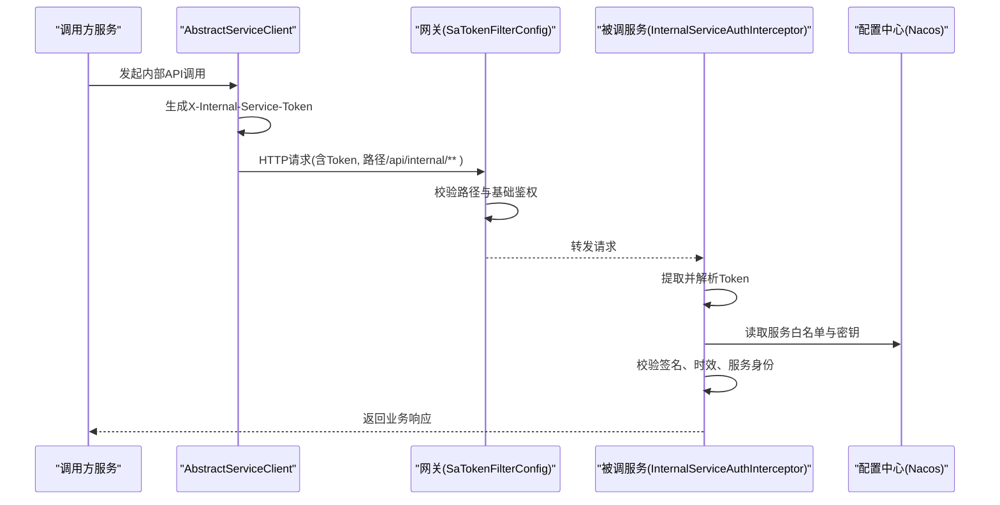
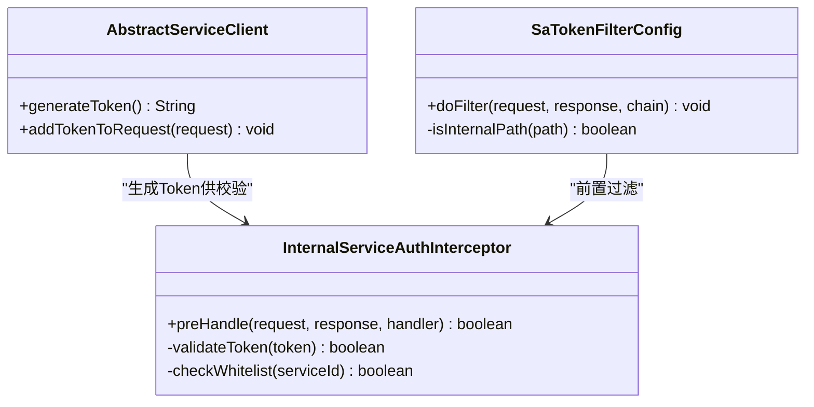

# 服务Token验证机制

<cite>
**本文引用的文件**   
- [SaTokenFilterConfig.java](file://ZXYZdatabaseBack/zxyz-gateway/src/main/java/uno/acloud/gateway/filter/SaTokenFilterConfig.java)
- [InternalServiceAuthInterceptor.java](file://ZXYZdatabaseBack/zxyz-common/src/main/java/uno/acloud/common/satoken/InternalServiceAuthInterceptor.java)
- [AbstractServiceClient.java](file://ZXYZdatabaseBack/zxyz-common/src/main/java/uno/acloud/client/AbstractServiceClient.java)
- [application.yml（网关）](file://ZXYZdatabaseBack/zxyz-gateway/src/main/resources/application.yml)
- [zxyz-gateway.yml（Nacos配置）](file://nacos-config/zxyz-gateway.yml)
- [application.yml（公共配置）](file://ZXYZdatabaseBack/zxyz-common/src/main/resources/application-common.yml)
- [api-contract.md](file://docs/api-contract.md)
- [architecture.md](file://docs/architecture.md)
</cite>

## 目录
1. [简介](#简介)
2. [项目结构](#项目结构)
3. [核心组件](#核心组件)
4. [架构总览](#架构总览)
5. [详细组件分析](#详细组件分析)
6. [依赖关系分析](#依赖关系分析)
7. [性能考虑](#性能考虑)
8. [故障排查指南](#故障排查指南)
9. [结论](#结论)
10. [附录](#附录)

## 简介
本文件面向ZXYZ微服务项目的“服务间安全调用”机制，聚焦X-Internal-Service-Token头部的设计原理、生成算法与验证流程。文档围绕以下关键点展开：
- X-Internal-Service-Token的语义、结构与签名算法
- InternalServiceAuthInterceptor拦截器在业务服务侧的工作机制（Token提取、签名校验、服务白名单检查）
- SaTokenFilterConfig在网关层的配置与作用（阻止外部请求访问内部端点/api/internal/**）
- Token生命周期管理、密钥轮换策略、验证失败处理逻辑
- 完整流程图与代码示例路径，指导如何正确实现服务间的安全调用

本项目采用“窄端点 + 投影模式”的服务间通信约定：内部接口返回调用方专用的Projection VO，避免胖DTO泄露；所有内部调用必须携带X-Internal-Service-Token并通过网关与业务服务双重校验。

## 项目结构
与Token验证相关的关键位置如下：
- 网关层：SaTokenFilterConfig负责拦截/api/internal/**路径，拒绝公网直接访问
- 公共模块：InternalServiceAuthInterceptor负责在服务侧解析并校验X-Internal-Service-Token
- 客户端基类：AbstractServiceClient负责为每次内部调用注入Token
- Nacos配置：zxyz-gateway.yml与application-common.yml集中管理白名单、密钥等敏感配置
- API契约与架构文档：明确内部端点前缀与鉴权策略

图表来源
- [SaTokenFilterConfig.java](file://ZXYZdatabaseBack/zxyz-gateway/src/main/java/uno/acloud/gateway/filter/SaTokenFilterConfig.java)
- [InternalServiceAuthInterceptor.java](file://ZXYZdatabaseBack/zxyz-common/src/main/java/uno/acloud/common/satoken/InternalServiceAuthInterceptor.java)
- [AbstractServiceClient.java](file://ZXYZdatabaseBack/zxyz-common/src/main/java/uno/acloud/client/AbstractServiceClient.java)
- [zxyz-gateway.yml（Nacos配置）](file://nacos-config/zxyz-gateway.yml)

章节来源
- [api-contract.md](file://docs/api-contract.md)
- [architecture.md](file://docs/architecture.md)

## 核心组件
- X-Internal-Service-Token头部
  - 作用：标识一次可信的内部服务调用，包含服务身份、时间戳、随机串与签名
  - 结构建议：{serviceId}.{timestamp}.{nonce}.{signature}
  - 签名算法：HMAC-SHA256(或更强)，使用共享密钥对“serviceId.timestamp.nonce”进行签名
- InternalServiceAuthInterceptor（服务侧拦截器）
  - 职责：从请求头提取Token，校验签名、时效、服务白名单，设置上下文供后续业务使用
- AbstractServiceClient（客户端基类）
  - 职责：统一构造X-Internal-Service-Token，注入到每个内部HTTP请求中
- SaTokenFilterConfig（网关过滤器）
  - 职责：拦截/api/internal/**，拒绝无Token或非法Token的请求，仅允许受信任服务通过

章节来源
- [InternalServiceAuthInterceptor.java](file://ZXYZdatabaseBack/zxyz-common/src/main/java/uno/acloud/common/satoken/InternalServiceAuthInterceptor.java)
- [AbstractServiceClient.java](file://ZXYZdatabaseBack/zxyz-common/src/main/java/uno/acloud/client/AbstractServiceClient.java)
- [SaTokenFilterConfig.java](file://ZXYZdatabaseBack/zxyz-gateway/src/main/java/uno/acloud/gateway/filter/SaTokenFilterConfig.java)

## 架构总览
下图展示了一次完整的内部服务调用流程，包括网关过滤与服务侧拦截器的协作：

图表来源
- [AbstractServiceClient.java](file://ZXYZdatabaseBack/zxyz-common/src/main/java/uno/acloud/client/AbstractServiceClient.java)
- [SaTokenFilterConfig.java](file://ZXYZdatabaseBack/zxyz-gateway/src/main/java/uno/acloud/gateway/filter/SaTokenFilterConfig.java)
- [InternalServiceAuthInterceptor.java](file://ZXYZdatabaseBack/zxyz-common/src/main/java/uno/acloud/common/satoken/InternalServiceAuthInterceptor.java)
- [zxyz-gateway.yml（Nacos配置）](file://nacos-config/zxyz-gateway.yml)

## 详细组件分析

### X-Internal-Service-Token设计与生成
- 设计原则
  - 唯一性：结合serviceId、timestamp、nonce确保不可重放
  - 可验证性：服务端可通过共享密钥验证签名
  - 最小暴露：不携带敏感业务数据，仅承载身份与完整性信息
- 生成步骤（客户端）
  - 获取当前服务ID与共享密钥
  - 生成时间戳与随机数
  - 计算签名：HMAC-SHA256("serviceId.timestamp.nonce", secret)
  - 拼接Token字符串并放入请求头X-Internal-Service-Token
- 参考实现位置
  - 客户端基类：[AbstractServiceClient.java](file://ZXYZdatabaseBack/zxyz-common/src/main/java/uno/acloud/client/AbstractServiceClient.java)

章节来源
- [AbstractServiceClient.java](file://ZXYZdatabaseBack/zxyz-common/src/main/java/uno/acloud/client/AbstractServiceClient.java)

### InternalServiceAuthInterceptor拦截器工作机制
- 工作流程
  - 提取请求头X-Internal-Service-Token
  - 解析Token字段（serviceId、timestamp、nonce、signature）
  - 校验时效（防重放）：比较timestamp与当前时间的差值
  - 校验签名：使用共享密钥对“serviceId.timestamp.nonce”进行HMAC校验
  - 白名单检查：确认serviceId在白名单中
  - 设置上下文：将服务身份写入线程上下文，供后续业务使用
- 错误处理
  - 缺失Token：直接拒绝
  - 签名失败：记录审计日志并拒绝
  - 不在白名单：拒绝并告警
  - 过期：拒绝并提示重试
- 参考实现位置
  - 服务侧拦截器：[InternalServiceAuthInterceptor.java](file://ZXYZdatabaseBack/zxyz-common/src/main/java/uno/acloud/common/satoken/InternalServiceAuthInterceptor.java)

章节来源
- [InternalServiceAuthInterceptor.java](file://ZXYZdatabaseBack/zxyz-common/src/main/java/uno/acloud/common/satoken/InternalServiceAuthInterceptor.java)

### SaTokenFilterConfig网关层配置与作用
- 作用范围
  - 拦截/api/internal/**路径，阻止公网直接访问内部端点
  - 作为第一道防线，快速拒绝非法请求，减轻后端压力
- 校验要点
  - 路径匹配：仅对内部端点进行严格校验
  - 基础鉴权：可结合Sa-Token框架进行会话或令牌校验
  - 转发策略：通过则转发至对应服务，否则返回403
- 配置位置
  - 网关应用配置：[application.yml（网关）](file://ZXYZdatabaseBack/zxyz-gateway/src/main/resources/application.yml)
  - Nacos动态配置：[zxyz-gateway.yml（Nacos配置）](file://nacos-config/zxyz-gateway.yml)
- 参考实现位置
  - 网关过滤器：[SaTokenFilterConfig.java](file://ZXYZdatabaseBack/zxyz-gateway/src/main/java/uno/acloud/gateway/filter/SaTokenFilterConfig.java)

章节来源
- [SaTokenFilterConfig.java](file://ZXYZdatabaseBack/zxyz-gateway/src/main/java/uno/acloud/gateway/filter/SaTokenFilterConfig.java)
- [application.yml（网关）](file://ZXYZdatabaseBack/zxyz-gateway/src/main/resources/application.yml)
- [zxyz-gateway.yml（Nacos配置）](file://nacos-config/zxyz-gateway.yml)

### Token生命周期管理与密钥轮换
- 生命周期
  - 生成：客户端每次调用生成新Token
  - 传输：通过HTTPS传输，防止中间人攻击
  - 验证：网关与服务端依次校验
  - 失效：基于timestamp控制有效期，通常为几分钟
- 密钥轮换策略
  - 支持多密钥并行：新旧密钥同时有效，平滑过渡
  - 版本化密钥ID：Token中包含密钥版本，便于服务端识别
  - 自动清理：过期密钥定期清理，避免堆积
- 配置管理
  - 白名单与密钥存储于Nacos，支持热更新
  - 参考配置位置：[application-common.yml](file://ZXYZdatabaseBack/zxyz-common/src/main/resources/application-common.yml)

章节来源
- [application-common.yml](file://ZXYZdatabaseBack/zxyz-common/src/main/resources/application-common.yml)

### 验证失败处理逻辑
- 常见失败场景
  - 缺少Token：返回401未授权
  - 签名错误：返回403禁止访问，记录审计日志
  - 服务不在白名单：返回403并触发告警
  - Token过期：返回408请求超时，提示重试
- 处理策略
  - 统一异常封装：返回标准Result<T>结构
  - 审计记录：记录失败原因、来源IP、服务ID
  - 限流保护：对频繁失败请求进行限流

章节来源
- [InternalServiceAuthInterceptor.java](file://ZXYZdatabaseBack/zxyz-common/src/main/java/uno/acloud/common/satoken/InternalServiceAuthInterceptor.java)

## 依赖关系分析
Token验证涉及的核心依赖关系如下：

图表来源
- [AbstractServiceClient.java](file://ZXYZdatabaseBack/zxyz-common/src/main/java/uno/acloud/client/AbstractServiceClient.java)
- [InternalServiceAuthInterceptor.java](file://ZXYZdatabaseBack/zxyz-common/src/main/java/uno/acloud/common/satoken/InternalServiceAuthInterceptor.java)
- [SaTokenFilterConfig.java](file://ZXYZdatabaseBack/zxyz-gateway/src/main/java/uno/acloud/gateway/filter/SaTokenFilterConfig.java)

章节来源
- [AbstractServiceClient.java](file://ZXYZdatabaseBack/zxyz-common/src/main/java/uno/acloud/client/AbstractServiceClient.java)
- [InternalServiceAuthInterceptor.java](file://ZXYZdatabaseBack/zxyz-common/src/main/java/uno/acloud/common/satoken/InternalServiceAuthInterceptor.java)
- [SaTokenFilterConfig.java](file://ZXYZdatabaseBack/zxyz-gateway/src/main/java/uno/acloud/gateway/filter/SaTokenFilterConfig.java)

## 性能考虑
- 签名计算开销：HMAC-SHA256计算成本较低，但应避免在高频路径上重复计算
- 缓存策略：服务白名单和密钥可缓存，减少Nacos查询频率
- 异步审计：审计日志异步写入，避免阻塞主流程
- 连接池优化：客户端连接池配置合理，避免连接泄漏
- 监控指标：记录Token验证成功率、失败原因分布、平均耗时

## 故障排查指南
- 常见问题定位
  - Token生成失败：检查客户端密钥配置是否正确
  - 签名验证失败：核对服务端密钥版本是否一致
  - 白名单配置错误：确认服务ID是否在Nacos配置中
  - 网关拦截误判：检查/api/internal/**路径配置
- 调试技巧
  - 启用详细日志：记录Token解析过程与校验结果
  - 抓包分析：确认Token是否正确传递
  - 单元测试：覆盖各种失败场景
- 参考实现位置
  - 拦截器日志：[InternalServiceAuthInterceptor.java](file://ZXYZdatabaseBack/zxyz-common/src/main/java/uno/acloud/common/satoken/InternalServiceAuthInterceptor.java)
  - 网关配置：[SaTokenFilterConfig.java](file://ZXYZdatabaseBack/zxyz-gateway/src/main/java/uno/acloud/gateway/filter/SaTokenFilterConfig.java)

章节来源
- [InternalServiceAuthInterceptor.java](file://ZXYZdatabaseBack/zxyz-common/src/main/java/uno/acloud/common/satoken/InternalServiceAuthInterceptor.java)
- [SaTokenFilterConfig.java](file://ZXYZdatabaseBack/zxyz-gateway/src/main/java/uno/acloud/gateway/filter/SaTokenFilterConfig.java)

## 结论
ZXYZ项目的服务Token验证机制通过X-Internal-Service-Token实现了安全的微服务间通信。网关层与服务端拦截器形成双重防护，结合白名单管理和密钥轮换策略，确保了系统的安全性。遵循本文档的设计原则和实现指南，可以有效防止外部请求访问内部端点，保障服务间调用的机密性和完整性。

## 附录
- 最佳实践建议
  - 始终使用HTTPS传输Token
  - 定期轮换密钥，避免长期使用单一密钥
  - 实施严格的白名单管理，最小权限原则
  - 完善监控和告警，及时发现异常
- 相关文档
  - API契约：[api-contract.md](file://docs/api-contract.md)
  - 架构说明：[architecture.md](file://docs/architecture.md)