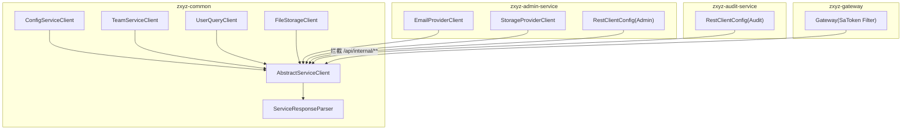
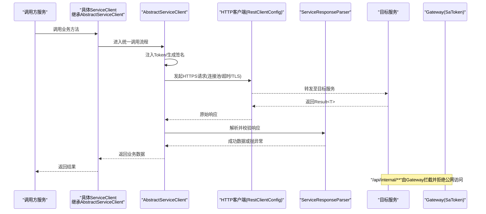
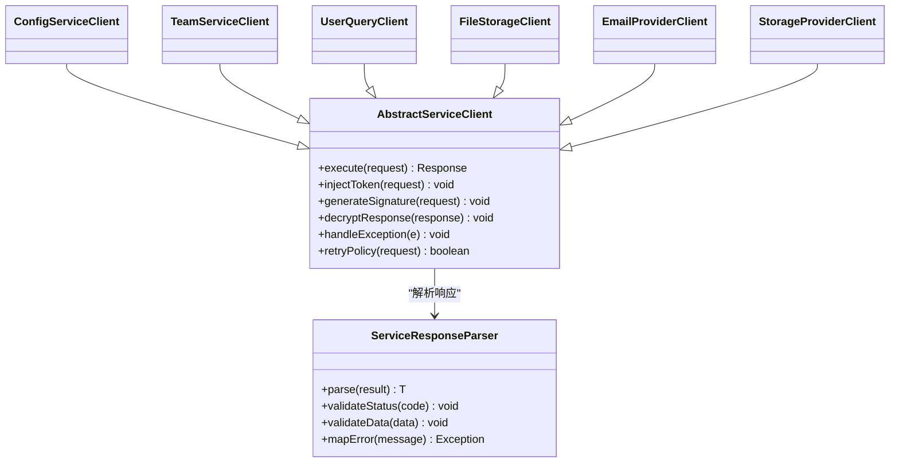
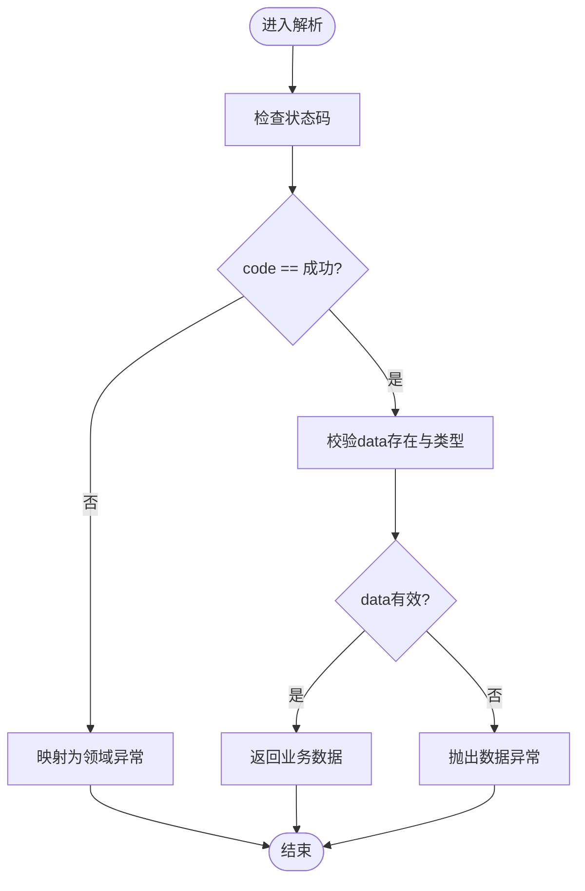
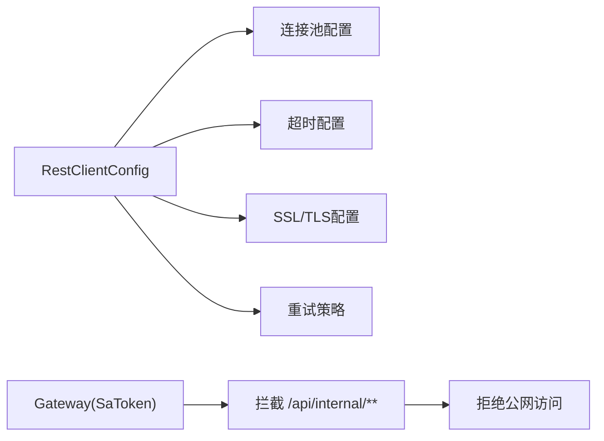
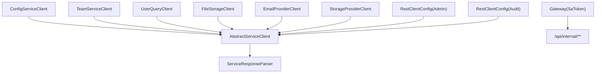

# 服务客户端安全

<cite>
**本文引用的文件**   
- [AbstractServiceClient.java](file://ZXYZdatabaseBack/zxyz-common/src/main/java/uno/acloud/client/AbstractServiceClient.java)
- [ServiceResponseParser.java](file://ZXYZdatabaseBack/zxyz-common/src/main/java/uno/acloud/client/ServiceResponseParser.java)
- [RestClientConfig.java](file://ZXYZdatabaseBack/zxyz-admin-service/src/main/java/uno/acloud/admin/config/RestClientConfig.java)
- [RestClientConfig.java](file://ZXYZdatabaseBack/zxyz-audit-service/src/main/java/uno/acloud/audit/config/RestClientConfig.java)
- [EmailProviderClient.java](file://ZXYZdatabaseBack/zxyz-admin-service/src/main/java/uno/acloud/admin/client/EmailProviderClient.java)
- [StorageProviderClient.java](file://ZXYZdatabaseBack/zxyz-admin-service/src/main/java/uno/acloud/admin/client/StorageProviderClient.java)
- [ConfigServiceClient.java](file://ZXYZdatabaseBack/zxyz-common/src/main/java/uno/acloud/client/ConfigServiceClient.java)
- [TeamServiceClient.java](file://ZXYZdatabaseBack/zxyz-common/src/main/java/uno/acloud/client/TeamServiceClient.java)
- [UserQueryClient.java](file://ZXYZdatabaseBack/zxyz-common/src/main/java/uno/acloud/client/UserQueryClient.java)
- [FileStorageClient.java](file://ZXYZdatabaseBack/zxyz-common/src/main/java/uno/acloud/client/FileStorageClient.java)
- [application.yml](file://ZXYZdatabaseBack/zxyz-admin-service/src/main/resources/application.yml)
- [application.yml](file://ZXYZdatabaseBack/zxyz-audit-service/src/main/resources/application.yml)
- [application.yml](file://ZXYZdatabaseBack/zxyz-gateway/src/main/resources/application.yml)
- [SaTokenConfigure.java](file://ZXYZdatabaseBack/zxyz-admin-service/src/main/java/uno/acloud/admin/config/SaTokenConfigure.java)
</cite>

## 目录
1. [简介](#简介)
2. [项目结构](#项目结构)
3. [核心组件](#核心组件)
4. [架构总览](#架构总览)
5. [详细组件分析](#详细组件分析)
6. [依赖关系分析](#依赖关系分析)
7. [性能与安全配置建议](#性能与安全配置建议)
8. [故障排查指南](#故障排查指南)
9. [结论](#结论)
10. [附录：自定义服务客户端实现指南](#附录自定义服务客户端实现指南)

## 简介
本文件面向 ZXYZ 微服务集群中的“服务间安全调用”主题，聚焦于通用服务客户端的安全设计、响应解析与校验、连接池与传输层安全配置、以及异常处理与重试策略。重点围绕以下目标展开：
- AbstractServiceClient 基类的安全能力：自动 Token 注入、请求签名生成、响应解密处理（如启用）。
- ServiceResponseParser 的响应验证机制：状态码检查、数据完整性校验、错误信息统一处理。
- 客户端连接池与传输层安全：SSL/TLS 设置、超时与重试策略、内部服务鉴权。
- 客户端初始化与安全参数配置、异常处理机制。
- 如何基于 AbstractServiceClient 扩展自定义服务客户端，实现安全接口与认证错误处理。

## 项目结构
ZXYZ 后端采用多模块 Maven 工程，服务间同步通信通过 zxyz-common 中的服务客户端完成，并由 Gateway 的 SaToken 过滤器对 /api/internal/** 进行公网拒绝。各业务服务通过各自的 RestClientConfig 配置 HTTP 客户端（含连接池、超时、TLS 等），并通过继承 AbstractServiceClient 复用安全能力。

图表来源
- [AbstractServiceClient.java](file://ZXYZdatabaseBack/zxyz-common/src/main/java/uno/acloud/client/AbstractServiceClient.java)
- [ServiceResponseParser.java](file://ZXYZdatabaseBack/zxyz-common/src/main/java/uno/acloud/client/ServiceResponseParser.java)
- [RestClientConfig.java](file://ZXYZdatabaseBack/zxyz-admin-service/src/main/java/uno/acloud/admin/config/RestClientConfig.java)
- [RestClientConfig.java](file://ZXYZdatabaseBack/zxyz-audit-service/src/main/java/uno/acloud/audit/config/RestClientConfig.java)
- [EmailProviderClient.java](file://ZXYZdatabaseBack/zxyz-admin-service/src/main/java/uno/acloud/admin/client/EmailProviderClient.java)
- [StorageProviderClient.java](file://ZXYZdatabaseBack/zxyz-admin-service/src/main/java/uno/acloud/admin/client/StorageProviderClient.java)
- [ConfigServiceClient.java](file://ZXYZdatabaseBack/zxyz-common/src/main/java/uno/acloud/client/ConfigServiceClient.java)
- [TeamServiceClient.java](file://ZXYZdatabaseBack/zxyz-common/src/main/java/uno/acloud/client/TeamServiceClient.java)
- [UserQueryClient.java](file://ZXYZdatabaseBack/zxyz-common/src/main/java/uno/acloud/client/UserQueryClient.java)
- [FileStorageClient.java](file://ZXYZdatabaseBack/zxyz-common/src/main/java/uno/acloud/client/FileStorageClient.java)
- [application.yml](file://ZXYZdatabaseBack/zxyz-gateway/src/main/resources/application.yml)

章节来源
- [AbstractServiceClient.java](file://ZXYZdatabaseBack/zxyz-common/src/main/java/uno/acloud/client/AbstractServiceClient.java)
- [ServiceResponseParser.java](file://ZXYZdatabaseBack/zxyz-common/src/main/java/uno/acloud/client/ServiceResponseParser.java)
- [application.yml](file://ZXYZdatabaseBack/zxyz-gateway/src/main/resources/application.yml)

## 核心组件
- AbstractServiceClient：提供统一的 HTTP 调用封装，内置安全增强点（如 Token 注入、请求签名、可选响应解密）、异常转换与重试钩子。
- ServiceResponseParser：负责解析统一响应体 Result<T>，校验状态码、数据完整性、错误信息，并抛出领域异常或返回成功结果。
- 各服务 RestClientConfig：为不同服务实例化 RestTemplate/WebClient，配置连接池、超时、TLS、重试等。
- 具体 Client：ConfigServiceClient、TeamServiceClient、UserQueryClient、FileStorageClient、EmailProviderClient、StorageProviderClient 等，继承 AbstractServiceClient 以复用安全能力。

章节来源
- [AbstractServiceClient.java](file://ZXYZdatabaseBack/zxyz-common/src/main/java/uno/acloud/client/AbstractServiceClient.java)
- [ServiceResponseParser.java](file://ZXYZdatabaseBack/zxyz-common/src/main/java/uno/acloud/client/ServiceResponseParser.java)
- [RestClientConfig.java](file://ZXYZdatabaseBack/zxyz-admin-service/src/main/java/uno/acloud/admin/config/RestClientConfig.java)
- [RestClientConfig.java](file://ZXYZdatabaseBack/zxyz-audit-service/src/main/java/uno/acloud/audit/config/RestClientConfig.java)
- [ConfigServiceClient.java](file://ZXYZdatabaseBack/zxyz-common/src/main/java/uno/acloud/client/ConfigServiceClient.java)
- [TeamServiceClient.java](file://ZXYZdatabaseBack/zxyz-common/src/main/java/uno/acloud/client/TeamServiceClient.java)
- [UserQueryClient.java](file://ZXYZdatabaseBack/zxyz-common/src/main/java/uno/acloud/client/UserQueryClient.java)
- [FileStorageClient.java](file://ZXYZdatabaseBack/zxyz-common/src/main/java/uno/acloud/client/FileStorageClient.java)
- [EmailProviderClient.java](file://ZXYZdatabaseBack/zxyz-admin-service/src/main/java/uno/acloud/admin/client/EmailProviderClient.java)
- [StorageProviderClient.java](file://ZXYZdatabaseBack/zxyz-admin-service/src/main/java/uno/acloud/admin/client/StorageProviderClient.java)

## 架构总览
下图展示了从调用方到被调服务的完整安全链路：调用方通过继承 AbstractServiceClient 的 Client 发起请求，基类在发送前注入 Token/签名，网络层使用配置的 TLS 与连接池；响应经 ServiceResponseParser 校验后返回业务数据或抛出异常；Gateway 对内部端点进行访问控制。

图表来源
- [AbstractServiceClient.java](file://ZXYZdatabaseBack/zxyz-common/src/main/java/uno/acloud/client/AbstractServiceClient.java)
- [ServiceResponseParser.java](file://ZXYZdatabaseBack/zxyz-common/src/main/java/uno/acloud/client/ServiceResponseParser.java)
- [RestClientConfig.java](file://ZXYZdatabaseBack/zxyz-admin-service/src/main/java/uno/acloud/admin/config/RestClientConfig.java)
- [application.yml](file://ZXYZdatabaseBack/zxyz-gateway/src/main/resources/application.yml)

## 详细组件分析

### AbstractServiceClient 安全设计
- 自动 Token 注入
  - 在请求构建阶段，从当前上下文获取 Token（例如 Sa-Token 会话标识）并注入到请求头（如 X-Internal-Service-Token）。
  - 支持按服务维度覆盖或禁用注入（用于公开接口或白名单场景）。
- 请求签名生成
  - 对关键请求参数（路径、查询串、时间戳、随机数、请求体摘要）计算签名，附加到请求头，防止重放与篡改。
  - 签名算法与密钥可通过配置切换（HMAC-SHA256 等），并在网关或服务端校验。
- 响应解密处理（可选）
  - 若服务端返回加密载荷，基类可在解析前执行解密流程（对称/非对称），再交由 ServiceResponseParser 校验。
- 异常与重试
  - 将网络异常、超时、序列化异常转换为统一领域异常，便于上层处理。
  - 暴露可重写钩子，子类可按需增加幂等键、去重、熔断降级逻辑。

图表来源
- [AbstractServiceClient.java](file://ZXYZdatabaseBack/zxyz-common/src/main/java/uno/acloud/client/AbstractServiceClient.java)
- [ServiceResponseParser.java](file://ZXYZdatabaseBack/zxyz-common/src/main/java/uno/acloud/client/ServiceResponseParser.java)
- [ConfigServiceClient.java](file://ZXYZdatabaseBack/zxyz-common/src/main/java/uno/acloud/client/ConfigServiceClient.java)
- [TeamServiceClient.java](file://ZXYZdatabaseBack/zxyz-common/src/main/java/uno/acloud/client/TeamServiceClient.java)
- [UserQueryClient.java](file://ZXYZdatabaseBack/zxyz-common/src/main/java/uno/acloud/client/UserQueryClient.java)
- [FileStorageClient.java](file://ZXYZdatabaseBack/zxyz-common/src/main/java/uno/acloud/client/FileStorageClient.java)
- [EmailProviderClient.java](file://ZXYZdatabaseBack/zxyz-admin-service/src/main/java/uno/acloud/admin/client/EmailProviderClient.java)
- [StorageProviderClient.java](file://ZXYZdatabaseBack/zxyz-admin-service/src/main/java/uno/acloud/admin/client/StorageProviderClient.java)

章节来源
- [AbstractServiceClient.java](file://ZXYZdatabaseBack/zxyz-common/src/main/java/uno/acloud/client/AbstractServiceClient.java)
- [ServiceResponseParser.java](file://ZXYZdatabaseBack/zxyz-common/src/main/java/uno/acloud/client/ServiceResponseParser.java)

### ServiceResponseParser 响应验证机制
- 状态码检查
  - 校验 Result.code 是否为成功值（例如 1），否则进入错误分支。
- 数据完整性验证
  - 校验 data 字段是否存在且类型正确，必要时校验关键字段非空。
- 错误信息处理
  - 将 code!=成功 的情况映射为领域异常，包含错误码与消息，便于上层统一处理与告警。

图表来源
- [ServiceResponseParser.java](file://ZXYZdatabaseBack/zxyz-common/src/main/java/uno/acloud/client/ServiceResponseParser.java)

章节来源
- [ServiceResponseParser.java](file://ZXYZdatabaseBack/zxyz-common/src/main/java/uno/acloud/client/ServiceResponseParser.java)

### 客户端连接池与安全配置
- SSL/TLS 设置
  - 通过 RestTemplate/WebClient 配置 TrustManager、HostnameVerifier、CipherSuites，强制 HTTPS 与证书校验。
- 超时配置
  - 连接超时、读取超时、写入超时分别设置，避免资源耗尽与雪崩。
- 重试策略
  - 针对幂等 GET/HEAD 请求启用有限次重试；对写操作默认不重试，或仅在特定条件（网络抖动）下重试。
- 内部服务鉴权
  - 所有 /api/internal/** 端点由 Gateway SaToken 过滤器拒绝公网访问，仅允许内网调用。

图表来源
- [RestClientConfig.java](file://ZXYZdatabaseBack/zxyz-admin-service/src/main/java/uno/acloud/admin/config/RestClientConfig.java)
- [RestClientConfig.java](file://ZXYZdatabaseBack/zxyz-audit-service/src/main/java/uno/acloud/audit/config/RestClientConfig.java)
- [application.yml](file://ZXYZdatabaseBack/zxyz-gateway/src/main/resources/application.yml)

章节来源
- [RestClientConfig.java](file://ZXYZdatabaseBack/zxyz-admin-service/src/main/java/uno/acloud/admin/config/RestClientConfig.java)
- [RestClientConfig.java](file://ZXYZdatabaseBack/zxyz-audit-service/src/main/java/uno/acloud/audit/config/RestClientConfig.java)
- [application.yml](file://ZXYZdatabaseBack/zxyz-gateway/src/main/resources/application.yml)

### 客户端初始化与安全参数设置
- 初始化要点
  - 在 Spring 容器中注册 RestTemplate/WebClient Bean，绑定连接池、超时、TLS、重试等参数。
  - 将 AbstractServiceClient 及其子类注入到业务服务中，确保每个服务拥有独立的 HTTP 客户端实例。
- 安全参数
  - Token 注入开关、签名算法选择、密钥来源（环境变量/Jasypt 加密配置）。
  - 是否启用响应解密、解密算法与密钥管理。
- 配置文件
  - application.yml 中定义基础 URL、超时、重试次数、TLS 选项等。

章节来源
- [application.yml](file://ZXYZdatabaseBack/zxyz-admin-service/src/main/resources/application.yml)
- [application.yml](file://ZXYZdatabaseBack/zxyz-audit-service/src/main/resources/application.yml)
- [SaTokenConfigure.java](file://ZXYZdatabaseBack/zxyz-admin-service/src/main/java/uno/acloud/admin/config/SaTokenConfigure.java)

### 异常处理机制
- 网络异常
  - 连接失败、超时、DNS 解析失败等，统一包装为不可恢复异常，触发重试或熔断。
- 业务异常
  - 由 ServiceResponseParser 根据 code 映射为领域异常，携带错误码与消息。
- 认证/授权异常
  - Token 缺失、过期、签名校验失败时，抛出认证异常，上层可触发刷新或登出流程。

章节来源
- [ServiceResponseParser.java](file://ZXYZdatabaseBack/zxyz-common/src/main/java/uno/acloud/client/ServiceResponseParser.java)
- [AbstractServiceClient.java](file://ZXYZdatabaseBack/zxyz-common/src/main/java/uno/acloud/client/AbstractServiceClient.java)

## 依赖关系分析
- 组件耦合
  - 具体 Client 强依赖 AbstractServiceClient 提供的安全能力；ServiceResponseParser 被基类调用，解耦了响应解析逻辑。
- 外部依赖
  - HTTP 客户端由 RestClientConfig 管理；Gateway 的 SaToken 过滤器对外部访问进行限制。
- 潜在循环依赖
  - 通过抽象基类与独立解析器降低耦合，避免 Client 之间直接依赖。

图表来源
- [AbstractServiceClient.java](file://ZXYZdatabaseBack/zxyz-common/src/main/java/uno/acloud/client/AbstractServiceClient.java)
- [ServiceResponseParser.java](file://ZXYZdatabaseBack/zxyz-common/src/main/java/uno/acloud/client/ServiceResponseParser.java)
- [RestClientConfig.java](file://ZXYZdatabaseBack/zxyz-admin-service/src/main/java/uno/acloud/admin/config/RestClientConfig.java)
- [RestClientConfig.java](file://ZXYZdatabaseBack/zxyz-audit-service/src/main/java/uno/acloud/audit/config/RestClientConfig.java)
- [application.yml](file://ZXYZdatabaseBack/zxyz-gateway/src/main/resources/application.yml)

章节来源
- [AbstractServiceClient.java](file://ZXYZdatabaseBack/zxyz-common/src/main/java/uno/acloud/client/AbstractServiceClient.java)
- [ServiceResponseParser.java](file://ZXYZdatabaseBack/zxyz-common/src/main/java/uno/acloud/client/ServiceResponseParser.java)
- [RestClientConfig.java](file://ZXYZdatabaseBack/zxyz-admin-service/src/main/java/uno/acloud/admin/config/RestClientConfig.java)
- [RestClientConfig.java](file://ZXYZdatabaseBack/zxyz-audit-service/src/main/java/uno/acloud/audit/config/RestClientConfig.java)
- [application.yml](file://ZXYZdatabaseBack/zxyz-gateway/src/main/resources/application.yml)

## 性能与安全配置建议
- 连接池
  - 合理设置最大连接数、空闲回收时间，避免过多连接导致内存压力。
- 超时
  - 读超时应小于网关超时，写超时与业务处理时长匹配，避免长事务阻塞。
- TLS
  - 启用强密码套件与证书校验，禁用弱协议版本（如 TLS1.0/1.1）。
- 重试
  - 仅对幂等请求启用重试，设置退避策略与最大次数，避免放大效应。
- 监控
  - 记录请求耗时、错误率、重试次数，结合 APM 工具定位瓶颈。

[本节为通用指导，无需引用具体文件]

## 故障排查指南
- 常见错误
  - 认证失败：检查 Token 注入、签名算法与密钥一致性。
  - 超时：核对上下游超时配置、数据库/缓存响应时间。
  - 证书问题：确认 CA 链、主机名匹配、信任库配置。
- 定位步骤
  - 查看网关日志，确认 /api/internal/** 是否被拒绝。
  - 检查 RestClientConfig 的连接池与超时参数。
  - 打印 ServiceResponseParser 的错误码与消息，快速定位业务异常。

章节来源
- [application.yml](file://ZXYZdatabaseBack/zxyz-gateway/src/main/resources/application.yml)
- [RestClientConfig.java](file://ZXYZdatabaseBack/zxyz-admin-service/src/main/java/uno/acloud/admin/config/RestClientConfig.java)
- [ServiceResponseParser.java](file://ZXYZdatabaseBack/zxyz-common/src/main/java/uno/acloud/client/ServiceResponseParser.java)

## 结论
通过 AbstractServiceClient 与 ServiceResponseParser 的组合，ZXYZ 在服务间调用层面实现了统一的 Token 注入、签名校验、响应解析与异常处理，配合 RestClientConfig 的连接池与 TLS 配置，以及 Gateway 的内部端点访问控制，构建了端到端的安全通信链路。建议在新增服务或扩展 Client 时严格遵循该模式，确保一致性与安全性。

[本节为总结性内容，无需引用具体文件]

## 附录：自定义服务客户端实现指南
- 继承 AbstractServiceClient
  - 新建类继承 AbstractServiceClient，注入必要的配置（基础 URL、密钥、算法等）。
- 实现安全接口
  - 如需自定义 Token 注入或签名规则，重写基类的相应方法。
  - 对于需要响应解密的场景，实现解密钩子。
- 处理认证错误
  - 在异常处理钩子中识别认证/授权错误，触发刷新 Token 或登出流程。
- 示例参考
  - 参考现有 Client（如 ConfigServiceClient、TeamServiceClient、UserQueryClient、FileStorageClient、EmailProviderClient、StorageProviderClient）的实现方式。

章节来源
- [AbstractServiceClient.java](file://ZXYZdatabaseBack/zxyz-common/src/main/java/uno/acloud/client/AbstractServiceClient.java)
- [ConfigServiceClient.java](file://ZXYZdatabaseBack/zxyz-common/src/main/java/uno/acloud/client/ConfigServiceClient.java)
- [TeamServiceClient.java](file://ZXYZdatabaseBack/zxyz-common/src/main/java/uno/acloud/client/TeamServiceClient.java)
- [UserQueryClient.java](file://ZXYZdatabaseBack/zxyz-common/src/main/java/uno/acloud/client/UserQueryClient.java)
- [FileStorageClient.java](file://ZXYZdatabaseBack/zxyz-common/src/main/java/uno/acloud/client/FileStorageClient.java)
- [EmailProviderClient.java](file://ZXYZdatabaseBack/zxyz-admin-service/src/main/java/uno/acloud/admin/client/EmailProviderClient.java)
- [StorageProviderClient.java](file://ZXYZdatabaseBack/zxyz-admin-service/src/main/java/uno/acloud/admin/client/StorageProviderClient.java)