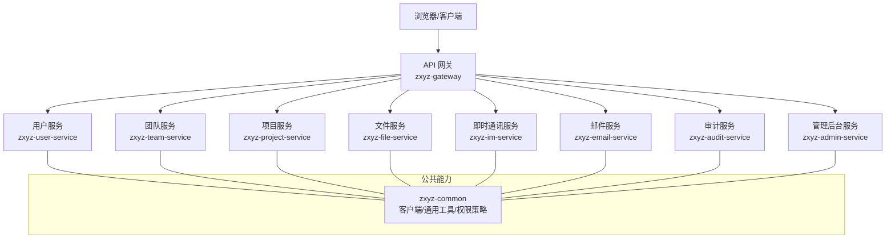
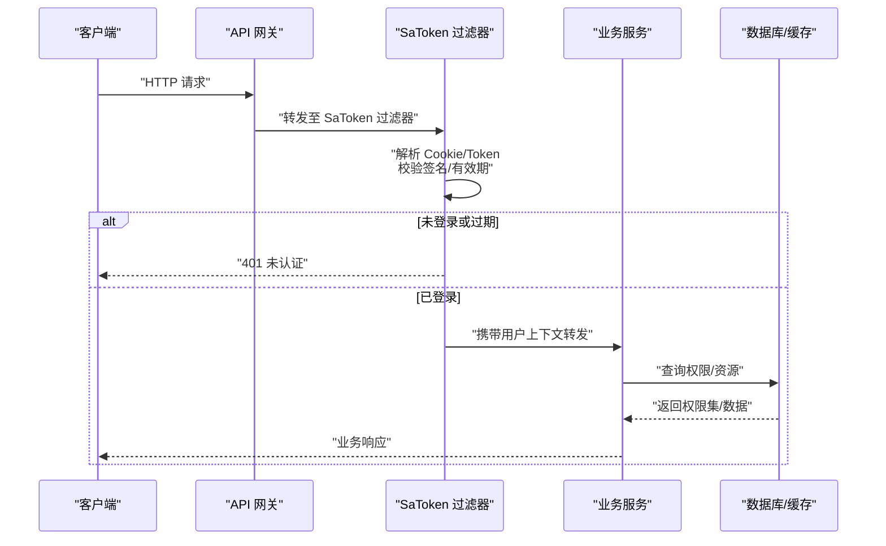
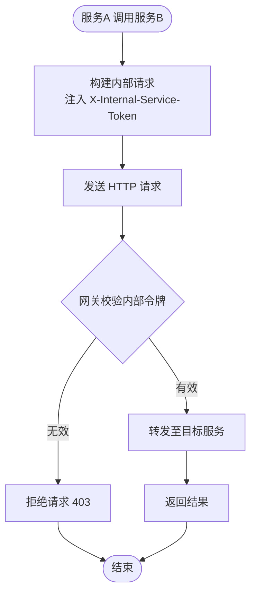
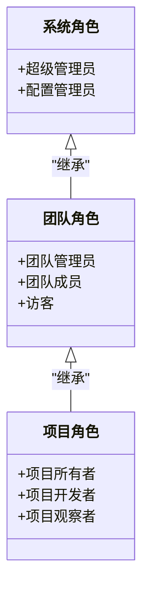
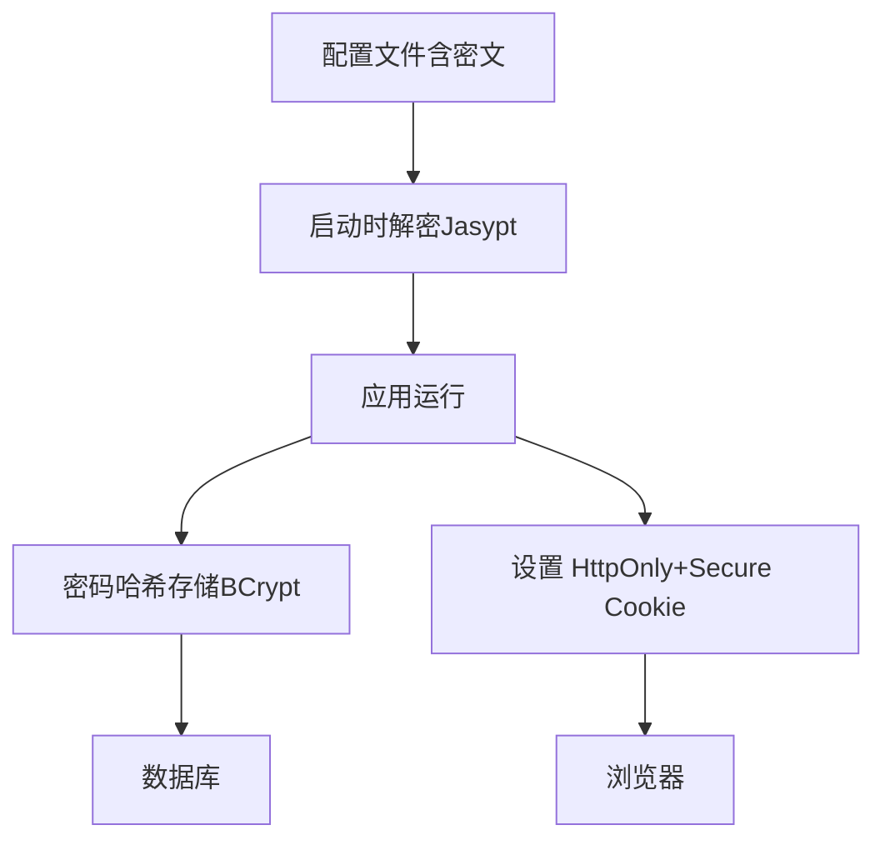
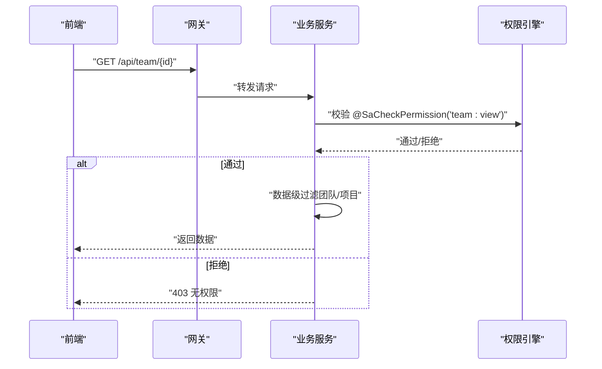
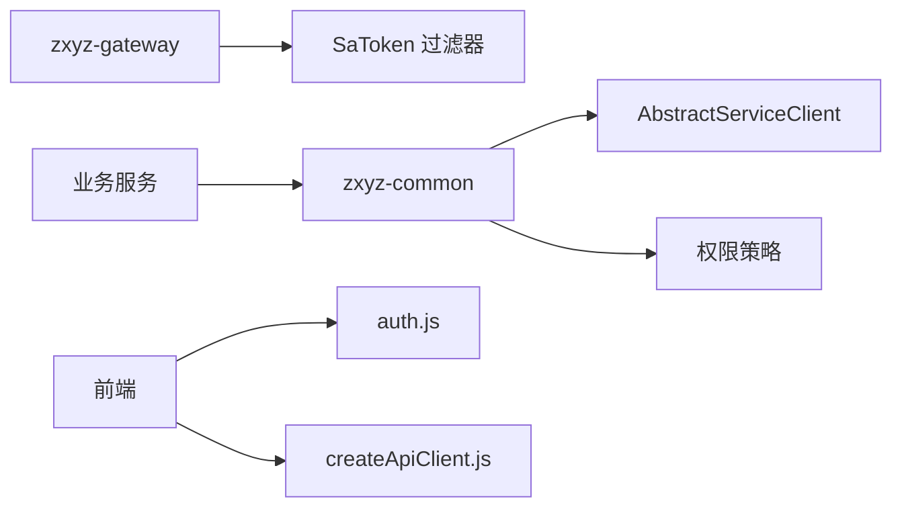

# 安全架构

<cite>
**本文引用的文件**   
- [SaTokenConfigure.java](file://ZXYZdatabaseBack/zxyz-admin-service/src/main/java/uno/acloud/admin/config/SaTokenConfigure.java)
- [application.yml（网关）](file://ZXYZdatabaseBack/zxyz-gateway/src/main/resources/application.yml)
- [SaTokenFilterConfigTest.java](file://ZXYZdatabaseBack/zxyz-gateway/src/test/java/uno/acloud/gateway/filter/SaTokenFilterConfigTest.java)
- [AbstractServiceClient.java](file://ZXYZdatabaseBack/zxyz-common/src/main/java/uno/acloud/client/AbstractServiceClient.java)
- [TeamPermissionPolicyTest.java](file://ZXYZdatabaseBack/zxyz-common/src/test/java/uno/acloud/common/TeamPermissionPolicyTest.java)
- [jasypt-key-management.md](file://docs/jasypt-key-management.md)
- [auth.js（前端认证工具）](file://ZXYZdatabaseFront/src/utils/auth.js)
- [createApiClient.js（前端API客户端）](file://ZXYZdatabaseFront/src/utils/createApiClient.js)
- [permission.js（前端路由守卫）](file://ZXYZdatabaseFront/src/router/guards/permission.js)
- [application.yml（用户服务）](file://ZXYZdatabaseBack/zxyz-user-service/src/main/resources/application.yml)
- [application.yml（文件服务）](file://ZXYZdatabaseBack/zxyz-file-service/src/main/resources/application.yml)
- [application.yml（团队服务）](file://ZXYZdatabaseBack/zxyz-team-service/src/main/resources/application.yml)
- [application.yml（项目服务）](file://ZXYZdatabaseBack/zxyz-project-service/src/main/resources/application.yml)
- [application.yml（分享服务）](file://ZXYZdatabaseBack/zxyz-share-service/src/main/resources/application.yml)
- [application.yml（IM服务）](file://ZXYZdatabaseBack/zxyz-im-service/src/main/resources/application.yml)
- [application.yml（邮件服务）](file://ZXYZdatabaseBack/zxyz-email-service/src/main/resources/application.yml)
- [application.yml（审计服务）](file://ZXYZdatabaseBack/zxyz-audit-service/src/main/resources/application.yml)
- [application.yml（管理后台服务）](file://ZXYZdatabaseBack/zxyz-admin-service/src/main/resources/application.yml)
</cite>

## 目录
1. [简介](#简介)
2. [项目结构](#项目结构)
3. [核心组件](#核心组件)
4. [架构总览](#架构总览)
5. [详细组件分析](#详细组件分析)
6. [依赖关系分析](#依赖关系分析)
7. [性能考虑](#性能考虑)
8. [故障排查指南](#故障排查指南)
9. [结论](#结论)
10. [附录](#附录)

## 简介
本安全架构文档围绕 ZXYZ 微服务系统的安全设计展开，重点说明：
- SaToken 认证与授权框架的集成与使用（登录、会话、权限校验）
- 内部服务鉴权策略（X-Internal-Service-Token 头部验证、服务间安全通信）
- API 网关过滤链的安全检查（拒绝公网访问 /api/internal/**）
- RBAC 权限模型（系统角色、团队角色、项目角色的层次结构与继承）
- 敏感信息保护（Jasypt 加密配置、密码存储策略、Cookie 安全设置）
- 访问控制策略（接口级注解、方法级校验、数据级过滤）

## 项目结构
ZXYZ 采用多模块 Maven 工程与 Vue 前端。后端包含多个独立服务（用户、团队、项目、文件、IM、邮件、审计、管理后台等），通过网关统一入口；公共能力集中在 zxyz-common。前端基于 Vue 3 + Pinia，配合 HttpOnly Cookie 完成会话保持。



**图示来源** 
- [application.yml（网关）](file://ZXYZdatabaseBack/zxyz-gateway/src/main/resources/application.yml)
- [application.yml（用户服务）](file://ZXYZdatabaseBack/zxyz-user-service/src/main/resources/application.yml)
- [application.yml（团队服务）](file://ZXYZdatabaseBack/zxyz-team-service/src/main/resources/application.yml)
- [application.yml（项目服务）](file://ZXYZdatabaseBack/zxyz-project-service/src/main/resources/application.yml)
- [application.yml（文件服务）](file://ZXYZdatabaseBack/zxyz-file-service/src/main/resources/application.yml)
- [application.yml（IM服务）](file://ZXYZdatabaseBack/zxyz-im-service/src/main/resources/application.yml)
- [application.yml（邮件服务）](file://ZXYZdatabaseBack/zxyz-email-service/src/main/resources/application.yml)
- [application.yml（审计服务）](file://ZXYZdatabaseBack/zxyz-audit-service/src/main/resources/application.yml)
- [application.yml（管理后台服务）](file://ZXYZdatabaseBack/zxyz-admin-service/src/main/resources/application.yml)

**章节来源**
- [application.yml（网关）](file://ZXYZdatabaseBack/zxyz-gateway/src/main/resources/application.yml)
- [application.yml（用户服务）](file://ZXYZdatabaseBack/zxyz-user-service/src/main/resources/application.yml)
- [application.yml（团队服务）](file://ZXYZdatabaseBack/zxyz-team-service/src/main/resources/application.yml)
- [application.yml（项目服务）](file://ZXYZdatabaseBack/zxyz-project-service/src/main/resources/application.yml)
- [application.yml（文件服务）](file://ZXYZdatabaseBack/zxyz-file-service/src/main/resources/application.yml)
- [application.yml（IM服务）](file://ZXYZdatabaseBack/zxyz-im-service/src/main/resources/application.yml)
- [application.yml（邮件服务）](file://ZXYZdatabaseBack/zxyz-email-service/src/main/resources/application.yml)
- [application.yml（审计服务）](file://ZXYZdatabaseBack/zxyz-audit-service/src/main/resources/application.yml)
- [application.yml（管理后台服务）](file://ZXYZdatabaseBack/zxyz-admin-service/src/main/resources/application.yml)

## 核心组件
- SaToken 配置与过滤器：在各服务中启用 SaToken 拦截器，实现登录态校验、会话管理与权限校验。
- 网关过滤链：在网关层对请求进行统一安全检查，包括鉴权、限流、黑白名单、内部端点防护等。
- 内部服务客户端：封装服务间调用，注入 X-Internal-Service-Token 头，确保内网调用可信。
- 权限策略：基于 RBAC 的角色-权限模型，结合注解与方法级校验，实现接口与数据级访问控制。
- 敏感信息保护：通过 Jasypt 加密配置、密码哈希存储、HttpOnly/Cookie Secure 等机制保障数据安全。

**章节来源**
- [SaTokenConfigure.java](file://ZXYZdatabaseBack/zxyz-admin-service/src/main/java/uno/acloud/admin/config/SaTokenConfigure.java)
- [AbstractServiceClient.java](file://ZXYZdatabaseBack/zxyz-common/src/main/java/uno/acloud/client/AbstractServiceClient.java)
- [TeamPermissionPolicyTest.java](file://ZXYZdatabaseBack/zxyz-common/src/test/java/uno/acloud/common/TeamPermissionPolicyTest.java)
- [jasypt-key-management.md](file://docs/jasypt-key-management.md)

## 架构总览
整体安全架构以网关为入口，SaToken 贯穿各服务，RBAC 权限模型覆盖系统/团队/项目三级维度，内部服务调用通过令牌头保证可信通道，敏感配置与密码均受加密与强策略保护。



**图示来源** 
- [application.yml（网关）](file://ZXYZdatabaseBack/zxyz-gateway/src/main/resources/application.yml)
- [SaTokenFilterConfigTest.java](file://ZXYZdatabaseBack/zxyz-gateway/src/test/java/uno/acloud/gateway/filter/SaTokenFilterConfigTest.java)
- [SaTokenConfigure.java](file://ZXYZdatabaseBack/zxyz-admin-service/src/main/java/uno/acloud/admin/config/SaTokenConfigure.java)

## 详细组件分析

### SaToken 认证与会话管理
- 登录流程：前端提交用户名/密码，后端校验后签发 Sa-Token（UUID），写入 HttpOnly Cookie，并建立 Redis Session。
- 会话管理：后续请求自动携带 Cookie，SaToken 过滤器解析并校验，恢复用户上下文。
- 权限校验：通过注解或方法级校验，结合 RBAC 模型判断是否具备所需权限。

```mermaid
sequenceDiagram
participant FE as "前端"
participant US as "用户服务"
participant ST as "SaToken"
participant REDIS as "Redis"
participant DB as "数据库"
FE->>US : "POST /login用户名/密码"
US->>DB : "校验凭据"
DB-->>US : "用户信息"
US->>ST : "创建会话Sa-Token"
ST->>REDIS : "保存会话"
ST-->>US : "返回 Token"
US-->>FE : "Set-Cookie : Sa-Token=...; HttpOnly; Secure"
FE->>US : "后续请求携带 Cookie"
US->>ST : "解析并校验 Token"
ST-->>US : "用户上下文"
```

**图示来源** 
- [SaTokenConfigure.java](file://ZXYZdatabaseBack/zxyz-admin-service/src/main/java/uno/acloud/admin/config/SaTokenConfigure.java)
- [application.yml（用户服务）](file://ZXYZdatabaseBack/zxyz-user-service/src/main/resources/application.yml)

**章节来源**
- [SaTokenConfigure.java](file://ZXYZdatabaseBack/zxyz-admin-service/src/main/java/uno/acloud/admin/config/SaTokenConfigure.java)
- [application.yml（用户服务）](file://ZXYZdatabaseBack/zxyz-user-service/src/main/resources/application.yml)

### 内部服务鉴权策略（X-Internal-Service-Token）
- 服务间调用：所有内部客户端在发起 HTTP 请求时注入 X-Internal-Service-Token 头。
- 网关防护：网关对 /api/internal/** 路径进行严格校验，仅允许带有效内部令牌的请求进入。
- 客户端封装：AbstractServiceClient 统一处理令牌注入与错误处理。



**图示来源** 
- [AbstractServiceClient.java](file://ZXYZdatabaseBack/zxyz-common/src/main/java/uno/acloud/client/AbstractServiceClient.java)
- [application.yml（网关）](file://ZXYZdatabaseBack/zxyz-gateway/src/main/resources/application.yml)

**章节来源**
- [AbstractServiceClient.java](file://ZXYZdatabaseBack/zxyz-common/src/main/java/uno/acloud/client/AbstractServiceClient.java)
- [application.yml（网关）](file://ZXYZdatabaseBack/zxyz-gateway/src/main/resources/application.yml)

### RBAC 权限模型（系统/团队/项目）
- 角色层次：系统管理员 > 团队管理员 > 项目成员，权限逐级继承。
- 权限粒度：支持接口级（@SaCheckPermission）、方法级（自定义注解）、数据级（按团队/项目过滤）。
- 策略实现：通过策略类与测试用例验证权限计算逻辑。



**图示来源** 
- [TeamPermissionPolicyTest.java](file://ZXYZdatabaseBack/zxyz-common/src/test/java/uno/acloud/common/TeamPermissionPolicyTest.java)

**章节来源**
- [TeamPermissionPolicyTest.java](file://ZXYZdatabaseBack/zxyz-common/src/test/java/uno/acloud/common/TeamPermissionPolicyTest.java)

### 敏感信息保护（Jasypt、密码、Cookie）
- Jasypt 加密：配置文件中的敏感字段（如数据库密码、密钥）使用 Jasypt 加密存储。
- 密码存储：用户密码采用强哈希算法（如 BCrypt）存储，禁止明文。
- Cookie 安全：Sa-Token 使用 HttpOnly 与 Secure 标志，防止 XSS 与中间人攻击。



**图示来源** 
- [jasypt-key-management.md](file://docs/jasypt-key-management.md)
- [auth.js（前端认证工具）](file://ZXYZdatabaseFront/src/utils/auth.js)
- [createApiClient.js（前端API客户端）](file://ZXYZdatabaseFront/src/utils/createApiClient.js)

**章节来源**
- [jasypt-key-management.md](file://docs/jasypt-key-management.md)
- [auth.js（前端认证工具）](file://ZXYZdatabaseFront/src/utils/auth.js)
- [createApiClient.js（前端API客户端）](file://ZXYZdatabaseFront/src/utils/createApiClient.js)

### 访问控制策略（接口/方法/数据级）
- 接口级：使用 @SaCheckPermission 等注解声明所需权限。
- 方法级：通过自定义注解或 AOP 实现细粒度校验。
- 数据级：根据用户角色动态过滤查询结果（如团队/项目维度）。



**图示来源** 
- [permission.js（前端路由守卫）](file://ZXYZdatabaseFront/src/router/guards/permission.js)
- [TeamPermissionPolicyTest.java](file://ZXYZdatabaseBack/zxyz-common/src/test/java/uno/acloud/common/TeamPermissionPolicyTest.java)

**章节来源**
- [permission.js（前端路由守卫）](file://ZXYZdatabaseFront/src/router/guards/permission.js)
- [TeamPermissionPolicyTest.java](file://ZXYZdatabaseBack/zxyz-common/src/test/java/uno/acloud/common/TeamPermissionPolicyTest.java)

## 依赖关系分析
- 网关依赖 SaToken 过滤器进行统一鉴权。
- 各服务依赖 zxyz-common 提供的内部客户端与权限策略。
- 前端依赖 auth.js 与 createApiClient.js 管理会话与请求头。



**图示来源** 
- [application.yml（网关）](file://ZXYZdatabaseBack/zxyz-gateway/src/main/resources/application.yml)
- [AbstractServiceClient.java](file://ZXYZdatabaseBack/zxyz-common/src/main/java/uno/acloud/client/AbstractServiceClient.java)
- [auth.js（前端认证工具）](file://ZXYZdatabaseFront/src/utils/auth.js)
- [createApiClient.js（前端API客户端）](file://ZXYZdatabaseFront/src/utils/createApiClient.js)

**章节来源**
- [application.yml（网关）](file://ZXYZdatabaseBack/zxyz-gateway/src/main/resources/application.yml)
- [AbstractServiceClient.java](file://ZXYZdatabaseBack/zxyz-common/src/main/java/uno/acloud/client/AbstractServiceClient.java)
- [auth.js（前端认证工具）](file://ZXYZdatabaseFront/src/utils/auth.js)
- [createApiClient.js（前端API客户端）](file://ZXYZdatabaseFront/src/utils/createApiClient.js)

## 性能考虑
- 会话存储：优先使用 Redis 缓存，减少数据库压力。
- 权限校验：预加载用户权限集，避免频繁查询。
- 内部调用：连接池与超时配置优化，避免阻塞。
- 前端缓存：合理设置 Cookie 与本地缓存，减少重复请求。

## 故障排查指南
- 登录失败：检查 SaToken 配置、Redis 连通性、密码哈希算法一致性。
- 权限拒绝：确认角色-权限映射、注解使用是否正确。
- 内部调用失败：验证 X-Internal-Service-Token 生成与校验逻辑。
- 敏感配置错误：核对 Jasypt 密钥与密文格式。

## 结论
ZXYZ 的安全架构以 SaToken 为核心，结合网关过滤链、RBAC 权限模型与敏感信息保护机制，构建了从前端到后端、从外部到内部的完整安全防护体系。通过分层设计与策略化实现，确保了系统的高可用性与安全性。

## 附录
- 相关配置文件路径参考“项目结构”部分。
- 前端安全实践可参考 auth.js 与 createApiClient.js 的实现细节。
- 内部服务调用规范请参考 AbstractServiceClient 的使用示例。