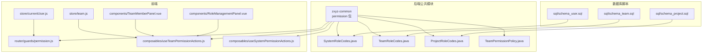
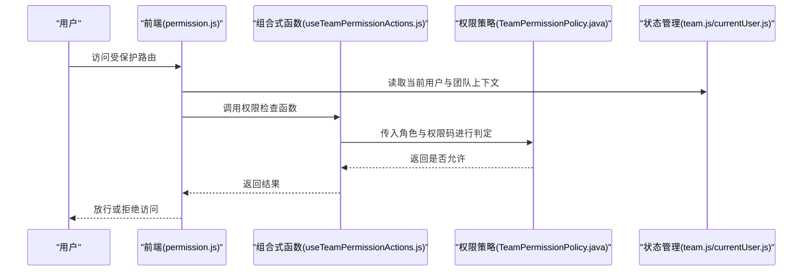
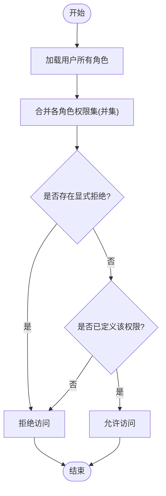
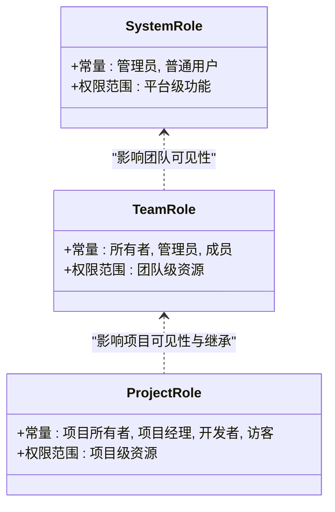
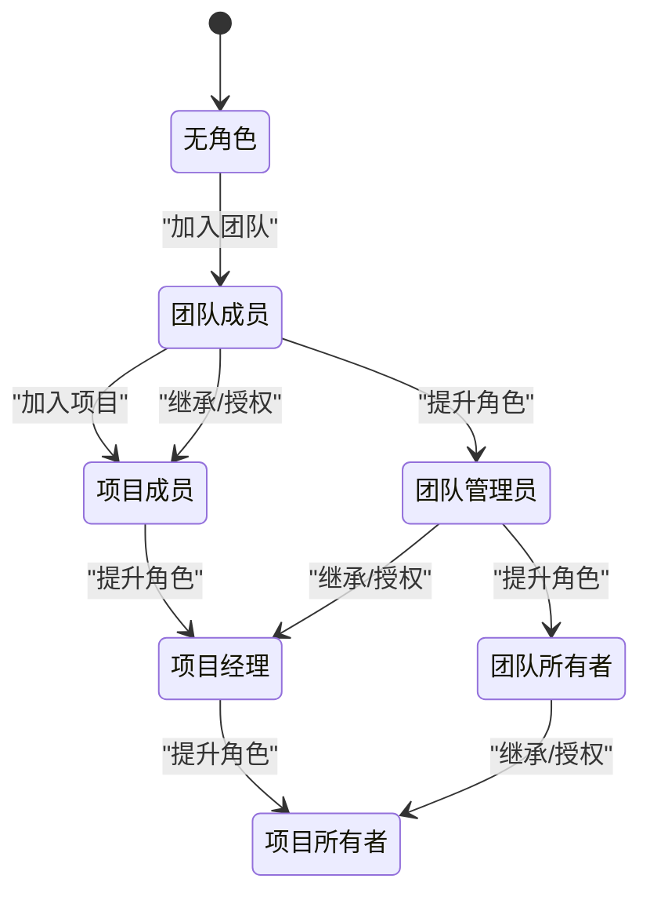
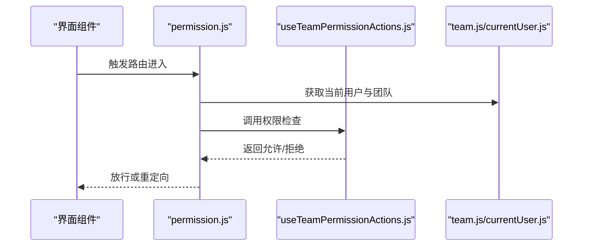
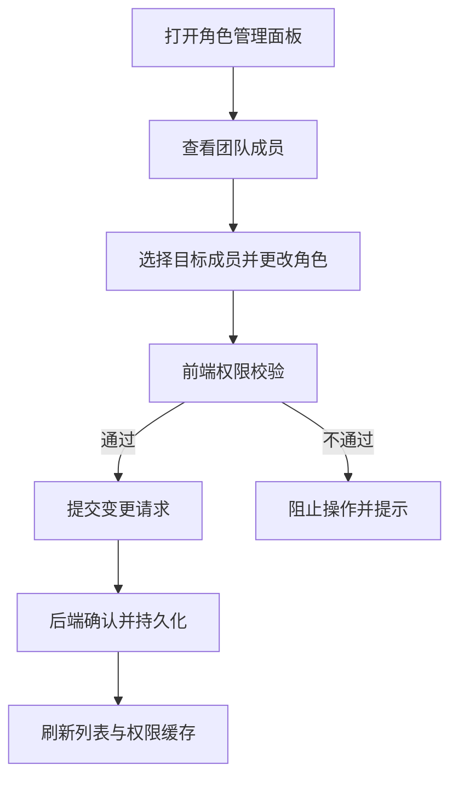
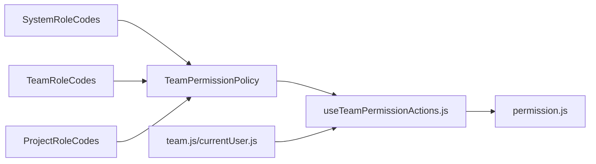

# RBAC权限模型

<cite>
**本文引用的文件**   
- [TeamPermissionPolicy.java](file://ZXYZdatabaseBack/zxyz-common/src/main/java/uno/acloud/common/permission/TeamPermissionPolicy.java)
- [TeamRoleCodes.java](file://ZXYZdatabaseBack/zxyz-common/src/main/java/uno/acloud/common/permission/TeamRoleCodes.java)
- [SystemRoleCodes.java](file://ZXYZdatabaseBack/zxyz-common/src/main/java/uno/acloud/common/permission/SystemRoleCodes.java)
- [ProjectRoleCodes.java](file://ZXYZdatabaseBack/zxyz-common/src/main/java/uno/acloud/common/permission/ProjectRoleCodes.java)
- [permission.js](file://ZXYZdatabaseFront/src/router/guards/permission.js)
- [useTeamPermissionActions.js](file://ZXYZdatabaseFront/src/composables/useTeamPermissionActions.js)
- [useSystemPermissionActions.js](file://ZXYZdatabaseFront/src/composables/useSystemPermissionActions.js)
- [team.js](file://ZXYZdatabaseFront/src/store/team.js)
- [currentUser.js](file://ZXYZdatabaseFront/src/store/currentUser.js)
- [TeamMemberPanel.vue](file://ZXYZdatabaseFront/src/components/team-settings/TeamMemberPanel.vue)
- [RoleManagementPanel.vue](file://ZXYZdatabaseFront/src/components/RoleManagementPanel.vue)
- [schema_team.sql](file://ZXYZdatabaseBack/sql/schema_team.sql)
- [schema_project.sql](file://ZXYZdatabaseBack/sql/schema_project.sql)
- [schema_user.sql](file://ZXYZdatabaseBack/sql/schema_user.sql)
</cite>

## 目录
1. [简介](#简介)
2. [项目结构](#项目结构)
3. [核心组件](#核心组件)
4. [架构总览](#架构总览)
5. [详细组件分析](#详细组件分析)
6. [依赖关系分析](#依赖关系分析)
7. [性能考虑](#性能考虑)
8. [故障排查指南](#故障排查指南)
9. [结论](#结论)
10. [附录](#附录)

## 简介
本文件面向 ZXYZ 项目的 RBAC（基于角色的访问控制）权限模型，系统性阐述三层角色体系与权限继承机制：
- 系统级角色：管理员、普通用户等
- 团队级角色：所有者、管理员、成员等
- 项目级角色：项目维度的细粒度角色

文档涵盖角色常量定义、权限码规范、父子角色与继承合并策略、冲突解决规则，并提供角色创建、分配、撤销的完整示例路径。同时给出角色关系图、权限矩阵表与权限继承流程图，帮助开发者快速理解并正确实现权限控制。

## 项目结构
RBAC 相关代码主要分布在以下位置：
- 后端公共模块 zxyz-common 中的 permission 包：集中定义系统、团队、项目三级角色常量与权限策略
- 前端路由守卫与组合式函数：负责客户端侧的权限判断与操作按钮显隐
- 前端状态管理 store：维护当前用户与团队上下文信息
- SQL 建库脚本：定义团队、项目、用户等实体及关联关系

**图表来源** 
- [TeamPermissionPolicy.java](file://ZXYZdatabaseBack/zxyz-common/src/main/java/uno/acloud/common/permission/TeamPermissionPolicy.java)
- [TeamRoleCodes.java](file://ZXYZdatabaseBack/zxyz-common/src/main/java/uno/acloud/common/permission/TeamRoleCodes.java)
- [SystemRoleCodes.java](file://ZXYZdatabaseBack/zxyz-common/src/main/java/uno/acloud/common/permission/SystemRoleCodes.java)
- [ProjectRoleCodes.java](file://ZXYZdatabaseBack/zxyz-common/src/main/java/uno/acloud/common/permission/ProjectRoleCodes.java)
- [permission.js](file://ZXYZdatabaseFront/src/router/guards/permission.js)
- [useTeamPermissionActions.js](file://ZXYZdatabaseFront/src/composables/useTeamPermissionActions.js)
- [useSystemPermissionActions.js](file://ZXYZdatabaseFront/src/composables/useSystemPermissionActions.js)
- [team.js](file://ZXYZdatabaseFront/src/store/team.js)
- [currentUser.js](file://ZXYZdatabaseFront/src/store/currentUser.js)
- [TeamMemberPanel.vue](file://ZXYZdatabaseFront/src/components/team-settings/TeamMemberPanel.vue)
- [RoleManagementPanel.vue](file://ZXYZdatabaseFront/src/components/RoleManagementPanel.vue)
- [schema_team.sql](file://ZXYZdatabaseBack/sql/schema_team.sql)
- [schema_project.sql](file://ZXYZdatabaseBack/sql/schema_project.sql)
- [schema_user.sql](file://ZXYZdatabaseBack/sql/schema_user.sql)

**章节来源**
- [TeamPermissionPolicy.java](file://ZXYZdatabaseBack/zxyz-common/src/main/java/uno/acloud/common/permission/TeamPermissionPolicy.java)
- [TeamRoleCodes.java](file://ZXYZdatabaseBack/zxyz-common/src/main/java/uno/acloud/common/permission/TeamRoleCodes.java)
- [SystemRoleCodes.java](file://ZXYZdatabaseBack/zxyz-common/src/main/java/uno/acloud/common/permission/SystemRoleCodes.java)
- [ProjectRoleCodes.java](file://ZXYZdatabaseBack/zxyz-common/src/main/java/uno/acloud/common/permission/ProjectRoleCodes.java)
- [permission.js](file://ZXYZdatabaseFront/src/router/guards/permission.js)
- [useTeamPermissionActions.js](file://ZXYZdatabaseFront/src/composables/useTeamPermissionActions.js)
- [useSystemPermissionActions.js](file://ZXYZdatabaseFront/src/composables/useSystemPermissionActions.js)
- [team.js](file://ZXYZdatabaseFront/src/store/team.js)
- [currentUser.js](file://ZXYZdatabaseFront/src/store/currentUser.js)
- [TeamMemberPanel.vue](file://ZXYZdatabaseFront/src/components/team-settings/TeamMemberPanel.vue)
- [RoleManagementPanel.vue](file://ZXYZdatabaseFront/src/components/RoleManagementPanel.vue)
- [schema_team.sql](file://ZXYZdatabaseBack/sql/schema_team.sql)
- [schema_project.sql](file://ZXYZdatabaseBack/sql/schema_project.sql)
- [schema_user.sql](file://ZXYZdatabaseBack/sql/schema_user.sql)

## 核心组件
- 角色常量定义
  - SystemRoleCodes：系统级角色常量集合，用于标识平台内全局角色（如管理员、普通用户）
  - TeamRoleCodes：团队级角色常量集合，用于标识用户在团队内的角色（如所有者、管理员、成员）
  - ProjectRoleCodes：项目级角色常量集合，用于标识用户在项目内的角色（如项目所有者、项目经理、开发者、访客等）
- 权限策略
  - TeamPermissionPolicy：封装团队维度权限判定逻辑，包括角色继承、权限合并与冲突处理

这些常量与策略共同构成 RBAC 的核心数据与决策基础。

**章节来源**
- [SystemRoleCodes.java](file://ZXYZdatabaseBack/zxyz-common/src/main/java/uno/acloud/common/permission/SystemRoleCodes.java)
- [TeamRoleCodes.java](file://ZXYZdatabaseBack/zxyz-common/src/main/java/uno/acloud/common/permission/TeamRoleCodes.java)
- [ProjectRoleCodes.java](file://ZXYZdatabaseBack/zxyz-common/src/main/java/uno/acloud/common/permission/ProjectRoleCodes.java)
- [TeamPermissionPolicy.java](file://ZXYZdatabaseBack/zxyz-common/src/main/java/uno/acloud/common/permission/TeamPermissionPolicy.java)

## 架构总览
RBAC 在 ZXYZ 中采用“常量定义 + 策略判定 + 前后端协同”的架构：
- 后端通过常量集中管理角色与权限码，避免硬编码；策略类提供统一的权限判定方法
- 前端通过路由守卫与组合式函数进行页面级与操作级权限控制
- 状态管理维护当前用户与团队上下文，为权限判定提供必要参数

**图表来源** 
- [permission.js](file://ZXYZdatabaseFront/src/router/guards/permission.js)
- [useTeamPermissionActions.js](file://ZXYZdatabaseFront/src/composables/useTeamPermissionActions.js)
- [TeamPermissionPolicy.java](file://ZXYZdatabaseBack/zxyz-common/src/main/java/uno/acloud/common/permission/TeamPermissionPolicy.java)
- [team.js](file://ZXYZdatabaseFront/src/store/team.js)
- [currentUser.js](file://ZXYZdatabaseFront/src/store/currentUser.js)

## 详细组件分析

### 角色常量与权限码规范
- 系统级角色（SystemRoleCodes）
  - 典型角色：管理员、普通用户
  - 用途：平台级功能开关、全局配置管理、审计查看等
- 团队级角色（TeamRoleCodes）
  - 典型角色：所有者、管理员、成员
  - 用途：团队资源管理、成员邀请/移除、团队设置等
- 项目级角色（ProjectRoleCodes）
  - 典型角色：项目所有者、项目经理、开发者、访客
  - 用途：项目内文件、任务、分享等资源的读写控制

权限码命名建议：
- 使用“资源.动作”形式，如 team.member.manage、project.file.upload
- 按层级划分前缀，避免跨层污染

**章节来源**
- [SystemRoleCodes.java](file://ZXYZdatabaseBack/zxyz-common/src/main/java/uno/acloud/common/permission/SystemRoleCodes.java)
- [TeamRoleCodes.java](file://ZXYZdatabaseBack/zxyz-common/src/main/java/uno/acloud/common/permission/TeamRoleCodes.java)
- [ProjectRoleCodes.java](file://ZXYZdatabaseBack/zxyz-common/src/main/java/uno/acloud/common/permission/ProjectRoleCodes.java)

### 权限继承与合并策略
- 父子角色关系
  - 团队级：所有者 > 管理员 > 成员
  - 项目级：项目所有者 > 项目经理 > 开发者 > 访客
- 权限合并策略
  - 同一用户拥有多个角色时，取各角色权限集的并集
  - 若存在显式拒绝（Deny），优先于允许（Allow）
- 冲突解决规则
  - 明确 Deny 覆盖 Allow
  - 未显式定义的权限默认拒绝（默认拒绝原则）

**图表来源** 
- [TeamPermissionPolicy.java](file://ZXYZdatabaseBack/zxyz-common/src/main/java/uno/acloud/common/permission/TeamPermissionPolicy.java)

**章节来源**
- [TeamPermissionPolicy.java](file://ZXYZdatabaseBack/zxyz-common/src/main/java/uno/acloud/common/permission/TeamPermissionPolicy.java)

### 角色关系图

**图表来源** 
- [SystemRoleCodes.java](file://ZXYZdatabaseBack/zxyz-common/src/main/java/uno/acloud/common/permission/SystemRoleCodes.java)
- [TeamRoleCodes.java](file://ZXYZdatabaseBack/zxyz-common/src/main/java/uno/acloud/common/permission/TeamRoleCodes.java)
- [ProjectRoleCodes.java](file://ZXYZdatabaseBack/zxyz-common/src/main/java/uno/acloud/common/permission/ProjectRoleCodes.java)

### 权限矩阵表
以下为典型角色与常见权限的映射示意（以“允许/拒绝”表示）：

- 系统级
  - 管理员：平台配置、审计查看、用户管理 → 允许
  - 普通用户：仅个人空间 → 拒绝其他
- 团队级
  - 所有者：成员管理、团队设置、资源管理 → 允许
  - 管理员：成员编辑、资源管理 → 允许部分
  - 成员：仅参与协作 → 受限
- 项目级
  - 项目所有者：全量权限 → 允许
  - 项目经理：任务与文档管理 → 允许部分
  - 开发者：代码与文件读写 → 允许部分
  - 访客：只读 → 受限

注：具体权限码与行为以常量与策略实现为准。

**章节来源**
- [TeamRoleCodes.java](file://ZXYZdatabaseBack/zxyz-common/src/main/java/uno/acloud/common/permission/TeamRoleCodes.java)
- [ProjectRoleCodes.java](file://ZXYZdatabaseBack/zxyz-common/src/main/java/uno/acloud/common/permission/ProjectRoleCodes.java)
- [SystemRoleCodes.java](file://ZXYZdatabaseBack/zxyz-common/src/main/java/uno/acloud/common/permission/SystemRoleCodes.java)

### 权限继承流程图

**图表来源** 
- [TeamPermissionPolicy.java](file://ZXYZdatabaseBack/zxyz-common/src/main/java/uno/acloud/common/permission/TeamPermissionPolicy.java)

### 前端权限控制流程
- 路由守卫：在进入路由前校验用户是否具备所需权限
- 组合式函数：封装常用权限判断逻辑，供组件复用
- 状态管理：维护当前用户与团队上下文，作为权限判定的输入

**图表来源** 
- [permission.js](file://ZXYZdatabaseFront/src/router/guards/permission.js)
- [useTeamPermissionActions.js](file://ZXYZdatabaseFront/src/composables/useTeamPermissionActions.js)
- [team.js](file://ZXYZdatabaseFront/src/store/team.js)
- [currentUser.js](file://ZXYZdatabaseFront/src/store/currentUser.js)

**章节来源**
- [permission.js](file://ZXYZdatabaseFront/src/router/guards/permission.js)
- [useTeamPermissionActions.js](file://ZXYZdatabaseFront/src/composables/useTeamPermissionActions.js)
- [useSystemPermissionActions.js](file://ZXYZdatabaseFront/src/composables/useSystemPermissionActions.js)
- [team.js](file://ZXYZdatabaseFront/src/store/team.js)
- [currentUser.js](file://ZXYZdatabaseFront/src/store/currentUser.js)

### 角色管理界面与交互
- TeamMemberPanel：展示团队成员列表，支持角色变更与权限调整
- RoleManagementPanel：提供角色管理与权限配置的入口

**图表来源** 
- [TeamMemberPanel.vue](file://ZXYZdatabaseFront/src/components/team-settings/TeamMemberPanel.vue)
- [RoleManagementPanel.vue](file://ZXYZdatabaseFront/src/components/RoleManagementPanel.vue)

**章节来源**
- [TeamMemberPanel.vue](file://ZXYZdatabaseFront/src/components/team-settings/TeamMemberPanel.vue)
- [RoleManagementPanel.vue](file://ZXYZdatabaseFront/src/components/RoleManagementPanel.vue)

## 依赖关系分析
- 常量与策略的耦合度低，便于扩展新角色与权限
- 前端依赖后端常量与策略接口，保证一致性与可维护性
- 状态管理为权限判定提供上下文，降低重复计算

**图表来源** 
- [SystemRoleCodes.java](file://ZXYZdatabaseBack/zxyz-common/src/main/java/uno/acloud/common/permission/SystemRoleCodes.java)
- [TeamRoleCodes.java](file://ZXYZdatabaseBack/zxyz-common/src/main/java/uno/acloud/common/permission/TeamRoleCodes.java)
- [ProjectRoleCodes.java](file://ZXYZdatabaseBack/zxyz-common/src/main/java/uno/acloud/common/permission/ProjectRoleCodes.java)
- [TeamPermissionPolicy.java](file://ZXYZdatabaseBack/zxyz-common/src/main/java/uno/acloud/common/permission/TeamPermissionPolicy.java)
- [useTeamPermissionActions.js](file://ZXYZdatabaseFront/src/composables/useTeamPermissionActions.js)
- [permission.js](file://ZXYZdatabaseFront/src/router/guards/permission.js)
- [team.js](file://ZXYZdatabaseFront/src/store/team.js)
- [currentUser.js](file://ZXYZdatabaseFront/src/store/currentus er.js)

**章节来源**
- [TeamPermissionPolicy.java](file://ZXYZdatabaseBack/zxyz-common/src/main/java/uno/acloud/common/permission/TeamPermissionPolicy.java)
- [useTeamPermissionActions.js](file://ZXYZdatabaseFront/src/composables/useTeamPermissionActions.js)
- [permission.js](file://ZXYZdatabaseFront/src/router/guards/permission.js)
- [team.js](file://ZXYZdatabaseFront/src/store/team.js)
- [currentUser.js](file://ZXYZdatabaseFront/src/store/currentUser.js)

## 性能考虑
- 权限判定尽量本地化：前端缓存用户角色与权限集，减少网络请求
- 合并策略优化：对多角色权限集进行去重与懒加载，避免重复计算
- 默认拒绝原则：在未定义权限时直接拒绝，降低复杂分支带来的开销

[本节为通用指导，无需特定文件引用]

## 故障排查指南
- 权限不生效
  - 检查常量定义是否正确，确保权限码与策略匹配
  - 确认前端状态管理中的用户与团队上下文是否正确加载
- 角色变更无效
  - 验证 TeamMemberPanel 与 RoleManagementPanel 的提交逻辑
  - 检查后端持久化与缓存更新流程
- 路由被拒绝
  - 审查 permission.js 的守卫逻辑与所需权限码
  - 确认 useTeamPermissionActions.js 的判断条件

**章节来源**
- [permission.js](file://ZXYZdatabaseFront/src/router/guards/permission.js)
- [useTeamPermissionActions.js](file://ZXYZdatabaseFront/src/composables/useTeamPermissionActions.js)
- [TeamMemberPanel.vue](file://ZXYZdatabaseFront/src/components/team-settings/TeamMemberPanel.vue)
- [RoleManagementPanel.vue](file://ZXYZdatabaseFront/src/components/RoleManagementPanel.vue)

## 结论
ZXYZ 的 RBAC 权限模型通过清晰的三层角色体系与统一的权限策略，实现了灵活且可扩展的权限控制。常量定义与策略解耦保证了系统的可维护性，前后端协同确保了权限一致性。建议在新增角色与权限时严格遵循命名规范与默认拒绝原则，并通过测试用例验证继承与合并逻辑的正确性。

[本节为总结，无需特定文件引用]

## 附录
- 角色创建、分配、撤销示例路径
  - 创建团队角色：参考 TeamRoleCodes 的扩展方式与 TeamMemberPanel 的交互流程
  - 分配项目角色：参考 ProjectRoleCodes 的使用与 RoleManagementPanel 的操作
  - 撤销系统角色：参考 SystemRoleCodes 的管理入口与权限策略的更新

[本节为补充说明，无需特定文件引用]