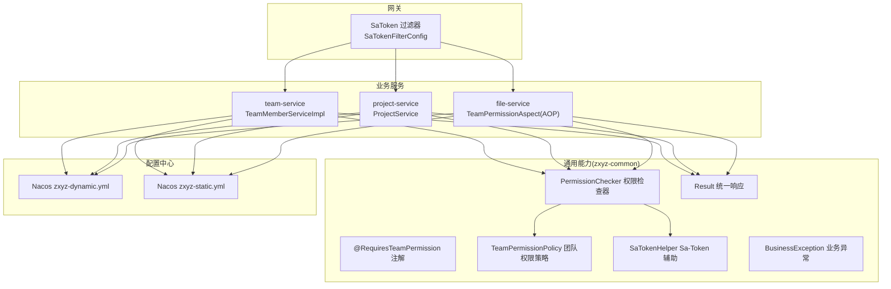
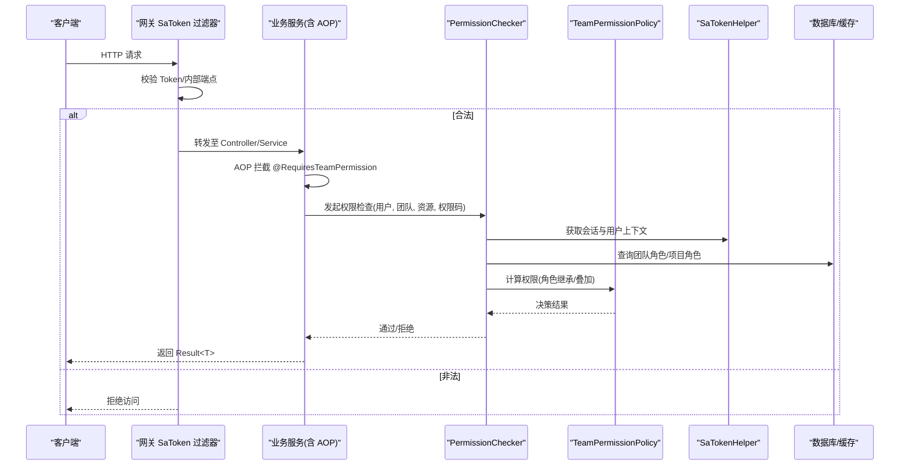
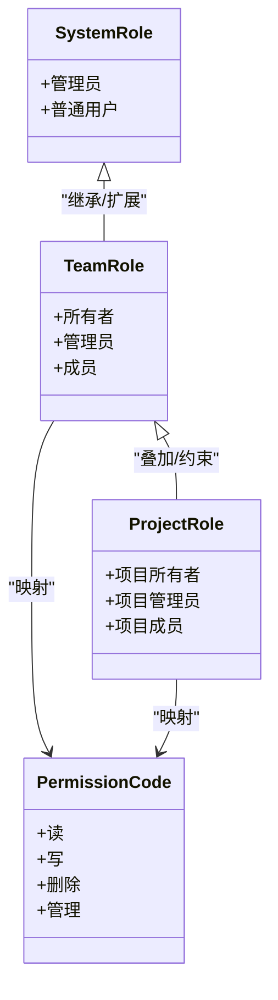
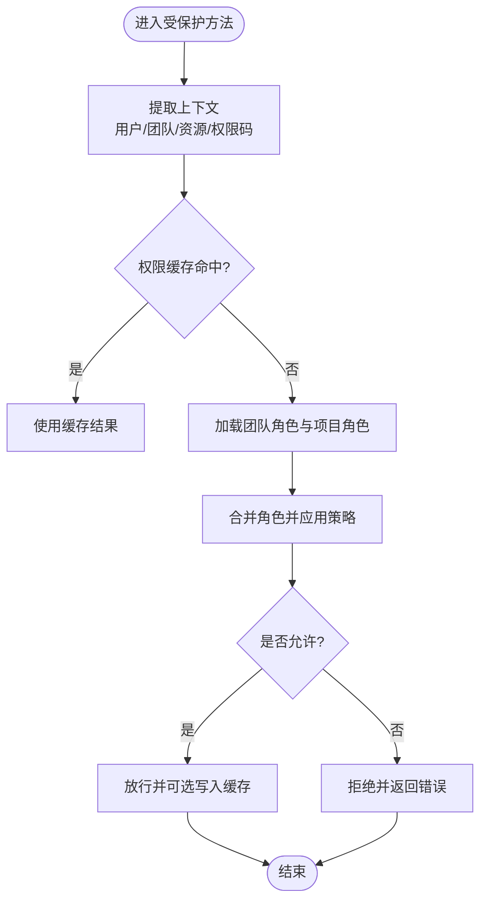
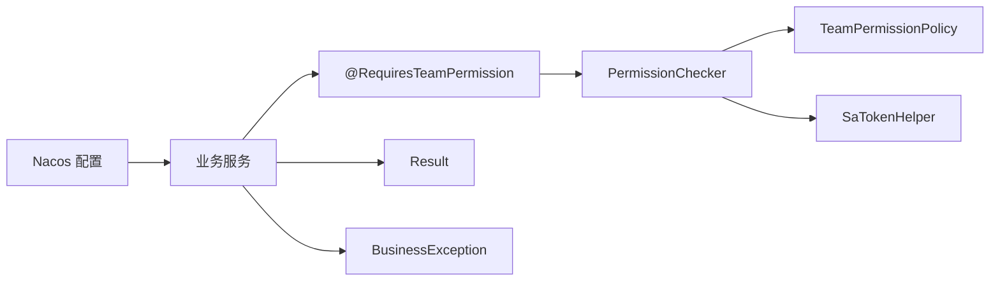
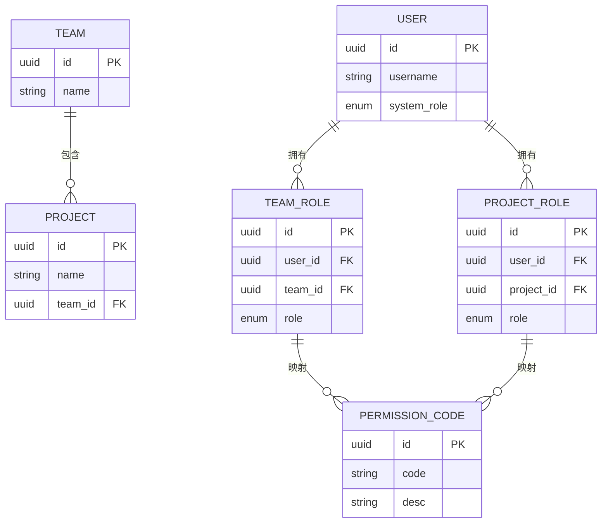
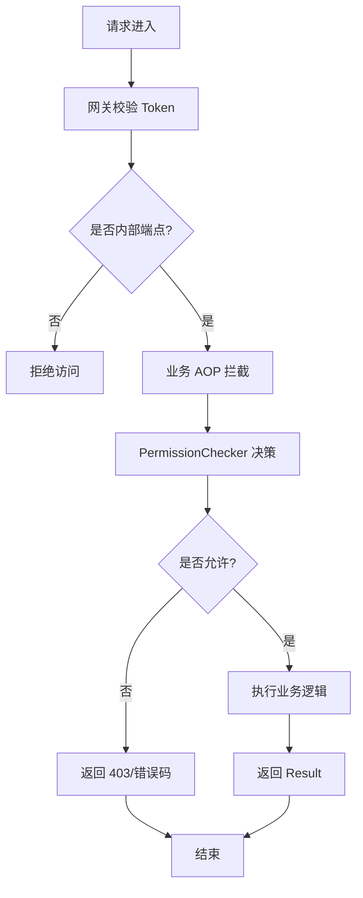

# 授权系统

<cite>
**本文引用的文件**
- [zxyz-common/permission/TeamPermissionPolicy.java](file://ZXYZdatabaseBack/zxyz-common/src/main/java/uno/acloud/common/permission/TeamPermissionPolicy.java)
- [zxyz-common/permission/PermissionChecker.java](file://ZXYZdatabaseBack/zxyz-common/src/main/java/uno/acloud/common/permission/PermissionChecker.java)
- [zxyz-common/permission/RequiresTeamPermission.java](file://ZXYZdatabaseBack/zxyz-common/src/main/java/uno/acloud/common/permission/RequiresTeamPermission.java)
- [zxyz-team-service/service/impl/TeamMemberServiceImpl.java](file://ZXYZdatabaseBack/zxyz-team-service/src/main/java/uno/acloud/team/service/impl/TeamMemberServiceImpl.java)
- [zxyz-project-service/service/ProjectService.java](file://ZXYZdatabaseBack/zxyz-project-service/src/main/java/uno/acloud/project/service/ProjectService.java)
- [zxyz-file-service/aop/TeamPermissionAspect.java](file://ZXYZdatabaseBack/zxyz-file-service/src/main/java/uno/acloud/file/aop/TeamPermissionAspect.java)
- [zxyz-gateway/filter/SaTokenFilterConfig.java](file://ZXYZdatabaseBack/zxyz-gateway/src/main/java/uno/acloud/gateway/filter/SaTokenFilterConfig.java)
- [zxyz-common/satoken/SaTokenHelper.java](file://ZXYZdatabaseBack/zxyz-common/src/main/java/uno/acloud/satoken/SaTokenHelper.java)
- [zxyz-common/web/Result.java](file://ZXYZdatabaseBack/zxyz-common/src/main/java/uno/acloud/common/web/Result.java)
- [zxyz-common/exception/BusinessException.java](file://ZXYZdatabaseBack/zxyz-common/src/main/java/uno/acloud/exception/BusinessException.java)
- [nacos-config/zxyz-dynamic.yml](file://nacos-config/zxyz-dynamic.yml)
- [nacos-config/zxyz-static.yml](file://nacos-config/zxyz-static.yml)
- [ZXYZdatabaseFront/src/constants/teamPermissions.js](file://ZXYZdatabaseFront/src/constants/teamPermissions.js)
- [ZXYZdatabaseFront/src/models/permission.js](file://ZXYZdatabaseFront/src/models/permission.js)
- [ZXYZdatabaseFront/src/router/guards/permission.js](file://ZXYZdatabaseFront/src/router/guards/permission.js)
- [ZXYZdatabaseFront/src/composables/useTeamPermissionActions.js](file://ZXYZdatabaseFront/src/composables/useTeamPermissionActions.js)
</cite>

## 目录
1. [简介](#简介)
2. [项目结构](#项目结构)
3. [核心组件](#核心组件)
4. [架构总览](#架构总览)
5. [详细组件分析](#详细组件分析)
6. [依赖关系分析](#依赖关系分析)
7. [性能考虑](#性能考虑)
8. [故障排查指南](#故障排查指南)
9. [结论](#结论)
10. [附录](#附录)

## 简介
本文件为 ZXYZ 项目的授权系统文档，聚焦 RBAC 权限模型与团队/项目角色体系，覆盖以下主题：
- 系统角色（管理员、普通用户）、团队角色（所有者、管理员、成员）与项目角色的层次结构与权限继承
- @RequiresTeamPermission 注解的参数配置、权限码定义与方法级权限校验机制
- 权限检查流程：接口调用时的权限验证、数据级权限过滤、动态权限计算
- 权限缓存策略：Redis 缓存权限信息、权限变更通知、缓存失效机制
- 权限模型图、权限验证流程图与权限分配示例
- 自定义权限注解与权限检查器的开发指南

## 项目结构
授权能力由“通用能力层 + 网关鉴权 + 各业务服务”共同实现：
- zxyz-common：提供权限策略、注解、Sa-Token 辅助、统一响应与异常等公共能力
- zxyz-gateway：基于 Sa-Token 的全局鉴权过滤器，拦截公网访问并校验内部端点
- zxyz-team-service / zxyz-project-service / zxyz-file-service：在各自服务内使用注解与 AOP 进行方法级与数据级权限控制
- Nacos：集中管理动态配置（如权限开关、缓存策略）
- 前端：常量与模型定义权限码，路由守卫与组合式函数做 UI 侧权限控制

图表来源
- [zxyz-gateway/filter/SaTokenFilterConfig.java](file://ZXYZdatabaseBack/zxyz-gateway/src/main/java/uno/acloud/gateway/filter/SaTokenFilterConfig.java)
- [zxyz-common/permission/RequiresTeamPermission.java](file://ZXYZdatabaseBack/zxyz-common/src/main/java/uno/acloud/common/permission/RequiresTeamPermission.java)
- [zxyz-common/permission/PermissionChecker.java](file://ZXYZdatabaseBack/zxyz-common/src/main/java/uno/acloud/common/permission/PermissionChecker.java)
- [zxyz-common/permission/TeamPermissionPolicy.java](file://ZXYZdatabaseBack/zxyz-common/src/main/java/uno/acloud/common/permission/TeamPermissionPolicy.java)
- [zxyz-common/satoken/SaTokenHelper.java](file://ZXYZdatabaseBack/zxyz-common/src/main/java/uno/acloud/satoken/SaTokenHelper.java)
- [zxyz-common/web/Result.java](file://ZXYZdatabaseBack/zxyz-common/src/main/java/uno/acloud/common/web/Result.java)
- [zxyz-common/exception/BusinessException.java](file://ZXYZdatabaseBack/zxyz-common/src/main/java/uno/acloud/exception/BusinessException.java)
- [nacos-config/zxyz-dynamic.yml](file://nacos-config/zxyz-dynamic.yml)
- [nacos-config/zxyz-static.yml](file://nacos-config/zxyz-static.yml)

章节来源
- [zxyz-gateway/filter/SaTokenFilterConfig.java](file://ZXYZdatabaseBack/zxyz-gateway/src/main/java/uno/acloud/gateway/filter/SaTokenFilterConfig.java)
- [zxyz-common/permission/RequiresTeamPermission.java](file://ZXYZdatabaseBack/zxyz-common/src/main/java/uno/acloud/common/permission/RequiresTeamPermission.java)
- [zxyz-common/permission/PermissionChecker.java](file://ZXYZdatabaseBack/zxyz-common/src/main/java/uno/acloud/common/permission/PermissionChecker.java)
- [zxyz-common/permission/TeamPermissionPolicy.java](file://ZXYZdatabaseBack/zxyz-common/src/main/java/uno/acloud/common/permission/TeamPermissionPolicy.java)
- [zxyz-common/satoken/SaTokenHelper.java](file://ZXYZdatabaseBack/zxyz-common/src/main/java/uno/acloud/satoken/SaTokenHelper.java)
- [zxyz-common/web/Result.java](file://ZXYZdatabaseBack/zxyz-common/src/main/java/uno/acloud/common/web/Result.java)
- [zxyz-common/exception/BusinessException.java](file://ZXYZdatabaseBack/zxyz-common/src/main/java/uno/acloud/exception/BusinessException.java)
- [nacos-config/zxyz-dynamic.yml](file://nacos-config/zxyz-dynamic.yml)
- [nacos-config/zxyz-static.yml](file://nacos-config/zxyz-static.yml)

## 核心组件
- 注解：@RequiresTeamPermission
  - 作用：方法级团队权限校验，支持指定团队维度与权限码
  - 关键参数：团队标识、操作类型或权限码、是否允许跨团队等
  - 行为：AOP 拦截后委托 PermissionChecker 执行校验
- 权限检查器：PermissionChecker
  - 职责：解析上下文（当前用户、当前团队、目标资源），调用策略计算最终权限
  - 能力：读取 Sa-Token 会话、查询团队角色、合并项目角色、返回决策结果
- 团队权限策略：TeamPermissionPolicy
  - 职责：定义团队角色到权限码的映射规则与继承关系
  - 角色层级：所有者 > 管理员 > 成员；可叠加项目角色提升或限制
- Sa-Token 辅助：SaTokenHelper
  - 职责：封装登录态获取、会话读写、用户上下文注入
- 统一响应与异常：Result<T>、BusinessException
  - 职责：标准化返回体与错误码，便于前端处理

章节来源
- [zxyz-common/permission/RequiresTeamPermission.java](file://ZXYZdatabaseBack/zxyz-common/src/main/java/uno/acloud/common/permission/RequiresTeamPermission.java)
- [zxyz-common/permission/PermissionChecker.java](file://ZXYZdatabaseBack/zxyz-common/src/main/java/uno/acloud/common/permission/PermissionChecker.java)
- [zxyz-common/permission/TeamPermissionPolicy.java](file://ZXYZdatabaseBack/zxyz-common/src/main/java/uno/acloud/common/permission/TeamPermissionPolicy.java)
- [zxyz-common/satoken/SaTokenHelper.java](file://ZXYZdatabaseBack/zxyz-common/src/main/java/uno/acloud/satoken/SaTokenHelper.java)
- [zxyz-common/web/Result.java](file://ZXYZdatabaseBack/zxyz-common/src/main/java/uno/acloud/common/web/Result.java)
- [zxyz-common/exception/BusinessException.java](file://ZXYZdatabaseBack/zxyz-common/src/main/java/uno/acloud/exception/BusinessException.java)

## 架构总览
授权链路贯穿网关与业务服务：
- 网关层：SaToken 过滤器校验请求合法性，拒绝公网访问内部端点
- 业务层：通过 @RequiresTeamPermission 注解触发 AOP 拦截，PermissionChecker 结合 TeamPermissionPolicy 计算权限
- 数据层：按资源维度（团队/项目）进行数据级权限过滤
- 配置层：Nacos 动态下发权限策略与缓存开关

图表来源
- [zxyz-gateway/filter/SaTokenFilterConfig.java](file://ZXYZdatabaseBack/zxyz-gateway/src/main/java/uno/acloud/gateway/filter/SaTokenFilterConfig.java)
- [zxyz-common/permission/PermissionChecker.java](file://ZXYZdatabaseBack/zxyz-common/src/main/java/uno/acloud/common/permission/PermissionChecker.java)
- [zxyz-common/permission/TeamPermissionPolicy.java](file://ZXYZdatabaseBack/zxyz-common/src/main/java/uno/acloud/common/permission/TeamPermissionPolicy.java)
- [zxyz-common/satoken/SaTokenHelper.java](file://ZXYZdatabaseBack/zxyz-common/src/main/java/uno/acloud/satoken/SaTokenHelper.java)

## 详细组件分析

### 团队与项目角色模型及继承关系
- 系统角色
  - 管理员：全局管理能力，不受团队边界限制
  - 普通用户：受团队/项目范围限制的常规能力
- 团队角色
  - 所有者：对团队拥有完全控制权
  - 管理员：团队内管理与协作权限
  - 成员：基础协作权限
- 项目角色
  - 在项目维度上可对团队成员进行权限增强或限制
  - 与团队角色叠加计算，遵循“更严格优先”原则

图表来源
- [zxyz-common/permission/TeamPermissionPolicy.java](file://ZXYZdatabaseBack/zxyz-common/src/main/java/uno/acloud/common/permission/TeamPermissionPolicy.java)

章节来源
- [zxyz-common/permission/TeamPermissionPolicy.java](file://ZXYZdatabaseBack/zxyz-common/src/main/java/uno/acloud/common/permission/TeamPermissionPolicy.java)

### 注解 @RequiresTeamPermission 的使用与参数
- 适用场景：需要团队维度权限的方法入口
- 关键参数说明
  - teamId：目标团队标识
  - permission：权限码或操作类型
  - allowCrossTeam：是否允许跨团队访问（默认不允许）
- 使用方法
  - 在 Service 方法上添加注解，传入必要参数
  - AOP 自动完成权限校验，失败抛出异常或返回统一错误

章节来源
- [zxyz-common/permission/RequiresTeamPermission.java](file://ZXYZdatabaseBack/zxyz-common/src/main/java/uno/acloud/common/permission/RequiresTeamPermission.java)

### 权限检查流程（接口调用、数据级过滤、动态计算）
- 接口调用时
  - AOP 拦截注解方法，提取上下文与权限码
  - 调用 PermissionChecker 进行决策
- 数据级过滤
  - 查询前根据用户角色与资源归属生成过滤条件
  - 仅返回用户有权访问的数据集合
- 动态权限计算
  - 基于 TeamPermissionPolicy 将团队角色与项目角色合并
  - 支持运行时配置调整（Nacos）

图表来源
- [zxyz-common/permission/PermissionChecker.java](file://ZXYZdatabaseBack/zxyz-common/src/main/java/uno/acloud/common/permission/PermissionChecker.java)
- [zxyz-common/permission/TeamPermissionPolicy.java](file://ZXYZdatabaseBack/zxyz-common/src/main/java/uno/acloud/common/permission/TeamPermissionPolicy.java)

章节来源
- [zxyz-common/permission/PermissionChecker.java](file://ZXYZdatabaseBack/zxyz-common/src/main/java/uno/acloud/common/permission/PermissionChecker.java)
- [zxyz-common/permission/TeamPermissionPolicy.java](file://ZXYZdatabaseBack/zxyz-common/src/main/java/uno/acloud/common/permission/TeamPermissionPolicy.java)

### 权限缓存策略（Redis、变更通知、失效机制）
- 缓存内容
  - 用户-团队-资源的权限决策结果
  - 团队角色与项目角色快照
- 缓存键设计
  - 基于用户ID、团队ID、资源ID与权限码生成稳定键
- 失效与更新
  - 角色变更事件触发对应键失效
  - 支持按团队或资源维度批量清理
- 一致性保障
  - 先更新数据源，再发布变更事件，最后清理缓存

章节来源
- [zxyz-common/permission/PermissionChecker.java](file://ZXYZdatabaseBack/zxyz-common/src/main/java/uno/acloud/common/permission/PermissionChecker.java)
- [zxyz-common/permission/TeamPermissionPolicy.java](file://ZXYZdatabaseBack/zxyz-common/src/main/java/uno/acloud/common/permission/TeamPermissionPolicy.java)

### 网关与 Sa-Token 集成
- 网关过滤器
  - 校验 Token 有效性，拒绝公网访问内部端点
  - 透传用户上下文至下游服务
- Sa-Token 辅助
  - 封装会话读取、用户上下文注入
  - 与 Redis Session 集成，保证分布式一致性

章节来源
- [zxyz-gateway/filter/SaTokenFilterConfig.java](file://ZXYZdatabaseBack/zxyz-gateway/src/main/java/uno/acloud/gateway/filter/SaTokenFilterConfig.java)
- [zxyz-common/satoken/SaTokenHelper.java](file://ZXYZdatabaseBack/zxyz-common/src/main/java/uno/acloud/satoken/SaTokenHelper.java)

### 业务服务中的权限应用
- team-service
  - 成员管理接口使用注解确保只有团队所有者/管理员可操作
- project-service
  - 项目相关接口结合项目角色进行细粒度控制
- file-service
  - AOP 切面统一处理文件访问的团队权限校验

章节来源
- [zxyz-team-service/service/impl/TeamMemberServiceImpl.java](file://ZXYZdatabaseBack/zxyz-team-service/src/main/java/uno/acloud/team/service/impl/TeamMemberServiceImpl.java)
- [zxyz-project-service/service/ProjectService.java](file://ZXYZdatabaseBack/zxyz-project-service/src/main/java/uno/acloud/project/service/ProjectService.java)
- [zxyz-file-service/aop/TeamPermissionAspect.java](file://ZXYZdatabaseBack/zxyz-file-service/src/main/java/uno/acloud/file/aop/TeamPermissionAspect.java)

### 前端权限模型与路由守卫
- 常量与模型
  - teamPermissions.js：定义团队权限码
  - permission.js：权限模型与工具方法
- 路由守卫
  - 根据用户权限决定页面可见性与跳转
- 组合式函数
  - useTeamPermissionActions.js：封装按钮级权限判断与交互

章节来源
- [ZXYZdatabaseFront/src/constants/teamPermissions.js](file://ZXYZdatabaseFront/src/constants/teamPermissions.js)
- [ZXYZdatabaseFront/src/models/permission.js](file://ZXYZdatabaseFront/src/models/permission.js)
- [ZXYZdatabaseFront/src/router/guards/permission.js](file://ZXYZdatabaseFront/src/router/guards/permission.js)
- [ZXYZdatabaseFront/src/composables/useTeamPermissionActions.js](file://ZXYZdatabaseFront/src/composables/useTeamPermissionActions.js)

## 依赖关系分析
- 注解与 AOP
  - RequiresTeamPermission → PermissionChecker → TeamPermissionPolicy
- 会话与上下文
  - PermissionChecker → SaTokenHelper
- 配置与动态策略
  - 各服务通过 Nacos 动态配置权限策略与缓存开关
- 统一输出
  - 业务方法返回 Result<T>，异常使用 BusinessException

图表来源
- [zxyz-common/permission/RequiresTeamPermission.java](file://ZXYZdatabaseBack/zxyz-common/src/main/java/uno/acloud/common/permission/RequiresTeamPermission.java)
- [zxyz-common/permission/PermissionChecker.java](file://ZXYZdatabaseBack/zxyz-common/src/main/java/uno/acloud/common/permission/PermissionChecker.java)
- [zxyz-common/permission/TeamPermissionPolicy.java](file://ZXYZdatabaseBack/zxyz-common/src/main/java/uno/acloud/common/permission/TeamPermissionPolicy.java)
- [zxyz-common/satoken/SaTokenHelper.java](file://ZXYZdatabaseBack/zxyz-common/src/main/java/uno/acloud/satoken/SaTokenHelper.java)
- [zxyz-common/web/Result.java](file://ZXYZdatabaseBack/zxyz-common/src/main/java/uno/acloud/common/web/Result.java)
- [zxyz-common/exception/BusinessException.java](file://ZXYZdatabaseBack/zxyz-common/src/main/java/uno/acloud/exception/BusinessException.java)
- [nacos-config/zxyz-dynamic.yml](file://nacos-config/zxyz-dynamic.yml)

章节来源
- [zxyz-common/permission/RequiresTeamPermission.java](file://ZXYZdatabaseBack/zxyz-common/src/main/java/uno/acloud/common/permission/RequiresTeamPermission.java)
- [zxyz-common/permission/PermissionChecker.java](file://ZXYZdatabaseBack/zxyz-common/src/main/java/uno/acloud/common/permission/PermissionChecker.java)
- [zxyz-common/permission/TeamPermissionPolicy.java](file://ZXYZdatabaseBack/zxyz-common/src/main/java/uno/acloud/common/permission/TeamPermissionPolicy.java)
- [zxyz-common/satoken/SaTokenHelper.java](file://ZXYZdatabaseBack/zxyz-common/src/main/java/uno/acloud/satoken/SaTokenHelper.java)
- [zxyz-common/web/Result.java](file://ZXYZdatabaseBack/zxyz-common/src/main/java/uno/acloud/common/web/Result.java)
- [zxyz-common/exception/BusinessException.java](file://ZXYZdatabaseBack/zxyz-common/src/main/java/uno/acloud/exception/BusinessException.java)
- [nacos-config/zxyz-dynamic.yml](file://nacos-config/zxyz-dynamic.yml)

## 性能考虑
- 缓存命中率
  - 合理设计缓存键与过期时间，降低重复计算
- 角色查询优化
  - 批量加载团队与项目角色，减少多次 IO
- 策略计算复杂度
  - 避免复杂嵌套逻辑，保持 O(1) 或 O(log n) 决策路径
- 网关压力
  - 尽量在网关层快速拒绝非法请求，减轻后端负载

[本节为通用指导，不直接分析具体文件]

## 故障排查指南
- 常见问题
  - 权限未生效：检查注解参数是否正确、AOP 是否生效
  - 缓存不一致：确认角色变更后是否触发缓存清理
  - 网关拒绝：检查 Token 与内部端点白名单
- 定位步骤
  - 查看日志中 PermissionChecker 决策结果
  - 核对 Nacos 配置项是否被正确加载
  - 检查 Sa-Token 会话是否存在且有效

章节来源
- [zxyz-common/permission/PermissionChecker.java](file://ZXYZdatabaseBack/zxyz-common/src/main/java/uno/acloud/common/permission/PermissionChecker.java)
- [zxyz-common/permission/TeamPermissionPolicy.java](file://ZXYZdatabaseBack/zxyz-common/src/main/java/uno/acloud/common/permission/TeamPermissionPolicy.java)
- [zxyz-gateway/filter/SaTokenFilterConfig.java](file://ZXYZdatabaseBack/zxyz-gateway/src/main/java/uno/acloud/gateway/filter/SaTokenFilterConfig.java)
- [nacos-config/zxyz-dynamic.yml](file://nacos-config/zxyz-dynamic.yml)

## 结论
ZXYZ 授权系统以注解驱动与 AOP 为核心，结合 Sa-Token 与会话管理、Nacos 动态配置与 Redis 缓存，实现了灵活可扩展的 RBAC 权限模型。通过团队与项目角色的分层与叠加，满足多租户与多项目场景下的细粒度权限控制。建议在生产环境持续监控缓存命中率与决策耗时，并结合审计日志完善权限回溯能力。

[本节为总结性内容，不直接分析具体文件]

## 附录

### 权限模型图

图表来源
- [zxyz-common/permission/TeamPermissionPolicy.java](file://ZXYZdatabaseBack/zxyz-common/src/main/java/uno/acloud/common/permission/TeamPermissionPolicy.java)

### 权限验证流程图

图表来源
- [zxyz-gateway/filter/SaTokenFilterConfig.java](file://ZXYZdatabaseBack/zxyz-gateway/src/main/java/uno/acloud/gateway/filter/SaTokenFilterConfig.java)
- [zxyz-common/permission/PermissionChecker.java](file://ZXYZdatabaseBack/zxyz-common/src/main/java/uno/acloud/common/permission/PermissionChecker.java)

### 权限分配示例
- 场景一：团队所有者对某项目授予“项目管理员”角色
  - 团队角色：所有者
  - 项目角色：项目管理员
  - 最终权限：团队+项目叠加，具备项目维度的强管控能力
- 场景二：普通成员加入项目成为“项目成员”
  - 团队角色：成员
  - 项目角色：项目成员
  - 最终权限：受限的读写能力，无法删除或管理项目设置

章节来源
- [zxyz-common/permission/TeamPermissionPolicy.java](file://ZXYZdatabaseBack/zxyz-common/src/main/java/uno/acloud/common/permission/TeamPermissionPolicy.java)

### 自定义权限注解与权限检查器开发指南
- 自定义注解
  - 定义注解类，声明必要参数（如资源类型、操作类型、作用域）
  - 使用元注解绑定 AOP 切面
- 权限检查器
  - 实现权限决策逻辑，读取上下文与角色数据
  - 支持策略注入，便于扩展新的角色映射规则
- AOP 切面
  - 拦截注解方法，捕获异常并转换为统一响应
  - 记录审计日志与性能指标
- 测试建议
  - 覆盖正常、越权、边界条件等用例
  - 验证缓存命中与失效路径

章节来源
- [zxyz-common/permission/RequiresTeamPermission.java](file://ZXYZdatabaseBack/zxyz-common/src/main/java/uno/acloud/common/permission/RequiresTeamPermission.java)
- [zxyz-common/permission/PermissionChecker.java](file://ZXYZdatabaseBack/zxyz-common/src/main/java/uno/acloud/common/permission/PermissionChecker.java)
- [zxyz-common/permission/TeamPermissionPolicy.java](file://ZXYZdatabaseBack/zxyz-common/src/main/java/uno/acloud/common/permission/TeamPermissionPolicy.java)