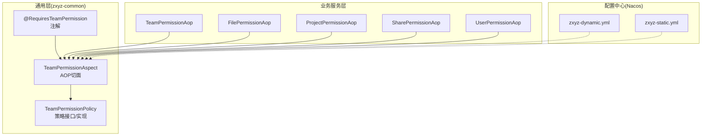
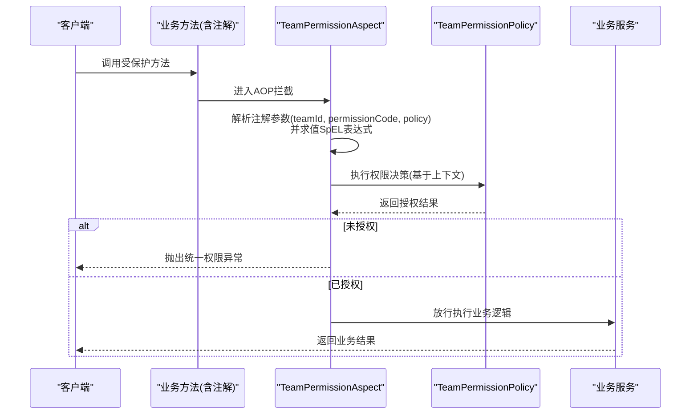
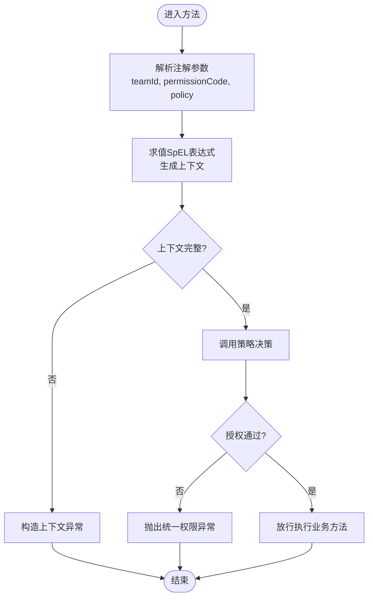
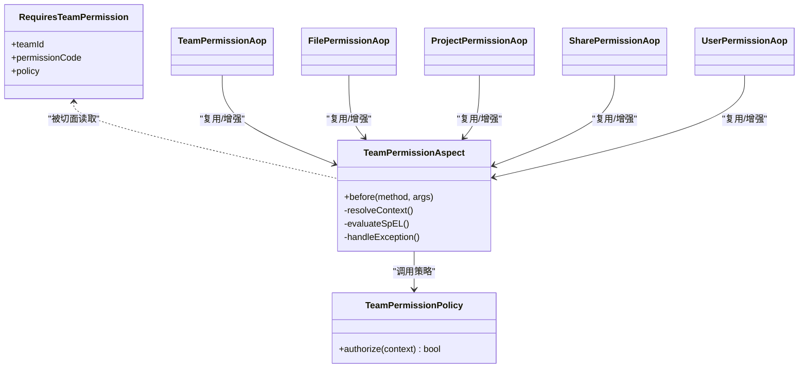
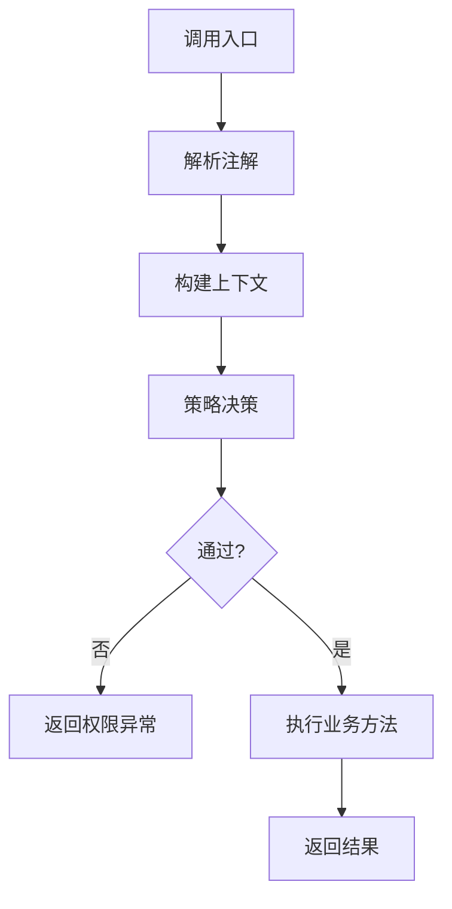

# 权限注解机制

<cite>
**本文引用的文件**   
- [zxyz-common/permission/TeamPermissionPolicy.java](file://ZXYZdatabaseBack/zxyz-common/src/main/java/uno/acloud/common/permission/TeamPermissionPolicy.java)
- [zxyz-common/permission/RequiresTeamPermission.java](file://ZXYZdatabaseBack/zxyz-common/src/main/java/uno/acloud/common/permission/RequiresTeamPermission.java)
- [zxyz-common/permission/TeamPermissionAspect.java](file://ZXYZdatabaseBack/zxyz-common/src/main/java/uno/acloud/common/permission/TeamPermissionAspect.java)
- [zxyz-common/TeamPermissionPolicyTest.java](file://ZXYZdatabaseBack/zxyz-common/src/test/java/uno/acloud/common/TeamPermissionPolicyTest.java)
- [zxyz-team-service/aop/TeamPermissionAop.java](file://ZXYZdatabaseBack/zxyz-team-service/src/main/java/uno/acloud/team/aop/TeamPermissionAop.java)
- [zxyz-file-service/aop/FilePermissionAop.java](file://ZXYZdatabaseBack/zxyz-file-service/src/main/java/uno/acloud/file/aop/FilePermissionAop.java)
- [zxyz-project-service/aop/ProjectPermissionAop.java](file://ZXYZdatabaseBack/zxyz-project-service/src/main/java/uno/acloud/project/aop/ProjectPermissionAop.java)
- [zxyz-share-service/aop/SharePermissionAop.java](file://ZXYZdatabaseBack/zxyz-share-service/src/main/java/uno/acloud/share/aop/SharePermissionAop.java)
- [zxyz-user-service/aop/UserPermissionAop.java](file://ZXYZdatabaseBack/zxyz-user-service/src/main/java/uno/acloud/user/aop/UserPermissionAop.java)
- [nacos-config/zxyz-dynamic.yml](file://nacos-config/zxyz-dynamic.yml)
- [nacos-config/zxyz-static.yml](file://nacos-config/zxyz-static.yml)
</cite>

## 目录
1. [简介](#简介)
2. [项目结构](#项目结构)
3. [核心组件](#核心组件)
4. [架构总览](#架构总览)
5. [详细组件分析](#详细组件分析)
6. [依赖关系分析](#依赖关系分析)
7. [性能考量](#性能考量)
8. [故障排查指南](#故障排查指南)
9. [结论](#结论)
10. [附录：使用示例与最佳实践](#附录使用示例与最佳实践)

## 简介
本文件面向 ZXYZ 项目的权限注解机制，重点围绕 @RequiresTeamPermission 注解的使用与实现原理进行系统化说明。内容涵盖：
- 注解参数配置（teamId、permissionCode、policy）与方法级权限校验
- AOP 切面拦截流程、异常处理策略与性能优化要点
- 自定义权限注解的扩展方式（注解定义、切面编写、验证逻辑扩展）
- 权限验证流程图、错误处理最佳实践、高级用法与调试技巧

## 项目结构
权限相关能力主要分布在 zxyz-common 模块（通用注解与切面）、各业务服务模块（按领域封装的 AOP），以及 Nacos 动态配置中心。整体采用“注解 + AOP”的横切模式，将权限校验从业务方法中解耦，便于统一治理与扩展。

图表来源 
- [zxyz-common/permission/RequiresTeamPermission.java](file://ZXYZdatabaseBack/zxyz-common/src/main/java/uno/acloud/common/permission/RequiresTeamPermission.java)
- [zxyz-common/permission/TeamPermissionPolicy.java](file://ZXYZdatabaseBack/zxyz-common/src/main/java/uno/acloud/common/permission/TeamPermissionPolicy.java)
- [zxyz-common/permission/TeamPermissionAspect.java](file://ZXYZdatabaseBack/zxyz-common/src/main/java/uno/acloud/common/permission/TeamPermissionAspect.java)
- [zxyz-team-service/aop/TeamPermissionAop.java](file://ZXYZdatabaseBack/zxyz-team-service/src/main/java/uno/acloud/team/aop/TeamPermissionAop.java)
- [zxyz-file-service/aop/FilePermissionAop.java](file://ZXYZdatabaseBack/zxyz-file-service/src/main/java/uno/acloud/file/aop/FilePermissionAop.java)
- [zxyz-project-service/aop/ProjectPermissionAop.java](file://ZXYZdatabaseBack/zxyz-project-service/src/main/java/uno/acloud/project/aop/ProjectPermissionAop.java)
- [zxyz-share-service/aop/SharePermissionAop.java](file://ZXYZdatabaseBack/zxyz-share-service/src/main/java/uno/acloud/share/aop/SharePermissionAop.java)
- [zxyz-user-service/aop/UserPermissionAop.java](file://ZXYZdatabaseBack/zxyz-user-service/src/main/java/uno/acloud/user/aop/UserPermissionAop.java)
- [nacos-config/zxyz-dynamic.yml](file://nacos-config/zxyz-dynamic.yml)
- [nacos-config/zxyz-static.yml](file://nacos-config/zxyz-static.yml)

章节来源
- [zxyz-common/permission/RequiresTeamPermission.java](file://ZXYZdatabaseBack/zxyz-common/src/main/java/uno/acloud/common/permission/RequiresTeamPermission.java)
- [zxyz-common/permission/TeamPermissionPolicy.java](file://ZXYZdatabaseBack/zxyz-common/src/main/java/uno/acloud/common/permission/TeamPermissionPolicy.java)
- [zxyz-common/permission/TeamPermissionAspect.java](file://ZXYZdatabaseBack/zxyz-common/src/main/java/uno/acloud/common/permission/TeamPermissionAspect.java)

## 核心组件
- @RequiresTeamPermission 注解：用于在方法上声明团队维度的权限要求，支持 teamId、permissionCode、policy 等关键参数，并可结合 SpEL 表达式进行条件判断。
- TeamPermissionPolicy：权限策略抽象与默认实现，负责根据上下文（当前用户、团队、资源）计算是否具备指定权限。
- TeamPermissionAspect：AOP 切面，拦截标注了 @RequiresTeamPermission 的方法，执行权限校验、异常转换与结果透传。
- 各服务 AOP：针对特定领域（团队、文件、项目、分享、用户）的增强点，复用通用切面或提供领域特定的校验逻辑。

章节来源
- [zxyz-common/permission/RequiresTeamPermission.java](file://ZXYZdatabaseBack/zxyz-common/src/main/java/uno/acloud/common/permission/RequiresTeamPermission.java)
- [zxyz-common/permission/TeamPermissionPolicy.java](file://ZXYZdatabaseBack/zxyz-common/src/main/java/uno/acloud/common/permission/TeamPermissionPolicy.java)
- [zxyz-common/permission/TeamPermissionAspect.java](file://ZXYZdatabaseBack/zxyz-common/src/main/java/uno/acloud/common/permission/TeamPermissionAspect.java)
- [zxyz-team-service/aop/TeamPermissionAop.java](file://ZXYZdatabaseBack/zxyz-team-service/src/main/java/uno/acloud/team/aop/TeamPermissionAop.java)
- [zxyz-file-service/aop/FilePermissionAop.java](file://ZXYZdatabaseBack/zxyz-file-service/src/main/java/uno/acloud/file/aop/FilePermissionAop.java)
- [zxyz-project-service/aop/ProjectPermissionAop.java](file://ZXYZdatabaseBack/zxyz-project-service/src/main/java/uno/acloud/project/aop/ProjectPermissionAop.java)
- [zxyz-share-service/aop/SharePermissionAop.java](file://ZXYZdatabaseBack/zxyz-share-service/src/main/java/uno/acloud/share/aop/SharePermissionAop.java)
- [zxyz-user-service/aop/UserPermissionAop.java](file://ZXYZdatabaseBack/zxyz-user-service/src/main/java/uno/acloud/user/aop/UserPermissionAop.java)

## 架构总览
权限校验的整体流程如下：
- 控制器或服务方法被 @RequiresTeamPermission 标注
- TeamPermissionAspect 在方法调用前拦截，解析注解参数与 SpEL 表达式
- 通过 TeamPermissionPolicy 计算权限决策
- 若拒绝则抛出统一异常；若允许则继续执行业务方法
- 各服务 AOP 可在领域维度追加额外校验或日志审计

图表来源 
- [zxyz-common/permission/TeamPermissionAspect.java](file://ZXYZdatabaseBack/zxyz-common/src/main/java/uno/acloud/common/permission/TeamPermissionAspect.java)
- [zxyz-common/permission/TeamPermissionPolicy.java](file://ZXYZdatabaseBack/zxyz-common/src/main/java/uno/acloud/common/permission/TeamPermissionPolicy.java)

## 详细组件分析

### @RequiresTeamPermission 注解
- 作用位置：方法级
- 关键参数
  - teamId：目标团队标识，支持常量或 SpEL 表达式
  - permissionCode：权限码，用于策略匹配与审计
  - policy：策略名称或策略类标识，决定具体校验规则
- 条件表达式：支持 SpEL，可引用方法参数、上下文对象（如当前用户、团队信息）进行动态判定

章节来源
- [zxyz-common/permission/RequiresTeamPermission.java](file://ZXYZdatabaseBack/zxyz-common/src/main/java/uno/acloud/common/permission/RequiresTeamPermission.java)

### TeamPermissionPolicy 策略
- 职责：封装不同场景下的权限计算逻辑，支持可扩展的策略注册与选择
- 输入：团队ID、权限码、策略标识、请求上下文（用户、租户、资源等）
- 输出：布尔授权结果或带原因的结构化响应
- 扩展点：新增策略时实现策略接口并在策略工厂/注册表中登记

章节来源
- [zxyz-common/permission/TeamPermissionPolicy.java](file://ZXYZdatabaseBack/zxyz-common/src/main/java/uno/acloud/common/permission/TeamPermissionPolicy.java)
- [zxyz-common/TeamPermissionPolicyTest.java](file://ZXYZdatabaseBack/zxyz-common/src/test/java/uno/acloud/common/TeamPermissionPolicyTest.java)

### TeamPermissionAspect 切面
- 拦截时机：方法调用前（前置通知）
- 处理步骤
  - 解析注解属性与 SpEL 表达式
  - 构建权限决策上下文
  - 调用策略进行授权判断
  - 失败时抛出统一异常（包含错误码与提示）
  - 成功时放行并记录审计日志（可选）
- 异常处理：捕获策略或上下文获取异常，转换为统一的权限异常

章节来源
- [zxyz-common/permission/TeamPermissionAspect.java](file://ZXYZdatabaseBack/zxyz-common/src/main/java/uno/acloud/common/permission/TeamPermissionAspect.java)

### 领域 AOP（以团队、文件、项目、分享、用户为例）
- 团队 AOP：聚焦团队维度的成员角色与权限码校验
- 文件 AOP：结合文件归属、共享状态与访问控制策略
- 项目 AOP：在项目上下文中校验操作权限
- 分享 AOP：对分享链接、有效期与访问范围进行校验
- 用户 AOP：对用户自身或他人数据的访问限制

章节来源
- [zxyz-team-service/aop/TeamPermissionAop.java](file://ZXYZdatabaseBack/zxyz-team-service/src/main/java/uno/acloud/team/aop/TeamPermissionAop.java)
- [zxyz-file-service/aop/FilePermissionAop.java](file://ZXYZdatabaseBack/zxyz-file-service/src/main/java/uno/acloud/file/aop/FilePermissionAop.java)
- [zxyz-project-service/aop/ProjectPermissionAop.java](file://ZXYZdatabaseBack/zxyz-project-service/src/main/java/uno/acloud/project/aop/ProjectPermissionAop.java)
- [zxyz-share-service/aop/SharePermissionAop.java](file://ZXYZdatabaseBack/zxyz-share-service/src/main/java/uno/acloud/share/aop/SharePermissionAop.java)
- [zxyz-user-service/aop/UserPermissionAop.java](file://ZXYZdatabaseBack/zxyz-user-service/src/main/java/uno/acloud/user/aop/UserPermissionAop.java)

### 权限验证流程图（算法视角）

图表来源 
- [zxyz-common/permission/TeamPermissionAspect.java](file://ZXYZdatabaseBack/zxyz-common/src/main/java/uno/acloud/common/permission/TeamPermissionAspect.java)
- [zxyz-common/permission/TeamPermissionPolicy.java](file://ZXYZdatabaseBack/zxyz-common/src/main/java/uno/acloud/common/permission/TeamPermissionPolicy.java)

## 依赖关系分析
- 注解与切面耦合度低：注解仅声明约束，切面负责解析与执行，策略负责决策，三者职责清晰
- 策略可扩展：新增策略无需修改切面，只需注册新策略并命名
- 领域 AOP 复用通用切面：避免重复代码，保证一致性与可维护性
- 配置驱动：Nacos 动态配置可用于开关特性、调整策略行为或灰度发布

图表来源 
- [zxyz-common/permission/RequiresTeamPermission.java](file://ZXYZdatabaseBack/zxyz-common/src/main/java/uno/acloud/common/permission/RequiresTeamPermission.java)
- [zxyz-common/permission/TeamPermissionAspect.java](file://ZXYZdatabaseBack/zxyz-common/src/main/java/uno/acloud/common/permission/TeamPermissionAspect.java)
- [zxyz-common/permission/TeamPermissionPolicy.java](file://ZXYZdatabaseBack/zxyz-common/src/main/java/uno/acloud/common/permission/TeamPermissionPolicy.java)
- [zxyz-team-service/aop/TeamPermissionAop.java](file://ZXYZdatabaseBack/zxyz-team-service/src/main/java/uno/acloud/team/aop/TeamPermissionAop.java)
- [zxyz-file-service/aop/FilePermissionAop.java](file://ZXYZdatabaseBack/zxyz-file-service/src/main/java/uno/acloud/file/aop/FilePermissionAop.java)
- [zxyz-project-service/aop/ProjectPermissionAop.java](file://ZXYZdatabaseBack/zxyz-project-service/src/main/java/uno/acloud/project/aop/ProjectPermissionAop.java)
- [zxyz-share-service/aop/SharePermissionAop.java](file://ZXYZdatabaseBack/zxyz-share-service/src/main/java/uno/acloud/share/aop/SharePermissionAop.java)
- [zxyz-user-service/aop/UserPermissionAop.java](file://ZXYZdatabaseBack/zxyz-user-service/src/main/java/uno/acloud/user/aop/UserPermissionAop.java)

章节来源
- [zxyz-common/permission/RequiresTeamPermission.java](file://ZXYZdatabaseBack/zxyz-common/src/main/java/uno/acloud/common/permission/RequiresTeamPermission.java)
- [zxyz-common/permission/TeamPermissionAspect.java](file://ZXYZdatabaseBack/zxyz-common/src/main/java/uno/acloud/common/permission/TeamPermissionAspect.java)
- [zxyz-common/permission/TeamPermissionPolicy.java](file://ZXYZdatabaseBack/zxyz-common/src/main/java/uno/acloud/common/permission/TeamPermissionPolicy.java)

## 性能考量
- 注解解析缓存：对注解属性与 SpEL 表达式的解析结果进行缓存，减少反射与表达式求值开销
- 策略决策短路：在策略内部优先检查高频条件，尽早返回结果
- 上下文构建最小化：按需加载必要数据，避免不必要的远程调用或数据库查询
- 异步审计：将非关键路径的审计日志写入消息队列或缓冲，降低主链路延迟
- 配置开关：通过 Nacos 动态关闭或降级非核心校验，保障高可用

[本节为通用指导，不直接分析具体文件]

## 故障排查指南
- 常见问题
  - teamId 为空或未正确解析：检查 SpEL 表达式与上下文注入
  - permissionCode 不匹配：核对策略映射与权限码字典
  - policy 未注册：确认策略实现已正确注册到策略工厂
  - 异常信息不明确：查看统一异常包装与错误码映射
- 定位手段
  - 开启 AOP 调试日志，观察注解解析与策略调用链
  - 打印 SpEL 求值中间结果，确认上下文变量可用性
  - 使用单元测试覆盖策略分支，快速回归问题
- 恢复建议
  - 临时放宽策略或切换备用策略
  - 回滚最近一次策略变更
  - 通过 Nacos 动态调整策略行为

章节来源
- [zxyz-common/permission/TeamPermissionAspect.java](file://ZXYZdatabaseBack/zxyz-common/src/main/java/uno/acloud/common/permission/TeamPermissionAspect.java)
- [zxyz-common/permission/TeamPermissionPolicy.java](file://ZXYZdatabaseBack/zxyz-common/src/main/java/uno/acloud/common/permission/TeamPermissionPolicy.java)

## 结论
@RequiresTeamPermission 注解配合 AOP 与策略模式，实现了灵活、可扩展的团队权限校验机制。通过清晰的职责划分与配置驱动，既能满足复杂业务场景，又具备良好的性能与可维护性。建议在新增权限需求时优先扩展策略而非修改切面，保持系统稳定与演进能力。

[本节为总结性内容，不直接分析具体文件]

## 附录：使用示例与最佳实践

### 注解使用示例
- 基础用法：在方法上标注 @RequiresTeamPermission，指定 teamId 与 permissionCode
- 条件表达式：使用 SpEL 动态计算 teamId 或附加条件
- 策略选择：通过 policy 指定不同的校验策略

章节来源
- [zxyz-common/permission/RequiresTeamPermission.java](file://ZXYZdatabaseBack/zxyz-common/src/main/java/uno/acloud/common/permission/RequiresTeamPermission.java)

### 自定义权限注解开发
- 注解定义：参考 @RequiresTeamPermission，定义新的注解并继承或组合已有属性
- 切面编写：创建对应切面，解析新注解并复用策略或扩展上下文
- 验证逻辑扩展：实现新的策略并在策略注册表中登记

章节来源
- [zxyz-common/permission/TeamPermissionAspect.java](file://ZXYZdatabaseBack/zxyz-common/src/main/java/uno/acloud/common/permission/TeamPermissionAspect.java)
- [zxyz-common/permission/TeamPermissionPolicy.java](file://ZXYZdatabaseBack/zxyz-common/src/main/java/uno/acloud/common/permission/TeamPermissionPolicy.java)

### 权限验证流程图（概念图）

[此图为概念流程，不直接映射具体文件]

### 错误处理最佳实践
- 统一异常模型：所有权限拒绝均抛出统一异常，包含错误码与可读提示
- 安全提示：避免泄露敏感信息，提示应简洁且不含内部细节
- 审计记录：记录拒绝原因与上下文摘要，便于事后追溯

章节来源
- [zxyz-common/permission/TeamPermissionAspect.java](file://ZXYZdatabaseBack/zxyz-common/src/main/java/uno/acloud/common/permission/TeamPermissionAspect.java)

### 高级用法与调试技巧
- 多策略组合：在同一方法上叠加多个策略，形成复合权限条件
- 灰度发布：通过 Nacos 动态切换策略版本或开关
- 调试技巧：启用 AOP 日志、打印 SpEL 求值结果、使用断点跟踪策略决策

章节来源
- [nacos-config/zxyz-dynamic.yml](file://nacos-config/zxyz-dynamic.yml)
- [nacos-config/zxyz-static.yml](file://nacos-config/zxyz-static.yml)
- [zxyz-common/permission/TeamPermissionAspect.java](file://ZXYZdatabaseBack/zxyz-common/src/main/java/uno/acloud/common/permission/TeamPermissionAspect.java)