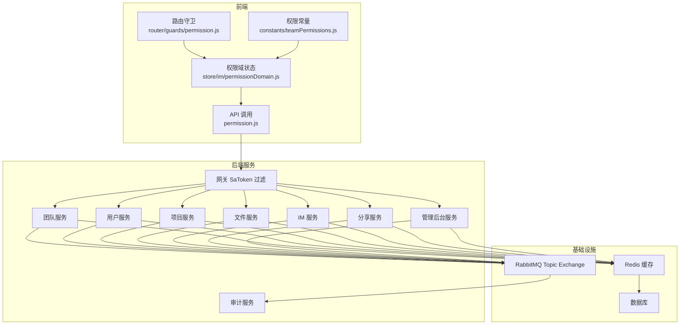
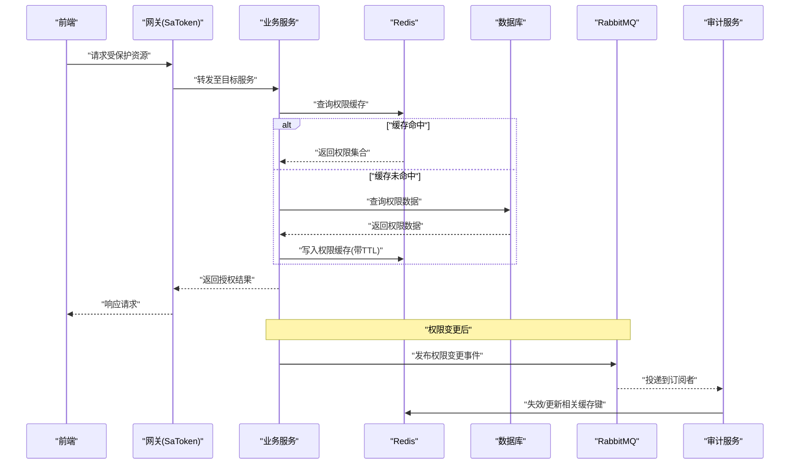
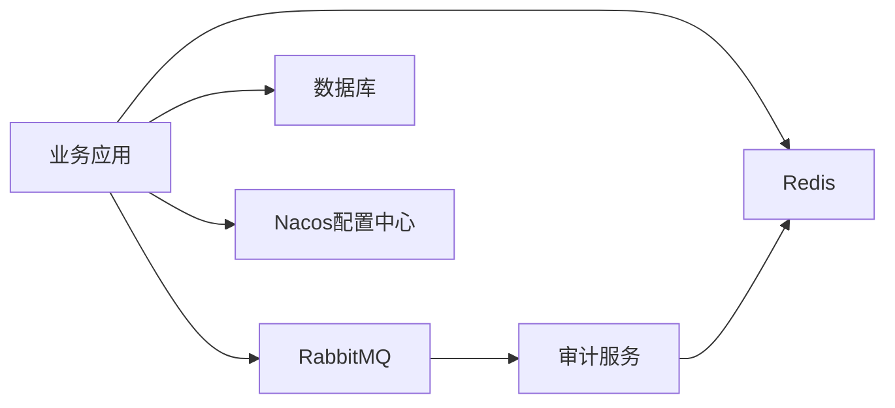

# 权限缓存策略

<cite>
**本文引用的文件**   
- [application-common.yml](file://ZXYZdatabaseBack/zxyz-common/src/main/resources/application-common.yml)
- [RabbitMqConfig.java](file://ZXYZdatabaseBack/zxyz-audit-service/src/main/java/uno/acloud/audit/config/RabbitMqConfig.java)
- [OperateLogConsumer.java](file://ZXYZdatabaseBack/zxyz-audit-service/src/main/java/uno/acloud/audit/mq/OperateLogConsumer.java)
- [AuditDlqConsumer.java](file://ZXYZdatabaseBack/zxyz-audit-service/src/main/java/uno/acloud/audit/mq/AuditDlqConsumer.java)
- [Application.java](file://ZXYZdatabaseBack/zxyz-audit-service/src/main/java/uno/acloud/audit/ZxyzAuditServiceApplication.java)
- [TeamPermissionPolicyTest.java](file://ZXYZdatabaseBack/zxyz-common/src/test/java/uno/acloud/common/TeamPermissionPolicyTest.java)
- [permission.js](file://ZXYZdatabaseFront/src/api/permission.js)
- [permission.js](file://ZXYZdatabaseFront/src/router/guards/permission.js)
- [permissionDomain.js](file://ZXYZdatabaseFront/src/store/im/permissionDomain.js)
- [teamPermissions.js](file://ZXYZdatabaseFront/src/constants/teamPermissions.js)
- [docker-compose.yml](file://docker-compose.yml)
- [zxyz-dynamic.yml](file://nacos-config/zxyz-dynamic.yml)
</cite>

## 目录
1. [引言](#引言)
2. [项目结构](#项目结构)
3. [核心组件](#核心组件)
4. [架构总览](#架构总览)
5. [详细组件分析](#详细组件分析)
6. [依赖关系分析](#依赖关系分析)
7. [性能考量](#性能考量)
8. [故障排查指南](#故障排查指南)
9. [结论](#结论)
10. [附录](#附录)

## 引言
本文件为 ZXYZ 项目的“权限缓存策略”提供系统化设计说明，覆盖 Redis 缓存的数据结构设计、键命名规范与过期策略；一致性保障（变更通知、失效机制、分布式锁）；性能优化（热点预加载、批量查询、内存管理）；并给出架构图、数据流图与监控指标定义。同时提供配置调优与故障恢复的最佳实践，帮助研发与运维团队在微服务与前端多端场景下稳定高效地实现权限控制。

## 项目结构
本项目采用微服务架构，后端包含多个独立服务模块，前端为 Vue 应用。权限相关能力分布在：
- 公共能力层：权限模型、常量与测试用例
- 审计与事件：通过 RabbitMQ 发布/订阅权限变更事件
- 网关与安全：统一鉴权入口（SaToken）
- 前端：路由守卫、状态管理与权限常量

图表来源
- [docker-compose.yml](file://docker-compose.yml)
- [zxyz-dynamic.yml](file://nacos-config/zxyz-dynamic.yml)

章节来源
- [application-common.yml](file://ZXYZdatabaseBack/zxyz-common/src/main/resources/application-common.yml)
- [docker-compose.yml](file://docker-compose.yml)

## 核心组件
- 权限数据模型与常量
  - 前端权限常量集中定义，便于前后端一致理解角色与操作粒度。
  - 团队权限策略测试用例验证权限判定逻辑的稳定性。
- 权限变更事件
  - 审计服务通过 RabbitMQ 消费操作日志，作为权限变更事件的来源之一。
  - DLQ 消费者用于处理失败消息，确保最终一致性。
- 前端权限状态
  - 路由守卫基于当前用户与资源上下文进行权限判断。
  - 权限域状态管理维护用户级与团队级权限集合，支持快速查询。
- 缓存基础设施
  - Redis 作为统一的权限缓存存储。
  - Nacos 动态配置中心用于运行时调整缓存策略参数。

章节来源
- [teamPermissions.js](file://ZXYZdatabaseFront/src/constants/teamPermissions.js)
- [TeamPermissionPolicyTest.java](file://ZXYZdatabaseBack/zxyz-common/src/test/java/uno/acloud/common/TeamPermissionPolicyTest.java)
- [OperateLogConsumer.java](file://ZXYZdatabaseBack/zxyz-audit-service/src/main/java/uno/acloud/audit/mq/OperateLogConsumer.java)
- [AuditDlqConsumer.java](file://ZXYZdatabaseBack/zxyz-audit-service/src/main/java/uno/acloud/audit/mq/AuditDlqConsumer.java)
- [permission.js](file://ZXYZdatabaseFront/src/api/permission.js)
- [permission.js](file://ZXYZdatabaseFront/src/router/guards/permission.js)
- [permissionDomain.js](file://ZXYZdatabaseFront/src/store/im/permissionDomain.js)

## 架构总览
权限缓存的整体流程包括：
- 读路径：前端发起权限检查请求 → 网关鉴权 → 目标服务从 Redis 读取权限 → 未命中则回源数据库 → 写入缓存并返回。
- 写路径：业务更新权限 → 持久化到数据库 → 发布权限变更事件 → 订阅方收到事件后失效或更新对应缓存键 → 保证一致性。
- 一致性保障：使用分布式锁避免缓存击穿；DLQ 重试与死信队列保障事件可靠投递。

图表来源
- [OperateLogConsumer.java](file://ZXYZdatabaseBack/zxyz-audit-service/src/main/java/uno/acloud/audit/mq/OperateLogConsumer.java)
- [AuditDlqConsumer.java](file://ZXYZdatabaseBack/zxyz-audit-service/src/main/java/uno/acloud/audit/mq/AuditDlqConsumer.java)
- [RabbitMqConfig.java](file://ZXYZdatabaseBack/zxyz-audit-service/src/main/java/uno/acloud/audit/config/RabbitMqConfig.java)

## 详细组件分析

### 权限数据结构与键命名规范
- 建议的权限数据结构
  - 用户维度：{userId} -> Set<permissionCode>
  - 团队维度：{teamId}:{role} -> Set<permissionCode>
  - 资源维度：{resourceType}:{resourceId} -> Map<userId, Set<permissionCode>>
  - 会话维度：{sessionId} -> {userId, teamId, permissions}
- 键命名规范
  - 前缀统一：zxyz:perm:
  - 层级清晰：user、team、resource、session
  - 分隔符使用冒号，避免特殊字符
  - 示例模式：zxyz:perm:user:{userId}、zxyz:perm:team:{teamId}:{role}、zxyz:perm:resource:{type}:{id}、zxyz:perm:session:{sessionId}
- 序列化格式
  - 使用紧凑的二进制或 JSON 序列化，减少内存占用
  - 对高频访问的权限集合使用 Set 结构，提升判空与存在性检查效率

章节来源
- [application-common.yml](file://ZXYZdatabaseBack/zxyz-common/src/main/resources/application-common.yml)

### 过期策略与缓存一致性
- TTL 策略
  - 用户级权限：短 TTL（如 5-15 分钟），配合事件失效
  - 团队级权限：中 TTL（如 15-30 分钟）
  - 资源级权限：长 TTL（如 1-4 小时），结合事件失效
  - 会话级权限：跟随会话生命周期
- 一致性机制
  - 权限变更时发布事件，订阅方执行删除或增量更新
  - 使用分布式锁防止并发刷新导致的雪崩
  - 事件幂等处理，避免重复失效
- 失效范围控制
  - 精确失效：按用户、团队、资源维度精准删除
  - 局部刷新：仅更新受影响的用户或资源集合

章节来源
- [OperateLogConsumer.java](file://ZXYZdatabaseBack/zxyz-audit-service/src/main/java/uno/acloud/audit/mq/OperateLogConsumer.java)
- [AuditDlqConsumer.java](file://ZXYZdatabaseBack/zxyz-audit-service/src/main/java/uno/acloud/audit/mq/AuditDlqConsumer.java)
- [RabbitMqConfig.java](file://ZXYZdatabaseBack/zxyz-audit-service/src/main/java/uno/acloud/audit/config/RabbitMqConfig.java)

### 缓存性能优化
- 热点数据预加载
  - 登录成功后预加载用户与团队的权限集合
  - 基于访问频率统计，动态调整预热策略
- 批量查询优化
  - 使用管道批量获取权限集合，减少网络往返
  - 合并多次小查询为大查询，降低 Redis 压力
- 内存管理策略
  - 合理设置 maxmemory 与淘汰策略（allkeys-lru）
  - 监控内存使用率，及时扩容或清理过期键
  - 使用哈希压缩与对象池减少 GC 压力

章节来源
- [application-common.yml](file://ZXYZdatabaseBack/zxyz-common/src/main/resources/application-common.yml)

### 前端权限状态管理
- 路由守卫
  - 在进入路由前检查用户是否具备所需权限
  - 无权限时重定向到拒绝页面或提示
- 权限域状态
  - 维护用户权限集合与团队权限映射
  - 支持实时更新与本地缓存
- 权限常量
  - 统一定义权限代码，避免硬编码
  - 便于前后端同步与维护

章节来源
- [permission.js](file://ZXYZdatabaseFront/src/api/permission.js)
- [permission.js](file://ZXYZdatabaseFront/src/router/guards/permission.js)
- [permissionDomain.js](file://ZXYZdatabaseFront/src/store/im/permissionDomain.js)
- [teamPermissions.js](file://ZXYZdatabaseFront/src/constants/teamPermissions.js)

### 后端权限服务集成
- 服务间调用
  - 使用 ServiceClient 进行内部服务调用
  - 通过 X-Internal-Service-Token 进行服务间鉴权
- 投影模式
  - 返回精简的 VO 对象，避免传输冗余数据
  - 调用方与提供方独立演进，解耦 DTO 结构

章节来源
- [TeamPermissionPolicyTest.java](file://ZXYZdatabaseBack/zxyz-common/src/test/java/uno/acloud/common/TeamPermissionPolicyTest.java)

## 依赖关系分析
权限缓存涉及的核心依赖：
- Redis：高性能键值存储，支撑毫秒级权限查询
- RabbitMQ：异步事件总线，实现权限变更的最终一致性
- Nacos：动态配置中心，支持运行时调整缓存策略
- 数据库：权限数据的持久化存储

图表来源
- [docker-compose.yml](file://docker-compose.yml)
- [zxyz-dynamic.yml](file://nacos-config/zxyz-dynamic.yml)

章节来源
- [Application.java](file://ZXYZdatabaseBack/zxyz-audit-service/src/main/java/uno/acloud/audit/ZxyzAuditServiceApplication.java)
- [docker-compose.yml](file://docker-compose.yml)

## 性能考量
- 缓存命中率优化
  - 监控缓存命中率，低于阈值时调整 TTL 或预热策略
  - 使用布隆过滤器预判不存在的权限，减少无效查询
- 并发控制
  - 分布式锁防止缓存击穿
  - 限流保护 Redis 不被突发流量打垮
- 内存优化
  - 合理设置 Redis 内存上限与淘汰策略
  - 定期清理过期键，避免内存泄漏

[本节为通用性能指导，无需特定文件引用]

## 故障排查指南
- 常见问题
  - 缓存穿透：使用布隆过滤器与空值缓存
  - 缓存雪崩：随机化 TTL 与分布式锁
  - 数据不一致：检查事件投递与消费逻辑
- 监控指标
  - 缓存命中率、延迟、内存使用率
  - 事件投递成功率、消费延迟、DLQ 积压量
- 恢复策略
  - 自动重试与人工干预相结合
  - 灰度发布与快速回滚机制

章节来源
- [OperateLogConsumer.java](file://ZXYZdatabaseBack/zxyz-audit-service/src/main/java/uno/acloud/audit/mq/OperateLogConsumer.java)
- [AuditDlqConsumer.java](file://ZXYZdatabaseBack/zxyz-audit-service/src/main/java/uno/acloud/audit/mq/AuditDlqConsumer.java)

## 结论
ZXYZ 项目的权限缓存策略通过 Redis 提供高性能的权限查询能力，结合 RabbitMQ 实现最终一致性，利用 Nacos 支持动态配置调整。通过合理的缓存结构设计、一致性保障机制与性能优化策略，系统在微服务架构下能够稳定高效地处理权限控制需求。建议持续监控关键指标，及时调整策略以应对业务变化。

[本节为总结性内容，无需特定文件引用]

## 附录
- 配置调优建议
  - Redis 连接池大小与超时时间
  - RabbitMQ 队列长度与重试策略
  - Nacos 配置热更新与版本管理
- 最佳实践
  - 权限变更事件的最小化设计
  - 缓存键的生命周期管理
  - 监控告警与自动化修复

[本节为补充信息，无需特定文件引用]