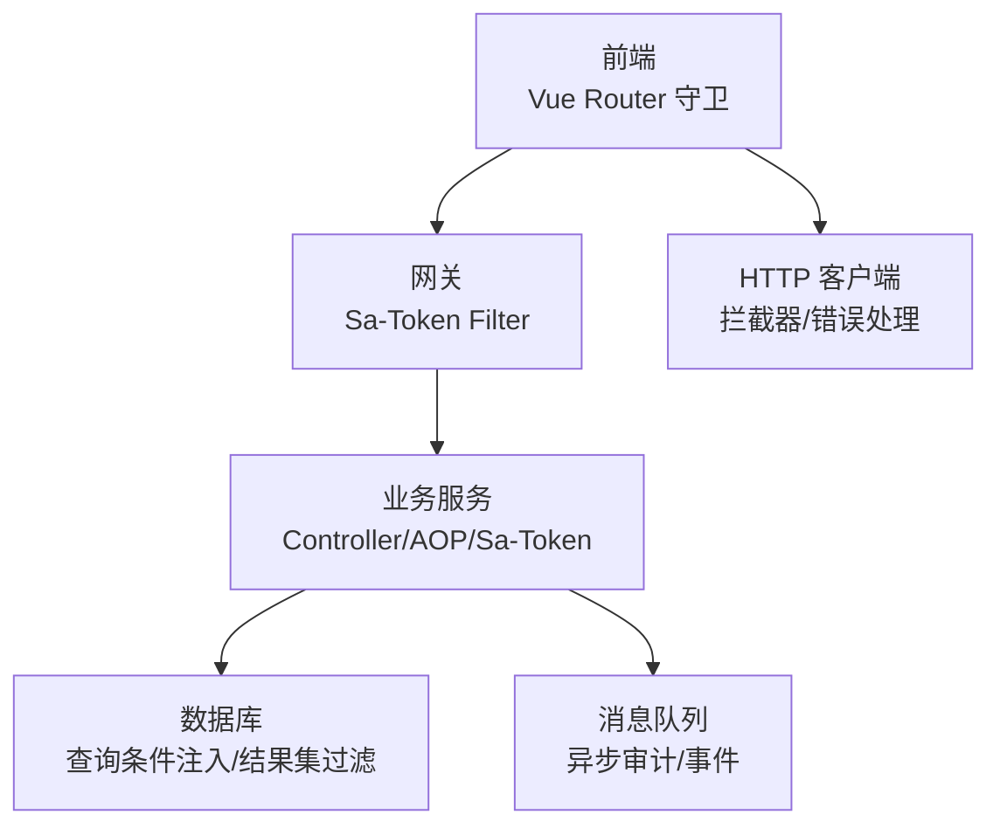
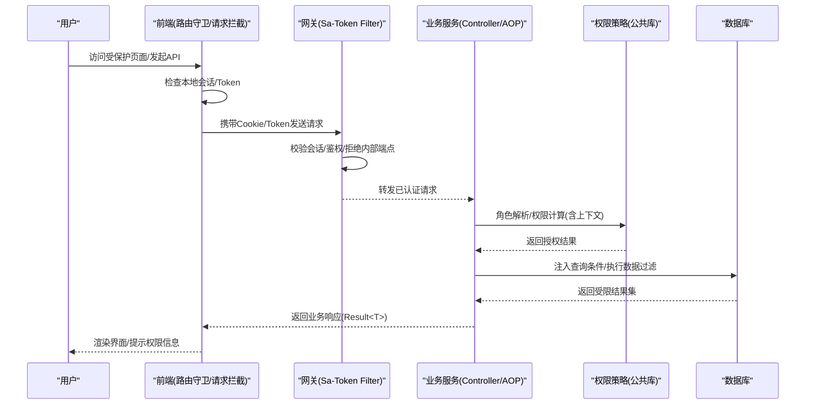
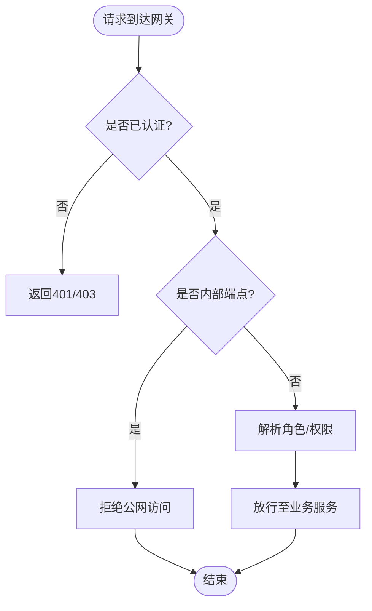
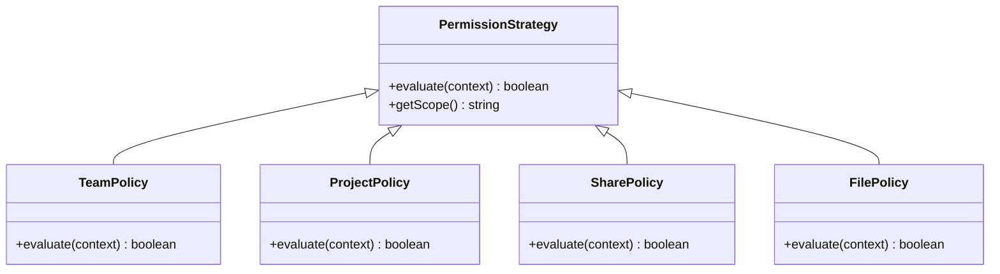
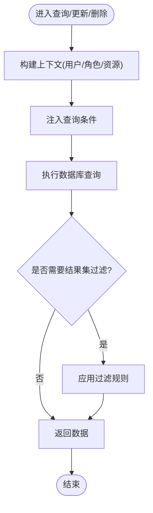
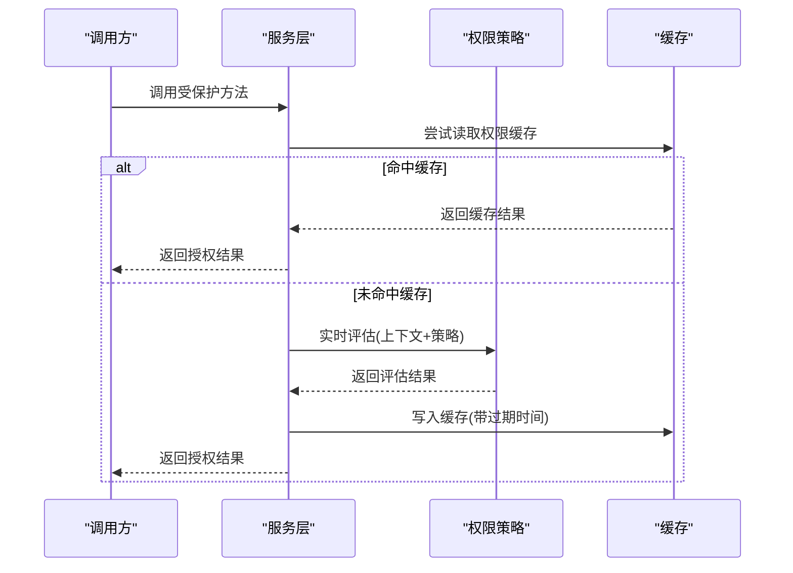
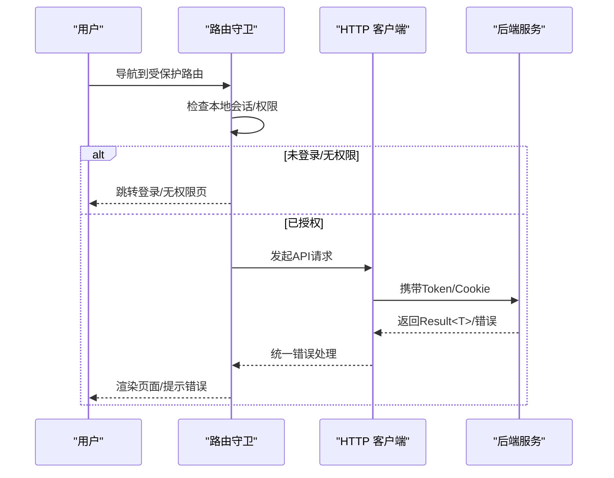
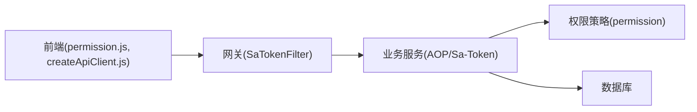

# 权限验证流程

<cite>
**本文引用的文件**
- [SaTokenConfigure.java](file://ZXYZdatabaseBack/zxyz-admin-service/src/main/java/uno/acloud/admin/config/SaTokenConfigure.java)
- [application.yml](file://ZXYZdatabaseBack/zxyz-admin-service/src/main/resources/application.yml)
- [application-dev.yml](file://ZXYZdatabaseBack/zxyz-admin-service/src/main/resources/application-dev.yml)
- [application-prod.yml](file://ZXYZdatabaseBack/zxyz-admin-service/src/main/resources/application-prod.yml)
- [SaTokenFilterConfigTest.java](file://ZXYZdatabaseBack/zxyz-gateway/src/test/java/uno/acloud/gateway/filter/SaTokenFilterConfigTest.java)
- [permission.js](file://ZXYZdatabaseFront/src/router/guards/permission.js)
- [auth.js](file://ZXYZdatabaseFront/src/utils/auth.js)
- [createApiClient.js](file://ZXYZdatabaseFront/src/utils/createApiClient.js)
- [request.js](file://ZXYZdatabaseFront/src/utils/request.js)
- [TeamPermissionPolicyTest.java](file://ZXYZdatabaseBack/zxyz-common/src/test/java/uno/acloud/common/TeamPermissionPolicyTest.java)
- [permission](file://ZXYZdatabaseBack/zxyz-common/src/main/java/uno/acloud/common/permission)
- [team](file://ZXYZdatabaseBack/zxyz-team-service/src/main/java/uno/acloud/team/satoken)
- [project](file://ZXYZdatabaseBack/zxyz-project-service/src/main/java/uno/acloud/project/aop)
- [share](file://ZXYZdatabaseBack/zxyz-share-service/src/main/java/uno/acloud/share/aop)
- [user](file://ZXYZdatabaseBack/zxyz-user-service/src/main/java/uno/acloud/user/satoken)
- [file](file://ZXYZdatabaseBack/zxyz-file-service/src/main/java/uno/acloud/file/aop)
- [email](file://ZXYZdatabaseBack/zxyz-email-service/src/main/java/uno/acloud/email/application)
- [im](file://ZXYZdatabaseBack/zxyz-im-service/src/main/java/uno/acloud/im/application)
</cite>

## 目录
1. [简介](#简介)
2. [项目结构](#项目结构)
3. [核心组件](#核心组件)
4. [架构总览](#架构总览)
5. [详细组件分析](#详细组件分析)
6. [依赖分析](#依赖分析)
7. [性能考虑](#性能考虑)
8. [故障排查指南](#故障排查指南)
9. [结论](#结论)
10. [附录](#附录)

## 简介
本文件面向 ZXYZ 项目的权限验证体系，覆盖接口调用时的请求拦截、角色解析、权限计算与结果缓存；数据级权限过滤（查询条件注入、结果集过滤、批量操作检查）；以及动态权限计算（实时评估、上下文感知、策略模式）。文档同时提供时序图、流程图、性能优化策略、测试方法与故障排查指南，帮助开发者快速理解并正确扩展权限能力。

## 项目结构
ZXYZ 采用微服务架构，前端为 Vue 3 + Element Plus，后端包含多个独立服务模块。权限相关的关键位置：
- 网关层：Sa-Token 过滤器统一拦截外部请求，拒绝公网访问内部端点。
- 公共库：权限模型与策略定义位于 zxyz-common 的 permission 包。
- 业务服务：各服务通过 AOP/注解或 Sa-Token 集成进行鉴权与数据权限控制。
- 前端：路由守卫与 HTTP 客户端封装负责登录态维护与权限提示。

[无图表来源：该图为概念性结构示意]

## 核心组件
- 网关 Sa-Token 过滤器：统一校验会话、鉴权、拒绝内部端点公网访问。
- 服务侧 Sa-Token 配置：加载认证参数、会话存储、角色/权限解析策略。
- 权限策略与模型：在公共库中定义团队/项目等域对象的权限模型与策略接口。
- 业务服务 AOP/注解：在各服务中对控制器方法或领域应用层方法进行权限校验与数据权限注入。
- 前端路由守卫与请求拦截：基于 Cookie/Session 维持登录态，并在路由切换时执行权限判断。

章节来源
- [SaTokenConfigure.java](file://ZXYZdatabaseBack/zxyz-admin-service/src/main/java/uno/acloud/admin/config/SaTokenConfigure.java)
- [application.yml](file://ZXYZdatabaseBack/zxyz-admin-service/src/main/resources/application.yml)
- [application-dev.yml](file://ZXYZdatabaseBack/zxyz-admin-service/src/main/resources/application-dev.yml)
- [application-prod.yml](file://ZXYZdatabaseBack/zxyz-admin-service/src/main/resources/application-prod.yml)
- [SaTokenFilterConfigTest.java](file://ZXYZdatabaseBack/zxyz-gateway/src/test/java/uno/acloud/gateway/filter/SaTokenFilterConfigTest.java)
- [permission.js](file://ZXYZdatabaseFront/src/router/guards/permission.js)
- [auth.js](file://ZXYZdatabaseFront/src/utils/auth.js)
- [createApiClient.js](file://ZXYZdatabaseFront/src/utils/createApiClient.js)
- [request.js](file://ZXYZdatabaseFront/src/utils/request.js)

## 架构总览
下图展示一次受保护接口的完整调用链路，从前端路由守卫到网关鉴权，再到服务侧权限计算与数据过滤。

图表来源
- [SaTokenFilterConfigTest.java](file://ZXYZdatabaseBack/zxyz-gateway/src/test/java/uno/acloud/gateway/filter/SaTokenFilterConfigTest.java)
- [permission.js](file://ZXYZdatabaseFront/src/router/guards/permission.js)
- [createApiClient.js](file://ZXYZdatabaseFront/src/utils/createApiClient.js)
- [TeamPermissionPolicyTest.java](file://ZXYZdatabaseBack/zxyz-common/src/test/java/uno/acloud/common/TeamPermissionPolicyTest.java)

## 详细组件分析

### 网关层：请求拦截与角色解析
- 拦截入口：网关 Sa-Token Filter 对每个请求进行会话校验与鉴权。
- 内部端点防护：/api/internal/** 被明确拒绝公网访问，仅允许内网调用。
- 角色解析：从会话中提取用户标识与角色集合，供下游服务使用。
- 失败处理：未认证或无权限时直接返回统一错误码，避免进入业务服务。

图表来源
- [SaTokenFilterConfigTest.java](file://ZXYZdatabaseBack/zxyz-gateway/src/test/java/uno/acloud/gateway/filter/SaTokenFilterConfigTest.java)

章节来源
- [SaTokenFilterConfigTest.java](file://ZXYZdatabaseBack/zxyz-gateway/src/test/java/uno/acloud/gateway/filter/SaTokenFilterConfigTest.java)

### 服务层：权限计算与结果缓存
- 权限计算：服务侧通过 Sa-Token 配置与自定义策略实现角色/权限判定，支持上下文感知（如团队、项目、资源ID）。
- 结果缓存：对高频权限判定结果进行缓存（例如按用户+资源维度），减少重复计算。
- 策略模式：将不同域（团队、项目、分享、文件等）的权限规则抽象为策略，便于扩展与维护。

图表来源
- [permission](file://ZXYZdatabaseBack/zxyz-common/src/main/java/uno/acloud/common/permission)
- [TeamPermissionPolicyTest.java](file://ZXYZdatabaseBack/zxyz-common/src/test/java/uno/acloud/common/TeamPermissionPolicyTest.java)

章节来源
- [TeamPermissionPolicyTest.java](file://ZXYZdatabaseBack/zxyz-common/src/test/java/uno/acloud/common/TeamPermissionPolicyTest.java)
- [permission](file://ZXYZdatabaseBack/zxyz-common/src/main/java/uno/acloud/common/permission)

### 数据级权限过滤：查询条件注入与结果集过滤
- 查询条件注入：在 Service/Mapper 层根据当前用户角色与资源上下文动态追加 WHERE 条件（如 team_id、owner_id）。
- 结果集过滤：对返回列表进行二次过滤，确保不越权暴露敏感数据。
- 批量操作检查：在执行批量更新/删除前，先校验每条记录的权限，防止批量越权。

[无图表来源：该图为通用数据过滤流程示意]

章节来源
- [team](file://ZXYZdatabaseBack/zxyz-team-service/src/main/java/uno/acloud/team/satoken)
- [project](file://ZXYZdatabaseBack/zxyz-project-service/src/main/java/uno/acloud/project/aop)
- [share](file://ZXYZdatabaseBack/zxyz-share-service/src/main/java/uno/acloud/share/aop)
- [file](file://ZXYZdatabaseBack/zxyz-file-service/src/main/java/uno/acloud/file/aop)

### 动态权限计算：实时评估与上下文感知
- 实时评估：每次请求都基于最新上下文（如成员变更、共享状态）重新计算权限，避免陈旧缓存导致越权。
- 上下文感知：结合团队、项目、分享、文件等多维上下文进行综合判定。
- 策略模式应用：通过策略接口统一权限评估入口，新增规则只需实现新策略。

图表来源
- [TeamPermissionPolicyTest.java](file://ZXYZdatabaseBack/zxyz-common/src/test/java/uno/acloud/common/TeamPermissionPolicyTest.java)
- [permission](file://ZXYZdatabaseBack/zxyz-common/src/main/java/uno/acloud/common/permission)

章节来源
- [TeamPermissionPolicyTest.java](file://ZXYZdatabaseBack/zxyz-common/src/test/java/uno/acloud/common/TeamPermissionPolicyTest.java)
- [permission](file://ZXYZdatabaseBack/zxyz-common/src/main/java/uno/acloud/common/permission)

### 前端：路由守卫与请求拦截
- 路由守卫：在进入受保护路由前检查本地会话与权限，必要时跳转登录或无权限页。
- 请求拦截：在 HTTP 客户端中附加 Token/Cookie，处理统一响应结构与错误提示。
- 权限提示：根据后端返回的错误码与消息，向用户反馈具体原因。

图表来源
- [permission.js](file://ZXYZdatabaseFront/src/router/guards/permission.js)
- [createApiClient.js](file://ZXYZdatabaseFront/src/utils/createApiClient.js)
- [request.js](file://ZXYZdatabaseFront/src/utils/request.js)
- [auth.js](file://ZXYZdatabaseFront/src/utils/auth.js)

章节来源
- [permission.js](file://ZXYZdatabaseFront/src/router/guards/permission.js)
- [createApiClient.js](file://ZXYZdatabaseFront/src/utils/createApiClient.js)
- [request.js](file://ZXYZdatabaseFront/src/utils/request.js)
- [auth.js](file://ZXYZdatabaseFront/src/utils/auth.js)

## 依赖分析
- 网关依赖 Sa-Token 过滤器与配置文件，确保统一鉴权与内部端点防护。
- 业务服务依赖权限策略与 Sa-Token 配置，实现细粒度权限控制。
- 前端依赖路由守卫与 HTTP 客户端，保证登录态与权限提示的一致性。

图表来源
- [permission.js](file://ZXYZdatabaseFront/src/router/guards/permission.js)
- [createApiClient.js](file://ZXYZdatabaseFront/src/utils/createApiClient.js)
- [SaTokenFilterConfigTest.java](file://ZXYZdatabaseBack/zxyz-gateway/src/test/java/uno/acloud/gateway/filter/SaTokenFilterConfigTest.java)
- [permission](file://ZXYZdatabaseBack/zxyz-common/src/main/java/uno/acloud/common/permission)

章节来源
- [permission.js](file://ZXYZdatabaseFront/src/router/guards/permission.js)
- [createApiClient.js](file://ZXYZdatabaseFront/src/utils/createApiClient.js)
- [SaTokenFilterConfigTest.java](file://ZXYZdatabaseBack/zxyz-gateway/src/test/java/uno/acloud/gateway/filter/SaTokenFilterConfigTest.java)
- [permission](file://ZXYZdatabaseBack/zxyz-common/src/main/java/uno/acloud/common/permission)

## 性能考虑
- 缓存策略：对高频权限判定结果进行缓存，设置合理过期时间与失效策略（如资源变更时主动失效）。
- 条件注入优化：在 SQL 层尽可能利用索引与预编译，减少全表扫描。
- 批量操作优化：分批校验与提交，避免长事务与锁竞争。
- 前端缓存：对只读权限信息进行短期缓存，减少重复请求。

[本节为通用性能建议，无需特定文件来源]

## 故障排查指南
- 网关鉴权失败：检查 Sa-Token 过滤器配置与会话存储，确认 Cookie/Token 是否正确传递。
- 权限计算异常：定位权限策略实现，打印上下文参数，验证策略逻辑是否符合预期。
- 数据过滤问题：检查查询条件注入逻辑与结果集过滤规则，确认是否遗漏必要字段。
- 前端权限提示：查看路由守卫与 HTTP 客户端错误处理，确认错误码映射与用户提示。

章节来源
- [SaTokenConfigure.java](file://ZXYZdatabaseBack/zxyz-admin-service/src/main/java/uno/acloud/admin/config/SaTokenConfigure.java)
- [application.yml](file://ZXYZdatabaseBack/zxyz-admin-service/src/main/resources/application.yml)
- [application-dev.yml](file://ZXYZdatabaseBack/zxyz-admin-service/src/main/resources/application-dev.yml)
- [application-prod.yml](file://ZXYZdatabaseBack/zxyz-admin-service/src/main/resources/application-prod.yml)
- [permission.js](file://ZXYZdatabaseFront/src/router/guards/permission.js)
- [createApiClient.js](file://ZXYZdatabaseFront/src/utils/createApiClient.js)
- [request.js](file://ZXYZdatabaseFront/src/utils/request.js)
- [auth.js](file://ZXYZdatabaseFront/src/utils/auth.js)

## 结论
ZXYZ 项目的权限验证体系以网关统一拦截为基础，结合服务侧策略化权限计算与数据级过滤，实现了高内聚、可扩展的权限控制。通过缓存与上下文感知，系统在保障安全性的同时兼顾了性能与可维护性。建议持续完善策略覆盖范围与测试用例，确保权限行为的一致性与可追溯性。

[本节为总结性内容，无需特定文件来源]

## 附录
- 测试方法：针对权限策略编写单元测试与集成测试，覆盖正常路径与边界条件。
- 监控与审计：结合审计日志与指标监控，追踪权限判定耗时与失败率。
- 最佳实践：遵循最小权限原则，定期审查权限策略与数据过滤规则。

[本节为通用指导，无需特定文件来源]