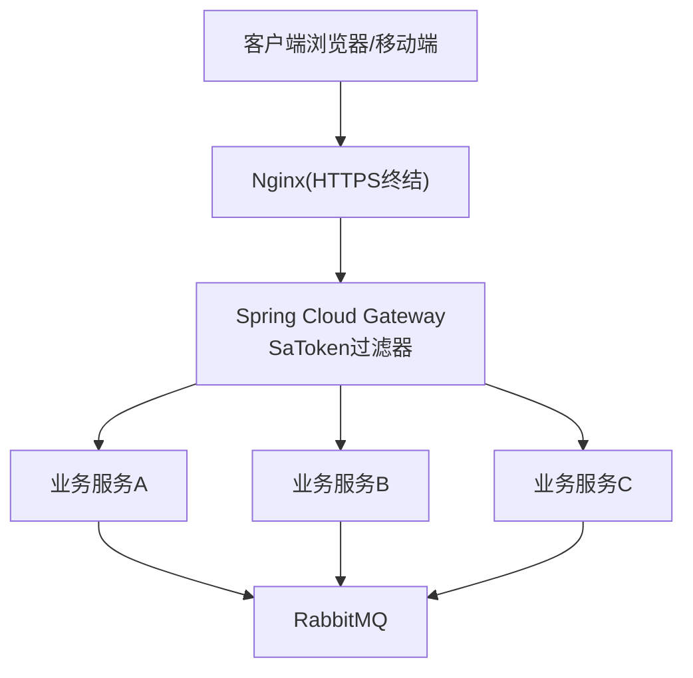
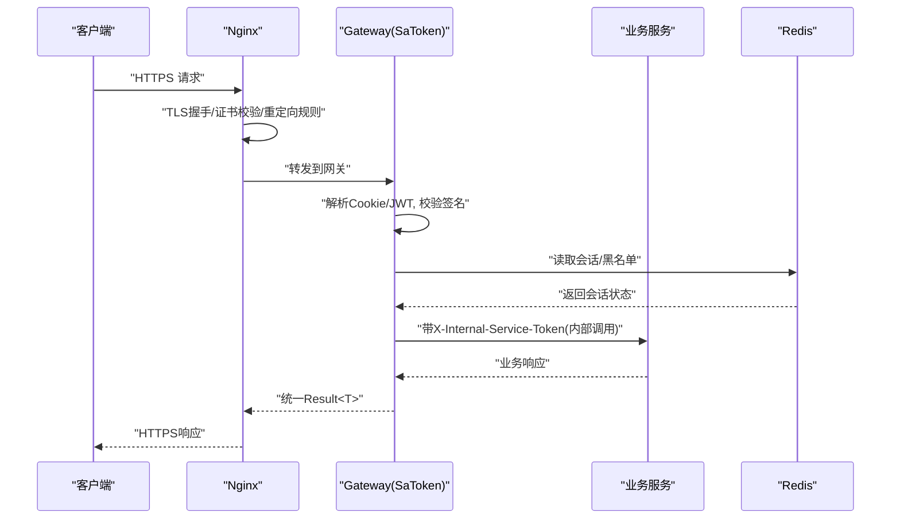
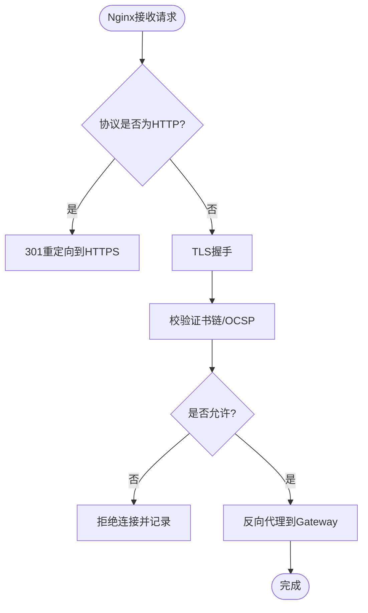
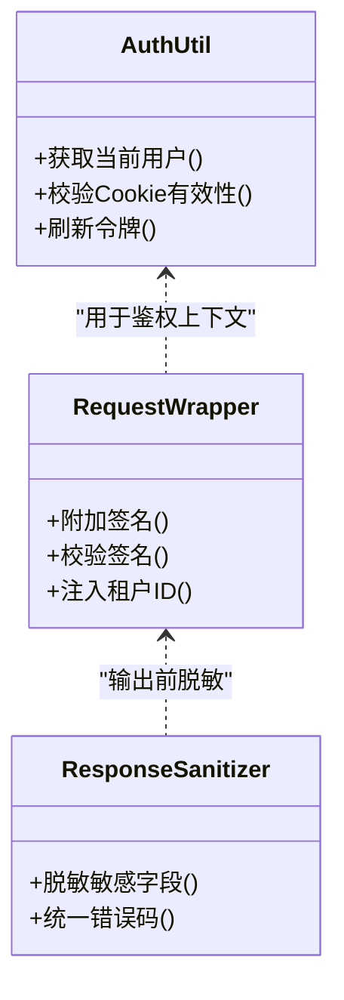
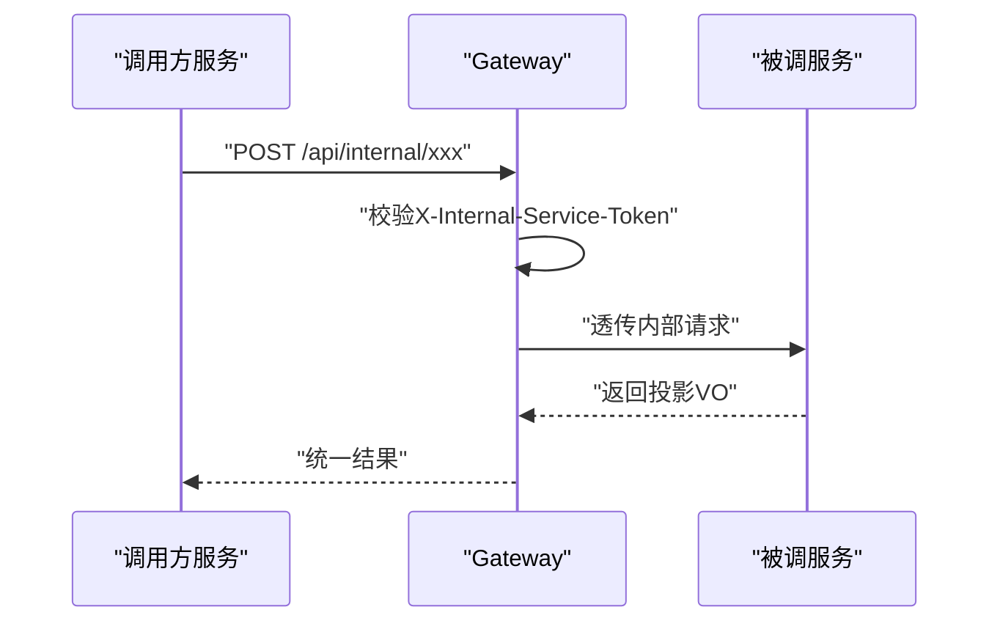
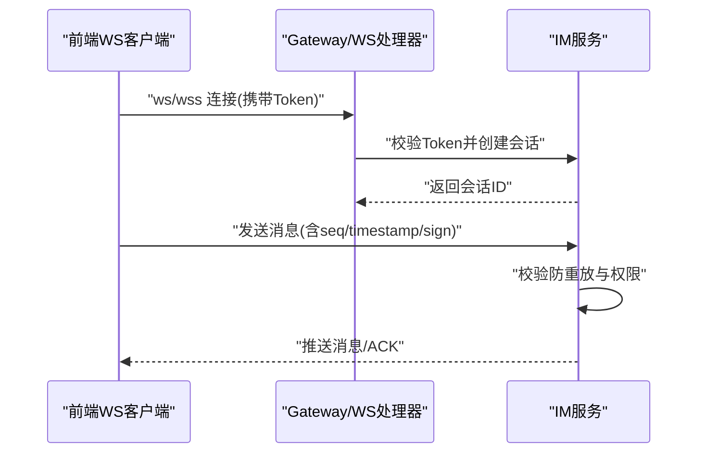
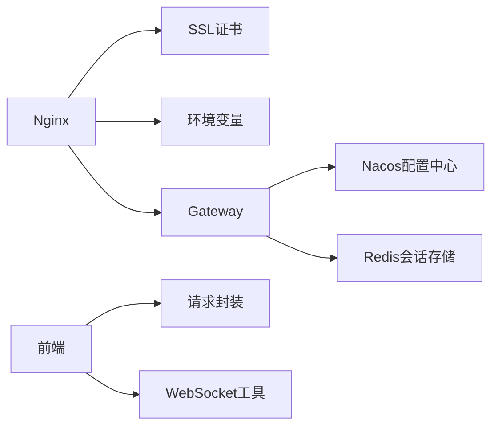

# 数据传输安全

<cite>
**本文引用的文件**   
- [zxyz-gateway.yml](file://nacos-config/zxyz-gateway.yml)
- [application.yml](file://ZXYZdatabaseBack/zxyz-gateway/src/main/resources/application.yml)
- [SaTokenFilterConfigTest.java](file://ZXYZdatabaseBack/zxyz-gateway/src/test/java/uno/acloud/gateway/filter/SaTokenFilterConfigTest.java)
- [default.conf](file://deploy/nginx/default.conf)
- [entrypoint.sh](file://deploy/nginx/entrypoint.sh)
- [docker-compose.yml](file://docker-compose.yml)
- [application-common.yml](file://ZXYZdatabaseBack/zxyz-common/src/main/resources/application-common.yml)
- [auth.js](file://ZXYZdatabaseFront/src/utils/auth.js)
- [request.js](file://ZXYZdatabaseFront/src/utils/request.js)
- [imWebSocket.js](file://ZXYZdatabaseFront/src/utils/imWebSocket.js)
- [createApiClient.js](file://ZXYZdatabaseFront/src/utils/createApiClient.js)
- [api-contract.md](file://docs/api-contract.md)
- [architecture.md](file://docs/architecture.md)
</cite>

## 目录
1. [简介](#简介)
2. [项目结构](#项目结构)
3. [核心组件](#核心组件)
4. [架构总览](#架构总览)
5. [详细组件分析](#详细组件分析)
6. [依赖关系分析](#依赖关系分析)
7. [性能考虑](#性能考虑)
8. [故障排查指南](#故障排查指南)
9. [结论](#结论)
10. [附录](#附录)

## 简介
本文件面向 ZXYZ 项目的数据传输安全，覆盖 HTTPS/TLS、请求响应加密、服务间通信安全、WebSocket 安全与网关鉴权等关键主题。文档基于仓库中的 Nginx 配置、Gateway 与 SaToken 集成、前端认证与 WebSocket 实现、以及部署编排进行系统性说明，并提供架构图、流程图与安全清单，帮助开发者与运维人员落地最佳实践。

## 项目结构
本项目采用微服务架构（后端 Maven 多模块 + Vue 前端），通过 Nginx 作为入口网关，Spring Cloud Gateway 承担路由与鉴权，各业务服务通过内部接口与消息队列协作。传输安全的关键位置包括：
- 边缘层：Nginx 终止 TLS、强制 HTTPS、HTTP 重定向、证书链校验
- 网关层：Spring Cloud Gateway + SaToken 过滤器统一鉴权、限流与审计
- 应用层：JWT/Cookie 会话、请求签名与脱敏、mTLS（可选）
- 前端层：HttpOnly Cookie、请求封装、WebSocket 连接与心跳



**图表来源** 
- [docker-compose.yml](file://docker-compose.yml)
- [zxyz-gateway.yml](file://nacos-config/zxyz-gateway.yml)
- [default.conf](file://deploy/nginx/default.conf)

**章节来源**
- [architecture.md](file://docs/architecture.md)
- [docker-compose.yml](file://docker-compose.yml)

## 核心组件
- Nginx 入口网关：负责 TLS 终止、HTTP→HTTPS 重定向、静态资源缓存、反向代理到后端服务。
- Spring Cloud Gateway：统一路由、跨域、鉴权（SaToken）、日志与监控。
- SaToken 认证：基于 HttpOnly Cookie + Redis 的会话管理，支持 JWT 模式与令牌刷新。
- 前端认证工具：封装请求头、Cookie 处理、错误码映射与重试策略。
- WebSocket 客户端：建立安全连接、心跳保活、断线重连与消息序列号防重放。

**章节来源**
- [zxyz-gateway.yml](file://nacos-config/zxyz-gateway.yml)
- [application.yml](file://ZXYZdatabaseBack/zxyz-gateway/src/main/resources/application.yml)
- [auth.js](file://ZXYZdatabaseFront/src/utils/auth.js)
- [request.js](file://ZXYZdatabaseFront/src/utils/request.js)
- [imWebSocket.js](file://ZXYZdatabaseFront/src/utils/imWebSocket.js)

## 架构总览
下图展示从客户端到服务的完整传输路径与安全控制点：



**图表来源** 
- [default.conf](file://deploy/nginx/default.conf)
- [zxyz-gateway.yml](file://nacos-config/zxyz-gateway.yml)
- [application.yml](file://ZXYZdatabaseBack/zxyz-gateway/src/main/resources/application.yml)

## 详细组件分析

### HTTPS 与 TLS 配置
- 证书管理：Nginx 使用外部证书文件，建议由自动化流程签发与轮换；生产环境启用 OCSP Stapling 与 HSTS。
- TLS 版本与套件：仅允许 TLSv1.2+，禁用弱套件，优先 ECDHE 系列。
- HTTP 强制重定向：所有 80 端口请求 301 重定向到 443。
- 证书链验证：服务端启用严格证书链校验，避免中间人攻击。



**图表来源** 
- [default.conf](file://deploy/nginx/default.conf)
- [entrypoint.sh](file://deploy/nginx/entrypoint.sh)

**章节来源**
- [default.conf](file://deploy/nginx/default.conf)
- [entrypoint.sh](file://deploy/nginx/entrypoint.sh)

### 请求与响应安全
- 认证方式：优先使用 HttpOnly Cookie + Redis 会话；也可启用 JWT 模式，注意短期有效与刷新机制。
- 请求签名：对敏感操作（如支付、配置变更）增加时间戳、随机数与签名，服务端校验防重放。
- 响应数据脱敏：统一 Result<T> 包装，敏感字段在服务端脱敏后再返回。
- 中间人防护：强制 HTTPS、HSTS、证书绑定（可选）、严格同源策略与 CORS 白名单。



**图表来源** 
- [auth.js](file://ZXYZdatabaseFront/src/utils/auth.js)
- [request.js](file://ZXYZdatabaseFront/src/utils/request.js)
- [createApiClient.js](file://ZXYZdatabaseFront/src/utils/createApiClient.js)

**章节来源**
- [auth.js](file://ZXYZdatabaseFront/src/utils/auth.js)
- [request.js](file://ZXYZdatabaseFront/src/utils/request.js)
- [createApiClient.js](file://ZXYZdatabaseFront/src/utils/createApiClient.js)

### 服务间通信安全
- 内部接口：以 /api/internal/** 为前缀，禁止公网访问，仅 Gateway 或可信网络可达。
- X-Internal-Service-Token：服务间调用必须携带该头部，网关与服务端共同校验来源 IP、签名与有效期。
- mTLS（可选）：在集群内网启用双向 TLS，确保服务身份与链路加密。
- 最小权限：每个服务只暴露必要接口，按角色与租户隔离。



**图表来源** 
- [zxyz-gateway.yml](file://nacos-config/zxyz-gateway.yml)
- [api-contract.md](file://docs/api-contract.md)

**章节来源**
- [zxyz-gateway.yml](file://nacos-config/zxyz-gateway.yml)
- [api-contract.md](file://docs/api-contract.md)

### WebSocket 安全
- 连接认证：首次握手携带 Token 或 Cookie，服务端校验后建立会话。
- 消息加密：在 TLS 基础上，对敏感消息可再应用应用层加密（如对称密钥）。
- 会话管理：心跳保活、超时清理、并发限制与设备绑定。
- 防重放：消息体包含递增序号或时间戳+随机数，服务端去重与过期检查。



**图表来源** 
- [imWebSocket.js](file://ZXYZdatabaseFront/src/utils/imWebSocket.js)
- [api-contract.md](file://docs/api-contract.md)

**章节来源**
- [imWebSocket.js](file://ZXYZdatabaseFront/src/utils/imWebSocket.js)
- [api-contract.md](file://docs/api-contract.md)

### 认证与授权流程（SaToken）
- 登录流程：前端提交凭证，后端校验并写入 HttpOnly Cookie，同时维护 Redis 会话。
- 鉴权流程：Gateway 拦截请求，解析 Cookie/JWT，校验签名与有效期，必要时查询 Redis。
- 权限控制：基于角色/资源/数据范围的多维授权，结合租户隔离。

```mermaid
sequenceDiagram
participant FE as "前端"
participant AUTH as "认证服务"
participant G as "Gateway(SaToken)"
participant R as "Redis"
FE->>AUTH : "POST /login"
AUTH-->>FE : "Set-Cookie : satoken=UUID; HttpOnly"
FE->>G : "后续请求(携带Cookie)"
G->>R : "校验会话/黑名单"
R-->>G : "返回状态"
G-->>FE : "放行或拒绝"
```

**图表来源** 
- [application.yml](file://ZXYZdatabaseBack/zxyz-gateway/src/main/resources/application.yml)
- [SaTokenFilterConfigTest.java](file://ZXYZdatabaseBack/zxyz-gateway/src/test/java/uno/acloud/gateway/filter/SaTokenFilterConfigTest.java)

**章节来源**
- [application.yml](file://ZXYZdatabaseBack/zxyz-gateway/src/main/resources/application.yml)
- [SaTokenFilterConfigTest.java](file://ZXYZdatabaseBack/zxyz-gateway/src/test/java/uno/acloud/gateway/filter/SaTokenFilterConfigTest.java)

## 依赖关系分析
- Nginx 依赖证书文件与环境变量，通过 entrypoint 脚本注入配置。
- Gateway 依赖 Nacos 配置中心与 Redis，SaToken 过滤器与路由规则集中管理。
- 前端依赖统一的请求封装与 WebSocket 工具，保证一致的鉴权与错误处理。



**图表来源** 
- [docker-compose.yml](file://docker-compose.yml)
- [application-common.yml](file://ZXYZdatabaseBack/zxyz-common/src/main/resources/application-common.yml)

**章节来源**
- [docker-compose.yml](file://docker-compose.yml)
- [application-common.yml](file://ZXYZdatabaseBack/zxyz-common/src/main/resources/application-common.yml)

## 性能考虑
- TLS 优化：启用会话复用、压缩开关按需开启、选择高性能套件。
- 网关层：合理设置超时与重试，避免雪崩；对静态资源在 Nginx 层缓存。
- 数据库与缓存：热点会话与令牌短生命周期，减少 Redis 压力。
- 前端：合并请求、懒加载、错误快速失败与退避重试。

[本节为通用指导，不直接分析具体文件]

## 故障排查指南
- 证书问题：检查 Nginx 证书路径、权限与链完整性；查看 Nginx 错误日志。
- 重定向异常：确认 80→443 规则生效，浏览器缓存 HSTS 导致无法回退。
- 鉴权失败：核对 Cookie/JWT 是否传递、签名是否一致、Redis 会话是否存在。
- WebSocket 断开：检查心跳间隔、服务器负载与防火墙策略。

**章节来源**
- [default.conf](file://deploy/nginx/default.conf)
- [application.yml](file://ZXYZdatabaseBack/zxyz-gateway/src/main/resources/application.yml)

## 结论
通过 Nginx 与 Gateway 的分层安全控制、SaToken 的统一鉴权、前后端一致的请求封装与 WebSocket 安全机制，ZXYZ 项目在传输层实现了端到端的机密性与完整性保障。建议在生产持续进行渗透测试与合规扫描，定期轮换证书与密钥，完善审计与告警。

[本节为总结性内容，不直接分析具体文件]

## 附录

### Nginx SSL 配置模板（要点）
- 监听 443 并启用 SSL，指定证书与私钥路径
- 仅允许 TLSv1.2+，禁用弱套件
- 启用 HSTS 与 OCSP Stapling
- 将 80 端口 301 重定向到 443
- 反向代理到后端服务，设置合理的超时与缓冲

**章节来源**
- [default.conf](file://deploy/nginx/default.conf)
- [entrypoint.sh](file://deploy/nginx/entrypoint.sh)

### SaToken 过滤器配置示例（要点）
- 启用 SaToken 过滤器，配置忽略路径与鉴权规则
- 设置 Cookie 名称、有效期与 HttpOnly
- 配置 Redis 存储与会话清理策略
- 定义内部接口白名单与来源 IP 校验

**章节来源**
- [application.yml](file://ZXYZdatabaseBack/zxyz-gateway/src/main/resources/application.yml)
- [zxyz-gateway.yml](file://nacos-config/zxyz-gateway.yml)
- [SaTokenFilterConfigTest.java](file://ZXYZdatabaseBack/zxyz-gateway/src/test/java/uno/acloud/gateway/filter/SaTokenFilterConfigTest.java)

### 安全测试用例（建议）
- 证书与 TLS：验证证书链、套件与版本、HSTS 生效
- 重定向：HTTP 请求应 301 到 HTTPS
- 鉴权：未携带 Cookie/JWT 的请求应被拒绝
- 内部接口：非 Gateway 来源访问 /api/internal/** 应被拒绝
- 签名与防重放：篡改请求体或重复提交应被拒绝
- WebSocket：无 Token 连接应被拒绝，心跳超时应断开
- 响应脱敏：敏感字段不应明文返回

[本节为通用指导，不直接分析具体文件]