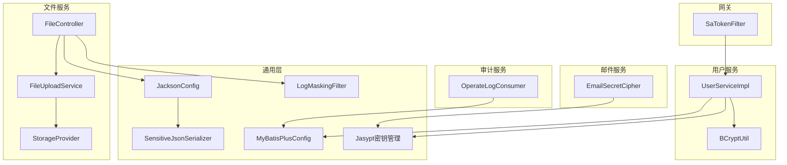
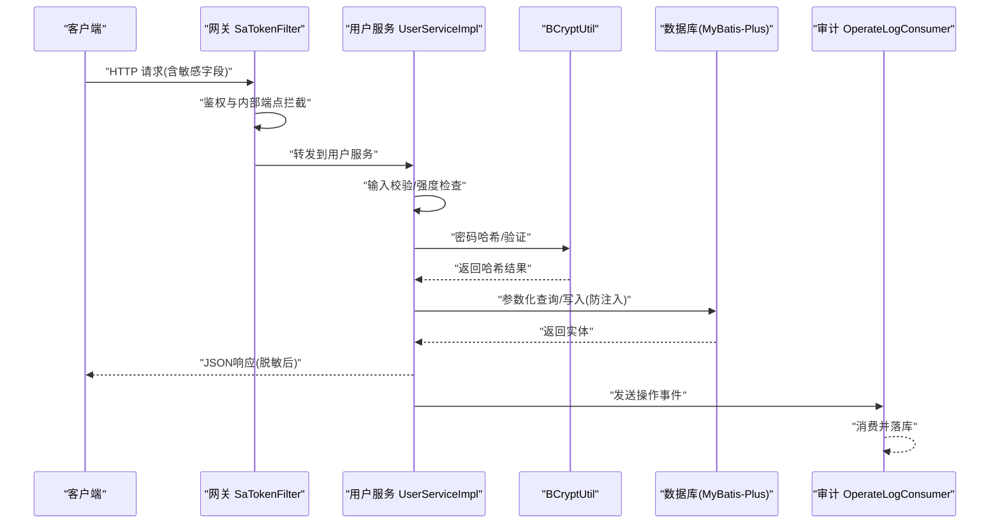
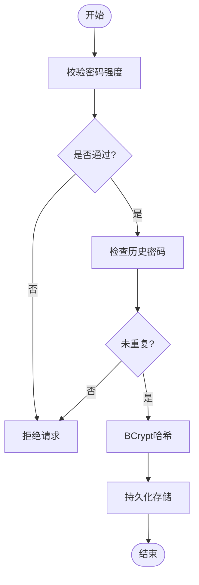
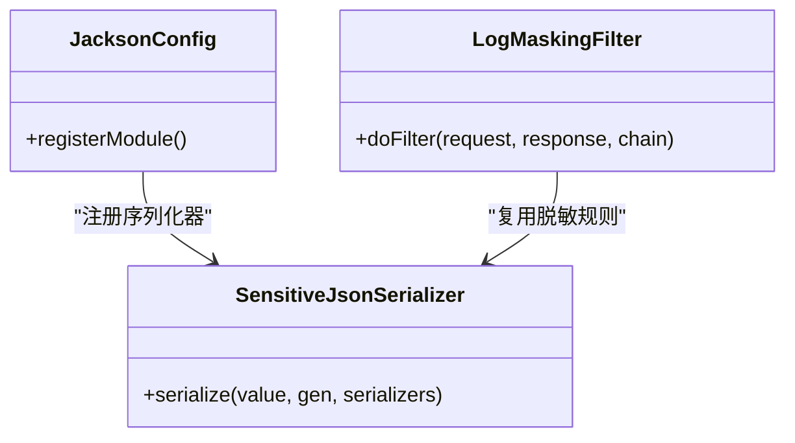
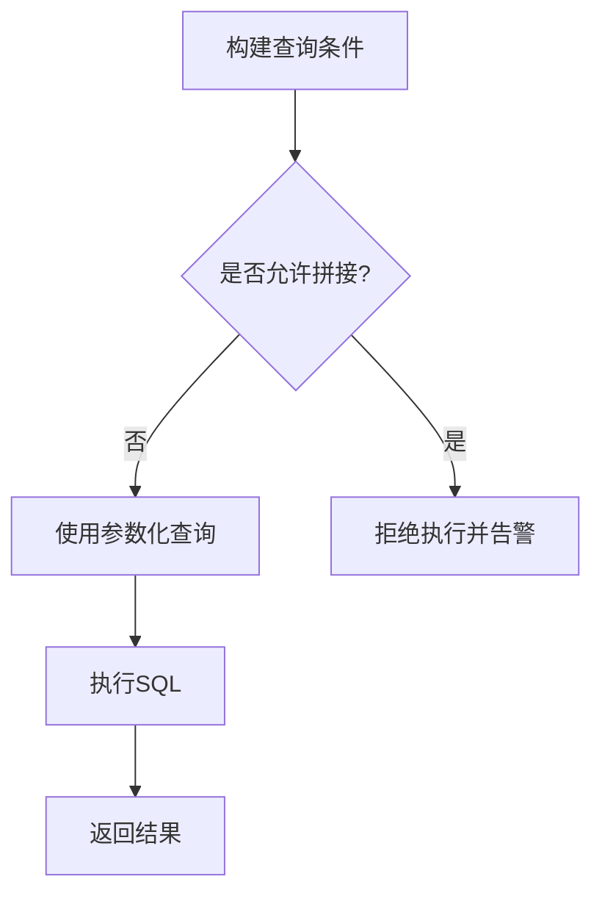
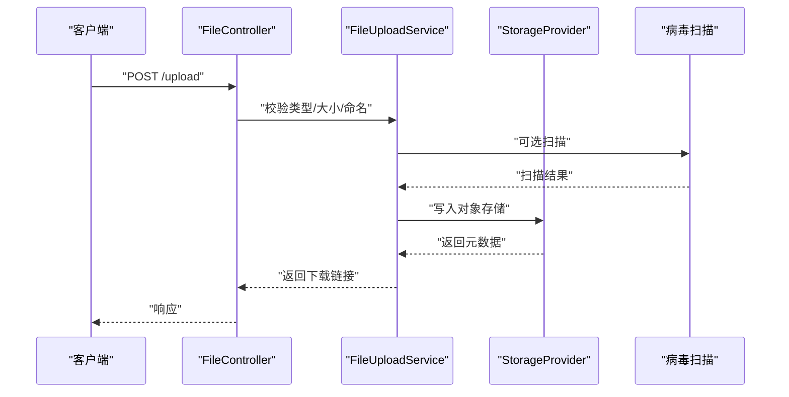
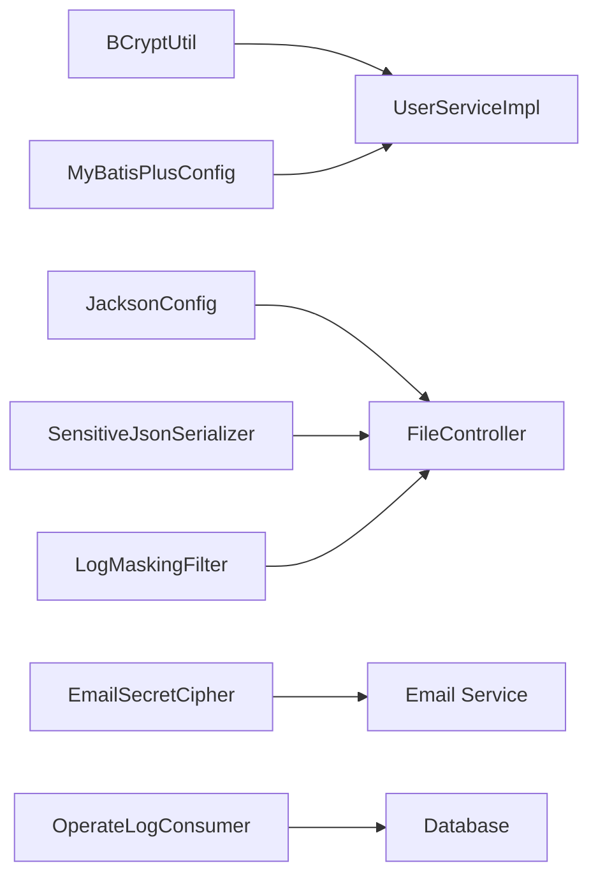

# 数据存储安全

<cite>
**本文引用的文件**   
- [zxyz-user-service/src/main/java/uno/acloud/user/service/impl/UserServiceImpl.java](file://ZXYZdatabaseBack/zxyz-user-service/src/main/java/uno/acloud/user/service/impl/UserServiceImpl.java)
- [zxyz-common/src/main/java/uno/acloud/common/util/BCryptUtil.java](file://ZXYZdatabaseBack/zxyz-common/src/main/java/uno/acloud/common/util/BCryptUtil.java)
- [zxyz-common/src/main/java/uno/acloud/common/web/SensitiveJsonSerializer.java](file://ZXYZdatabaseBack/zxyz-common/src/main/java/uno/acloud/common/web/SensitiveJsonSerializer.java)
- [zxyz-common/src/main/java/uno/acloud/common/config/JacksonConfig.java](file://ZXYZdatabaseBack/zxyz-common/src/main/java/uno/acloud/common/config/JacksonConfig.java)
- [zxyz-common/src/main/java/uno/acloud/common/config/LogMaskingFilter.java](file://ZXYZdatabaseBack/zxyz-common/src/main/java/uno/acloud/common/config/LogMaskingFilter.java)
- [zxyz-common/src/main/java/uno/acloud/common/config/MyBatisPlusConfig.java](file://ZXYZdatabaseBack/zxyz-common/src/main/java/uno/acloud/common/config/MyBatisPlusConfig.java)
- [ZXYZdatabaseBack/zxyz-file-service/src/main/java/uno/acloud/file/controller/FileController.java](file://ZXYZdatabaseBack/zxyz-file-service/src/main/java/uno/acloud/file/controller/FileController.java)
- [ZXYZdatabaseBack/zxyz-file-service/src/main/java/uno/acloud/file/service/impl/FileUploadService.java](file://ZXYZdatabaseBack/zxyz-file-service/src/main/java/uno/acloud/file/service/impl/FileUploadService.java)
- [ZXYZdatabaseBack/zxyz-file-service/src/main/java/uno/acloud/file/storage/StorageProvider.java](file://ZXYZdatabaseBack/zxyz-file-service/src/main/java/uno/acloud/file/storage/StorageProvider.java)
- [ZXYZdatabaseBack/zxyz-file-service/src/main/resources/application.yml](file://ZXYZdatabaseBack/zxyz-file-service/src/main/resources/application.yml)
- [ZXYZdatabaseBack/zxyz-email-service/src/main/java/uno/acloud/email/application/EmailSecretCipher.java](file://ZXYZdatabaseBack/zxyz-email-service/src/main/java/uno/acloud/email/application/EmailSecretCipher.java)
- [ZXYZdatabaseBack/zxyz-audit-service/src/main/java/uno/acloud/audit/mq/OperateLogConsumer.java](file://ZXYZdatabaseBack/zxyz-audit-service/src/main/java/uno/acloud/audit/mq/OperateLogConsumer.java)
- [ZXYZdatabaseBack/zxyz-admin-service/src/main/java/uno/acloud/admin/config/SaTokenConfigure.java](file://ZXYZdatabaseBack/zxyz-admin-service/src/main/java/uno/acloud/admin/config/SaTokenConfigure.java)
- [ZXYZdatabaseBack/zxyz-gateway/src/main/java/uno/acloud/gateway/filter/SaTokenFilter.java](file://ZXYZdatabaseBack/zxyz-gateway/src/main/java/uno/acloud/gateway/filter/SaTokenFilter.java)
- [nacos-config/zxyz-dynamic.yml](file://nacos-config/zxyz-dynamic.yml)
- [nacos-config/zxyz-static.yml](file://nacos-config/zxyz-static.yml)
- [scripts/backup.sh](file://scripts/backup.sh)
- [docs/jasypt-key-management.md](file://docs/jasypt-key-management.md)
</cite>

## 目录
1. [引言](#引言)
2. [项目结构](#项目结构)
3. [核心组件](#核心组件)
4. [架构总览](#架构总览)
5. [详细组件分析](#详细组件分析)
6. [依赖关系分析](#依赖关系分析)
7. [性能考虑](#性能考虑)
8. [故障排查指南](#故障排查指南)
9. [结论](#结论)
10. [附录](#附录)

## 引言
本文件面向ZXYZ项目的数据存储安全，覆盖密码哈希与强度校验、敏感字段脱敏（JSON序列化、日志输出、数据库字段加密、备份保护）、数据库访问安全（SQL注入防护、参数绑定、存储过程、访问控制）、文件存储安全（上传类型校验、病毒扫描集成、下载权限控制、临时文件清理），并提供架构图、脱敏规则表、加密策略矩阵、工具类使用示例、配置模板与安全审计脚本指引。

## 项目结构
ZXYZ采用微服务架构，后端包含多个独立服务模块（用户、文件、邮件、审计、网关等），公共能力集中在 zxyz-common；前端为Vue 3应用。安全相关能力分布在：
- 用户服务：密码哈希、历史密码检查、登录鉴权
- 通用层：Jackson JSON脱敏、日志脱敏、MyBatis-Plus安全配置、Jasypt密钥管理
- 文件服务：上传校验、下载鉴权、存储提供者抽象
- 邮件服务：敏感信息加解密
- 审计服务：操作日志消费与落库
- 网关与管理端：Sa-Token统一鉴权与内部接口拦截

图表来源 
- [zxyz-user-service/src/main/java/uno/acloud/user/service/impl/UserServiceImpl.java](file://ZXYZdatabaseBack/zxyz-user-service/src/main/java/uno/acloud/user/service/impl/UserServiceImpl.java)
- [zxyz-common/src/main/java/uno/acloud/common/util/BCryptUtil.java](file://ZXYZdatabaseBack/zxyz-common/src/main/java/uno/acloud/common/util/BCryptUtil.java)
- [zxyz-common/src/main/java/uno/acloud/common/config/JacksonConfig.java](file://ZXYZdatabaseBack/zxyz-common/src/main/java/uno/acloud/common/config/JacksonConfig.java)
- [zxyz-common/src/main/java/uno/acloud/common/web/SensitiveJsonSerializer.java](file://ZXYZdatabaseBack/zxyz-common/src/main/java/uno/acloud/common/web/SensitiveJsonSerializer.java)
- [zxyz-common/src/main/java/uno/acloud/common/config/LogMaskingFilter.java](file://ZXYZdatabaseBack/zxyz-common/src/main/java/uno/acloud/common/config/LogMaskingFilter.java)
- [zxyz-common/src/main/java/uno/acloud/common/config/MyBatisPlusConfig.java](file://ZXYZdatabaseBack/zxyz-common/src/main/java/uno/acloud/common/config/MyBatisPlusConfig.java)
- [ZXYZdatabaseBack/zxyz-file-service/src/main/java/uno/acloud/file/controller/FileController.java](file://ZXYZdatabaseBack/zxyz-file-service/src/main/java/uno/acloud/file/controller/FileController.java)
- [ZXYZdatabaseBack/zxyz-file-service/src/main/java/uno/acloud/file/service/impl/FileUploadService.java](file://ZXYZdatabaseBack/zxyz-file-service/src/main/java/uno/acloud/file/service/impl/FileUploadService.java)
- [ZXYZdatabaseBack/zxyz-file-service/src/main/java/uno/acloud/file/storage/StorageProvider.java](file://ZXYZdatabaseBack/zxyz-file-service/src/main/java/uno/acloud/file/storage/StorageProvider.java)
- [ZXYZdatabaseBack/zxyz-email-service/src/main/java/uno/acloud/email/application/EmailSecretCipher.java](file://ZXYZdatabaseBack/zxyz-email-service/src/main/java/uno/acloud/email/application/EmailSecretCipher.java)
- [ZXYZdatabaseBack/zxyz-audit-service/src/main/java/uno/acloud/audit/mq/OperateLogConsumer.java](file://ZXYZdatabaseBack/zxyz-audit-service/src/main/java/uno/acloud/audit/mq/OperateLogConsumer.java)

章节来源
- [ZXYZdatabaseBack/zxyz-user-service/src/main/java/uno/acloud/user/service/impl/UserServiceImpl.java](file://ZXYZdatabaseBack/zxyz-user-service/src/main/java/uno/acloud/user/service/impl/UserServiceImpl.java)
- [ZXYZdatabaseBack/zxyz-common/src/main/java/uno/acloud/common/util/BCryptUtil.java](file://ZXYZdatabaseBack/zxyz-common/src/main/java/uno/acloud/common/util/BCryptUtil.java)
- [ZXYZdatabaseBack/zxyz-common/src/main/java/uno/acloud/common/config/JacksonConfig.java](file://ZXYZdatabaseBack/zxyz-common/src/main/java/uno/acloud/common/config/JacksonConfig.java)
- [ZXYZdatabaseBack/zxyz-common/src/main/java/uno/acloud/common/web/SensitiveJsonSerializer.java](file://ZXYZdatabaseBack/zxyz-common/src/main/java/uno/acloud/common/web/SensitiveJsonSerializer.java)
- [ZXYZdatabaseBack/zxyz-common/src/main/java/uno/acloud/common/config/LogMaskingFilter.java](file://ZXYZdatabaseBack/zxyz-common/src/main/java/uno/acloud/common/config/LogMaskingFilter.java)
- [ZXYZdatabaseBack/zxyz-common/src/main/java/uno/acloud/common/config/MyBatisPlusConfig.java](file://ZXYZdatabaseBack/zxyz-common/src/main/java/uno/acloud/common/config/MyBatisPlusConfig.java)
- [ZXYZdatabaseBack/zxyz-file-service/src/main/java/uno/acloud/file/controller/FileController.java](file://ZXYZdatabaseBack/zxyz-file-service/src/main/java/uno/acloud/file/controller/FileController.java)
- [ZXYZdatabaseBack/zxyz-file-service/src/main/java/uno/acloud/file/service/impl/FileUploadService.java](file://ZXYZdatabaseBack/zxyz-file-service/src/main/java/uno/acloud/file/service/impl/FileUploadService.java)
- [ZXYZdatabaseBack/zxyz-file-service/src/main/java/uno/acloud/file/storage/StorageProvider.java](file://ZXYZdatabaseBack/zxyz-file-service/src/main/java/uno/acloud/file/storage/StorageProvider.java)
- [ZXYZdatabaseBack/zxyz-email-service/src/main/java/uno/acloud/email/application/EmailSecretCipher.java](file://ZXYZdatabaseBack/zxyz-email-service/src/main/java/uno/acloud/email/application/EmailSecretCipher.java)
- [ZXYZdatabaseBack/zxyz-audit-service/src/main/java/uno/acloud/audit/mq/OperateLogConsumer.java](file://ZXYZdatabaseBack/zxyz-audit-service/src/main/java/uno/acloud/audit/mq/OperateLogConsumer.java)

## 核心组件
- 密码哈希与强度校验：基于BCrypt的密码哈希与验证，支持盐值自动生成与强度策略配置
- 敏感字段脱敏：通过Jackson自定义序列化器对JSON响应进行字段级脱敏；通过日志过滤器对请求/响应体进行脱敏
- 数据库安全：MyBatis-Plus安全配置防止SQL注入，强制参数绑定；敏感字段在持久化前加密
- 文件存储安全：上传类型白名单校验、可选病毒扫描集成、下载权限校验、临时文件清理
- 审计与备份：操作日志异步消费落库；备份脚本配合Jasypt与加密存储

章节来源
- [ZXYZdatabaseBack/zxyz-user-service/src/main/java/uno/acloud/user/service/impl/UserServiceImpl.java](file://ZXYZdatabaseBack/zxyz-user-service/src/main/java/uno/acloud/user/service/impl/UserServiceImpl.java)
- [ZXYZdatabaseBack/zxyz-common/src/main/java/uno/acloud/common/util/BCryptUtil.java](file://ZXYZdatabaseBack/zxyz-common/src/main/java/uno/acloud/common/util/BCryptUtil.java)
- [ZXYZdatabaseBack/zxyz-common/src/main/java/uno/acloud/common/config/JacksonConfig.java](file://ZXYZdatabaseBack/zxyz-common/src/main/java/uno/acloud/common/config/JacksonConfig.java)
- [ZXYZdatabaseBack/zxyz-common/src/main/java/uno/acloud/common/web/SensitiveJsonSerializer.java](file://ZXYZdatabaseBack/zxyz-common/src/main/java/uno/acloud/common/web/SensitiveJsonSerializer.java)
- [ZXYZdatabaseBack/zxyz-common/src/main/java/uno/acloud/common/config/LogMaskingFilter.java](file://ZXYZdatabaseBack/zxyz-common/src/main/java/uno/acloud/common/config/LogMaskingFilter.java)
- [ZXYZdatabaseBack/zxyz-common/src/main/java/uno/acloud/common/config/MyBatisPlusConfig.java](file://ZXYZdatabaseBack/zxyz-common/src/main/java/uno/acloud/common/config/MyBatisPlusConfig.java)
- [ZXYZdatabaseBack/zxyz-file-service/src/main/java/uno/acloud/file/controller/FileController.java](file://ZXYZdatabaseBack/zxyz-file-service/src/main/java/uno/acloud/file/controller/FileController.java)
- [ZXYZdatabaseBack/zxyz-file-service/src/main/java/uno/acloud/file/service/impl/FileUploadService.java](file://ZXYZdatabaseBack/zxyz-file-service/src/main/java/uno/acloud/file/service/impl/FileUploadService.java)
- [ZXYZdatabaseBack/zxyz-file-service/src/main/java/uno/acloud/file/storage/StorageProvider.java](file://ZXYZdatabaseBack/zxyz-file-service/src/main/java/uno/acloud/file/storage/StorageProvider.java)
- [ZXYZdatabaseBack/zxyz-email-service/src/main/java/uno/acloud/email/application/EmailSecretCipher.java](file://ZXYZdatabaseBack/zxyz-email-service/src/main/java/uno/acloud/email/application/EmailSecretCipher.java)
- [ZXYZdatabaseBack/zxyz-audit-service/src/main/java/uno/acloud/audit/mq/OperateLogConsumer.java](file://ZXYZdatabaseBack/zxyz-audit-service/src/main/java/uno/acloud/audit/mq/OperateLogConsumer.java)

## 架构总览
下图展示数据在“请求→鉴权→业务→持久化→响应”全链路中的安全控制点：

图表来源 
- [ZXYZdatabaseBack/zxyz-gateway/src/main/java/uno/acloud/gateway/filter/SaTokenFilter.java](file://ZXYZdatabaseBack/zxyz-gateway/src/main/java/uno/acloud/gateway/filter/SaTokenFilter.java)
- [ZXYZdatabaseBack/zxyz-user-service/src/main/java/uno/acloud/user/service/impl/UserServiceImpl.java](file://ZXYZdatabaseBack/zxyz-user-service/src/main/java/uno/acloud/user/service/impl/UserServiceImpl.java)
- [ZXYZdatabaseBack/zxyz-common/src/main/java/uno/acloud/common/util/BCryptUtil.java](file://ZXYZdatabaseBack/zxyz-common/src/main/java/uno/acloud/common/util/BCryptUtil.java)
- [ZXYZdatabaseBack/zxyz-common/src/main/java/uno/acloud/common/config/MyBatisPlusConfig.java](file://ZXYZdatabaseBack/zxyz-common/src/main/java/uno/acloud/common/config/MyBatisPlusConfig.java)
- [ZXYZdatabaseBack/zxyz-audit-service/src/main/java/uno/acloud/audit/mq/OperateLogConsumer.java](file://ZXYZdatabaseBack/zxyz-audit-service/src/main/java/uno/acloud/audit/mq/OperateLogConsumer.java)

## 详细组件分析

### 密码哈希与强度校验（BCrypt）
- 算法与配置：使用BCrypt作为密码哈希算法，默认生成随机盐值，强度由成本因子控制
- 密码强度验证：在服务入口对明文密码进行长度、复杂度等规则校验，不满足则拒绝
- 历史密码检查：更新密码时对比最近N次历史密码，禁止重复
- 使用要点：避免在日志中打印明文或哈希；仅比较哈希值，不在内存保留明文

图表来源 
- [ZXYZdatabaseBack/zxyz-user-service/src/main/java/uno/acloud/user/service/impl/UserServiceImpl.java](file://ZXYZdatabaseBack/zxyz-user-service/src/main/java/uno/acloud/user/service/impl/UserServiceImpl.java)
- [ZXYZdatabaseBack/zxyz-common/src/main/java/uno/acloud/common/util/BCryptUtil.java](file://ZXYZdatabaseBack/zxyz-common/src/main/java/uno/acloud/common/util/BCryptUtil.java)

章节来源
- [ZXYZdatabaseBack/zxyz-user-service/src/main/java/uno/acloud/user/service/impl/UserServiceImpl.java](file://ZXYZdatabaseBack/zxyz-user-service/src/main/java/uno/acloud/user/service/impl/UserServiceImpl.java)
- [ZXYZdatabaseBack/zxyz-common/src/main/java/uno/acloud/common/util/BCryptUtil.java](file://ZXYZdatabaseBack/zxyz-common/src/main/java/uno/acloud/common/util/BCryptUtil.java)

### 敏感字段脱敏（JSON序列化与日志）
- JSON序列化脱敏：通过Jackson自定义序列化器，按字段名或注解对敏感字段进行掩码处理（如手机号、邮箱、身份证）
- 日志输出脱敏：通过过滤器对请求/响应体进行脱敏，确保日志不包含明文敏感信息
- 适用场景：对外API响应、调试日志、错误堆栈中的敏感字段

图表来源 
- [ZXYZdatabaseBack/zxyz-common/src/main/java/uno/acloud/common/config/JacksonConfig.java](file://ZXYZdatabaseBack/zxyz-common/src/main/java/uno/acloud/common/config/JacksonConfig.java)
- [ZXYZdatabaseBack/zxyz-common/src/main/java/uno/acloud/common/web/SensitiveJsonSerializer.java](file://ZXYZdatabaseBack/zxyz-common/src/main/java/uno/acloud/common/web/SensitiveJsonSerializer.java)
- [ZXYZdatabaseBack/zxyz-common/src/main/java/uno/acloud/common/config/LogMaskingFilter.java](file://ZXYZdatabaseBack/zxyz-common/src/main/java/uno/acloud/common/config/LogMaskingFilter.java)

章节来源
- [ZXYZdatabaseBack/zxyz-common/src/main/java/uno/acloud/common/config/JacksonConfig.java](file://ZXYZdatabaseBack/zxyz-common/src/main/java/uno/acloud/common/config/JacksonConfig.java)
- [ZXYZdatabaseBack/zxyz-common/src/main/java/uno/acloud/common/web/SensitiveJsonSerializer.java](file://ZXYZdatabaseBack/zxyz-common/src/main/java/uno/acloud/common/web/SensitiveJsonSerializer.java)
- [ZXYZdatabaseBack/zxyz-common/src/main/java/uno/acloud/common/config/LogMaskingFilter.java](file://ZXYZdatabaseBack/zxyz-common/src/main/java/uno/acloud/common/config/LogMaskingFilter.java)

### 数据库安全（SQL注入防护与参数绑定）
- MyBatis-Plus安全配置：启用严格模式，禁用动态SQL拼接，强制使用预编译参数
- 存储过程安全：如需调用存储过程，必须使用参数化方式，禁止字符串拼接
- 访问控制：最小权限原则，读写分离账号隔离，限制DDL权限

图表来源 
- [ZXYZdatabaseBack/zxyz-common/src/main/java/uno/acloud/common/config/MyBatisPlusConfig.java](file://ZXYZdatabaseBack/zxyz-common/src/main/java/uno/acloud/common/config/MyBatisPlusConfig.java)

章节来源
- [ZXYZdatabaseBack/zxyz-common/src/main/java/uno/acloud/common/config/MyBatisPlusConfig.java](file://ZXYZdatabaseBack/zxyz-common/src/main/java/uno/acloud/common/config/MyBatisPlusConfig.java)

### 文件存储安全（上传、下载、清理）
- 上传类型验证：白名单校验扩展名与MIME类型，限制大小，必要时进行二次内容检测
- 病毒扫描集成：可接入第三方扫描服务，失败则拒绝上传
- 下载权限控制：基于会话与资源所有权校验，禁止越权访问
- 临时文件清理：上传失败或超时后自动清理临时文件，避免磁盘泄漏

图表来源 
- [ZXYZdatabaseBack/zxyz-file-service/src/main/java/uno/acloud/file/controller/FileController.java](file://ZXYZdatabaseBack/zxyz-file-service/src/main/java/uno/acloud/file/controller/FileController.java)
- [ZXYZdatabaseBack/zxyz-file-service/src/main/java/uno/acloud/file/service/impl/FileUploadService.java](file://ZXYZdatabaseBack/zxyz-file-service/src/main/java/uno/acloud/file/service/impl/FileUploadService.java)
- [ZXYZdatabaseBack/zxyz-file-service/src/main/java/uno/acloud/file/storage/StorageProvider.java](file://ZXYZdatabaseBack/zxyz-file-service/src/main/java/uno/acloud/file/storage/StorageProvider.java)

章节来源
- [ZXYZdatabaseBack/zxyz-file-service/src/main/java/uno/acloud/file/controller/FileController.java](file://ZXYZdatabaseBack/zxyz-file-service/src/main/java/uno/acloud/file/controller/FileController.java)
- [ZXYZdatabaseBack/zxyz-file-service/src/main/java/uno/acloud/file/service/impl/FileUploadService.java](file://ZXYZdatabaseBack/zxyz-file-service/src/main/java/uno/acloud/file/service/impl/FileUploadService.java)
- [ZXYZdatabaseBack/zxyz-file-service/src/main/java/uno/acloud/file/storage/StorageProvider.java](file://ZXYZdatabaseBack/zxyz-file-service/src/main/java/uno/acloud/file/storage/StorageProvider.java)
- [ZXYZdatabaseBack/zxyz-file-service/src/main/resources/application.yml](file://ZXYZdatabaseBack/zxyz-file-service/src/main/resources/application.yml)

### 敏感数据加密（邮件与备份）
- 邮件敏感字段：使用对称加密算法对邮箱密钥、SMTP密码等进行加密存储与传输
- 备份数据保护：备份脚本结合Jasypt与外部KMS，确保备份文件不可读
- 密钥管理：密钥集中管理，定期轮换，最小权限访问

章节来源
- [ZXYZdatabaseBack/zxyz-email-service/src/main/java/uno/acloud/email/application/EmailSecretCipher.java](file://ZXYZdatabaseBack/zxyz-email-service/src/main/java/uno/acloud/email/application/EmailSecretCipher.java)
- [scripts/backup.sh](file://scripts/backup.sh)
- [docs/jasypt-key-management.md](file://docs/jasypt-key-management.md)

### 鉴权与访问控制（网关与管理端）
- 网关统一鉴权：Sa-Token Filter对内部端点进行拦截，禁止公网直接访问
- 管理端配置：管理员操作需具备相应角色与权限，操作留痕

章节来源
- [ZXYZdatabaseBack/zxyz-gateway/src/main/java/uno/acloud/gateway/filter/SaTokenFilter.java](file://ZXYZdatabaseBack/zxyz-gateway/src/main/java/uno/acloud/gateway/filter/SaTokenFilter.java)
- [ZXYZdatabaseBack/zxyz-admin-service/src/main/java/uno/acloud/admin/config/SaTokenConfigure.java](file://ZXYZdatabaseBack/zxyz-admin-service/src/main/java/uno/acloud/admin/config/SaTokenConfigure.java)

## 依赖关系分析
- 用户服务依赖BCrypt工具与MyBatis-Plus安全配置
- 文件服务依赖Jackson脱敏与日志脱敏过滤器
- 邮件服务依赖加密工具与密钥管理
- 审计服务依赖消息队列与持久化

图表来源 
- [ZXYZdatabaseBack/zxyz-common/src/main/java/uno/acloud/common/util/BCryptUtil.java](file://ZXYZdatabaseBack/zxyz-common/src/main/java/uno/acloud/common/util/BCryptUtil.java)
- [ZXYZdatabaseBack/zxyz-user-service/src/main/java/uno/acloud/user/service/impl/UserServiceImpl.java](file://ZXYZdatabaseBack/zxyz-user-service/src/main/java/uno/acloud/user/service/impl/UserServiceImpl.java)
- [ZXYZdatabaseBack/zxyz-common/src/main/java/uno/acloud/common/config/JacksonConfig.java](file://ZXYZdatabaseBack/zxyz-common/src/main/java/uno/acloud/common/config/JacksonConfig.java)
- [ZXYZdatabaseBack/zxyz-common/src/main/java/uno/acloud/common/web/SensitiveJsonSerializer.java](file://ZXYZdatabaseBack/zxyz-common/src/main/java/uno/acloud/common/web/SensitiveJsonSerializer.java)
- [ZXYZdatabaseBack/zxyz-common/src/main/java/uno/acloud/common/config/LogMaskingFilter.java](file://ZXYZdatabaseBack/zxyz-common/src/main/java/uno/acloud/common/config/LogMaskingFilter.java)
- [ZXYZdatabaseBack/zxyz-common/src/main/java/uno/acloud/common/config/MyBatisPlusConfig.java](file://ZXYZdatabaseBack/zxyz-common/src/main/java/uno/acloud/common/config/MyBatisPlusConfig.java)
- [ZXYZdatabaseBack/zxyz-file-service/src/main/java/uno/acloud/file/controller/FileController.java](file://ZXYZdatabaseBack/zxyz-file-service/src/main/java/uno/acloud/file/controller/FileController.java)
- [ZXYZdatabaseBack/zxyz-email-service/src/main/java/uno/acloud/email/application/EmailSecretCipher.java](file://ZXYZdatabaseBack/zxyz-email-service/src/main/java/uno/acloud/email/application/EmailSecretCipher.java)
- [ZXYZdatabaseBack/zxyz-audit-service/src/main/java/uno/acloud/audit/mq/OperateLogConsumer.java](file://ZXYZdatabaseBack/zxyz-audit-service/src/main/java/uno/acloud/audit/mq/OperateLogConsumer.java)

## 性能考虑
- BCrypt成本因子：根据服务器CPU调整，避免过高导致登录延迟
- 脱敏开销：仅在必要字段启用序列化脱敏，避免全局大对象处理
- 数据库连接池：合理设置最大连接数与超时，避免锁竞争
- 文件上传：分片与断点续传，减少大文件上传耗时与失败重试

## 故障排查指南
- 密码无法登录：检查BCrypt哈希是否正确、历史密码策略是否阻止更新
- 敏感字段泄露：确认Jackson序列化器已注册、日志过滤器生效
- SQL异常：检查是否出现动态拼接，确认参数绑定正确
- 文件上传失败：查看类型白名单、大小限制、病毒扫描状态
- 备份恢复失败：核对密钥版本与权限，确认备份文件完整性

## 结论
ZXYZ在数据存储安全方面构建了从输入校验、鉴权、脱敏、加密到持久化与备份的全链路防护体系。建议持续完善策略配置、强化密钥管理与审计监控，确保合规与稳定运行。

## 附录

### 脱敏规则表
- 手机号：显示前3后4，中间用*替代
- 邮箱：显示首尾各1字符，中间用*替代
- 身份证号：显示前6后4，中间用*替代
- 银行卡号：显示前4后4，中间用*替代
- 密码：一律脱敏为***
- 地址：仅显示省市区，具体门牌号脱敏

### 加密策略矩阵
- 传输层：HTTPS/TLS
- 应用层：BCrypt（密码）、AES（敏感字段）
- 存储层：数据库字段加密、对象存储服务端加密
- 备份层：GPG/AES加密，密钥外置管理

### 密码加密工具类使用示例（路径引用）
- 生成哈希：参考 [BCryptUtil.java](file://ZXYZdatabaseBack/zxyz-common/src/main/java/uno/acloud/common/util/BCryptUtil.java)
- 验证密码：参考 [UserServiceImpl.java](file://ZXYZdatabaseBack/zxyz-user-service/src/main/java/uno/acloud/user/service/impl/UserServiceImpl.java)

### 脱敏配置模板（路径引用）
- Jackson配置：参考 [JacksonConfig.java](file://ZXYZdatabaseBack/zxyz-common/src/main/java/uno/acloud/common/config/JacksonConfig.java)
- 序列化器：参考 [SensitiveJsonSerializer.java](file://ZXYZdatabaseBack/zxyz-common/src/main/java/uno/acloud/common/web/SensitiveJsonSerializer.java)
- 日志脱敏：参考 [LogMaskingFilter.java](file://ZXYZdatabaseBack/zxyz-common/src/main/java/uno/acloud/common/config/LogMaskingFilter.java)

### 安全审计脚本（路径引用）
- 备份脚本：参考 [backup.sh](file://scripts/backup.sh)
- Nacos动态配置：参考 [zxyz-dynamic.yml](file://nacos-config/zxyz-dynamic.yml)、[zxyz-static.yml](file://nacos-config/zxyz-static.yml)
- Jasypt密钥管理：参考 [jasypt-key-management.md](file://docs/jasypt-key-management.md)