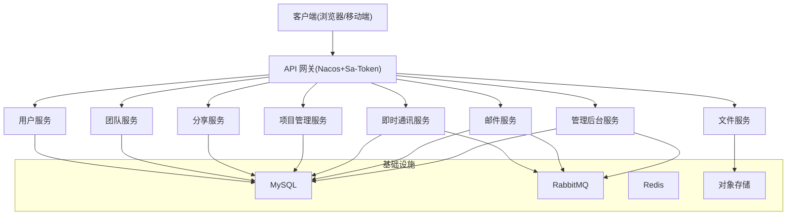
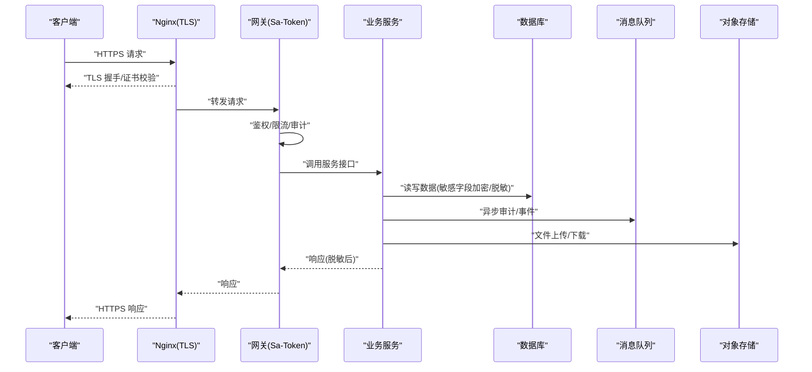
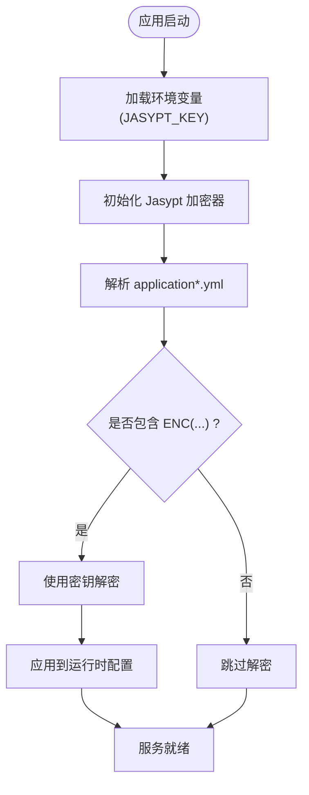
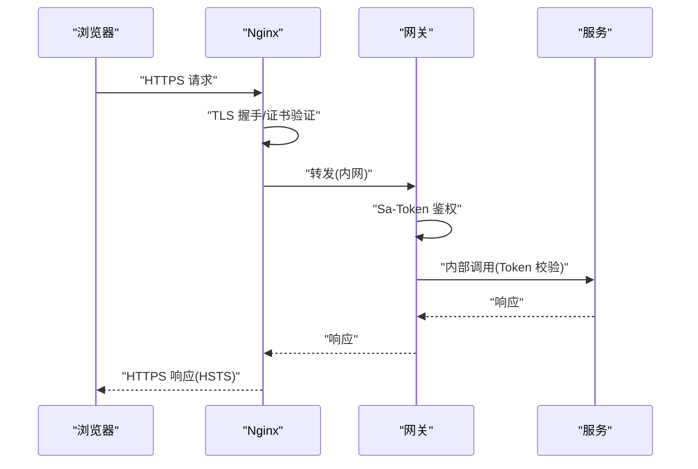
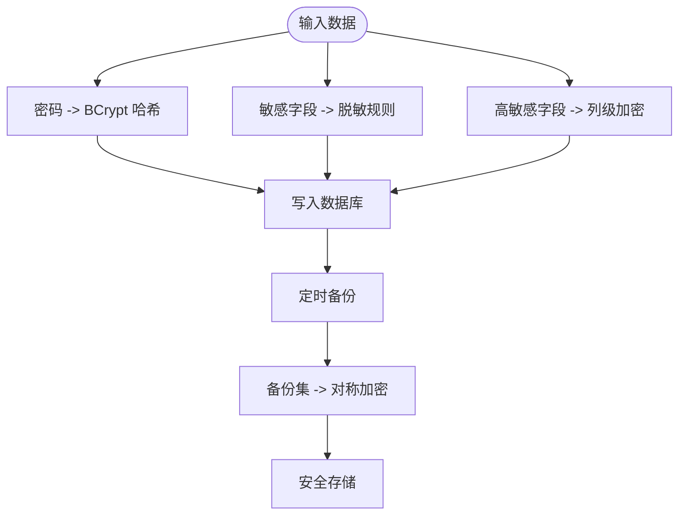
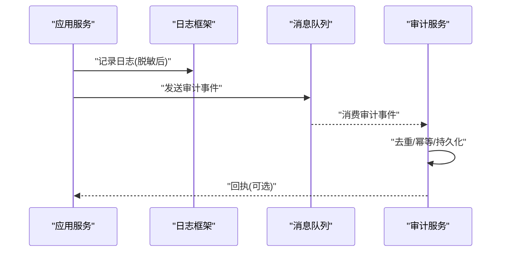
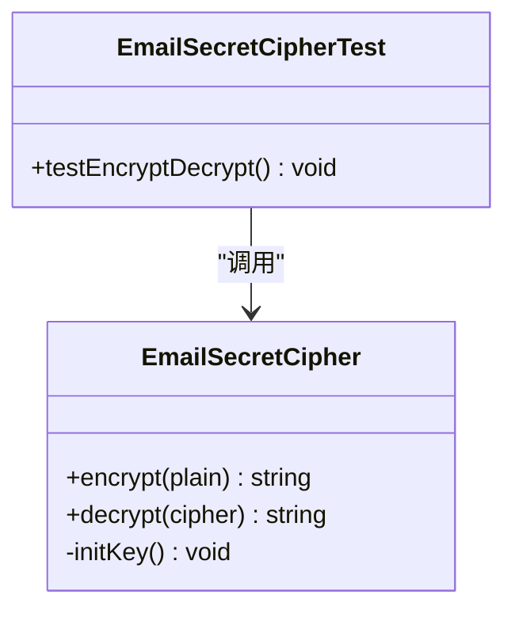
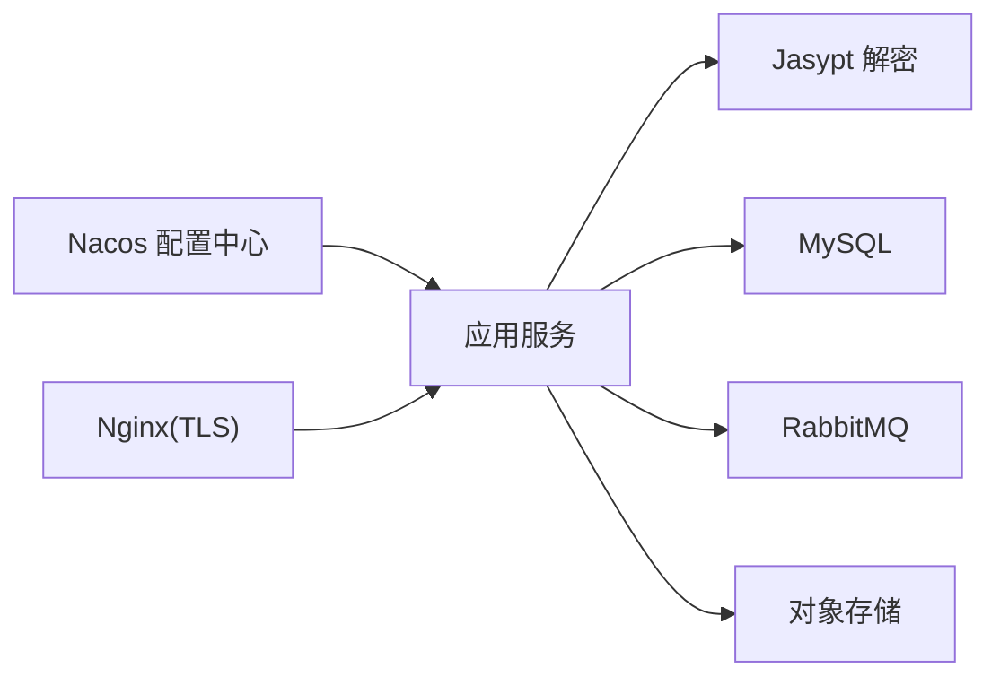
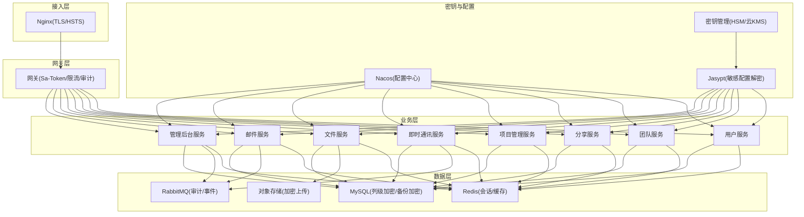
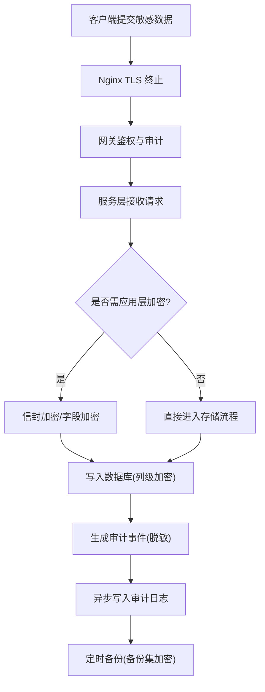

# 数据安全

<cite>
**本文引用的文件**   
- [README.md](file://ZXYZdatabaseBack/README.md)
- [pom.xml](file://ZXYZdatabaseBack/pom.xml)
- [application.yml](file://ZXYZdatabaseBack/zxyz-admin-service/src/main/resources/application.yml)
- [application-dev.yml](file://ZXYZdatabaseBack/zxyz-admin-service/src/main/resources/application-dev.yml)
- [application-prod.yml](file://ZXYZdatabaseBack/zxyz-admin-service/src/main/resources/application-prod.yml)
- [application-common.yml](file://ZXYZdatabaseBack/zxyz-common/src/main/resources/application-common.yml)
- [zxyz-static.yml](file://nacos-config/zxyz-static.yml)
- [zxyz-dynamic.yml](file://nacos-config/zxyz-dynamic.yml)
- [jasypt-key-management.md](file://docs/jasypt-key-management.md)
- [default.conf](file://deploy/nginx/default.conf)
- [entrypoint.sh](file://deploy/nginx/entrypoint.sh)
- [docker-compose.yml](file://docker-compose.yml)
- [backup.sh](file://scripts/backup.sh)
- [schema_user.sql](file://ZXYZdatabaseBack/sql/schema_user.sql)
- [schema_audit.sql](file://ZXYZdatabaseBack/ZXYZdatabaseBack/sql/schema_audit.sql)
- [EmailSecretCipherTest.java](file://ZXYZdatabaseBack/zxyz-email-service/src/test/java/uno/acloud/email/application/EmailSecretCipherTest.java)
- [AuditBufferRetrySchedulerTest.java](file://ZXYZdatabaseBack/zxyz-common/src/test/java/uno/acloud/common/audit/AuditBufferRetrySchedulerTest.java)
- [OperateLogConsumerTest.java](file://ZXYZdatabaseBack/zxyz-audit-service/src/test/java/uno/acloud/audit/mq/OperateLogConsumerTest.java)
</cite>

## 目录
1. [引言](#引言)
2. [项目结构](#项目结构)
3. [核心组件](#核心组件)
4. [架构总览](#架构总览)
5. [详细组件分析](#详细组件分析)
6. [依赖关系分析](#依赖关系分析)
7. [性能考虑](#性能考虑)
8. [故障排查指南](#故障排查指南)
9. [结论](#结论)
10. [附录](#附录)

## 引言
本文件面向 ZXYZ 项目的数据安全，覆盖敏感信息加密、数据传输安全、数据存储安全、日志安全与审计、以及备份数据保护。文档基于仓库中的配置、脚本与测试用例进行归纳，提供可操作的实践建议与模板，帮助开发、运维与安全团队统一落地数据安全策略。

## 项目结构
ZXYZ 采用微服务架构（多个 Maven 模块 + Vue 前端），通过 Nacos 管理配置与服务注册，使用 Jasypt 对敏感配置进行加密；网关层统一鉴权与访问控制；Nginx 作为反向代理处理 HTTPS/TLS；数据库与消息队列等基础设施由 Docker Compose 编排；备份脚本负责数据导出与归档。

图表来源
- [docker-compose.yml](file://docker-compose.yml)
- [default.conf](file://deploy/nginx/default.conf)
- [application.yml](file://ZXYZdatabaseBack/zxyz-admin-service/src/main/resources/application.yml)

章节来源
- [README.md](file://ZXYZdatabaseBack/README.md)
- [pom.xml](file://ZXYZdatabaseBack/pom.xml)
- [docker-compose.yml](file://docker-compose.yml)

## 核心组件
- 配置中心与密钥管理：Nacos 集中管理应用配置，Jasypt 对敏感字段加密，密钥通过外部化方式注入（环境变量或密钥管理服务）。
- 网关与认证：Gateway 集成 Sa-Token，统一鉴权、限流与审计入口，内部端点拒绝公网访问。
- 传输安全：Nginx 终止 TLS，强制 HTTPS，启用安全头与协议版本限制。
- 存储安全：数据库密码与敏感配置通过 Jasypt 加密；密码哈希采用 BCrypt；敏感字段脱敏与可选的列级加密。
- 日志与审计：异步写入审计日志，支持去重与重试，避免泄露敏感信息。
- 备份与恢复：脚本化备份，结合外部密钥管理实现备份集加密。

章节来源
- [application.yml](file://ZXYZdatabaseBack/zxyz-admin-service/src/main/resources/application.yml)
- [application-common.yml](file://ZXYZdatabaseBack/zxyz-common/src/main/resources/application-common.yml)
- [zxyz-static.yml](file://nacos-config/zxyz-static.yml)
- [zxyz-dynamic.yml](file://nacos-config/zxyz-dynamic.yml)
- [jasypt-key-management.md](file://docs/jasypt-key-key-management.md)
- [default.conf](file://deploy/nginx/default.conf)
- [backup.sh](file://scripts/backup.sh)

## 架构总览
下图展示从客户端到后端服务、再到基础设施的数据流转路径，并标注关键安全控制点（TLS、鉴权、加密、脱敏、审计）。

图表来源
- [default.conf](file://deploy/nginx/default.conf)
- [application.yml](file://ZXYZdatabaseBack/zxyz-admin-service/src/main/resources/application.yml)
- [application-common.yml](file://ZXYZdatabaseBack/zxyz-common/src/main/resources/application-common.yml)

## 详细组件分析

### 敏感信息加密（Jasypt、数据库密码、API 密钥、环境变量）
- Jasypt 配置与使用
  - 在应用启动时加载 Jasypt 加密器，使用外部化的密钥（如环境变量）解密配置文件中的密文。
  - 常见用法：将明文密码替换为 ENC(...) 形式，启动时由 Jasypt 自动解密。
- 数据库密码加密
  - 数据库连接串中的用户名/密码使用 Jasypt 加密，避免明文落盘。
- API 密钥管理
  - 第三方服务密钥（如邮件、对象存储）通过 Nacos 配置中心注入，并以 Jasypt 加密存储。
- 环境变量加密策略
  - 密钥不进入代码库，通过 CI/CD 注入到运行环境；生产环境建议使用专用密钥管理服务。

图表来源
- [application.yml](file://ZXYZdatabaseBack/zxyz-admin-service/src/main/resources/application.yml)
- [application-common.yml](file://ZXYZdatabaseBack/zxyz-common/src/main/resources/application-common.yml)
- [zxyz-static.yml](file://nacos-config/zxyz-static.yml)
- [zxyz-dynamic.yml](file://nacos-config/zxyz-dynamic.yml)
- [jasypt-key-management.md](file://docs/jasypt-key-management.md)

章节来源
- [application.yml](file://ZXYZdatabaseBack/zxyz-admin-service/src/main/resources/application.yml)
- [application-common.yml](file://ZXYZdatabaseBack/zxyz-common/src/main/resources/application-common.yml)
- [zxyz-static.yml](file://nacos-config/zxyz-static.yml)
- [zxyz-dynamic.yml](file://nacos-config/zxyz-dynamic.yml)
- [jasypt-key-management.md](file://docs/jasypt-key-management.md)

### 数据传输安全（HTTPS、TLS 证书、请求响应加密、中间人攻击防护）
- HTTPS 配置
  - Nginx 作为入口终止 TLS，启用强协议版本与套件，强制 HTTP 跳转 HTTPS。
- TLS 证书管理
  - 证书与私钥通过挂载卷或密钥管理服务注入，定期轮换与监控过期时间。
- 请求响应加密
  - 全链路 HTTPS；对特别敏感的业务字段可在应用层二次加密（如信封加密）。
- 中间人攻击防护
  - 启用 HSTS、严格证书校验、禁用弱算法；服务端校验客户端来源与签名（内部服务间 Token）。

图表来源
- [default.conf](file://deploy/nginx/default.conf)
- [entrypoint.sh](file://deploy/nginx/entrypoint.sh)

章节来源
- [default.conf](file://deploy/nginx/default.conf)
- [entrypoint.sh](file://deploy/nginx/entrypoint.sh)

### 数据存储安全（密码哈希、敏感字段脱敏、数据库字段加密、备份数据加密）
- 密码哈希算法（BCrypt）
  - 用户密码使用 BCrypt 单向哈希存储，禁止明文保存。
- 敏感字段脱敏
  - 对外返回的 VO/DTO 中对手机号、邮箱、身份证等进行掩码处理。
- 数据库字段加密
  - 高敏感字段（如密钥、令牌）可采用列级加密或透明加密（TDE），配合密钥管理系统。
- 备份数据加密
  - 备份文件使用外部密钥进行对称加密，密钥与数据分离存储。

图表来源
- [schema_user.sql](file://ZXYZdatabaseBack/sql/schema_user.sql)
- [schema_audit.sql](file://ZXYZdatabaseBack/ZXYZdatabaseBack/sql/schema_audit.sql)
- [backup.sh](file://scripts/backup.sh)

章节来源
- [schema_user.sql](file://ZXYZdatabaseBack/sql/schema_user.sql)
- [schema_audit.sql](file://ZXYZdatabaseBack/ZXYZdatabaseBack/sql/schema_audit.sql)
- [backup.sh](file://scripts/backup.sh)

### 日志安全（脱敏、级别控制、审计日志、泄露防护）
- 敏感信息脱敏
  - 日志输出前对敏感字段执行脱敏，禁止打印完整凭证。
- 日志级别控制
  - 生产环境默认 INFO/WARN，按需开启 DEBUG；按模块隔离日志级别。
- 审计日志记录
  - 操作审计异步写入，支持幂等与重试，避免阻塞主流程。
- 日志泄露防护
  - 集中收集与访问控制，设置保留周期，异常告警与审计追踪。

图表来源
- [AuditBufferRetrySchedulerTest.java](file://ZXYZdatabaseBack/zxyz-common/src/test/java/uno/acloud/common/audit/AuditBufferRetrySchedulerTest.java)
- [OperateLogConsumerTest.java](file://ZXYZdatabaseBack/zxyz-audit-service/src/test/java/uno/acloud/audit/mq/OperateLogConsumerTest.java)

章节来源
- [AuditBufferRetrySchedulerTest.java](file://ZXYZdatabaseBack/zxyz-common/src/test/java/uno/acloud/common/audit/AuditBufferRetrySchedulerTest.java)
- [OperateLogConsumerTest.java](file://ZXYZdatabaseBack/zxyz-audit-service/src/test/java/uno/acloud/audit/mq/OperateLogConsumerTest.java)

### 加密工具类使用示例（以邮件服务为例）
- 邮件密钥加解密
  - 通过单元测试验证加解密逻辑的正确性，确保密钥管理与运行时解密一致。
- 使用建议
  - 将加解密方法封装为工具类，统一入口；避免在业务代码中散落加解密逻辑。

图表来源
- [EmailSecretCipherTest.java](file://ZXYZdatabaseBack/zxyz-email-service/src/test/java/uno/acloud/email/application/EmailSecretCipherTest.java)

章节来源
- [EmailSecretCipherTest.java](file://ZXYZdatabaseBack/zxyz-email-service/src/test/java/uno/acloud/email/application/EmailSecretCipherTest.java)

## 依赖关系分析
- 配置依赖
  - 各服务通过 Nacos 拉取静态与动态配置，敏感配置由 Jasypt 解密。
- 运行时依赖
  - 网关依赖 Sa-Token 与 Redis；服务依赖 MySQL、RabbitMQ、对象存储。
- 安全依赖
  - TLS 证书、HSM/密钥管理服务、备份密钥管理。

图表来源
- [zxyz-static.yml](file://nacos-config/zxyz-static.yml)
- [zxyz-dynamic.yml](file://nacos-config/zxyz-dynamic.yml)
- [application-common.yml](file://ZXYZdatabaseBack/zxyz-common/src/main/resources/application-common.yml)

章节来源
- [zxyz-static.yml](file://nacos-config/zxyz-static.yml)
- [zxyz-dynamic.yml](file://nacos-config/zxyz-dynamic.yml)
- [application-common.yml](file://ZXYZdatabaseBack/zxyz-common/src/main/resources/application-common.yml)

## 性能考虑
- 加密开销
  - BCrypt 计算成本较高，需合理设置轮次；批量导入时异步处理。
- I/O 与网络
  - 备份与审计写入应异步化，避免阻塞主流程；合理使用缓存减少重复解密。
- 资源隔离
  - 不同服务独立部署，避免单点瓶颈影响整体吞吐。

[本节为通用指导，不直接分析具体文件]

## 故障排查指南
- Jasypt 解密失败
  - 检查环境变量密钥是否正确注入；确认配置文件中的密文格式；查看启动日志中的解密错误。
- TLS 握手失败
  - 检查证书链与域名匹配；确认 Nginx 配置与端口映射；查看浏览器/客户端错误详情。
- 数据库连接失败
  - 核对数据库地址、端口、账号密码（含 Jasypt 解密结果）；检查防火墙与网络策略。
- 审计日志丢失
  - 检查 RabbitMQ 连通性与消费者状态；查看死信队列与重试次数；确认幂等键唯一性。

章节来源
- [jasypt-key-management.md](file://docs/jasypt-key-management.md)
- [default.conf](file://deploy/nginx/default.conf)
- [OperateLogConsumerTest.java](file://ZXYZdatabaseBack/zxyz-audit-service/src/test/java/uno/acloud/audit/mq/OperateLogConsumerTest.java)

## 结论
ZXYZ 项目在配置加密、传输安全、存储安全与日志审计方面具备较完善的实践基础。建议持续完善密钥生命周期管理、备份加密与审计合规，强化自动化安全扫描与渗透测试，确保数据安全策略在生产环境中稳定落地。

[本节为总结性内容，不直接分析具体文件]

## 附录

### 数据安全架构图

图表来源
- [docker-compose.yml](file://docker-compose.yml)
- [default.conf](file://deploy/nginx/default.conf)
- [application-common.yml](file://ZXYZdatabaseBack/zxyz-common/src/main/resources/application-common.yml)
- [zxyz-static.yml](file://nacos-config/zxyz-static.yml)
- [zxyz-dynamic.yml](file://nacos-config/zxyz-dynamic.yml)
- [jasypt-key-management.md](file://docs/jasypt-key-management.md)

### 加密流程图（端到端）

图表来源
- [default.conf](file://deploy/nginx/default.conf)
- [application-common.yml](file://ZXYZdatabaseBack/zxyz-common/src/main/resources/application-common.yml)
- [backup.sh](file://scripts/backup.sh)

### 脱敏规则表
- 手机号：保留前三位与后四位，中间用星号替代
- 邮箱：保留首字母与域名后缀，中间用星号替代
- 身份证号：保留前六位与后四位，中间用星号替代
- 银行卡号：保留后四位，前面用星号替代
- 访问令牌：仅显示类型与最后四位字符
- 备注：所有脱敏仅在输出层进行，原始数据保持完整

[本节为通用规范，不直接分析具体文件]

### 安全配置模板（节选要点）
- Nginx
  - 启用 HTTPS、HSTS、强协议与套件、HTTP 自动跳转
- 应用配置
  - 关闭调试模式、限制日志级别、开启审计开关
- 数据库
  - 启用连接加密、最小权限账户、定期轮换密码
- 密钥管理
  - 密钥环境变量注入、定期轮换、访问审计

[本节为通用模板，不直接分析具体文件]

### 加密工具类使用示例（参考）
- 邮件密钥加解密
  - 通过测试用例验证加解密一致性，确保密钥来源可靠
- 建议
  - 统一封装工具类，集中管理密钥与算法参数

章节来源
- [EmailSecretCipherTest.java](file://ZXYZdatabaseBack/zxyz-email-service/src/test/java/uno/acloud/email/application/EmailSecretCipherTest.java)

### 安全审计清单
- 配置与密钥
  - 敏感配置是否全部使用 Jasypt 加密
  - 密钥是否通过环境变量或 KMS 注入
  - 是否禁用默认/弱口令
- 传输安全
  - 是否强制 HTTPS、启用 HSTS
  - 证书是否有效且未过期
  - 是否禁用不安全协议与套件
- 存储安全
  - 密码是否使用 BCrypt 哈希
  - 敏感字段是否脱敏输出
  - 高敏感字段是否列级加密
  - 备份是否加密并安全存储
- 日志与审计
  - 是否脱敏敏感信息
  - 是否异步写入审计日志
  - 是否设置保留周期与访问控制
- 运维与合规
  - 是否定期轮换密钥与证书
  - 是否进行安全扫描与渗透测试
  - 是否建立应急响应与回滚机制

[本节为通用清单，不直接分析具体文件]