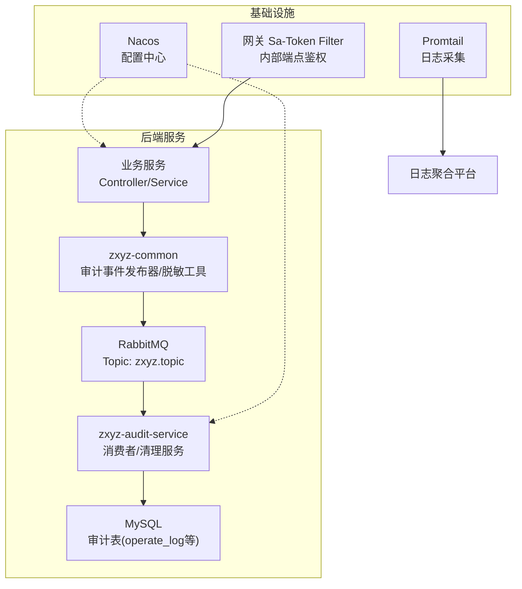
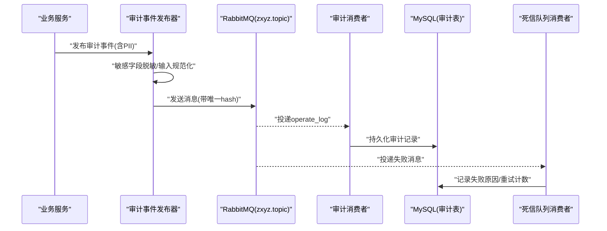
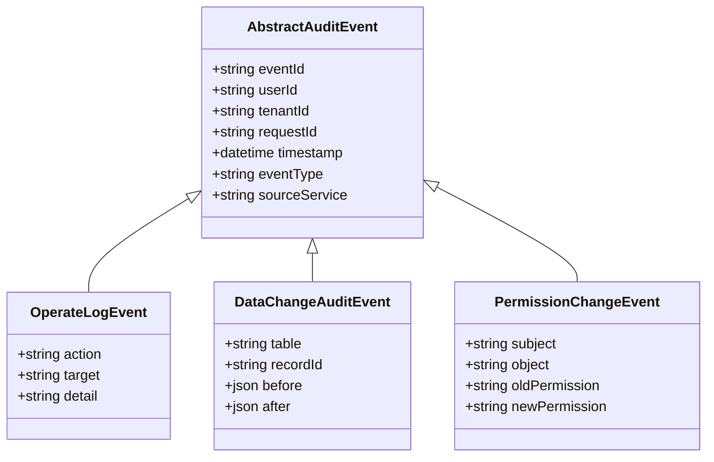
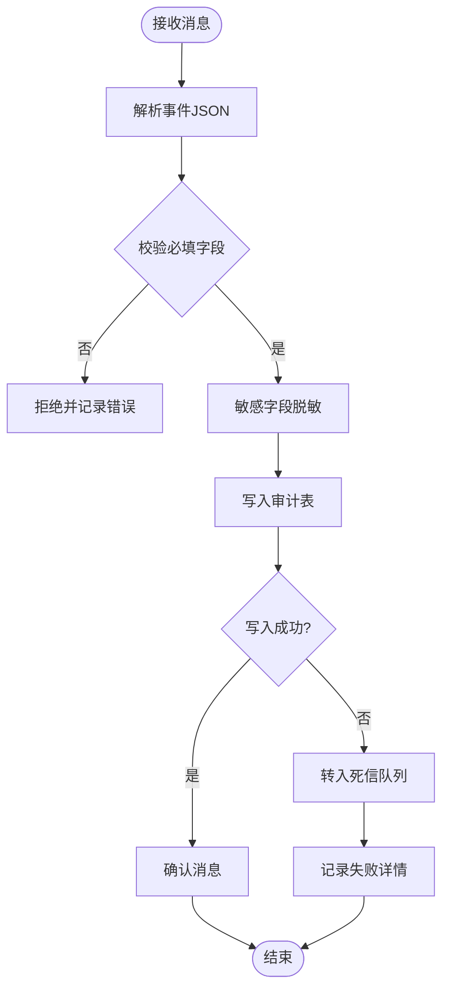
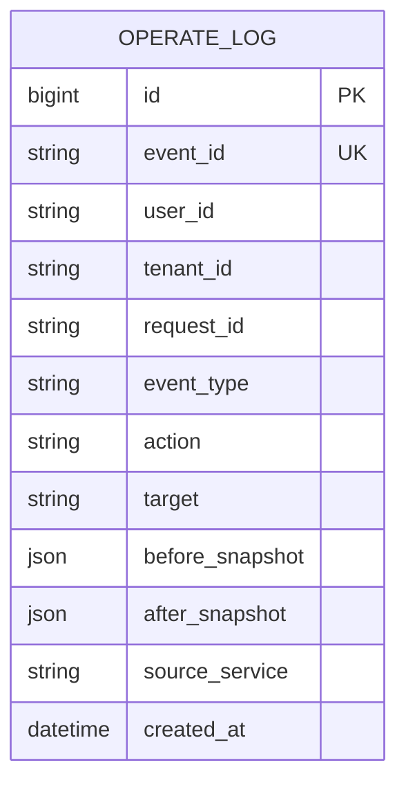
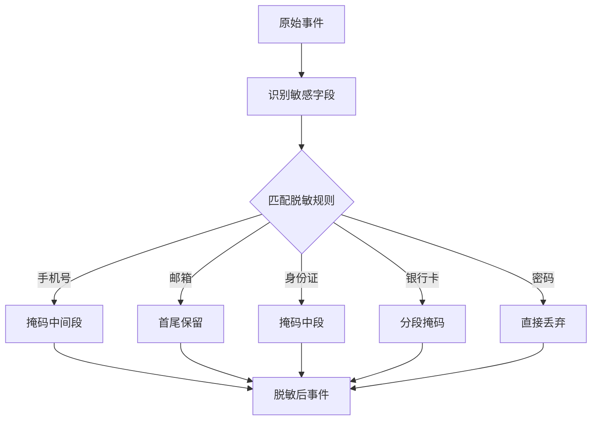
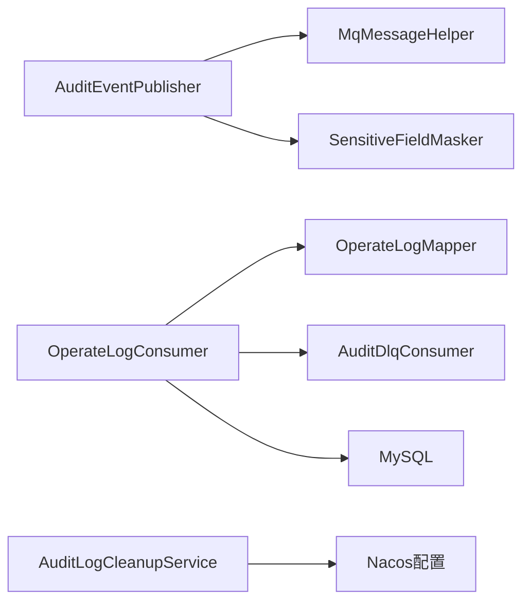

# 日志审计安全

<cite>
**本文引用的文件**   
- [zxyz-audit-service/OperateLogConsumer.java](file://ZXYZdatabaseBack/zxyz-audit-service/src/main/java/uno/acloud/audit/mq/OperateLogConsumer.java)
- [zxyz-audit-service/AuditDlqConsumer.java](file://ZXYZdatabaseBack/zxyz-audit-service/src/main/java/uno/acloud/audit/mq/AuditDlqConsumer.java)
- [zxyz-audit-service/AuditLogCleanupService.java](file://ZXYZdatabaseBack/zxyz-audit-service/src/main/java/uno/acloud/audit/service/AuditLogCleanupService.java)
- [zxyz-audit-service/RabbitMqConfig.java](file://ZXYZdatabaseBack/zxyz-audit-service/src/main/java/uno/acloud/audit/config/RabbitMqConfig.java)
- [zxyz-audit-service/OperateLogMapper.java](file://ZXYZdatabaseBack/zxyz-audit-service/src/main/java/uno/acloud/audit/mapper/OperateLogMapper.java)
- [zxyz-audit-service/V1__init_schema.sql](file://ZXYZdatabaseBack/zxyz-audit-service/src/main/resources/db/migration/V1__init_schema.sql)
- [zxyz-audit-service/V2__add_operate_log_before_after_values.sql](file://ZXYZdatabaseBack/zxyz-audit-service/src/main/resources/db/migration/V2__add_operate_log_before_after_values.sql)
- [zxyz-audit-service/V3__add_message_hash_unique.sql](file://ZXYZdatabaseBack/zxyz-audit-service/src/main/resources/db/migration/V3__add_message_hash_unique.sql)
- [zxyz-common/AuditEventPublisher.java](file://ZXYZdatabaseBack/zxyz-common/src/main/java/uno/acloud/common/event/AuditEventPublisher.java)
- [zxyz-common/AuditBufferRetryScheduler.java](file://ZXYZdatabaseBack/zxyz-common/src/main/java/uno/acloud/common/audit/AuditBufferRetryScheduler.java)
- [zxyz-common/AbstractAuditEvent.java](file://ZXYZdatabaseBack/zxyz-common/src/main/java/uno/acloud/common/audit/AbstractAuditEvent.java)
- [zxyz-common/OperateLogEvent.java](file://ZXYZdatabaseBack/zxyz-common/src/main/java/uno/acloud/common/event/OperateLogEvent.java)
- [zxyz-common/PermissionChangeEvent.java](file://ZXYZdatabaseBack/zxyz-common/src/main/java/uno/acloud/common/event/PermissionChangeEvent.java)
- [zxyz-common/DataChangeAuditEvent.java](file://ZXYZdatabaseBack/zxyz-common/src/main/java/uno/acloud/common/event/DataChangeAuditEvent.java)
- [zxyz-common/MqMessageHelper.java](file://ZXYZdatabaseBack/zxyz-common/src/main/java/uno/acloud/common/mq/MqMessageHelper.java)
- [zxyz-common/SensitiveFieldMasker.java](file://ZXYZdatabaseBack/zxyz-common/src/main/java/uno/acloud/common/util/SensitiveFieldMasker.java)
- [zxyz-common/InputNormalizer.java](file://ZXYZdatabaseBack/zxyz-common/src/main/java/uno/acloud/common/util/InputNormalizer.java)
- [zxyz-common/application-common.yml](file://ZXYZdatabaseBack/zxyz-common/src/main/resources/application-common.yml)
- [nacos-config/zxyz-audit-service.yml](file://nacos-config/zxyz-audit-service.yml)
- [nacos-config/zxyz-static.yml](file://nacos-config/zxyz-static.yml)
- [deploy/promtail-config.yml](file://deploy/promtail-config.yml)
- [docker-compose.yml](file://docker-compose.yml)
- [ZXYZdatabaseFront/utils/logger.js](file://ZXYZdatabaseFront/src/utils/logger.js)
- [ZXYZdatabaseFront/src/router/guards/permission.js](file://ZXYZdatabaseFront/src/router/guards/permission.js)
- [ZXYZdatabaseBack/zxyz-gateway/filter/SaTokenFilterConfig.java](file://ZXYZdatabaseBack/zxyz-gateway/src/main/java/uno/acloud/gateway/filter/SaTokenFilterConfig.java)
- [ZXYZdatabaseBack/zxyz-admin-service/domain/SysConfigAudit.java](file://ZXYZdatabaseBack/zxyz-admin-service/src/main/java/uno/acloud/admin/domain/SysConfigAudit.java)
- [ZXYZdatabaseBack/sql/schema_audit.sql](file://ZXYZdatabaseBack/sql/schema_audit.sql)
</cite>

## 目录
1. [简介](#简介)
2. [项目结构](#项目结构)
3. [核心组件](#核心组件)
4. [架构总览](#架构总览)
5. [详细组件分析](#详细组件分析)
6. [依赖关系分析](#依赖关系分析)
7. [性能考虑](#性能考虑)
8. [故障排查指南](#故障排查指南)
9. [结论](#结论)
10. [附录](#附录)

## 简介
本文件为 ZXYZ 项目的“日志审计安全”专项文档，围绕以下目标展开：
- 敏感信息脱敏：日志级别控制、敏感字段自动脱敏、PII 数据处理、日志聚合安全。
- 审计日志记录：操作行为追踪、数据变更审计、权限变更记录、合规性报告。
- 日志安全策略：访问控制、传输加密、存储加密、生命周期管理。
- 监控告警安全：异常行为检测、安全事件告警、性能指标监控、资源使用审计。
- 提供架构图、流程图与指标定义，并给出配置模板、审计事件示例与安全监控规则。

## 项目结构
ZXYZ 采用微服务架构（后端 Maven 多模块 + Vue 前端），审计相关能力集中在 zxyz-common（通用库）与 zxyz-audit-service（审计服务），并通过 RabbitMQ Topic Exchange 进行异步解耦。Nacos 集中管理配置，Promtail 负责日志采集，数据库通过 Flyway 演进。

图表来源
- [zxyz-common/AuditEventPublisher.java](file://ZXYZdatabaseBack/zxyz-common/src/main/java/uno/acloud/common/event/AuditEventPublisher.java)
- [zxyz-audit-service/OperateLogConsumer.java](file://ZXYZdatabaseBack/zxyz-audit-service/src/main/java/uno/acloud/audit/mq/OperateLogConsumer.java)
- [zxyz-audit-service/RabbitMqConfig.java](file://ZXYZdatabaseBack/zxyz-audit-service/src/main/java/uno/acloud/audit/config/RabbitMqConfig.java)
- [ZXYZdatabaseBack/zxyz-gateway/filter/SaTokenFilterConfig.java](file://ZXYZdatabaseBack/zxyz-gateway/src/main/java/uno/acloud/gateway/filter/SaTokenFilterConfig.java)

章节来源
- [docker-compose.yml](file://docker-compose.yml)
- [nacos-config/zxyz-audit-service.yml](file://nacos-config/zxyz-audit-service.yml)
- [nacos-config/zxyz-static.yml](file://nacos-config/zxyz-static.yml)

## 核心组件
- 审计事件发布器：统一封装审计事件发布到 MQ，支持重试与缓冲，确保高可用与幂等。
- 审计消费者：消费 operate_log 主题，落库持久化；DLQ 消费者处理失败消息，便于回溯。
- 审计清理服务：按策略清理过期审计日志，保障存储成本与性能。
- 脱敏工具：对敏感字段（如手机号、邮箱、身份证、银行卡等）进行掩码或哈希化处理。
- 输入规范化：统一输入格式，避免注入与畸形数据进入审计流。
- 网关鉴权：拦截 /api/internal/** 内部端点，仅允许内网调用，防止公网暴露。

章节来源
- [zxyz-common/AuditEventPublisher.java](file://ZXYZdatabaseBack/zxyz-common/src/main/java/uno/acloud/common/event/AuditEventPublisher.java)
- [zxyz-audit-service/OperateLogConsumer.java](file://ZXYZdatabaseBack/zxyz-audit-service/src/main/java/uno/acloud/audit/mq/OperateLogConsumer.java)
- [zxyz-audit-service/AuditDlqConsumer.java](file://ZXYZdatabaseBack/zxyz-audit-service/src/main/java/uno/acloud/audit/mq/AuditDlqConsumer.java)
- [zxyz-audit-service/AuditLogCleanupService.java](file://ZXYZdatabaseBack/zxyz-audit-service/src/main/java/uno/acloud/audit/service/AuditLogCleanupService.java)
- [zxyz-common/SensitiveFieldMasker.java](file://ZXYZdatabaseBack/zxyz-common/src/main/java/uno/acloud/common/util/SensitiveFieldMasker.java)
- [zxyz-common/InputNormalizer.java](file://ZXYZdatabaseBack/zxyz-common/src/main/java/uno/acloud/common/util/InputNormalizer.java)
- [ZXYZdatabaseBack/zxyz-gateway/filter/SaTokenFilterConfig.java](file://ZXYZdatabaseBack/zxyz-gateway/src/main/java/uno/acloud/gateway/filter/SaTokenFilterConfig.java)

## 架构总览
审计链路从业务服务发起，经 zxyz-common 的发布器将审计事件写入 MQ，再由 audit-service 消费并持久化至 MySQL。敏感字段在入库前完成脱敏，失败消息进入 DLQ 由专用消费者处理。Promtail 采集应用日志，配合 Nacos 动态配置与网关鉴权，形成端到端的安全闭环。

图表来源
- [zxyz-common/AuditEventPublisher.java](file://ZXYZdatabaseBack/zxyz-common/src/main/java/uno/acloud/common/event/AuditEventPublisher.java)
- [zxyz-common/SensitiveFieldMasker.java](file://ZXYZdatabaseBack/zxyz-common/src/main/java/uno/acloud/common/util/SensitiveFieldMasker.java)
- [zxyz-audit-service/OperateLogConsumer.java](file://ZXYZdatabaseBack/zxyz-audit-service/src/main/java/uno/acloud/audit/mq/OperateLogConsumer.java)
- [zxyz-audit-service/AuditDlqConsumer.java](file://ZXYZdatabaseBack/zxyz-audit-service/src/main/java/uno/acloud/audit/mq/AuditDlqConsumer.java)

## 详细组件分析

### 审计事件模型与发布流程
- 抽象事件基类：定义通用字段（时间戳、用户、租户、请求ID等）。
- 具体事件类型：操作日志、数据变更、权限变更等，分别承载不同语义。
- 发布器：负责序列化、去重（基于消息 hash）、重试与缓冲，保证最终一致性。

图表来源
- [zxyz-common/AbstractAuditEvent.java](file://ZXYZdatabaseBack/zxyz-common/src/main/java/uno/acloud/common/audit/AbstractAuditEvent.java)
- [zxyz-common/OperateLogEvent.java](file://ZXYZdatabaseBack/zxyz-common/src/main/java/uno/acloud/common/event/OperateLogEvent.java)
- [zxyz-common/DataChangeAuditEvent.java](file://ZXYZdatabaseBack/zxyz-common/src/main/java/uno/acloud/common/event/DataChangeAuditEvent.java)
- [zxyz-common/PermissionChangeEvent.java](file://ZXYZdatabaseBack/zxyz-common/src/main/java/uno/acloud/common/event/PermissionChangeEvent.java)

章节来源
- [zxyz-common/AuditEventPublisher.java](file://ZXYZdatabaseBack/zxyz-common/src/main/java/uno/acloud/common/event/AuditEventPublisher.java)
- [zxyz-common/MqMessageHelper.java](file://ZXYZdatabaseBack/zxyz-common/src/main/java/uno/acloud/common/mq/MqMessageHelper.java)

### 审计消费者与持久化
- 主消费者：监听 operate_log 主题，解析事件，执行敏感字段二次校验与脱敏，写入审计表。
- 死信消费者：处理消费失败的消息，记录错误上下文，支持人工干预与重试。
- Mapper：封装 SQL 插入与查询，支持批量写入与分页导出。

图表来源
- [zxyz-audit-service/OperateLogConsumer.java](file://ZXYZdatabaseBack/zxyz-audit-service/src/main/java/uno/acloud/audit/mq/OperateLogConsumer.java)
- [zxyz-audit-service/AuditDlqConsumer.java](file://ZXYZdatabaseBack/zxyz-audit-service/src/main/java/uno/acloud/audit/mq/AuditDlqConsumer.java)
- [zxyz-audit-service/OperateLogMapper.java](file://ZXYZdatabaseBack/zxyz-audit-service/src/main/java/uno/acloud/audit/mapper/OperateLogMapper.java)

章节来源
- [zxyz-audit-service/OperateLogConsumer.java](file://ZXYZdatabaseBack/zxyz-audit-service/src/main/java/uno/acloud/audit/mq/OperateLogConsumer.java)
- [zxyz-audit-service/AuditDlqConsumer.java](file://ZXYZdatabaseBack/zxyz-audit-service/src/main/java/uno/acloud/audit/mq/AuditDlqConsumer.java)
- [zxyz-audit-service/OperateLogMapper.java](file://ZXYZdatabaseBack/zxyz-audit-service/src/main/java/uno/acloud/audit/mapper/OperateLogMapper.java)

### 审计表结构与数据变更审计
- 基础表：包含操作主体、对象、动作、时间、请求ID、来源服务等。
- 前后值快照：新增 before/after 字段，记录数据变更前后状态，便于差异对比。
- 幂等约束：消息 hash 唯一索引，避免重复写入。

图表来源
- [zxyz-audit-service/V1__init_schema.sql](file://ZXYZdatabaseBack/zxyz-audit-service/src/main/resources/db/migration/V1__init_schema.sql)
- [zxyz-audit-service/V2__add_operate_log_before_after_values.sql](file://ZXYZdatabaseBack/zxyz-audit-service/src/main/resources/db/migration/V2__add_operate_log_before_after_values.sql)
- [zxyz-audit-service/V3__add_message_hash_unique.sql](file://ZXYZdatabaseBack/zxyz-audit-service/src/main/resources/db/migration/V3__add_message_hash_unique.sql)

章节来源
- [zxyz-audit-service/V1__init_schema.sql](file://ZXYZdatabaseBack/zxyz-audit-service/src/main/resources/db/migration/V1__init_schema.sql)
- [zxyz-audit-service/V2__add_operate_log_before_after_values.sql](file://ZXYZdatabaseBack/zxyz-audit-service/src/main/resources/db/migration/V2__add_operate_log_before_after_values.sql)
- [zxyz-audit-service/V3__add_message_hash_unique.sql](file://ZXYZdatabaseBack/zxyz-audit-service/src/main/resources/db/migration/V3__add_message_hash_unique.sql)

### 敏感信息脱敏与 PII 处理
- 脱敏策略：手机号中间四位掩码、邮箱首尾保留、身份证号掩码、银行卡号分段掩码、密码强制不记录。
- 触发时机：事件发布前与消费者入库前双重校验，确保全链路安全。
- PII 分类：个人身份信息（姓名、证件号、联系方式）、财务信息（银行卡、支付账号）、健康信息等，按策略分级处理。

图表来源
- [zxyz-common/SensitiveFieldMasker.java](file://ZXYZdatabaseBack/zxyz-common/src/main/java/uno/acloud/common/util/SensitiveFieldMasker.java)
- [zxyz-common/AuditEventPublisher.java](file://ZXYZdatabaseBack/zxyz-common/src/main/java/uno/acloud/common/event/AuditEventPublisher.java)

章节来源
- [zxyz-common/SensitiveFieldMasker.java](file://ZXYZdatabaseBack/zxyz-common/src/main/java/uno/acloud/common/util/SensitiveFieldMasker.java)
- [zxyz-common/AuditEventPublisher.java](file://ZXYZdatabaseBack/zxyz-common/src/main/java/uno/acloud/common/event/AuditEventPublisher.java)

### 日志级别控制与聚合安全
- 级别控制：开发环境可开启 DEBUG，生产默认 INFO/WARN，关键安全事件强制 WARN/ERROR。
- 聚合安全：Promtail 采集时过滤敏感字段，避免明文落入日志系统；支持按租户/服务维度隔离。
- 动态配置：通过 Nacos 动态调整日志级别与采样率，无需重启服务。

章节来源
- [nacos-config/zxyz-audit-service.yml](file://nacos-config/zxyz-audit-service.yml)
- [nacos-config/zxyz-static.yml](file://nacos-config/zxyz-static.yml)
- [deploy/promtail-config.yml](file://deploy/promtail-config.yml)

### 审计清理与生命周期管理
- 清理策略：按创建时间分片清理，保留周期可配置（如 90/180/365 天），支持软删除标记。
- 任务调度：定时任务扫描过期数据，批量删除并记录清理统计。
- 合规要求：满足最小留存原则与可追溯性要求，支持导出归档。

章节来源
- [zxyz-audit-service/AuditLogCleanupService.java](file://ZXYZdatabaseBack/zxyz-audit-service/src/main/java/uno/acloud/audit/service/AuditLogCleanupService.java)
- [nacos-config/zxyz-audit-service.yml](file://nacos-config/zxyz-audit-service.yml)

### 网关访问控制与内部端点保护
- 内部端点：/api/internal/** 仅允许内网访问，网关层通过 Sa-Token Filter 校验令牌与来源。
- 白名单机制：限制特定 IP/服务调用，防止越权访问。
- 审计联动：所有内部调用均生成审计事件，记录调用方与被调方。

章节来源
- [ZXYZdatabaseBack/zxyz-gateway/filter/SaTokenFilterConfig.java](file://ZXYZdatabaseBack/zxyz-gateway/src/main/java/uno/acloud/gateway/filter/SaTokenFilterConfig.java)

### 前端日志与路由权限审计
- 前端日志：统一 logger 工具，屏蔽敏感参数，输出结构化日志。
- 路由守卫：权限变更后同步更新本地状态，并记录权限变更审计事件。

章节来源
- [ZXYZdatabaseFront/utils/logger.js](file://ZXYZdatabaseFront/src/utils/logger.js)
- [ZXYZdatabaseFront/src/router/guards/permission.js](file://ZXYZdatabaseFront/src/router/guards/permission.js)

### 配置项与开关
- 审计开关：是否启用审计、是否记录 before/after 快照、是否启用幂等去重。
- 脱敏开关：是否启用敏感字段脱敏、自定义正则规则。
- 清理策略：保留天数、批次大小、调度频率。

章节来源
- [zxyz-common/application-common.yml](file://ZXYZdatabaseBack/zxyz-common/src/main/resources/application-common.yml)
- [nacos-config/zxyz-audit-service.yml](file://nacos-config/zxyz-audit-service.yml)

## 依赖关系分析
- 组件耦合：发布器依赖脱敏工具与 MQ 助手；消费者依赖 Mapper 与清理服务；清理服务依赖配置中心。
- 外部依赖：RabbitMQ 用于异步解耦，MySQL 用于持久化，Nacos 用于配置管理，Promtail 用于日志采集。
- 潜在风险：MQ 不可用导致积压，需监控与扩容；数据库写入瓶颈需分库分表或归档；脱敏规则变更需灰度验证。

图表来源
- [zxyz-common/AuditEventPublisher.java](file://ZXYZdatabaseBack/zxyz-common/src/main/java/uno/acloud/common/event/AuditEventPublisher.java)
- [zxyz-common/MqMessageHelper.java](file://ZXYZdatabaseBack/zxyz-common/src/main/java/uno/acloud/common/mq/MqMessageHelper.java)
- [zxyz-audit-service/OperateLogConsumer.java](file://ZXYZdatabaseBack/zxyz-audit-service/src/main/java/uno/acloud/audit/mq/OperateLogConsumer.java)
- [zxyz-audit-service/AuditLogCleanupService.java](file://ZXYZdatabaseBack/zxyz-audit-service/src/main/java/uno/acloud/audit/service/AuditLogCleanupService.java)

章节来源
- [zxyz-common/AuditEventPublisher.java](file://ZXYZdatabaseBack/zxyz-common/src/main/java/uno/acloud/common/event/AuditEventPublisher.java)
- [zxyz-audit-service/OperateLogConsumer.java](file://ZXYZdatabaseBack/zxyz-audit-service/src/main/java/uno/acloud/audit/mq/OperateLogConsumer.java)
- [zxyz-audit-service/AuditLogCleanupService.java](file://ZXYZdatabaseBack/zxyz-audit-service/src/main/java/uno/acloud/audit/service/AuditLogCleanupService.java)

## 性能考虑
- 异步解耦：通过 MQ 削峰填谷，降低业务链路延迟。
- 批量写入：消费者侧批量插入，减少事务开销。
- 幂等去重：消息 hash 唯一索引，避免重复处理。
- 清理优化：按分区/时间切片清理，避免大事务锁表。
- 监控指标：关注 MQ 堆积、消费者 TPS、数据库慢查询、磁盘占用。

[本节为通用指导，不直接分析具体文件]

## 故障排查指南
- 常见现象
  - 审计消息未落库：检查消费者运行状态、MQ 连接、数据库连接池。
  - 死信队列增长：查看失败原因（解析失败、校验失败、写入异常），修复后重新入队。
  - 敏感字段泄露：核对脱敏规则覆盖范围，检查日志聚合过滤策略。
- 定位步骤
  - 查看消费者日志与 DLQ 消息体，确认事件结构与字段映射。
  - 检查 Nacos 配置项（审计开关、脱敏开关、保留天数）。
  - 验证幂等键（event_id/hash）是否重复。
- 恢复建议
  - 临时提升日志级别以捕获更多上下文。
  - 分批重放 DLQ 消息，观察成功率。
  - 扩容消费者实例与数据库连接数。

章节来源
- [zxyz-audit-service/AuditDlqConsumer.java](file://ZXYZdatabaseBack/zxyz-audit-service/src/main/java/uno/acloud/audit/mq/AuditDlqConsumer.java)
- [nacos-config/zxyz-audit-service.yml](file://nacos-config/zxyz-audit-service.yml)

## 结论
ZXYZ 的日志审计体系以“发布-消费-持久化”为核心，结合敏感字段脱敏、幂等去重、死信处理与生命周期管理，实现了高可靠、可追溯、合规的审计能力。通过网关鉴权与 Promtail 聚合，进一步提升了安全性与可观测性。建议在后续迭代中完善指标监控与自动化告警，持续优化清理策略与脱敏规则。

[本节为总结，不直接分析具体文件]

## 附录

### 日志脱敏配置模板（节选）
- 启用开关：audit.sensitive.enabled=true
- 脱敏规则：phone=mask_middle, email=first_last, id_card=mask_segment, bank_card=segment_mask
- 忽略字段：password, secret_key
- 聚合过滤：promtail.skip_sensitive_fields=true

章节来源
- [zxyz-common/application-common.yml](file://ZXYZdatabaseBack/zxyz-common/src/main/resources/application-common.yml)
- [nacos-config/zxyz-audit-service.yml](file://nacos-config/zxyz-audit-service.yml)
- [deploy/promtail-config.yml](file://deploy/promtail-config.yml)

### 审计事件定义示例（说明）
- 操作日志：记录用户操作动作、目标对象、结果与上下文。
- 数据变更：记录表名、记录 ID、before/after 快照。
- 权限变更：记录主体、客体、旧权限与新权限。

章节来源
- [zxyz-common/OperateLogEvent.java](file://ZXYZdatabaseBack/zxyz-common/src/main/java/uno/acloud/common/event/OperateLogEvent.java)
- [zxyz-common/DataChangeAuditEvent.java](file://ZXYZdatabaseBack/zxyz-common/src/main/java/uno/acloud/common/event/DataChangeAuditEvent.java)
- [zxyz-common/PermissionChangeEvent.java](file://ZXYZdatabaseBack/zxyz-common/src/main/java/uno/acloud/common/event/PermissionChangeEvent.java)

### 安全监控规则（说明）
- 异常行为检测：同一用户短时间内频繁失败登录、越权访问尝试。
- 安全事件告警：敏感字段未脱敏、内部端点公网访问、DLQ 持续增长。
- 性能指标监控：消费者 TPS、MQ 堆积量、数据库慢查询、磁盘使用率。
- 资源使用审计：审计表增长速率、清理任务执行耗时、消费者 CPU/内存。

[本节为通用指导，不直接分析具体文件]

### 合规性报告（说明）
- 报告内容：审计事件总量、敏感字段脱敏覆盖率、失败率、清理完成率。
- 导出方式：按租户/时间范围导出 CSV/Excel，支持签名与水印。
- 留存策略：符合法规要求的留存周期，支持归档与销毁审计。

[本节为通用指导，不直接分析具体文件]