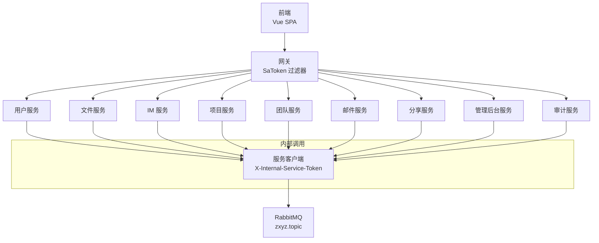
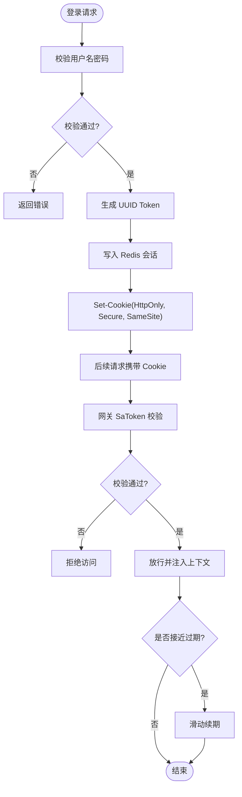
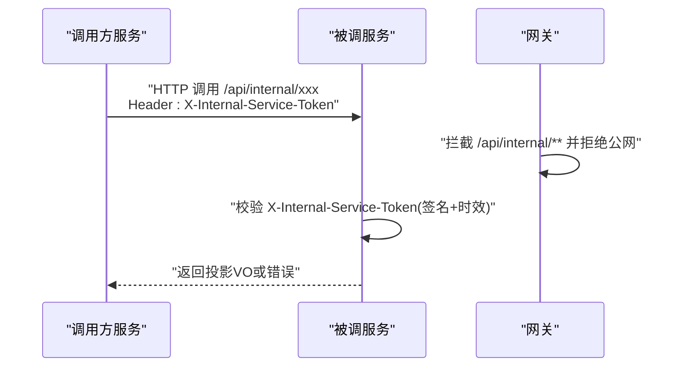
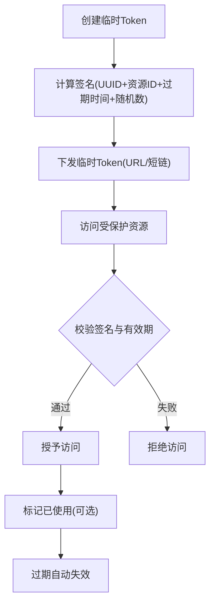
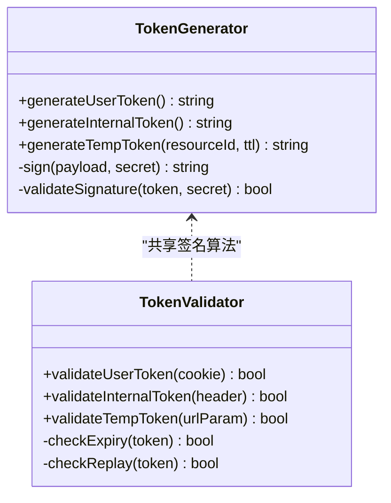
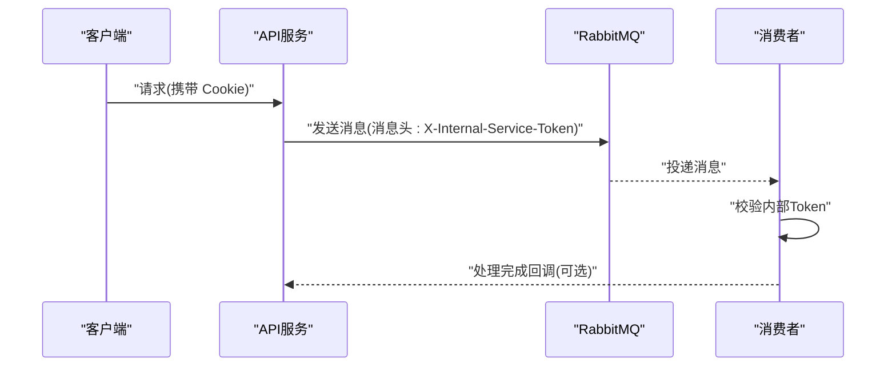
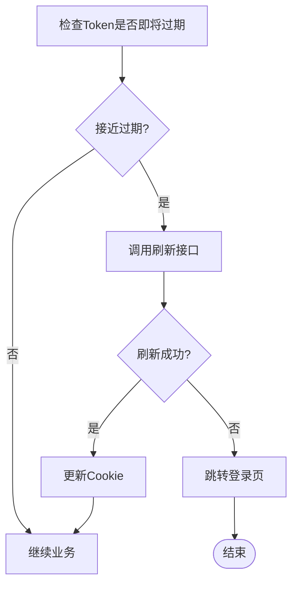
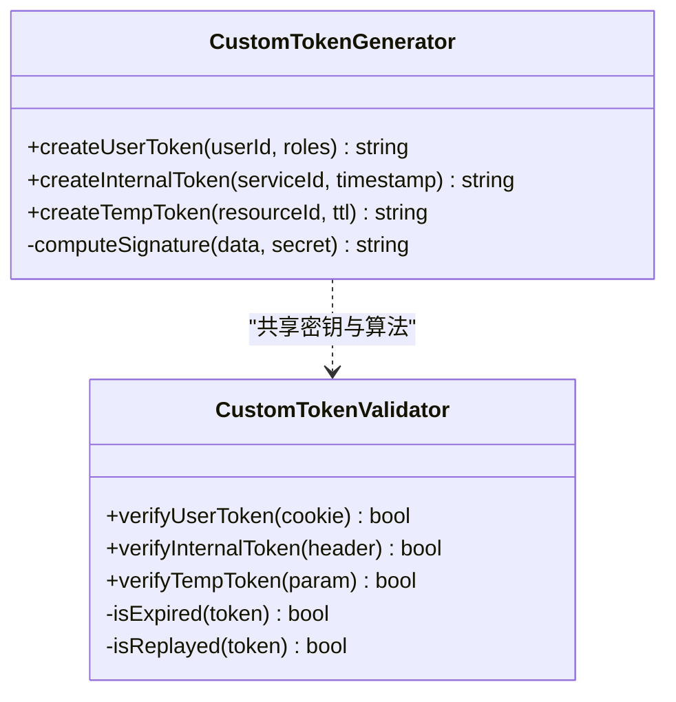
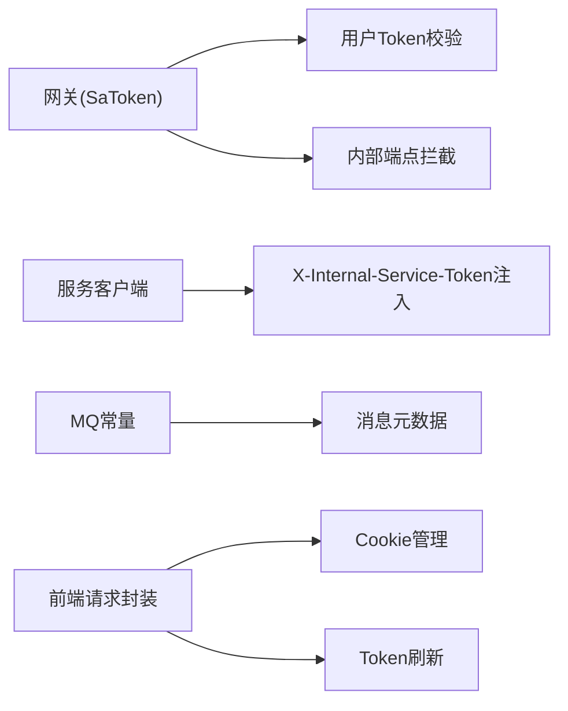

# Token策略

<cite>
**本文引用的文件**   
- [zxyz-gateway/src/main/java/uno/acloud/gateway/filter/SaTokenFilterConfig.java](file://ZXYZdatabaseBack/zxyz-gateway/src/main/java/uno/acloud/gateway/filter/SaTokenFilterConfig.java)
- [zxyz-common/src/main/java/uno/acloud/satoken/SaTokenUtil.java](file://ZXYZdatabaseBack/zxyz-common/src/main/java/uno/acloud/satoken/SaTokenUtil.java)
- [zxyz-common/src/main/java/uno/acloud/common/web/WebConstants.java](file://ZXYZdatabaseBack/zxyz-common/src/main/java/uno/acloud/common/web/WebConstants.java)
- [nacos-config/zxyz-dynamic.yml](file://nacos-config/zxyz-dynamic.yml)
- [nacos-config/zxyz-static.yml](file://nacos-config/zxyz-static.yml)
- [ZXYZdatabaseFront/src/utils/request.js](file://ZXYZdatabaseFront/src/utils/request.js)
- [ZXYZdatabaseFront/src/utils/auth.js](file://ZXYZdatabaseFront/src/utils/auth.js)
- [ZXYZdatabaseBack/zxyz-common/src/main/java/uno/acloud/client/AbstractServiceClient.java](file://ZXYZdatabaseBack/zxyz-common/src/main/java/uno/acloud/client/AbstractServiceClient.java)
- [ZXYZdatabaseBack/zxyz-common/src/main/java/uno/acloud/common/mq/MqConstants.java](file://ZXYZdatabaseBack/zxyz-common/src/main/java/uno/acloud/common/mq/MqConstants.java)
</cite>

## 目录
1. [简介](#简介)
2. [项目结构](#项目结构)
3. [核心组件](#核心组件)
4. [架构总览](#架构总览)
5. [详细组件分析](#详细组件分析)
6. [依赖分析](#依赖分析)
7. [性能考虑](#性能考虑)
8. [故障排查指南](#故障排查指南)
9. [结论](#结论)
10. [附录](#附录)

## 简介
本文件为 ZXYZ 项目的 Token 策略文档，覆盖三类 Token：
- 用户 Token（HttpOnly Cookie）：用于浏览器与后端之间的身份认证与会话管理。
- 服务间 Token（X-Internal-Service-Token）：用于微服务内部调用鉴权，禁止公网访问。
- 临时访问 Token：用于短期、受限的访问授权（如分享链接、一次性操作）。

文档涵盖 Token 生成算法（UUID 规则、签名计算、有效期）、传播机制（请求头、服务间调用、消息队列）、安全策略（加密传输、防重放、最小权限）、刷新与失效处理，以及自定义生成器与验证器的实现要点和异常处理建议。

## 项目结构
ZXYZ 采用微服务架构，前端通过网关统一入口，后端服务之间通过 ServiceClient + X-Internal-Service-Token 进行鉴权，异步通信使用 RabbitMQ Topic Exchange zxyz.topic。内部端点前缀 /api/internal/** 由网关 SaToken 过滤器拒绝公网访问。



**图表来源**
- [zxyz-gateway/src/main/java/uno/acloud/gateway/filter/SaTokenFilterConfig.java](file://ZXYZdatabaseBack/zxyz-gateway/src/main/java/uno/acloud/gateway/filter/SaTokenFilterConfig.java)
- [ZXYZdatabaseBack/zxyz-common/src/main/java/uno/acloud/client/AbstractServiceClient.java](file://ZXYZdatabaseBack/zxyz-common/src/main/java/uno/acloud/client/AbstractServiceClient.java)
- [ZXYZdatabaseBack/zxyz-common/src/main/java/uno/acloud/common/mq/MqConstants.java](file://ZXYZdatabaseBack/zxyz-common/src/main/java/uno/acloud/common/mq/MqConstants.java)

**章节来源**
- [zxyz-gateway/src/main/java/uno/acloud/gateway/filter/SaTokenFilterConfig.java](file://ZXYZdatabaseBack/zxyz-gateway/src/main/java/uno/acloud/gateway/filter/SaTokenFilterConfig.java)
- [ZXYZdatabaseBack/zxyz-common/src/main/java/uno/acloud/client/AbstractServiceClient.java](file://ZXYZdatabaseBack/zxyz-common/src/main/java/uno/acloud/client/AbstractServiceClient.java)
- [ZXYZdatabaseBack/zxyz-common/src/main/java/uno/acloud/common/mq/MqConstants.java](file://ZXYZdatabaseBack/zxyz-common/src/main/java/uno/acloud/common/mq/MqConstants.java)

## 核心组件
- 网关 SaToken 过滤器：负责用户 Token 校验、内部端点拦截、跨域与路由转发。
- SaToken 工具类：封装会话、Token 生命周期与上下文获取。
- Web 常量：定义请求头、Cookie、内部调用头等关键常量。
- Nacos 动态配置：集中管理 Token 相关开关、超时、白名单等。
- 前端请求封装：自动携带 Cookie、处理响应码与错误。
- 服务客户端：在内部调用时注入 X-Internal-Service-Token。
- MQ 常量：定义 Topic 命名规范与消息元数据字段。

**章节来源**
- [zxyz-gateway/src/main/java/uno/acloud/gateway/filter/SaTokenFilterConfig.java](file://ZXYZdatabaseBack/zxyz-gateway/src/main/java/uno/acloud/gateway/filter/SaTokenFilterConfig.java)
- [zxyz-common/src/main/java/uno/acloud/satoken/SaTokenUtil.java](file://ZXYZdatabaseBack/zxyz-common/src/main/java/uno/acloud/satoken/SaTokenUtil.java)
- [zxyz-common/src/main/java/uno/acloud/common/web/WebConstants.java](file://ZXYZdatabaseBack/zxyz-common/src/main/java/uno/acloud/common/web/WebConstants.java)
- [nacos-config/zxyz-dynamic.yml](file://nacos-config/zxyz-dynamic.yml)
- [nacos-config/zxyz-static.yml](file://nacos-config/zxyz-static.yml)
- [ZXYZdatabaseFront/src/utils/request.js](file://ZXYZdatabaseFront/src/utils/request.js)
- [ZXYZdatabaseFront/src/utils/auth.js](file://ZXYZdatabaseFront/src/utils/auth.js)
- [ZXYZdatabaseBack/zxyz-common/src/main/java/uno/acloud/client/AbstractServiceClient.java](file://ZXYZdatabaseBack/zxyz-common/src/main/java/uno/acloud/client/AbstractServiceClient.java)
- [ZXYZdatabaseBack/zxyz-common/src/main/java/uno/acloud/common/mq/MqConstants.java](file://ZXYZdatabaseBack/zxyz-common/src/main/java/uno/acloud/common/mq/MqConstants.java)

## 架构总览
下图展示用户登录到受保护资源访问的完整流程，包括网关鉴权、会话建立、内部服务调用与消息队列中的 Token 携带。

```mermaid
sequenceDiagram
participant U as "用户浏览器"
participant G as "网关(SaToken)"
participant S as "业务服务"
participant R as "Redis(会话)"
participant M as "RabbitMQ"
U->>G : "POST /api/auth/login (HttpOnly Cookie)"
G->>S : "转发登录请求"
S->>R : "创建会话并写入 UUID Token"
S-->>G : "返回成功(设置 HttpOnly Cookie)"
G-->>U : "Set-Cookie : token=UUID; HttpOnly"
U->>G : "GET /api/resource (携带 Cookie)"
G->>G : "SaToken 校验 Cookie"
G->>R : "读取会话"
R-->>G : "返回用户上下文"
G->>S : "转发请求(携带用户上下文)"
S->>M : "发送消息(携带 X-Internal-Service-Token)"
M-->>S : "消费消息(校验内部Token)"
S-->>G : "返回结果"
G-->>U : "返回数据"
```

**图表来源**
- [zxyz-gateway/src/main/java/uno/acloud/gateway/filter/SaTokenFilterConfig.java](file://ZXYZdatabaseBack/zxyz-gateway/src/main/java/uno/acloud/gateway/filter/SaTokenFilterConfig.java)
- [zxyz-common/src/main/java/uno/acloud/satoken/SaTokenUtil.java](file://ZXYZdatabaseBack/zxyz-common/src/main/java/uno/acloud/satoken/SaTokenUtil.java)
- [ZXYZdatabaseBack/zxyz-common/src/main/java/uno/acloud/client/AbstractServiceClient.java](file://ZXYZdatabaseBack/zxyz-common/src/main/java/uno/acloud/client/AbstractServiceClient.java)
- [ZXYZdatabaseBack/zxyz-common/src/main/java/uno/acloud/common/mq/MqConstants.java](file://ZXYZdatabaseBack/zxyz-common/src/main/java/uno/acloud/common/mq/MqConstants.java)

## 详细组件分析

### 用户 Token（HttpOnly Cookie）
- 生成与存储
  - 登录成功后生成 UUID 作为 Token，写入 Redis 会话，并通过 Set-Cookie 下发 HttpOnly Cookie。
  - 会话中保存用户标识、角色、团队空间等最小必要信息。
- 传播与校验
  - 浏览器每次请求自动携带 Cookie；网关 SaToken 过滤器解析并校验，失败则拒绝访问。
  - 业务服务从 SaToken 上下文获取当前用户信息，避免重复鉴权。
- 刷新与失效
  - 支持滑动过期：活跃请求触发续期；长时间不活跃则失效。
  - 手动登出会主动删除会话并清除 Cookie。
- 安全策略
  - 仅通过 HTTPS 传输；Cookie 标记 HttpOnly、Secure、SameSite。
  - 最小权限原则：会话中不包含敏感数据，仅保留鉴权所需字段。



**图表来源**
- [zxyz-gateway/src/main/java/uno/acloud/gateway/filter/SaTokenFilterConfig.java](file://ZXYZdatabaseBack/zxyz-gateway/src/main/java/uno/acloud/gateway/filter/SaTokenFilterConfig.java)
- [zxyz-common/src/main/java/uno/acloud/satoken/SaTokenUtil.java](file://ZXYZdatabaseBack/zxyz-common/src/main/java/uno/acloud/satoken/SaTokenUtil.java)
- [ZXYZdatabaseFront/src/utils/request.js](file://ZXYZdatabaseFront/src/utils/request.js)
- [ZXYZdatabaseFront/src/utils/auth.js](file://ZXYZdatabaseFront/src/utils/auth.js)

**章节来源**
- [zxyz-gateway/src/main/java/uno/acloud/gateway/filter/SaTokenFilterConfig.java](file://ZXYZdatabaseBack/zxyz-gateway/src/main/java/uno/acloud/gateway/filter/SaTokenFilterConfig.java)
- [zxyz-common/src/main/java/uno/acloud/satoken/SaTokenUtil.java](file://ZXYZdatabaseBack/zxyz-common/src/main/java/uno/acloud/satoken/SaTokenUtil.java)
- [ZXYZdatabaseFront/src/utils/request.js](file://ZXYZdatabaseFront/src/utils/request.js)
- [ZXYZdatabaseFront/src/utils/auth.js](file://ZXYZdatabaseFront/src/utils/auth.js)

### 服务间 Token（X-Internal-Service-Token）
- 用途与范围
  - 仅用于微服务内部同步调用，禁止公网暴露；内部端点统一以 /api/internal/** 前缀。
- 生成与传递
  - 调用方在服务客户端发起请求时，注入 X-Internal-Service-Token 请求头。
  - 令牌值可包含服务标识、时间戳与签名，接收方校验签名与时效。
- 校验与拒绝
  - 网关对 /api/internal/** 路径强制拒绝外部访问；服务侧校验 Token 合法性与权限。
- 最佳实践
  - 窄端点与投影模式：内部接口只返回调用方需要的 Projection VO。
  - 避免在 Token 中携带敏感数据；必要时使用短期有效且不可重放的签名。



**图表来源**
- [zxyz-gateway/src/main/java/uno/acloud/gateway/filter/SaTokenFilterConfig.java](file://ZXYZdatabaseBack/zxyz-gateway/src/main/java/uno/acloud/gateway/filter/SaTokenFilterConfig.java)
- [ZXYZdatabaseBack/zxyz-common/src/main/java/uno/acloud/client/AbstractServiceClient.java](file://ZXYZdatabaseBack/zxyz-common/src/main/java/uno/acloud/client/AbstractServiceClient.java)
- [zxyz-common/src/main/java/uno/acloud/common/web/WebConstants.java](file://ZXYZdatabaseBack/zxyz-common/src/main/java/uno/acloud/common/web/WebConstants.java)

**章节来源**
- [zxyz-gateway/src/main/java/uno/acloud/gateway/filter/SaTokenFilterConfig.java](file://ZXYZdatabaseBack/zxyz-gateway/src/main/java/uno/acloud/gateway/filter/SaTokenFilterConfig.java)
- [ZXYZdatabaseBack/zxyz-common/src/main/java/uno/acloud/client/AbstractServiceClient.java](file://ZXYZdatabaseBack/zxyz-common/src/main/java/uno/acloud/client/AbstractServiceClient.java)
- [zxyz-common/src/main/java/uno/acloud/common/web/WebConstants.java](file://ZXYZdatabaseBack/zxyz-common/src/main/java/uno/acloud/common/web/WebConstants.java)

### 临时访问 Token
- 适用场景
  - 分享链接、一次性下载、限时预览等短期授权。
- 生成与校验
  - 基于 UUID + 签名（含资源ID、过期时间、随机数），服务端校验签名与有效期。
  - 支持一次性使用：首次使用后标记已用或立即失效。
- 传播方式
  - URL 参数或短链；服务端解析后校验，不持久化到 Cookie。
- 安全策略
  - 严格限制作用域与权限；过期即失效；防止重放（随机数+一次性标记）。



[本节为概念性说明，未直接分析具体文件]

### Token 生成算法
- UUID 生成规则
  - 使用标准 UUID v4，确保唯一性与不可预测性。
- 签名计算
  - 将必要字段（如主体、资源、时间戳、随机数）按固定顺序拼接，使用 HMAC-SHA256 或对称密钥签名。
  - 签名值附加于 Token 或独立字段，接收方使用相同密钥校验。
- 有效期管理
  - 用户 Token：会话级有效期，支持滑动续期。
  - 服务间 Token：短时效（秒级），防止重放。
  - 临时 Token：分钟级时效，一次性使用。



**图表来源**
- [zxyz-common/src/main/java/uno/acloud/satoken/SaTokenUtil.java](file://ZXYZdatabaseBack/zxyz-common/src/main/java/uno/acloud/satoken/SaTokenUtil.java)
- [zxyz-common/src/main/java/uno/acloud/common/web/WebConstants.java](file://ZXYZdatabaseBack/zxyz-common/src/main/java/uno/acloud/common/web/WebConstants.java)

**章节来源**
- [zxyz-common/src/main/java/uno/acloud/satoken/SaTokenUtil.java](file://ZXYZdatabaseBack/zxyz-common/src/main/java/uno/acloud/satoken/SaTokenUtil.java)
- [zxyz-common/src/main/java/uno/acloud/common/web/WebConstants.java](file://ZXYZdatabaseBack/zxyz-common/src/main/java/uno/acloud/common/web/WebConstants.java)

### Token 传播机制
- 请求头传递
  - 用户 Token：通过 HttpOnly Cookie 自动携带。
  - 服务间 Token：通过 X-Internal-Service-Token 请求头显式传递。
  - 临时 Token：通过 URL 参数或短链传递。
- 服务间调用
  - 使用 ServiceClient 统一注入内部 Token，避免手工拼装。
- 消息队列中的 Token 携带
  - 在消息体或消息头中携带 X-Internal-Service-Token，消费者校验后再执行业务逻辑。



**图表来源**
- [ZXYZdatabaseBack/zxyz-common/src/main/java/uno/acloud/client/AbstractServiceClient.java](file://ZXYZdatabaseBack/zxyz-common/src/main/java/uno/acloud/client/AbstractServiceClient.java)
- [ZXYZdatabaseBack/zxyz-common/src/main/java/uno/acloud/common/mq/MqConstants.java](file://ZXYZdatabaseBack/zxyz-common/src/main/java/uno/acloud/common/mq/MqConstants.java)

**章节来源**
- [ZXYZdatabaseBack/zxyz-common/src/main/java/uno/acloud/client/AbstractServiceClient.java](file://ZXYZdatabaseBack/zxyz-common/src/main/java/uno/acloud/client/AbstractServiceClient.java)
- [ZXYZdatabaseBack/zxyz-common/src/main/java/uno/acloud/common/mq/MqConstants.java](file://ZXYZdatabaseBack/zxyz-common/src/main/java/uno/acloud/common/mq/MqConstants.java)

### Token 安全策略
- 加密传输
  - 全站 HTTPS；Cookie 标记 Secure；内部调用建议使用 mTLS（可选）。
- 防重放攻击
  - 服务间 Token 加入时间戳与随机数，服务端校验时效与唯一性。
  - 临时 Token 一次性使用后立即失效。
- 权限最小化
  - 会话与 Token 仅包含必要信息；内部接口返回投影 VO，避免泄露多余数据。
  - 网关层对内部端点强拦截，禁止公网访问。

**章节来源**
- [zxyz-gateway/src/main/java/uno/acloud/gateway/filter/SaTokenFilterConfig.java](file://ZXYZdatabaseBack/zxyz-gateway/src/main/java/uno/acloud/gateway/filter/SaTokenFilterConfig.java)
- [zxyz-common/src/main/java/uno/acloud/common/web/WebConstants.java](file://ZXYZdatabaseBack/zxyz-common/src/main/java/uno/acloud/common/web/WebConstants.java)

### Token 刷新机制
- 自动续期
  - 用户 Token 在接近过期时，网关或服务触发滑动续期，延长会话有效期。
- 手动刷新
  - 提供刷新接口，前端在 Token 即将过期时主动调用，更新 Cookie。
- 失效处理
  - 会话不存在或签名失败时，返回统一错误码；前端引导重新登录。



**图表来源**
- [ZXYZdatabaseFront/src/utils/request.js](file://ZXYZdatabaseFront/src/utils/request.js)
- [ZXYZdatabaseFront/src/utils/auth.js](file://ZXYZdatabaseFront/src/utils/auth.js)

**章节来源**
- [ZXYZdatabaseFront/src/utils/request.js](file://ZXYZdatabaseFront/src/utils/request.js)
- [ZXYZdatabaseFront/src/utils/auth.js](file://ZXYZdatabaseFront/src/utils/auth.js)

### 自定义 Token 生成器与验证器示例
- 生成器
  - 实现 UUID 生成、签名计算、有效期设置。
  - 提供用户 Token、内部 Token、临时 Token 的工厂方法。
- 验证器
  - 实现签名校验、时效检查、重放检测。
  - 针对不同 Token 类型提供专用校验逻辑。
- 异常处理
  - 统一错误码与消息；记录审计日志；区分网络错误与鉴权失败。



[本节为概念性说明，未直接分析具体文件]

## 依赖分析
- 网关依赖 SaToken 过滤器进行用户 Token 校验与内部端点拦截。
- 服务间调用依赖 AbstractServiceClient 注入 X-Internal-Service-Token。
- MQ 消息依赖 MqConstants 定义 Topic 与消息元数据。
- 前端依赖 request.js 与 auth.js 管理 Cookie 与刷新逻辑。



**图表来源**
- [zxyz-gateway/src/main/java/uno/acloud/gateway/filter/SaTokenFilterConfig.java](file://ZXYZdatabaseBack/zxyz-gateway/src/main/java/uno/acloud/gateway/filter/SaTokenFilterConfig.java)
- [ZXYZdatabaseBack/zxyz-common/src/main/java/uno/acloud/client/AbstractServiceClient.java](file://ZXYZdatabaseBack/zxyz-common/src/main/java/uno/acloud/client/AbstractServiceClient.java)
- [ZXYZdatabaseBack/zxyz-common/src/main/java/uno/acloud/common/mq/MqConstants.java](file://ZXYZdatabaseBack/zxyz-common/src/main/java/uno/acloud/common/mq/MqConstants.java)
- [ZXYZdatabaseFront/src/utils/request.js](file://ZXYZdatabaseFront/src/utils/request.js)
- [ZXYZdatabaseFront/src/utils/auth.js](file://ZXYZdatabaseFront/src/utils/auth.js)

**章节来源**
- [zxyz-gateway/src/main/java/uno/acloud/gateway/filter/SaTokenFilterConfig.java](file://ZXYZdatabaseBack/zxyz-gateway/src/main/java/uno/acloud/gateway/filter/SaTokenFilterConfig.java)
- [ZXYZdatabaseBack/zxyz-common/src/main/java/uno/acloud/client/AbstractServiceClient.java](file://ZXYZdatabaseBack/zxyz-common/src/main/java/uno/acloud/client/AbstractServiceClient.java)
- [ZXYZdatabaseBack/zxyz-common/src/main/java/uno/acloud/common/mq/MqConstants.java](file://ZXYZdatabaseBack/zxyz-common/src/main/java/uno/acloud/common/mq/MqConstants.java)
- [ZXYZdatabaseFront/src/utils/request.js](file://ZXYZdatabaseFront/src/utils/request.js)
- [ZXYZdatabaseFront/src/utils/auth.js](file://ZXYZdatabaseFront/src/utils/auth.js)

## 性能考虑
- 减少 Token 体积：仅包含必要字段，避免大对象序列化。
- 缓存热点数据：用户上下文可缓存短时数据，降低 Redis 压力。
- 批量刷新：前端合并多次刷新请求，减少网络开销。
- 限流与熔断：对刷新接口与内部调用进行限流，防止雪崩。

[本节为通用指导，未直接分析具体文件]

## 故障排查指南
- 常见问题
  - Cookie 未携带：检查浏览器设置与跨域配置。
  - 内部 Token 无效：核对签名算法、密钥一致性与时效。
  - 临时 Token 失效：确认一次性使用标记与过期时间。
- 调试步骤
  - 查看网关日志与 SaToken 过滤器输出。
  - 检查 Redis 会话是否存在与状态。
  - 验证 MQ 消息头是否包含内部 Token。
- 日志与监控
  - 记录鉴权失败原因与来源 IP。
  - 监控 Token 刷新成功率与延迟。

**章节来源**
- [zxyz-gateway/src/main/java/uno/acloud/gateway/filter/SaTokenFilterConfig.java](file://ZXYZdatabaseBack/zxyz-gateway/src/main/java/uno/acloud/gateway/filter/SaTokenFilterConfig.java)
- [zxyz-common/src/main/java/uno/acloud/satoken/SaTokenUtil.java](file://ZXYZdatabaseBack/zxyz-common/src/main/java/uno/acloud/satoken/SaTokenUtil.java)

## 结论
ZXYZ 项目的 Token 策略围绕用户 Token（HttpOnly Cookie）、服务间 Token（X-Internal-Service-Token）与临时访问 Token 构建，结合网关 SaToken 过滤器、服务客户端与 MQ 常量，形成完整的鉴权与传播体系。通过严格的生成算法、安全策略与刷新机制，保障系统的安全性与可用性。建议在扩展新功能时遵循最小权限与窄端点原则，保持 Token 的简洁与安全。

[本节为总结性内容，未直接分析具体文件]

## 附录
- 配置参考
  - Nacos 动态配置：zxyz-dynamic.yml、zxyz-static.yml。
  - 前端请求封装：request.js、auth.js。
- 最佳实践清单
  - 所有内部端点使用 /api/internal/** 前缀。
  - 服务间调用必须携带 X-Internal-Service-Token。
  - 临时 Token 一次性使用并严格限制作用域。
  - 全站 HTTPS，Cookie 标记 HttpOnly、Secure、SameSite。

**章节来源**
- [nacos-config/zxyz-dynamic.yml](file://nacos-config/zxyz-dynamic.yml)
- [nacos-config/zxyz-static.yml](file://nacos-config/zxyz-static.yml)
- [ZXYZdatabaseFront/src/utils/request.js](file://ZXYZdatabaseFront/src/utils/request.js)
- [ZXYZdatabaseFront/src/utils/auth.js](file://ZXYZdatabaseFront/src/utils/auth.js)