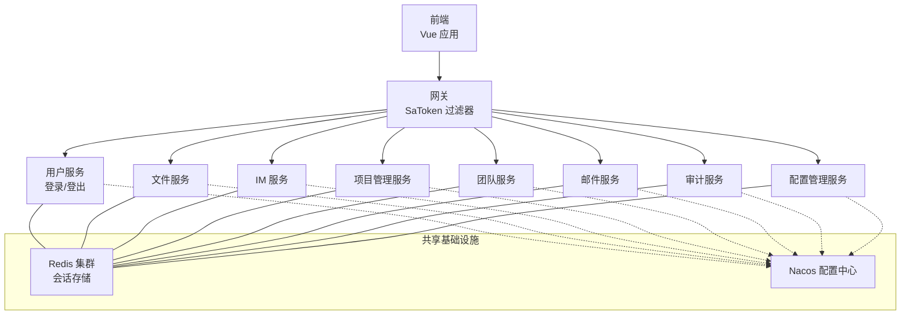
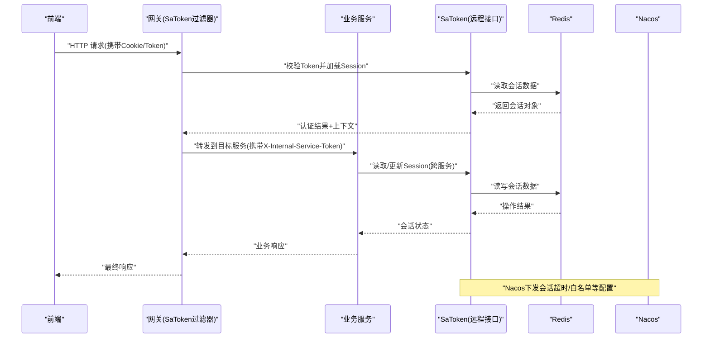
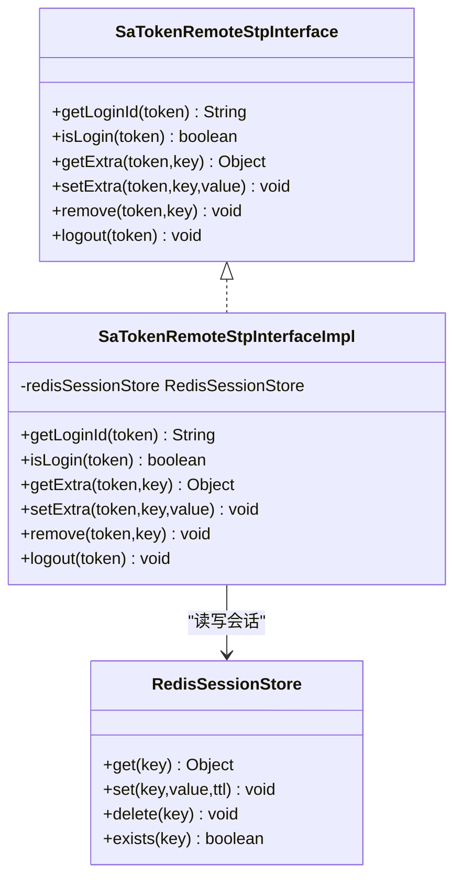
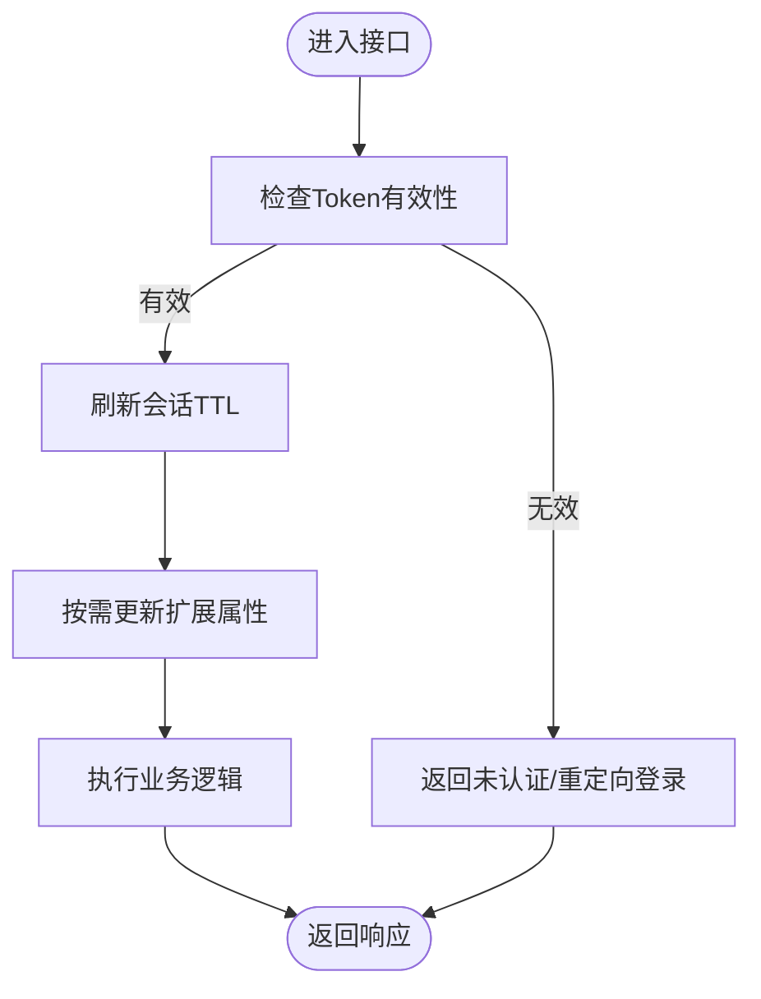
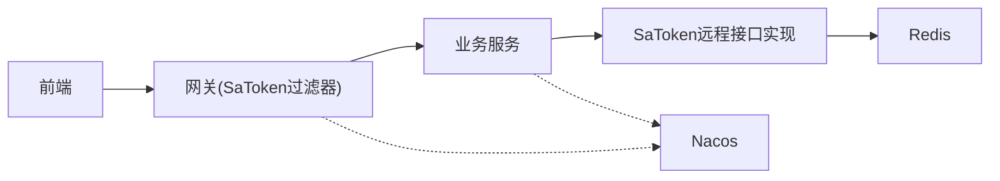

# 会话管理

<cite>
**本文引用的文件**
- [zxyz-admin-service/SaTokenConfigure.java](file://ZXYZdatabaseBack/zxyz-admin-service/src/main/java/uno/acloud/admin/config/SaTokenConfigure.java)
- [zxyz-common/satoken/SaTokenRemoteStpInterfaceImpl.java](file://ZXYZdatabaseBack/zxyz-common/src/main/java/uno/acloud/common/satoken/SaTokenRemoteStpInterfaceImpl.java)
- [zxyz-gateway/filter/SaTokenFilterConfig.java](file://ZXYZdatabaseBack/zxyz-gateway/src/main/java/uno/acloud/gateway/filter/SaTokenFilterConfig.java)
- [nacos-config/zxyz-dynamic.yml](file://nacos-config/zxyz-dynamic.yml)
- [nacos-config/zxyz-static.yml](file://nacos-config/zxyz-static.yml)
- [docker-compose.yml](file://docker-compose.yml)
- [ZXYZdatabaseFront/src/store/session.js](file://ZXYZdatabaseFront/src/store/session.js)
- [ZXYZdatabaseFront/src/utils/request.js](file://ZXYZdatabaseFront/src/utils/request.js)
- [ZXYZdatabaseFront/src/api/auth.js](file://ZXYZdatabaseFront/src/api/auth.js)
</cite>

## 目录
1. [简介](#简介)
2. [项目结构](#项目结构)
3. [核心组件](#核心组件)
4. [架构总览](#架构总览)
5. [详细组件分析](#详细组件分析)
6. [依赖关系分析](#依赖关系分析)
7. [性能考量](#性能考量)
8. [故障排查指南](#故障排查指南)
9. [结论](#结论)
10. [附录](#附录)

## 简介
本文件面向 ZXYZ 微服务项目的“会话管理”主题，系统性阐述分布式会话的存储、序列化与过期策略；SaToken 的 RemoteStpInterface 跨服务同步与 Token 传播机制；会话生命周期（创建、更新、销毁）及主动登出与超时处理；多服务环境下的会话共享（Nacos 配置中心、Redis 集群部署、会话复制策略）；以及安全考虑（CSRF 防护、会话固定攻击防护、敏感信息脱敏）。文末提供扩展自定义会话属性与会话监控的实现指引。

## 项目结构
ZXYZ 后端采用多模块 Maven 工程，前端为 Vue 3 + Pinia。会话相关的关键位置包括：
- 网关层：SaToken 过滤器统一鉴权与 Token 透传
- 公共模块：SaToken 远程接口实现（跨服务 Session 同步）
- 各业务服务：通过 SaToken 配置启用 Redis 会话存储与过期策略
- Nacos：集中化配置（动态与静态）
- 前端：Cookie/Session 状态管理与请求拦截器

图表来源
- [zxyz-gateway/filter/SaTokenFilterConfig.java](file://ZXYZdatabaseBack/zxyz-gateway/src/main/java/uno/acloud/gateway/filter/SaTokenFilterConfig.java)
- [zxyz-common/satoken/SaTokenRemoteStpInterfaceImpl.java](file://ZXYZdatabaseBack/zxyz-common/src/main/java/uno/acloud/common/satoken/SaTokenRemoteStpInterfaceImpl.java)
- [nacos-config/zxyz-dynamic.yml](file://nacos-config/zxyz-dynamic.yml)
- [nacos-config/zxyz-static.yml](file://nacos-config/zxyz-static.yml)
- [docker-compose.yml](file://docker-compose.yml)

章节来源
- [zxyz-gateway/filter/SaTokenFilterConfig.java](file://ZXYZdatabaseBack/zxyz-gateway/src/main/java/uno/acloud/gateway/filter/SaTokenFilterConfig.java)
- [zxyz-common/satoken/SaTokenRemoteStpInterfaceImpl.java](file://ZXYZdatabaseBack/zxyz-common/src/main/java/uno/acloud/common/satoken/SaTokenRemoteStpInterfaceImpl.java)
- [nacos-config/zxyz-dynamic.yml](file://nacos-config/zxyz-dynamic.yml)
- [nacos-config/zxyz-static.yml](file://nacos-config/zxyz-static.yml)
- [docker-compose.yml](file://docker-compose.yml)

## 核心组件
- 网关 SaToken 过滤器：统一校验 Token、注入上下文、拒绝公网访问内部端点
- SaToken 远程接口实现：基于 Redis 的跨服务 Session 读写与同步
- 各服务 SaToken 配置：启用 Redis 存储、设置过期策略、开启自动续期
- Nacos 配置中心：集中下发 Redis 连接、会话超时、白名单等参数
- 前端会话 Store：维护本地会话状态、携带 Cookie 发起请求

章节来源
- [zxyz-gateway/filter/SaTokenFilterConfig.java](file://ZXYZdatabaseBack/zxyz-gateway/src/main/java/uno/acloud/gateway/filter/SaTokenFilterConfig.java)
- [zxyz-common/satoken/SaTokenRemoteStpInterfaceImpl.java](file://ZXYZdatabaseBack/zxyz-common/src/main/java/uno/acloud/common/satoken/SaTokenRemoteStpInterfaceImpl.java)
- [zxyz-admin-service/SaTokenConfigure.java](file://ZXYZdatabaseBack/zxyz-admin-service/src/main/java/uno/acloud/admin/config/SaTokenConfigure.java)
- [nacos-config/zxyz-dynamic.yml](file://nacos-config/zxyz-dynamic.yml)
- [nacos-config/zxyz-static.yml](file://nacos-config/zxyz-static.yml)
- [ZXYZdatabaseFront/src/store/session.js](file://ZXYZdatabaseFront/src/store/session.js)
- [ZXYZdatabaseFront/src/utils/request.js](file://ZXYZdatabaseFront/src/utils/request.js)

## 架构总览
下图展示一次受保护 API 调用的完整流程，涵盖前端、网关、业务服务、Redis 与 Nacos 的交互。

图表来源
- [zxyz-gateway/filter/SaTokenFilterConfig.java](file://ZXYZdatabaseBack/zxyz-gateway/src/main/java/uno/acloud/gateway/filter/SaTokenFilterConfig.java)
- [zxyz-common/satoken/SaTokenRemoteStpInterfaceImpl.java](file://ZXYZdatabaseBack/zxyz-common/src/main/java/uno/acloud/common/satoken/SaTokenRemoteStpInterfaceImpl.java)
- [nacos-config/zxyz-dynamic.yml](file://nacos-config/zxyz-dynamic.yml)

## 详细组件分析

### Redis 会话存储结构与序列化
- 键命名规范：建议以“satoken:session:{token}”作为主键，便于按 Token 定位会话
- 值结构：包含用户标识、角色/权限集合、租户/团队上下文、设备指纹、最后活跃时间、扩展字段等
- 序列化：使用 JSON 或可版本化的二进制格式，确保向后兼容与跨语言可读性
- 过期策略：会话 TTL 由 Nacos 配置驱动，支持滑动过期（每次访问刷新 TTL）
- 分片与集群：按 Token 哈希分片，避免热点 Key；大会话拆分子 Key 降低单 Key 体积

章节来源
- [zxyz-common/satoken/SaTokenRemoteStpInterfaceImpl.java](file://ZXYZdatabaseBack/zxyz-common/src/main/java/uno/acloud/common/satoken/SaTokenRemoteStpInterfaceImpl.java)
- [nacos-config/zxyz-dynamic.yml](file://nacos-config/zxyz-dynamic.yml)

### SaToken 的 RemoteStpInterface 实现与跨服务同步
- 接口职责：定义 getLoginId、isLogin、getExtra、setExtra、remove、logout 等能力
- 跨服务同步：所有服务通过同一 Redis 实例/集群读写会话，保证一致性
- Token 传播：网关将 Token 透传到下游服务，服务间调用附加 X-Internal-Service-Token 做内网鉴权
- 状态一致性：写路径先写 Redis，再触发必要的事件（如审计日志），读路径直连 Redis

图表来源
- [zxyz-common/satoken/SaTokenRemoteStpInterfaceImpl.java](file://ZXYZdatabaseBack/zxyz-common/src/main/java/uno/acloud/common/satoken/SaTokenRemoteStpInterfaceImpl.java)

章节来源
- [zxyz-common/satoken/SaTokenRemoteStpInterfaceImpl.java](file://ZXYZdatabaseBack/zxyz-common/src/main/java/uno/acloud/common/satoken/SaTokenRemoteStpInterfaceImpl.java)

### 会话生命周期管理（创建、更新、销毁）
- 创建：登录成功后生成 Token，写入 Redis，设置初始 TTL，前端保存 Cookie
- 更新：每次访问刷新 TTL（滑动过期），可更新扩展属性（如设备信息、最近访问服务）
- 销毁：主动登出删除 Redis 中的会话；超时由 Redis TTL 自动清理
- 主动登出：调用 logout 接口，清除会话并广播登出事件（可选）

图表来源
- [zxyz-gateway/filter/SaTokenFilterConfig.java](file://ZXYZdatabaseBack/zxyz-gateway/src/main/java/uno/acloud/gateway/filter/SaTokenFilterConfig.java)
- [zxyz-common/satoken/SaTokenRemoteStpInterfaceImpl.java](file://ZXYZdatabaseBack/zxyz-common/src/main/java/uno/acloud/common/satoken/SaTokenRemoteStpInterfaceImpl.java)

章节来源
- [zxyz-gateway/filter/SaTokenFilterConfig.java](file://ZXYZdatabaseBack/zxyz-gateway/src/main/java/uno/acloud/gateway/filter/SaTokenFilterConfig.java)
- [zxyz-common/satoken/SaTokenRemoteStpInterfaceImpl.java](file://ZXYZdatabaseBack/zxyz-common/src/main/java/uno/acloud/common/satoken/SaTokenRemoteStpInterfaceImpl.java)

### 多服务环境下的会话共享
- Nacos 配置中心：集中管理 Redis 连接、会话超时、白名单、限流等参数，支持热更新
- Redis 集群部署：多节点高可用，按 Key 分片；注意大 Key 拆分与慢查询治理
- 会话复制策略：基于 Redis 的单一事实源，无需额外复制；必要时通过事件总线同步非关键状态

章节来源
- [nacos-config/zxyz-dynamic.yml](file://nacos-config/zxyz-dynamic.yml)
- [nacos-config/zxyz-static.yml](file://nacos-config/zxyz-static.yml)
- [docker-compose.yml](file://docker-compose.yml)

### 安全考虑
- CSRF 防护：优先使用 HttpOnly Cookie + SameSite=Strict/Lax；对无状态 API 使用 Bearer Token 并校验 Referer/Origin
- 会话固定攻击防护：登录后强制刷新 Token；敏感操作要求二次确认
- 敏感信息脱敏：会话中不存放密码、密钥等敏感数据；如需记录，必须脱敏或加密
- 内网访问控制：内部端点 /api/internal/** 仅允许网关与可信服务访问，通过 X-Internal-Service-Token 鉴权

章节来源
- [zxyz-gateway/filter/SaTokenFilterConfig.java](file://ZXYZdatabaseBack/zxyz-gateway/src/main/java/uno/acloud/gateway/filter/SaTokenFilterConfig.java)
- [nacos-config/zxyz-dynamic.yml](file://nacos-config/zxyz-dynamic.yml)

### 代码示例：扩展自定义会话属性与会话监控
- 扩展自定义属性：在 SaToken 远程接口的 setExtra/getExtra 中增加字段，并在登录成功后初始化默认值
- 会话监控：在 Redis 读写前后埋点，统计命中率、平均延迟、Key 大小分布、过期数量
- 审计与告警：对异常登录、频繁失败、超大会话进行审计与告警

章节来源
- [zxyz-common/satoken/SaTokenRemoteStpInterfaceImpl.java](file://ZXYZdatabaseBack/zxyz-common/src/main/java/uno/acloud/common/satoken/SaTokenRemoteStpInterfaceImpl.java)

## 依赖关系分析
- 网关依赖 SaToken 过滤器，负责统一鉴权与 Token 透传
- 业务服务依赖 SaToken 远程接口实现，通过 Redis 共享会话
- Nacos 为所有服务提供运行时配置
- 前端通过 Cookie 与请求拦截器配合后端完成认证

图表来源
- [zxyz-gateway/filter/SaTokenFilterConfig.java](file://ZXYZdatabaseBack/zxyz-gateway/src/main/java/uno/acloud/gateway/filter/SaTokenFilterConfig.java)
- [zxyz-common/satoken/SaTokenRemoteStpInterfaceImpl.java](file://ZXYZdatabaseBack/zxyz-common/src/main/java/uno/acloud/common/satoken/SaTokenRemoteStpInterfaceImpl.java)
- [nacos-config/zxyz-dynamic.yml](file://nacos-config/zxyz-dynamic.yml)

章节来源
- [zxyz-gateway/filter/SaTokenFilterConfig.java](file://ZXYZdatabaseBack/zxyz-gateway/src/main/java/uno/acloud/gateway/filter/SaTokenFilterConfig.java)
- [zxyz-common/satoken/SaTokenRemoteStpInterfaceImpl.java](file://ZXYZdatabaseBack/zxyz-common/src/main/java/uno/acloud/common/satoken/SaTokenRemoteStpInterfaceImpl.java)
- [nacos-config/zxyz-dynamic.yml](file://nacos-config/zxyz-dynamic.yml)

## 性能考量
- 会话大小控制：限制扩展字段体积，避免大 Key 导致网络与序列化开销
- 滑动过期：合理设置 TTL 与刷新频率，平衡安全性与性能
- Redis 优化：连接池、Pipeline 批量操作、避免热点 Key；必要时拆分会话子 Key
- 监控指标：QPS、延迟、命中率、错误率、内存占用、慢查询

[本节为通用指导，不直接分析具体文件]

## 故障排查指南
- 无法登录：检查 Redis 连通性、Nacos 下发的会话超时配置、网关白名单
- 会话丢失：查看 Redis 是否重启、Key 是否被误删、TTL 是否过短
- 跨服务不一致：核对 Token 透传是否正确、服务间调用是否绕过网关
- 前端状态不同步：检查 Cookie 是否被浏览器策略拦截、请求拦截器是否正确携带 Token

章节来源
- [zxyz-gateway/filter/SaTokenFilterConfig.java](file://ZXYZdatabaseBack/zxyz-gateway/src/main/java/uno/acloud/gateway/filter/SaTokenFilterConfig.java)
- [ZXYZdatabaseFront/src/store/session.js](file://ZXYZdatabaseFront/src/store/session.js)
- [ZXYZdatabaseFront/src/utils/request.js](file://ZXYZdatabaseFront/src/utils/request.js)

## 结论
ZXYZ 的会话管理以 SaToken + Redis 为核心，结合 Nacos 集中配置与网关统一鉴权，实现了跨服务的会话共享与一致性。通过合理的存储结构、序列化与过期策略，以及严格的安全措施，保障了系统在高并发与多服务场景下的稳定与安全。扩展自定义属性与会话监控可进一步提升系统的可观测性与灵活性。

[本节为总结，不直接分析具体文件]

## 附录
- 前端会话状态管理参考：
  - [ZXYZdatabaseFront/src/store/session.js](file://ZXYZdatabaseFront/src/store/session.js)
  - [ZXYZdatabaseFront/src/utils/request.js](file://ZXYZdatabaseFront/src/utils/request.js)
  - [ZXYZdatabaseFront/src/api/auth.js](file://ZXYZdatabaseFront/src/api/auth.js)
- 网关与 SaToken 配置参考：
  - [zxyz-gateway/filter/SaTokenFilterConfig.java](file://ZXYZdatabaseBack/zxyz-gateway/src/main/java/uno/acloud/gateway/filter/SaTokenFilterConfig.java)
  - [zxyz-admin-service/SaTokenConfigure.java](file://ZXYZdatabaseBack/zxyz-admin-service/src/main/java/uno/acloud/admin/config/SaTokenConfigure.java)
- 会话远程接口实现参考：
  - [zxyz-common/satoken/SaTokenRemoteStpInterfaceImpl.java](file://ZXYZdatabaseBack/zxyz-common/src/main/java/uno/acloud/common/satoken/SaTokenRemoteStpInterfaceImpl.java)
- 配置中心与部署参考：
  - [nacos-config/zxyz-dynamic.yml](file://nacos-config/zxyz-dynamic.yml)
  - [nacos-config/zxyz-static.yml](file://nacos-config/zxyz-static.yml)
  - [docker-compose.yml](file://docker-compose.yml)