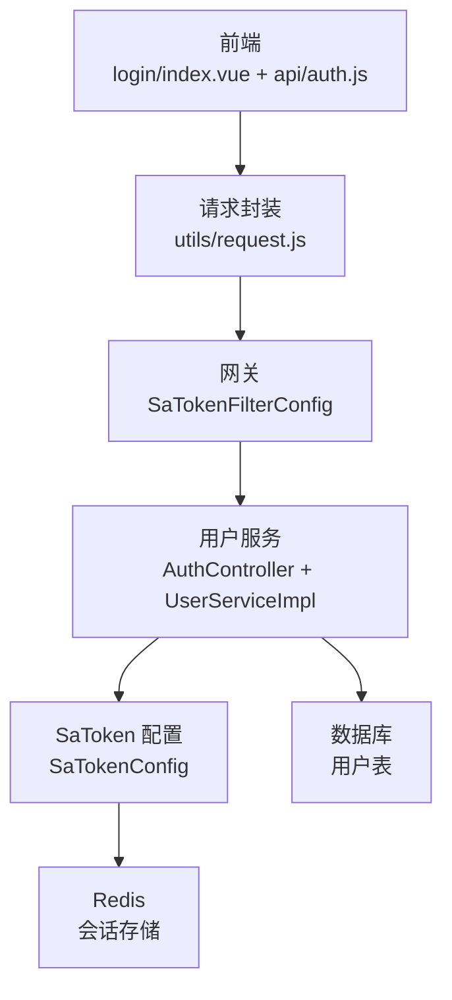
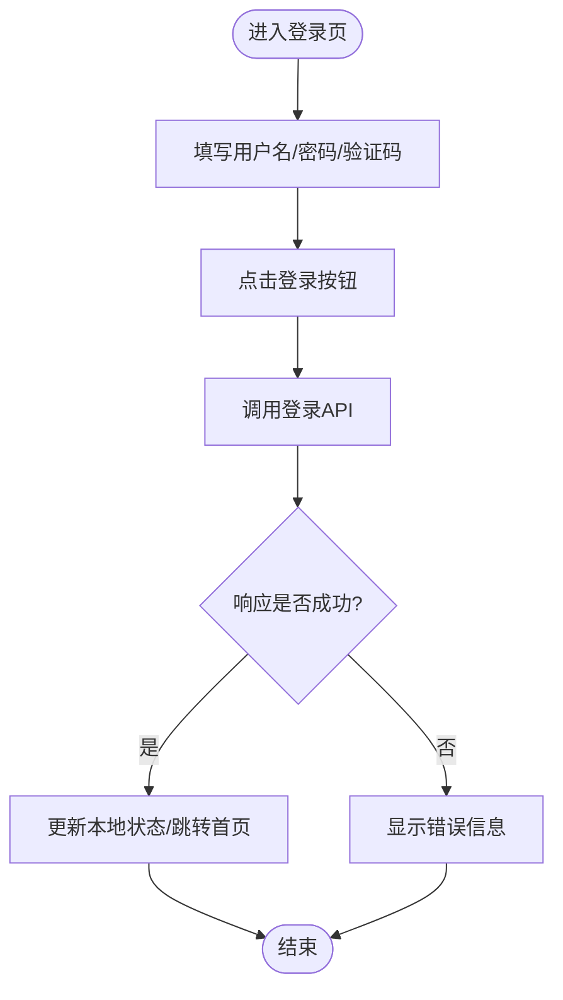
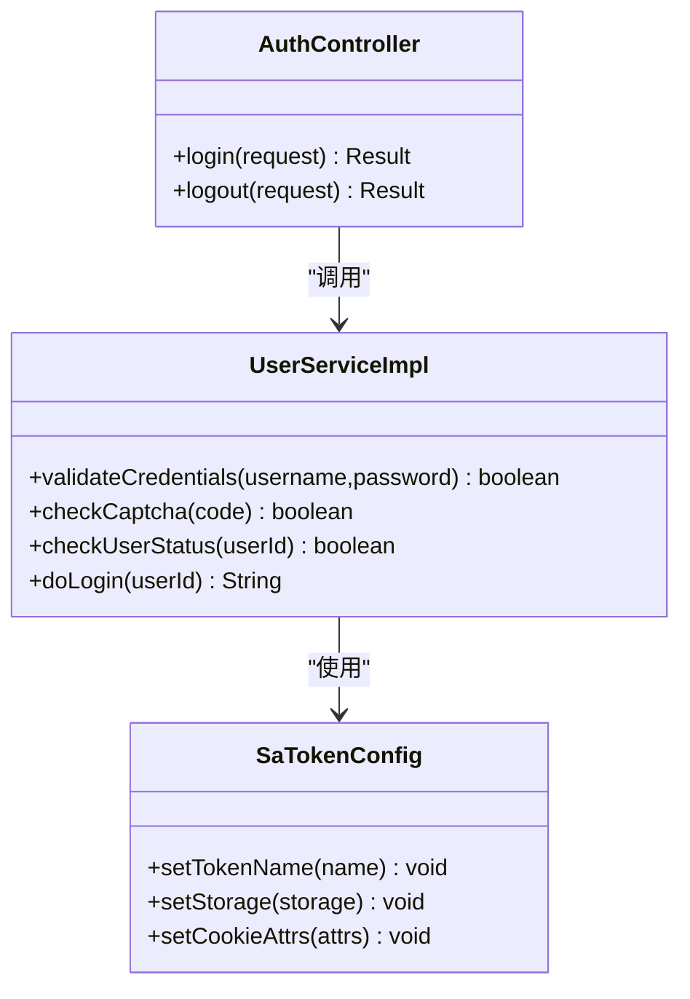
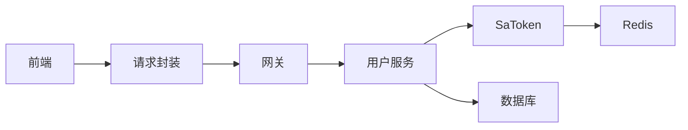

# 登录流程

<cite>
**本文引用的文件**   
- [zxyz-user-service/src/main/java/uno/acloud/user/controller/AuthController.java](file://ZXYZdatabaseBack/zxyz-user-service/src/main/java/uno/acloud/user/controller/AuthController.java)
- [zxyz-user-service/src/main/java/uno/acloud/user/service/impl/UserServiceImpl.java](file://ZXYZdatabaseBack/zxyz-user-service/src/main/java/uno/acloud/user/service/impl/UserServiceImpl.java)
- [zxyz-common/src/main/java/uno/acloud/satoken/SaTokenConfig.java](file://ZXYZdatabaseBack/zxyz-common/src/main/java/uno/acloud/satoken/SaTokenConfig.java)
- [zxyz-gateway/src/main/java/uno/acloud/gateway/filter/SaTokenFilterConfig.java](file://ZXYZdatabaseBack/zxyz-gateway/src/main/java/uno/acloud/gateway/filter/SaTokenFilterConfig.java)
- [ZXYZdatabaseFront/src/api/auth.js](file://ZXYZdatabaseFront/src/api/auth.js)
- [ZXYZdatabaseFront/src/views/login/index.vue](file://ZXYZdatabaseFront/src/views/login/index.vue)
- [ZXYZdatabaseFront/src/utils/request.js](file://ZXYZdatabaseFront/src/utils/request.js)
- [nacos-config/zxyz-user-service.yml](file://nacos-config/zxyz-user-service.yml)
- [nacos-config/zxyz-gateway.yml](file://nacos-config/zxyz-gateway.yml)
</cite>

## 目录
1. [简介](#简介)
2. [项目结构](#项目结构)
3. [核心组件](#核心组件)
4. [架构总览](#架构总览)
5. [详细组件分析](#详细组件分析)
6. [依赖关系分析](#依赖关系分析)
7. [性能考虑](#性能考虑)
8. [故障排查指南](#故障排查指南)
9. [结论](#结论)
10. [附录](#附录)

## 简介
本文件面向 ZXYZ 项目的登录流程，覆盖从前端表单提交到后端认证、会话创建与 Token 管理的全链路。重点说明：
- 用户名密码校验、验证码校验、用户状态检查
- SaToken 登录机制：StpUtil.login() 调用、会话创建、UUID token 生成策略
- 前后端交互细节：HttpOnly Cookie、跨域配置、响应格式处理
- 登录失败场景：错误码映射、异常捕获、安全日志记录
- 扩展点：自定义登录逻辑与第三方认证接入示例

## 项目结构
登录相关代码分布在前后端多个模块：
- 前端（Vue）：登录页面、API 调用封装、请求拦截器
- 网关（Gateway）：SaToken 过滤器统一鉴权
- 用户服务（User Service）：登录控制器与服务实现
- 公共模块（Common）：SaToken 配置与通用能力
- Nacos 配置：各服务的 SaToken、跨域、Cookie 等配置项



**图表来源** 
- [ZXYZdatabaseFront/src/views/login/index.vue](file://ZXYZdatabaseFront/src/views/login/index.vue)
- [ZXYZdatabaseFront/src/api/auth.js](file://ZXYZdatabaseFront/src/api/auth.js)
- [ZXYZdatabaseFront/src/utils/request.js](file://ZXYZdatabaseFront/src/utils/request.js)
- [zxyz-gateway/src/main/java/uno/acloud/gateway/filter/SaTokenFilterConfig.java](file://ZXYZdatabaseBack/zxyz-gateway/src/main/java/uno/acloud/gateway/filter/SaTokenFilterConfig.java)
- [zxyz-user-service/src/main/java/uno/acloud/user/controller/AuthController.java](file://ZXYZdatabaseBack/zxyz-user-service/src/main/java/uno/acloud/user/controller/AuthController.java)
- [zxyz-user-service/src/main/java/uno/acloud/user/service/impl/UserServiceImpl.java](file://ZXYZdatabaseBack/zxyz-user-service/src/main/java/uno/acloud/user/service/impl/UserServiceImpl.java)
- [zxyz-common/src/main/java/uno/acloud/satoken/SaTokenConfig.java](file://ZXYZdatabaseBack/zxyz-common/src/main/java/uno/acloud/satoken/SaTokenConfig.java)

**章节来源**
- [ZXYZdatabaseFront/src/views/login/index.vue](file://ZXYZdatabaseFront/src/views/login/index.vue)
- [ZXYZdatabaseFront/src/api/auth.js](file://ZXYZdatabaseFront/src/api/auth.js)
- [ZXYZdatabaseFront/src/utils/request.js](file://ZXYZdatabaseFront/src/utils/request.js)
- [zxyz-gateway/src/main/java/uno/acloud/gateway/filter/SaTokenFilterConfig.java](file://ZXYZdatabaseBack/zxyz-gateway/src/main/java/uno/acloud/gateway/filter/SaTokenFilterConfig.java)
- [zxyz-user-service/src/main/java/uno/acloud/user/controller/AuthController.java](file://ZXYZdatabaseBack/zxyz-user-service/src/main/java/uno/acloud/user/controller/AuthController.java)
- [zxyz-user-service/src/main/java/uno/acloud/user/service/impl/UserServiceImpl.java](file://ZXYZdatabaseBack/zxyz-user-service/src/main/java/uno/acloud/user/service/impl/UserServiceImpl.java)
- [zxyz-common/src/main/java/uno/acloud/satoken/SaTokenConfig.java](file://ZXYZdatabaseBack/zxyz-common/src/main/java/uno/acloud/satoken/SaTokenConfig.java)

## 核心组件
- 前端登录页与 API 层：负责收集表单数据、发送登录请求、处理响应并维护本地状态
- 网关 SaToken 过滤器：统一拦截请求、校验 Cookie 中的 Sa-Token
- 用户服务登录控制器与服务：执行用户名/密码校验、验证码校验、用户状态检查、调用 SaToken 登录
- SaToken 配置：定义 Token 类型、存储介质（Redis）、Cookie 属性（HttpOnly、SameSite、Domain/Path）
- 响应模型：统一 Result<T>，code=1 表示成功

**章节来源**
- [ZXYZdatabaseFront/src/views/login/index.vue](file://ZXYZdatabaseFront/src/views/login/index.vue)
- [ZXYZdatabaseFront/src/api/auth.js](file://ZXYZdatabaseFront/src/api/auth.js)
- [ZXYZdatabaseFront/src/utils/request.js](file://ZXYZdatabaseFront/src/utils/request.js)
- [zxyz-gateway/src/main/java/uno/acloud/gateway/filter/SaTokenFilterConfig.java](file://ZXYZdatabaseBack/zxyz-gateway/src/main/java/uno/acloud/gateway/filter/SaTokenFilterConfig.java)
- [zxyz-user-service/src/main/java/uno/acloud/user/controller/AuthController.java](file://ZXYZdatabaseBack/zxyz-user-service/src/main/java/uno/acloud/user/controller/AuthController.java)
- [zxyz-user-service/src/main/java/uno/acloud/user/service/impl/UserServiceImpl.java](file://ZXYZdatabaseBack/zxyz-user-service/src/main/java/uno/acloud/user/service/impl/UserServiceImpl.java)
- [zxyz-common/src/main/java/uno/acloud/satoken/SaTokenConfig.java](file://ZXYZdatabaseBack/zxyz-common/src/main/java/uno/acloud/satoken/SaTokenConfig.java)

## 架构总览
登录时序如下：
- 前端提交用户名、密码、验证码至后端登录接口
- 网关通过 SaToken 过滤器放行登录接口（白名单）
- 用户服务校验参数、验证码、用户状态
- 成功后调用 StpUtil.login() 创建会话，生成 UUID Token，写入 Redis
- 响应中设置 HttpOnly Cookie（Sa-Token），前端自动携带后续请求
- 后续请求经网关过滤器校验 Cookie，完成鉴权

```mermaid
sequenceDiagram
participant FE as "前端"
participant API as "请求封装"
participant GW as "网关(SaToken过滤器)"
participant UC as "用户服务(AuthController)"
participant US as "用户服务(UserService)"
participant ST as "SaToken"
participant REDIS as "Redis"
FE->>API : "POST /api/user/login {username,password,code}"
API->>GW : "HTTP 请求(带跨域头)"
GW-->>API : "放行(登录白名单)"
API->>UC : "调用登录接口"
UC->>US : "校验用户名/密码、验证码、用户状态"
US-->>UC : "校验结果"
alt "校验通过"
UC->>ST : "StpUtil.login(userId)"
ST->>REDIS : "创建会话/生成UUID Token"
ST-->>UC : "返回Token"
UC-->>API : "Result{code : 1,data : {token}}"
API-->>FE : "响应(含Set-Cookie : Sa-Token=UUID; HttpOnly)"
else "校验失败"
UC-->>API : "Result{code : 非1,msg : 错误信息}"
API-->>FE : "错误提示"
end
FE->>API : "后续请求(自动携带Cookie)"
API->>GW : "HTTP 请求"
GW->>ST : "校验Sa-Token"
ST-->>GW : "通过/拒绝"
GW-->>API : "转发/拒绝"
```

**图表来源** 
- [ZXYZdatabaseFront/src/views/login/index.vue](file://ZXYZdatabaseFront/src/views/login/index.vue)
- [ZXYZdatabaseFront/src/api/auth.js](file://ZXYZdatabaseFront/src/api/auth.js)
- [ZXYZdatabaseFront/src/utils/request.js](file://ZXYZdatabaseFront/src/utils/request.js)
- [zxyz-gateway/src/main/java/uno/acloud/gateway/filter/SaTokenFilterConfig.java](file://ZXYZdatabaseBack/zxyz-gateway/src/main/java/uno/acloud/gateway/filter/SaTokenFilterConfig.java)
- [zxyz-user-service/src/main/java/uno/acloud/user/controller/AuthController.java](file://ZXYZdatabaseBack/zxyz-user-service/src/main/java/uno/acloud/user/controller/AuthController.java)
- [zxyz-user-service/src/main/java/uno/acloud/user/service/impl/UserServiceImpl.java](file://ZXYZdatabaseBack/zxyz-user-service/src/main/java/uno/acloud/user/service/impl/UserServiceImpl.java)
- [zxyz-common/src/main/java/uno/acloud/satoken/SaTokenConfig.java](file://ZXYZdatabaseBack/zxyz-common/src/main/java/uno/acloud/satoken/SaTokenConfig.java)

## 详细组件分析

### 前端登录页与 API 层
- 登录页收集用户名、密码、验证码，触发登录方法
- API 层使用统一的请求封装，设置跨域与认证相关头，处理响应体
- 登录成功后，浏览器自动保存 HttpOnly Cookie；后续请求自动携带



**图表来源** 
- [ZXYZdatabaseFront/src/views/login/index.vue](file://ZXYZdatabaseFront/src/views/login/index.vue)
- [ZXYZdatabaseFront/src/api/auth.js](file://ZXYZdatabaseFront/src/api/auth.js)
- [ZXYZdatabaseFront/src/utils/request.js](file://ZXYZdatabaseFront/src/utils/request.js)

**章节来源**
- [ZXYZdatabaseFront/src/views/login/index.vue](file://ZXYZdatabaseFront/src/views/login/index.vue)
- [ZXYZdatabaseFront/src/api/auth.js](file://ZXYZdatabaseFront/src/api/auth.js)
- [ZXYZdatabaseFront/src/utils/request.js](file://ZXYZdatabaseFront/src/utils/request.js)

### 网关 SaToken 过滤器
- 登录接口在网关白名单中，允许未登录访问
- 其他接口需携带有效的 Sa-Token Cookie，否则拒绝
- 支持跨域配置，确保前端可正常发起请求

**章节来源**
- [zxyz-gateway/src/main/java/uno/acloud/gateway/filter/SaTokenFilterConfig.java](file://ZXYZdatabaseBack/zxyz-gateway/src/main/java/uno/acloud/gateway/filter/SaTokenFilterConfig.java)
- [nacos-config/zxyz-gateway.yml](file://nacos-config/zxyz-gateway.yml)

### 用户服务登录控制器与服务
- 控制器接收登录请求，调用服务层进行业务校验
- 服务层执行：
  - 用户名/密码校验（加密比对）
  - 验证码校验（有效期、次数限制）
  - 用户状态检查（禁用、锁定等）
- 校验通过后调用 StpUtil.login()，创建会话并生成 UUID Token
- 返回统一 Result 结构，包含 code、msg、data



**图表来源** 
- [zxyz-user-service/src/main/java/uno/acloud/user/controller/AuthController.java](file://ZXYZdatabaseBack/zxyz-user-service/src/main/java/uno/acloud/user/controller/AuthController.java)
- [zxyz-user-service/src/main/java/uno/acloud/user/service/impl/UserServiceImpl.java](file://ZXYZdatabaseBack/zxyz-user-service/src/main/java/uno/acloud/user/service/impl/UserServiceImpl.java)
- [zxyz-common/src/main/java/uno/acloud/satoken/SaTokenConfig.java](file://ZXYZdatabaseBack/zxyz-common/src/main/java/uno/acloud/satoken/SaTokenConfig.java)

**章节来源**
- [zxyz-user-service/src/main/java/uno/acloud/user/controller/AuthController.java](file://ZXYZdatabaseBack/zxyz-user-service/src/main/java/uno/acloud/user/controller/AuthController.java)
- [zxyz-user-service/src/main/java/uno/acloud/user/service/impl/UserServiceImpl.java](file://ZXYZdatabaseBack/zxyz-user-service/src/main/java/uno/acloud/user/service/impl/UserServiceImpl.java)

### SaToken 登录机制与 Token 策略
- StpUtil.login(userId) 创建会话，默认使用 UUID 作为 Token
- Token 存储于 Redis，支持过期时间、刷新策略
- Cookie 设置为 HttpOnly，防止 XSS 窃取；可配置 SameSite、Domain、Path
- 后续请求由网关过滤器读取 Cookie 中的 Sa-Token，校验会话有效性

**章节来源**
- [zxyz-common/src/main/java/uno/acloud/satoken/SaTokenConfig.java](file://ZXYZdatabaseBack/zxyz-common/src/main/java/uno/acloud/satoken/SaTokenConfig.java)
- [nacos-config/zxyz-user-service.yml](file://nacos-config/zxyz-user-service.yml)

### 前后端交互细节
- 跨域：前端请求携带 Origin，后端响应设置 Access-Control-Allow-* 头
- Cookie：服务端 Set-Cookie 包含 Sa-Token=UUID; HttpOnly; SameSite=Lax; Path=/
- 响应格式：统一 Result<T>，code=1 表示成功，msg 描述信息，data 为业务数据

**章节来源**
- [ZXYZdatabaseFront/src/utils/request.js](file://ZXYZdatabaseFront/src/utils/request.js)
- [nacos-config/zxyz-gateway.yml](file://nacos-config/zxyz-gateway.yml)
- [nacos-config/zxyz-user-service.yml](file://nacos-config/zxyz-user-service.yml)

### 登录失败场景处理
- 错误码映射：code 非 1 表示失败，msg 提供可读错误信息
- 异常捕获：全局异常处理器捕获参数校验、业务异常，转换为统一响应
- 安全日志：记录登录尝试、失败原因、IP、UA 等，便于审计与风控

**章节来源**
- [zxyz-user-service/src/main/java/uno/acloud/user/controller/AuthController.java](file://ZXYZdatabaseBack/zxyz-user-service/src/main/java/uno/acloud/user/controller/AuthController.java)
- [zxyz-user-service/src/main/java/uno/acloud/user/service/impl/UserServiceImpl.java](file://ZXYZdatabaseBack/zxyz-user-service/src/main/java/uno/acloud/user/service/impl/UserServiceImpl.java)

### 扩展自定义登录逻辑与第三方认证
- 自定义登录：在 UserServiceImpl 中扩展校验逻辑，如多因素认证、设备指纹校验
- 第三方认证：新增 OAuth2/OpenID Connect 适配器，复用 StpUtil.login() 创建会话
- 示例步骤：
  - 定义第三方认证 DTO 与 VO
  - 在控制器新增第三方登录接口
  - 在服务层实现第三方用户解析与本地用户映射
  - 调用 StpUtil.login() 完成会话创建

**章节来源**
- [zxyz-user-service/src/main/java/uno/acloud/user/service/impl/UserServiceImpl.java](file://ZXYZdatabaseBack/zxyz-user-service/src/main/java/uno/acloud/user/service/impl/UserServiceImpl.java)
- [zxyz-user-service/src/main/java/uno/acloud/user/controller/AuthController.java](file://ZXYZdatabaseBack/zxyz-user-service/src/main/java/uno/acloud/user/controller/AuthController.java)

## 依赖关系分析
- 前端依赖请求封装与 API 定义
- 网关依赖 SaToken 过滤器与 Nacos 配置
- 用户服务依赖 SaToken 配置与数据库
- 所有服务共享 zxyz-common 的 SaToken 能力



**图表来源** 
- [ZXYZdatabaseFront/src/utils/request.js](file://ZXYZdatabaseFront/src/utils/request.js)
- [zxyz-gateway/src/main/java/uno/acloud/gateway/filter/SaTokenFilterConfig.java](file://ZXYZdatabaseBack/zxyz-gateway/src/main/java/uno/acloud/gateway/filter/SaTokenFilterConfig.java)
- [zxyz-user-service/src/main/java/uno/acloud/user/service/impl/UserServiceImpl.java](file://ZXYZdatabaseBack/zxyz-user-service/src/main/java/uno/acloud/user/service/impl/UserServiceImpl.java)
- [zxyz-common/src/main/java/uno/acloud/satoken/SaTokenConfig.java](file://ZXYZdatabaseBack/zxyz-common/src/main/java/uno/acloud/satoken/SaTokenConfig.java)

**章节来源**
- [ZXYZdatabaseFront/src/utils/request.js](file://ZXYZdatabaseFront/src/utils/request.js)
- [zxyz-gateway/src/main/java/uno/acloud/gateway/filter/SaTokenFilterConfig.java](file://ZXYZdatabaseBack/zxyz-gateway/src/main/java/uno/acloud/gateway/filter/SaTokenFilterConfig.java)
- [zxyz-user-service/src/main/java/uno/acloud/user/service/impl/UserServiceImpl.java](file://ZXYZdatabaseBack/zxyz-user-service/src/main/java/uno/acloud/user/service/impl/UserServiceImpl.java)
- [zxyz-common/src/main/java/uno/acloud/satoken/SaTokenConfig.java](file://ZXYZdatabaseBack/zxyz-common/src/main/java/uno/acloud/satoken/SaTokenConfig.java)

## 性能考虑
- 验证码缓存：使用 Redis 存储验证码，设置短过期时间，降低数据库压力
- 会话存储：Sa-Token 基于 Redis，支持分布式会话，注意连接池与超时配置
- 登录限流：对登录接口实施 IP/用户维度限流，防止暴力破解
- 响应优化：避免在登录响应中返回敏感或冗余数据

[本节为通用指导，不直接分析具体文件]

## 故障排查指南
- 登录失败：检查用户名/密码是否正确、验证码是否过期、用户状态是否正常
- 跨域问题：确认前端 Origin 与后端 CORS 配置一致
- Cookie 未设置：检查 Sa-Token Cookie 的 HttpOnly、SameSite、Domain 配置
- 会话失效：检查 Redis 连接与会话过期时间
- 安全日志：查看登录失败日志，定位攻击或配置错误

**章节来源**
- [zxyz-user-service/src/main/java/uno/acloud/user/controller/AuthController.java](file://ZXYZdatabaseBack/zxyz-user-service/src/main/java/uno/acloud/user/controller/AuthController.java)
- [zxyz-user-service/src/main/java/uno/acloud/user/service/impl/UserServiceImpl.java](file://ZXYZdatabaseBack/zxyz-user-service/src/main/java/uno/acloud/user/service/impl/UserServiceImpl.java)
- [nacos-config/zxyz-gateway.yml](file://nacos-config/zxyz-gateway.yml)
- [nacos-config/zxyz-user-service.yml](file://nacos-config/zxyz-user-service.yml)

## 结论
ZXYZ 项目的登录流程基于 SaToken 框架，结合网关过滤器与 Redis 会话存储，实现了安全的单点登录体验。前端通过 HttpOnly Cookie 自动携带 Token，简化了认证逻辑。通过合理的错误处理与安全日志，提升了系统的可观测性与安全性。未来可扩展第三方认证与多因素认证，进一步增强用户体验与安全保障。

[本节为总结性内容，不直接分析具体文件]

## 附录
- 配置项参考：Nacos 中的 zxyz-user-service.yml 与 zxyz-gateway.yml
- 扩展点：UserService 与 AuthController 的扩展位置
- 安全建议：启用 HTTPS、定期轮换密钥、监控登录异常

[本节为补充信息，不直接分析具体文件]