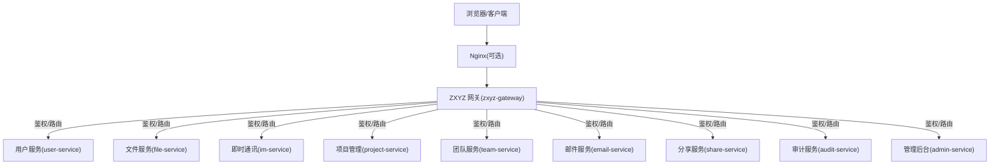
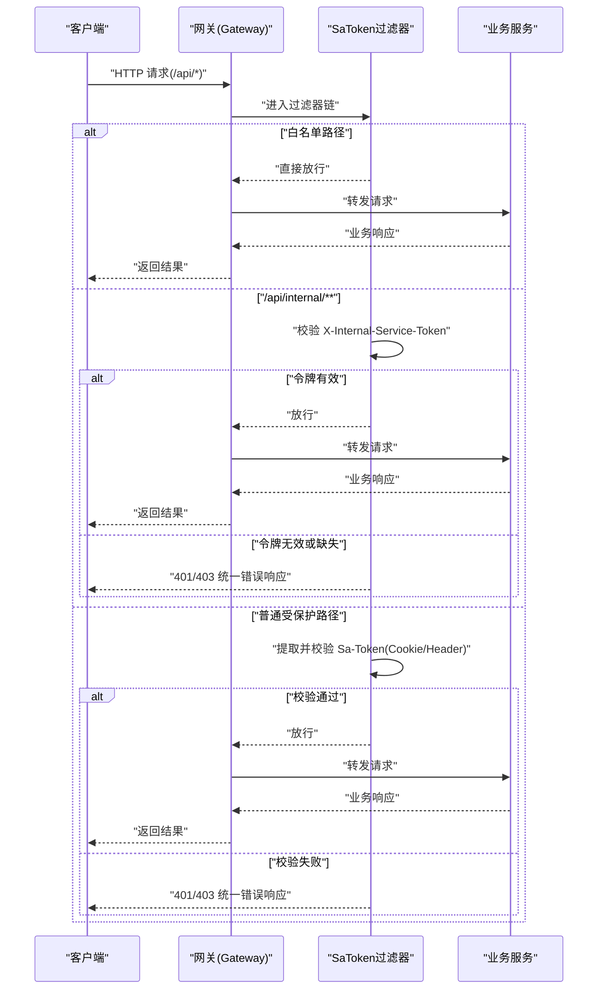
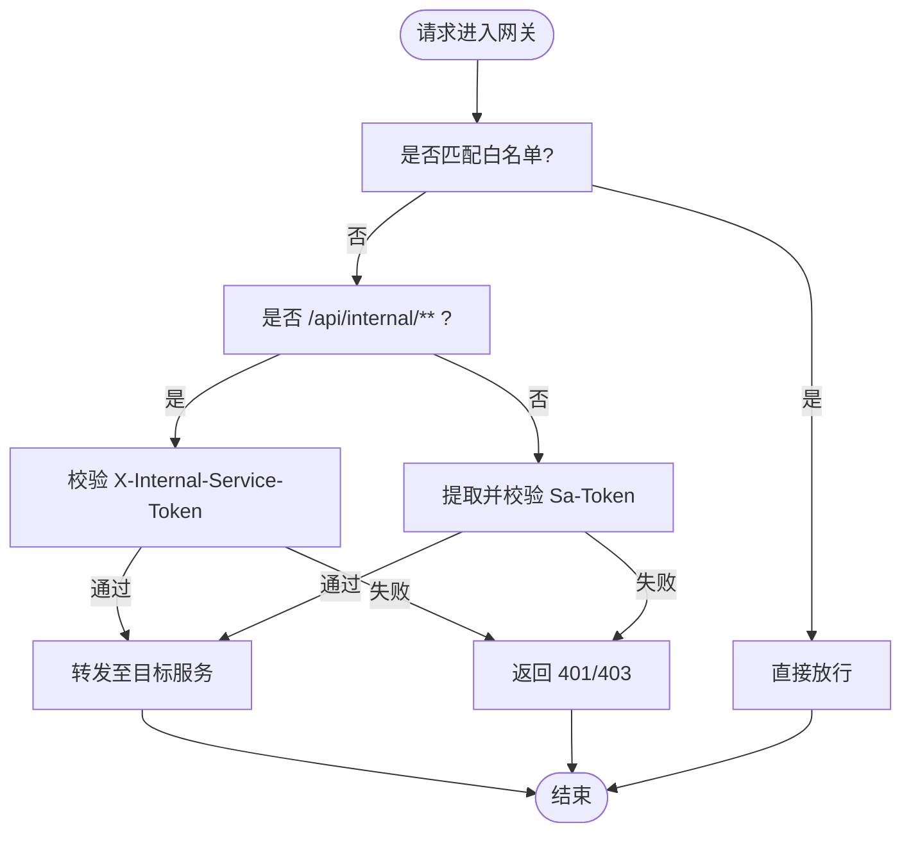
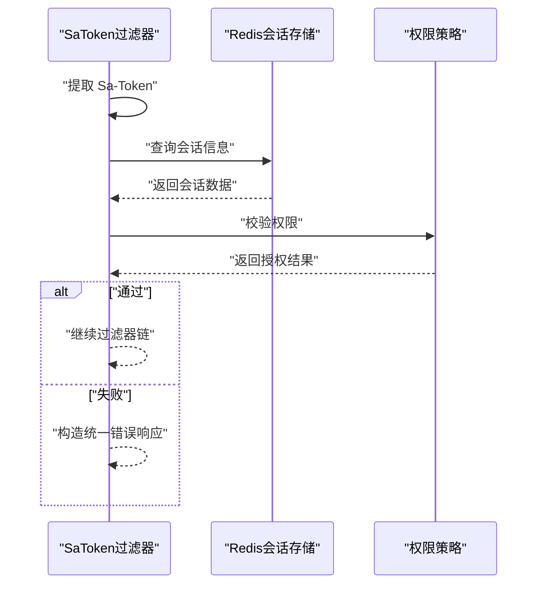
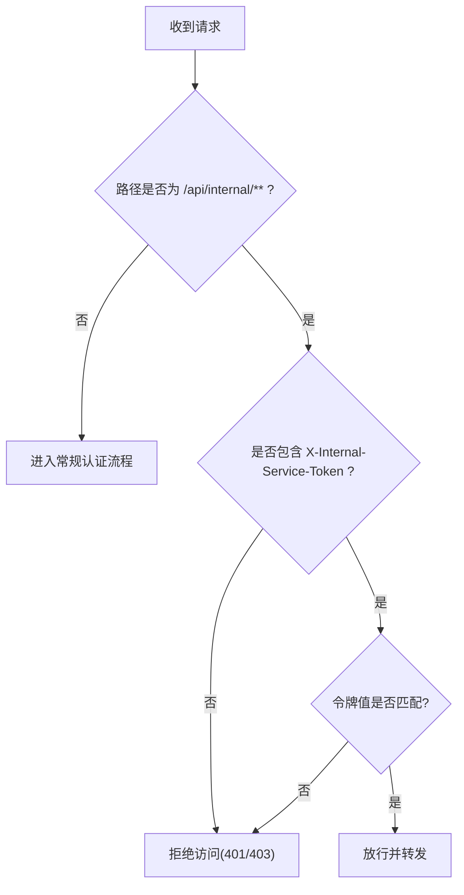
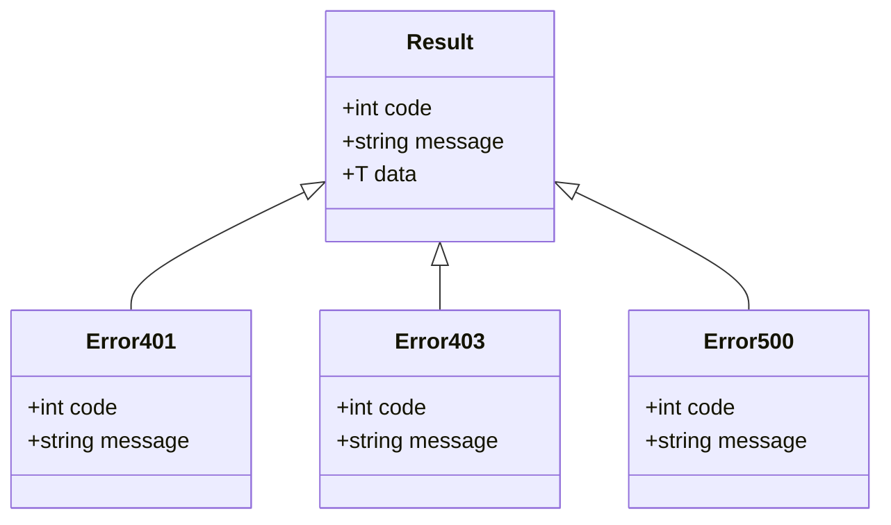
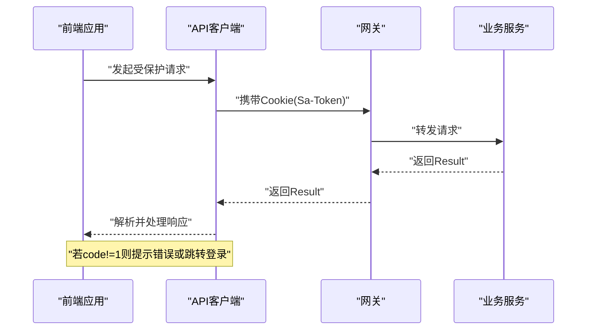
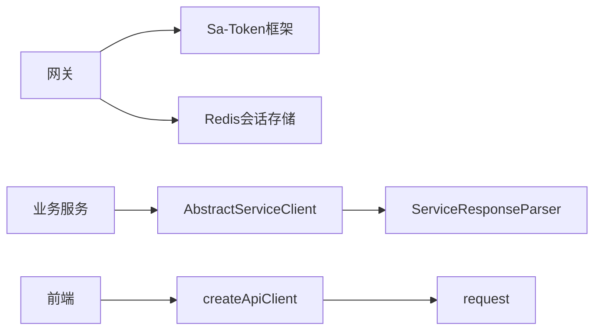

# 网关认证过滤器

<cite>
**本文引用的文件**
- [ZxyzGatewayApplication.java](file://ZXYZdatabaseBack/zxyz-gateway/src/main/java/uno/acloud/gateway/ZxyzGatewayApplication.java)
- [application.yml](file://ZXYZdatabaseBack/zxyz-gateway/src/main/resources/application.yml)
- [SaTokenFilterConfigTest.java](file://ZXYZdatabaseBack/zxyz-gateway/src/test/java/uno/acloud/gateway/filter/SaTokenFilterConfigTest.java)
- [zxyz-gateway.yml](file://nacos-config/zxyz-gateway.yml)
- [application-common.yml](file://ZXYZdatabaseBack/zxyz-common/src/main/resources/application-common.yml)
- [AbstractServiceClient.java](file://ZXYZdatabaseBack/zxyz-common/src/main/java/uno/acloud/client/AbstractServiceClient.java)
- [ServiceResponseParser.java](file://ZXYZdatabaseBack/zxyz-common/src/main/java/uno/acloud/client/ServiceResponseParser.java)
- [auth.js](file://ZXYZdatabaseFront/src/api/auth.js)
- [createApiClient.js](file://ZXYZdatabaseFront/src/utils/createApiClient.js)
- [request.js](file://ZXYZdatabaseFront/src/utils/request.js)
- [error.js](file://ZXYZdatabaseFront/src/utils/error.js)
</cite>

## 目录
1. [简介](#简介)
2. [项目结构](#项目结构)
3. [核心组件](#核心组件)
4. [架构总览](#架构总览)
5. [详细组件分析](#详细组件分析)
6. [依赖分析](#依赖分析)
7. [性能考虑](#性能考虑)
8. [故障排查指南](#故障排查指南)
9. [结论](#结论)
10. [附录](#附录)

## 简介
本文件面向 ZXYZ 项目的网关层，聚焦于基于 Sa-Token 的认证过滤器实现与配置。内容涵盖：
- Gateway 层的 SaToken 过滤器链顺序、请求拦截时机与白名单路径配置
- 认证过滤器的执行流程：Token 提取、验证逻辑、权限检查、未认证请求处理
- 内部服务访问控制：/api/internal/** 路径保护、X-Internal-Service-Token 验证与服务间信任机制
- 错误处理策略：401 未认证、403 无权限、500 服务器错误的统一响应格式
- 性能优化考虑：缓存策略、异步处理、连接池配置
- 扩展实践：如何添加自定义过滤器与扩展认证规则

## 项目结构
ZXYZ 后端采用多模块 Maven 工程，其中网关模块 zxyz-gateway 负责统一入口、鉴权与路由转发。前端通过 HTTP 客户端发起请求，由网关进行认证与鉴权后转发至各业务服务。

**图表来源**
- [ZxyzGatewayApplication.java](file://ZXYZdatabaseBack/zxyz-gateway/src/main/java/uno/acloud/gateway/ZxyzGatewayApplication.java)
- [application.yml](file://ZXYZdatabaseBack/zxyz-gateway/src/main/resources/application.yml)

**章节来源**
- [ZxyzGatewayApplication.java](file://ZXYZdatabaseBack/zxyz-gateway/src/main/java/uno/acloud/gateway/ZxyzGatewayApplication.java)
- [application.yml](file://ZXYZdatabaseBack/zxyz-gateway/src/main/resources/application.yml)

## 核心组件
- 网关启动类与全局配置：定义应用入口与基础配置项（如端口、上下文路径等）
- 认证过滤器：基于 Sa-Token 的过滤器，负责 Token 提取、校验、会话管理与权限判断
- 白名单与内部端点策略：对公开接口放行；对 /api/internal/** 强制要求 X-Internal-Service-Token
- 错误统一处理：将 401/403/500 等异常转换为统一的 Result<T> 响应体

**章节来源**
- [ZxyzGatewayApplication.java](file://ZXYZdatabaseBack/zxyz-gateway/src/main/java/uno/acloud/gateway/ZxyzGatewayApplication.java)
- [application.yml](file://ZXYZdatabaseBack/zxyz-gateway/src/main/resources/application.yml)
- [SaTokenFilterConfigTest.java](file://ZXYZdatabaseBack/zxyz-gateway/src/test/java/uno/acloud/gateway/filter/SaTokenFilterConfigTest.java)

## 架构总览
下图展示从客户端到网关再到各业务服务的完整调用链路，以及认证与内部服务访问控制的决策点。

**图表来源**
- [application.yml](file://ZXYZdatabaseBack/zxyz-gateway/src/main/resources/application.yml)
- [zxyz-gateway.yml](file://nacos-config/zxyz-gateway.yml)

## 详细组件分析

### 过滤器链顺序与拦截时机
- 拦截时机：所有进入网关的请求均先经过过滤器链，再根据路由规则转发到具体服务
- 过滤器顺序：建议将认证过滤器置于最前，确保后续过滤器与处理器不再重复校验
- 白名单策略：静态资源、健康检查、登录注册等路径可配置为白名单，跳过认证
- 内部端点策略：/api/internal/** 必须携带 X-Internal-Service-Token，否则拒绝

**图表来源**
- [application.yml](file://ZXYZdatabaseBack/zxyz-gateway/src/main/resources/application.yml)
- [zxyz-gateway.yml](file://nacos-config/zxyz-gateway.yml)

**章节来源**
- [application.yml](file://ZXYZdatabaseBack/zxyz-gateway/src/main/resources/application.yml)
- [zxyz-gateway.yml](file://nacos-config/zxyz-gateway.yml)

### 认证过滤器的执行流程
- Token 提取：优先从 Cookie 或 Header 中获取 Sa-Token
- 验证逻辑：结合 Redis Session 校验 Token 有效性、过期时间与会话状态
- 权限检查：根据用户角色/权限决定是否可以访问目标端点
- 未认证处理：返回统一错误码与消息，便于前端集中处理

**图表来源**
- [application-common.yml](file://ZXYZdatabaseBack/zxyz-common/src/main/resources/application-common.yml)

**章节来源**
- [application-common.yml](file://ZXYZdatabaseBack/zxyz-common/src/main/resources/application-common.yml)

### 内部服务访问控制
- 路径保护：/api/internal/** 仅允许内部服务调用
- 令牌验证：要求请求头包含 X-Internal-Service-Token，且值需与网关配置一致
- 信任机制：仅受信任的服务实例可持有该令牌，避免公网暴露

**图表来源**
- [application.yml](file://ZXYZdatabaseBack/zxyz-gateway/src/main/resources/application.yml)
- [zxyz-gateway.yml](file://nacos-config/zxyz-gateway.yml)

**章节来源**
- [application.yml](file://ZXYZdatabaseBack/zxyz-gateway/src/main/resources/application.yml)
- [zxyz-gateway.yml](file://nacos-config/zxyz-gateway.yml)

### 错误处理策略
- 401 未认证：Token 缺失或无效
- 403 无权限：Token 有效但权限不足
- 500 服务器错误：内部异常或下游服务不可用
- 统一响应格式：Result<T> 结构，code=1 表示成功，其他为错误码

**图表来源**
- [ServiceResponseParser.java](file://ZXYZdatabaseBack/zxyz-common/src/main/java/uno/acloud/client/ServiceResponseParser.java)

**章节来源**
- [ServiceResponseParser.java](file://ZXYZdatabaseBack/zxyz-common/src/main/java/uno/acloud/client/ServiceResponseParser.java)

### 前端认证与网关交互
- 登录成功后，前端保存 HttpOnly Cookie（Sa-Token UUID token），后续请求自动携带
- API 客户端封装统一错误处理，根据 code 判断成功与否
- 未认证时引导用户重新登录或刷新页面

**图表来源**
- [auth.js](file://ZXYZdatabaseFront/src/api/auth.js)
- [createApiClient.js](file://ZXYZdatabaseFront/src/utils/createApiClient.js)
- [request.js](file://ZXYZdatabaseFront/src/utils/request.js)
- [error.js](file://ZXYZdatabaseFront/src/utils/error.js)

**章节来源**
- [auth.js](file://ZXYZdatabaseFront/src/api/auth.js)
- [createApiClient.js](file://ZXYZdatabaseFront/src/utils/createApiClient.js)
- [request.js](file://ZXYZdatabaseFront/src/utils/request.js)
- [error.js](file://ZXYZdatabaseFront/src/utils/error.js)

## 依赖分析
- 网关依赖 Sa-Token 框架进行会话与权限管理
- 内部服务调用依赖 AbstractServiceClient 与 ServiceResponseParser 进行统一封装与解析
- 前端依赖 createApiClient 与 request 进行网络请求与错误处理

**图表来源**
- [AbstractServiceClient.java](file://ZXYZdatabaseBack/zxyz-common/src/main/java/uno/acloud/client/AbstractServiceClient.java)
- [ServiceResponseParser.java](file://ZXYZdatabaseBack/zxyz-common/src/main/java/uno/acloud/client/ServiceResponseParser.java)
- [createApiClient.js](file://ZXYZdatabaseFront/src/utils/createApiClient.js)
- [request.js](file://ZXYZdatabaseFront/src/utils/request.js)

**章节来源**
- [AbstractServiceClient.java](file://ZXYZdatabaseBack/zxyz-common/src/main/java/uno/acloud/client/AbstractServiceClient.java)
- [ServiceResponseParser.java](file://ZXYZdatabaseBack/zxyz-common/src/main/java/uno/acloud/client/ServiceResponseParser.java)
- [createApiClient.js](file://ZXYZdatabaseFront/src/utils/createApiClient.js)
- [request.js](file://ZXYZdatabaseFront/src/utils/request.js)

## 性能考虑
- 缓存策略：Sa-Token 会话信息缓存于 Redis，减少数据库压力
- 异步处理：非关键路径（如审计日志）采用异步发送，降低主流程延迟
- 连接池配置：合理设置 HTTP 连接池大小与超时时间，避免资源耗尽
- 限流与熔断：在网关层对高频接口实施限流，对不稳定服务启用熔断降级

[本节为通用指导，不直接分析具体文件]

## 故障排查指南
- 401 未认证：检查 Cookie 是否正确携带、Token 是否过期
- 403 无权限：确认用户角色与端点权限配置是否匹配
- 500 服务器错误：查看网关与下游服务日志，定位异常堆栈
- 内部服务调用失败：核对 X-Internal-Service-Token 配置是否一致

**章节来源**
- [SaTokenFilterConfigTest.java](file://ZXYZdatabaseBack/zxyz-gateway/src/test/java/uno/acloud/gateway/filter/SaTokenFilterConfigTest.java)

## 结论
通过 Sa-Token 过滤器与网关层统一配置，ZXYZ 实现了安全的认证与权限控制。内部服务访问通过专用令牌隔离，错误响应统一化便于前端处理。结合缓存、异步与连接池优化，系统在安全性与性能之间取得平衡。

[本节为总结性内容，不直接分析具体文件]

## 附录
- 添加自定义过滤器：在过滤器链中插入新过滤器，注意顺序与白名单配置
- 扩展认证规则：在权限策略中增加新的角色或资源映射
- 调试技巧：开启网关调试日志，观察请求流转与过滤器执行过程

[本节为补充说明，不直接分析具体文件]