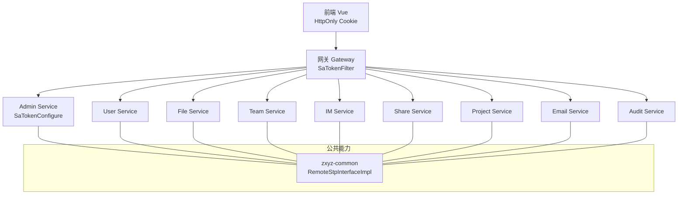
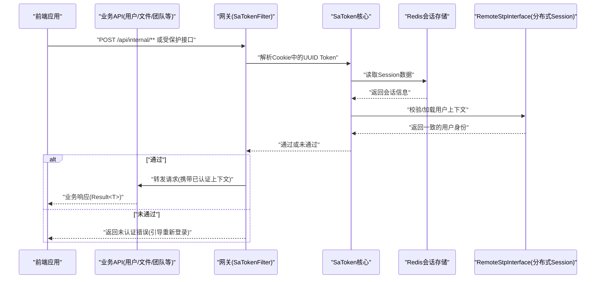
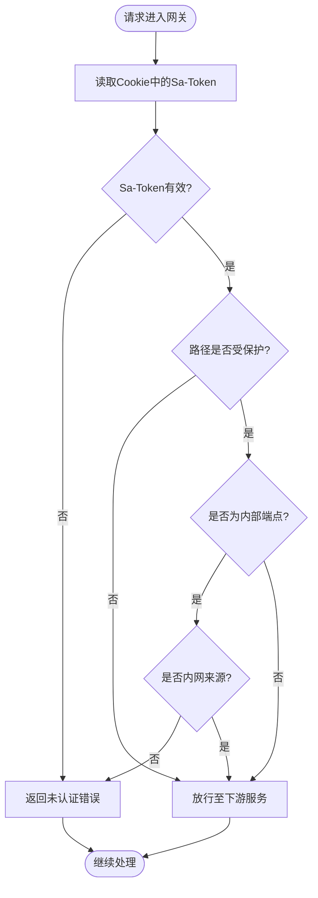
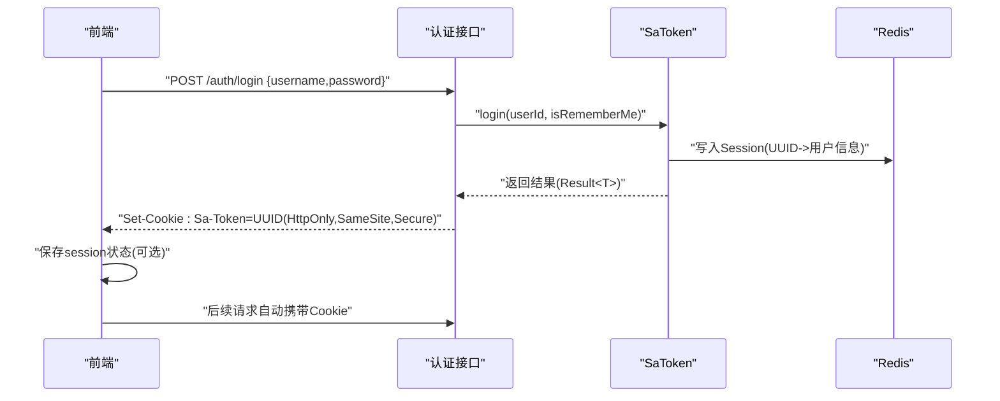
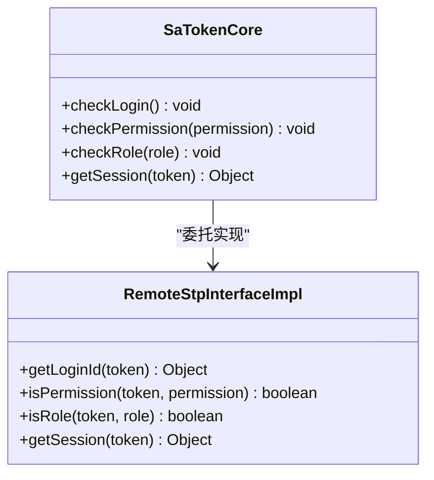
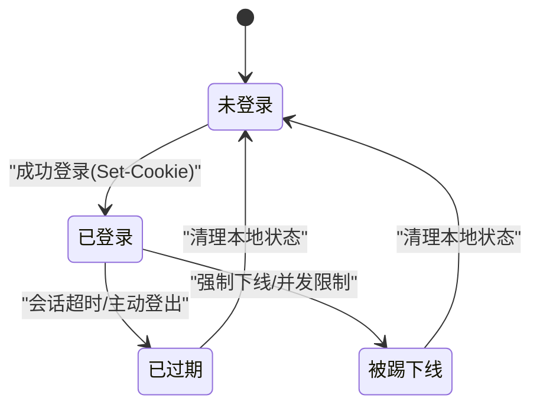
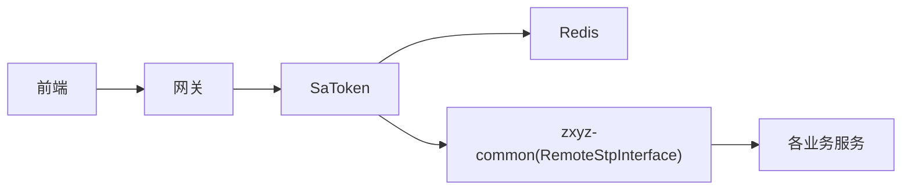

# 认证系统

<cite>
**本文引用的文件**   
- [zxyz-gateway/src/main/java/uno/acloud/gateway/filter/SaTokenFilterConfig.java](file://ZXYZdatabaseBack/zxyz-gateway/src/main/java/uno/acloud/gateway/filter/SaTokenFilterConfig.java)
- [zxyz-gateway/src/test/java/uno/acloud/gateway/filter/SaTokenFilterConfigTest.java](file://ZXYZdatabaseBack/zxyz-gateway/src/test/java/uno/acloud/gateway/filter/SaTokenFilterConfigTest.java)
- [zxyz-common/src/main/java/uno/acloud/satoken/RemoteStpInterfaceImpl.java](file://ZXYZdatabaseBack/zxyz-common/src/main/java/uno/acloud/satoken/RemoteStpInterfaceImpl.java)
- [zxyz-admin-service/src/main/java/uno/acloud/admin/config/SaTokenConfigure.java](file://ZXYZdatabaseBack/zxyz-admin-service/src/main/java/uno/acloud/admin/config/SaTokenConfigure.java)
- [nacos-config/zxyz-static.yml](file://nacos-config/zxyz-static.yml)
- [nacos-config/zxyz-gateway.yml](file://nacos-config/zxyz-gateway.yml)
- [ZXYZdatabaseFront/src/utils/auth.js](file://ZXYZdatabaseFront/src/utils/auth.js)
- [ZXYZdatabaseFront/src/utils/request.js](file://ZXYZdatabaseFront/src/utils/request.js)
- [ZXYZdatabaseFront/src/api/auth.js](file://ZXYZdatabaseFront/src/api/auth.js)
- [ZXYZdatabaseFront/src/store/session.js](file://ZXYZdatabaseFront/src/store/session.js)
</cite>

## 目录
1. [简介](#简介)
2. [项目结构](#项目结构)
3. [核心组件](#核心组件)
4. [架构总览](#架构总览)
5. [详细组件分析](#详细组件分析)
6. [依赖关系分析](#依赖关系分析)
7. [性能考虑](#性能考虑)
8. [故障排查指南](#故障排查指南)
9. [结论](#结论)
10. [附录](#附录)

## 简介
本章节概述 ZXYZ 项目的认证体系：基于 Sa-Token 的分布式会话与 Token 管理、前端 HttpOnly Cookie 模式、Gateway 层统一拦截、多服务一致性校验，以及跨域 Cookie 配置。文档面向不同技术背景的读者，提供从整体到细节的分层说明，并给出流程图、状态图与错误处理策略，帮助快速理解与扩展。

## 项目结构
本项目采用微服务架构，认证相关代码主要分布在以下位置：
- Gateway 网关：SaToken 过滤器与跨域配置
- 公共模块 zxyz-common：RemoteStpInterface 实现（分布式 Session 同步）
- 各业务服务：SaToken 基础配置（如 admin-service）
- 前端：HttpOnly Cookie 登录流程、请求拦截与状态管理

图表来源
- [zxyz-gateway/src/main/java/uno/acloud/gateway/filter/SaTokenFilterConfig.java](file://ZXYZdatabaseBack/zxyz-gateway/src/main/java/uno/acloud/gateway/filter/SaTokenFilterConfig.java)
- [zxyz-common/src/main/java/uno/acloud/satoken/RemoteStpInterfaceImpl.java](file://ZXYZdatabaseBack/zxyz-common/src/main/java/uno/acloud/satoken/RemoteStpInterfaceImpl.java)
- [zxyz-admin-service/src/main/java/uno/acloud/admin/config/SaTokenConfigure.java](file://ZXYZdatabaseBack/zxyz-admin-service/src/main/java/uno/acloud/admin/config/SaTokenConfigure.java)

章节来源
- [zxyz-gateway/src/main/java/uno/acloud/gateway/filter/SaTokenFilterConfig.java](file://ZXYZdatabaseBack/zxyz-gateway/src/main/java/uno/acloud/gateway/filter/SaTokenFilterConfig.java)
- [zxyz-common/src/main/java/uno/acloud/satoken/RemoteStpInterfaceImpl.java](file://ZXYZdatabaseBack/zxyz-common/src/main/java/uno/acloud/satoken/RemoteStpInterfaceImpl.java)
- [zxyz-admin-service/src/main/java/uno/acloud/admin/config/SaTokenConfigure.java](file://ZXYZdatabaseBack/zxyz-admin-service/src/main/java/uno/acloud/admin/config/SaTokenConfigure.java)

## 核心组件
- 网关 SaToken 过滤器：统一拦截请求、校验 Token、转发或拒绝未认证请求
- RemoteStpInterface 实现：跨服务共享 Session 数据，保证认证一致性
- 各服务 SaToken 配置：启用鉴权、设置 Cookie/Session 策略
- 前端认证工具：封装 HttpOnly Cookie 登录、自动携带 Cookie、处理未授权跳转

章节来源
- [zxyz-gateway/src/main/java/uno/acloud/gateway/filter/SaTokenFilterConfig.java](file://ZXYZdatabaseBack/zxyz-gateway/src/main/java/uno/acloud/gateway/filter/SaTokenFilterConfig.java)
- [zxyz-common/src/main/java/uno/acloud/satoken/RemoteStpInterfaceImpl.java](file://ZXYZdatabaseBack/zxyz-common/src/main/java/uno/acloud/satoken/RemoteStpInterfaceImpl.java)
- [zxyz-admin-service/src/main/java/uno/acloud/admin/config/SaTokenConfigure.java](file://ZXYZdatabaseBack/zxyz-admin-service/src/main/java/uno/acloud/admin/config/SaTokenConfigure.java)
- [ZXYZdatabaseFront/src/utils/auth.js](file://ZXYZdatabaseFront/src/utils/auth.js)
- [ZXYZdatabaseFront/src/utils/request.js](file://ZXYZdatabaseFront/src/utils/request.js)
- [ZXYZdatabaseFront/src/api/auth.js](file://ZXYZdatabaseFront/src/api/auth.js)
- [ZXYZdatabaseFront/src/store/session.js](file://ZXYZdatabaseFront/src/store/session.js)

## 架构总览
下图展示从前端登录到后端鉴权的完整链路，包括 Gateway 拦截、Redis 会话、跨服务一致性校验与响应返回。

图表来源
- [zxyz-gateway/src/main/java/uno/acloud/gateway/filter/SaTokenFilterConfig.java](file://ZXYZdatabaseBack/zxyz-gateway/src/main/java/uno/acloud/gateway/filter/SaTokenFilterConfig.java)
- [zxyz-common/src/main/java/uno/acloud/satoken/RemoteStpInterfaceImpl.java](file://ZXYZdatabaseBack/zxyz-common/src/main/java/uno/acloud/satoken/RemoteStpInterfaceImpl.java)

章节来源
- [zxyz-gateway/src/main/java/uno/acloud/gateway/filter/SaTokenFilterConfig.java](file://ZXYZdatabaseBack/zxyz-gateway/src/main/java/uno/acloud/gateway/filter/SaTokenFilterConfig.java)
- [zxyz-common/src/main/java/uno/acloud/satoken/RemoteStpInterfaceImpl.java](file://ZXYZdatabaseBack/zxyz-common/src/main/java/uno/acloud/satoken/RemoteStpInterfaceImpl.java)

## 详细组件分析

### 网关层 SaToken 过滤器链
- 功能职责
  - 拦截所有进入网关的请求
  - 从 Cookie 中读取 Sa-Token UUID
  - 调用 SaToken 进行会话校验
  - 对未认证请求返回统一错误码，阻止访问内部端点
- 关键行为
  - 跨域 Cookie 配置：允许跨域、安全传输、SameSite 策略
  - 白名单放行：静态资源、健康检查、公开接口
  - 内部端点保护：/api/internal/** 仅内网可访问，公网直接拒绝

图表来源
- [zxyz-gateway/src/main/java/uno/acloud/gateway/filter/SaTokenFilterConfig.java](file://ZXYZdatabaseBack/zxyz-gateway/src/main/java/uno/acloud/gateway/filter/SaTokenFilterConfig.java)

章节来源
- [zxyz-gateway/src/main/java/uno/acloud/gateway/filter/SaTokenFilterConfig.java](file://ZXYZdatabaseBack/zxyz-gateway/src/main/java/uno/acloud/gateway/filter/SaTokenFilterConfig.java)
- [zxyz-gateway/src/test/java/uno/acloud/gateway/filter/SaTokenFilterConfigTest.java](file://ZXYZdatabaseBack/zxyz-gateway/src/test/java/uno/acloud/gateway/filter/SaTokenFilterConfigTest.java)

### 用户登录流程与 HttpOnly Cookie
- 前端登录
  - 调用登录接口提交用户名/密码
  - 服务端创建 Sa-Token UUID，写入 HttpOnly Cookie
  - 前端后续请求自动携带 Cookie（无需手动设置 Authorization）
- 会话管理
  - Redis 存储会话数据（用户ID、权限、过期时间等）
  - 前端 store/session.js 维护本地会话状态（用于UI显示与路由守卫）
- 跨域配置
  - 网关与业务服务需开启跨域支持，确保 Cookie 在跨域场景下正确传递

图表来源
- [ZXYZdatabaseFront/src/api/auth.js](file://ZXYZdatabaseFront/src/api/auth.js)
- [ZXYZdatabaseFront/src/store/session.js](file://ZXYZdatabaseFront/src/store/session.js)

章节来源
- [ZXYZdatabaseFront/src/api/auth.js](file://ZXYZdatabaseFront/src/api/auth.js)
- [ZXYZdatabaseFront/src/store/session.js](file://ZXYZdatabaseFront/src/store/session.js)
- [ZXYZdatabaseFront/src/utils/request.js](file://ZXYZdatabaseFront/src/utils/request.js)

### 多服务认证一致性：RemoteStpInterface
- 目标
  - 在多服务环境下，确保同一用户的会话状态一致
  - 支持分布式 Session 同步与 Token 传播
- 实现要点
  - 自定义 StpInterface 接口，集中处理用户身份与权限查询
  - 通过远程调用或缓存中心获取最新用户上下文
  - 各服务启动时注入该实现，保证鉴权逻辑统一

图表来源
- [zxyz-common/src/main/java/uno/acloud/satoken/RemoteStpInterfaceImpl.java](file://ZXYZdatabaseBack/zxyz-common/src/main/java/uno/acloud/satoken/RemoteStpInterfaceImpl.java)

章节来源
- [zxyz-common/src/main/java/uno/acloud/satoken/RemoteStpInterfaceImpl.java](file://ZXYZdatabaseBack/zxyz-common/src/main/java/uno/acloud/satoken/RemoteStpInterfaceImpl.java)

### 会话状态图

[本节为概念性图示，不直接映射具体源码文件]

### 错误处理策略
- 未认证
  - 网关返回统一错误码，前端跳转到登录页
  - 保持用户体验一致性，避免泄露敏感信息
- 权限不足
  - 业务层抛出异常，统一捕获后返回 Result<T> 错误结构
- 会话失效
  - 检测到 Cookie 无效或 Redis 无会话，触发重新登录流程

章节来源
- [zxyz-gateway/src/main/java/uno/acloud/gateway/filter/SaTokenFilterConfig.java](file://ZXYZdatabaseBack/zxyz-gateway/src/main/java/uno/acloud/gateway/filter/SaTokenFilterConfig.java)
- [ZXYZdatabaseFront/src/utils/request.js](file://ZXYZdatabaseFront/src/utils/request.js)

## 依赖关系分析
- 组件耦合
  - Gateway 强依赖 SaToken 过滤器与跨域配置
  - 各服务依赖 zxyz-common 的 RemoteStpInterface 实现
  - 前端依赖 request.js 与 auth.js 完成认证交互
- 外部依赖
  - Redis：会话存储
  - Nacos：动态配置（跨域、白名单、超时等）

图表来源
- [zxyz-gateway/src/main/java/uno/acloud/gateway/filter/SaTokenFilterConfig.java](file://ZXYZdatabaseBack/zxyz-gateway/src/main/java/uno/acloud/gateway/filter/SaTokenFilterConfig.java)
- [zxyz-common/src/main/java/uno/acloud/satoken/RemoteStpInterfaceImpl.java](file://ZXYZdatabaseBack/zxyz-common/src/main/java/uno/acloud/satoken/RemoteStpInterfaceImpl.java)

章节来源
- [zxyz-gateway/src/main/java/uno/acloud/gateway/filter/SaTokenFilterConfig.java](file://ZXYZdatabaseBack/zxyz-gateway/src/main/java/uno/acloud/gateway/filter/SaTokenFilterConfig.java)
- [zxyz-common/src/main/java/uno/acloud/satoken/RemoteStpInterfaceImpl.java](file://ZXYZdatabaseBack/zxyz-common/src/main/java/uno/acloud/satoken/RemoteStpInterfaceImpl.java)

## 性能考虑
- 会话存储优化
  - Redis 集群化部署，降低单点压力
  - 合理设置会话 TTL，避免内存泄漏
- 网关过滤性能
  - 白名单路径优先匹配，减少不必要的 SaToken 校验
  - 跨域预检请求缓存，降低重复开销
- 前端请求优化
  - 批量请求合并，减少 Cookie 频繁校验
  - 失败重试与退避策略，提升用户体验

[本节为通用指导，不直接分析具体文件]

## 故障排查指南
- 常见问题
  - Cookie 未携带：检查跨域配置与 SameSite/Secure 设置
  - 会话失效：确认 Redis 连接与会话 TTL
  - 内部端点被拒：验证请求来源 IP 与网关规则
- 定位步骤
  - 查看网关日志，确认 SaToken 校验结果
  - 检查 Redis 中是否存在对应 UUID 的会话
  - 核对 RemoteStpInterface 实现是否正确加载用户上下文

章节来源
- [zxyz-gateway/src/main/java/uno/acloud/gateway/filter/SaTokenFilterConfig.java](file://ZXYZdatabaseBack/zxyz-gateway/src/main/java/uno/acloud/gateway/filter/SaTokenFilterConfig.java)
- [zxyz-common/src/main/java/uno/acloud/satoken/RemoteStpInterfaceImpl.java](file://ZXYZdatabaseBack/zxyz-common/src/main/java/uno/acloud/satoken/RemoteStpInterfaceImpl.java)

## 结论
ZXYZ 认证系统以 SaToken 为核心，结合 HttpOnly Cookie 与 Redis 会话，实现了前后端分离下的安全认证与分布式一致性。通过 Gateway 统一拦截与 RemoteStpInterface 抽象，确保了多服务间的鉴权一致性。建议在生产环境严格配置跨域与安全参数，并持续监控会话与网关性能指标。

[本节为总结性内容，不直接分析具体文件]

## 附录
- 配置参考
  - 静态配置：nacos-config/zxyz-static.yml
  - 网关配置：nacos-config/zxyz-gateway.yml
- 扩展建议
  - 自定义认证逻辑：在 RemoteStpInterfaceImpl 中扩展用户上下文加载
  - 新增白名单：在 SaTokenFilterConfig 中添加路径规则
  - 前端增强：在 request.js 中增加统一的未认证处理与刷新机制

章节来源
- [nacos-config/zxyz-static.yml](file://nacos-config/zxyz-static.yml)
- [nacos-config/zxyz-gateway.yml](file://nacos-config/zxyz-gateway.yml)
- [zxyz-common/src/main/java/uno/acloud/satoken/RemoteStpInterfaceImpl.java](file://ZXYZdatabaseBack/zxyz-common/src/main/java/uno/acloud/satoken/RemoteStpInterfaceImpl.java)
- [zxyz-gateway/src/main/java/uno/acloud/gateway/filter/SaTokenFilterConfig.java](file://ZXYZdatabaseBack/zxyz-gateway/src/main/java/uno/acloud/gateway/filter/SaTokenFilterConfig.java)
- [ZXYZdatabaseFront/src/utils/request.js](file://ZXYZdatabaseFront/src/utils/request.js)