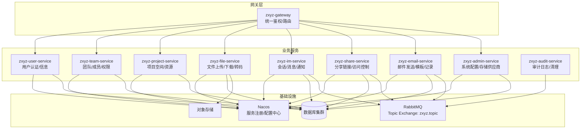
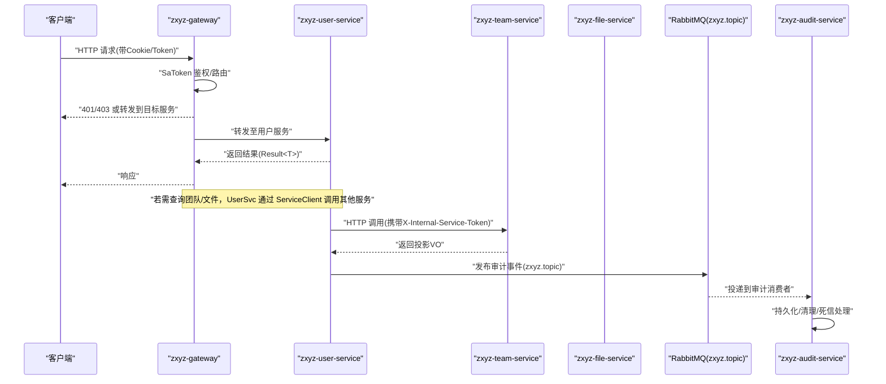
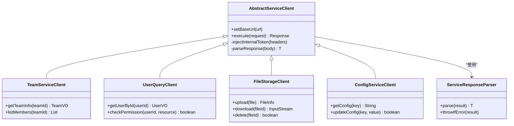
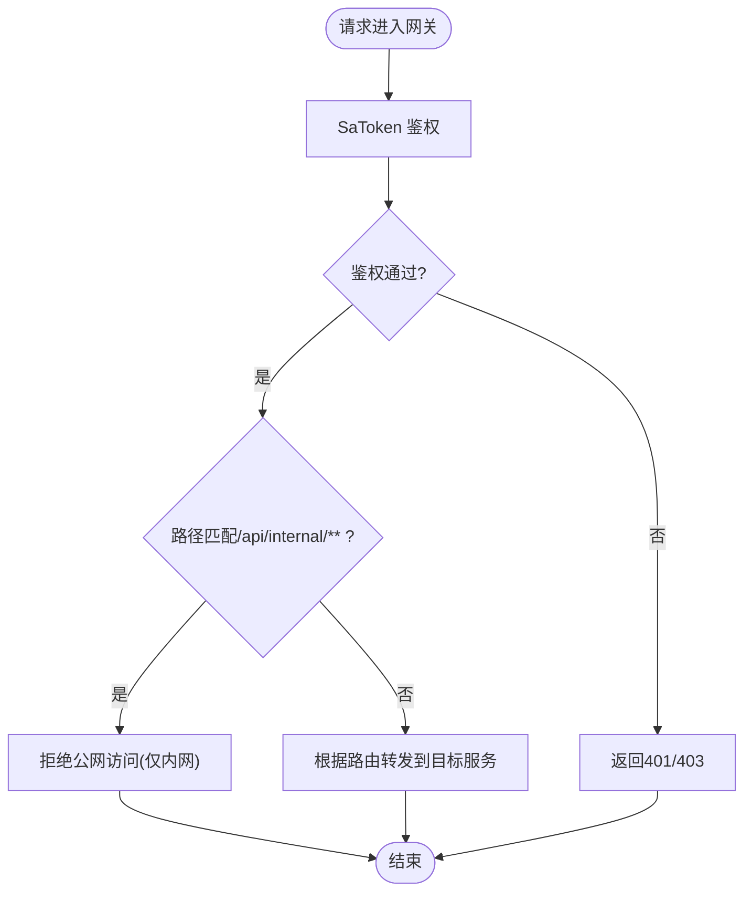
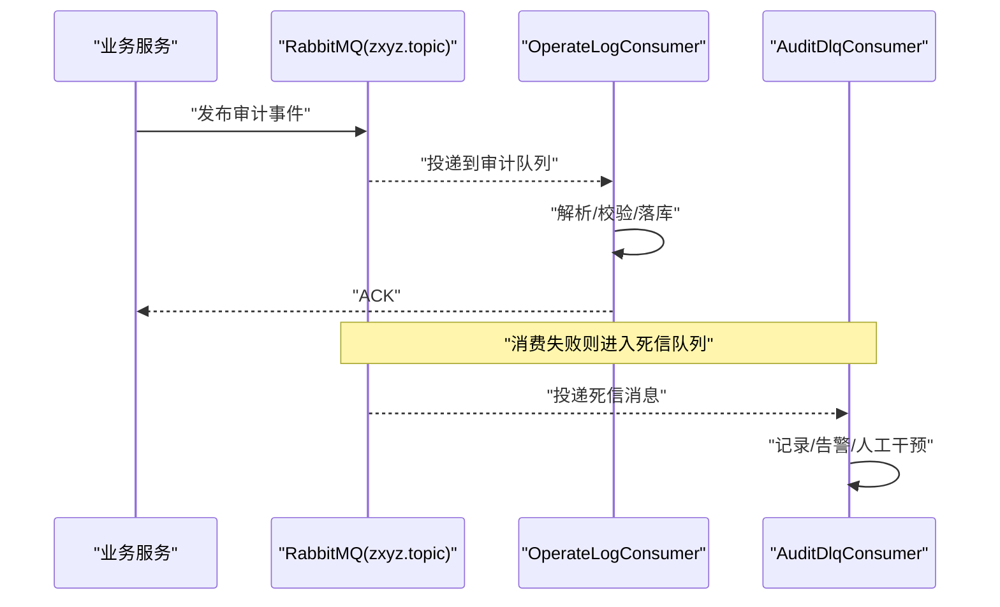
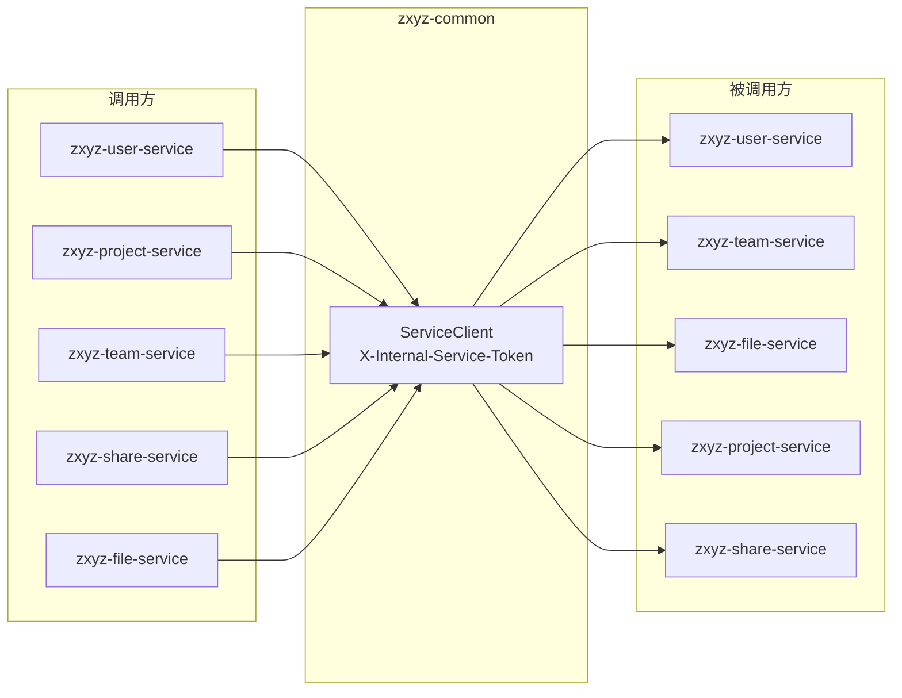

# 微服务架构

<cite>
**本文引用的文件**   
- [pom.xml](file://ZXYZdatabaseBack/pom.xml)
- [README.md](file://ZXYZdatabaseBack/README.md)
- [application.yml](file://ZXYZdatabaseBack/zxyz-gateway/src/main/resources/application.yml)
- [SaTokenFilterConfigTest.java](file://ZXYZdatabaseBack/zxyz-gateway/src/test/java/uno/acloud/gateway/filter/SaTokenFilterConfigTest.java)
- [AbstractServiceClient.java](file://ZXYZdatabaseBack/zxyz-common/src/main/java/uno/acloud/client/AbstractServiceClient.java)
- [TeamServiceClient.java](file://ZXYZdatabaseBack/zxyz-common/src/main/java/uno/acloud/client/TeamServiceClient.java)
- [UserQueryClient.java](file://ZXYZdatabaseBack/zxyz-common/src/main/java/uno/acloud/client/UserQueryClient.java)
- [FileStorageClient.java](file://ZXYZdatabaseBack/zxyz-common/src/main/java/uno/acloud/client/FileStorageClient.java)
- [ConfigServiceClient.java](file://ZXYZdatabaseBack/zxyz-common/src/main/java/uno/acloud/client/ConfigServiceClient.java)
- [ServiceResponseParser.java](file://ZXYZdatabaseBack/zxyz-common/src/main/java/uno/acloud/client/ServiceResponseParser.java)
- [application.yml](file://ZXYZdatabaseBack/zxyz-audit-service/src/main/resources/application.yml)
- [RabbitMqConfig.java](file://ZXYZdatabaseBack/zxyz-audit-service/src/main/java/uno/acloud/audit/config/RabbitMqConfig.java)
- [OperateLogConsumer.java](file://ZXYZdatabaseBack/zxyz-audit-service/src/main/java/uno/acloud/audit/mq/OperateLogConsumer.java)
- [AuditDlqConsumer.java](file://ZXYZdatabaseBack/zxyz-audit-service/src/main/java/uno/acloud/audit/mq/AuditDlqConsumer.java)
- [application.yml](file://ZXYZdatabaseBack/zxyz-email-service/src/main/resources/application.yml)
- [application.yml](file://ZXYZdatabaseBack/zxyz-file-service/src/main/resources/application.yml)
- [application.yml](file://ZXYZdatabaseBack/zxyz-im-service/src/main/resources/application.yml)
- [application.yml](file://ZXYZdatabaseBack/zxyz-project-service/src/main/resources/application.yml)
- [application.yml](file://ZXYZdatabaseBack/zxyz-share-service/src/main/resources/application.yml)
- [application.yml](file://ZXYZdatabaseBack/zxyz-team-service/src/main/resources/application.yml)
- [application.yml](file://ZXYZdatabaseBack/zxyz-user-service/src/main/resources/application.yml)
- [zxyz-dynamic.yml](file://nacos-config/zxyz-dynamic.yml)
- [zxyz-static.yml](file://nacos-config/zxyz-static.yml)
- [docker-compose.yml](file://docker-compose.yml)
- [ci-cd.yml](file://.github/workflows/ci-cd.yml)
- [architecture.md](file://docs/architecture.md)
</cite>

## 目录
1. [简介](#简介)
2. [项目结构](#项目结构)
3. [核心组件](#核心组件)
4. [架构总览](#架构总览)
5. [详细组件分析](#详细组件分析)
6. [依赖关系分析](#依赖关系分析)
7. [性能考虑](#性能考虑)
8. [故障排查指南](#故障排查指南)
9. [结论](#结论)
10. [附录](#附录)

## 简介
本文件为 ZXYZ 项目的微服务架构文档，面向研发、运维与产品人员，系统化阐述 11 个 Maven 模块的服务划分原则、职责边界、通信机制、安全策略、服务发现与配置管理，并给出服务拓扑图与依赖关系图。项目采用“网关统一入口 + 多业务服务 + 公共组件”的微服务架构，同步调用通过 ServiceClient 加内部鉴权头实现，异步通信基于 RabbitMQ Topic Exchange zxyz.topic；内部端点以 /api/internal/** 前缀标识并由网关 SaToken 过滤器拒绝公网访问。Nacos 承担服务注册与动态配置中心，Jasypt 用于敏感配置加密。

## 项目结构
后端采用多模块 Maven 工程，核心包含 11 个服务模块与 1 个公共组件模块：
- zxyz-common：跨服务共享的客户端抽象、通用 DTO/VO、工具类、审计事件模型等
- zxyz-gateway：Spring Cloud Gateway 网关，统一鉴权、路由、限流与内部端点拦截
- zxyz-admin-service：系统配置与存储供应商管理
- zxyz-user-service：用户认证与基础信息
- zxyz-team-service：团队与成员权限
- zxyz-project-service：项目空间与资源编排
- zxyz-file-service：文件上传、下载、转码与存储适配
- zxyz-im-service：即时通讯（会话、消息、通知）
- zxyz-share-service：分享链接与访问控制
- zxyz-email-service：邮件发送、模板渲染与记录
- zxyz-audit-service：操作审计日志采集与清理

图表来源
- [application.yml](file://ZXYZdatabaseBack/zxyz-gateway/src/main/resources/application.yml)
- [application.yml](file://ZXYZdatabaseBack/zxyz-audit-service/src/main/resources/application.yml)
- [application.yml](file://ZXYZdatabaseBack/zxyz-email-service/src/main/resources/application.yml)
- [application.yml](file://ZXYZdatabaseBack/zxyz-file-service/src/main/resources/application.yml)
- [application.yml](file://ZXYZdatabaseBack/zxyz-im-service/src/main/resources/application.yml)
- [application.yml](file://ZXYZdatabaseBack/zxyz-project-service/src/main/resources/application.yml)
- [application.yml](file://ZXYZdatabaseBack/zxyz-share-service/src/main/resources/application.yml)
- [application.yml](file://ZXYZdatabaseBack/zxyz-team-service/src/main/resources/application.yml)
- [application.yml](file://ZXYZdatabaseBack/zxyz-user-service/src/main/resources/application.yml)

章节来源
- [pom.xml](file://ZXYZdatabaseBack/pom.xml)
- [README.md](file://ZXYZdatabaseBack/README.md)

## 核心组件
- zxyz-common
  - 提供 AbstractServiceClient 基类与具体 ServiceClient（TeamServiceClient、UserQueryClient、FileStorageClient、ConfigServiceClient），封装 HTTP 调用、重试、错误解析与内部鉴权头注入
  - 定义审计事件、权限策略、Web 通用响应 Result<T>、异常处理与工具方法
- zxyz-gateway
  - 基于 Spring Cloud Gateway 的路由转发、SaToken 鉴权过滤、内部端点拦截（/api/internal/** 拒绝公网）
- 各业务服务
  - 遵循各自分层风格（im/email 为 DDD，其余为传统分层），暴露 REST 接口，消费/生产 MQ 消息，读写自身数据库
- zxyz-audit-service
  - 消费审计主题，持久化操作日志，提供清理任务与死信队列处理

章节来源
- [AbstractServiceClient.java](file://ZXYZdatabaseBack/zxyz-common/src/main/java/uno/acloud/client/AbstractServiceClient.java)
- [TeamServiceClient.java](file://ZXYZdatabaseBack/zxyz-common/src/main/java/uno/acloud/client/TeamServiceClient.java)
- [UserQueryClient.java](file://ZXYZdatabaseBack/zxyz-common/src/main/java/uno/acloud/client/UserQueryClient.java)
- [FileStorageClient.java](file://ZXYZdatabaseBack/zxyz-common/src/main/java/uno/acloud/client/FileStorageClient.java)
- [ConfigServiceClient.java](file://ZXYZdatabaseBack/zxyz-common/src/main/java/uno/acloud/client/ConfigServiceClient.java)
- [ServiceResponseParser.java](file://ZXYZdatabaseBack/zxyz-common/src/main/java/uno/acloud/client/ServiceResponseParser.java)
- [SaTokenFilterConfigTest.java](file://ZXYZdatabaseBack/zxyz-gateway/src/test/java/uno/acloud/gateway/filter/SaTokenFilterConfigTest.java)

## 架构总览
- 入口与鉴权
  - 所有外部请求经 zxyz-gateway 进入，SaToken 过滤器完成认证与会话校验
  - 内部端点 /api/internal/** 仅允许服务间调用，网关会拒绝公网访问
- 服务发现与配置
  - 所有服务通过 Nacos 进行服务注册与配置拉取，支持热更新
  - 敏感配置使用 Jasypt 加密
- 同步调用
  - 通过 zxyz-common 中的 ServiceClient 发起 HTTP 调用，并在请求头携带 X-Internal-Service-Token 进行服务间鉴权
- 异步通信
  - 基于 RabbitMQ Topic Exchange zxyz.topic，生产者发布领域事件，消费者按需订阅
- 数据隔离
  - 每个服务拥有独立数据库与表结构，避免跨库事务

图表来源
- [application.yml](file://ZXYZdatabaseBack/zxyz-gateway/src/main/resources/application.yml)
- [application.yml](file://ZXYZdatabaseBack/zxyz-audit-service/src/main/resources/application.yml)
- [AbstractServiceClient.java](file://ZXYZdatabaseBack/zxyz-common/src/main/java/uno/acloud/client/AbstractServiceClient.java)
- [OperateLogConsumer.java](file://ZXYZdatabaseBack/zxyz-audit-service/src/main/java/uno/acloud/audit/mq/OperateLogConsumer.java)

## 详细组件分析

### zxyz-common 公共组件
- 职责边界
  - 提供跨服务调用的统一客户端抽象与实现，屏蔽 HTTP 细节、重试、错误解析与鉴权头注入
  - 定义通用数据结构（Result<T>、异常、审计事件、权限策略、工具方法）
- 关键设计
  - AbstractServiceClient：统一构建请求、设置超时、重试、注入 X-Internal-Service-Token
  - 具体 Client：TeamServiceClient、UserQueryClient、FileStorageClient、ConfigServiceClient
  - ServiceResponseParser：统一解析 Result<T> 响应体，提取数据或抛错
- 复杂度与优化
  - 客户端连接池与超时参数可配置，建议按服务 QPS 调整
  - 错误码映射集中管理，便于统一告警与降级

图表来源
- [AbstractServiceClient.java](file://ZXYZdatabaseBack/zxyz-common/src/main/java/uno/acloud/client/AbstractServiceClient.java)
- [TeamServiceClient.java](file://ZXYZdatabaseBack/zxyz-common/src/main/java/uno/acloud/client/TeamServiceClient.java)
- [UserQueryClient.java](file://ZXYZdatabaseBack/zxyz-common/src/main/java/uno/acloud/client/UserQueryClient.java)
- [FileStorageClient.java](file://ZXYZdatabaseBack/zxyz-common/src/main/java/uno/acloud/client/FileStorageClient.java)
- [ConfigServiceClient.java](file://ZXYZdatabaseBack/zxyz-common/src/main/java/uno/acloud/client/ConfigServiceClient.java)
- [ServiceResponseParser.java](file://ZXYZdatabaseBack/zxyz-common/src/main/java/uno/acloud/client/ServiceResponseParser.java)

章节来源
- [AbstractServiceClient.java](file://ZXYZdatabaseBack/zxyz-common/src/main/java/uno/acloud/client/AbstractServiceClient.java)
- [TeamServiceClient.java](file://ZXYZdatabaseBack/zxyz-common/src/main/java/uno/acloud/client/TeamServiceClient.java)
- [UserQueryClient.java](file://ZXYZdatabaseBack/zxyz-common/src/main/java/uno/acloud/client/UserQueryClient.java)
- [FileStorageClient.java](file://ZXYZdatabaseBack/zxyz-common/src/main/java/uno/acloud/client/FileStorageClient.java)
- [ConfigServiceClient.java](file://ZXYZdatabaseBack/zxyz-common/src/main/java/uno/acloud/client/ConfigServiceClient.java)
- [ServiceResponseParser.java](file://ZXYZdatabaseBack/zxyz-common/src/main/java/uno/acloud/client/ServiceResponseParser.java)

### zxyz-gateway 网关
- 职责边界
  - 统一路由转发、SaToken 鉴权、内部端点拦截（/api/internal/**）、限流与监控
- 关键设计
  - SaToken 过滤器：校验 Cookie/Token，建立会话上下文
  - 内部端点策略：拒绝公网访问，仅允许内网服务调用
- 配置要点
  - application.yml 中定义路由规则与过滤器链

图表来源
- [application.yml](file://ZXYZdatabaseBack/zxyz-gateway/src/main/resources/application.yml)
- [SaTokenFilterConfigTest.java](file://ZXYZdatabaseBack/zxyz-gateway/src/test/java/uno/acloud/gateway/filter/SaTokenFilterConfigTest.java)

章节来源
- [application.yml](file://ZXYZdatabaseBack/zxyz-gateway/src/main/resources/application.yml)
- [SaTokenFilterConfigTest.java](file://ZXYZdatabaseBack/zxyz-gateway/src/test/java/uno/acloud/gateway/filter/SaTokenFilterConfigTest.java)

### zxyz-audit-service 审计服务
- 职责边界
  - 消费 zxyz.topic 下的审计事件，持久化操作日志，提供清理任务与死信队列处理
- 关键设计
  - RabbitMqConfig：声明 Topic Exchange 与队列绑定
  - OperateLogConsumer：消费审计消息，落库
  - AuditDlqConsumer：处理失败消息，告警与重试策略
- 配置要点
  - application.yml 中配置 RabbitMQ 连接与监听器

图表来源
- [application.yml](file://ZXYZdatabaseBack/zxyz-audit-service/src/main/resources/application.yml)
- [RabbitMqConfig.java](file://ZXYZdatabaseBack/zxyz-audit-service/src/main/java/uno/acloud/audit/config/RabbitMqConfig.java)
- [OperateLogConsumer.java](file://ZXYZdatabaseBack/zxyz-audit-service/src/main/java/uno/acloud/audit/mq/OperateLogConsumer.java)
- [AuditDlqConsumer.java](file://ZXYZdatabaseBack/zxyz-audit-service/src/main/java/uno/acloud/audit/mq/AuditDlqConsumer.java)

章节来源
- [application.yml](file://ZXYZdatabaseBack/zxyz-audit-service/src/main/resources/application.yml)
- [RabbitMqConfig.java](file://ZXYZdatabaseBack/zxyz-audit-service/src/main/java/uno/acloud/audit/config/RabbitMqConfig.java)
- [OperateLogConsumer.java](file://ZXYZdatabaseBack/zxyz-audit-service/src/main/java/uno/acloud/audit/mq/OperateLogConsumer.java)
- [AuditDlqConsumer.java](file://ZXYZdatabaseBack/zxyz-audit-service/src/main/java/uno/acloud/audit/mq/AuditDlqConsumer.java)

### zxyz-email-service 邮件服务
- 职责边界
  - 邮件发送、模板渲染、服务器配置管理、发送记录与可用性检测
- 关键设计
  - 应用层：EmailDispatchService、TemplateRenderer、VerifyCodeService
  - 基础设施层：Provider 抽象（不同邮件服务商适配）
  - 配置：application.yml 中配置 SMTP/模板引擎/密钥
- 特点
  - 支持多 Provider 切换，模板变量替换与验证码生成

章节来源
- [application.yml](file://ZXYZdatabaseBack/zxyz-email-service/src/main/resources/application.yml)

### zxyz-file-service 文件服务
- 职责边界
  - 文件上传、下载、预览、转码、回收站与存储适配（本地/OSS）
- 关键设计
  - Controller/Service/Mapper/Entity 分层
  - Storage 抽象层对接不同存储后端
  - MQ 消费文件处理事件（如转码完成）
- 配置
  - application.yml 中配置存储类型、桶名、密钥

章节来源
- [application.yml](file://ZXYZdatabaseBack/zxyz-file-service/src/main/resources/application.yml)

### zxyz-im-service 即时通讯服务
- 职责边界
  - 会话管理、消息收发、通知推送、WebSocket 实时通信
- 关键设计
  - DDD 分层：interfaces → application → domain → infrastructure
  - 领域模型：Conversation、Message、Notification
  - 基础设施：WebSocket、消息持久化、缓存
- 配置
  - application.yml 中配置 WebSocket、Redis、DB

章节来源
- [application.yml](file://ZXYZdatabaseBack/zxyz-im-service/src/main/resources/application.yml)

### zxyz-project-service 项目服务
- 职责边界
  - 项目空间创建、成员邀请、资源配额、虚拟文件夹
- 关键设计
  - 传统分层：controller → service/impl → mapper → entity
  - MQ 发布项目变更事件（如成员变更）
- 配置
  - application.yml 中配置 DB、MQ、权限策略

章节来源
- [application.yml](file://ZXYZdatabaseBack/zxyz-project-service/src/main/resources/application.yml)

### zxyz-share-service 分享服务
- 职责边界
  - 分享链接生成、访问控制、限流、内容提供者抽象
- 关键设计
  - 传统分层，MQ 消费用户删除事件以失效分享
  - 限流器与访问审计
- 配置
  - application.yml 中配置限流、存储、审计

章节来源
- [application.yml](file://ZXYZdatabaseBack/zxyz-share-service/src/main/resources/application.yml)

### zxyz-team-service 团队服务
- 职责边界
  - 团队 CRUD、成员管理、角色权限、存储空间分配
- 关键设计
  - 传统分层，MQ 发布团队变更事件
  - 权限策略与审计事件发布
- 配置
  - application.yml 中配置 DB、MQ、权限

章节来源
- [application.yml](file://ZXYZdatabaseBack/zxyz-team-service/src/main/resources/application.yml)

### zxyz-user-service 用户服务
- 职责边界
  - 用户注册、登录、密码管理、头像上传、权限校验
- 关键设计
  - 传统分层，SaToken 集成，Redis 会话
  - 对外暴露用户信息查询接口供其他服务调用
- 配置
  - application.yml 中配置 SaToken、Redis、DB

章节来源
- [application.yml](file://ZXYZdatabaseBack/zxyz-user-service/src/main/resources/application.yml)

### zxyz-admin-service 管理服务
- 职责边界
  - 系统配置管理、存储供应商管理、配置审计
- 关键设计
  - 传统分层，REST 接口供前端管理页面调用
  - 配置变更审计与热更新
- 配置
  - application.yml 中配置 DB、配置中心

章节来源
- [application.yml](file://ZXYZdatabaseBack/zxyz-admin-service/src/main/resources/application.yml)

## 依赖关系分析
- 服务间同步调用
  - 通过 zxyz-common 中的 ServiceClient 发起 HTTP 调用，携带 X-Internal-Service-Token 进行服务间鉴权
  - 被调用服务需验证该 Token，确保仅内网服务可访问内部端点
- 服务间异步通信
  - 基于 RabbitMQ Topic Exchange zxyz.topic，生产者发布领域事件，消费者订阅处理
  - 典型场景：用户删除→分享失效、团队变更→项目同步、文件转码完成→通知
- 配置与服务发现
  - Nacos 统一管理配置与服务注册，支持动态刷新
  - 敏感配置使用 Jasypt 加密，启动时解密

图表来源
- [AbstractServiceClient.java](file://ZXYZdatabaseBack/zxyz-common/src/main/java/uno/acloud/client/AbstractServiceClient.java)
- [TeamServiceClient.java](file://ZXYZdatabaseBack/zxyz-common/src/main/java/uno/acloud/client/TeamServiceClient.java)
- [UserQueryClient.java](file://ZXYZdatabaseBack/zxyz-common/src/main/java/uno/acloud/client/UserQueryClient.java)
- [FileStorageClient.java](file://ZXYZdatabaseBack/zxyz-common/src/main/java/uno/acloud/client/FileStorageClient.java)
- [ConfigServiceClient.java](file://ZXYZdatabaseBack/zxyz-common/src/main/java/uno/acloud/client/ConfigServiceClient.java)

章节来源
- [AbstractServiceClient.java](file://ZXYZdatabaseBack/zxyz-common/src/main/java/uno/acloud/client/AbstractServiceClient.java)
- [TeamServiceClient.java](file://ZXYZdatabaseBack/zxyz-common/src/main/java/uno/acloud/client/TeamServiceClient.java)
- [UserQueryClient.java](file://ZXYZdatabaseBack/zxyz-common/src/main/java/uno/acloud/client/UserQueryClient.java)
- [FileStorageClient.java](file://ZXYZdatabaseBack/zxyz-common/src/main/java/uno/acloud/client/FileStorageClient.java)
- [ConfigServiceClient.java](file://ZXYZdatabaseBack/zxyz-common/src/main/java/uno/acloud/client/ConfigServiceClient.java)

## 性能考虑
- 连接池与超时
  - ServiceClient 连接池大小、超时时间需按服务 QPS 与延迟要求调优
  - 网关层启用连接复用与压缩传输
- 异步解耦
  - 高并发写操作（如审计日志、通知）优先使用 MQ 异步处理，降低主链路延迟
- 缓存策略
  - 热点数据（如用户信息、团队配置）使用 Redis 缓存，注意一致性
- 数据库优化
  - 合理索引、分库分表、读写分离，避免跨库事务
- 限流与熔断
  - 网关层对公网接口限流，服务间调用使用熔断器保护下游

## 故障排查指南
- 鉴权失败
  - 检查 SaToken Cookie/Token 是否有效，网关过滤器是否正确配置
  - 内部端点调用是否携带 X-Internal-Service-Token
- MQ 消费失败
  - 查看审计服务消费者日志，确认消息格式与幂等性
  - 死信队列是否有积压，分析失败原因
- 配置问题
  - Nacos 配置是否生效，Jasypt 解密是否正常
  - 服务注册是否成功，健康检查是否通过
- 网络问题
  - 服务间调用超时，检查防火墙、端口、负载均衡配置

章节来源
- [SaTokenFilterConfigTest.java](file://ZXYZdatabaseBack/zxyz-gateway/src/test/java/uno/acloud/gateway/filter/SaTokenFilterConfigTest.java)
- [OperateLogConsumer.java](file://ZXYZdatabaseBack/zxyz-audit-service/src/main/java/uno/acloud/audit/mq/OperateLogConsumer.java)
- [AuditDlqConsumer.java](file://ZXYZdatabaseBack/zxyz-audit-service/src/main/java/uno/acloud/audit/mq/AuditDlqConsumer.java)

## 结论
ZXYZ 项目采用清晰的微服务架构，通过 zxyz-common 统一服务调用、zxyz-gateway 统一鉴权与路由、RabbitMQ 异步解耦、Nacos 配置与服务发现，实现了高内聚低耦合的系统设计。各服务职责明确，通信机制规范，具备良好的可扩展性与可维护性。建议在后续迭代中持续优化连接池、缓存策略与监控告警，提升系统稳定性与性能。

## 附录
- 部署与 CI/CD
  - Docker Compose 编排 18 个容器（5 基础设施 + 10 后端 + 1 frontend-nginx + 2 日志栈）
  - GitHub Actions 选择性构建与镜像推送 GHCR
- 配置管理
  - Nacos 动态配置与服务注册
  - Jasypt 加密敏感配置

章节来源
- [docker-compose.yml](file://docker-compose.yml)
- [ci-cd.yml](file://.github/workflows/ci-cd.yml)
- [zxyz-dynamic.yml](file://nacos-config/zxyz-dynamic.yml)
- [zxyz-static.yml](file://nacos-config/zxyz-static.yml)
- [architecture.md](file://docs/architecture.md)