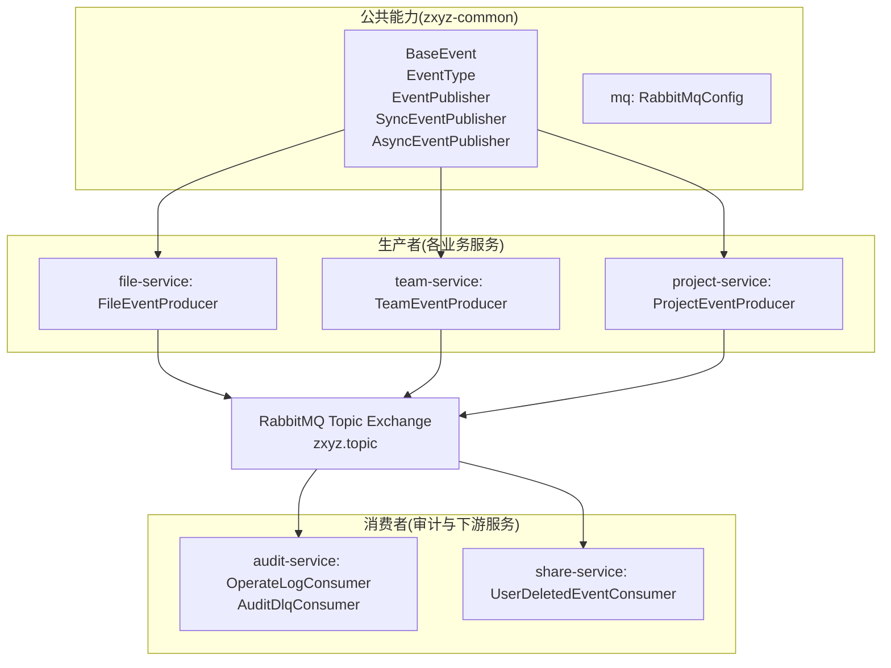
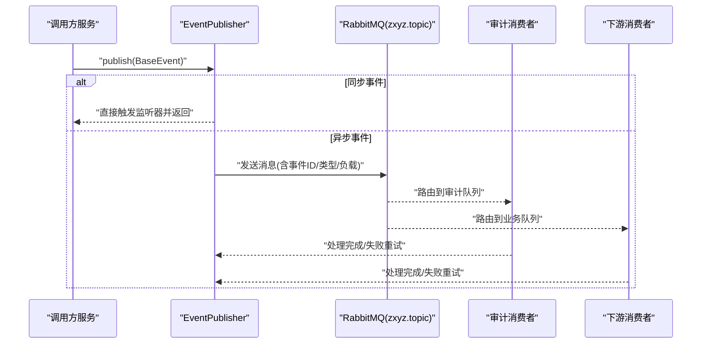
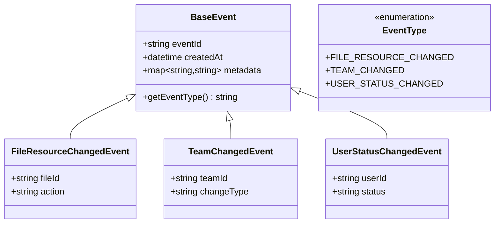
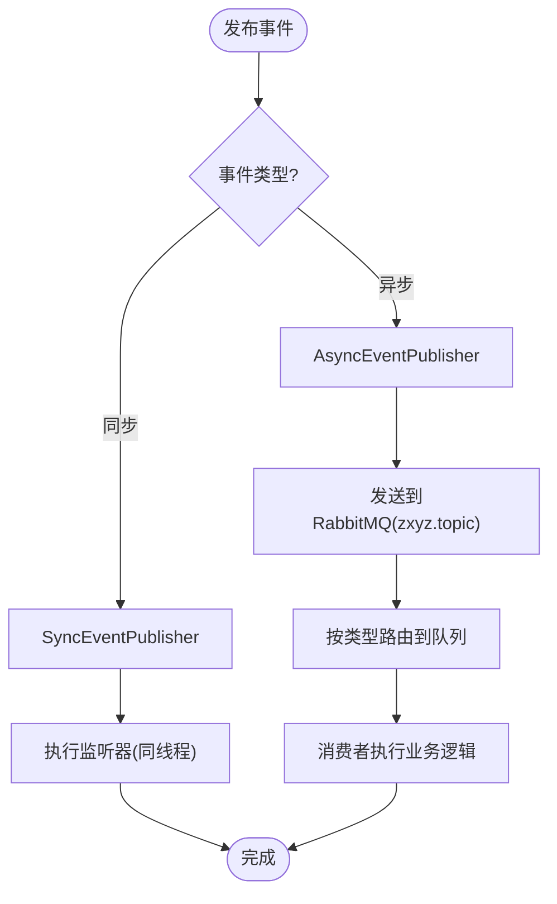
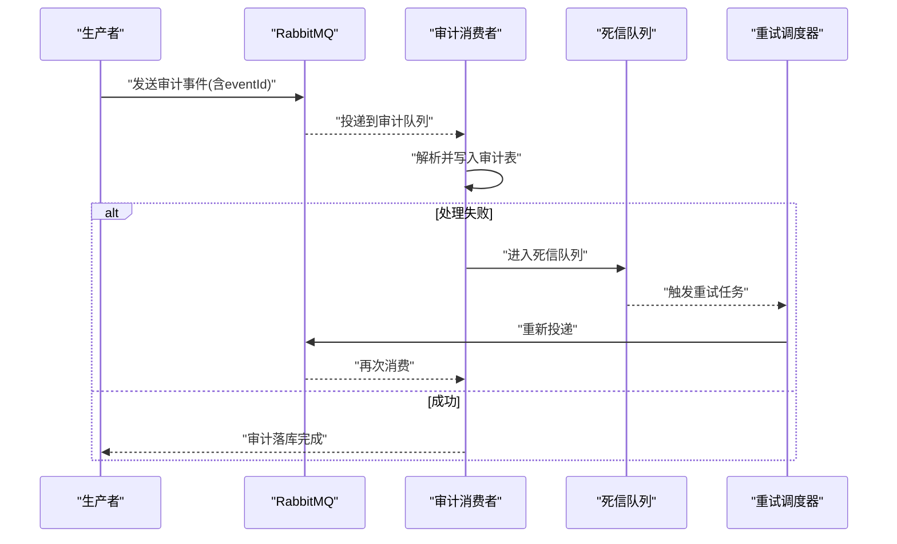
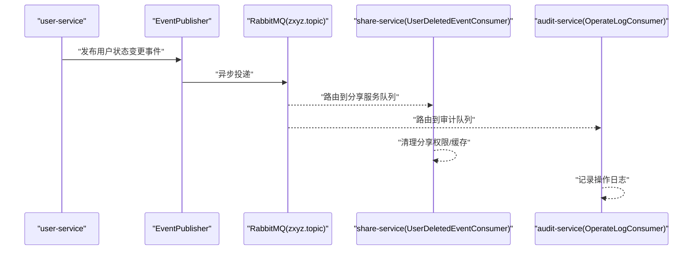
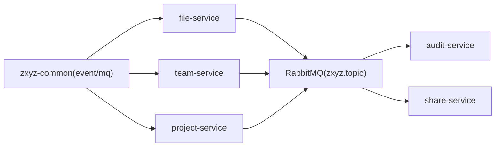

# 事件驱动架构

<cite>
**本文引用的文件**   
- [zxyz-common/src/main/java/uno/acloud/common/event/BaseEvent.java](file://ZXYZdatabaseBack/zxyz-common/src/main/java/uno/acloud/common/event/BaseEvent.java)
- [zxyz-common/src/main/java/uno/acloud/common/event/EventType.java](file://ZXYZdatabaseBack/zxyz-common/src/main/java/uno/acloud/common/event/EventType.java)
- [zxyz-common/src/main/java/uno/acloud/common/event/EventPublisher.java](file://ZXYZdatabaseBack/zxyz-common/src/main/java/uno/acloud/common/event/EventPublisher.java)
- [zxyz-common/src/main/java/uno/acloud/common/event/EventListener.java](file://ZXYZdatabaseBack/zxyz-common/src/main/java/uno/acloud/common/event/EventListener.java)
- [zxyz-common/src/main/java/uno/acloud/common/event/SyncEventPublisher.java](file://ZXYZdatabaseBack/zxyz-common/src/main/java/uno/acloud/common/event/SyncEventPublisher.java)
- [zxyz-common/src/main/java/uno/acloud/common/event/AsyncEventPublisher.java](file://ZXYZdatabaseBack/zxyz-common/src/main/java/uno/acloud/common/event/AsyncEventPublisher.java)
- [zxyz-common/src/main/java/uno/acloud/common/mq/RabbitMqConfig.java](file://ZXYZdatabaseBack/zxyz-common/src/main/java/uno/acloud/common/mq/RabbitMqConfig.java)
- [zxyz-audit-service/src/main/java/uno/acloud/audit/config/RabbitMqConfig.java](file://ZXYZdatabaseBack/zxyz-audit-service/src/main/java/uno/acloud/audit/config/RabbitMqConfig.java)
- [zxyz-audit-service/src/main/java/uno/acloud/audit/mq/OperateLogConsumer.java](file://ZXYZdatabaseBack/zxyz-audit-service/src/main/java/uno/acloud/audit/mq/OperateLogConsumer.java)
- [zxyz-audit-service/src/main/java/uno/acloud/audit/mq/AuditDlqConsumer.java](file://ZXYZdatabaseBack/zxyz-audit-service/src/main/java/uno/acloud/audit/mq/AuditDlqConsumer.java)
- [zxyz-file-service/src/main/java/uno/acloud/file/mq/FileEventProducer.java](file://ZXYZdatabaseBack/zxyz-file-service/src/main/java/uno/acloud/file/mq/FileEventProducer.java)
- [zxyz-team-service/src/main/java/uno/acloud/team/mq/TeamEventProducer.java](file://ZXYZdatabaseBack/zxyz-team-service/src/main/java/uno/acloud/team/mq/TeamEventProducer.java)
- [zxyz-share-service/src/main/java/uno/acloud/share/mq/UserDeletedEventConsumer.java](file://ZXYZdatabaseBack/zxyz-share-service/src/main/java/uno/acloud/share/mq/UserDeletedEventConsumer.java)
- [zxyz-project-service/src/main/java/uno/acloud/project/mq/ProjectEventProducer.java](file://ZXYZdatabaseBack/zxyz-project-service/src/main/java/uno/acloud/project/mq/ProjectEventProducer.java)
- [zxyz-user-service/src/main/java/uno/acloud/user/service/UserService.java](file://ZXYZdatabaseBack/zxyz-user-service/src/main/java/uno/acloud/user/service/UserService.java)
- [zxyz-common/src/main/java/uno/acloud/common/audit/AuditEventPublisher.java](file://ZXYZdatabaseBack/zxyz-common/src/main/java/uno/acloud/common/audit/AuditEventPublisher.java)
- [zxyz-common/src/main/java/uno/acloud/common/audit/AuditBufferRetryScheduler.java](file://ZXYZdatabaseBack/zxyz-common/src/main/java/uno/acloud/common/audit/AuditBufferRetryScheduler.java)
- [zxyz-common/src/test/java/uno/acloud/common/audit/AuditEventPublisherTest.java](file://ZXYZdatabaseBack/zxyz-common/src/test/java/uno/acloud/common/audit/AuditEventPublisherTest.java)
- [zxyz-common/src/test/java/uno/acloud/common/audit/AuditBufferRetrySchedulerTest.java](file://ZXYZdatabaseBack/zxyz-common/src/test/java/uno/acloud/common/audit/AuditBufferRetrySchedulerTest.java)
- [zxyz-audit-service/src/test/java/uno/acloud/audit/mq/OperateLogConsumerTest.java](file://ZXYZdatabaseBack/zxyz-audit-service/src/test/java/uno/acloud/audit/mq/OperateLogConsumerTest.java)
- [zxyz-share-service/src/test/java/uno/acloud/share/mq/UserDeletedEventConsumerTest.java](file://ZXYZdatabaseBack/zxyz-share-service/src/test/java/uno/acloud/share/mq/UserDeletedEventConsumerTest.java)
- [nacos-config/zxyz-dynamic.yml](file://nacos-config/zxyz-dynamic.yml)
- [nacos-config/zxyz-static.yml](file://nacos-config/zxyz-static.yml)
- [docker-compose.yml](file://docker-compose.yml)
</cite>

## 目录
1. [引言](#引言)
2. [项目结构](#项目结构)
3. [核心组件](#核心组件)
4. [架构总览](#架构总览)
5. [详细组件分析](#详细组件分析)
6. [依赖关系分析](#依赖关系分析)
7. [性能考量](#性能考量)
8. [故障排查指南](#故障排查指南)
9. [结论](#结论)
10. [附录：扩展开发指南与最佳实践](#附录扩展开发指南与最佳实践)

## 引言
本文件面向 ZXYZ 微服务系统的事件驱动架构，围绕基于 BaseEvent 基类的事件体系，系统化阐述事件定义规范、发布订阅模式、处理器实现、跨服务传播机制（同步/异步/跨服务）、事件追踪与审计（事件ID、状态跟踪、失败重试），并给出架构图、处理流程图与调试方法，以及扩展开发与最佳实践。

## 项目结构
ZXYZ 后端采用多模块 Maven 工程，事件相关能力集中在 zxyz-common 的 event 与 mq 包中，各业务服务通过 EventPublisher 发布事件，并通过 RabbitMQ Topic Exchange 进行异步传播；审计子系统集中消费审计事件并落库。

图表来源
- [zxyz-common/src/main/java/uno/acloud/common/event/BaseEvent.java](file://ZXYZdatabaseBack/zxyz-common/src/main/java/uno/acloud/common/event/BaseEvent.java)
- [zxyz-common/src/main/java/uno/acloud/common/event/EventType.java](file://ZXYZdatabaseBack/zxyz-common/src/main/java/uno/acloud/common/event/EventType.java)
- [zxyz-common/src/main/java/uno/acloud/common/event/EventPublisher.java](file://ZXYZdatabaseBack/zxyz-common/src/main/java/uno/acloud/common/event/EventPublisher.java)
- [zxyz-common/src/main/java/uno/acloud/common/event/SyncEventPublisher.java](file://ZXYZdatabaseBack/zxyz-common/src/main/java/uno/acloud/common/event/SyncEventPublisher.java)
- [zxyz-common/src/main/java/uno/acloud/common/event/AsyncEventPublisher.java](file://ZXYZdatabaseBack/zxyz-common/src/main/java/uno/acloud/common/event/AsyncEventPublisher.java)
- [zxyz-common/src/main/java/uno/acloud/common/mq/RabbitMqConfig.java](file://ZXYZdatabaseBack/zxyz-common/src/main/java/uno/acloud/common/mq/RabbitMqConfig.java)
- [zxyz-file-service/src/main/java/uno/acloud/file/mq/FileEventProducer.java](file://ZXYZdatabaseBack/zxyz-file-service/src/main/java/uno/acloud/file/mq/FileEventProducer.java)
- [zxyz-team-service/src/main/java/uno/acloud/team/mq/TeamEventProducer.java](file://ZXYZdatabaseBack/zxyz-team-service/src/main/java/uno/acloud/team/mq/TeamEventProducer.java)
- [zxyz-project-service/src/main/java/uno/acloud/project/mq/ProjectEventProducer.java](file://ZXYZdatabaseBack/zxyz-project-service/src/main/java/uno/acloud/project/mq/ProjectEventProducer.java)
- [zxyz-audit-service/src/main/java/uno/acloud/audit/mq/OperateLogConsumer.java](file://ZXYZdatabaseBack/zxyz-audit-service/src/main/java/uno/acloud/audit/mq/OperateLogConsumer.java)
- [zxyz-audit-service/src/main/java/uno/acloud/audit/mq/AuditDlqConsumer.java](file://ZXYZdatabaseBack/zxyz-audit-service/src/main/java/uno/acloud/mq/AuditDlqConsumer.java)
- [zxyz-share-service/src/main/java/uno/acloud/share/mq/UserDeletedEventConsumer.java](file://ZXYZdatabaseBack/zxyz-share-service/src/main/java/uno/acloud/share/mq/UserDeletedEventConsumer.java)

章节来源
- [zxyz-common/src/main/java/uno/acloud/common/event/BaseEvent.java](file://ZXYZdatabaseBack/zxyz-common/src/main/java/uno/acloud/common/event/BaseEvent.java)
- [zxyz-common/src/main/java/uno/acloud/common/event/EventType.java](file://ZXYZdatabaseBack/zxyz-common/src/main/java/uno/acloud/common/event/EventType.java)
- [zxyz-common/src/main/java/uno/acloud/common/event/EventPublisher.java](file://ZXYZdatabaseBack/zxyz-common/src/main/java/uno/acloud/common/event/EventPublisher.java)
- [zxyz-common/src/main/java/uno/acloud/common/mq/RabbitMqConfig.java](file://ZXYZdatabaseBack/zxyz-common/src/main/java/uno/acloud/common/mq/RabbitMqConfig.java)

## 核心组件
- BaseEvent：所有事件的统一基类，承载事件元数据（如事件ID、时间戳、租户/团队上下文等）与通用字段，确保事件可追踪、可审计。
- EventType：事件类型枚举或常量，用于路由与分类（例如文件资源变更、团队变更、用户状态变更）。
- EventPublisher：事件发布抽象接口，屏蔽同步与异步差异，提供统一的 publish(event) 入口。
- SyncEventPublisher：同步事件发布者，直接在调用线程内触发监听器，适用于强一致或快速反馈场景。
- AsyncEventPublisher：异步事件发布者，将事件投递到消息队列（RabbitMQ），适用于解耦与削峰。
- RabbitMqConfig：RabbitMQ 连接与交换机/队列配置，Topic Exchange 名称为 zxyz.topic，按事件类型路由。

章节来源
- [zxyz-common/src/main/java/uno/acloud/common/event/BaseEvent.java](file://ZXYZdatabaseBack/zxyz-common/src/main/java/uno/acloud/common/event/BaseEvent.java)
- [zxyz-common/src/main/java/uno/acloud/common/event/EventType.java](file://ZXYZdatabaseBack/zxyz-common/src/main/java/uno/acloud/common/event/EventType.java)
- [zxyz-common/src/main/java/uno/acloud/common/event/EventPublisher.java](file://ZXYZdatabaseBack/zxyz-common/src/main/java/uno/acloud/common/event/EventPublisher.java)
- [zxyz-common/src/main/java/uno/acloud/common/event/SyncEventPublisher.java](file://ZXYZdatabaseBack/zxyz-common/src/main/java/uno/acloud/common/event/SyncEventPublisher.java)
- [zxyz-common/src/main/java/uno/acloud/common/event/AsyncEventPublisher.java](file://ZXYZdatabaseBack/zxyz-common/src/main/java/uno/acloud/common/event/AsyncEventPublisher.java)
- [zxyz-common/src/main/java/uno/acloud/common/mq/RabbitMqConfig.java](file://ZXYZdatabaseBack/zxyz-common/src/main/java/uno/acloud/common/mq/RabbitMqConfig.java)

## 架构总览
事件驱动架构以“生产者-消息中间件-消费者”为核心，结合本地同步事件与远程异步事件，形成松耦合、可扩展的领域交互模型。

图表来源
- [zxyz-common/src/main/java/uno/acloud/common/event/EventPublisher.java](file://ZXYZdatabaseBack/zxyz-common/src/main/java/uno/acloud/common/event/EventPublisher.java)
- [zxyz-common/src/main/java/uno/acloud/common/event/SyncEventPublisher.java](file://ZXYZdatabaseBack/zxyz-common/src/main/java/uno/acloud/common/event/SyncEventPublisher.java)
- [zxyz-common/src/main/java/uno/acloud/common/event/AsyncEventPublisher.java](file://ZXYZdatabaseBack/zxyz-common/src/main/java/uno/acloud/common/event/AsyncEventPublisher.java)
- [zxyz-common/src/main/java/uno/acloud/common/mq/RabbitMqConfig.java](file://ZXYZdatabaseBack/zxyz-common/src/main/java/uno/acloud/common/mq/RabbitMqConfig.java)
- [zxyz-audit-service/src/main/java/uno/acloud/audit/mq/OperateLogConsumer.java](file://ZXYZdatabaseBack/zxyz-audit-service/src/main/java/uno/acloud/audit/mq/OperateLogConsumer.java)
- [zxyz-share-service/src/main/java/uno/acloud/share/mq/UserDeletedEventConsumer.java](file://ZXYZdatabaseBack/zxyz-share-service/src/main/java/uno/acloud/share/mq/UserDeletedEventConsumer.java)

## 详细组件分析

### 事件基类与类型规范
- BaseEvent 提供事件唯一标识、创建时间、扩展属性等，保证全链路可追踪。
- EventType 对事件进行分类，便于路由、过滤与统计。
- 建议：新增事件需继承 BaseEvent，并在 EventType 中注册，避免硬编码字符串。

图表来源
- [zxyz-common/src/main/java/uno/acloud/common/event/BaseEvent.java](file://ZXYZdatabaseBack/zxyz-common/src/main/java/uno/acloud/common/event/BaseEvent.java)
- [zxyz-common/src/main/java/uno/acloud/common/event/EventType.java](file://ZXYZdatabaseBack/zxyz-common/src/main/java/uno/acloud/common/event/EventType.java)

章节来源
- [zxyz-common/src/main/java/uno/acloud/common/event/BaseEvent.java](file://ZXYZdatabaseBack/zxyz-common/src/main/java/uno/acloud/common/event/BaseEvent.java)
- [zxyz-common/src/main/java/uno/acloud/common/event/EventType.java](file://ZXYZdatabaseBack/zxyz-common/src/main/java/uno/acloud/common/event/EventType.java)

### 发布订阅模式与处理器
- EventPublisher 作为统一入口，内部根据事件类型选择同步或异步策略。
- SyncEventPublisher：在调用线程内执行监听器，适合需要立即回写或强一致的场景。
- AsyncEventPublisher：通过 RabbitMQ 投递，适合高吞吐与解耦场景。
- 监听器实现：各服务实现 EventListener 接口，按事件类型订阅处理。

图表来源
- [zxyz-common/src/main/java/uno/acloud/common/event/EventPublisher.java](file://ZXYZdatabaseBack/zxyz-common/src/main/java/uno/acloud/common/event/EventPublisher.java)
- [zxyz-common/src/main/java/uno/acloud/common/event/SyncEventPublisher.java](file://ZXYZdatabaseBack/zxyz-common/src/main/java/uno/acloud/common/event/SyncEventPublisher.java)
- [zxyz-common/src/main/java/uno/acloud/common/event/AsyncEventPublisher.java](file://ZXYZdatabaseBack/zxyz-common/src/main/java/uno/acloud/common/event/AsyncEventPublisher.java)
- [zxyz-common/src/main/java/uno/acloud/common/mq/RabbitMqConfig.java](file://ZXYZdatabaseBack/zxyz-common/src/main/java/uno/acloud/common/mq/RabbitMqConfig.java)

章节来源
- [zxyz-common/src/main/java/uno/acloud/common/event/EventPublisher.java](file://ZXYZdatabaseBack/zxyz-common/src/main/java/uno/acloud/common/event/EventPublisher.java)
- [zxyz-common/src/main/java/uno/acloud/common/event/SyncEventPublisher.java](file://ZXYZdatabaseBack/zxyz-common/src/main/java/uno/acloud/common/event/SyncEventPublisher.java)
- [zxyz-common/src/main/java/uno/acloud/common/event/AsyncEventPublisher.java](file://ZXYZdatabaseBack/zxyz-common/src/main/java/uno/acloud/common/event/AsyncEventPublisher.java)

### 核心事件类型与业务场景
- 文件资源变更事件（FileResourceChangedEvent）
  - 场景：上传、删除、移动、重命名文件后，通知索引重建、权限校验、分享链接失效等。
  - 处理：file-service 生产事件，审计服务记录操作日志，其他服务按需消费。
- 团队变更事件（TeamChangedEvent）
  - 场景：团队信息更新、成员变更、配额调整等，触发缓存刷新、权限同步。
  - 处理：team-service 生产事件，下游服务（如 project、share）消费并更新本地视图。
- 用户状态事件（UserStatusChangedEvent）
  - 场景：用户禁用、注销、角色变更，影响 IM、邮件、分享访问控制。
  - 处理：user-service 生产事件，im/email/share 等服务消费并清理会话或权限。

章节来源
- [zxyz-file-service/src/main/java/uno/acloud/file/mq/FileEventProducer.java](file://ZXYZdatabaseBack/zxyz-file-service/src/main/java/uno/acloud/file/mq/FileEventProducer.java)
- [zxyz-team-service/src/main/java/uno/acloud/team/mq/TeamEventProducer.java](file://ZXYZdatabaseBack/zxyz-team-service/src/main/java/uno/acloud/team/mq/TeamEventProducer.java)
- [zxyz-user-service/src/main/java/uno/acloud/user/service/UserService.java](file://ZXYZdatabaseBack/zxyz-user-service/src/main/java/uno/acloud/user/service/UserService.java)
- [zxyz-share-service/src/main/java/uno/acloud/share/mq/UserDeletedEventConsumer.java](file://ZXYZdatabaseBack/zxyz-share-service/src/main/java/uno/acloud/share/mq/UserDeletedEventConsumer.java)

### 事件传播机制
- 同步事件：在同一 JVM 内直接调用监听器，低延迟但存在耦合风险，适用于强一致或快速反馈。
- 异步事件：通过 RabbitMQ Topic Exchange 广播/路由，支持多消费者并行处理，具备削峰与解耦优势。
- 跨服务事件：使用 zxyz.topic 交换器，按事件类型路由至不同队列，消费者独立部署，互不影响。

章节来源
- [zxyz-common/src/main/java/uno/acloud/common/mq/RabbitMqConfig.java](file://ZXYZdatabaseBack/zxyz-common/src/main/java/uno/acloud/common/mq/RabbitMqConfig.java)
- [zxyz-audit-service/src/main/java/uno/acloud/audit/config/RabbitMqConfig.java](file://ZXYZdatabaseBack/zxyz-audit-service/src/main/java/uno/acloud/audit/config/RabbitMqConfig.java)

### 事件追踪与审计
- 事件ID生成：BaseEvent 中生成全局唯一 ID，贯穿生产、传输、消费全流程。
- 处理状态跟踪：审计服务消费审计事件并持久化，记录 before/after 值与哈希去重。
- 失败重试机制：DLQ（死信队列）+ 重试调度器，保障最终一致性。

图表来源
- [zxyz-audit-service/src/main/java/uno/acloud/audit/mq/OperateLogConsumer.java](file://ZXYZdatabaseBack/zxyz-audit-service/src/main/java/uno/acloud/audit/mq/OperateLogConsumer.java)
- [zxyz-audit-service/src/main/java/uno/acloud/audit/mq/AuditDlqConsumer.java](file://ZXYZdatabaseBack/zxyz-audit-service/src/main/java/uno/acloud/audit/mq/AuditDlqConsumer.java)
- [zxyz-common/src/main/java/uno/acloud/common/audit/AuditBufferRetryScheduler.java](file://ZXYZdatabaseBack/zxyz-common/src/main/java/uno/acloud/common/audit/AuditBufferRetryScheduler.java)

章节来源
- [zxyz-common/src/main/java/uno/acloud/common/audit/AuditEventPublisher.java](file://ZXYZdatabaseBack/zxyz-common/src/main/java/uno/acloud/common/audit/AuditEventPublisher.java)
- [zxyz-common/src/main/java/uno/acloud/common/audit/AuditBufferRetryScheduler.java](file://ZXYZdatabaseBack/zxyz-common/src/main/java/uno/acloud/common/audit/AuditBufferRetryScheduler.java)
- [zxyz-audit-service/src/main/java/uno/acloud/audit/mq/OperateLogConsumer.java](file://ZXYZdatabaseBack/zxyz-audit-service/src/main/java/uno/acloud/audit/mq/OperateLogConsumer.java)
- [zxyz-audit-service/src/main/java/uno/acloud/audit/mq/AuditDlqConsumer.java](file://ZXYZdatabaseBack/zxyz-audit-service/src/main/java/uno/acloud/audit/mq/AuditDlqConsumer.java)

### 关键流程时序图（示例：用户删除事件）

图表来源
- [zxyz-user-service/src/main/java/uno/acloud/user/service/UserService.java](file://ZXYZdatabaseBack/zxyz-user-service/src/main/java/uno/acloud/user/service/UserService.java)
- [zxyz-common/src/main/java/uno/acloud/common/event/EventPublisher.java](file://ZXYZdatabaseBack/zxyz-common/src/main/java/uno/acloud/common/event/EventPublisher.java)
- [zxyz-share-service/src/main/java/uno/acloud/share/mq/UserDeletedEventConsumer.java](file://ZXYZdatabaseBack/zxyz-share-service/src/main/java/uno/acloud/share/mq/UserDeletedEventConsumer.java)
- [zxyz-audit-service/src/main/java/uno/acloud/audit/mq/OperateLogConsumer.java](file://ZXYZdatabaseBack/zxyz-audit-service/src/main/java/uno/acloud/audit/mq/OperateLogConsumer.java)

## 依赖关系分析
- 事件基础能力集中在 zxyz-common，各服务通过依赖该模块获得事件发布能力。
- 异步传播依赖 RabbitMQ，交换机名称与路由键由配置管理（Nacos）。
- 审计服务独立消费审计事件，不阻塞主业务流程。

图表来源
- [zxyz-common/src/main/java/uno/acloud/common/event/EventPublisher.java](file://ZXYZdatabaseBack/zxyz-common/src/main/java/uno/acloud/common/event/EventPublisher.java)
- [zxyz-common/src/main/java/uno/acloud/common/mq/RabbitMqConfig.java](file://ZXYZdatabaseBack/zxyz-common/src/main/java/uno/acloud/common/mq/RabbitMqConfig.java)
- [zxyz-file-service/src/main/java/uno/acloud/file/mq/FileEventProducer.java](file://ZXYZdatabaseBack/zxyz-file-service/src/main/java/uno/acloud/file/mq/FileEventProducer.java)
- [zxyz-team-service/src/main/java/uno/acloud/team/mq/TeamEventProducer.java](file://ZXYZdatabaseBack/zxyz-team-service/src/main/java/uno/acloud/team/mq/TeamEventProducer.java)
- [zxyz-project-service/src/main/java/uno/acloud/project/mq/ProjectEventProducer.java](file://ZXYZdatabaseBack/zxyz-project-service/src/main/java/uno/acloud/project/mq/ProjectEventProducer.java)
- [zxyz-audit-service/src/main/java/uno/acloud/audit/mq/OperateLogConsumer.java](file://ZXYZdatabaseBack/zxyz-audit-service/src/main/java/uno/acloud/audit/mq/OperateLogConsumer.java)
- [zxyz-share-service/src/main/java/uno/acloud/share/mq/UserDeletedEventConsumer.java](file://ZXYZdatabaseBack/zxyz-share-service/src/main/java/uno/acloud/share/mq/UserDeletedEventConsumer.java)

章节来源
- [zxyz-common/src/main/java/uno/acloud/common/event/EventPublisher.java](file://ZXYZdatabaseBack/zxyz-common/src/main/java/uno/acloud/common/event/EventPublisher.java)
- [zxyz-common/src/main/java/uno/acloud/common/mq/RabbitMqConfig.java](file://ZXYZdatabaseBack/zxyz-common/src/main/java/uno/acloud/common/mq/RabbitMqConfig.java)

## 性能考量
- 同步 vs 异步：高频、非关键路径事件优先异步，降低主流程延迟。
- 批处理与缓冲：审计事件可批量写入，减少数据库压力。
- 幂等性：消费者应基于 eventId 去重，避免重复处理。
- 背压与限流：队列堆积时启用消费者限流与动态扩容。
- 监控与指标：关注队列长度、消费延迟、失败率与重试次数。

[本节为通用指导，无需引用具体文件]

## 故障排查指南
- 常见问题定位
  - 事件未到达消费者：检查交换机/队列绑定、路由键是否正确。
  - 消费者处理失败：查看 DLQ 与重试日志，确认业务异常原因。
  - 审计缺失：核对审计事件是否被正确投递与持久化。
- 调试方法
  - 开启消费者 DEBUG 日志，打印 eventId 与 payload。
  - 使用 RabbitMQ 控制台观察队列深度与消息流转。
  - 单元测试覆盖消费者逻辑，模拟失败与重试路径。

章节来源
- [zxyz-audit-service/src/test/java/uno/acloud/audit/mq/OperateLogConsumerTest.java](file://ZXYZdatabaseBack/zxyz-audit-service/src/test/java/uno/acloud/audit/mq/OperateLogConsumerTest.java)
- [zxyz-share-service/src/test/java/uno/acloud/share/mq/UserDeletedEventConsumerTest.java](file://ZXYZdatabaseBack/zxyz-share-service/src/test/java/uno/acloud/share/mq/UserDeletedEventConsumerTest.java)
- [zxyz-common/src/test/java/uno/acloud/common/audit/AuditEventPublisherTest.java](file://ZXYZdatabaseBack/zxyz-common/src/test/java/uno/acloud/common/audit/AuditEventPublisherTest.java)
- [zxyz-common/src/test/java/uno/acloud/common/audit/AuditBufferRetrySchedulerTest.java](file://ZXYZdatabaseBack/zxyz-common/src/test/java/uno/acloud/common/audit/AuditBufferRetrySchedulerTest.java)

## 结论
ZXYZ 的事件驱动架构以 BaseEvent 为核心，结合同步与异步发布策略，通过 RabbitMQ 实现跨服务解耦与可靠传播。审计子系统提供完整的事件追踪与重试保障，满足高可用与可观测性要求。遵循本文规范与最佳实践，可有效扩展新事件类型与处理器，保持系统稳定演进。

[本节为总结性内容，无需引用具体文件]

## 附录：扩展开发指南与最佳实践
- 新增事件步骤
  - 定义事件类：继承 BaseEvent，补充必要字段。
  - 注册事件类型：在 EventType 中新增枚举项。
  - 选择发布策略：根据一致性需求选择 SyncEventPublisher 或 AsyncEventPublisher。
  - 实现消费者：在目标服务实现 EventListener，处理业务逻辑并确保幂等。
- 配置与运维
  - 使用 Nacos 管理 RabbitMQ 配置与动态开关（如 zxyz-dynamic.yml、zxyz-static.yml）。
  - 容器编排通过 docker-compose.yml 统一管理基础设施与服务。
- 测试与验证
  - 编写单元测试覆盖发布与消费路径，模拟失败与重试。
  - 集成测试验证端到端事件流转与审计落库。
- 安全与治理
  - 事件负载最小化，敏感信息脱敏。
  - 限制消费者并发度，防止雪崩。
  - 建立事件契约与版本兼容策略，避免破坏性变更。

章节来源
- [nacos-config/zxyz-dynamic.yml](file://nacos-config/zxyz-dynamic.yml)
- [nacos-config/zxyz-static.yml](file://nacos-config/zxyz-static.yml)
- [docker-compose.yml](file://docker-compose.yml)