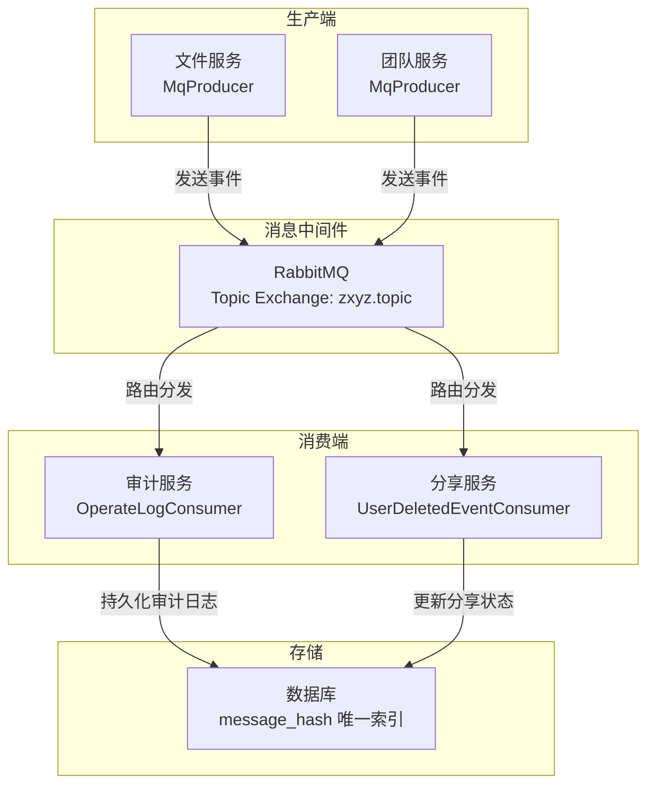
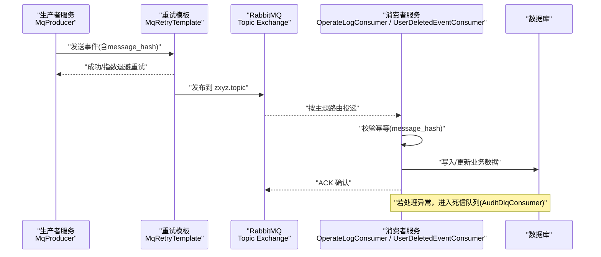
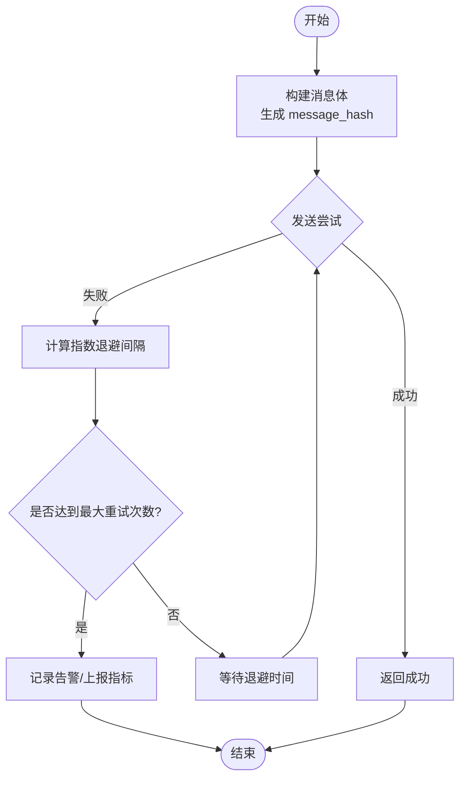
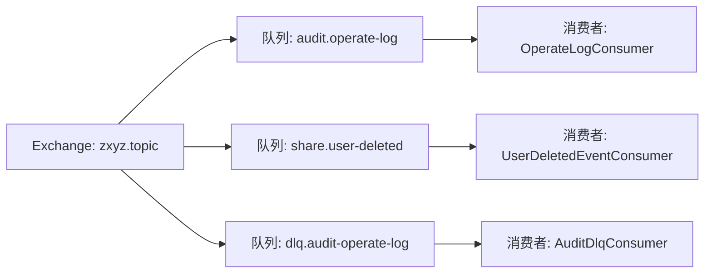
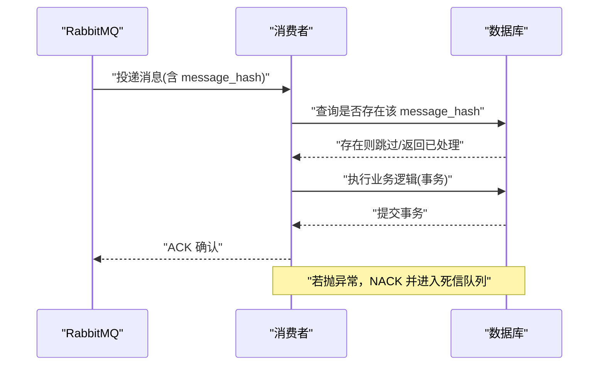
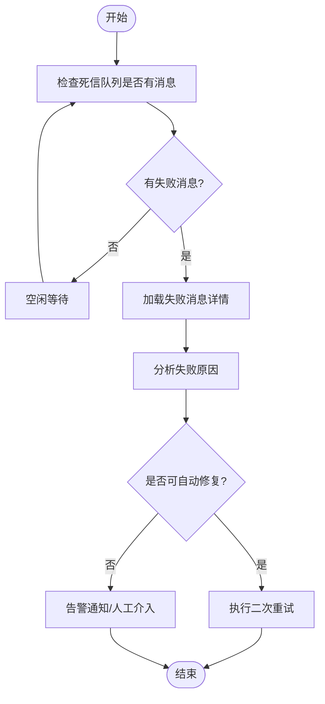
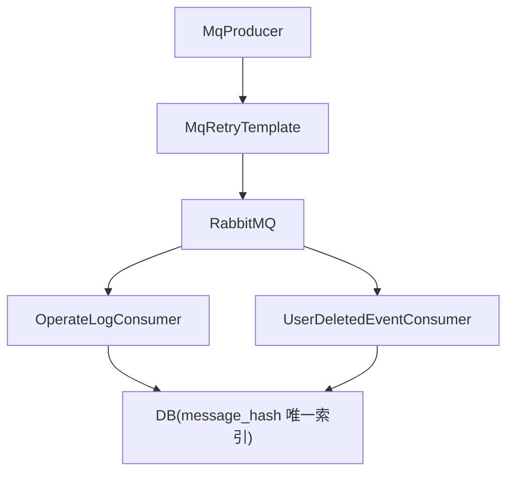
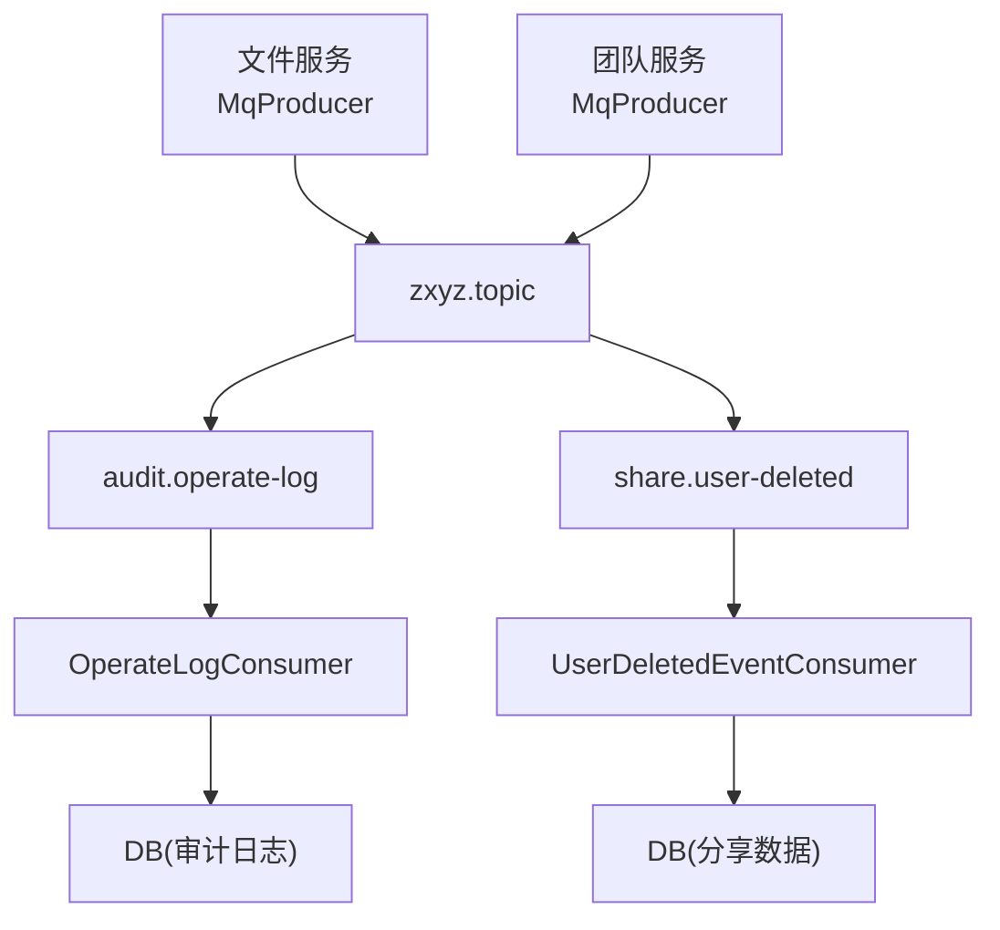

# 异步消息处理

<cite>
**本文引用的文件**   
- [zxyz-audit-service/RabbitMqConfig.java](file://ZXYZdatabaseBack/zxyz-audit-service/src/main/java/uno/acloud/audit/config/RabbitMqConfig.java)
- [zxyz-audit-service/OperateLogConsumer.java](file://ZXYZdatabaseBack/zxyz-audit-service/src/main/java/uno/acloud/audit/mq/OperateLogConsumer.java)
- [zxyz-audit-service/AuditDlqConsumer.java](file://ZXYZdatabaseBack/zxyz-audit-service/src/main/java/uno/acloud/audit/mq/AuditDlqConsumer.java)
- [zxyz-audit-service/V3__add_message_hash_unique.sql](file://ZXYZdatabaseBack/zxyz-audit-service/src/main/resources/db/migration/V3__add_message_hash_unique.sql)
- [zxyz-common/MqRetryTemplate.java](file://ZXYZdatabaseBack/zxyz-common/src/main/java/uno/acloud/common/mq/MqRetryTemplate.java)
- [zxyz-common/event/FileResourceChangedEvent.java](file://ZXYZdatabaseBack/zxyz-common/src/main/java/uno/acloud/common/event/FileResourceChangedEvent.java)
- [zxyz-common/event/TeamCreatedEvent.java](file://ZXYZdatabaseBack/zxyz-common/src/main/java/uno/acloud/common/event/TeamCreatedEvent.java)
- [zxyz-common/event/UserDeletedEvent.java](file://ZXYZdatabaseBack/zxyz-common/src/main/java/uno/acloud/common/event/UserDeletedEvent.java)
- [zxyz-file-service/MqProducer.java](file://ZXYZdatabaseBack/zxyz-file-service/src/main/java/uno/acloud/file/mq/MqProducer.java)
- [zxyz-team-service/MqProducer.java](file://ZXYZdatabaseBack/zxyz-team-service/src/main/java/uno/acloud/team/mq/MqProducer.java)
- [zxyz-share-service/UserDeletedEventConsumer.java](file://ZXYZdatabaseBack/zxyz-share-service/src/main/java/uno/acloud/share/mq/UserDeletedEventConsumer.java)
- [docker-compose.yml](file://docker-compose.yml)
- [nacos-config/zxyz-audit-service.yml](file://nacos-config/zxyz-audit-service.yml)
- [nacos-config/zxyz-file-service.yml](file://nacos-config/zxyz-file-service.yml)
- [nacos-config/zxyz-team-service.yml](file://nacos-config/zxyz-team-service.yml)
</cite>

## 目录
1. [简介](#简介)
2. [项目结构](#项目结构)
3. [核心组件](#核心组件)
4. [架构总览](#架构总览)
5. [详细组件分析](#详细组件分析)
6. [依赖关系分析](#依赖关系分析)
7. [性能考虑](#性能考虑)
8. [故障排查指南](#故障排查指南)
9. [结论](#结论)
10. [附录](#附录)

## 简介
本文件面向 ZXYZ 项目的异步消息处理机制，围绕基于 RabbitMQ 的事件驱动架构展开。整体流程为：事件生产者通过 MqRetryTemplate 发送消息 → Topic Exchange 路由 → 消费者监听处理 → 结果持久化。文档重点说明消息重试机制（指数退避、死信队列、消息去重 message_hash 唯一索引）、核心事件类型（FileResourceChangedEvent、TeamCreatedEvent、UserDeletedEvent）的设计与使用场景，以及消费侧最佳实践（幂等性、异常处理、日志记录）。同时提供消息流转图、重试策略配置要点、监控告警方案、积压处理与故障恢复指南。

## 项目结构
本项目采用微服务架构，后端包含多个独立 Maven 模块。与异步消息相关的关键位置如下：
- 公共能力：zxyz-common 中定义通用事件与 MQ 模板
- 生产者：各业务服务（如 file-service、team-service）中的 mq 包内生产者
- 消费者：audit-service 的 OperateLogConsumer、share-service 的 UserDeletedEventConsumer 等
- 配置：各服务的 nacos 配置文件声明 RabbitMQ 连接与队列/交换器参数
- 基础设施：docker-compose.yml 编排 RabbitMQ 与其他组件

图表来源
- [zxyz-file-service/MqProducer.java](file://ZXYZdatabaseBack/zxyz-file-service/src/main/java/uno/acloud/file/mq/MqProducer.java)
- [zxyz-team-service/MqProducer.java](file://ZXYZdatabaseBack/zxyz-team-service/src/main/java/uno/acloud/team/mq/MqProducer.java)
- [zxyz-audit-service/OperateLogConsumer.java](file://ZXYZdatabaseBack/zxyz-audit-service/src/main/java/uno/acloud/audit/mq/OperateLogConsumer.java)
- [zxyz-share-service/UserDeletedEventConsumer.java](file://ZXYZdatabaseBack/zxyz-share-service/src/main/java/uno/acloud/share/mq/UserDeletedEventConsumer.java)
- [zxyz-audit-service/V3__add_message_hash_unique.sql](file://ZXYZdatabaseBack/zxyz-audit-service/src/main/resources/db/migration/V3__add_message_hash_unique.sql)

章节来源
- [docker-compose.yml](file://docker-compose.yml)
- [nacos-config/zxyz-audit-service.yml](file://nacos-config/zxyz-audit-service.yml)
- [nacos-config/zxyz-file-service.yml](file://nacos-config/zxyz-file-service.yml)
- [nacos-config/zxyz-team-service.yml](file://nacos-config/zxyz-team-service.yml)

## 核心组件
- MqRetryTemplate：封装消息发送的重试逻辑，支持指数退避与最大重试次数控制，确保在瞬时故障下提升可靠性。
- Topic Exchange：统一的消息路由中心，按主题键将消息分发到对应队列。
- 消费者：
  - OperateLogConsumer：消费审计事件并落库，保证幂等与可观测性。
  - AuditDlqConsumer：消费死信队列，用于失败消息的兜底处理与人工干预。
  - UserDeletedEventConsumer：消费用户删除事件，清理或标记分享资源。
- 事件模型：
  - FileResourceChangedEvent：文件资源变更事件，触发下游同步或缓存失效。
  - TeamCreatedEvent：团队创建事件，初始化权限、配额等关联数据。
  - UserDeletedEvent：用户删除事件，触发跨服务的数据清理与一致性维护。

章节来源
- [zxyz-common/MqRetryTemplate.java](file://ZXYZdatabaseBack/zxyz-common/src/main/java/uno/acloud/common/mq/MqRetryTemplate.java)
- [zxyz-audit-service/RabbitMqConfig.java](file://ZXYZdatabaseBack/zxyz-audit-service/src/main/java/uno/acloud/audit/config/RabbitMqConfig.java)
- [zxyz-audit-service/OperateLogConsumer.java](file://ZXYZdatabaseBack/zxyz-audit-service/src/main/java/uno/acloud/audit/mq/OperateLogConsumer.java)
- [zxyz-audit-service/AuditDlqConsumer.java](file://ZXYZdatabaseBack/zxyz-audit-service/src/main/java/uno/acloud/audit/mq/AuditDlqConsumer.java)
- [zxyz-share-service/UserDeletedEventConsumer.java](file://ZXYZdatabaseBack/zxyz-share-service/src/main/java/uno/acloud/share/mq/UserDeletedEventConsumer.java)
- [zxyz-common/event/FileResourceChangedEvent.java](file://ZXYZdatabaseBack/zxyz-common/src/main/java/uno/acloud/common/event/FileResourceChangedEvent.java)
- [zxyz-common/event/TeamCreatedEvent.java](file://ZXYZdatabaseBack/zxyz-common/src/main/java/uno/acloud/common/event/TeamCreatedEvent.java)
- [zxyz-common/event/UserDeletedEvent.java](file://ZXYZdatabaseBack/zxyz-common/src/main/java/uno/acloud/common/event/UserDeletedEvent.java)

## 架构总览
下图展示从生产者到消费者的完整调用链，包括重试、路由、消费与持久化的关键步骤。

图表来源
- [zxyz-file-service/MqProducer.java](file://ZXYZdatabaseBack/zxyz-file-service/src/main/java/uno/acloud/file/mq/MqProducer.java)
- [zxyz-team-service/MqProducer.java](file://ZXYZdatabaseBack/zxyz-team-service/src/main/java/uno/acloud/team/mq/MqProducer.java)
- [zxyz-common/MqRetryTemplate.java](file://ZXYZdatabaseBack/zxyz-common/src/main/java/uno/acloud/common/mq/MqRetryTemplate.java)
- [zxyz-audit-service/OperateLogConsumer.java](file://ZXYZdatabaseBack/zxyz-audit-service/src/main/java/uno/acloud/audit/mq/OperateLogConsumer.java)
- [zxyz-share-service/UserDeletedEventConsumer.java](file://ZXYZdatabaseBack/zxyz-share-service/src/main/java/uno/acloud/share/mq/UserDeletedEventConsumer.java)

## 详细组件分析

### 消息发送与重试（MqRetryTemplate）
- 职责：封装消息发送与重试策略，避免瞬时故障导致消息丢失。
- 重试策略：指数退避（backoff 时间随重试次数递增），支持最大重试次数上限与退避上限。
- 幂等保障：要求每条消息携带稳定的 message_hash，用于消费端去重。
- 错误处理：捕获网络/序列化异常，按策略重试；超过阈值后记录告警并可能转入死信队列。

图表来源
- [zxyz-common/MqRetryTemplate.java](file://ZXYZdatabaseBack/zxyz-common/src/main/java/uno/acloud/common/mq/MqRetryTemplate.java)

章节来源
- [zxyz-common/MqRetryTemplate.java](file://ZXYZdatabaseBack/zxyz-common/src/main/java/uno/acloud/common/mq/MqRetryTemplate.java)

### Topic Exchange 路由与队列绑定
- 交换器：统一使用 zxyz.topic 作为 Topic Exchange。
- 路由键：按事件类型划分，例如 file.changed、team.created、user.deleted。
- 队列绑定：不同消费者根据订阅的路由键绑定相应队列，实现解耦与多播。

图表来源
- [zxyz-audit-service/RabbitMqConfig.java](file://ZXYZdatabaseBack/zxyz-audit-service/src/main/java/uno/acloud/audit/config/RabbitMqConfig.java)

章节来源
- [zxyz-audit-service/RabbitMqConfig.java](file://ZXYZdatabaseBack/zxyz-audit-service/src/main/java/uno/acloud/audit/config/RabbitMqConfig.java)

### 消费者处理与幂等性（OperateLogConsumer / UserDeletedEventConsumer）
- 幂等性：通过 message_hash 唯一索引进行去重，重复消息直接忽略或返回已处理状态。
- 事务边界：在业务处理前后开启事务，确保数据一致性。
- 异常处理：对可恢复异常进行重试，不可恢复异常抛出以进入死信队列。
- 日志记录：关键路径打点日志，便于追踪与排障。

图表来源
- [zxyz-audit-service/OperateLogConsumer.java](file://ZXYZdatabaseBack/zxyz-audit-service/src/main/java/uno/acloud/audit/mq/OperateLogConsumer.java)
- [zxyz-share-service/UserDeletedEventConsumer.java](file://ZXYZdatabaseBack/zxyz-share-service/src/main/java/uno/acloud/share/mq/UserDeletedEventConsumer.java)
- [zxyz-audit-service/V3__add_message_hash_unique.sql](file://ZXYZdatabaseBack/zxyz-audit-service/src/main/resources/db/migration/V3__add_message_hash_unique.sql)

章节来源
- [zxyz-audit-service/OperateLogConsumer.java](file://ZXYZdatabaseBack/zxyz-audit-service/src/main/java/uno/acloud/audit/mq/OperateLogConsumer.java)
- [zxyz-share-service/UserDeletedEventConsumer.java](file://ZXYZdatabaseBack/zxyz-share-service/src/main/java/uno/acloud/share/mq/UserDeletedEventConsumer.java)
- [zxyz-audit-service/V3__add_message_hash_unique.sql](file://ZXYZdatabaseBack/zxyz-audit-service/src/main/resources/db/migration/V3__add_message_hash_unique.sql)

### 死信队列处理（AuditDlqConsumer）
- 触发条件：消费者处理异常且达到重试上限，消息被路由至死信队列。
- 处理策略：记录失败详情、触发告警、支持人工介入或二次重试。
- 数据保留：死信队列消息需设置合理过期时间与保留策略，避免堆积。

图表来源
- [zxyz-audit-service/AuditDlqConsumer.java](file://ZXYZdatabaseBack/zxyz-audit-service/src/main/java/uno/acloud/audit/mq/AuditDlqConsumer.java)

章节来源
- [zxyz-audit-service/AuditDlqConsumer.java](file://ZXYZdatabaseBack/zxyz-audit-service/src/main/java/uno/acloud/audit/mq/AuditDlqConsumer.java)

### 核心事件类型与使用场景
- FileResourceChangedEvent：当文件上传、修改、删除时发出，触发下游缓存失效、索引重建或通知。
- TeamCreatedEvent：团队创建时发出，初始化成员权限、配额、默认空间等。
- UserDeletedEvent：用户删除时发出，清理分享链接、回收站、权限映射等。

章节来源
- [zxyz-common/event/FileResourceChangedEvent.java](file://ZXYZdatabaseBack/zxyz-common/src/main/java/uno/acloud/common/event/FileResourceChangedEvent.java)
- [zxyz-common/event/TeamCreatedEvent.java](file://ZXYZdatabaseBack/zxyz-common/src/main/java/uno/acloud/common/event/TeamCreatedEvent.java)
- [zxyz-common/event/UserDeletedEvent.java](file://ZXYZdatabaseBack/zxyz-common/src/main/java/uno/acloud/common/event/UserDeletedEvent.java)

### 生产者示例（文件服务与团队服务）
- 文件服务 MqProducer：在文件操作成功后发送 FileResourceChangedEvent。
- 团队服务 MqProducer：在团队创建成功后发送 TeamCreatedEvent。
- 两者均通过 MqRetryTemplate 发送，确保可靠投递。

章节来源
- [zxyz-file-service/MqProducer.java](file://ZXYZdatabaseBack/zxyz-file-service/src/main/java/uno/acloud/file/mq/MqProducer.java)
- [zxyz-team-service/MqProducer.java](file://ZXYZdatabaseBack/zxyz-team-service/src/main/java/uno/acloud/team/mq/MqProducer.java)

## 依赖关系分析
- 生产者依赖 MqRetryTemplate 进行可靠发送。
- 消费者依赖 RabbitMQ 配置类声明队列、交换器与绑定关系。
- 幂等性依赖数据库唯一索引（message_hash）。
- 死信队列依赖消费者抛出的异常与重试上限配置。

图表来源
- [zxyz-file-service/MqProducer.java](file://ZXYZdatabaseBack/zxyz-file-service/src/main/java/uno/acloud/file/mq/MqProducer.java)
- [zxyz-team-service/MqProducer.java](file://ZXYZdatabaseBack/zxyz-team-service/src/main/java/uno/acloud/team/mq/MqProducer.java)
- [zxyz-common/MqRetryTemplate.java](file://ZXYZdatabaseBack/zxyz-common/src/main/java/uno/acloud/common/mq/MqRetryTemplate.java)
- [zxyz-audit-service/OperateLogConsumer.java](file://ZXYZdatabaseBack/zxyz-audit-service/src/main/java/uno/acloud/audit/mq/OperateLogConsumer.java)
- [zxyz-share-service/UserDeletedEventConsumer.java](file://ZXYZdatabaseBack/zxyz-share-service/src/main/java/uno/acloud/share/mq/UserDeletedEventConsumer.java)
- [zxyz-audit-service/V3__add_message_hash_unique.sql](file://ZXYZdatabaseBack/zxyz-audit-service/src/main/resources/db/migration/V3__add_message_hash_unique.sql)

章节来源
- [zxyz-common/MqRetryTemplate.java](file://ZXYZdatabaseBack/zxyz-common/src/main/java/uno/acloud/common/mq/MqRetryTemplate.java)
- [zxyz-audit-service/RabbitMqConfig.java](file://ZXYZdatabaseBack/zxyz-audit-service/src/main/java/uno/acloud/audit/config/RabbitMqConfig.java)

## 性能考虑
- 批量消费：消费者应启用批量拉取，减少网络往返与上下文切换开销。
- 并发处理：合理设置消费者并发度，避免数据库连接池耗尽。
- 超时与限流：对外部依赖调用设置超时与熔断，防止雪崩。
- 索引优化：message_hash 唯一索引需配合合适的表结构与查询路径，避免全表扫描。
- 背压与降级：在高负载时启用降级策略，优先保证核心链路。

[本节为通用指导，不直接分析具体文件]

## 故障排查指南
- 消息未到达消费者：
  - 检查交换器与队列绑定是否正确。
  - 查看路由键是否与消费者订阅匹配。
- 重复消费：
  - 确认 message_hash 唯一索引生效。
  - 检查消费者幂等逻辑是否覆盖所有分支。
- 死信队列堆积：
  - 分析失败原因（外部依赖异常、数据不一致）。
  - 调整重试上限与退避策略，必要时扩容消费者。
- 监控与告警：
  - 监控队列长度、消费速率、重试次数、失败率。
  - 设置阈值告警，及时通知运维与开发。

章节来源
- [zxyz-audit-service/AuditDlqConsumer.java](file://ZXYZdatabaseBack/zxyz-audit-service/src/main/java/uno/acloud/audit/mq/AuditDlqConsumer.java)
- [zxyz-audit-service/OperateLogConsumer.java](file://ZXYZdatabaseBack/zxyz-audit-service/src/main/java/uno/acloud/audit/mq/OperateLogConsumer.java)

## 结论
ZXYZ 的异步消息处理以 RabbitMQ Topic Exchange 为核心，结合 MqRetryTemplate 的指数退避重试、死信队列兜底与 message_hash 幂等去重，构建了高可靠、可扩展的事件驱动架构。通过明确的事件模型与消费者最佳实践，系统能够有效应对瞬时故障、数据一致性与高并发场景。建议持续完善监控告警与积压处理策略，以提升整体稳定性与可观测性。

[本节为总结，不直接分析具体文件]

## 附录

### 消息流转图（端到端）

图表来源
- [zxyz-file-service/MqProducer.java](file://ZXYZdatabaseBack/zxyz-file-service/src/main/java/uno/acloud/file/mq/MqProducer.java)
- [zxyz-team-service/MqProducer.java](file://ZXYZdatabaseBack/zxyz-team-service/src/main/java/uno/acloud/team/mq/MqProducer.java)
- [zxyz-audit-service/OperateLogConsumer.java](file://ZXYZdatabaseBack/zxyz-audit-service/src/main/java/uno/acloud/audit/mq/OperateLogConsumer.java)
- [zxyz-share-service/UserDeletedEventConsumer.java](file://ZXYZdatabaseBack/zxyz-share-service/src/main/java/uno/acloud/share/mq/UserDeletedEventConsumer.java)

### 重试策略配置要点
- 指数退避：初始间隔、最大间隔、增长因子。
- 最大重试次数：根据业务容忍度设定。
- 死信队列：配置 DLX 与 DLQ，确保失败消息可追溯。
- 消费者并发：根据吞吐需求与资源限制调整。

章节来源
- [zxyz-common/MqRetryTemplate.java](file://ZXYZdatabaseBack/zxyz-common/src/main/java/uno/acloud/common/mq/MqRetryTemplate.java)
- [zxyz-audit-service/RabbitMqConfig.java](file://ZXYZdatabaseBack/zxyz-audit-service/src/main/java/uno/acloud/audit/config/RabbitMqConfig.java)

### 监控告警方案
- 指标采集：队列长度、消费延迟、重试次数、失败率。
- 告警规则：队列堆积阈值、连续失败次数、消费者无心跳。
- 可视化：Grafana 面板展示关键指标趋势。
- 联动：告警触发工单或自动化修复脚本。

[本节为通用指导，不直接分析具体文件]

### 消息积压处理与故障恢复
- 积压处理：临时扩容消费者、提高并发度、优化处理逻辑。
- 故障恢复：定位根因（依赖异常、数据不一致）、修复后回放死信队列。
- 回滚策略：版本回退与数据补偿脚本准备。

[本节为通用指导，不直接分析具体文件]