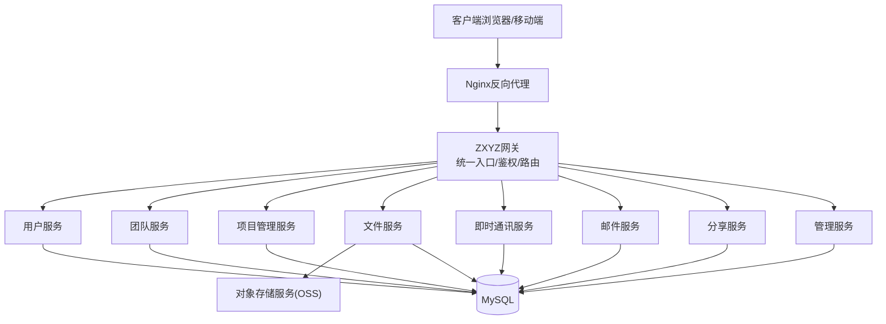
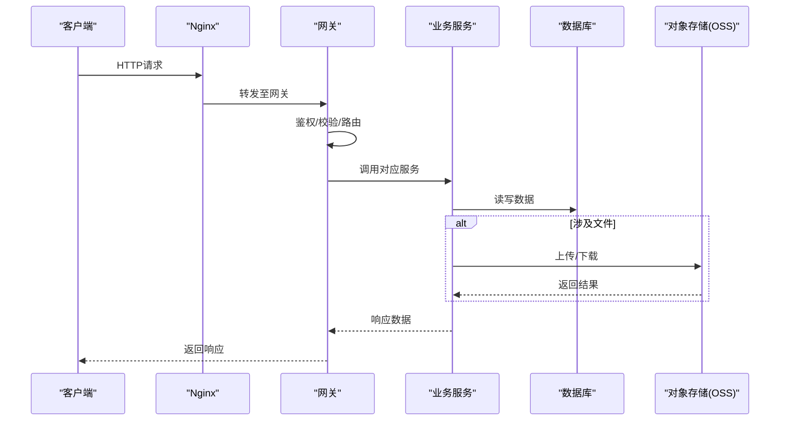
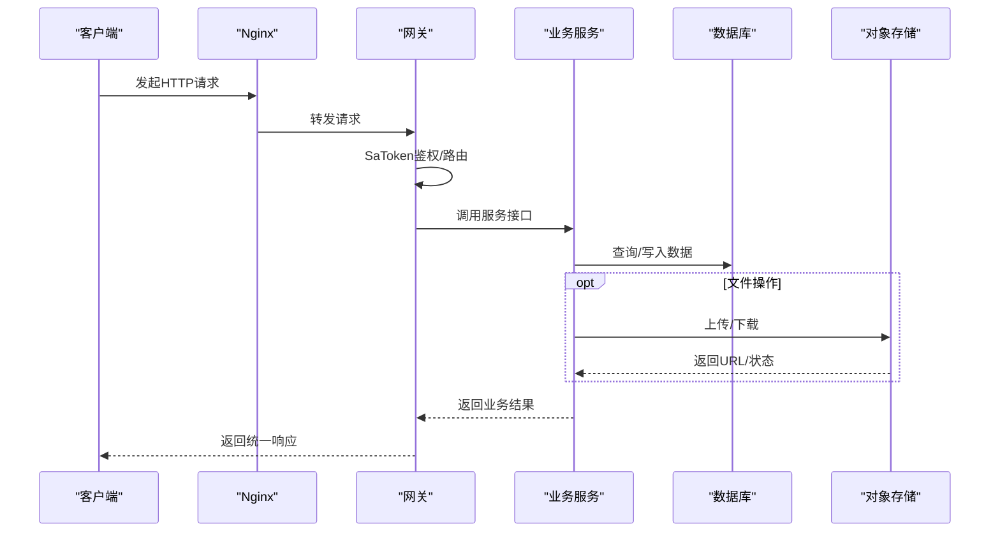
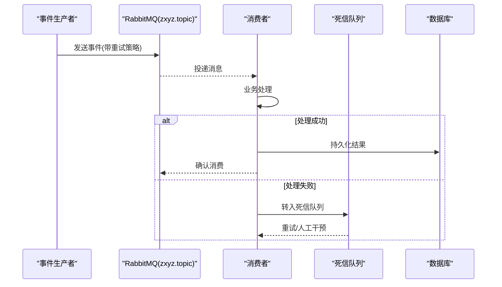
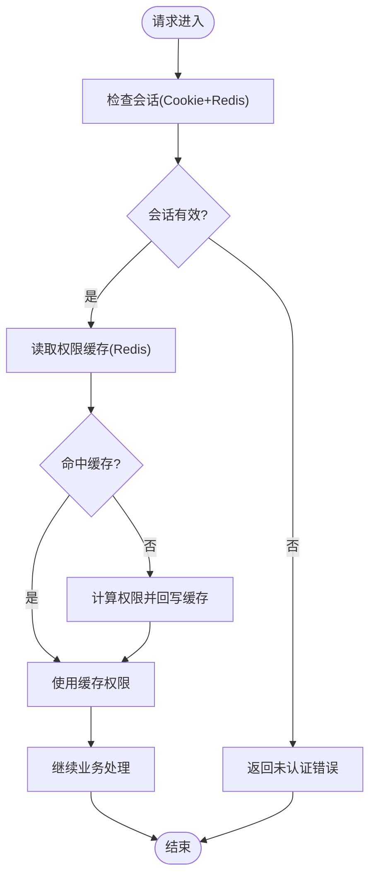
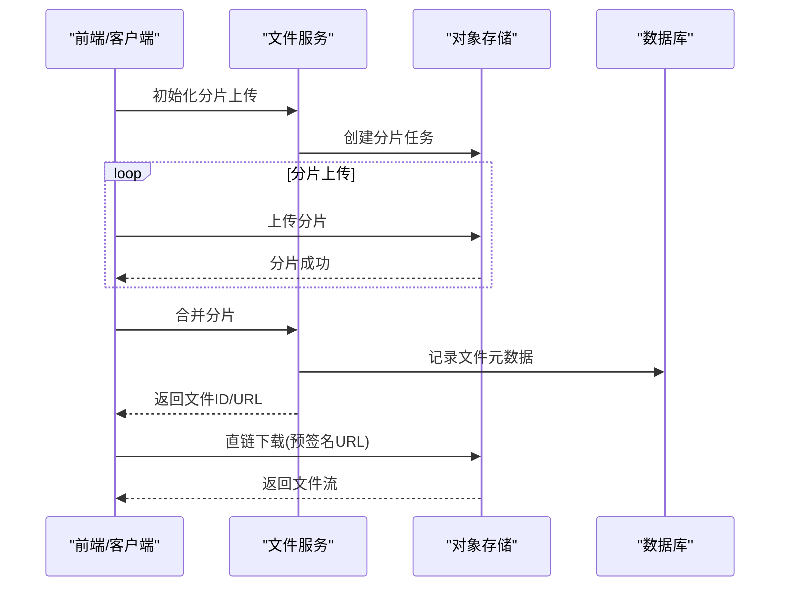
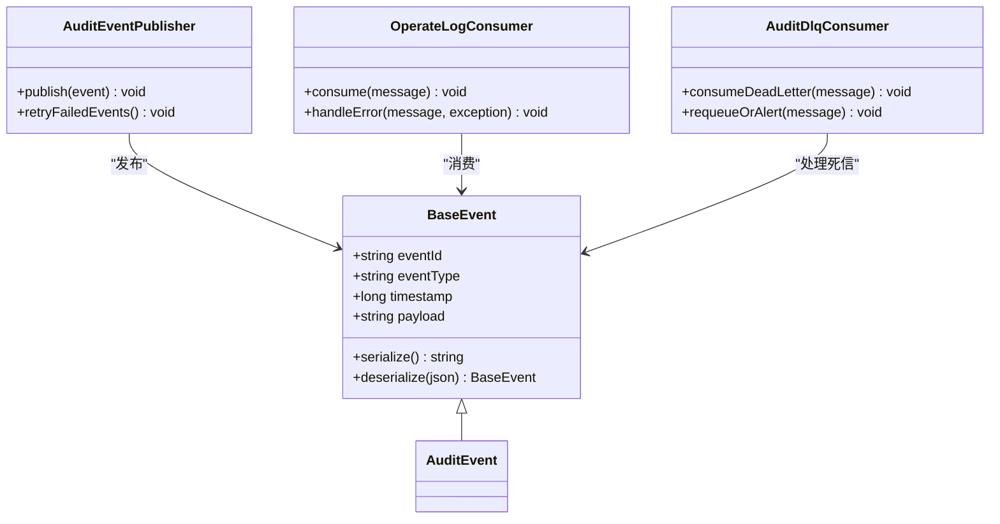
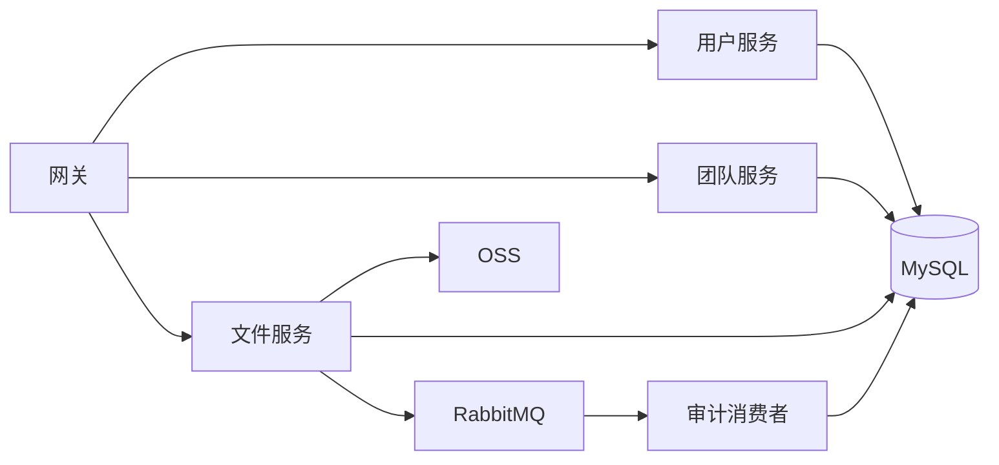

# 数据流设计

<cite>
**本文引用的文件**   
- [zxyz-gateway: ZxyzGatewayApplication.java](file://ZXYZdatabaseBack/zxyz-gateway/src/main/java/uno/acloud/gateway/ZxyzGatewayApplication.java)
- [zxyz-gateway: SaTokenFilterConfig.java](file://ZXYZdatabaseBack/zxyz-gateway/src/main/java/uno/acloud/gateway/filter/SaTokenFilterConfig.java)
- [zxyz-common: AbstractServiceClient.java](file://ZXYZdatabaseBack/zxyz-common/src/main/java/uno/acloud/client/AbstractServiceClient.java)
- [zxyz-common: ServiceResponseParser.java](file://ZXYZdatabaseBack/zxyz-common/src/main/java/uno/acloud/client/ServiceResponseParser.java)
- [zxyz-audit-service: RabbitMqConfig.java](file://ZXYZdatabaseBack/zxyz-audit-service/src/main/java/uno/acloud/audit/config/RabbitMqConfig.java)
- [zxyz-audit-service: OperateLogConsumer.java](file://ZXYZdatabaseBack/zxyz-audit-service/src/main/java/uno/acloud/audit/mq/OperateLogConsumer.java)
- [zxyz-audit-service: AuditDlqConsumer.java](file://ZXYZdatabaseBack/zxyz-audit-service/src/main/java/uno/acloud/audit/mq/AuditDlqConsumer.java)
- [zxyz-file-service: ZxyzFileApplication.java](file://ZXYZdatabaseBack/zxyz-file-service/src/main/java/uno/acloud/file/ZxyzFileApplication.java)
- [zxyz-file-service: FileStorageClient.java](file://ZXYZdatabaseBack/zxyz-common/src/main/java/uno/acloud/client/FileStorageClient.java)
- [zxyz-common: oss/OssProperties.java](file://ZXYZdatabaseBack/zxyz-common/src/main/java/uno/acloud/common/oss/OssProperties.java)
- [zxyz-common: oss/OssTemplate.java](file://ZXYZdatabaseBack/zxyz-common/src/main/java/uno/acloud/common/oss/OssTemplate.java)
- [zxyz-common: event/BaseEvent.java](file://ZXYZdatabaseBack/zxyz-common/src/main/java/uno/acloud/common/event/BaseEvent.java)
- [zxyz-common: audit/AuditEventPublisher.java](file://ZXYZdatabaseBack/zxyz-common/src/main/java/uno/acloud/common/audit/AuditEventPublisher.java)
- [zxyz-common: permission/PermissionCache.java](file://ZXYZdatabaseBack/zxyz-common/src/main/java/uno/acloud/common/permission/PermissionCache.java)
- [zxyz-common: config/HotConfigCache.java](file://ZXYZdatabaseBack/zxyz-common/src/main/java/uno/acloud/common/config/HotConfigCache.java)
- [zxyz-common: sa-token/SaTokenUtil.java](file://ZXYZdatabaseBack/zxyz-common/src/main/java/uno/acloud/satoken/SaTokenUtil.java)
- [nacos-config: zxyz-gateway.yml](file://nacos-config/zxyz-gateway.yml)
- [nacos-config: zxyz-dynamic.yml](file://nacos-config/zxyz-dynamic.yml)
- [nacos-config: zxyz-static.yml](file://nacos-config/zxyz-static.yml)
- [deploy/nginx/default.conf](file://deploy/nginx/default.conf)
</cite>

## 目录
1. [引言](#引言)
2. [项目结构](#项目结构)
3. [核心组件](#核心组件)
4. [架构总览](#架构总览)
5. [详细组件分析](#详细组件分析)
6. [依赖关系分析](#依赖关系分析)
7. [性能考量](#性能考量)
8. [故障排查指南](#故障排查指南)
9. [结论](#结论)
10. [附录](#附录)

## 引言
本文件面向ZXYZ项目的数据流设计，覆盖请求处理链路、异步消息机制、缓存策略、文件存储数据流与事件驱动架构。目标是帮助读者快速理解从客户端到网关、业务服务、数据库、对象存储以及消息队列的完整数据流转路径，并掌握关键组件的职责与交互方式。

## 项目结构
ZXYZ采用微服务架构，后端包含多个独立服务模块（如网关、审计、文件、IM、邮件、用户、团队、项目、分享等），前端为Vue应用。配置中心使用Nacos，部署通过Docker Compose编排。

**图表来源** 
- [zxyz-gateway: ZxyzGatewayApplication.java](file://ZXYZdatabaseBack/zxyz-gateway/src/main/java/uno/acloud/gateway/ZxyzGatewayApplication.java)
- [deploy/nginx/default.conf](file://deploy/nginx/default.conf)
- [nacos-config: zxyz-gateway.yml](file://nacos-config/zxyz-gateway.yml)

**章节来源**
- [zxyz-gateway: ZxyzGatewayApplication.java](file://ZXYZdatabaseBack/zxyz-gateway/src/main/java/uno/acloud/gateway/ZxyzGatewayApplication.java)
- [deploy/nginx/default.conf](file://deploy/nginx/default.conf)
- [nacos-config: zxyz-gateway.yml](file://nacos-config/zxyz-gateway.yml)

## 核心组件
- 网关层：统一入口、鉴权过滤、路由转发、限流与监控。
- 业务服务层：按领域拆分的服务，负责具体业务逻辑与数据访问。
- 数据访问层：MyBatis Mapper + MySQL，部分服务采用DDD分层。
- 消息中间件：RabbitMQ Topic Exchange用于异步解耦与削峰。
- 缓存层：Redis用于会话、权限、热点配置等缓存。
- 对象存储：OSS用于文件分片上传与直连下载。
- 事件驱动：BaseEvent基类 + 发布订阅模式，支持重试与死信队列。

**章节来源**
- [zxyz-common: AbstractServiceClient.java](file://ZXYZdatabaseBack/zxyz-common/src/main/java/uno/acloud/client/AbstractServiceClient.java)
- [zxyz-common: ServiceResponseParser.java](file://ZXYZdatabaseBack/zxyz-common/src/main/java/uno/acloud/client/ServiceResponseParser.java)
- [zxyz-common: event/BaseEvent.java](file://ZXYZdatabaseBack/zxyz-common/src/main/java/uno/acloud/common/event/BaseEvent.java)
- [zxyz-common: permission/PermissionCache.java](file://ZXYZdatabaseBack/zxyz-common/src/main/java/uno/acloud/common/permission/PermissionCache.java)
- [zxyz-common: config/HotConfigCache.java](file://ZXYZdatabaseBack/zxyz-common/src/main/java/uno/acloud/common/config/HotConfigCache.java)
- [zxyz-common: sa-token/SaTokenUtil.java](file://ZXYZdatabaseBack/zxyz-common/src/main/java/uno/acloud/satoken/SaTokenUtil.java)
- [zxyz-common: oss/OssProperties.java](file://ZXYZdatabaseBack/zxyz-common/src/main/java/uno/acloud/common/oss/OssProperties.java)
- [zxyz-common: oss/OssTemplate.java](file://ZXYZdatabaseBack/zxyz-common/src/main/java/uno/acloud/common/oss/OssTemplate.java)

## 架构总览
下图展示请求从客户端经Nginx与网关进入各业务服务，再访问数据库或对象存储的整体数据流。

**图表来源** 
- [zxyz-gateway: ZxyzGatewayApplication.java](file://ZXYZdatabaseBack/zxyz-gateway/src/main/java/uno/acloud/gateway/ZxyzGatewayApplication.java)
- [deploy/nginx/default.conf](file://deploy/nginx/default.conf)
- [zxyz-common: oss/OssTemplate.java](file://ZXYZdatabaseBack/zxyz-common/src/main/java/uno/acloud/common/oss/OssTemplate.java)

## 详细组件分析

### 请求处理流程（客户端 → 网关 → 业务服务 → 数据库 → 响应）
- 客户端请求经Nginx转发至网关；网关进行Sa-Token鉴权与路由分发。
- 业务服务接收请求后执行领域逻辑，必要时通过内部客户端调用其他服务。
- 数据访问通过Mapper操作数据库；文件相关操作通过OSS模板完成。
- 响应沿原路返回，统一封装Result结构。

**图表来源** 
- [zxyz-gateway: SaTokenFilterConfig.java](file://ZXYZdatabaseBack/zxyz-gateway/src/main/java/uno/acloud/gateway/filter/SaTokenFilterConfig.java)
- [zxyz-common: AbstractServiceClient.java](file://ZXYZdatabaseBack/zxyz-common/src/main/java/uno/acloud/client/AbstractServiceClient.java)
- [zxyz-common: ServiceResponseParser.java](file://ZXYZdatabaseBack/zxyz-common/src/main/java/uno/acloud/client/ServiceResponseParser.java)
- [zxyz-common: oss/OssTemplate.java](file://ZXYZdatabaseBack/zxyz-common/src/main/java/uno/acloud/common/oss/OssTemplate.java)

**章节来源**
- [zxyz-gateway: SaTokenFilterConfig.java](file://ZXYZdatabaseBack/zxyz-gateway/src/main/java/uno/acloud/gateway/filter/SaTokenFilterConfig.java)
- [zxyz-common: AbstractServiceClient.java](file://ZXYZdatabaseBack/zxyz-common/src/main/java/uno/acloud/client/AbstractServiceClient.java)
- [zxyz-common: ServiceResponseParser.java](file://ZXYZdatabaseBack/zxyz-common/src/main/java/uno/acloud/client/ServiceResponseParser.java)

### 异步消息处理机制（事件生产者 → RabbitMQ → 消费者 → 结果存储）
- 事件生产者将业务事件发布至RabbitMQ Topic Exchange（zxyz.topic）。
- 消费者监听相应队列，执行业务处理并持久化结果。
- 失败消息进入死信队列，由专门消费者处理重试或告警。

**图表来源** 
- [zxyz-audit-service: RabbitMqConfig.java](file://ZXYZdatabaseBack/zxyz-audit-service/src/main/java/uno/acloud/audit/config/RabbitMqConfig.java)
- [zxyz-audit-service: OperateLogConsumer.java](file://ZXYZdatabaseBack/zxyz-audit-service/src/main/java/uno/acloud/audit/mq/OperateLogConsumer.java)
- [zxyz-audit-service: AuditDlqConsumer.java](file://ZXYZdatabaseBack/zxyz-audit-service/src/main/java/uno/acloud/audit/mq/AuditDlqConsumer.java)

**章节来源**
- [zxyz-audit-service: RabbitMqConfig.java](file://ZXYZdatabaseBack/zxyz-audit-service/src/main/java/uno/acloud/audit/config/RabbitMqConfig.java)
- [zxyz-audit-service: OperateLogConsumer.java](file://ZXYZdatabaseBack/zxyz-audit-service/src/main/java/uno/acloud/audit/mq/OperateLogConsumer.java)
- [zxyz-audit-service: AuditDlqConsumer.java](file://ZXYZdatabaseBack/zxyz-audit-service/src/main/java/uno/acloud/audit/mq/AuditDlqConsumer.java)

### 缓存策略设计（Redis热点数据、会话、权限缓存）
- 会话存储：基于Sa-Token与Redis的HttpOnly Cookie会话管理。
- 权限缓存：用户/团队权限信息缓存于Redis，减少重复计算。
- 热点配置：系统热键配置缓存，支持动态刷新与失效策略。

**图表来源** 
- [zxyz-common: sa-token/SaTokenUtil.java](file://ZXYZdatabaseBack/zxyz-common/src/main/java/uno/acloud/satoken/SaTokenUtil.java)
- [zxyz-common: permission/PermissionCache.java](file://ZXYZdatabaseBack/zxyz-common/src/main/java/uno/acloud/common/permission/PermissionCache.java)
- [zxyz-common: config/HotConfigCache.java](file://ZXYZdatabaseBack/zxyz-common/src/main/java/uno/acloud/common/config/HotConfigCache.java)

**章节来源**
- [zxyz-common: sa-token/SaTokenUtil.java](file://ZXYZdatabaseBack/zxyz-common/src/main/java/uno/acloud/satoken/SaTokenUtil.java)
- [zxyz-common: permission/PermissionCache.java](file://ZXYZdatabaseBack/zxyz-common/src/main/java/uno/acloud/common/permission/PermissionCache.java)
- [zxyz-common: config/HotConfigCache.java](file://ZXYZdatabaseBack/zxyz-common/src/main/java/uno/acloud/common/config/HotConfigCache.java)

### 文件存储数据流（OSS集成、分片上传、下载直连）
- 上传：前端或服务端分片上传至OSS，服务端记录元数据至数据库。
- 下载：生成临时直链或预签名URL，客户端直接下载，减轻服务压力。
- 配置：通过OssProperties与OssTemplate统一管理。

**图表来源** 
- [zxyz-file-service: ZxyzFileApplication.java](file://ZXYZdatabaseBack/zxyz-file-service/src/main/java/uno/acloud/file/ZxyzFileApplication.java)
- [zxyz-common: oss/OssProperties.java](file://ZXYZdatabaseBack/zxyz-common/src/main/java/uno/acloud/common/oss/OssProperties.java)
- [zxyz-common: oss/OssTemplate.java](file://ZXYZdatabaseBack/zxyz-common/src/main/java/uno/acloud/common/oss/OssTemplate.java)

**章节来源**
- [zxyz-file-service: ZxyzFileApplication.java](file://ZXYZdatabaseBack/zxyz-file-service/src/main/java/uno/acloud/file/ZxyzFileApplication.java)
- [zxyz-common: oss/OssProperties.java](file://ZXYZdatabaseBack/zxyz-common/src/main/java/uno/acloud/common/oss/OssProperties.java)
- [zxyz-common: oss/OssTemplate.java](file://ZXYZdatabaseBack/zxyz-common/src/main/java/uno/acloud/common/oss/OssTemplate.java)

### 事件驱动架构（BaseEvent、发布订阅、重试与死信）
- BaseEvent作为所有事件的基类，提供通用字段与序列化能力。
- 事件发布者通过AuditEventPublisher等组件发布事件至消息队列。
- 消费者处理事件，失败时进入死信队列进行重试或告警。

**图表来源** 
- [zxyz-common: event/BaseEvent.java](file://ZXYZdatabaseBack/zxyz-common/src/main/java/uno/acloud/common/event/BaseEvent.java)
- [zxyz-common: audit/AuditEventPublisher.java](file://ZXYZdatabaseBack/zxyz-common/src/main/java/uno/acloud/common/audit/AuditEventPublisher.java)
- [zxyz-audit-service: OperateLogConsumer.java](file://ZXYZdatabaseBack/zxyz-audit-service/src/main/java/uno/acloud/audit/mq/OperateLogConsumer.java)
- [zxyz-audit-service: AuditDlqConsumer.java](file://ZXYZdatabaseBack/zxyz-audit-service/src/main/java/uno/acloud/audit/mq/AuditDlqConsumer.java)

**章节来源**
- [zxyz-common: event/BaseEvent.java](file://ZXYZdatabaseBack/zxyz-common/src/main/java/uno/acloud/common/event/BaseEvent.java)
- [zxyz-common: audit/AuditEventPublisher.java](file://ZXYZdatabaseBack/zxyz-common/src/main/java/uno/acloud/common/audit/AuditEventPublisher.java)
- [zxyz-audit-service: OperateLogConsumer.java](file://ZXYZdatabaseBack/zxyz-audit-service/src/main/java/uno/acloud/audit/mq/OperateLogConsumer.java)
- [zxyz-audit-service: AuditDlqConsumer.java](file://ZXYZdatabaseBack/zxyz-audit-service/src/main/java/uno/acloud/audit/mq/AuditDlqConsumer.java)

## 依赖关系分析
- 网关依赖Nginx与Sa-Token过滤器，路由至各业务服务。
- 业务服务间通过AbstractServiceClient进行内部调用，使用X-Internal-Service-Token鉴权。
- 消息组件依赖RabbitMQ配置与消费者实现。
- 文件服务依赖OSS模板与数据库访问。
- 缓存组件依赖Redis与配置中心动态更新。

**图表来源** 
- [zxyz-common: AbstractServiceClient.java](file://ZXYZdatabaseBack/zxyz-common/src/main/java/uno/acloud/client/AbstractServiceClient.java)
- [zxyz-audit-service: RabbitMqConfig.java](file://ZXYZdatabaseBack/zxyz-audit-service/src/main/java/uno/acloud/audit/config/RabbitMqConfig.java)
- [zxyz-common: oss/OssTemplate.java](file://ZXYZdatabaseBack/zxyz-common/src/main/java/uno/acloud/common/oss/OssTemplate.java)

**章节来源**
- [zxyz-common: AbstractServiceClient.java](file://ZXYZdatabaseBack/zxyz-common/src/main/java/uno/acloud/client/AbstractServiceClient.java)
- [zxyz-audit-service: RabbitMqConfig.java](file://ZXYZdatabaseBack/zxyz-audit-service/src/main/java/uno/acloud/audit/config/RabbitMqConfig.java)
- [zxyz-common: oss/OssTemplate.java](file://ZXYZdatabaseBack/zxyz-common/src/main/java/uno/acloud/common/oss/OssTemplate.java)

## 性能考量
- 网关层启用连接池与超时控制，避免雪崩。
- 数据库查询使用索引与分页，减少全表扫描。
- 缓存命中率优化，合理设置TTL与失效策略。
- 文件上传采用分片与并发提升吞吐。
- 消息队列削峰填谷，消费者批量处理提高吞吐。

## 故障排查指南
- 网关鉴权失败：检查Sa-Token配置与Cookie有效性。
- 服务间调用异常：验证内部服务令牌与路由配置。
- 消息消费失败：查看死信队列与消费者日志。
- 文件上传失败：检查OSS配置与网络连通性。
- 缓存不一致：清理Redis缓存并验证配置中心同步。

**章节来源**
- [zxyz-gateway: SaTokenFilterConfig.java](file://ZXYZdatabaseBack/zxyz-gateway/src/main/java/uno/acloud/gateway/filter/SaTokenFilterConfig.java)
- [zxyz-audit-service: AuditDlqConsumer.java](file://ZXYZdatabaseBack/zxyz-audit-service/src/main/java/uno/acloud/audit/mq/AuditDlqConsumer.java)
- [zxyz-common: oss/OssProperties.java](file://ZXYZdatabaseBack/zxyz-common/src/main/java/uno/acloud/common/oss/OssProperties.java)

## 结论
ZXYZ项目通过清晰的微服务架构与数据流设计，实现了高内聚、低耦合的系统结构。网关统一入口、异步消息解耦、缓存加速、对象存储直连与事件驱动共同保障了系统的可扩展性与稳定性。建议持续优化缓存策略与消息重试机制，以提升整体性能与可靠性。

## 附录
- 配置中心：Nacos管理动态配置，支持热更新。
- 部署编排：Docker Compose统一编排基础设施与服务。
- CI/CD：GitHub Actions自动化构建与镜像推送。

**章节来源**
- [nacos-config: zxyz-dynamic.yml](file://nacos-config/zxyz-dynamic.yml)
- [nacos-config: zxyz-static.yml](file://nacos-config/zxyz-static.yml)
- [nacos-config: zxyz-gateway.yml](file://nacos-config/zxyz-gateway.yml)