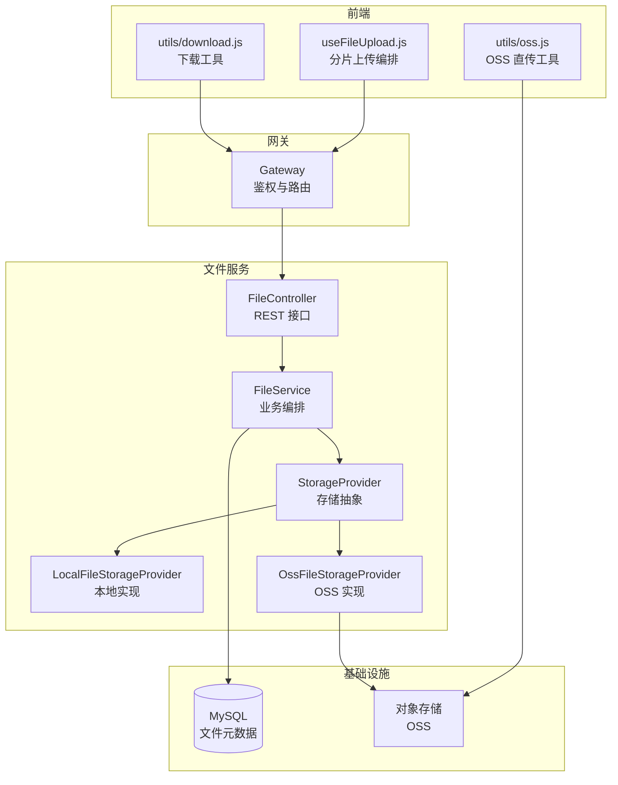
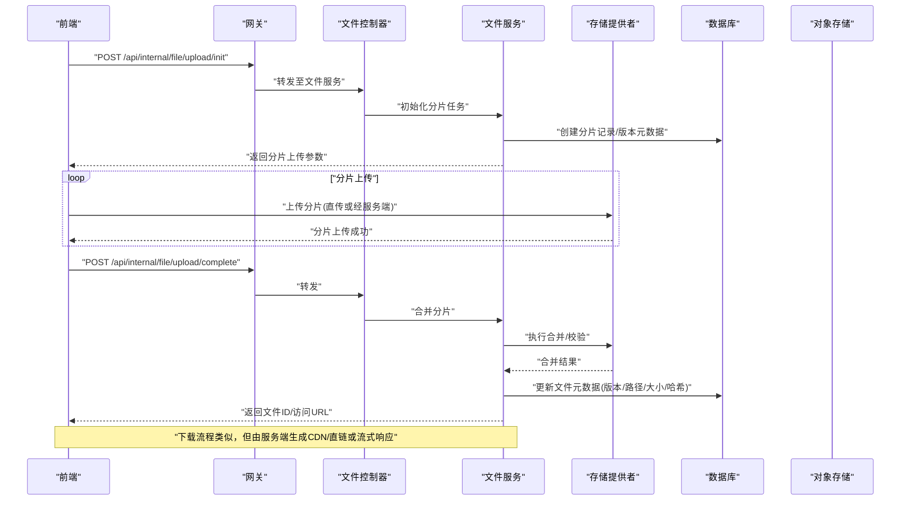
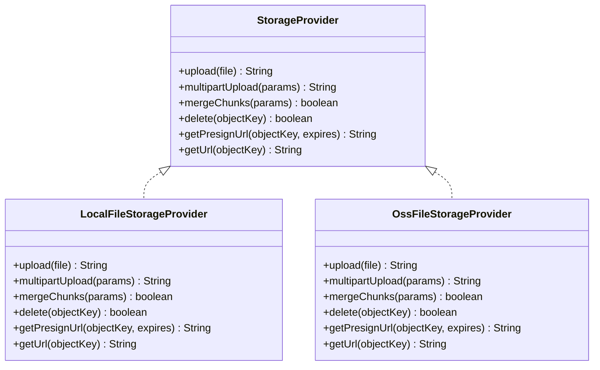
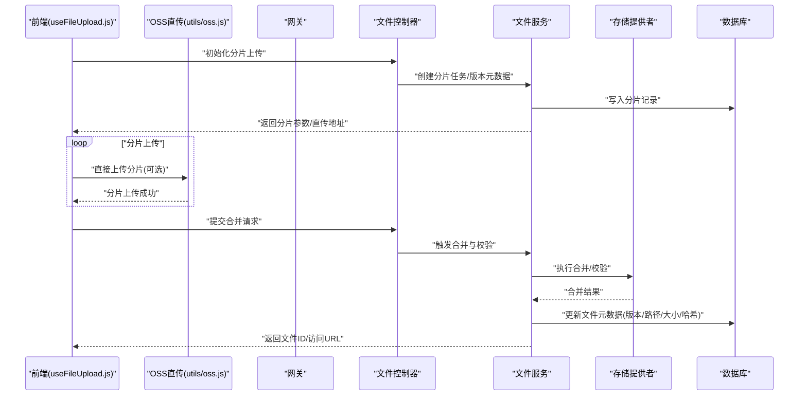
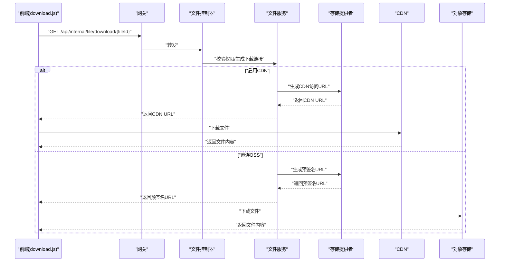
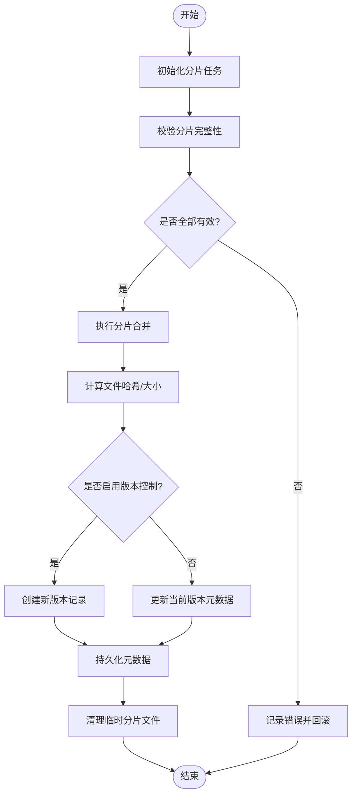
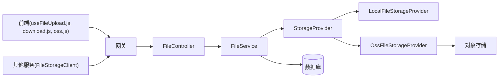

# 文件存储数据流

<cite>
**本文引用的文件**   
- [zxyz-file-service/src/main/java/uno/acloud/file/storage/StorageProvider.java](file://ZXYZdatabaseBack/zxyz-file-service/src/main/java/uno/acloud/file/storage/StorageProvider.java)
- [zxyz-file-service/src/main/java/uno/acloud/file/storage/impl/LocalFileStorageProvider.java](file://ZXYZdatabaseBack/zxyz-file-service/src/main/java/uno/acloud/file/storage/impl/LocalFileStorageProvider.java)
- [zxyz-file-service/src/main/java/uno/acloud/file/storage/impl/OssFileStorageProvider.java](file://ZXYZdatabaseBack/zxyz-file-service/src/main/java/uno/acloud/file/storage/impl/OssFileStorageProvider.java)
- [zxyz-file-service/src/main/java/uno/acloud/file/service/FileService.java](file://ZXYZdatabaseBack/zxyz-file-service/src/main/java/uno/acloud/file/service/FileService.java)
- [zxyz-file-service/src/main/java/uno/acloud/file/controller/FileController.java](file://ZXYZdatabaseBack/zxyz-file-service/src/main/java/uno/acloud/file/controller/FileController.java)
- [zxyz-common/src/main/java/uno/acloud/client/FileStorageClient.java](file://ZXYZdatabaseBack/zxyz-common/src/main/java/uno/acloud/client/FileStorageClient.java)
- [ZXYZdatabaseFront/src/composables/useFileUpload.js](file://ZXYZdatabaseFront/src/composables/useFileUpload.js)
- [ZXYZdatabaseFront/src/services/upload.js](file://ZXYZdatabaseFront/src/services/upload.js)
- [ZXYZdatabaseFront/src/utils/download.js](file://ZXYZdatabaseFront/src/utils/download.js)
- [ZXYZdatabaseFront/src/utils/oss.js](file://ZXYZdatabaseFront/src/utils/oss.js)
- [ZXYZdatabaseBack/sql/schema_file.sql](file://ZXYZdatabaseBack/sql/schema_file.sql)
</cite>

## 目录
1. [简介](#简介)
2. [项目结构](#项目结构)
3. [核心组件](#核心组件)
4. [架构总览](#架构总览)
5. [详细组件分析](#详细组件分析)
6. [依赖关系分析](#依赖关系分析)
7. [性能考虑](#性能考虑)
8. [故障排查指南](#故障排查指南)
9. [结论](#结论)
10. [附录](#附录)

## 简介
本文件围绕 ZXYZ 项目的“文件存储数据流”展开，覆盖从前端分片上传到服务端合并、再到对象存储直传与元数据持久化的完整链路；同时阐述存储提供商抽象（StorageProvider）、本地与 OSS 实现差异、文件生命周期管理（临时文件清理、版本控制、回收站机制），以及下载优化策略（CDN 加速、断点续传、并发下载）。文末提供存储迁移指南与故障恢复策略，并附带架构图与时序图帮助理解。

## 项目结构
- 后端采用微服务架构，文件相关能力集中在 zxyz-file-service 模块，通过 zxyz-common 中的 FileStorageClient 被其他服务调用。
- 前端位于 ZXYZdatabaseFront，使用 Vue 3 Composition API，封装了分片上传、OSS 直传、下载等逻辑。
- 数据库脚本定义文件元数据表结构，用于持久化文件信息、版本与回收站状态。

图表来源
- [zxyz-file-service/src/main/java/uno/acloud/file/controller/FileController.java](file://ZXYZdatabaseBack/zxyz-file-service/src/main/java/uno/acloud/file/controller/FileController.java)
- [zxyz-file-service/src/main/java/uno/acloud/file/service/FileService.java](file://ZXYZdatabaseBack/zxyz-file-service/src/main/java/uno/acloud/file/service/FileService.java)
- [zxyz-file-service/src/main/java/uno/acloud/file/storage/StorageProvider.java](file://ZXYZdatabaseBack/zxyz-file-service/src/main/java/uno/acloud/file/storage/StorageProvider.java)
- [zxyz-file-service/src/main/java/uno/acloud/file/storage/impl/LocalFileStorageProvider.java](file://ZXYZdatabaseBack/zxyz-file-service/src/main/java/uno/acloud/file/storage/impl/LocalFileStorageProvider.java)
- [zxyz-file-service/src/main/java/uno/acloud/file/storage/impl/OssFileStorageProvider.java](file://ZXYZdatabaseBack/zxyz-file-service/src/main/java/uno/acloud/file/storage/impl/OssFileStorageProvider.java)
- [ZXYZdatabaseFront/src/composables/useFileUpload.js](file://ZXYZdatabaseFront/src/composables/useFileUpload.js)
- [ZXYZdatabaseFront/src/utils/oss.js](file://ZXYZdatabaseFront/src/utils/oss.js)
- [ZXYZdatabaseFront/src/utils/download.js](file://ZXYZdatabaseFront/src/utils/download.js)

章节来源
- [zxyz-file-service/src/main/java/uno/acloud/file/controller/FileController.java](file://ZXYZdatabaseBack/zxyz-file-service/src/main/java/uno/acloud/file/controller/FileController.java)
- [zxyz-file-service/src/main/java/uno/acloud/file/service/FileService.java](file://ZXYZdatabaseBack/zxyz-file-service/src/main/java/uno/acloud/file/service/FileService.java)
- [zxyz-file-service/src/main/java/uno/acloud/file/storage/StorageProvider.java](file://ZXYZdatabaseBack/zxyz-file-service/src/main/java/uno/acloud/file/storage/StorageProvider.java)
- [zxyz-file-service/src/main/java/uno/acloud/file/storage/impl/LocalFileStorageProvider.java](file://ZXYZdatabaseBack/zxyz-file-service/src/main/java/uno/acloud/file/storage/impl/LocalFileStorageProvider.java)
- [zxyz-file-service/src/main/java/uno/acloud/file/storage/impl/OssFileStorageProvider.java](file://ZXYZdatabaseBack/zxyz-file-service/src/main/java/uno/acloud/file/storage/impl/OssFileStorageProvider.java)
- [ZXYZdatabaseFront/src/composables/useFileUpload.js](file://ZXYZdatabaseFront/src/composables/useFileUpload.js)
- [ZXYZdatabaseFront/src/utils/oss.js](file://ZXYZdatabaseFront/src/utils/oss.js)
- [ZXYZdatabaseFront/src/utils/download.js](file://ZXYZdatabaseFront/src/utils/download.js)

## 核心组件
- StorageProvider 接口：定义统一的上传、分片上传、合并、删除、获取签名/直传参数、生成访问 URL 等方法，屏蔽不同存储后端的差异。
- LocalFileStorageProvider：基于本地磁盘的存储实现，适用于开发测试或内网环境，具备本地路径映射与临时文件管理能力。
- OssFileStorageProvider：对接云对象存储（如阿里云 OSS），支持分片直传、服务端合并、签名直传、CDN 加速域名访问等。
- FileService：文件业务编排层，负责分片校验、合并策略、版本控制、回收站标记、元数据持久化以及与存储提供者的交互。
- FileController：对外暴露 REST 接口，接收前端上传/下载请求，协调 FileService 完成业务流程。
- FileStorageClient：其他服务通过该客户端调用文件服务的内部端点，遵循窄端点与投影模式。

章节来源
- [zxyz-file-service/src/main/java/uno/acloud/file/storage/StorageProvider.java](file://ZXYZdatabaseBack/zxyz-file-service/src/main/java/uno/acloud/file/storage/StorageProvider.java)
- [zxyz-file-service/src/main/java/uno/acloud/file/storage/impl/LocalFileStorageProvider.java](file://ZXYZdatabaseBack/zxyz-file-service/src/main/java/uno/acloud/file/storage/impl/LocalFileStorageProvider.java)
- [zxyz-file-service/src/main/java/uno/acloud/file/storage/impl/OssFileStorageProvider.java](file://ZXYZdatabaseBack/zxyz-file-service/src/main/java/uno/acloud/file/storage/impl/OssFileStorageProvider.java)
- [zxyz-file-service/src/main/java/uno/acloud/file/service/FileService.java](file://ZXYZdatabaseBack/zxyz-file-service/src/main/java/uno/acloud/file/service/FileService.java)
- [zxyz-file-service/src/main/java/uno/acloud/file/controller/FileController.java](file://ZXYZdatabaseBack/zxyz-file-service/src/main/java/uno/acloud/file/controller/FileController.java)
- [zxyz-common/src/main/java/uno/acloud/client/FileStorageClient.java](file://ZXYZdatabaseBack/zxyz-common/src/main/java/uno/acloud/client/FileStorageClient.java)

## 架构总览
整体数据流分为两条主线：
- 上传链路：前端分片上传 → 服务端分片校验与合并 → 选择存储提供者（本地或 OSS）→ 写入对象存储 → 更新元数据（含版本、路径、大小、哈希等）。
- 下载链路：前端发起下载请求 → 服务端鉴权与权限校验 → 根据配置选择 CDN/直链 → 返回流式响应或预签名 URL。

图表来源
- [zxyz-file-service/src/main/java/uno/acloud/file/controller/FileController.java](file://ZXYZdatabaseBack/zxyz-file-service/src/main/java/uno/acloud/file/controller/FileController.java)
- [zxyz-file-service/src/main/java/uno/acloud/file/service/FileService.java](file://ZXYZdatabaseBack/zxyz-file-service/src/main/java/uno/acloud/file/service/FileService.java)
- [zxyz-file-service/src/main/java/uno/acloud/file/storage/StorageProvider.java](file://ZXYZdatabaseBack/zxyz-file-service/src/main/java/uno/acloud/file/storage/StorageProvider.java)
- [ZXYZdatabaseFront/src/composables/useFileUpload.js](file://ZXYZdatabaseFront/src/composables/useFileUpload.js)

## 详细组件分析

### 存储提供商抽象与实现
- StorageProvider 接口定义了上传、分片上传、合并、删除、获取直传参数、生成访问 URL 的统一方法，确保上层业务无需关心具体存储实现。
- LocalFileStorageProvider 将文件落盘到本地目录，适合开发与测试，具备临时文件清理与路径映射能力。
- OssFileStorageProvider 对接云对象存储，支持分片直传、服务端合并、签名直传、CDN 加速域名访问，提升上传与下载性能。

图表来源
- [zxyz-file-service/src/main/java/uno/acloud/file/storage/StorageProvider.java](file://ZXYZdatabaseBack/zxyz-file-service/src/main/java/uno/acloud/file/storage/StorageProvider.java)
- [zxyz-file-service/src/main/java/uno/acloud/file/storage/impl/LocalFileStorageProvider.java](file://ZXYZdatabaseBack/zxyz-file-service/src/main/java/uno/acloud/file/storage/impl/LocalFileStorageProvider.java)
- [zxyz-file-service/src/main/java/uno/acloud/file/storage/impl/OssFileStorageProvider.java](file://ZXYZdatabaseBack/zxyz-file-service/src/main/java/uno/acloud/file/storage/impl/OssFileStorageProvider.java)

章节来源
- [zxyz-file-service/src/main/java/uno/acloud/file/storage/StorageProvider.java](file://ZXYZdatabaseBack/zxyz-file-service/src/main/java/uno/acloud/file/storage/StorageProvider.java)
- [zxyz-file-service/src/main/java/uno/acloud/file/storage/impl/LocalFileStorageProvider.java](file://ZXYZdatabaseBack/zxyz-file-service/src/main/java/uno/acloud/file/storage/impl/LocalFileStorageProvider.java)
- [zxyz-file-service/src/main/java/uno/acloud/file/storage/impl/OssFileStorageProvider.java](file://ZXYZdatabaseBack/zxyz-file-service/src/main/java/uno/acloud/file/storage/impl/OssFileStorageProvider.java)

### 上传流程时序
- 前端通过 useFileUpload.js 组织分片上传逻辑，必要时借助 utils/oss.js 进行 OSS 直传。
- 服务端 FileController 接收初始化与完成请求，FileService 负责分片校验、合并、版本控制与元数据持久化。
- 存储提供者根据配置选择本地或 OSS 实现。

图表来源
- [ZXYZdatabaseFront/src/composables/useFileUpload.js](file://ZXYZdatabaseFront/src/composables/useFileUpload.js)
- [ZXYZdatabaseFront/src/utils/oss.js](file://ZXYZdatabaseFront/src/utils/oss.js)
- [zxyz-file-service/src/main/java/uno/acloud/file/controller/FileController.java](file://ZXYZdatabaseBack/zxyz-file-service/src/main/java/uno/acloud/file/controller/FileController.java)
- [zxyz-file-service/src/main/java/uno/acloud/file/service/FileService.java](file://ZXYZdatabaseBack/zxyz-file-service/src/main/java/uno/acloud/file/service/FileService.java)
- [zxyz-file-service/src/main/java/uno/acloud/file/storage/StorageProvider.java](file://ZXYZdatabaseBack/zxyz-file-service/src/main/java/uno/acloud/file/storage/StorageProvider.java)

章节来源
- [ZXYZdatabaseFront/src/composables/useFileUpload.js](file://ZXYZdatabaseFront/src/composables/useFileUpload.js)
- [ZXYZdatabaseFront/src/utils/oss.js](file://ZXYZdatabaseFront/src/utils/oss.js)
- [zxyz-file-service/src/main/java/uno/acloud/file/controller/FileController.java](file://ZXYZdatabaseBack/zxyz-file-service/src/main/java/uno/acloud/file/controller/FileController.java)
- [zxyz-file-service/src/main/java/uno/acloud/file/service/FileService.java](file://ZXYZdatabaseBack/zxyz-file-service/src/main/java/uno/acloud/file/service/FileService.java)

### 下载流程时序
- 前端通过 utils/download.js 发起下载请求，服务端鉴权后返回 CDN 预签名 URL 或直接流式响应。
- 若启用 CDN，则优先走 CDN 节点缓存，降低源站压力。

图表来源
- [ZXYZdatabaseFront/src/utils/download.js](file://ZXYZdatabaseFront/src/utils/download.js)
- [zxyz-file-service/src/main/java/uno/acloud/file/controller/FileController.java](file://ZXYZdatabaseBack/zxyz-file-service/src/main/java/uno/acloud/file/controller/FileController.java)
- [zxyz-file-service/src/main/java/uno/acloud/file/service/FileService.java](file://ZXYZdatabaseBack/zxyz-file-service/src/main/java/uno/acloud/file/service/FileService.java)
- [zxyz-file-service/src/main/java/uno/acloud/file/storage/StorageProvider.java](file://ZXYZdatabaseBack/zxyz-file-service/src/main/java/uno/acloud/file/storage/StorageProvider.java)

章节来源
- [ZXYZdatabaseFront/src/utils/download.js](file://ZXYZdatabaseFront/src/utils/download.js)
- [zxyz-file-service/src/main/java/uno/acloud/file/controller/FileController.java](file://ZXYZdatabaseBack/zxyz-file-service/src/main/java/uno/acloud/file/controller/FileController.java)
- [zxyz-file-service/src/main/java/uno/acloud/file/service/FileService.java](file://ZXYZdatabaseBack/zxyz-file-service/src/main/java/uno/acloud/file/service/FileService.java)

### 复杂逻辑流程图（分片合并与版本控制）

图表来源
- [zxyz-file-service/src/main/java/uno/acloud/file/service/FileService.java](file://ZXYZdatabaseBack/zxyz-file-service/src/main/java/uno/acloud/file/service/FileService.java)
- [zxyz-file-service/src/main/java/uno/acloud/file/storage/StorageProvider.java](file://ZXYZdatabaseBack/zxyz-file-service/src/main/java/uno/acloud/file/storage/StorageProvider.java)

章节来源
- [zxyz-file-service/src/main/java/uno/acloud/file/service/FileService.java](file://ZXYZdatabaseBack/zxyz-file-service/src/main/java/uno/acloud/file/service/FileService.java)

### 文件生命周期管理
- 临时文件清理：分片合并完成后，自动清理本地临时分片文件，避免磁盘占用。
- 版本控制：每次覆盖更新时创建新版本记录，保留历史版本以便回滚。
- 回收站机制：删除操作不立即物理删除，而是标记为回收站状态，支持定时清理与恢复。

章节来源
- [zxyz-file-service/src/main/java/uno/acloud/file/service/FileService.java](file://ZXYZdatabaseBack/zxyz-file-service/src/main/java/uno/acloud/file/service/FileService.java)
- [ZXYZdatabaseBack/sql/schema_file.sql](file://ZXYZdatabaseBack/sql/schema_file.sql)

### 下载优化策略
- CDN 加速：优先通过 CDN 节点分发静态资源，减少源站压力，提高全球访问速度。
- 断点续传：前端在失败时记录已下载字节范围，服务端支持 Range 请求以继续传输。
- 并发下载：对大文件或归档包采用多段并发下载，合并后再落盘，提升吞吐。

章节来源
- [ZXYZdatabaseFront/src/utils/download.js](file://ZXYZdatabaseFront/src/utils/download.js)
- [zxyz-file-service/src/main/java/uno/acloud/file/storage/StorageProvider.java](file://ZXYZdatabaseBack/zxyz-file-service/src/main/java/uno/acloud/file/storage/StorageProvider.java)

## 依赖关系分析
- 前端依赖 useFileUpload.js 与 utils/oss.js 实现上传与直传，依赖 utils/download.js 实现下载。
- 后端 FileController 依赖 FileService，FileService 依赖 StorageProvider 接口及其实现（本地/OSS）。
- 其他服务通过 zxyz-common 的 FileStorageClient 调用文件服务内部端点，遵循窄端点与投影模式。

图表来源
- [ZXYZdatabaseFront/src/composables/useFileUpload.js](file://ZXYZdatabaseFront/src/composables/useFileUpload.js)
- [ZXYZdatabaseFront/src/utils/download.js](file://ZXYZdatabaseFront/src/utils/download.js)
- [ZXYZdatabaseFront/src/utils/oss.js](file://ZXYZdatabaseFront/src/utils/oss.js)
- [zxyz-file-service/src/main/java/uno/acloud/file/controller/FileController.java](file://ZXYZdatabaseBack/zxyz-file-service/src/main/java/uno/acloud/file/controller/FileController.java)
- [zxyz-file-service/src/main/java/uno/acloud/file/service/FileService.java](file://ZXYZdatabaseBack/zxyz-file-service/src/main/java/uno/acloud/file/service/FileService.java)
- [zxyz-file-service/src/main/java/uno/acloud/file/storage/StorageProvider.java](file://ZXYZdatabaseBack/zxyz-file-service/src/main/java/uno/acloud/file/storage/StorageProvider.java)
- [zxyz-common/src/main/java/uno/acloud/client/FileStorageClient.java](file://ZXYZdatabaseBack/zxyz-common/src/main/java/uno/acloud/client/FileStorageClient.java)

章节来源
- [zxyz-common/src/main/java/uno/acloud/client/FileStorageClient.java](file://ZXYZdatabaseBack/zxyz-common/src/main/java/uno/acloud/client/FileStorageClient.java)
- [zxyz-file-service/src/main/java/uno/acloud/file/controller/FileController.java](file://ZXYZdatabaseBack/zxyz-file-service/src/main/java/uno/acloud/file/controller/FileController.java)
- [zxyz-file-service/src/main/java/uno/acloud/file/service/FileService.java](file://ZXYZdatabaseBack/zxyz-file-service/src/main/java/uno/acloud/file/service/FileService.java)
- [zxyz-file-service/src/main/java/uno/acloud/file/storage/StorageProvider.java](file://ZXYZdatabaseBack/zxyz-file-service/src/main/java/uno/acloud/file/storage/StorageProvider.java)

## 性能考虑
- 分片上传：合理设置分片大小与并发数，平衡网络开销与内存占用。
- 直传 OSS：减少服务端中转，降低带宽与延迟。
- CDN 缓存：对热点文件开启强缓存，缩短首字节时间。
- 断点续传与并发下载：提升大文件下载稳定性与吞吐。
- 元数据索引：为常用查询字段建立索引，加速列表与搜索。

## 故障排查指南
- 上传失败：检查分片完整性与服务端日志，确认直传签名有效性。
- 合并异常：核对分片顺序与哈希校验，查看临时文件是否残留。
- 下载超时：验证 CDN 配置与预签名 URL 有效期，检查权限与网络连通性。
- 回收站误删：确认回收站状态与定时清理策略，必要时恢复历史版本。

章节来源
- [zxyz-file-service/src/main/java/uno/acloud/file/service/FileService.java](file://ZXYZdatabaseBack/zxyz-file-service/src/main/java/uno/acloud/file/service/FileService.java)
- [zxyz-file-service/src/main/java/uno/acloud/file/storage/StorageProvider.java](file://ZXYZdatabaseBack/zxyz-file-service/src/main/java/uno/acloud/file/storage/StorageProvider.java)

## 结论
ZXYZ 的文件存储数据流通过 StorageProvider 抽象实现了本地与 OSS 的统一接入，结合前端分片上传与直传、服务端合并与版本控制、CDN 加速与断点续传等优化策略，构建了高可用、高性能且易扩展的文件存储体系。配合完善的生命周期管理与故障恢复策略，可保障生产环境的稳定运行。

## 附录
- 存储迁移指南：
  - 切换存储提供者：修改配置指向新的 StorageProvider 实现，确保直传参数与访问域名正确。
  - 数据迁移：批量导出旧存储对象清单，按路径映射到新存储，校验哈希一致性。
  - 灰度发布：逐步切换流量，监控错误率与延迟，回滚预案就绪。
- 故障恢复策略：
  - 事务补偿：上传/合并失败时回滚元数据与临时文件。
  - 重试机制：对网络抖动导致的失败进行指数退避重试。
  - 审计与告警：记录关键操作与异常，及时告警与人工介入。