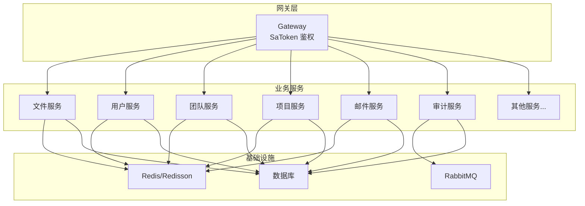
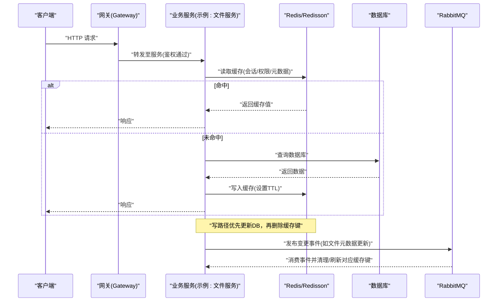
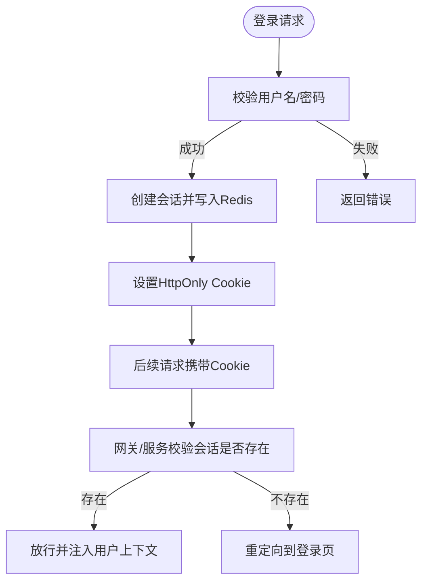
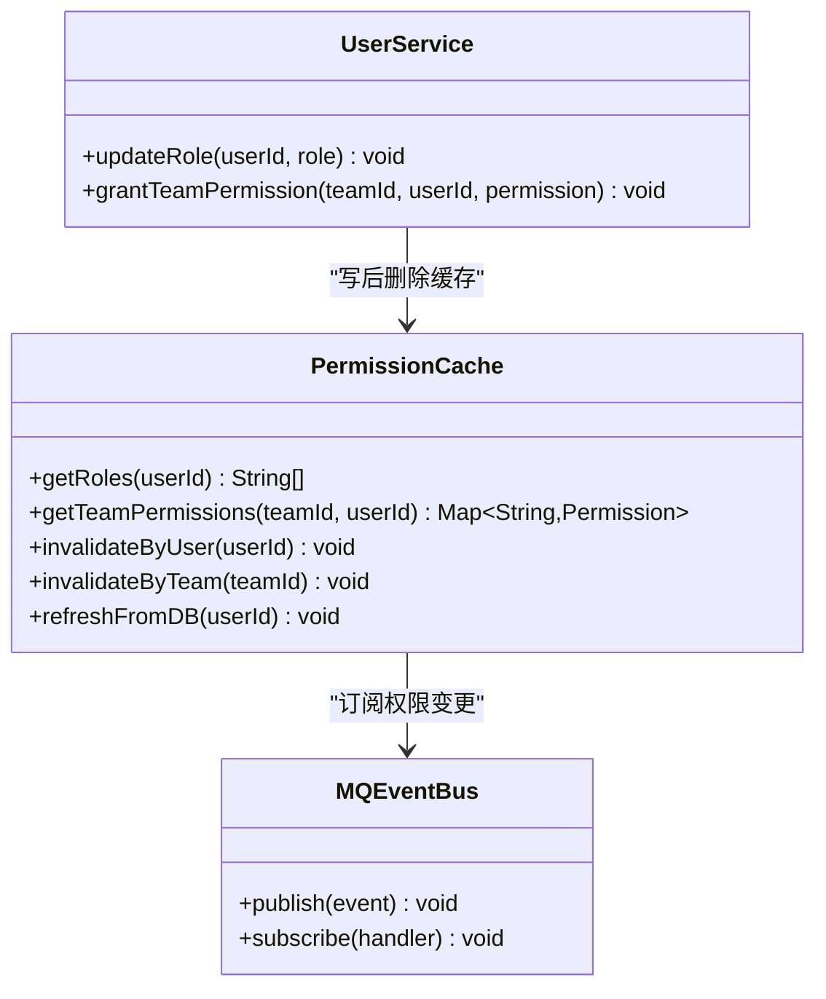
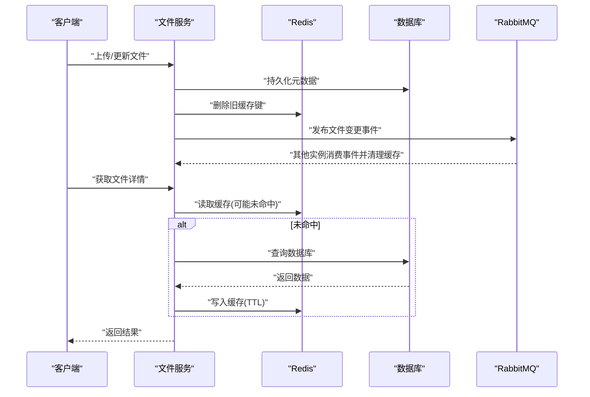
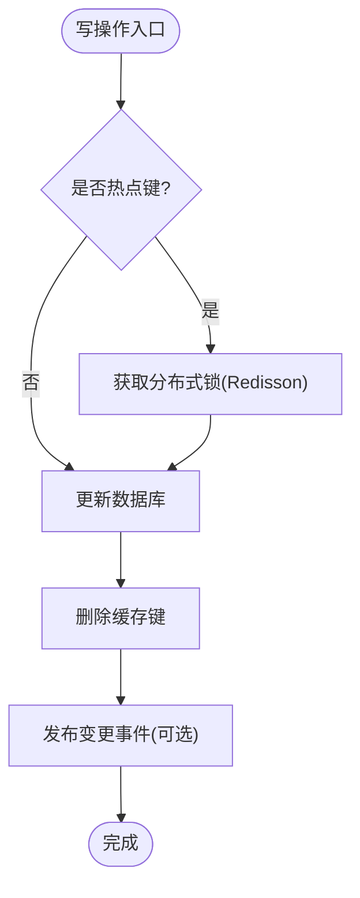
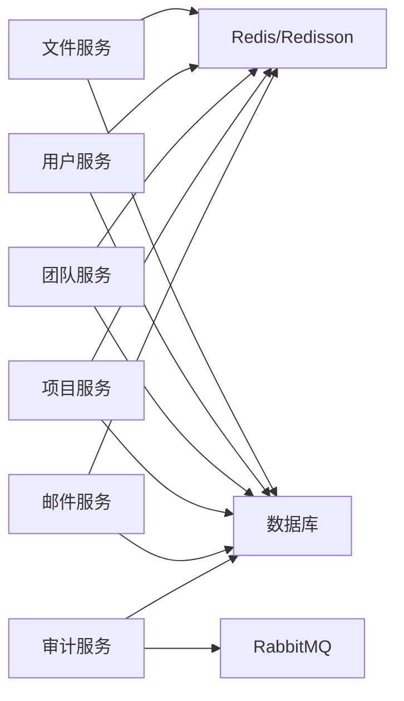

# 缓存策略设计

<cite>
**本文引用的文件**   
- [application-common.yml](file://ZXYZdatabaseBack/zxyz-common/src/main/resources/application-common.yml)
- [zxyz-dynamic.yml](file://nacos-config/zxyz-dynamic.yml)
- [zxyz-file-service.yml](file://nacos-config/zxyz-file-service.yml)
- [Application.java](file://ZXYZdatabaseBack/zxyz-file-service/src/main/java/uno/acloud/file/ZxyzFileApplication.java)
- [ConfigServiceClient.java](file://ZXYZdatabaseBack/zxyz-common/src/main/java/uno/acloud/client/ConfigServiceClient.java)
- [AbstractServiceClient.java](file://ZXYZdatabaseBack/zxyz-common/src/main/java/uno/acloud/client/AbstractServiceClient.java)
- [SaTokenConfigure.java](file://ZXYZdatabaseBack/zxyz-admin-service/src/main/java/uno/acloud/admin/config/SaTokenConfigure.java)
- [application.yml](file://ZXYZdatabaseBack/zxyz-gateway/src/main/resources/application.yml)
- [RabbitMqConfig.java](file://ZXYZdatabaseBack/zxyz-audit-service/src/main/java/uno/acloud/audit/config/RabbitMqConfig.java)
- [OperateLogConsumer.java](file://ZXYZdatabaseBack/zxyz-audit-service/src/main/java/uno/acloud/audit/mq/OperateLogConsumer.java)
- [AuditDlqConsumer.java](file://ZXYZdatabaseBack/zxyz-audit-service/src/main/java/uno/acloud/audit/mq/AuditDlqConsumer.java)
- [application-dev.yml](file://ZXYZdatabaseBack/zxyz-email-service/src/main/resources/application-dev.yml)
- [application-prod.yml](file://ZXYZdatabaseBack/zxyz-email-service/src/main/resources/application-prod.yml)
- [application.yml](file://ZXYZdatabaseBack/zxyz-email-service/src/main/resources/application.yml)
- [docker-compose.yml](file://docker-compose.yml)
- [docker-compose.dev.yml](file://docker-compose.dev.yml)
</cite>

## 目录
1. [引言](#引言)
2. [项目结构](#项目结构)
3. [核心组件](#核心组件)
4. [架构总览](#架构总览)
5. [详细组件分析](#详细组件分析)
6. [依赖分析](#依赖分析)
7. [性能考虑](#性能考虑)
8. [故障排查指南](#故障排查指南)
9. [结论](#结论)
10. [附录](#附录)

## 引言
本设计文档面向 ZXYZ 微服务系统，基于 Redisson 构建分布式缓存体系，覆盖会话存储、权限缓存与文件元数据缓存三大场景。文档从架构、数据流、一致性保证、失效机制、监控统计、性能优化、降级与扩容迁移等方面给出可落地的方案与实施要点，帮助研发与运维团队统一认知并高效落地。

## 项目结构
ZXYZ 采用多模块 Maven 工程（后端 11 个服务 + 前端 Vue），通过 Nacos 进行配置与服务治理，使用 RabbitMQ 进行异步事件通信，Redis/Redisson 作为分布式缓存与会话存储的底层支撑。各服务通过 ServiceClient 进行窄端点同步调用，内部端点受 Gateway SaToken 过滤保护。

图表来源
- [docker-compose.yml](file://docker-compose.yml)
- [docker-compose.dev.yml](file://docker-compose.dev.yml)

章节来源
- [application-common.yml](file://ZXYZdatabaseBack/zxyz-common/src/main/resources/application-common.yml)
- [zxyz-dynamic.yml](file://nacos-config/zxyz-dynamic.yml)

## 核心组件
- 会话存储：基于 Sa-Token + Redis 的分布式会话，支持 HttpOnly Cookie 与跨节点共享。
- 权限缓存：用户角色、团队权限、项目权限等热点读多写少数据的本地/分布式缓存。
- 文件元数据缓存：文件路径、缩略图信息、访问计数、分享链接等高频读取元数据。
- 配置缓存：系统配置、动态开关等通过配置中心拉取后落缓存，减少远程调用。
- 消息驱动失效：通过 RabbitMQ Topic 广播变更事件，触发相关缓存键失效或更新。

章节来源
- [SaTokenConfigure.java](file://ZXYZdatabaseBack/zxyz-admin-service/src/main/java/uno/acloud/admin/config/SaTokenConfigure.java)
- [application.yml](file://ZXYZdatabaseBack/zxyz-gateway/src/main/resources/application.yml)
- [RabbitMqConfig.java](file://ZXYZdatabaseBack/zxyz-audit-service/src/main/java/uno/acloud/audit/config/RabbitMqConfig.java)
- [OperateLogConsumer.java](file://ZXYZdatabaseBack/zxyz-audit-service/src/main/java/uno/acloud/audit/mq/OperateLogConsumer.java)
- [AuditDlqConsumer.java](file://ZXYZdatabaseBack/zxyz-audit-service/src/main/java/uno/acloud/audit/mq/AuditDlqConsumer.java)

## 架构总览
下图展示请求在网关、服务、缓存与数据库之间的典型数据流向，以及缓存失效的事件通道。

图表来源
- [Application.java](file://ZXYZdatabaseBack/zxyz-file-service/src/main/java/uno/acloud/file/ZxyzFileApplication.java)
- [RabbitMqConfig.java](file://ZXYZdatabaseBack/zxyz-audit-service/src/main/java/uno/acloud/audit/config/RabbitMqConfig.java)
- [OperateLogConsumer.java](file://ZXYZdatabaseBack/zxyz-audit-service/src/main/java/uno/acloud/audit/mq/OperateLogConsumer.java)

## 详细组件分析

### 会话存储（Sa-Token + Redis）
- 使用场景：登录态、用户上下文、跨服务鉴权。
- 过期策略：按会话活跃时间动态续期；登出时主动删除；空闲超时自动失效。
- 一致性：会话读写走 Redis，避免单点不一致；网关层校验 Token 有效性。
- 安全：HttpOnly Cookie 防 XSS；敏感字段加密存储。

图表来源
- [SaTokenConfigure.java](file://ZXYZdatabaseBack/zxyz-admin-service/src/main/java/uno/acloud/admin/config/SaTokenConfigure.java)
- [application.yml](file://ZXYZdatabaseBack/zxyz-gateway/src/main/resources/application.yml)

章节来源
- [SaTokenConfigure.java](file://ZXYZdatabaseBack/zxyz-admin-service/src/main/java/uno/acloud/admin/config/SaTokenConfigure.java)
- [application.yml](file://ZXYZdatabaseBack/zxyz-gateway/src/main/resources/application.yml)

### 权限缓存（用户/团队/项目）
- 使用场景：接口鉴权、资源访问控制、RBAC 决策。
- 数据结构：用户-角色、团队-成员、项目-权限映射，建议以 Hash/Set/ZSet 组合建模。
- 过期策略：短 TTL（分钟级）+ 事件驱动主动失效；热点权限可配合本地缓存。
- 一致性：写路径先更新数据库，再删除权限缓存键；订阅权限变更事件刷新。

图表来源
- [RabbitMqConfig.java](file://ZXYZdatabaseBack/zxyz-audit-service/src/main/java/uno/acloud/audit/config/RabbitMqConfig.java)
- [OperateLogConsumer.java](file://ZXYZdatabaseBack/zxyz-audit-service/src/main/java/uno/acloud/audit/mq/OperateLogConsumer.java)

章节来源
- [RabbitMqConfig.java](file://ZXYZdatabaseBack/zxyz-audit-service/src/main/java/uno/acloud/audit/config/RabbitMqConfig.java)
- [OperateLogConsumer.java](file://ZXYZdatabaseBack/zxyz-audit-service/src/main/java/uno/acloud/audit/mq/OperateLogConsumer.java)

### 文件元数据缓存
- 使用场景：文件列表、详情、缩略图、下载链接、访问计数、分享状态。
- 数据结构：文件ID为键，Hash 存储字段；热门文件使用 ZSet 维护热度。
- 过期策略：基础 TTL（小时级）+ 写后删除；分享链接独立短 TTL。
- 一致性：文件上传/修改/删除后，通过事件通知各节点删除对应缓存键。

图表来源
- [Application.java](file://ZXYZdatabaseBack/zxyz-file-service/src/main/java/uno/acloud/file/ZxyzFileApplication.java)
- [RabbitMqConfig.java](file://ZXYZdatabaseBack/zxyz-audit-service/src/main/java/uno/acloud/audit/config/RabbitMqConfig.java)

章节来源
- [Application.java](file://ZXYZdatabaseBack/zxyz-file-service/src/main/java/uno/acloud/file/ZxyzFileApplication.java)
- [RabbitMqConfig.java](file://ZXYZdatabaseBack/zxyz-audit-service/src/main/java/uno/acloud/audit/config/RabbitMqConfig.java)

### 配置缓存（动态配置）
- 使用场景：功能开关、限流阈值、第三方服务地址等。
- 策略：启动时从配置中心拉取，写入本地/分布式缓存；监听配置变更事件刷新。
- 一致性：配置变更后主动失效旧缓存，确保新值生效。

章节来源
- [ConfigServiceClient.java](file://ZXYZdatabaseBack/zxyz-common/src/main/java/uno/acloud/client/ConfigServiceClient.java)
- [AbstractServiceClient.java](file://ZXYZdatabaseBack/zxyz-common/src/main/java/uno/acloud/client/AbstractServiceClient.java)

### 缓存一致性保障
- 写前一致：对强一致场景采用分布式锁（Redisson RLock）保护写路径，避免并发脏写。
- 写后一致：先更新数据库，再删除缓存键；必要时结合延迟双删或消息队列重试。
- 读穿透防护：空值缓存带短 TTL；热点键加互斥锁（RLock）防止击穿；布隆过滤器拦截非法键。
- 热点预热：上线前批量加载高频键（如首页推荐、热门文件、常用权限）。

图表来源
- [AbstractServiceClient.java](file://ZXYZdatabaseBack/zxyz-common/src/main/java/uno/acloud/client/AbstractServiceClient.java)

章节来源
- [AbstractServiceClient.java](file://ZXYZdatabaseBack/zxyz-common/src/main/java/uno/acloud/client/AbstractServiceClient.java)

### 缓存失效机制
- TTL 控制：按数据类型设置合理过期时间（会话分钟级、权限分钟级、元数据小时级）。
- 主动失效：写操作后删除缓存键；配置变更、权限调整、文件更新均触发失效。
- 懒加载模式：首次访问缺失键时回源 DB 并回填缓存；空值缓存用于防穿透。

章节来源
- [RabbitMqConfig.java](file://ZXYZdatabaseBack/zxyz-audit-service/src/main/java/uno/acloud/audit/config/RabbitMqConfig.java)
- [OperateLogConsumer.java](file://ZXYZdatabaseBack/zxyz-audit-service/src/main/java/uno/acloud/audit/mq/OperateLogConsumer.java)

### 缓存监控与统计
- 命中率监控：埋点记录 get/set/del 次数与耗时，计算命中率与 P95/P99 延迟。
- 内存使用监控：监控 Redis 内存峰值、碎片率、连接池大小。
- 慢查询分析：记录超过阈值的缓存操作，定位热点键与异常链路。
- 告警策略：命中率骤降、内存超限、慢查询突增触发告警。

章节来源
- [application-dev.yml](file://ZXYZdatabaseBack/zxyz-email-service/src/main/resources/application-dev.yml)
- [application-prod.yml](file://ZXYZdatabaseBack/zxyz-email-service/src/main/resources/application-prod.yml)
- [application.yml](file://ZXYZdatabaseBack/zxyz-email-service/src/main/resources/application.yml)

## 依赖分析
- 服务间耦合：通过 ServiceClient 调用窄端点，降低耦合度；内部端点受 Gateway 鉴权。
- 缓存依赖：所有服务依赖 Redis/Redisson；部分服务依赖 RabbitMQ 实现事件驱动失效。
- 外部依赖：Nacos 配置中心、Jasypt 加密、数据库与对象存储。

图表来源
- [docker-compose.yml](file://docker-compose.yml)
- [docker-compose.dev.yml](file://docker-compose.dev.yml)

章节来源
- [docker-compose.yml](file://docker-compose.yml)
- [docker-compose.dev.yml](file://docker-compose.dev.yml)

## 性能考虑
- 键设计：扁平化命名空间，避免嵌套过深；热点键分片避免单节点压力。
- 序列化：使用高效序列化（如 JSON 或 Kryo），控制对象体积。
- 连接池：合理配置 Redisson 连接池与线程池，避免阻塞。
- 批量操作：使用 pipeline/事务批量读写，降低网络往返。
- 热点保护：互斥锁、空值缓存、布隆过滤器、本地二级缓存。
- 预热策略：启动阶段预加载高频键，缩短冷启动延迟。

[本节为通用指导，不直接分析具体文件]

## 故障排查指南
- 常见问题
  - 缓存穿透：检查空值缓存 TTL 与布隆过滤器配置。
  - 缓存雪崩：分散 TTL 随机抖动，避免集中过期。
  - 缓存击穿：热点键加互斥锁，限制回源频率。
  - 一致性冲突：确认写路径“先更新DB再删缓存”，必要时引入延迟双删或消息重试。
- 诊断步骤
  - 查看命中率与慢查询日志，定位异常键与热点。
  - 检查 Redis 内存与连接池指标，评估容量与瓶颈。
  - 核对事件消费是否正常，确认失效链是否完整。
- 恢复策略
  - 临时降级：关闭非关键缓存，回源 DB 保障可用性。
  - 快速修复：修正键名或 TTL，重启消费者重新消费积压。

章节来源
- [OperateLogConsumer.java](file://ZXYZdatabaseBack/zxyz-audit-service/src/main/java/uno/acloud/audit/mq/OperateLogConsumer.java)
- [AuditDlqConsumer.java](file://ZXYZdatabaseBack/zxyz-audit-service/src/main/java/uno/acloud/audit/mq/AuditDlqConsumer.java)

## 结论
通过统一的 Redisson 分布式缓存设计与事件驱动的失效机制，ZXYZ 可在高并发场景下保持高性能与一致性。建议持续完善监控告警、热点保护与预热策略，并结合业务特性优化键设计与序列化方式，确保系统在扩容与演进中保持稳定与弹性。

[本节为总结性内容，不直接分析具体文件]

## 附录
- 部署参考：容器编排与中间件依赖见 docker-compose 文件。
- 配置管理：Nacos 动态配置与 Jasypt 加密见 nacos-config 与相关应用配置。
- 扩展建议：引入多级缓存（本地+分布式）、热点键自适应、缓存版本化与灰度发布。

章节来源
- [docker-compose.yml](file://docker-compose.yml)
- [docker-compose.dev.yml](file://docker-compose.dev.yml)
- [zxyz-dynamic.yml](file://nacos-config/zxyz-dynamic.yml)
- [application-common.yml](file://ZXYZdatabaseBack/zxyz-common/src/main/resources/application-common.yml)