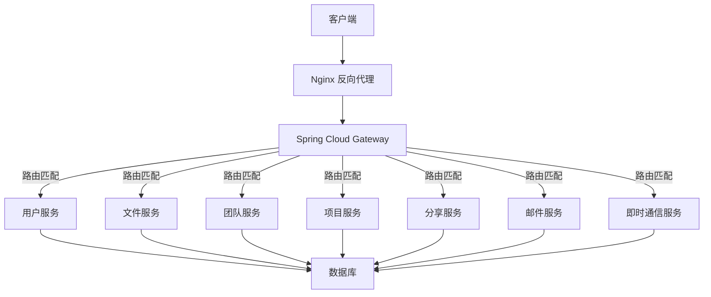
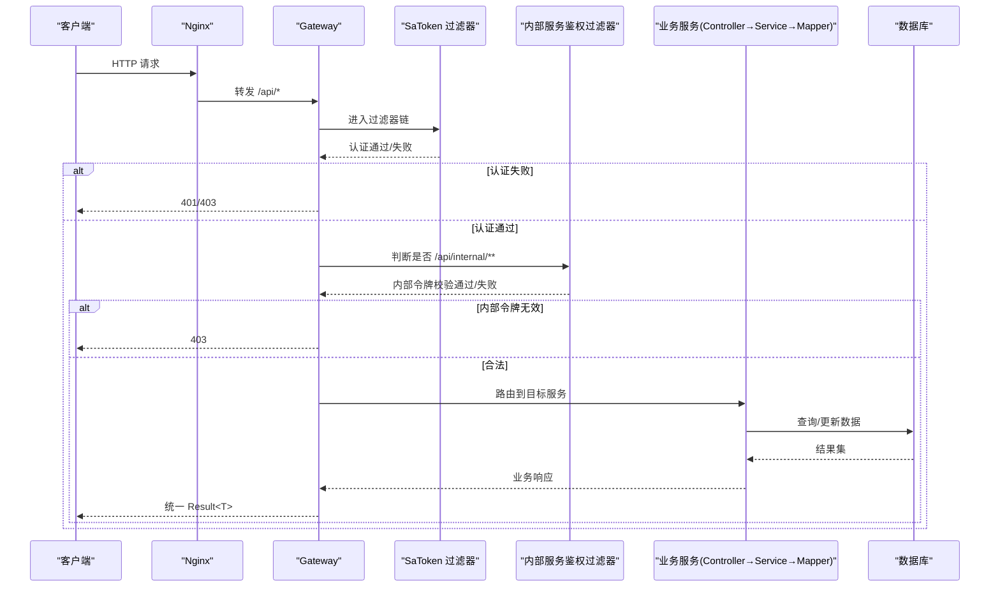
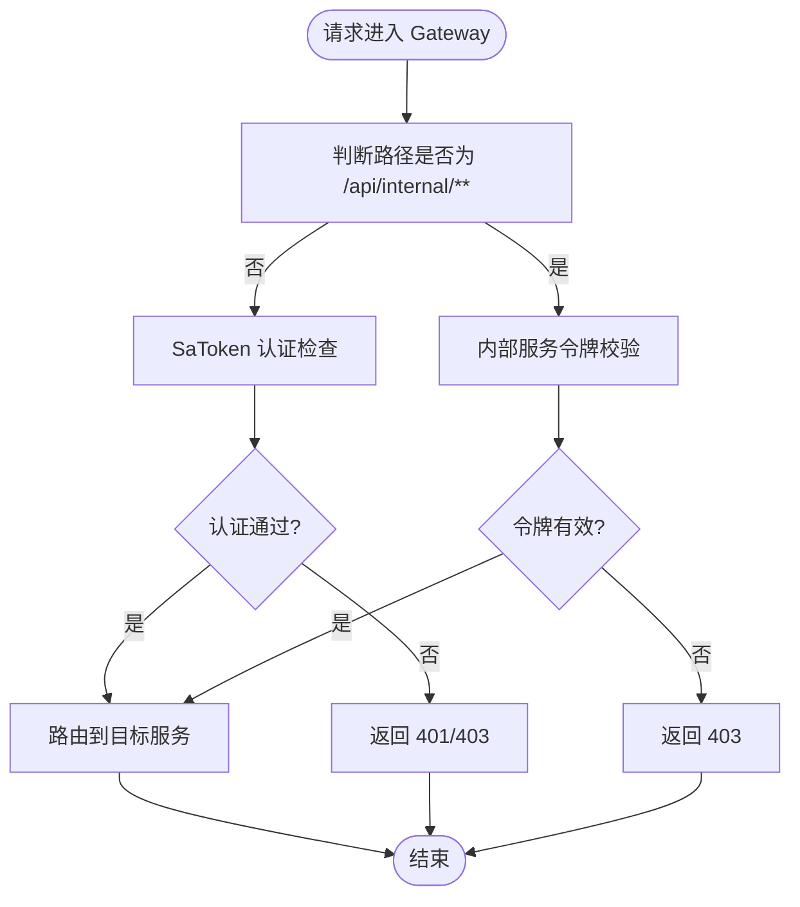
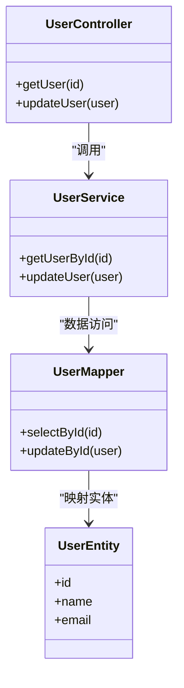
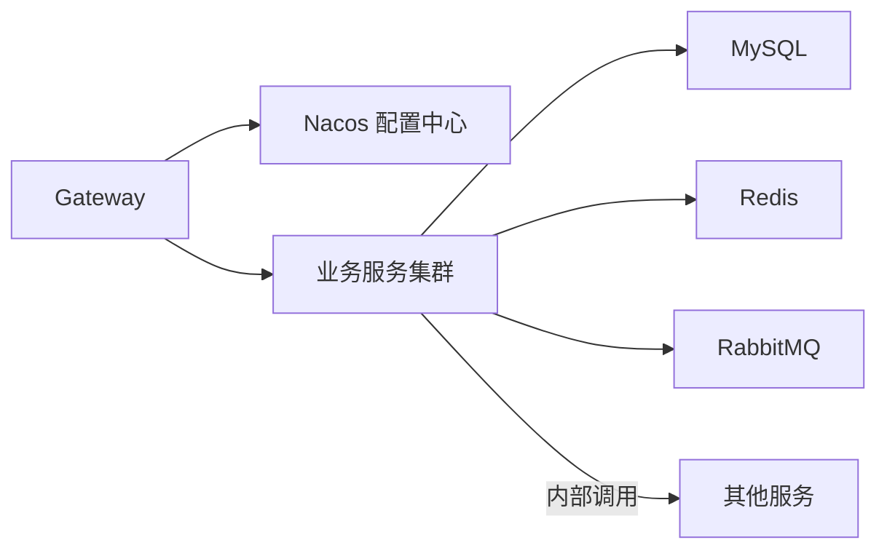

# 请求处理流程

<cite>
**本文引用的文件**   
- [zxyz-gateway.yml](file://nacos-config/zxyz-gateway.yml)
- [application.yml](file://ZXYZdatabaseBack/zxyz-gateway/src/main/resources/application.yml)
- [SaTokenFilterConfig.java](file://ZXYZdatabaseBack/zxyz-gateway/src/main/java/uno/acloud/gateway/filter/SaTokenFilterConfig.java)
- [InternalServiceAuthFilter.java](file://ZXYZdatabaseBack/zxyz-gateway/src/main/java/uno/acloud/gateway/filter/InternalServiceAuthFilter.java)
- [Application.java](file://ZXYZdatabaseBack/zxyz-gateway/src/main/java/uno/acloud/gateway/ZxyzGatewayApplication.java)
- [default.conf](file://deploy/nginx/default.conf)
- [application.yml](file://ZXYZdatabaseBack/zxyz-user-service/src/main/resources/application.yml)
- [UserController.java](file://ZXYZdatabaseBack/zxyz-user-service/src/main/java/uno/acloud/user/controller/UserController.java)
- [UserService.java](file://ZXYZdatabaseBack/zxyz-user-service/src/main/java/uno/acloud/user/service/UserService.java)
- [UserMapper.java](file://ZXYZdatabaseBack/zxyz-user-service/src/main/java/uno/acloud/user/mapper/UserMapper.java)
- [AbstractServiceClient.java](file://ZXYZdatabaseBack/zxyz-common/src/main/java/uno/acloud/client/AbstractServiceClient.java)
- [ServiceResponseParser.java](file://ZXYZdatabaseBack/zxyz-common/src/main/java/uno/acloud/client/ServiceResponseParser.java)
- [application.yml](file://ZXYZdatabaseBack/zxyz-admin-service/src/main/resources/application.yml)
- [AdminServiceProperties.java](file://ZXYZdatabaseBack/zxyz-admin-service/src/main/java/uno/acloud/admin/config/AdminServiceProperties.java)
- [RestClientConfig.java](file://ZXYZdatabaseBack/zxyz-admin-service/src/main/java/uno/acloud/admin/config/RestClientConfig.java)
- [application.yml](file://ZXYZdatabaseBack/zxyz-file-service/src/main/resources/application.yml)
- [application.yml](file://ZXYZdatabaseBack/zxyz-team-service/src/main/resources/application.yml)
- [application.yml](file://ZXYZdatabaseBack/zxyz-project-service/src/main/resources/application.yml)
- [application.yml](file://ZXYZdatabaseBack/zxyz-share-service/src/main/resources/application.yml)
- [application.yml](file://ZXYZdatabaseBack/zxyz-email-service/src/main/resources/application.yml)
- [application.yml](file://ZXYZdatabaseBack/zxyz-im-service/src/main/resources/application.yml)
</cite>

## 目录
1. [简介](#简介)
2. [项目结构](#项目结构)
3. [核心组件](#核心组件)
4. [架构总览](#架构总览)
5. [详细组件分析](#详细组件分析)
6. [依赖关系分析](#依赖关系分析)
7. [性能考虑](#性能考虑)
8. [故障排查指南](#故障排查指南)
9. [结论](#结论)
10. [附录](#附录)

## 简介
本文件面向 ZXYZ 项目的后端与网关层，系统化描述从客户端到数据库的完整请求处理链路：客户端 → Nginx 反向代理 → Spring Cloud Gateway 路由 → SaToken 认证过滤器 → 业务 Controller → Service 层 → Mapper 数据访问 → 数据库操作 → 响应返回。重点说明：
- Gateway 的路由配置与转发策略
- 过滤器链执行顺序（含内部服务鉴权）
- SaToken 认证机制与权限校验
- 内部服务调用的安全机制（X-Internal-Service-Token 头部验证、/api/internal/** 端点保护）
- 请求处理的时序图、过滤器执行流程图与错误处理机制
- 常见问题定位方法与性能优化建议

## 项目结构
ZXYZ 采用微服务架构，包含多个独立的服务模块与统一的网关入口。前端通过 Nginx 暴露静态资源与反向代理，所有 API 请求经 Gateway 统一路由与鉴权后分发至具体业务服务。各服务遵循传统分层或 DDD 分层风格，数据访问通过 MyBatis Mapper 完成。

[本节为总体概览，不直接分析具体文件]

## 核心组件
- Nginx 反向代理：负责静态资源托管、HTTPS 终止、请求转发至 Gateway。
- Spring Cloud Gateway：统一入口，承载路由规则、全局过滤器（SaToken、内部服务鉴权等）。
- SaToken 认证：基于 Cookie + Redis Session 的用户会话管理，提供登录态校验与权限控制。
- 内部服务调用安全：通过 X-Internal-Service-Token 头部进行服务间鉴权，/api/internal/** 仅允许内网调用。
- 业务服务分层：Controller → Service → Mapper → Database，部分服务采用 DDD 分层。

**章节来源**
- [default.conf](file://deploy/nginx/default.conf)
- [application.yml](file://ZXYZdatabaseBack/zxyz-gateway/src/main/resources/application.yml)
- [zxyz-gateway.yml](file://nacos-config/zxyz-gateway.yml)

## 架构总览
下图展示从客户端到数据库的端到端请求路径，以及关键的安全与路由节点。

**图表来源**
- [default.conf](file://deploy/nginx/default.conf)
- [application.yml](file://ZXYZdatabaseBack/zxyz-gateway/src/main/resources/application.yml)
- [zxyz-gateway.yml](file://nacos-config/zxyz-gateway.yml)
- [SaTokenFilterConfig.java](file://ZXYZdatabaseBack/zxyz-gateway/src/main/java/uno/acloud/gateway/filter/SaTokenFilterConfig.java)
- [InternalServiceAuthFilter.java](file://ZXYZdatabaseBack/zxyz-gateway/src/main/java/uno/acloud/gateway/filter/InternalServiceAuthFilter.java)

**章节来源**
- [Application.java](file://ZXYZdatabaseBack/zxyz-gateway/src/main/java/uno/acloud/gateway/ZxyzGatewayApplication.java)
- [zxyz-gateway.yml](file://nacos-config/zxyz-gateway.yml)

## 详细组件分析

### Nginx 反向代理
- 职责：静态资源托管、HTTPS 终止、将 /api 请求转发到 Gateway。
- 关键点：确保 upstream 指向正确的 Gateway 地址；合理设置超时与缓存策略。

**章节来源**
- [default.conf](file://deploy/nginx/default.conf)

### Spring Cloud Gateway 路由配置
- 路由规则：按前缀或路径匹配将请求转发到对应服务实例。
- 动态配置：可通过 Nacos 集中管理路由与限流等策略。
- 注意：/api/internal/** 需严格限制公网访问，仅允许内网服务调用。

**章节来源**
- [zxyz-gateway.yml](file://nacos-config/zxyz-gateway.yml)
- [application.yml](file://ZXYZdatabaseBack/zxyz-gateway/src/main/resources/application.yml)

### 过滤器链执行顺序
- 全局过滤器顺序：通常先进行认证（SaToken），再进行内部服务鉴权（X-Internal-Service-Token）。
- 执行流程：请求进入 Gateway → SaToken 校验登录态 → 若命中 /api/internal/** → 内部令牌校验 → 路由到目标服务。
- 异常处理：认证失败返回 401/403；内部令牌无效返回 403；其他异常统一封装为 Result。

**图表来源**
- [SaTokenFilterConfig.java](file://ZXYZdatabaseBack/zxyz-gateway/src/main/java/uno/acloud/gateway/filter/SaTokenFilterConfig.java)
- [InternalServiceAuthFilter.java](file://ZXYZdatabaseBack/zxyz-gateway/src/main/java/uno/acloud/gateway/filter/InternalServiceAuthFilter.java)

**章节来源**
- [SaTokenFilterConfig.java](file://ZXYZdatabaseBack/zxyz-gateway/src/main/java/uno/acloud/gateway/filter/SaTokenFilterConfig.java)
- [InternalServiceAuthFilter.java](file://ZXYZdatabaseBack/zxyz-gateway/src/main/java/uno/acloud/gateway/filter/InternalServiceAuthFilter.java)

### SaToken 认证机制与权限验证
- 认证方式：HttpOnly Cookie 存储 UUID token，服务端使用 Redis 维护 Session。
- 权限控制：结合角色与资源权限，在过滤器中拦截未授权访问。
- 最佳实践：避免在 Cookie 中存放敏感信息；定期清理过期 Session。

**章节来源**
- [SaTokenFilterConfig.java](file://ZXYZdatabaseBack/zxyz-gateway/src/main/java/uno/acloud/gateway/filter/SaTokenFilterConfig.java)

### 内部服务调用安全机制
- 头部校验：要求携带 X-Internal-Service-Token，服务端校验其合法性。
- 端点保护：/api/internal/** 仅允许内网访问，外部请求将被拒绝。
- 实现要点：在服务启动时加载共享密钥或白名单；对非法请求快速失败。

**章节来源**
- [InternalServiceAuthFilter.java](file://ZXYZdatabaseBack/zxyz-gateway/src/main/java/uno/acloud/gateway/filter/InternalServiceAuthFilter.java)

### 业务服务分层与数据访问
- 传统分层：Controller → Service → Mapper → Entity → Database。
- DDD 分层：interfaces → application → domain → infrastructure（如 im-service、email-service）。
- 数据访问：MyBatis Mapper 生成 SQL，支持分页、条件查询与批量操作。

**图表来源**
- [UserController.java](file://ZXYZdatabaseBack/zxyz-user-service/src/main/java/uno/acloud/user/controller/UserController.java)
- [UserService.java](file://ZXYZdatabaseBack/zxyz-user-service/src/main/java/uno/acloud/user/service/UserService.java)
- [UserMapper.java](file://ZXYZdatabaseBack/zxyz-user-service/src/main/java/uno/acloud/user/mapper/UserMapper.java)

**章节来源**
- [application.yml](file://ZXYZdatabaseBack/zxyz-user-service/src/main/resources/application.yml)
- [UserController.java](file://ZXYZdatabaseBack/zxyz-user-service/src/main/java/uno/acloud/user/controller/UserController.java)
- [UserService.java](file://ZXYZdatabaseBack/zxyz-user-service/src/main/java/uno/acloud/user/service/UserService.java)
- [UserMapper.java](file://ZXYZdatabaseBack/zxyz-user-service/src/main/java/uno/acloud/user/mapper/UserMapper.java)

### 服务间调用与响应解析
- 客户端抽象：AbstractServiceClient 提供统一的 HTTP 调用能力。
- 响应解析：ServiceResponseParser 将 JSON 响应转换为强类型 VO，避免 treeToValue 的性能损耗。
- 窄端点与投影模式：内部接口返回调用方专用 Projection VO，禁止返回胖 DTO。

**章节来源**
- [AbstractServiceClient.java](file://ZXYZdatabaseBack/zxyz-common/src/main/java/uno/acloud/client/AbstractServiceClient.java)
- [ServiceResponseParser.java](file://ZXYZdatabaseBack/zxyz-common/src/main/java/uno/acloud/client/ServiceResponseParser.java)

### 配置管理与安全参数
- 服务配置：各服务通过 application.yml 管理本地配置，生产环境通过 Nacos 动态下发。
- 内部令牌：AdminServiceProperties 与 RestClientConfig 用于加载与服务间调用相关的安全参数。

**章节来源**
- [application.yml](file://ZXYZdatabaseBack/zxyz-admin-service/src/main/resources/application.yml)
- [AdminServiceProperties.java](file://ZXYZdatabaseBack/zxyz-admin-service/src/main/java/uno/acloud/admin/config/AdminServiceProperties.java)
- [RestClientConfig.java](file://ZXYZdatabaseBack/zxyz-admin-service/src/main/java/uno/acloud/admin/config/RestClientConfig.java)

## 依赖关系分析
- Gateway 依赖 Nacos 配置中心获取路由与过滤器策略。
- 各业务服务依赖数据库（MySQL）、Redis（Session）、RabbitMQ（异步消息）。
- 内部服务调用通过 RestTemplate/WebClient 发起，并附加 X-Internal-Service-Token。

**图表来源**
- [zxyz-gateway.yml](file://nacos-config/zxyz-gateway.yml)
- [application.yml](file://ZXYZdatabaseBack/zxyz-user-service/src/main/resources/application.yml)
- [application.yml](file://ZXYZdatabaseBack/zxyz-file-service/src/main/resources/application.yml)
- [application.yml](file://ZXYZdatabaseBack/zxyz-team-service/src/main/resources/application.yml)
- [application.yml](file://ZXYZdatabaseBack/zxyz-project-service/src/main/resources/application.yml)
- [application.yml](file://ZXYZdatabaseBack/zxyz-share-service/src/main/resources/application.yml)
- [application.yml](file://ZXYZdatabaseBack/zxyz-email-service/src/main/resources/application.yml)
- [application.yml](file://ZXYZdatabaseBack/zxyz-im-service/src/main/resources/application.yml)

**章节来源**
- [zxyz-gateway.yml](file://nacos-config/zxyz-gateway.yml)

## 性能考虑
- 连接池优化：调整数据库连接池大小与超时时间，避免连接耗尽。
- 缓存策略：合理使用 Redis 缓存热点数据，减少数据库压力。
- 异步处理：非关键路径使用 RabbitMQ 异步化，提升吞吐。
- 序列化优化：避免频繁使用 treeToValue，优先使用强类型 VO 映射。
- 监控告警：接入 APM 与日志采集，实时监控慢查询与异常率。

[本节为通用指导，不直接分析具体文件]

## 故障排查指南
- 认证失败：检查 SaToken Cookie 是否有效，Redis Session 是否存在。
- 内部令牌无效：确认 X-Internal-Service-Token 是否正确传递且服务端已配置。
- 路由错误：核对 Gateway 路由规则与 Nacos 配置一致性。
- 数据库连接异常：检查连接池配置与数据库可用性。
- 日志定位：查看 Gateway 与业务服务的访问日志与错误堆栈。

**章节来源**
- [SaTokenFilterConfig.java](file://ZXYZdatabaseBack/zxyz-gateway/src/main/java/uno/acloud/gateway/filter/SaTokenFilterConfig.java)
- [InternalServiceAuthFilter.java](file://ZXYZdatabaseBack/zxyz-gateway/src/main/java/uno/acloud/gateway/filter/InternalServiceAuthFilter.java)

## 结论
ZXYZ 项目通过 Nginx + Gateway + SaToken 构建了统一、安全的 API 入口，结合内部服务令牌机制保障了服务间调用的安全性。清晰的请求处理链路、严格的过滤器执行顺序与完善的错误处理机制，为系统的稳定性与可维护性提供了坚实基础。建议持续优化连接池、缓存与异步处理能力，并加强监控与日志采集，以应对高并发场景下的性能挑战。

[本节为总结，不直接分析具体文件]

## 附录
- 常见配置项说明：详见各服务 application.yml 与 Nacos 配置文件。
- 部署文档：参考 DEPLOYMENT.md 与 docker-compose 编排文件。
- CI/CD：GitHub Actions 工作流定义见 .github/workflows/ci-cd.yml。

[本节为补充信息，不直接分析具体文件]