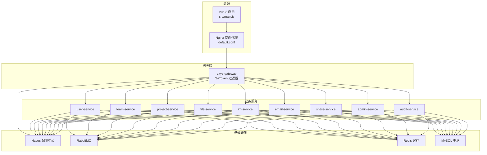
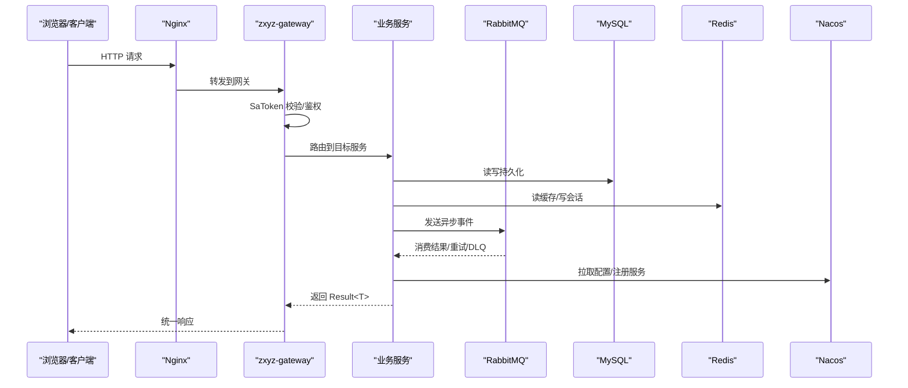
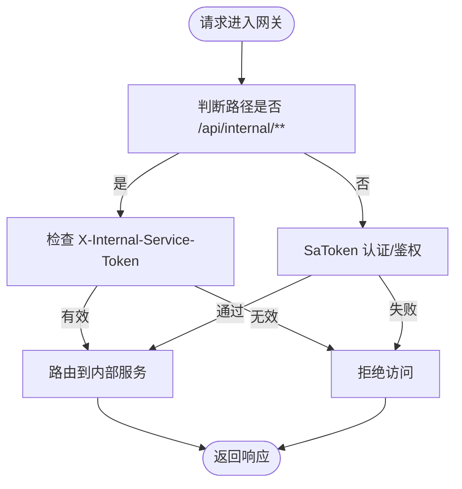
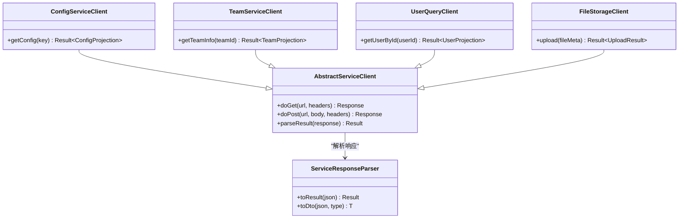
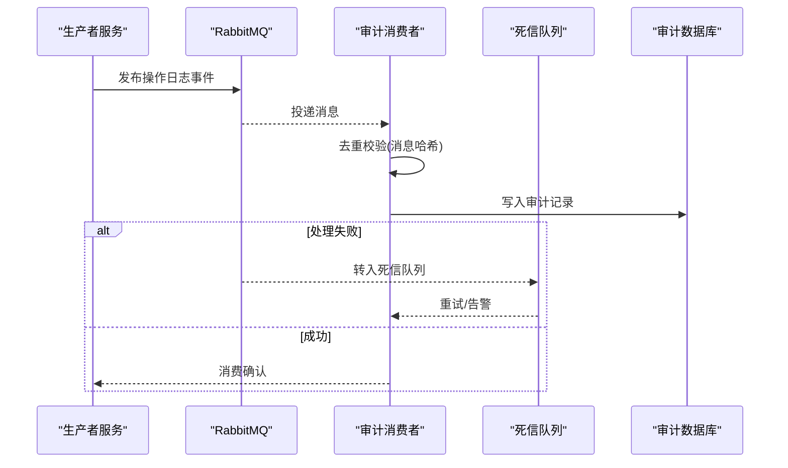
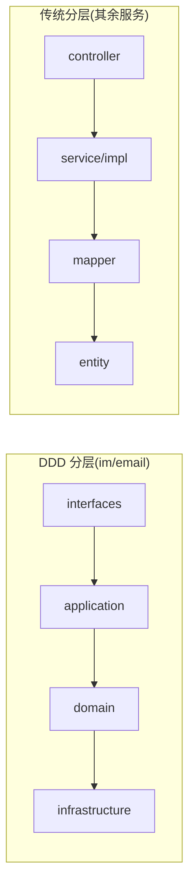
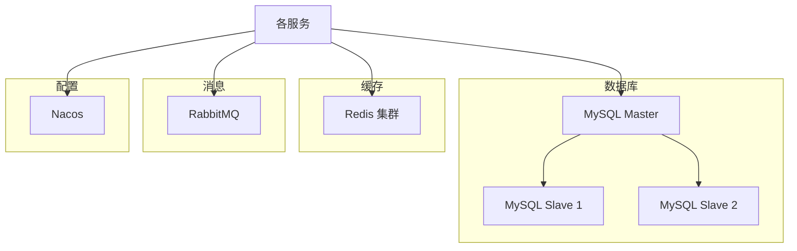
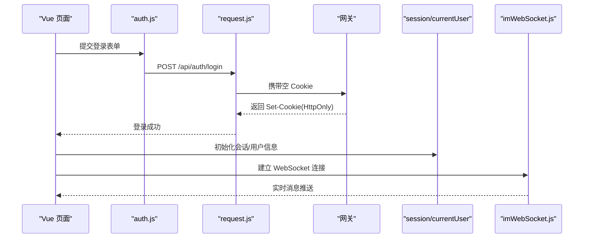
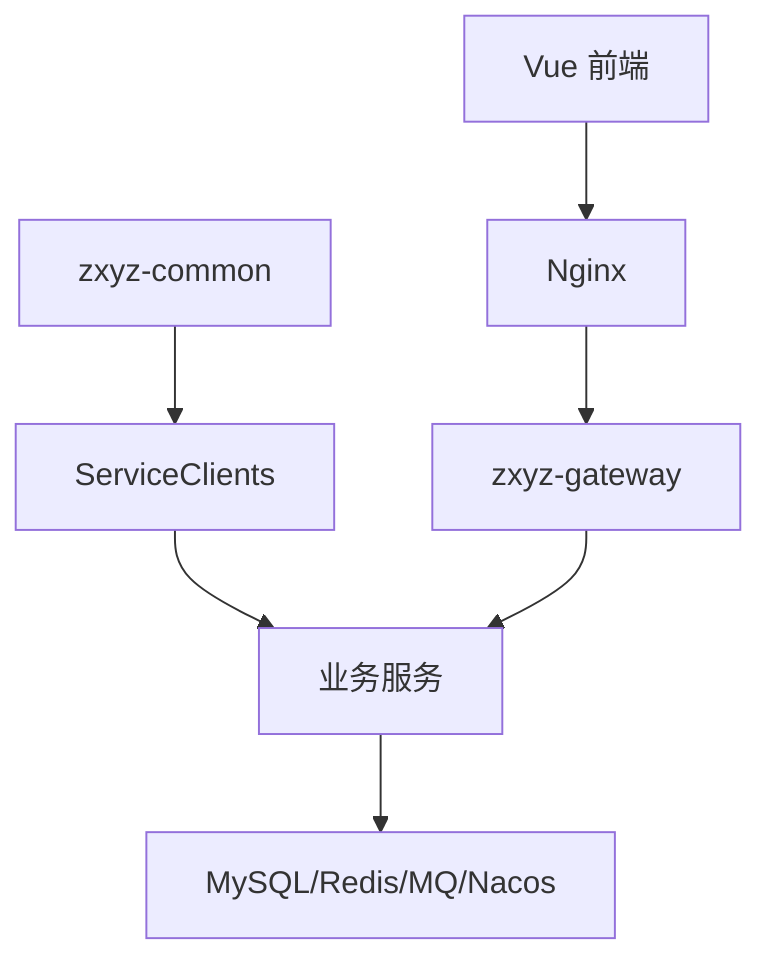

# 架构设计

<cite>
**本文引用的文件**
- [pom.xml](file://ZXYZdatabaseBack/pom.xml)
- [docker-compose.yml](file://docker-compose.yml)
- [docker-compose.dev.yml](file://docker-compose.dev.yml)
- [zxyz-gateway.yml](file://nacos-config/zxyz-gateway.yml)
- [zxyz-dynamic.yml](file://nacos-config/zxyz-dynamic.yml)
- [zxyz-static.yml](file://nacos-config/zxyz-static.yml)
- [application.yml](file://ZXYZdatabaseBack/zxyz-gateway/src/main/resources/application.yml)
- [SaTokenFilterConfigTest.java](file://ZXYZdatabaseBack/zxyz-gateway/src/test/java/uno/acloud/gateway/filter/SaTokenFilterConfigTest.java)
- [RabbitMqConfig.java](file://ZXYZdatabaseBack/zxyz-audit-service/src/main/java/uno/acloud/audit/config/RabbitMqConfig.java)
- [OperateLogConsumer.java](file://ZXYZdatabaseBack/zxyz-audit-service/src/main/java/uno/acloud/audit/mq/OperateLogConsumer.java)
- [AuditDlqConsumer.java](file://ZXYZdatabaseBack/zxyz-audit-service/src/main/java/uno/acloud/audit/mq/AuditDlqConsumer.java)
- [Application.java](file://ZXYZdatabaseBack/zxyz-email-service/src/main/java/uno/acloud/email/ZxyzEmailApplication.java)
- [Application.java](file://ZXYZdatabaseBack/zxyz-im-service/src/main/java/uno/acloud/im/ZxyzImApplication.java)
- [Application.java](file://ZXYZdatabaseBack/zxyz-admin-service/src/main/java/uno/acloud/admin/ZxyzAdminApplication.java)
- [Application.java](file://ZXYZdatabaseBack/zxyz-file-service/src/main/java/uno/acloud/file/ZxyzFileApplication.java)
- [Application.java](file://ZXYZdatabaseBack/zxyz-project-service/src/main/java/uno/acloud/project/ZxyzProjectServiceApplication.java)
- [Application.java](file://ZXYZdatabaseBack/zxyz-share-service/src/main/java/uno/acloud/share/ZxyzShareApplication.java)
- [Application.java](file://ZXYZdatabaseBack/zxyz-team-service/src/main/java/uno/acloud/team/ZxyzTeamServiceApplication.java)
- [Application.java](file://ZXYZdatabaseBack/zxyz-user-service/src/main/java/uno/acloud/user/ZxyzUserApplication.java)
- [AbstractServiceClient.java](file://ZXYZdatabaseBack/zxyz-common/src/main/java/uno/acloud/client/AbstractServiceClient.java)
- [ConfigServiceClient.java](file://ZXYZdatabaseBack/zxyz-common/src/main/java/uno/acloud/client/ConfigServiceClient.java)
- [TeamServiceClient.java](file://ZXYZdatabaseBack/zxyz-common/src/main/java/uno/acloud/client/TeamServiceClient.java)
- [UserQueryClient.java](file://ZXYZdatabaseBack/zxyz-common/src/main/java/uno/acloud/client/UserQueryClient.java)
- [FileStorageClient.java](file://ZXYZdatabaseBack/zxyz-common/src/main/java/uno/acloud/client/FileStorageClient.java)
- [ServiceResponseParser.java](file://ZXYZdatabaseBack/zxyz-common/src/main/java/uno/acloud/client/ServiceResponseParser.java)
- [application-dev.yml](file://ZXYZdatabaseBack/zxyz-admin-service/src/main/resources/application-dev.yml)
- [application-prod.yml](file://ZXYZdatabaseBack/zxyz-admin-service/src/main/resources/application-prod.yml)
- [application.yml](file://ZXYZdatabaseBack/zxyz-admin-service/src/main/resources/application.yml)
- [V1__init_config_schema.sql](file://ZXYZdatabaseBack/zxyz-admin-service/src/main/resources/db/migration/V1__init_config_schema.sql)
- [V2__hot_config_keys.sql](file://ZXYZdatabaseBack/zxyz-admin-service/src/main/resources/db/migration/V2__hot_config_keys.sql)
- [V3__fix_config_keys.sql](file://ZXYZdatabaseBack/zxyz-admin-service/src/main/resources/db/migration/V3__fix_config_keys.sql)
- [schema_user.sql](file://ZXYZdatabaseBack/sql/schema_user.sql)
- [schema_team.sql](file://ZXYZdatabaseBack/sql/schema_team.sql)
- [schema_project.sql](file://ZXYZdatabaseBack/sql/schema_project.sql)
- [schema_file.sql](file://ZXYZdatabaseBack/sql/schema_file.sql)
- [schema_im.sql](file://ZXYZdatabaseBack/sql/schema_im.sql)
- [schema_share.sql](file://ZXYZdatabaseBack/sql/schema_share.sql)
- [schema_email.sql](file://ZXYZdatabaseBack/sql/schema_email.sql)
- [schema_audit.sql](file://ZXYZdatabaseBack/sql/schema_audit.sql)
- [default.conf](file://deploy/nginx/default.conf)
- [entrypoint.sh](file://deploy/nginx/entrypoint.sh)
- [ci-cd.yml](file://ZXYZdatabaseBack/.github/workflows/ci-cd.yml)
- [build.yml](file://ZXYZdatabaseFront/.github/workflows/build.yml)
- [deploy.yml](file://ZXYZdatabaseFront/.github/workflows/deploy.yml)
- [package.json](file://ZXYZdatabaseFront/package.json)
- [index.html](file://ZXYZdatabaseFront/index.html)
- [main.js](file://ZXYZdatabaseFront/src/main.js)
- [api/auth.js](file://ZXYZdatabaseFront/src/api/auth.js)
- [request.js](file://ZXYZdatabaseFront/src/utils/request.js)
- [createApiClient.js](file://ZXYZdatabaseFront/src/utils/createApiClient.js)
- [auth.js](file://ZXYZdatabaseFront/src/utils/auth.js)
- [useLoginForm.js](file://ZXYZdatabaseFront/src/composables/useLoginForm.js)
- [router/index.js](file://ZXYZdatabaseFront/src/router/index.js)
- [guards/permission.js](file://ZXYZdatabaseFront/src/router/guards/permission.js)
- [store/session.js](file://ZXYZdatabaseFront/src/store/session.js)
- [store/currentUser.js](file://ZXYZdatabaseFront/src/store/currentUser.js)
- [chat.js](file://ZXYZdatabaseFront/src/store/chat.js)
- [imWebSocket.js](file://ZXYZdatabaseFront/src/utils/imWebSocket.js)
- [im.spec.js](file://ZXYZdatabaseFront/src/api/__tests__/im.spec.js)
</cite>

## 目录
1. [引言](#引言)
2. [项目结构](#项目结构)
3. [核心组件](#核心组件)
4. [架构总览](#架构总览)
5. [详细组件分析](#详细组件分析)
6. [依赖关系分析](#依赖关系分析)
7. [性能考量](#性能考量)
8. [故障排查指南](#故障排查指南)
9. [结论](#结论)
10. [附录](#附录)

## 引言
本文件为 ZXYZ 项目的全面架构设计文档，覆盖微服务划分、职责边界、通信机制、分层策略（传统分层与 DDD 混合）、系统边界与数据流、基础设施集成（MySQL 主从、Redis、RabbitMQ、Nacos）、安全架构（SaToken、内部服务鉴权、API 网关过滤链），以及系统上下文图与组件分解图。文档同时给出技术决策、权衡与约束，帮助读者快速理解并扩展系统。

## 项目结构
后端采用多模块 Maven 工程，包含 11 个服务模块与一个公共库模块；前端为 Vue 3 单页应用，通过 Nginx 静态托管并由 API 网关统一接入。关键组织方式：
- 后端服务按领域拆分：用户、团队、项目、文件、IM、邮件、分享、审计、配置管理、网关等
- 公共能力抽取至 zxyz-common（客户端封装、通用 DTO/VO、工具类、权限模型）
- 配置中心使用 Nacos，提供动态配置与服务注册发现
- 部署编排使用 Docker Compose，CI/CD 基于 GitHub Actions

**图表来源**
- [docker-compose.yml](file://docker-compose.yml)
- [docker-compose.dev.yml](file://docker-compose.dev.yml)
- [default.conf](file://deploy/nginx/default.conf)
- [application.yml](file://ZXYZdatabaseBack/zxyz-gateway/src/main/resources/application.yml)

**章节来源**
- [pom.xml](file://ZXYZdatabaseBack/pom.xml)
- [docker-compose.yml](file://docker-compose.yml)
- [docker-compose.dev.yml](file://docker-compose.dev.yml)

## 核心组件
- 网关（zxyz-gateway）：统一入口，承载 SaToken 认证、鉴权、限流、路由转发，拦截 /api/internal/** 拒绝公网访问
- 业务服务：user/team/project/file/im/email/share/admin/audit 各自负责领域内聚合与流程编排
- 公共库（zxyz-common）：服务间调用客户端抽象、响应解析、权限模型、事件与审计通用类型
- 基础设施：MySQL（主从）、Redis（会话/缓存）、RabbitMQ（异步消息）、Nacos（配置/注册）

**章节来源**
- [application.yml](file://ZXYZdatabaseBack/zxyz-gateway/src/main/resources/application.yml)
- [AbstractServiceClient.java](file://ZXYZdatabaseBack/zxyz-common/src/main/java/uno/acloud/client/AbstractServiceClient.java)
- [ServiceResponseParser.java](file://ZXYZdatabaseBack/zxyz-common/src/main/java/uno/acloud/client/ServiceResponseParser.java)

## 架构总览
整体采用“网关 + 微服务 + 基础设施”的分层模式。外部请求经 Nginx 进入网关，网关完成身份校验与鉴权后转发到具体服务；服务之间通过窄端点 + 投影 VO 进行同步调用，并通过 RabbitMQ Topic Exchange 进行异步解耦。配置由 Nacos 统一管理，敏感信息通过 Jasypt 加密。

**图表来源**
- [application.yml](file://ZXYZdatabaseBack/zxyz-gateway/src/main/resources/application.yml)
- [RabbitMqConfig.java](file://ZXYZdatabaseBack/zxyz-audit-service/src/main/java/uno/acloud/audit/config/RabbitMqConfig.java)
- [OperateLogConsumer.java](file://ZXYZdatabaseBack/zxyz-audit-service/src/main/java/uno/acloud/audit/mq/OperateLogConsumer.java)
- [AuditDlqConsumer.java](file://ZXYZdatabaseBack/zxyz-audit-service/src/main/java/uno/acloud/audit/mq/AuditDlqConsumer.java)

## 详细组件分析

### 网关与安全过滤链
- 功能：统一鉴权、路由、跨域、日志、限流、内部接口保护
- 关键点：
  - SaToken 过滤器对请求头中的 Token 进行校验，失败直接拒绝
  - 对 /api/internal/** 路径强制拒绝公网访问，仅允许内部服务调用
  - 结合 Nacos 动态配置实现规则热更新

**图表来源**
- [SaTokenFilterConfigTest.java](file://ZXYZdatabaseBack/zxyz-gateway/src/test/java/uno/acloud/gateway/filter/SaTokenFilterConfigTest.java)
- [application.yml](file://ZXYZdatabaseBack/zxyz-gateway/src/main/resources/application.yml)

**章节来源**
- [SaTokenFilterConfigTest.java](file://ZXYZdatabaseBack/zxyz-gateway/src/test/java/uno/acloud/gateway/filter/SaTokenFilterConfigTest.java)
- [application.yml](file://ZXYZdatabaseBack/zxyz-gateway/src/main/resources/application.yml)

### 服务间通信与窄端点投影
- 同步调用：通过 zxyz-common 的 AbstractServiceClient 派生各 ServiceClient（如 ConfigServiceClient、TeamServiceClient、UserQueryClient、FileStorageClient），统一处理请求构建、签名、重试与响应解析
- 响应格式：统一 Result<T>，code=1 表示成功；提供方返回调用方专用的 Projection VO，避免胖 DTO 泄露
- 手动映射：使用 JsonNode 字段映射，禁止 treeToValue 自动映射，保证投影独立演进

**图表来源**
- [AbstractServiceClient.java](file://ZXYZdatabaseBack/zxyz-common/src/main/java/uno/acloud/client/AbstractServiceClient.java)
- [ConfigServiceClient.java](file://ZXYZdatabaseBack/zxyz-common/src/main/java/uno/acloud/client/ConfigServiceClient.java)
- [TeamServiceClient.java](file://ZXYZdatabaseBack/zxyz-common/src/main/java/uno/acloud/client/TeamServiceClient.java)
- [UserQueryClient.java](file://ZXYZdatabaseBack/zxyz-common/src/main/java/uno/acloud/client/UserQueryClient.java)
- [FileStorageClient.java](file://ZXYZdatabaseBack/zxyz-common/src/main/java/uno/acloud/client/FileStorageClient.java)
- [ServiceResponseParser.java](file://ZXYZdatabaseBack/zxyz-common/src/main/java/uno/acloud/client/ServiceResponseParser.java)

**章节来源**
- [AbstractServiceClient.java](file://ZXYZdatabaseBack/zxyz-common/src/main/java/uno/acloud/client/AbstractServiceClient.java)
- [ServiceResponseParser.java](file://ZXYZdatabaseBack/zxyz-common/src/main/java/uno/acloud/client/ServiceResponseParser.java)

### 异步消息与审计
- 主题：zxyz.topic（Topic Exchange），用于跨服务事件发布与订阅
- 消费者：审计服务监听操作日志消息，写入审计表；死信队列消费者处理失败消息
- 可靠性：支持重试、幂等（消息哈希唯一键）、DLQ 兜底

**图表来源**
- [RabbitMqConfig.java](file://ZXYZdatabaseBack/zxyz-audit-service/src/main/java/uno/acloud/audit/config/RabbitMqConfig.java)
- [OperateLogConsumer.java](file://ZXYZdatabaseBack/zxyz-audit-service/src/main/java/uno/acloud/audit/mq/OperateLogConsumer.java)
- [AuditDlqConsumer.java](file://ZXYZdatabaseBack/zxyz-audit-service/src/main/java/uno/acloud/audit/mq/AuditDlqConsumer.java)

**章节来源**
- [RabbitMqConfig.java](file://ZXYZdatabaseBack/zxyz-audit-service/src/main/java/uno/acloud/audit/config/RabbitMqConfig.java)
- [OperateLogConsumer.java](file://ZXYZdatabaseBack/zxyz-audit-service/src/main/java/uno/acloud/audit/mq/OperateLogConsumer.java)
- [AuditDlqConsumer.java](file://ZXYZdatabaseBack/zxyz-audit-service/src/main/java/uno/acloud/audit/mq/AuditDlqConsumer.java)

### DDD 与传统分层混合策略
- DDD 风格（im-service、email-service）：interfaces → application → domain → infrastructure 清晰分离，领域逻辑集中在 domain，应用层编排用例，基础设施层实现外部依赖
- 传统分层（其余服务）：controller → service/impl → mapper → entity 简洁直观，适合 CRUD 与流程编排
- 选择依据：IM/邮件涉及复杂状态机与领域规则，采用 DDD；其他服务以数据驱动为主，采用传统分层提升开发效率

**图表来源**
- [Application.java](file://ZXYZdatabaseBack/zxyz-email-service/src/main/java/uno/acloud/email/ZxyzEmailApplication.java)
- [Application.java](file://ZXYZdatabaseBack/zxyz-im-service/src/main/java/uno/acloud/im/ZxyzImApplication.java)
- [Application.java](file://ZXYZdatabaseBack/zxyz-admin-service/src/main/java/uno/acloud/admin/ZxyzAdminApplication.java)
- [Application.java](file://ZXYZdatabaseBack/zxyz-file-service/src/main/java/uno/acloud/file/ZxyzFileApplication.java)
- [Application.java](file://ZXYZdatabaseBack/zxyz-project-service/src/main/java/uno/acloud/project/ZxyzProjectServiceApplication.java)
- [Application.java](file://ZXYZdatabaseBack/zxyz-share-service/src/main/java/uno/acloud/share/ZxyzShareApplication.java)
- [Application.java](file://ZXYZdatabaseBack/zxyz-team-service/src/main/java/uno/acloud/team/ZxyzTeamServiceApplication.java)
- [Application.java](file://ZXYZdatabaseBack/zxyz-user-service/src/main/java/uno/acloud/user/ZxyzUserApplication.java)

**章节来源**
- [Application.java](file://ZXYZdatabaseBack/zxyz-email-service/src/main/java/uno/acloud/email/ZxyzEmailApplication.java)
- [Application.java](file://ZXYZdatabaseBack/zxyz-im-service/src/main/java/uno/acloud/im/ZxyzImApplication.java)
- [Application.java](file://ZXYZdatabaseBack/zxyz-admin-service/src/main/java/uno/acloud/admin/ZxyzAdminApplication.java)
- [Application.java](file://ZXYZdatabaseBack/zxyz-file-service/src/main/java/uno/acloud/file/ZxyzFileApplication.java)
- [Application.java](file://ZXYZdatabaseBack/zxyz-project-service/src/main/java/uno/acloud/project/ZxyzProjectServiceApplication.java)
- [Application.java](file://ZXYZdatabaseBack/zxyz-share-service/src/main/java/uno/acloud/share/ZxyzShareApplication.java)
- [Application.java](file://ZXYZdatabaseBack/zxyz-team-service/src/main/java/uno/acloud/team/ZxyzTeamServiceApplication.java)
- [Application.java](file://ZXYZdatabaseBack/zxyz-user-service/src/main/java/uno/acloud/user/ZxyzUserApplication.java)

### 基础设施集成
- MySQL 主从复制：各服务独立数据库，DDL 通过 Flyway 迁移脚本管理；主库写、从库读提升吞吐与可用性
- Redis 集群：会话存储（SaToken）、热点缓存、分布式锁
- RabbitMQ：Topic Exchange 解耦异步流程，支持重试与 DLQ
- Nacos：集中配置管理，支持动态刷新；Jasypt 加密敏感项

**图表来源**
- [V1__init_config_schema.sql](file://ZXYZdatabaseBack/zxyz-admin-service/src/main/resources/db/migration/V1__init_config_schema.sql)
- [V2__hot_config_keys.sql](file://ZXYZdatabaseBack/zxyz-admin-service/src/main/resources/db/migration/V2__hot_config_keys.sql)
- [V3__fix_config_keys.sql](file://ZXYZdatabaseBack/zxyz-admin-service/src/main/resources/db/migration/V3__fix_config_keys.sql)
- [schema_user.sql](file://ZXYZdatabaseBack/sql/schema_user.sql)
- [schema_team.sql](file://ZXYZdatabaseBack/sql/schema_team.sql)
- [schema_project.sql](file://ZXYZdatabaseBack/sql/schema_project.sql)
- [schema_file.sql](file://ZXYZdatabaseBack/sql/schema_file.sql)
- [schema_im.sql](file://ZXYZdatabaseBack/sql/schema_im.sql)
- [schema_share.sql](file://ZXYZdatabaseBack/sql/schema_share.sql)
- [schema_email.sql](file://ZXYZdatabaseBack/sql/schema_email.sql)
- [schema_audit.sql](file://ZXYZdatabaseBack/sql/schema_audit.sql)

**章节来源**
- [V1__init_config_schema.sql](file://ZXYZdatabaseBack/zxyz-admin-service/src/main/resources/db/migration/V1__init_config_schema.sql)
- [V2__hot_config_keys.sql](file://ZXYZdatabaseBack/zxyz-admin-service/src/main/resources/db/migration/V2__hot_config_keys.sql)
- [V3__fix_config_keys.sql](file://ZXYZdatabaseBack/zxyz-admin-service/src/main/resources/db/migration/V3__fix_config_keys.sql)
- [schema_user.sql](file://ZXYZdatabaseBack/sql/schema_user.sql)
- [schema_team.sql](file://ZXYZdatabaseBack/sql/schema_team.sql)
- [schema_project.sql](file://ZXYZdatabaseBack/sql/schema_project.sql)
- [schema_file.sql](file://ZXYZdatabaseBack/sql/schema_file.sql)
- [schema_im.sql](file://ZXYZdatabaseBack/sql/schema_im.sql)
- [schema_share.sql](file://ZXYZdatabaseBack/sql/schema_share.sql)
- [schema_email.sql](file://ZXYZdatabaseBack/sql/schema_email.sql)
- [schema_audit.sql](file://ZXYZdatabaseBack/sql/schema_audit.sql)

### 前端架构与认证流程
- 技术栈：Vue 3 Composition API + <script setup>，Element Plus auto-import，Pinia 状态管理
- 认证：HttpOnly Cookie（Sa-Token UUID token + Redis session），前端通过 request.js 统一封装，登录成功后设置 Cookie，后续请求自动携带
- 路由守卫：基于角色与权限控制页面访问
- IM：WebSocket 实时通信，配合 store 管理会话与消息

**图表来源**
- [api/auth.js](file://ZXYZdatabaseFront/src/api/auth.js)
- [request.js](file://ZXYZdatabaseFront/src/utils/request.js)
- [auth.js](file://ZXYZdatabaseFront/src/utils/auth.js)
- [useLoginForm.js](file://ZXYZdatabaseFront/src/composables/useLoginForm.js)
- [router/guards/permission.js](file://ZXYZdatabaseFront/src/router/guards/permission.js)
- [store/session.js](file://ZXYZdatabaseFront/src/store/session.js)
- [store/currentUser.js](file://ZXYZdatabaseFront/src/store/currentUser.js)
- [imWebSocket.js](file://ZXYZdatabaseFront/src/utils/imWebSocket.js)

**章节来源**
- [api/auth.js](file://ZXYZdatabaseFront/src/api/auth.js)
- [request.js](file://ZXYZdatabaseFront/src/utils/request.js)
- [auth.js](file://ZXYZdatabaseFront/src/utils/auth.js)
- [useLoginForm.js](file://ZXYZdatabaseFront/src/composables/useLoginForm.js)
- [router/guards/permission.js](file://ZXYZdatabaseFront/src/router/guards/permission.js)
- [store/session.js](file://ZXYZdatabaseFront/src/store/session.js)
- [store/currentUser.js](file://ZXYZdatabaseFront/src/store/currentUser.js)
- [imWebSocket.js](file://ZXYZdatabaseFront/src/utils/imWebSocket.js)

## 依赖关系分析
- 服务间耦合：通过 zxyz-common 的 ServiceClient 降低耦合度，遵循窄端点与投影模式
- 外部依赖：MySQL、Redis、RabbitMQ、Nacos 作为共享基础设施，服务仅依赖接口契约
- 前端依赖：Nginx 静态资源与 API 网关，认证与会话由网关与后端共同维护

**图表来源**
- [AbstractServiceClient.java](file://ZXYZdatabaseBack/zxyz-common/src/main/java/uno/acloud/client/AbstractServiceClient.java)
- [docker-compose.yml](file://docker-compose.yml)
- [default.conf](file://deploy/nginx/default.conf)

**章节来源**
- [AbstractServiceClient.java](file://ZXYZdatabaseBack/zxyz-common/src/main/java/uno/acloud/client/AbstractServiceClient.java)
- [docker-compose.yml](file://docker-compose.yml)
- [default.conf](file://deploy/nginx/default.conf)

## 性能考量
- 读写分离：MySQL 主从复制分担读压力，提升查询吞吐
- 缓存策略：Redis 缓存热点数据与会话，减少数据库压力
- 异步解耦：RabbitMQ 削峰填谷，提高系统弹性
- 网关优化：Nacos 动态配置限流与路由规则，按需调整
- 前端优化：懒加载、虚拟滚动、WebSocket 增量更新

[本节为通用指导，不直接分析具体文件]

## 故障排查指南
- 网关鉴权失败：检查 SaToken 过滤器配置与 Cookie 设置，确认 /api/internal/** 的内部令牌
- 消息消费失败：查看 RabbitMQ 死信队列与消费者日志，确认幂等键与重试策略
- 配置未生效：核对 Nacos 命名空间与 Data ID，确认 Jasypt 解密配置
- 前端登录异常：检查 HttpOnly Cookie 跨域设置与网关转发规则

**章节来源**
- [SaTokenFilterConfigTest.java](file://ZXYZdatabaseBack/zxyz-gateway/src/test/java/uno/acloud/gateway/filter/SaTokenFilterConfigTest.java)
- [RabbitMqConfig.java](file://ZXYZdatabaseBack/zxyz-audit-service/src/main/java/uno/acloud/audit/config/RabbitMqConfig.java)
- [OperateLogConsumer.java](file://ZXYZdatabaseBack/zxyz-audit-service/src/main/java/uno/acloud/audit/mq/OperateLogConsumer.java)
- [AuditDlqConsumer.java](file://ZXYZdatabaseBack/zxyz-audit-service/src/main/java/uno/acloud/audit/mq/AuditDlqConsumer.java)
- [application-dev.yml](file://ZXYZdatabaseBack/zxyz-admin-service/src/main/resources/application-dev.yml)
- [application-prod.yml](file://ZXYZdatabaseBack/zxyz-admin-service/src/main/resources/application-prod.yml)
- [application.yml](file://ZXYZdatabaseBack/zxyz-admin-service/src/main/resources/application.yml)

## 结论
ZXYZ 采用网关 + 微服务 + 基础设施的清晰分层，结合 DDD 与传统分层的混合策略，在复杂领域保持高内聚，在简单场景保持高效率。通过窄端点与投影模式降低服务耦合，借助 RabbitMQ 与 Nacos 提升弹性与可运维性。安全方面以 SaToken 为核心，结合网关过滤链与内部服务令牌保障内外隔离。整体架构具备可扩展、可观测、可演进的工程特性。

[本节为总结性内容，不直接分析具体文件]

## 附录
- CI/CD：GitHub Actions 选择性构建与镜像推送 GHCR，前后端独立流水线
- 部署：Docker Compose 编排 18 容器，Nginx 反代与日志采集
- 前端包管理：package.json 定义依赖与脚本，index.html 入口，main.js 初始化应用

**章节来源**
- [ci-cd.yml](file://ZXYZdatabaseBack/.github/workflows/ci-cd.yml)
- [build.yml](file://ZXYZdatabaseFront/.github/workflows/build.yml)
- [deploy.yml](file://ZXYZdatabaseFront/.github/workflows/deploy.yml)
- [package.json](file://ZXYZdatabaseFront/package.json)
- [index.html](file://ZXYZdatabaseFront/index.html)
- [main.js](file://ZXYZdatabaseFront/src/main.js)