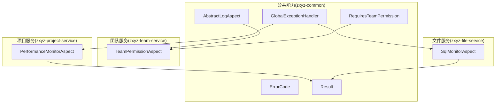
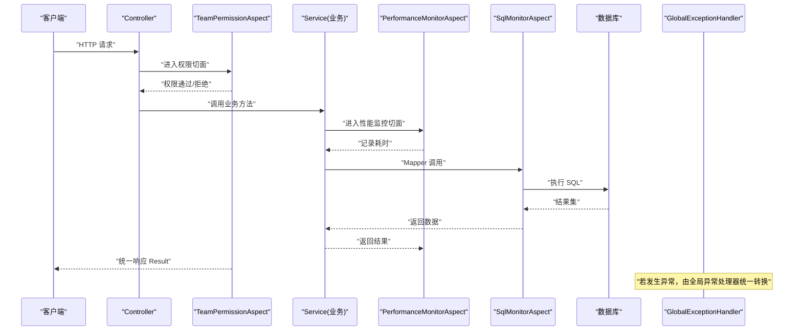
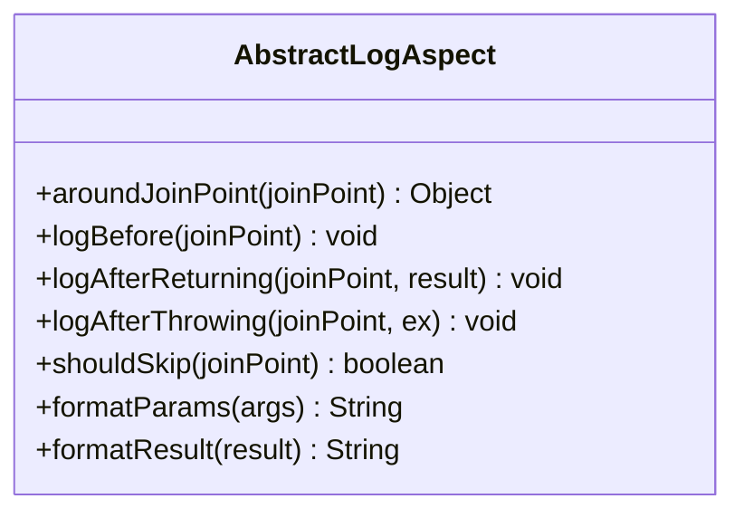
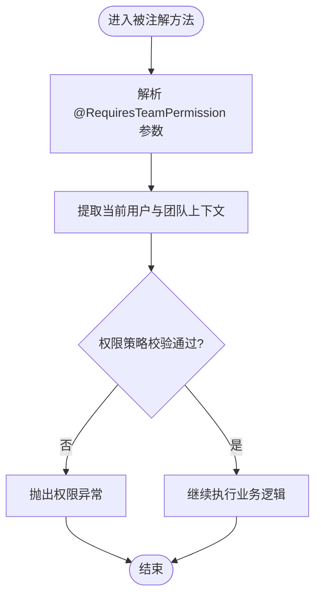
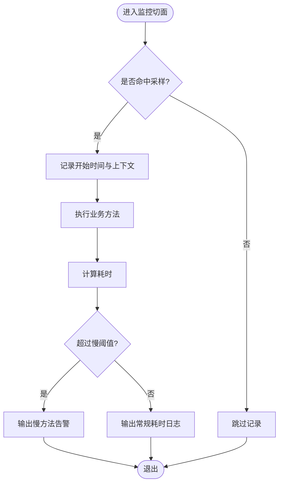
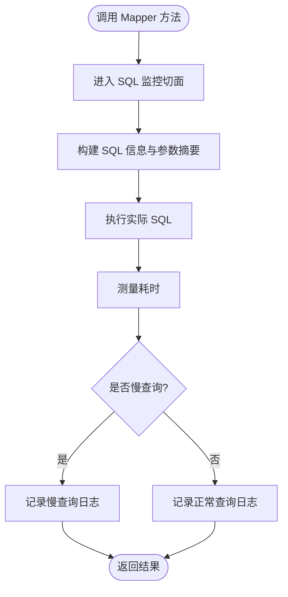
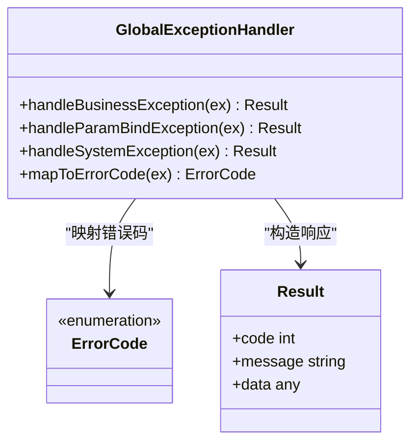
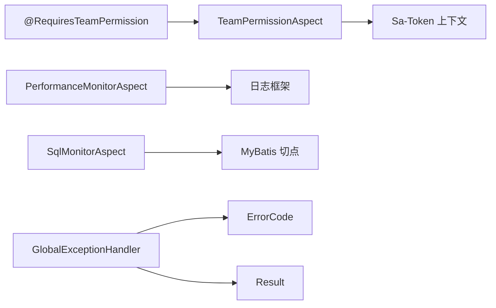

# AOP切面编程模式

<cite>
**本文引用的文件**   
- [AbstractLogAspect.java](file://ZXYZdatabaseBack/zxyz-common/src/main/java/uno/acloud/common/web/AbstractLogAspect.java)
- [RequiresTeamPermission.java](file://ZXYZdatabaseBack/zxyz-common/src/main/java/uno/acloud/common/permission/RequiresTeamPermission.java)
- [TeamPermissionAspect.java](file://ZXYZdatabaseBack/zxyz-team-service/src/main/java/uno/acloud/team/aop/TeamPermissionAspect.java)
- [PerformanceMonitorAspect.java](file://ZXYZdatabaseBack/zxyz-project-service/src/main/java/uno/acloud/project/aop/PerformanceMonitorAspect.java)
- [SqlMonitorAspect.java](file://ZXYZdatabaseBack/zxyz-file-service/src/main/java/uno/acloud/file/aop/SqlMonitorAspect.java)
- [GlobalExceptionHandler.java](file://ZXYZdatabaseBack/zxyz-common/src/main/java/uno/acloud/exception/GlobalExceptionHandler.java)
- [ErrorCode.java](file://ZXYZdatabaseBack/zxyz-common/src/main/java/uno/acloud/common/web/ErrorCode.java)
- [Result.java](file://ZXYZdatabaseBack/zxyz-common/src/main/java/uno/acloud/common/web/Result.java)
- [application.yml](file://ZXYZdatabaseBack/zxyz-project-service/src/main/resources/application.yml)
- [application.yml](file://ZXYZdatabaseBack/zxyz-file-service/src/main/resources/application.yml)
</cite>

## 目录
1. [简介](#简介)
2. [项目结构](#项目结构)
3. [核心组件](#核心组件)
4. [架构总览](#架构总览)
5. [详细组件分析](#详细组件分析)
6. [依赖关系分析](#依赖关系分析)
7. [性能考量](#性能考量)
8. [故障排查指南](#故障排查指南)
9. [结论](#结论)
10. [附录](#附录)

## 简介
本文件面向 ZXYZ 项目的 AOP（面向切面编程）实践，聚焦以下目标：
- 抽象日志切面 AbstractLogAspect 的设计与复用
- 权限验证切面：@RequiresTeamPermission 自定义注解的实现原理与使用
- 性能监控切面：方法执行时间统计、SQL 查询监控
- 异常处理切面：统一异常捕获与错误码转换
- 切面优先级、执行顺序、参数绑定等关键技术细节
- 自定义切面的开发指南与最佳实践

## 项目结构
AOP 相关能力分布在公共模块与各业务服务中：
- zxyz-common：通用切面基类、注解定义、全局异常处理器、统一响应模型
- zxyz-team-service：团队权限校验切面实现
- zxyz-project-service：性能监控切面实现
- zxyz-file-service：SQL 监控切面实现

图表来源
- [AbstractLogAspect.java](file://ZXYZdatabaseBack/zxyz-common/src/main/java/uno/acloud/common/web/AbstractLogAspect.java)
- [RequiresTeamPermission.java](file://ZXYZdatabaseBack/zxyz-common/src/main/java/uno/acloud/common/permission/RequiresTeamPermission.java)
- [TeamPermissionAspect.java](file://ZXYZdatabaseBack/zxyz-team-service/src/main/java/uno/acloud/team/aop/TeamPermissionAspect.java)
- [PerformanceMonitorAspect.java](file://ZXYZdatabaseBack/zxyz-project-service/src/main/java/uno/acloud/project/aop/PerformanceMonitorAspect.java)
- [SqlMonitorAspect.java](file://ZXYZdatabaseBack/zxyz-file-service/src/main/java/uno/acloud/file/aop/SqlMonitorAspect.java)
- [GlobalExceptionHandler.java](file://ZXYZdatabaseBack/zxyz-common/src/main/java/uno/acloud/exception/GlobalExceptionHandler.java)
- [ErrorCode.java](file://ZXYZdatabaseBack/zxyz-common/src/main/java/uno/acloud/common/web/ErrorCode.java)
- [Result.java](file://ZXYZdatabaseBack/zxyz-common/src/main/java/uno/acloud/common/web/Result.java)

章节来源
- [AbstractLogAspect.java](file://ZXYZdatabaseBack/zxyz-common/src/main/java/uno/acloud/common/web/AbstractLogAspect.java)
- [RequiresTeamPermission.java](file://ZXYZdatabaseBack/zxyz-common/src/main/java/uno/acloud/common/permission/RequiresTeamPermission.java)
- [TeamPermissionAspect.java](file://ZXYZdatabaseBack/zxyz-team-service/src/main/java/uno/acloud/team/aop/TeamPermissionAspect.java)
- [PerformanceMonitorAspect.java](file://ZXYZdatabaseBack/zxyz-project-service/src/main/java/uno/acloud/project/aop/PerformanceMonitorAspect.java)
- [SqlMonitorAspect.java](file://ZXYZdatabaseBack/zxyz-file-service/src/main/java/uno/acloud/file/aop/SqlMonitorAspect.java)
- [GlobalExceptionHandler.java](file://ZXYZdatabaseBack/zxyz-common/src/main/java/uno/acloud/exception/GlobalExceptionHandler.java)
- [ErrorCode.java](file://ZXYZdatabaseBack/zxyz-common/src/main/java/uno/acloud/common/web/ErrorCode.java)
- [Result.java](file://ZXYZdatabaseBack/zxyz-common/src/main/java/uno/acloud/common/web/Result.java)

## 核心组件
- 抽象日志切面 AbstractLogAspect：提供统一的请求入参、出参、耗时、异常等日志采集模板，供其他切面继承复用。
- 权限验证注解 @RequiresTeamPermission：用于标注需要团队维度权限校验的方法，配合 TeamPermissionAspect 完成鉴权逻辑。
- 性能监控切面 PerformanceMonitorAspect：对指定包或注解方法进行执行时长统计，支持阈值告警与采样策略。
- SQL 监控切面 SqlMonitorAspect：拦截 MyBatis Mapper 层调用，记录 SQL 语句、参数、耗时及慢查询标记。
- 全局异常处理器 GlobalExceptionHandler：统一捕获 Controller/Service 层异常，转换为标准 Result 响应并映射 ErrorCode。
- 错误码与响应模型：ErrorCode 定义错误码枚举；Result 作为统一返回体封装 code、message、data。

章节来源
- [AbstractLogAspect.java](file://ZXYZdatabaseBack/zxyz-common/src/main/java/uno/acloud/common/web/AbstractLogAspect.java)
- [RequiresTeamPermission.java](file://ZXYZdatabaseBack/zxyz-common/src/main/java/uno/acloud/common/permission/RequiresTeamPermission.java)
- [TeamPermissionAspect.java](file://ZXYZdatabaseBack/zxyz-team-service/src/main/java/uno/acloud/team/aop/TeamPermissionAspect.java)
- [PerformanceMonitorAspect.java](file://ZXYZdatabaseBack/zxyz-project-service/src/main/java/uno/acloud/project/aop/PerformanceMonitorAspect.java)
- [SqlMonitorAspect.java](file://ZXYZdatabaseBack/zxyz-file-service/src/main/java/uno/acloud/file/aop/SqlMonitorAspect.java)
- [GlobalExceptionHandler.java](file://ZXYZdatabaseBack/zxyz-common/src/main/java/uno/acloud/exception/GlobalExceptionHandler.java)
- [ErrorCode.java](file://ZXYZdatabaseBack/zxyz-common/src/main/java/uno/acloud/common/web/ErrorCode.java)
- [Result.java](file://ZXYZdatabaseBack/zxyz-common/src/main/java/uno/acloud/common/web/Result.java)

## 架构总览
下图展示了 AOP 切面在请求链路中的位置与协作关系：Controller → 权限切面 → 业务 Service → SQL 监控切面 → 数据库；同时，性能监控切面可横切任意方法，异常由全局处理器统一收敛。

图表来源
- [TeamPermissionAspect.java](file://ZXYZdatabaseBack/zxyz-team-service/src/main/java/uno/acloud/team/aop/TeamPermissionAspect.java)
- [PerformanceMonitorAspect.java](file://ZXYZdatabaseBack/zxyz-project-service/src/main/java/uno/acloud/project/aop/PerformanceMonitorAspect.java)
- [SqlMonitorAspect.java](file://ZXYZdatabaseBack/zxyz-file-service/src/main/java/uno/acloud/file/aop/SqlMonitorAspect.java)
- [GlobalExceptionHandler.java](file://ZXYZdatabaseBack/zxyz-common/src/main/java/uno/acloud/exception/GlobalExceptionHandler.java)

## 详细组件分析

### 抽象日志切面 AbstractLogAspect
- 设计要点
  - 提供 @Around 切点模板，统一采集入参、返回值、异常、耗时
  - 支持按包名或注解匹配切点，避免过度横切
  - 提供可重写钩子方法，便于子类扩展日志格式与过滤规则
- 关键能力
  - 参数脱敏与长度截断，防止敏感信息泄露与日志膨胀
  - 异常堆栈摘要输出，便于快速定位问题
  - 可配置开关，控制是否打印请求/响应体
- 复杂度与性能
  - 基于反射获取方法签名与注解，建议结合静态缓存减少开销
  - 大对象序列化需限制深度与字段，避免 GC 压力

图表来源
- [AbstractLogAspect.java](file://ZXYZdatabaseBack/zxyz-common/src/main/java/uno/acloud/common/web/AbstractLogAspect.java)

章节来源
- [AbstractLogAspect.java](file://ZXYZdatabaseBack/zxyz-common/src/main/java/uno/acloud/common/web/AbstractLogAspect.java)

### 权限验证切面与 @RequiresTeamPermission
- 自定义注解 @RequiresTeamPermission
  - 定义注解元数据，如 teamId、requiredRole 等校验条件
  - 支持默认值与必填校验
- TeamPermissionAspect 实现
  - 解析注解参数，从上下文提取当前用户与团队标识
  - 调用权限策略进行角色/资源校验，失败抛出统一异常
  - 与 Sa-Token 集成，确保会话有效性与令牌合法性
- 适用场景
  - 团队级资源访问控制（成员、项目、文件等）
  - 细粒度操作权限（读/写/管理）

图表来源
- [RequiresTeamPermission.java](file://ZXYZdatabaseBack/zxyz-common/src/main/java/uno/acloud/common/permission/RequiresTeamPermission.java)
- [TeamPermissionAspect.java](file://ZXYZdatabaseBack/zxyz-team-service/src/main/java/uno/acloud/team/aop/TeamPermissionAspect.java)

章节来源
- [RequiresTeamPermission.java](file://ZXYZdatabaseBack/zxyz-common/src/main/java/uno/acloud/common/permission/RequiresTeamPermission.java)
- [TeamPermissionAspect.java](file://ZXYZdatabaseBack/zxyz-team-service/src/main/java/uno/acloud/team/aop/TeamPermissionAspect.java)

### 性能监控切面 PerformanceMonitorAspect
- 功能特性
  - 针对指定包或注解方法进行执行时长统计
  - 支持阈值告警（慢方法）、采样率控制（降低日志量）
  - 输出结构化日志：方法签名、入参摘要、耗时、线程、TraceId
- 配置项
  - 监控开关、采样比例、慢阈值、忽略包列表
- 注意事项
  - 避免对高频短方法全量采样，采用概率采样
  - 大对象参数需脱敏与截断，防止日志过大

图表来源
- [PerformanceMonitorAspect.java](file://ZXYZdatabaseBack/zxyz-project-service/src/main/java/uno/acloud/project/aop/PerformanceMonitorAspect.java)
- [application.yml](file://ZXYZdatabaseBack/zxyz-project-service/src/main/resources/application.yml)

章节来源
- [PerformanceMonitorAspect.java](file://ZXYZdatabaseBack/zxyz-project-service/src/main/java/uno/acloud/project/aop/PerformanceMonitorAspect.java)
- [application.yml](file://ZXYZdatabaseBack/zxyz-project-service/src/main/resources/application.yml)

### SQL 监控切面 SqlMonitorAspect
- 功能特性
  - 拦截 MyBatis Mapper 接口方法，记录 SQL 语句、参数、耗时
  - 支持慢 SQL 标记与聚合统计
  - 可选参数脱敏（如密码、Token）
- 集成方式
  - 通过 Spring AOP 切点表达式匹配 Mapper 包路径
  - 与日志框架集成，输出结构化 SQL 审计日志
- 性能影响
  - 参数序列化与 SQL 格式化存在额外开销，建议开启采样或限流

图表来源
- [SqlMonitorAspect.java](file://ZXYZdatabaseBack/zxyz-file-service/src/main/java/uno/acloud/file/aop/SqlMonitorAspect.java)
- [application.yml](file://ZXYZdatabaseBack/zxyz-file-service/src/main/resources/application.yml)

章节来源
- [SqlMonitorAspect.java](file://ZXYZdatabaseBack/zxyz-file-service/src/main/java/uno/acloud/file/aop/SqlMonitorAspect.java)
- [application.yml](file://ZXYZdatabaseBack/zxyz-file-service/src/main/resources/application.yml)

### 全局异常处理器 GlobalExceptionHandler
- 职责
  - 统一捕获 Controller/Service 层抛出的业务异常与系统异常
  - 将异常转换为标准 Result<T> 响应，包含 code、message、data
  - 根据异常类型映射到 ErrorCode 枚举，保证错误码一致性
- 常见异常类型
  - 业务校验异常、权限异常、参数绑定异常、第三方调用异常
- 最佳实践
  - 避免在切面中吞异常，尽量向上抛出并由处理器统一处理
  - 敏感信息不写入 message，必要时走审计日志

图表来源
- [GlobalExceptionHandler.java](file://ZXYZdatabaseBack/zxyz-common/src/main/java/uno/acloud/exception/GlobalExceptionHandler.java)
- [ErrorCode.java](file://ZXYZdatabaseBack/zxyz-common/src/main/java/uno/acloud/common/web/ErrorCode.java)
- [Result.java](file://ZXYZdatabaseBack/zxyz-common/src/main/java/uno/acloud/common/web/Result.java)

章节来源
- [GlobalExceptionHandler.java](file://ZXYZdatabaseBack/zxyz-common/src/main/java/uno/acloud/exception/GlobalExceptionHandler.java)
- [ErrorCode.java](file://ZXYZdatabaseBack/zxyz-common/src/main/java/uno/acloud/common/web/ErrorCode.java)
- [Result.java](file://ZXYZdatabaseBack/zxyz-common/src/main/java/uno/acloud/common/web/Result.java)

## 依赖关系分析
- 组件耦合
  - TeamPermissionAspect 依赖 @RequiresTeamPermission 注解与权限策略
  - PerformanceMonitorAspect 与 SqlMonitorAspect 依赖日志框架与配置中心
  - GlobalExceptionHandler 依赖 ErrorCode 与 Result 统一模型
- 外部依赖
  - Sa-Token 用于会话与认证上下文
  - MyBatis 用于 SQL 监控切点匹配
  - 日志框架（如 SLF4J）用于结构化输出

图表来源
- [RequiresTeamPermission.java](file://ZXYZdatabaseBack/zxyz-common/src/main/java/uno/acloud/common/permission/RequiresTeamPermission.java)
- [TeamPermissionAspect.java](file://ZXYZdatabaseBack/zxyz-team-service/src/main/java/uno/acloud/team/aop/TeamPermissionAspect.java)
- [PerformanceMonitorAspect.java](file://ZXYZdatabaseBack/zxyz-project-service/src/main/java/uno/acloud/project/aop/PerformanceMonitorAspect.java)
- [SqlMonitorAspect.java](file://ZXYZdatabaseBack/zxyz-file-service/src/main/java/uno/acloud/file/aop/SqlMonitorAspect.java)
- [GlobalExceptionHandler.java](file://ZXYZdatabaseBack/zxyz-common/src/main/java/uno/acloud/exception/GlobalExceptionHandler.java)
- [ErrorCode.java](file://ZXYZdatabaseBack/zxyz-common/src/main/java/uno/acloud/common/web/ErrorCode.java)
- [Result.java](file://ZXYZdatabaseBack/zxyz-common/src/main/java/uno/acloud/common/web/Result.java)

章节来源
- [RequiresTeamPermission.java](file://ZXYZdatabaseBack/zxyz-common/src/main/java/uno/acloud/common/permission/RequiresTeamPermission.java)
- [TeamPermissionAspect.java](file://ZXYZdatabaseBack/zxyz-team-service/src/main/java/uno/acloud/team/aop/TeamPermissionAspect.java)
- [PerformanceMonitorAspect.java](file://ZXYZdatabaseBack/zxyz-project-service/src/main/java/uno/acloud/project/aop/PerformanceMonitorAspect.java)
- [SqlMonitorAspect.java](file://ZXYZdatabaseBack/zxyz-file-service/src/main/java/uno/acloud/file/aop/SqlMonitorAspect.java)
- [GlobalExceptionHandler.java](file://ZXYZdatabaseBack/zxyz-common/src/main/java/uno/acloud/exception/GlobalExceptionHandler.java)
- [ErrorCode.java](file://ZXYZdatabaseBack/zxyz-common/src/main/java/uno/acloud/common/web/ErrorCode.java)
- [Result.java](file://ZXYZdatabaseBack/zxyz-common/src/main/java/uno/acloud/common/web/Result.java)

## 性能考量
- 切面执行顺序
  - 多个切面作用于同一方法时，Spring AOP 默认按声明顺序执行；可通过 @Order 或实现 Ordered 接口明确优先级
  - 建议将“轻量且必要”的切面（如权限）置于外层，“重计算”的切面（如日志、监控）内层或采样执行
- 参数绑定与序列化
  - 大对象参数应限制序列化深度与字段数量，避免内存抖动
  - 对敏感字段进行脱敏处理，防止日志泄露
- 采样与限流
  - 对高频方法启用概率采样（如 1%~10%），降低日志与 CPU 开销
  - 慢查询与慢方法设置阈值，仅记录超阈值的样本
- 线程与上下文
  - 切面中避免阻塞操作，保持异步化与快速返回
  - 合理传递 TraceId，便于跨切面链路追踪

[本节为通用指导，不直接分析具体文件]

## 故障排查指南
- 常见问题
  - 权限校验失败：检查 @RequiresTeamPermission 参数是否正确，确认用户团队上下文是否加载
  - 日志缺失：确认切点表达式是否匹配目标方法，检查日志级别与采样配置
  - SQL 未记录：确认 Mapper 包路径是否在切点范围内，检查 MyBatis 代理是否生效
  - 异常未统一：确认异常是否被切面吞掉，确保由 GlobalExceptionHandler 统一处理
- 定位步骤
  - 查看切面日志与慢查询日志，定位耗时热点
  - 检查全局异常处理器输出的 code 与 message，对照 ErrorCode 枚举
  - 使用链路追踪 ID 串联 Controller → 切面 → Service → SQL 调用链

章节来源
- [GlobalExceptionHandler.java](file://ZXYZdatabaseBack/zxyz-common/src/main/java/uno/acloud/exception/GlobalExceptionHandler.java)
- [ErrorCode.java](file://ZXYZdatabaseBack/zxyz-common/src/main/java/uno/acloud/common/web/ErrorCode.java)
- [PerformanceMonitorAspect.java](file://ZXYZdatabaseBack/zxyz-project-service/src/main/java/uno/acloud/project/aop/PerformanceMonitorAspect.java)
- [SqlMonitorAspect.java](file://ZXYZdatabaseBack/zxyz-file-service/src/main/java/uno/acloud/file/aop/SqlMonitorAspect.java)

## 结论
ZXYZ 项目的 AOP 切面体系以抽象日志切面为基础，结合权限、性能、SQL 监控与全局异常处理，形成横切能力的标准化方案。通过注解驱动与配置化开关，既保证了可观测性，又兼顾了性能与可维护性。建议在新增切面时遵循本文的最佳实践，确保一致性与稳定性。

[本节为总结性内容，不直接分析具体文件]

## 附录
- 自定义切面开发指南
  - 明确切点范围：优先使用注解或精确包路径，避免宽泛匹配
  - 控制日志体量：参数脱敏、长度截断、采样输出
  - 异常处理：不在切面中吞异常，统一交由全局处理器
  - 可配置化：通过 application.yml 或配置中心动态调整开关与阈值
- 最佳实践清单
  - 使用 @Order 明确切面顺序，避免隐式行为
  - 对慢方法与慢 SQL 设置阈值，定期复盘优化
  - 保持切面无状态，避免共享可变状态
  - 单元测试覆盖切点匹配与边界条件

[本节为通用指导，不直接分析具体文件]