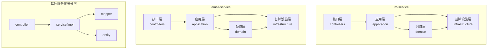
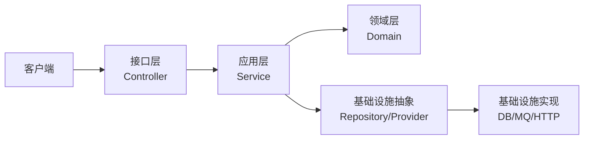
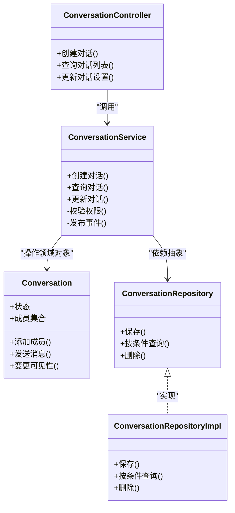
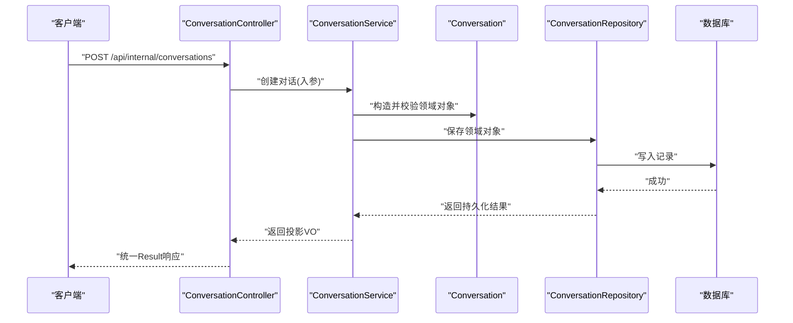
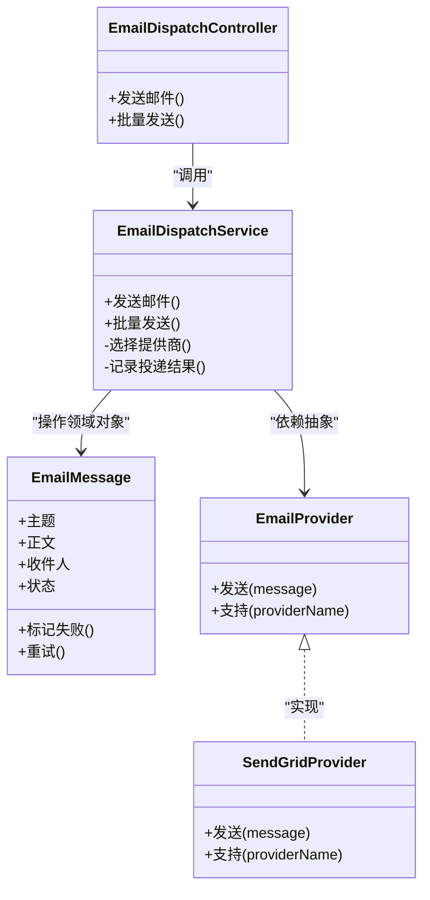
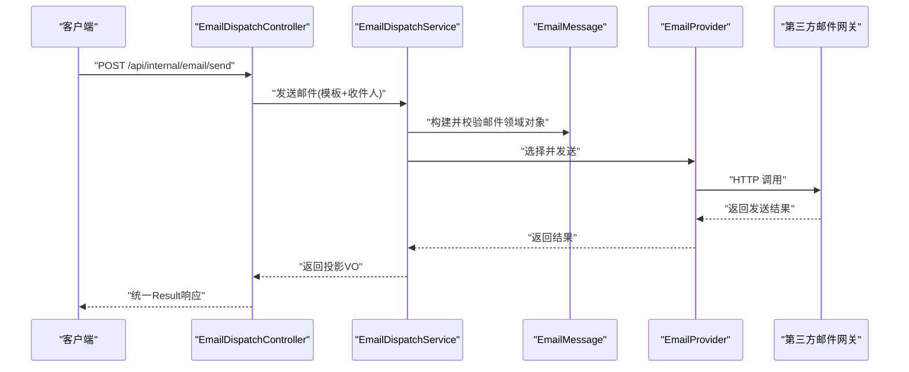
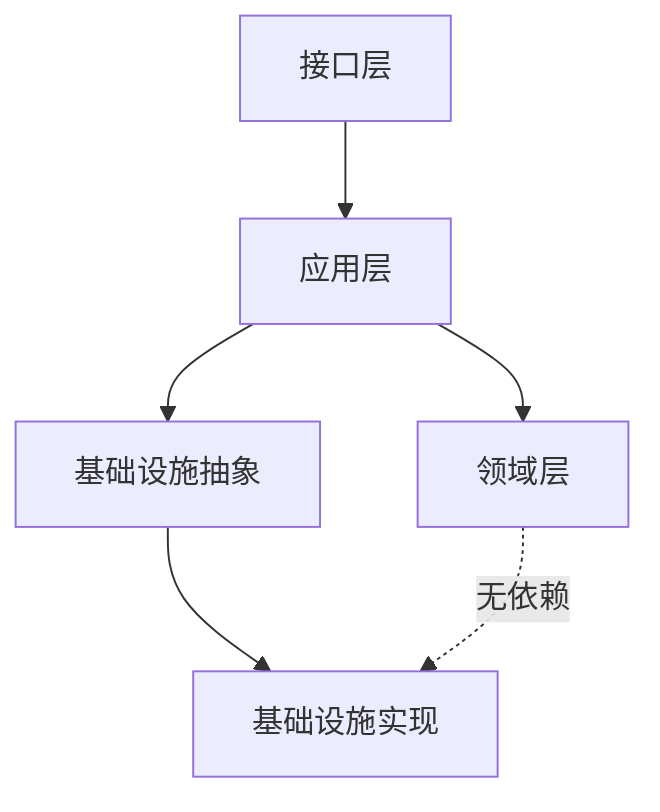

# DDD分层架构

<cite>
**本文引用的文件**   
- [zxyz-im-service 应用入口](file://ZXYZdatabaseBack/zxyz-im-service/src/main/java/uno/acloud/im/ZxyzImApplication.java)
- [im-service 控制器示例](file://ZXYZdatabaseBack/zxyz-im-service/src/main/java/uno/acloud/im/controller/ConversationController.java)
- [im-service 应用层 ConversationService](file://ZXYZdatabaseBack/zxyz-im-service/src/main/java/uno/acloud/im/application/ConversationService.java)
- [im-service 领域模型 Conversation](file://ZXYZdatabaseBack/zxyz-im-service/src/main/java/uno/acloud/im/domain/model/Conversation.java)
- [im-service 基础设施实现](file://ZXYZdatabaseBack/zxyz-im-service/src/main/java/uno/acloud/im/infrastructure/repository/ConversationRepositoryImpl.java)
- [zxyz-email-service 应用入口](file://ZXYZdatabaseBack/zxyz-email-service/src/main/java/uno/acloud/email/ZxyzEmailApplication.java)
- [email-service 控制器示例](file://ZXYZdatabaseBack/zxyz-email-service/src/main/java/uno/acloud/email/controller/EmailDispatchController.java)
- [email-service 应用层 EmailDispatchService](file://ZXYZdatabaseBack/zxyz-email-service/src/main/java/uno/acloud/email/application/EmailDispatchService.java)
- [email-service 领域模型 EmailMessage](file://ZXYZdatabaseBack/zxyz-email-service/src/main/java/uno/acloud/email/domain/model/EmailMessage.java)
- [email-service 基础设施实现](file://ZXYZdatabaseBack/zxyz-email-service/src/main/java/uno/acloud/email/infrastructure/provider/SendGridProvider.java)
- [传统分层 service 示例（project-service）](file://ZXYZdatabaseBack/zxyz-project-service/src/main/java/uno/acloud/project/service/ProjectService.java)
- [传统分层 mapper 示例（project-service）](file://ZXYZdatabaseBack/zxyz-project-service/src/main/java/uno/acloud/project/mapper/ProjectMapper.java)
- [传统分层 entity 示例（project-service）](file://ZXYZdatabaseBack/zxyz-project-service/src/main/java/uno/acloud/project/entity/Project.java)
</cite>

## 目录
1. [引言](#引言)
2. [项目结构](#项目结构)
3. [核心组件](#核心组件)
4. [架构总览](#架构总览)
5. [详细组件分析](#详细组件分析)
6. [依赖关系分析](#依赖关系分析)
7. [性能考量](#性能考量)
8. [故障排查指南](#故障排查指南)
9. [结论](#结论)
10. [附录](#附录)

## 引言
本文件面向 ZXYZ 项目的后端微服务，聚焦于 DDD 分层架构在 im-service 与 email-service 中的落地实践。文档以“接口层 → 应用层 → 领域层 → 基础设施层”为主线，明确各层职责边界、数据流向与协作方式，并通过两个典型服务的具体实现对比传统 controller → service → mapper 分层，帮助读者理解两种风格的适用场景与取舍。

## 项目结构
ZXYZ 采用多模块 Maven 工程，后端包含多个独立微服务。其中：
- im-service 与 email-service 采用 DDD 四层架构（interfaces → application → domain → infrastructure）。
- 其余服务（如 project-service、team-service 等）采用传统分层（controller → service/impl → mapper → entity）。

图表来源
- [zxyz-im-service 应用入口](file://ZXYZdatabaseBack/zxyz-im-service/src/main/java/uno/acloud/im/ZxyzImApplication.java)
- [zxyz-email-service 应用入口](file://ZXYZdatabaseBack/zxyz-email-service/src/main/java/uno/acloud/email/ZxyzEmailApplication.java)

章节来源
- [zxyz-im-service 应用入口](file://ZXYZdatabaseBack/zxyz-im-service/src/main/java/uno/acloud/im/ZxyzImApplication.java)
- [zxyz-email-service 应用入口](file://ZXYZdatabaseBack/zxyz-email-service/src/main/java/uno/acloud/email/ZxyzEmailApplication.java)

## 核心组件
- 接口层（interfaces/controllers）
  - 职责：解析 HTTP 请求、参数校验、鉴权上下文注入、统一响应封装；不承载业务逻辑。
  - 典型类：ConversationController、EmailDispatchController。
- 应用层（application）
  - 职责：编排业务流程、协调领域对象与基础设施能力、事务边界管理、跨服务调用编排。
  - 典型类：ConversationService、EmailDispatchService。
- 领域层（domain）
  - 职责：封装核心业务实体、领域规则与行为、不变量校验；不包含技术细节。
  - 典型类：Conversation、EmailMessage。
- 基础设施层（infrastructure）
  - 职责：提供持久化、外部系统接入、消息队列、缓存等技术实现；对上层暴露抽象接口。
  - 典型类：ConversationRepositoryImpl、SendGridProvider。

章节来源
- [im-service 控制器示例](file://ZXYZdatabaseBack/zxyz-im-service/src/main/java/uno/acloud/im/controller/ConversationController.java)
- [im-service 应用层 ConversationService](file://ZXYZdatabaseBack/zxyz-im-service/src/main/java/uno/acloud/im/application/ConversationService.java)
- [im-service 领域模型 Conversation](file://ZXYZdatabaseBack/zxyz-im-service/src/main/java/uno/acloud/im/domain/model/Conversation.java)
- [im-service 基础设施实现](file://ZXYZdatabaseBack/zxyz-im-service/src/main/java/uno/acloud/im/infrastructure/repository/ConversationRepositoryImpl.java)
- [email-service 控制器示例](file://ZXYZdatabaseBack/zxyz-email-service/src/main/java/uno/acloud/email/controller/EmailDispatchController.java)
- [email-service 应用层 EmailDispatchService](file://ZXYZdatabaseBack/zxyz-email-service/src/main/java/uno/acloud/email/application/EmailDispatchService.java)
- [email-service 领域模型 EmailMessage](file://ZXYZdatabaseBack/zxyz-email-service/src/main/java/uno/acloud/email/domain/model/EmailMessage.java)
- [email-service 基础设施实现](file://ZXYZdatabaseBack/zxyz-email-service/src/main/java/uno/acloud/email/infrastructure/provider/SendGridProvider.java)

## 架构总览
DDD 四层的依赖方向严格单向：interfaces → application → domain，且 application 通过抽象访问 infrastructure；domain 不依赖任何下层或外部技术。

图表来源
- [im-service 应用层 ConversationService](file://ZXYZdatabaseBack/zxyz-im-service/src/main/java/uno/acloud/im/application/ConversationService.java)
- [email-service 应用层 EmailDispatchService](file://ZXYZdatabaseBack/zxyz-email-service/src/main/java/uno/acloud/email/application/EmailDispatchService.java)

## 详细组件分析

### im-service：对话与会话的 DDD 实现
- 接口层
  - 接收创建/查询/更新对话的请求，进行参数校验与权限检查，调用应用层。
- 应用层
  - 编排对话生命周期：加载/创建领域对象、执行业务规则、调用仓储持久化、发布领域事件。
- 领域层
  - 定义对话实体与状态机、成员权限规则、消息聚合根约束。
- 基础设施层
  - 仓储实现负责 MySQL 读写、索引优化、分页与投影映射；对外暴露 Repository 接口。

图表来源
- [im-service 控制器示例](file://ZXYZdatabaseBack/zxyz-im-service/src/main/java/uno/acloud/im/controller/ConversationController.java)
- [im-service 应用层 ConversationService](file://ZXYZdatabaseBack/zxyz-im-service/src/main/java/uno/acloud/im/application/ConversationService.java)
- [im-service 领域模型 Conversation](file://ZXYZdatabaseBack/zxyz-im-service/src/main/java/uno/acloud/im/domain/model/Conversation.java)
- [im-service 基础设施实现](file://ZXYZdatabaseBack/zxyz-im-service/src/main/java/uno/acloud/im/infrastructure/repository/ConversationRepositoryImpl.java)

#### 关键流程时序（创建对话）

图表来源
- [im-service 控制器示例](file://ZXYZdatabaseBack/zxyz-im-service/src/main/java/uno/acloud/im/controller/ConversationController.java)
- [im-service 应用层 ConversationService](file://ZXYZdatabaseBack/zxyz-im-service/src/main/java/uno/acloud/im/application/ConversationService.java)
- [im-service 基础设施实现](file://ZXYZdatabaseBack/zxyz-im-service/src/main/java/uno/acloud/im/infrastructure/repository/ConversationRepositoryImpl.java)

章节来源
- [im-service 控制器示例](file://ZXYZdatabaseBack/zxyz-im-service/src/main/java/uno/acloud/im/controller/ConversationController.java)
- [im-service 应用层 ConversationService](file://ZXYZdatabaseBack/zxyz-im-service/src/main/java/uno/acloud/im/application/ConversationService.java)
- [im-service 领域模型 Conversation](file://ZXYZdatabaseBack/zxyz-im-service/src/main/java/uno/acloud/im/domain/model/Conversation.java)
- [im-service 基础设施实现](file://ZXYZdatabaseBack/zxyz-im-service/src/main/java/uno/acloud/im/infrastructure/repository/ConversationRepositoryImpl.java)

### email-service：邮件分发的 DDD 实现
- 接口层
  - 接收邮件发送请求、模板渲染参数、收件人列表，调用应用层。
- 应用层
  - 编排发送流程：构建领域消息、选择提供商、执行发送、记录投递结果与重试策略。
- 领域层
  - 定义 EmailMessage 实体、发送状态、失败重试规则、模板变量绑定。
- 基础设施层
  - 邮件提供商抽象与实现（如 SendGridProvider），负责 HTTP 调用、签名、限流与错误处理。

图表来源
- [email-service 控制器示例](file://ZXYZdatabaseBack/zxyz-email-service/src/main/java/uno/acloud/email/controller/EmailDispatchController.java)
- [email-service 应用层 EmailDispatchService](file://ZXYZdatabaseBack/zxyz-email-service/src/main/java/uno/acloud/email/application/EmailDispatchService.java)
- [email-service 领域模型 EmailMessage](file://ZXYZdatabaseBack/zxyz-email-service/src/main/java/uno/acloud/email/domain/model/EmailMessage.java)
- [email-service 基础设施实现](file://ZXYZdatabaseBack/zxyz-email-service/src/main/java/uno/acloud/email/infrastructure/provider/SendGridProvider.java)

#### 关键流程时序（发送邮件）

图表来源
- [email-service 控制器示例](file://ZXYZdatabaseBack/zxyz-email-service/src/main/java/uno/acloud/email/controller/EmailDispatchController.java)
- [email-service 应用层 EmailDispatchService](file://ZXYZdatabaseBack/zxyz-email-service/src/main/java/uno/acloud/email/application/EmailDispatchService.java)
- [email-service 基础设施实现](file://ZXYZdatabaseBack/zxyz-email-service/src/main/java/uno/acloud/email/infrastructure/provider/SendGridProvider.java)

章节来源
- [email-service 控制器示例](file://ZXYZdatabaseBack/zxyz-email-service/src/main/java/uno/acloud/email/controller/EmailDispatchController.java)
- [email-service 应用层 EmailDispatchService](file://ZXYZdatabaseBack/zxyz-email-service/src/main/java/uno/acloud/email/application/EmailDispatchService.java)
- [email-service 领域模型 EmailMessage](file://ZXYZdatabaseBack/zxyz-email-service/src/main/java/uno/acloud/email/domain/model/EmailMessage.java)
- [email-service 基础设施实现](file://ZXYZdatabaseBack/zxyz-email-service/src/main/java/uno/acloud/email/infrastructure/provider/SendGridProvider.java)

### 与传统 controller → service → mapper 分层的区别
- 关注点分离
  - DDD：领域层表达业务本质，应用层编排流程，基础设施隐藏技术细节。
  - 传统：service 常混合业务与技术细节，mapper 仅做数据映射。
- 可测试性与演进
  - DDD：领域对象可独立单元测试；基础设施通过接口替换，便于模拟。
  - 传统：测试常需依赖数据库或外部服务，隔离成本高。
- 复杂业务建模
  - DDD：适合强规则、状态机、聚合边界的场景（如 IM 会话、邮件分发）。
  - 传统：CRUD 为主、规则简单的场景更高效。

章节来源
- [传统分层 service 示例（project-service）](file://ZXYZdatabaseBack/zxyz-project-service/src/main/java/uno/acloud/project/service/ProjectService.java)
- [传统分层 mapper 示例（project-service）](file://ZXYZdatabaseBack/zxyz-project-service/src/main/java/uno/acloud/project/mapper/ProjectMapper.java)
- [传统分层 entity 示例（project-service）](file://ZXYZdatabaseBack/zxyz-project-service/src/main/java/uno/acloud/project/entity/Project.java)

## 依赖关系分析
- 依赖方向
  - interfaces 依赖 application；application 依赖 domain 与 infrastructure 抽象；domain 不依赖任何下层。
- 耦合与内聚
  - 领域层高内聚、低耦合；应用层通过接口降低与基础设施的耦合；接口层仅关注协议与契约。
- 外部依赖
  - 数据库、第三方邮件网关、消息队列等均在基础设施层实现，通过抽象向上暴露。

图表来源
- [im-service 应用层 ConversationService](file://ZXYZdatabaseBack/zxyz-im-service/src/main/java/uno/acloud/im/application/ConversationService.java)
- [email-service 应用层 EmailDispatchService](file://ZXYZdatabaseBack/zxyz-email-service/src/main/java/uno/acloud/email/application/EmailDispatchService.java)

章节来源
- [im-service 应用层 ConversationService](file://ZXYZdatabaseBack/zxyz-im-service/src/main/java/uno/acloud/im/application/ConversationService.java)
- [email-service 应用层 EmailDispatchService](file://ZXYZdatabaseBack/zxyz-email-service/src/main/java/uno/acloud/email/application/EmailDispatchService.java)

## 性能考量
- 领域对象建模
  - 合理划分聚合根与值对象，减少不必要的关联查询与对象图膨胀。
- 仓储与投影
  - 使用投影 VO 而非胖 DTO，避免全表字段传输；分页与索引设计要匹配查询模式。
- 异步与重试
  - 邮件发送等耗时操作建议异步化，结合幂等与重试策略提升可靠性。
- 缓存与限流
  - 热点配置与字典数据可引入缓存；对外部网关调用增加限流与熔断。

[本节为通用指导，无需引用具体文件]

## 故障排查指南
- 常见问题定位
  - 接口层：参数校验失败、鉴权异常、统一响应码解读。
  - 应用层：事务回滚、跨服务调用超时、编排顺序错误。
  - 领域层：不变量校验失败、状态转换非法。
  - 基础设施层：数据库连接池耗尽、第三方 API 限流、网络抖动。
- 日志与追踪
  - 建议在应用层关键路径埋点，输出必要上下文（用户ID、会话ID、消息ID）。
- 快速恢复
  - 对第三方依赖启用降级与熔断；对消息队列启用死信队列与补偿任务。

章节来源
- [im-service 应用层 ConversationService](file://ZXYZdatabaseBack/zxyz-im-service/src/main/java/uno/acloud/im/application/ConversationService.java)
- [email-service 应用层 EmailDispatchService](file://ZXYZdatabaseBack/zxyz-email-service/src/main/java/uno/acloud/email/application/EmailDispatchService.java)

## 结论
ZXYZ 在 im-service 与 email-service 中采用 DDD 分层，有效提升了复杂业务的可维护性与可测试性。与传统分层相比，DDD 更适合强规则与状态复杂的场景；对于简单 CRUD 场景，传统分层仍具效率优势。建议在团队内统一分层规范，明确各层职责与依赖方向，配合良好的接口契约与测试策略，保障系统的长期演进。

[本节为总结性内容，无需引用具体文件]

## 附录
- 术语对照
  - 接口层：controllers/interfaces
  - 应用层：application services
  - 领域层：domain models/entities
  - 基础设施层：infrastructure implementations
- 最佳实践清单
  - 领域对象只表达业务不变量与行为
  - 应用层只做编排与事务控制
  - 基础设施通过接口抽象，便于替换与测试
  - 接口层保持薄，专注协议与契约

[本节为补充信息，无需引用具体文件]