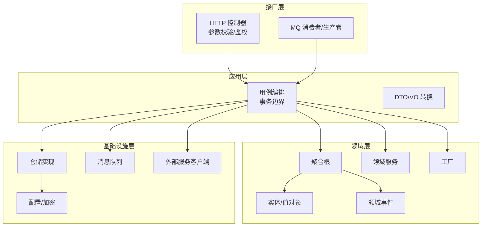
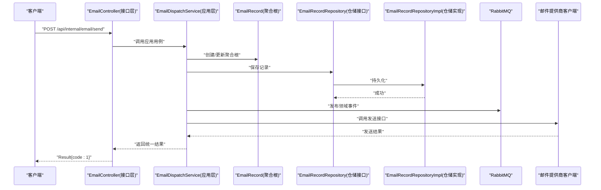
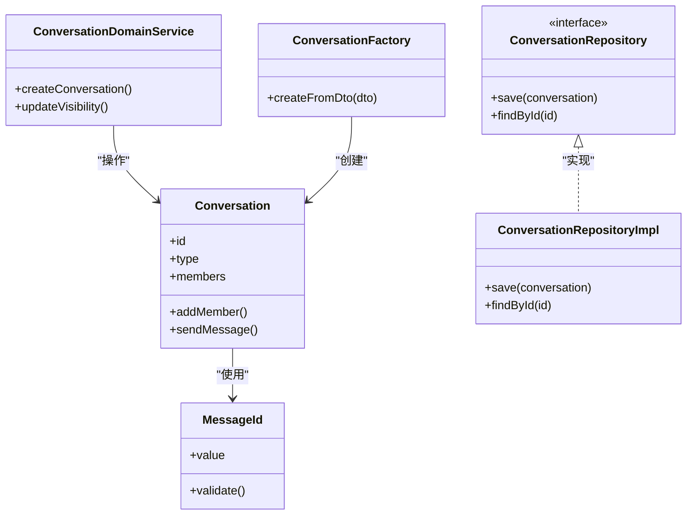
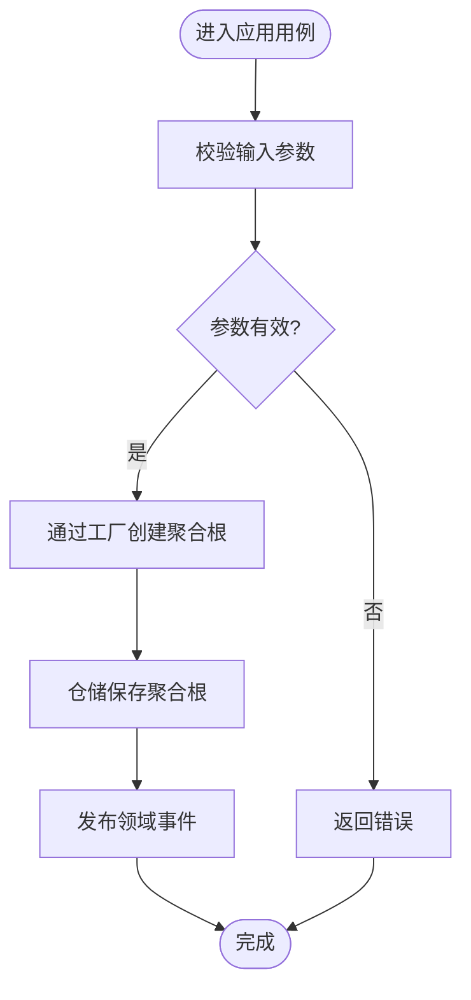
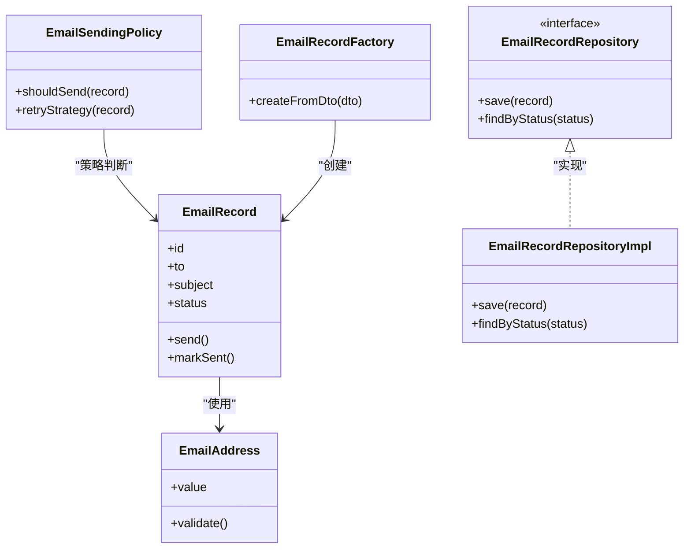
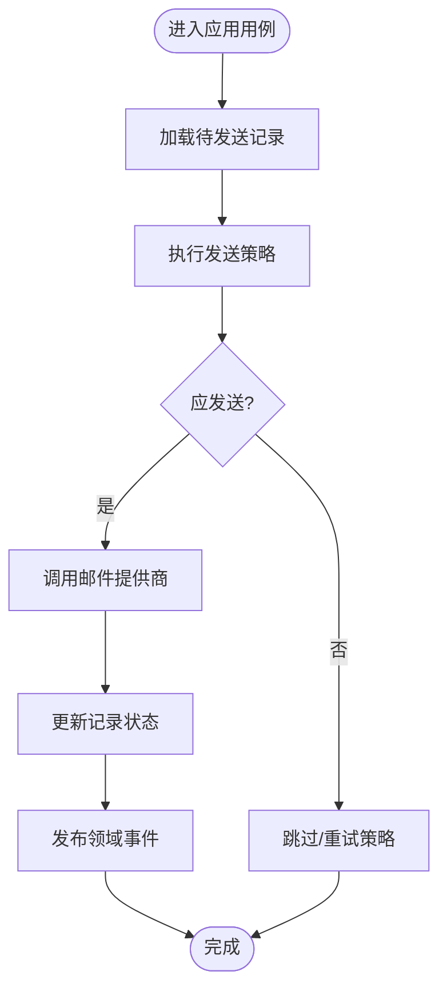
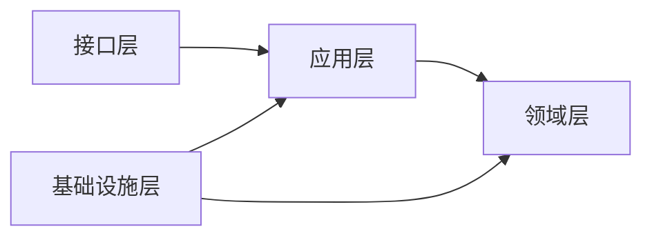

# DDD领域驱动设计

<cite>
**本文引用的文件**   
- [zxyz-im-service 应用入口](file://ZXYZdatabaseBack/zxyz-im-service/src/main/java/uno/acloud/im/ZxyzImApplication.java)
- [zxyz-email-service 应用入口](file://ZXYZdatabaseBack/zxyz-email-service/src/main/java/uno/acloud/email/ZxyzEmailApplication.java)
- [im-service 控制器示例](file://ZXYZdatabaseBack/zxyz-im-service/src/main/java/uno/acloud/im/controller/ConversationController.java)
- [im-service 应用服务示例](file://ZXYZdatabaseBack/zxyz-im-service/src/main/java/uno/acloud/im/application/ConversationAppService.java)
- [im-service 聚合根示例](file://ZXYZdatabaseBack/zxyz-im-service/src/main/java/uno/acloud/im/domain/conversation/Conversation.java)
- [im-service 值对象示例](file://ZXYZdatabaseBack/zxyz-im-service/src/main/java/uno/acloud/im/domain/conversation/MessageId.java)
- [im-service 领域服务示例](file://ZXYZdatabaseBack/zxyz-im-service/src/main/java/uno/acloud/im/domain/service/ConversationDomainService.java)
- [im-service 仓储接口示例](file://ZXYZdatabaseBack/zxyz-im-service/src/main/java/uno/acloud/im/infrastructure/repository/ConversationRepository.java)
- [im-service 仓储实现示例](file://ZXYZdatabaseBack/zxyz-im-service/src/main/java/uno/acloud/im/infrastructure/repository/impl/ConversationRepositoryImpl.java)
- [im-service 工厂示例](file://ZXYZdatabaseBack/zxyz-im-service/src/main/java/uno/acloud/im/domain/factory/ConversationFactory.java)
- [email-service 控制器示例](file://ZXYZdatabaseBack/zxyz-email-service/src/main/java/uno/acloud/email/controller/EmailController.java)
- [email-service 应用服务示例](file://ZXYZdatabaseBack/zxyz-email-service/src/main/java/uno/acloud/email/application/EmailDispatchService.java)
- [email-service 聚合根示例](file://ZXYZdatabaseBack/zxyz-email-service/src/main/java/uno/acloud/email/domain/email/EmailRecord.java)
- [email-service 值对象示例](file://ZXYZdatabaseBack/zxyz-email-service/src/main/java/uno/acloud/email/domain/email/EmailAddress.java)
- [email-service 领域服务示例](file://ZXYZdatabaseBack/zxyz-email-service/src/main/java/uno/acloud/email/domain/service/EmailSendingPolicy.java)
- [email-service 仓储接口示例](file://ZXYZdatabaseBack/zxyz-email-service/src/main/java/uno/acloud/email/infrastructure/repository/EmailRecordRepository.java)
- [email-service 仓储实现示例](file://ZXYZdatabaseBack/zxyz-email-service/src/main/java/uno/acloud/email/infrastructure/repository/impl/EmailRecordRepositoryImpl.java)
- [email-service 工厂示例](file://ZXYZdatabaseBack/zxyz-email-service/src/main/java/uno/acloud/email/domain/factory/EmailRecordFactory.java)
- [项目架构说明文档](file://docs/architecture.md)
- [基础设施说明文档](file://docs/infrastructure.md)
</cite>

## 目录
1. [引言](#引言)
2. [项目结构](#项目结构)
3. [核心组件](#核心组件)
4. [架构总览](#架构总览)
5. [详细组件分析](#详细组件分析)
6. [依赖分析](#依赖分析)
7. [性能考虑](#性能考虑)
8. [故障排查指南](#故障排查指南)
9. [结论](#结论)
10. [附录](#附录)

## 引言
本文件面向 ZXYZ 项目的领域驱动设计（DDD）实践，重点阐述 im-service 与 email-service 的 DDD 分层：interfaces → application → domain → infrastructure。通过这两个服务的实体、值对象、聚合根、领域服务、领域事件、仓储抽象与工厂模式，展示如何在微服务中落地 DDD，并对比与传统分层的差异及适用场景。

## 项目结构
ZXYZ 采用多模块 Maven 工程，后端包含多个独立服务。其中 im-service 与 email-service 采用 DDD 分层组织代码；其他服务多为传统分层（controller → service/impl → mapper → entity）。DDD 各层职责如下：
- interfaces（接口层）：对外暴露 HTTP/gRPC/MQ 等接口，负责参数校验、鉴权、请求响应转换。
- application（应用层）：编排业务流程，协调领域对象与基础设施，不承载业务规则。
- domain（领域层）：封装核心业务逻辑，包含实体、值对象、聚合根、领域服务、领域事件与工厂。
- infrastructure（基础设施层）：提供技术实现，如数据库访问、消息队列、外部服务调用、缓存等。

[本图为概念性结构图，无需源码映射]

## 核心组件
- 接口层（interfaces）
  - 控制器：接收请求、鉴权、参数校验、返回统一结果。
  - MQ 处理器：消费异步事件，触发应用用例。
- 应用层（application）
  - 用例服务：编排领域操作，管理事务与跨域协调。
  - DTO/VO 转换器：隔离领域模型与传输模型。
- 领域层（domain）
  - 聚合根：定义业务边界与一致性规则。
  - 实体与值对象：表达领域概念与不变式。
  - 领域服务：处理跨聚合或无状态的业务规则。
  - 领域事件：描述已发生的业务事实，供后续处理。
  - 工厂：封装复杂对象的创建逻辑。
- 基础设施层（infrastructure）
  - 仓储实现：持久化聚合根与实体。
  - 消息队列：发布/订阅领域事件。
  - 外部服务客户端：调用第三方能力（邮件发送、存储等）。
  - 配置与加密：敏感信息管理与动态配置。

**章节来源**
- [项目架构说明文档](file://docs/architecture.md)
- [基础设施说明文档](file://docs/infrastructure.md)

## 架构总览
以下序列图展示了“发送电子邮件”的典型调用链，体现 DDD 分层协作与事件驱动：

**图表来源**
- [email-service 控制器示例](file://ZXYZdatabaseBack/zxyz-email-service/src/main/java/uno/acloud/email/controller/EmailController.java)
- [email-service 应用服务示例](file://ZXYZdatabaseBack/zxyz-email-service/src/main/java/uno/acloud/email/application/EmailDispatchService.java)
- [email-service 聚合根示例](file://ZXYZdatabaseBack/zxyz-email-service/src/main/java/uno/acloud/email/domain/email/EmailRecord.java)
- [email-service 仓储接口示例](file://ZXYZdatabaseBack/zxyz-email-service/src/main/java/uno/acloud/email/infrastructure/repository/EmailRecordRepository.java)
- [email-service 仓储实现示例](file://ZXYZdatabaseBack/zxyz-email-service/src/main/java/uno/acloud/email/infrastructure/repository/impl/EmailRecordRepositoryImpl.java)

**章节来源**
- [email-service 控制器示例](file://ZXYZdatabaseBack/zxyz-email-service/src/main/java/uno/acloud/email/controller/EmailController.java)
- [email-service 应用服务示例](file://ZXYZdatabaseBack/zxyz-email-service/src/main/java/uno/acloud/email/application/EmailDispatchService.java)

## 详细组件分析

### im-service 组件分析
im-service 以会话与消息为核心领域，采用 DDD 分层组织。

#### 类关系图（聚合根、值对象、领域服务、仓储、工厂）

**图表来源**
- [im-service 聚合根示例](file://ZXYZdatabaseBack/zxyz-im-service/src/main/java/uno/acloud/im/domain/conversation/Conversation.java)
- [im-service 值对象示例](file://ZXYZdatabaseBack/zxyz-im-service/src/main/java/uno/acloud/im/domain/conversation/MessageId.java)
- [im-service 领域服务示例](file://ZXYZdatabaseBack/zxyz-im-service/src/main/java/uno/acloud/im/domain/service/ConversationDomainService.java)
- [im-service 仓储接口示例](file://ZXYZdatabaseBack/zxyz-im-service/src/main/java/uno/acloud/im/infrastructure/repository/ConversationRepository.java)
- [im-service 仓储实现示例](file://ZXYZdatabaseBack/zxyz-im-service/src/main/java/uno/acloud/im/infrastructure/repository/impl/ConversationRepositoryImpl.java)
- [im-service 工厂示例](file://ZXYZdatabaseBack/zxyz-im-service/src/main/java/uno/acloud/im/domain/factory/ConversationFactory.java)

#### 关键流程（创建会话）

**图表来源**
- [im-service 应用服务示例](file://ZXYZdatabaseBack/zxyz-im-service/src/main/java/uno/acloud/im/application/ConversationAppService.java)
- [im-service 工厂示例](file://ZXYZdatabaseBack/zxyz-im-service/src/main/java/uno/acloud/im/domain/factory/ConversationFactory.java)
- [im-service 仓储接口示例](file://ZXYZdatabaseBack/zxyz-im-service/src/main/java/uno/acloud/im/infrastructure/repository/ConversationRepository.java)

**章节来源**
- [im-service 控制器示例](file://ZXYZdatabaseBack/zxyz-im-service/src/main/java/uno/acloud/im/controller/ConversationController.java)
- [im-service 应用服务示例](file://ZXYZdatabaseBack/zxyz-im-service/src/main/java/uno/acloud/im/application/ConversationAppService.java)
- [im-service 聚合根示例](file://ZXYZdatabaseBack/zxyz-im-service/src/main/java/uno/acloud/im/domain/conversation/Conversation.java)
- [im-service 值对象示例](file://ZXYZdatabaseBack/zxyz-im-service/src/main/java/uno/acloud/im/domain/conversation/MessageId.java)
- [im-service 领域服务示例](file://ZXYZdatabaseBack/zxyz-im-service/src/main/java/uno/acloud/im/domain/service/ConversationDomainService.java)
- [im-service 仓储接口示例](file://ZXYZdatabaseBack/zxyz-im-service/src/main/java/uno/acloud/im/infrastructure/repository/ConversationRepository.java)
- [im-service 仓储实现示例](file://ZXYZdatabaseBack/zxyz-im-service/src/main/java/uno/acloud/im/infrastructure/repository/impl/ConversationRepositoryImpl.java)
- [im-service 工厂示例](file://ZXYZdatabaseBack/zxyz-im-service/src/main/java/uno/acloud/im/domain/factory/ConversationFactory.java)

### email-service 组件分析
email-service 聚焦邮件发送与记录，同样遵循 DDD 分层。

#### 类关系图（聚合根、值对象、领域服务、仓储、工厂）

**图表来源**
- [email-service 聚合根示例](file://ZXYZdatabaseBack/zxyz-email-service/src/main/java/uno/acloud/email/domain/email/EmailRecord.java)
- [email-service 值对象示例](file://ZXYZdatabaseBack/zxyz-email-service/src/main/java/uno/acloud/email/domain/email/EmailAddress.java)
- [email-service 领域服务示例](file://ZXYZdatabaseBack/zxyz-email-service/src/main/java/uno/acloud/email/domain/service/EmailSendingPolicy.java)
- [email-service 仓储接口示例](file://ZXYZdatabaseBack/zxyz-email-service/src/main/java/uno/acloud/email/infrastructure/repository/EmailRecordRepository.java)
- [email-service 仓储实现示例](file://ZXYZdatabaseBack/zxyz-email-service/src/main/java/uno/acloud/email/infrastructure/repository/impl/EmailRecordRepositoryImpl.java)
- [email-service 工厂示例](file://ZXYZdatabaseBack/zxyz-email-service/src/main/java/uno/acloud/email/domain/factory/EmailRecordFactory.java)

#### 关键流程（发送邮件）

**图表来源**
- [email-service 应用服务示例](file://ZXYZdatabaseBack/zxyz-email-service/src/main/java/uno/acloud/email/application/EmailDispatchService.java)
- [email-service 领域服务示例](file://ZXYZdatabaseBack/zxyz-email-service/src/main/java/uno/acloud/email/domain/service/EmailSendingPolicy.java)
- [email-service 仓储接口示例](file://ZXYZdatabaseBack/zxyz-email-service/src/main/java/uno/acloud/email/infrastructure/repository/EmailRecordRepository.java)

**章节来源**
- [email-service 控制器示例](file://ZXYZdatabaseBack/zxyz-email-service/src/main/java/uno/acloud/email/controller/EmailController.java)
- [email-service 应用服务示例](file://ZXYZdatabaseBack/zxyz-email-service/src/main/java/uno/acloud/email/application/EmailDispatchService.java)
- [email-service 聚合根示例](file://ZXYZdatabaseBack/zxyz-email-service/src/main/java/uno/acloud/email/domain/email/EmailRecord.java)
- [email-service 值对象示例](file://ZXYZdatabaseBack/zxyz-email-service/src/main/java/uno/acloud/email/domain/email/EmailAddress.java)
- [email-service 领域服务示例](file://ZXYZdatabaseBack/zxyz-email-service/src/main/java/uno/acloud/email/domain/service/EmailSendingPolicy.java)
- [email-service 仓储接口示例](file://ZXYZdatabaseBack/zxyz-email-service/src/main/java/uno/acloud/email/infrastructure/repository/EmailRecordRepository.java)
- [email-service 仓储实现示例](file://ZXYZdatabaseBack/zxyz-email-service/src/main/java/uno/acloud/email/infrastructure/repository/impl/EmailRecordRepositoryImpl.java)
- [email-service 工厂示例](file://ZXYZdatabaseBack/zxyz-email-service/src/main/java/uno/acloud/email/domain/factory/EmailRecordFactory.java)

### 领域事件与异步解耦
- 领域事件用于表达业务事实（如“会话成员变更”“邮件发送完成”），由应用层在事务边界内发布。
- 通过 RabbitMQ Topic Exchange zxyz.topic 进行异步传播，消费者可独立演进，降低耦合。
- 内部端点前缀 /api/internal/** 被 Gateway SaToken filter 拒绝公网访问，确保安全。

**章节来源**
- [项目架构说明文档](file://docs/architecture.md)
- [基础设施说明文档](file://docs/infrastructure.md)

### 仓储抽象与实现
- 仓储接口定义聚合根的存取契约，屏蔽持久化细节。
- 仓储实现基于 MyBatis/JPA 等技术栈，负责 SQL/ORM 映射与事务边界。
- 应用层仅依赖仓储接口，便于替换实现与单元测试。

**章节来源**
- [im-service 仓储接口示例](file://ZXYZdatabaseBack/zxyz-im-service/src/main/java/uno/acloud/im/infrastructure/repository/ConversationRepository.java)
- [im-service 仓储实现示例](file://ZXYZdatabaseBack/zxyz-im-service/src/main/java/uno/acloud/im/infrastructure/repository/impl/ConversationRepositoryImpl.java)
- [email-service 仓储接口示例](file://ZXYZdatabaseBack/zxyz-email-service/src/main/java/uno/acloud/email/infrastructure/repository/EmailRecordRepository.java)
- [email-service 仓储实现示例](file://ZXYZdatabaseBack/zxyz-email-service/src/main/java/uno/acloud/email/infrastructure/repository/impl/EmailRecordRepositoryImpl.java)

### 工厂模式的应用
- 工厂封装复杂对象的创建逻辑，保证聚合根初始状态的一致性。
- 应用层通过工厂创建聚合根，避免在用例中散落创建细节。

**章节来源**
- [im-service 工厂示例](file://ZXYZdatabaseBack/zxyz-im-service/src/main/java/uno/acloud/im/domain/factory/ConversationFactory.java)
- [email-service 工厂示例](file://ZXYZdatabaseBack/zxyz-email-service/src/main/java/uno/acloud/email/domain/factory/EmailRecordFactory.java)

## 依赖分析
- 层间依赖方向严格：interfaces → application → domain ← infrastructure。
- 领域层不依赖任何基础设施或接口层，保持高内聚与低耦合。
- 应用层依赖领域层与仓储接口，不感知具体实现。
- 基础设施层实现仓储接口，并通过消息队列与外部服务客户端与外界交互。

[本图为概念性依赖图，无需源码映射]

**章节来源**
- [项目架构说明文档](file://docs/architecture.md)

## 性能考虑
- 应用层用例尽量短小明确，减少跨域协调次数。
- 仓储查询采用投影 VO，避免胖 DTO 带来的序列化开销。
- 领域事件异步化，削峰填谷，提升吞吐。
- 外部服务调用设置超时与重试策略，避免级联失败。
- 热点数据使用缓存（如 Redis）降低数据库压力。

[本节为通用指导，无需源码映射]

## 故障排查指南
- 接口层
  - 检查参数校验与鉴权逻辑，确认内部端点是否被 Gateway 拦截。
- 应用层
  - 查看用例事务边界与异常回滚策略。
  - 核对 DTO/VO 转换字段映射是否正确。
- 领域层
  - 验证聚合根不变式与领域规则是否满足。
  - 检查领域事件发布时机与内容完整性。
- 基础设施层
  - 确认仓储实现的事务与索引优化。
  - 检查消息队列消费者幂等性与死信队列处理。
  - 外部服务客户端的错误码与重试策略。

**章节来源**
- [项目架构说明文档](file://docs/architecture.md)
- [基础设施说明文档](file://docs/infrastructure.md)

## 结论
ZXYZ 的 im-service 与 email-service 通过 DDD 分层清晰划分职责，领域层聚焦业务本质，应用层编排用例，基础设施层提供技术支撑。结合领域事件与仓储抽象，系统具备良好扩展性与可测试性。与传统分层相比，DDD 更适合复杂业务场景，强调领域建模与一致性边界。

[本节为总结，无需源码映射]

## 附录
- 微服务通信规范：内部端点 /api/internal/**，X-Internal-Service-Token 鉴权，RabbitMQ Topic Exchange zxyz.topic。
- 前端认证：HttpOnly Cookie（Sa-Token UUID token + Redis session），API 响应统一 Result<T>（code:1 表示成功）。
- 部署：Docker Compose 编排 18 个容器，CI/CD 基于 GitHub Actions + dorny/paths-filter，镜像推送 GHCR，Nacos 管理配置与服务注册，Jasypt 加密敏感配置。

**章节来源**
- [项目架构说明文档](file://docs/architecture.md)
- [基础设施说明文档](file://docs/infrastructure.md)