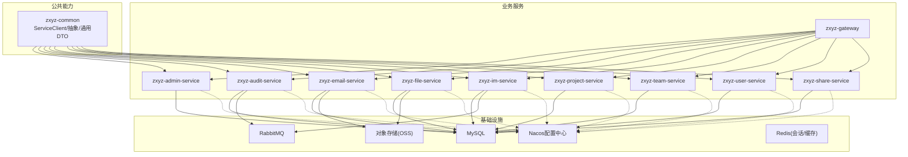
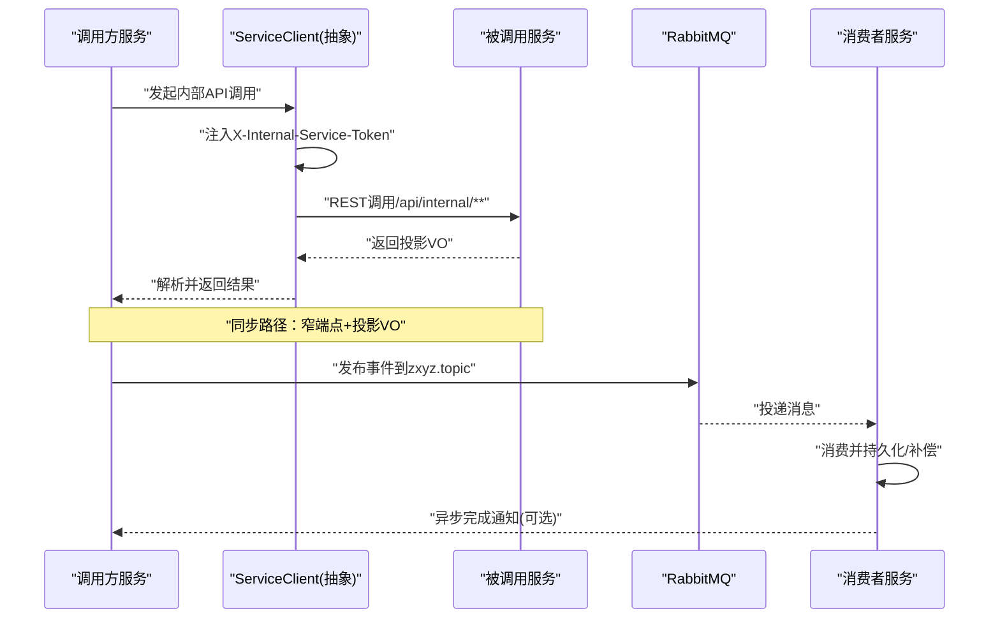
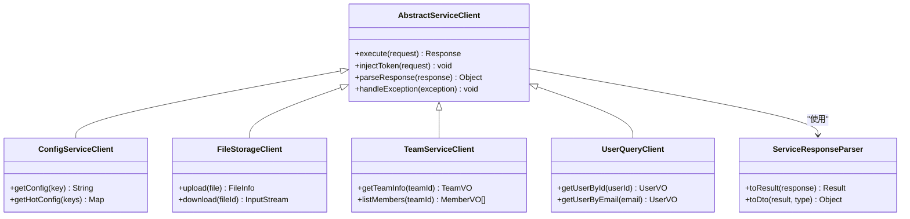
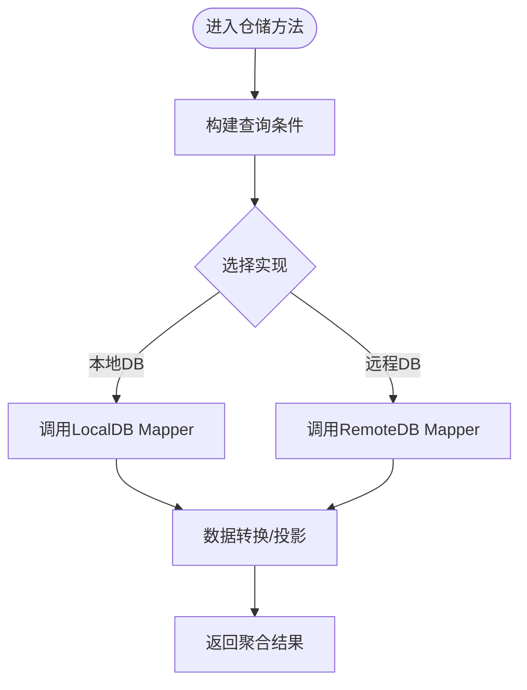
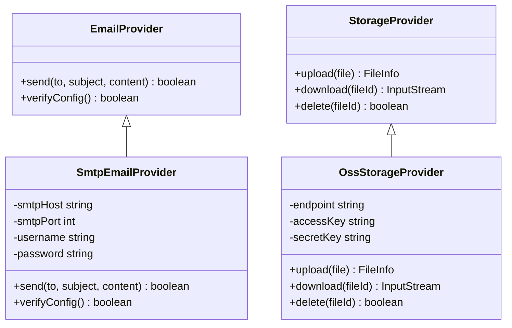
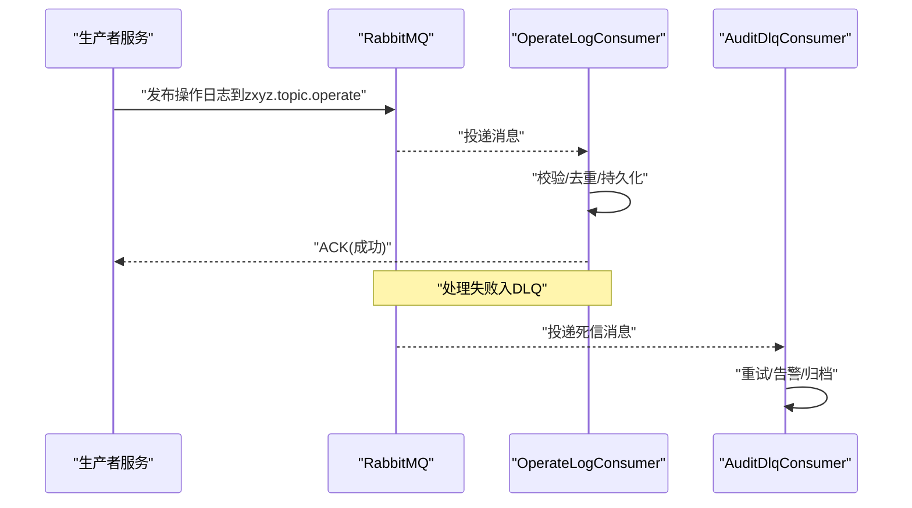
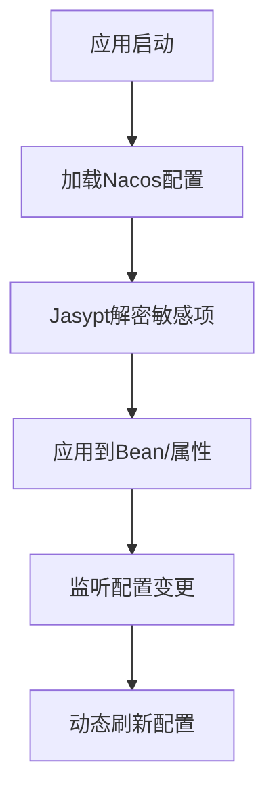
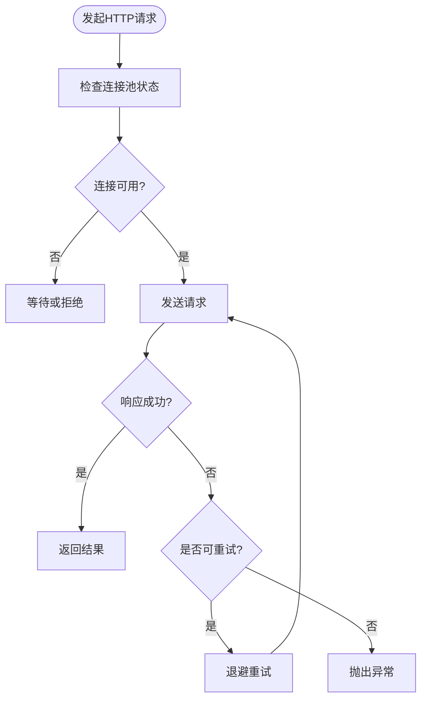
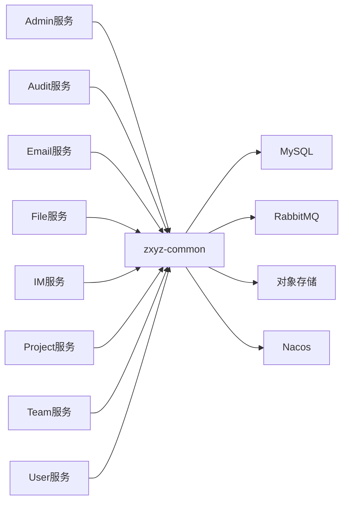

# 基础设施实现

<cite>
**本文引用的文件**   
- [zxyz-common/src/main/java/uno/acloud/client/AbstractServiceClient.java](file://ZXYZdatabaseBack/zxyz-common/src/main/java/uno/acloud/client/AbstractServiceClient.java)
- [zxyz-common/src/main/java/uno/acloud/client/ConfigServiceClient.java](file://ZXYZdatabaseBack/zxyz-common/src/main/java/uno/acloud/client/ConfigServiceClient.java)
- [zxyz-common/src/main/java/uno/acloud/client/FileStorageClient.java](file://ZXYZdatabaseBack/zxyz-common/src/main/java/uno/acloud/client/FileStorageClient.java)
- [zxyz-common/src/main/java/uno/acloud/client/TeamServiceClient.java](file://ZXYZdatabaseBack/zxyz-common/src/main/java/uno/acloud/client/TeamServiceClient.java)
- [zxyz-common/src/main/java/uno/acloud/client/UserQueryClient.java](file://ZXYZdatabaseBack/zxyz-common/src/main/java/uno/acloud/client/UserQueryClient.java)
- [zxyz-common/src/main/java/uno/acloud/client/ServiceResponseParser.java](file://ZXYZdatabaseBack/zxyz-common/src/main/java/uno/acloud/client/ServiceResponseParser.java)
- [zxyz-admin-service/src/main/java/uno/acloud/admin/config/RestClientConfig.java](file://ZXYZdatabaseBack/ZXYZdatabaseBack/zxyz-admin-service/src/main/java/uno/acloud/admin/config/RestClientConfig.java)
- [zxyz-admin-service/src/main/java/uno/acloud/admin/config/ConfigDataSourceConfig.java](file://ZXYZdatabaseBack/ZXYZdatabaseBack/zxyz-admin-service/src/main/java/uno/acloud/admin/config/ConfigDataSourceConfig.java)
- [zxyz-admin-service/src/main/java/uno/acloud/admin/mapper/SysConfigMapper.java](file://ZXYZdatabaseBack/ZXYZdatabaseBack/zxyz-admin-service/src/main/java/uno/acloud/admin/mapper/SysConfigMapper.java)
- [zxyz-admin-service/src/main/java/uno/acloud/admin/mapper/SysConfigAuditMapper.java](file://ZXYZdatabaseBack/ZXYZdatabaseBack/zxyz-admin-service/src/main/java/uno/acloud/admin/mapper/SysConfigAuditMapper.java)
- [zxyz-admin-service/src/main/java/uno/acloud/admin/service/ConfigService.java](file://ZXYZdatabaseBack/ZXYZdatabaseBack/zxyz-admin-service/src/main/java/uno/acloud/admin/service/ConfigService.java)
- [zxyz-audit-service/src/main/java/uno/acloud/audit/config/RabbitMqConfig.java](file://ZXYZdatabaseBack/ZXYZdatabaseBack/zxyz-audit-service/src/main/java/uno/acloud/audit/config/RabbitMqConfig.java)
- [zxyz-audit-service/src/main/java/uno/acloud/audit/mq/OperateLogConsumer.java](file://ZXYZdatabaseBack/ZXYZdatabaseBack/zxyz-audit-service/src/main/java/uno/acloud/audit/mq/OperateLogConsumer.java)
- [zxyz-audit-service/src/main/java/uno/acloud/audit/mq/AuditDlqConsumer.java](file://ZXYZdatabaseBack/ZXYZdatabaseBack/zxyz-audit-service/src/main/java/uno/acloud/audit/mq/AuditDlqConsumer.java)
- [zxyz-email-service/src/main/java/uno/acloud/email/config/EmailProviderConfig.java](file://ZXYZdatabaseBack/ZXYZdatabaseBack/zxyz-email-service/src/main/java/uno/acloud/email/config/EmailProviderConfig.java)
- [zxyz-email-service/src/main/java/uno/acloud/email/provider/SmtpEmailProvider.java](file://ZXYZdatabaseBack/ZXYZdatabaseBack/zxyz-email-service/src/main/java/uno/acloud/email/provider/SmtpEmailProvider.java)
- [zxyz-file-service/src/main/java/uno/acloud/file/storage/OssStorageProvider.java](file://ZXYZdatabaseBack/ZXYZdatabaseBack/zxyz-file-service/src/main/java/uno/acloud/file/storage/OssStorageProvider.java)
- [zxyz-file-service/src/main/java/uno/acloud/file/config/StorageProperties.java](file://ZXYZdatabaseBack/ZXYZdatabaseBack/zxyz-file-service/src/main/java/uno/acloud/file/config/StorageProperties.java)
- [zxyz-im-service/src/main/java/uno/acloud/im/infrastructure/client/ImServiceClient.java](file://ZXYZdatabaseBack/ZXYZdatabaseBack/zxyz-im-service/src/main/java/uno/acloud/im/infrastructure/client/ImServiceClient.java)
- [zxyz-project-service/src/main/java/uno/acloud/project/mapper/ProjectMapper.java](file://ZXYZdatabaseBack/ZXYZdatabaseBack/zxyz-project-service/src/main/java/uno/acloud/project/mapper/ProjectMapper.java)
- [zxyz-team-service/src/main/java/uno/acloud/team/mapper/TeamMapper.java](file://ZXYZdatabaseBack/ZXYZdatabaseBack/zxyz-team-service/src/main/java/uno/acloud/team/mapper/TeamMapper.java)
- [zxyz-user-service/src/main/java/uno/acloud/user/mapper/UserMapper.java](file://ZXYZdatabaseBack/ZXYZdatabaseBack/zxyz-user-service/src/main/java/uno/acloud/user/mapper/UserMapper.java)
- [nacos-config/zxyz-dynamic.yml](file://nacos-config/zxyz-dynamic.yml)
- [nacos-config/zxyz-static.yml](file://nacos-config/zxyz-static.yml)
- [docker-compose.yml](file://docker-compose.yml)
- [.github/workflows/ci-cd.yml](file://.github/workflows/ci-cd.yml)
</cite>

## 目录
1. [引言](#引言)
2. [项目结构](#项目结构)
3. [核心组件](#核心组件)
4. [架构总览](#架构总览)
5. [详细组件分析](#详细组件分析)
6. [依赖关系分析](#依赖关系分析)
7. [性能考虑](#性能考虑)
8. [故障排查指南](#故障排查指南)
9. [结论](#结论)
10. [附录](#附录)

## 引言
本文件聚焦 ZXYZ 项目的基础设施层实现，围绕数据库访问、外部服务调用、缓存与消息队列、配置管理、连接池优化、错误重试等横切关注点展开。通过抽象接口（如 ServiceClient、Provider、Mapper）隔离技术细节，仓储模式（Repository）屏蔽底层存储差异，使上层业务逻辑专注于领域规则与流程编排。文档同时给出架构图、序列图与流程图，帮助读者快速理解数据流与控制流。

## 项目结构
ZXYZ 采用微服务架构，后端包含多个 Maven 模块：公共能力集中在 zxyz-common，各业务服务（admin、audit、email、file、im、project、team、user、share、gateway）各自维护 controller → service → mapper → entity 的传统分层；部分服务（im、email）采用 DDD 分层（interfaces → application → domain → infrastructure）。基础设施相关能力包括：
- 数据库访问：MyBatis Mapper + Flyway 迁移
- 外部服务调用：基于 RestTemplate/WebClient 的 ServiceClient 抽象
- 消息队列：RabbitMQ Topic Exchange 异步通信
- 对象存储：OSS Provider 抽象
- 邮件发送：SMTP Provider 抽象
- 配置中心：Nacos 动态配置 + Jasypt 加密
- 网关与安全：Gateway + Sa-Token 鉴权

**图表来源** 
- [docker-compose.yml](file://docker-compose.yml)
- [nacos-config/zxyz-dynamic.yml](file://nacos-config/zxyz-dynamic.yml)
- [nacos-config/zxyz-static.yml](file://nacos-config/zxyz-static.yml)

**章节来源**
- [docker-compose.yml](file://docker-compose.yml)
- [nacos-config/zxyz-dynamic.yml](file://nacos-config/zxyz-dynamic.yml)
- [nacos-config/zxyz-static.yml](file://nacos-config/zxyz-static.yml)

## 核心组件
本节概述基础设施层的关键抽象与实现要点：
- 服务间调用：AbstractServiceClient 统一封装请求头注入、鉴权令牌传递、响应解析与异常处理；具体 Client（ConfigServiceClient、FileStorageClient、TeamServiceClient、UserQueryClient）面向窄端点返回投影 VO。
- 数据库访问：各服务通过 MyBatis Mapper 定义 SQL 映射，配合 Flyway 进行版本化迁移；仓储层（Repository）在需要时封装复杂查询与事务边界。
- 外部服务：Provider 抽象（如 EmailProvider、OssStorageProvider）屏蔽不同实现细节，便于切换与扩展。
- 消息队列：RabbitMQ 作为异步通道，消费者监听主题并持久化审计日志或执行补偿任务。
- 配置管理：Nacos 提供集中式配置，支持动态刷新；敏感项使用 Jasypt 加密。
- 连接池与重试：RestClient/HTTP 客户端连接池参数调优，结合重试策略提升稳定性。

**章节来源**
- [zxyz-common/src/main/java/uno/acloud/client/AbstractServiceClient.java](file://ZXYZdatabaseBack/zxyz-common/src/main/java/uno/acloud/client/AbstractServiceClient.java)
- [zxyz-common/src/main/java/uno/acloud/client/ConfigServiceClient.java](file://ZXYZdatabaseBack/zxyz-common/src/main/java/uno/acloud/client/ConfigServiceClient.java)
- [zxyz-common/src/main/java/uno/acloud/client/FileStorageClient.java](file://ZXYZdatabaseBack/zxyz-common/src/main/java/uno/acloud/client/FileStorageClient.java)
- [zxyz-common/src/main/java/uno/acloud/client/TeamServiceClient.java](file://ZXYZdatabaseBack/zxyz-common/src/main/java/uno/acloud/client/TeamServiceClient.java)
- [zxyz-common/src/main/java/uno/acloud/client/UserQueryClient.java](file://ZXYZdatabaseBack/zxyz-common/src/main/java/uno/acloud/client/UserQueryClient.java)
- [zxyz-common/src/main/java/uno/acloud/client/ServiceResponseParser.java](file://ZXYZdatabaseBack/zxyz-common/src/main/java/uno/acloud/client/ServiceResponseParser.java)

## 架构总览
下图展示服务间同步调用与异步消息的总体交互。内部端点前缀 /api/internal/** 由 Gateway 的 SaToken 过滤器拒绝公网访问，确保跨服务调用仅在内部网络进行。

**图表来源** 
- [zxyz-common/src/main/java/uno/acloud/client/AbstractServiceClient.java](file://ZXYZdatabaseBack/zxyz-common/src/main/java/uno/acloud/client/AbstractServiceClient.java)
- [zxyz-audit-service/src/main/java/uno/acloud/audit/config/RabbitMqConfig.java](file://ZXYZdatabaseBack/ZXYZdatabaseBack/zxyz-audit-service/src/main/java/uno/acloud/audit/config/RabbitMqConfig.java)
- [zxyz-audit-service/src/main/java/uno/acloud/audit/mq/OperateLogConsumer.java](file://ZXYZdatabaseBack/ZXYZdatabaseBack/zxyz-audit-service/src/main/java/uno/acloud/audit/mq/OperateLogConsumer.java)

## 详细组件分析

### 服务间调用：ServiceClient 抽象与实现
- AbstractServiceClient 统一处理：
  - 请求拦截：注入 X-Internal-Service-Token
  - 响应解析：ServiceResponseParser 将统一 Result<T> 转换为业务 DTO/VO
  - 异常处理：网络异常、超时、业务码非成功时的转换与上报
- 具体 Client：
  - ConfigServiceClient：配置服务查询
  - FileStorageClient：文件服务上传/下载
  - TeamServiceClient：团队信息查询
  - UserQueryClient：用户信息查询

**图表来源** 
- [zxyz-common/src/main/java/uno/acloud/client/AbstractServiceClient.java](file://ZXYZdatabaseBack/zxyz-common/src/main/java/uno/acloud/client/AbstractServiceClient.java)
- [zxyz-common/src/main/java/uno/acloud/client/ConfigServiceClient.java](file://ZXYZdatabaseBack/zxyz-common/src/main/java/uno/acloud/client/ConfigServiceClient.java)
- [zxyz-common/src/main/java/uno/acloud/client/FileStorageClient.java](file://ZXYZdatabaseBack/zxyz-common/src/main/java/uno/acloud/client/FileStorageClient.java)
- [zxyz-common/src/main/java/uno/acloud/client/TeamServiceClient.java](file://ZXYZdatabaseBack/zxyz-common/src/main/java/uno/acloud/client/TeamServiceClient.java)
- [zxyz-common/src/main/java/uno/acloud/client/UserQueryClient.java](file://ZXYZdatabaseBack/zxyz-common/src/main/java/uno/acloud/client/UserQueryClient.java)
- [zxyz-common/src/main/java/uno/acloud/client/ServiceResponseParser.java](file://ZXYZdatabaseBack/zxyz-common/src/main/java/uno/acloud/client/ServiceResponseParser.java)

**章节来源**
- [zxyz-common/src/main/java/uno/acloud/client/AbstractServiceClient.java](file://ZXYZdatabaseBack/zxyz-common/src/main/java/uno/acloud/client/AbstractServiceClient.java)
- [zxyz-common/src/main/java/uno/acloud/client/ConfigServiceClient.java](file://ZXYZdatabaseBack/zxyz-common/src/main/java/uno/acloud/client/ConfigServiceClient.java)
- [zxyz-common/src/main/java/uno/acloud/client/FileStorageClient.java](file://ZXYZdatabaseBack/zxyz-common/src/main/java/uno/acloud/client/FileStorageClient.java)
- [zxyz-common/src/main/java/uno/acloud/client/TeamServiceClient.java](file://ZXYZdatabaseBack/zxyz-common/src/main/java/uno/acloud/client/TeamServiceClient.java)
- [zxyz-common/src/main/java/uno/acloud/client/UserQueryClient.java](file://ZXYZdatabaseBack/zxyz-common/src/main/java/uno/acloud/client/UserQueryClient.java)
- [zxyz-common/src/main/java/uno/acloud/client/ServiceResponseParser.java](file://ZXYZdatabaseBack/zxyz-common/src/main/java/uno/acloud/client/ServiceResponseParser.java)

### 数据库访问：Mapper 与仓储模式
- Mapper 层：各服务通过 MyBatis Mapper 定义 SQL 映射，例如 ProjectMapper、TeamMapper、UserMapper、SysConfigMapper、SysConfigAuditMapper。
- 仓储模式：在复杂查询或跨表聚合场景，可在 Service 层引入 Repository 接口，屏蔽底层存储差异（如分库分表、读写分离），向上暴露统一的 CRUD 与查询方法。
- 迁移管理：Flyway 脚本按版本演进，保证环境一致性。

**图表来源** 
- [zxyz-project-service/src/main/java/uno/acloud/project/mapper/ProjectMapper.java](file://ZXYZdatabaseBack/ZXYZdatabaseBack/zxyz-project-service/src/main/java/uno/acloud/project/mapper/ProjectMapper.java)
- [zxyz-team-service/src/main/java/uno/acloud/team/mapper/TeamMapper.java](file://ZXYZdatabaseBack/ZXYZdatabaseBack/zxyz-team-service/src/main/java/uno/acloud/team/mapper/TeamMapper.java)
- [zxyz-user-service/src/main/java/uno/acloud/user/mapper/UserMapper.java](file://ZXYZdatabaseBack/ZXYZdatabaseBack/zxyz-user-service/src/main/java/uno/acloud/user/mapper/UserMapper.java)
- [zxyz-admin-service/src/main/java/uno/acloud/admin/mapper/SysConfigMapper.java](file://ZXYZdatabaseBack/ZXYZdatabaseBack/zxyz-admin-service/src/main/java/uno/acloud/admin/mapper/SysConfigMapper.java)
- [zxyz-admin-service/src/main/java/uno/acloud/admin/mapper/SysConfigAuditMapper.java](file://ZXYZdatabaseBack/ZXYZdatabaseBack/zxyz-admin-service/src/main/java/uno/acloud/admin/mapper/SysConfigAuditMapper.java)

**章节来源**
- [zxyz-project-service/src/main/java/uno/acloud/project/mapper/ProjectMapper.java](file://ZXYZdatabaseBack/ZXYZdatabaseBack/zxyz-project-service/src/main/java/uno/acloud/project/mapper/ProjectMapper.java)
- [zxyz-team-service/src/main/java/uno/acloud/team/mapper/TeamMapper.java](file://ZXYZdatabaseBack/ZXYZdatabaseBack/zxyz-team-service/src/main/java/uno/acloud/team/mapper/TeamMapper.java)
- [zxyz-user-service/src/main/java/uno/acloud/user/mapper/UserMapper.java](file://ZXYZdatabaseBack/ZXYZdatabaseBack/zxyz-user-service/src/main/java/uno/acloud/user/mapper/UserMapper.java)
- [zxyz-admin-service/src/main/java/uno/acloud/admin/mapper/SysConfigMapper.java](file://ZXYZdatabaseBack/ZXYZdatabaseBack/zxyz-admin-service/src/main/java/uno/acloud/admin/mapper/SysConfigMapper.java)
- [zxyz-admin-service/src/main/java/uno/acloud/admin/mapper/SysConfigAuditMapper.java](file://ZXYZdatabaseBack/ZXYZdatabaseBack/zxyz-admin-service/src/main/java/uno/acloud/admin/mapper/SysConfigAuditMapper.java)

### 外部服务调用：Provider 抽象（邮件与对象存储）
- 邮件 Provider：SmtpEmailProvider 实现 EmailProvider 接口，屏蔽不同邮件服务商差异。
- 对象存储 Provider：OssStorageProvider 实现 StorageProvider 接口，统一上传/下载/删除等操作。

**图表来源** 
- [zxyz-email-service/src/main/java/uno/acloud/email/provider/SmtpEmailProvider.java](file://ZXYZdatabaseBack/ZXYZdatabaseBack/zxyz-email-service/src/main/java/uno/acloud/email/provider/SmtpEmailProvider.java)
- [zxyz-file-service/src/main/java/uno/acloud/file/storage/OssStorageProvider.java](file://ZXYZdatabaseBack/ZXYZdatabaseBack/zxyz-file-service/src/main/java/uno/acloud/file/storage/OssStorageProvider.java)

**章节来源**
- [zxyz-email-service/src/main/java/uno/acloud/email/provider/SmtpEmailProvider.java](file://ZXYZdatabaseBack/ZXYZdatabaseBack/zxyz-email-service/src/main/java/uno/acloud/email/provider/SmtpEmailProvider.java)
- [zxyz-file-service/src/main/java/uno/acloud/file/storage/OssStorageProvider.java](file://ZXYZdatabaseBack/ZXYZdatabaseBack/zxyz-file-service/src/main/java/uno/acloud/file/storage/OssStorageProvider.java)

### 消息队列：RabbitMQ 消费者与死信队列
- RabbitMqConfig 配置 Topic Exchange 与队列绑定。
- OperateLogConsumer 消费操作日志并持久化。
- AuditDlqConsumer 处理死信队列中的失败消息，进行重试或告警。

**图表来源** 
- [zxyz-audit-service/src/main/java/uno/acloud/audit/config/RabbitMqConfig.java](file://ZXYZdatabaseBack/ZXYZdatabaseBack/zxyz-audit-service/src/main/java/uno/acloud/audit/config/RabbitMqConfig.java)
- [zxyz-audit-service/src/main/java/uno/acloud/audit/mq/OperateLogConsumer.java](file://ZXYZdatabaseBack/ZXYZdatabaseBack/zxyz-audit-service/src/main/java/uno/acloud/audit/mq/OperateLogConsumer.java)
- [zxyz-audit-service/src/main/java/uno/acloud/audit/mq/AuditDlqConsumer.java](file://ZXYZdatabaseBack/ZXYZdatabaseBack/zxyz-audit-service/src/main/java/uno/acloud/audit/mq/AuditDlqConsumer.java)

**章节来源**
- [zxyz-audit-service/src/main/java/uno/acloud/audit/config/RabbitMqConfig.java](file://ZXYZdatabaseBack/ZXYZdatabaseBack/zxyz-audit-service/src/main/java/uno/acloud/audit/config/RabbitMqConfig.java)
- [zxyz-audit-service/src/main/java/uno/acloud/audit/mq/OperateLogConsumer.java](file://ZXYZdatabaseBack/ZXYZdatabaseBack/zxyz-audit-service/src/main/java/uno/acloud/audit/mq/OperateLogConsumer.java)
- [zxyz-audit-service/src/main/java/uno/acloud/audit/mq/AuditDlqConsumer.java](file://ZXYZdatabaseBack/ZXYZdatabaseBack/zxyz-audit-service/src/main/java/uno/acloud/audit/mq/AuditDlqConsumer.java)

### 配置管理：Nacos 与动态刷新
- Nacos 提供集中式配置，支持热更新。
- zxyz-dynamic.yml 与 zxyz-static.yml 分别管理动态与静态配置。
- 敏感配置通过 Jasypt 加密，启动时解密。

**图表来源** 
- [nacos-config/zxyz-dynamic.yml](file://nacos-config/zxyz-dynamic.yml)
- [nacos-config/zxyz-static.yml](file://nacos-config/zxyz-static.yml)

**章节来源**
- [nacos-config/zxyz-dynamic.yml](file://nacos-config/zxyz-dynamic.yml)
- [nacos-config/zxyz-static.yml](file://nacos-config/zxyz-static.yml)

### 连接池与重试：RestClient 配置
- RestClientConfig 配置 HTTP 客户端连接池参数（最大连接数、超时、重试次数）。
- 针对幂等接口启用重试，非幂等接口禁用自动重试以避免重复副作用。

**图表来源** 
- [zxyz-admin-service/src/main/java/uno/acloud/admin/config/RestClientConfig.java](file://ZXYZdatabaseBack/ZXYZdatabaseBack/zxyz-admin-service/src/main/java/uno/acloud/admin/config/RestClientConfig.java)

**章节来源**
- [zxyz-admin-service/src/main/java/uno/acloud/admin/config/RestClientConfig.java](file://ZXYZdatabaseBack/ZXYZdatabaseBack/zxyz-admin-service/src/main/java/uno/acloud/admin/config/RestClientConfig.java)

## 依赖关系分析
- 服务间依赖通过 ServiceClient 解耦，避免直接耦合具体实现。
- 数据库依赖通过 Mapper 与 Repository 抽象，屏蔽分库分表、读写分离等差异。
- 外部依赖（邮件、存储）通过 Provider 抽象，便于替换与扩展。
- 配置依赖通过 Nacos 统一管理，降低环境差异带来的风险。

**图表来源** 
- [docker-compose.yml](file://docker-compose.yml)
- [nacos-config/zxyz-dynamic.yml](file://nacos-config/zxyz-dynamic.yml)

**章节来源**
- [docker-compose.yml](file://docker-compose.yml)
- [nacos-config/zxyz-dynamic.yml](file://nacos-config/zxyz-dynamic.yml)

## 性能考虑
- 连接池调优：根据 QPS 与延迟目标调整最大连接数、空闲连接回收时间、超时阈值。
- 重试策略：对幂等接口启用指数退避重试，限制最大重试次数与总耗时。
- 缓存策略：热点配置与用户信息可使用 Redis 缓存，设置合理 TTL 与失效策略。
- 异步化：将非关键路径（如审计日志、通知）改为消息队列异步处理，降低主链路延迟。
- 数据库优化：合理使用索引、分页、批量操作，避免 N+1 查询。

[本节为通用指导，不直接分析具体文件]

## 故障排查指南
- 服务间调用失败：检查 X-Internal-Service-Token 是否正确注入，确认内部端点权限与网络连通性。
- 数据库连接异常：检查连接池配置、数据库地址与端口、账号权限。
- 消息消费失败：查看 DLQ 中死信消息内容，定位消费者逻辑问题。
- 配置未生效：确认 Nacos 配置键值与命名空间，检查 Jasypt 解密是否成功。
- 外部服务不可用：检查 Provider 配置（SMTP/OSS），验证凭据与网络可达性。

**章节来源**
- [zxyz-common/src/main/java/uno/acloud/client/AbstractServiceClient.java](file://ZXYZdatabaseBack/zxyz-common/src/main/java/uno/acloud/client/AbstractServiceClient.java)
- [zxyz-audit-service/src/main/java/uno/acloud/audit/mq/AuditDlqConsumer.java](file://ZXYZdatabaseBack/ZXYZdatabaseBack/zxyz-audit-service/src/main/java/uno/acloud/audit/mq/AuditDlqConsumer.java)
- [zxyz-admin-service/src/main/java/uno/acloud/admin/config/RestClientConfig.java](file://ZXYZdatabaseBack/ZXYZdatabaseBack/zxyz-admin-service/src/main/java/uno/acloud/admin/config/RestClientConfig.java)

## 结论
ZXYZ 的基础设施层通过抽象接口（ServiceClient、Provider、Mapper、Repository）有效隔离了技术细节，提升了系统的可维护性与可扩展性。结合 Nacos 配置中心、RabbitMQ 异步通信、连接池与重试机制，为上层业务提供了稳定可靠的技术支撑。建议在后续迭代中持续优化连接池参数、完善缓存策略与监控告警，进一步提升系统性能与可用性。

[本节为总结，不直接分析具体文件]

## 附录
- CI/CD：GitHub Actions 基于路径过滤选择性构建，镜像推送 GHCR。
- 部署：Docker Compose 编排 18 个容器，涵盖基础设施与所有服务。

**章节来源**
- [.github/workflows/ci-cd.yml](file://.github/workflows/ci-cd.yml)
- [docker-compose.yml](file://docker-compose.yml)