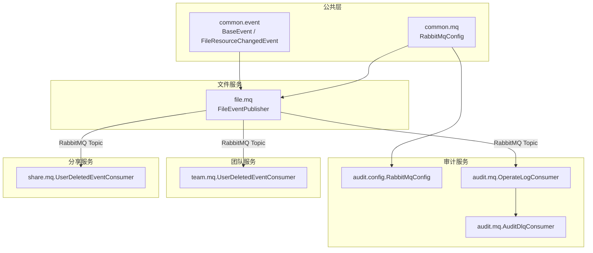
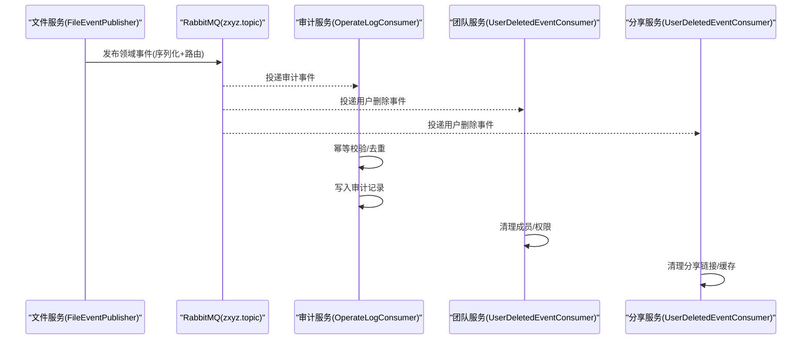
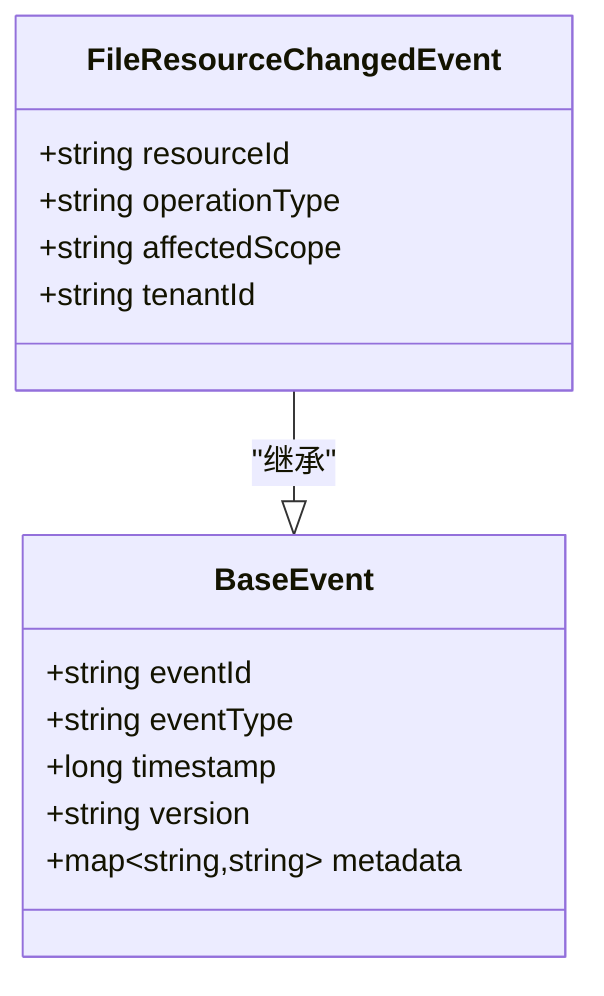
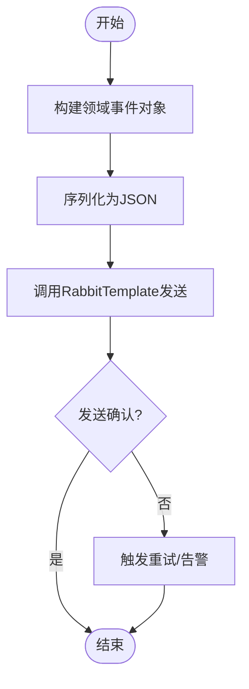
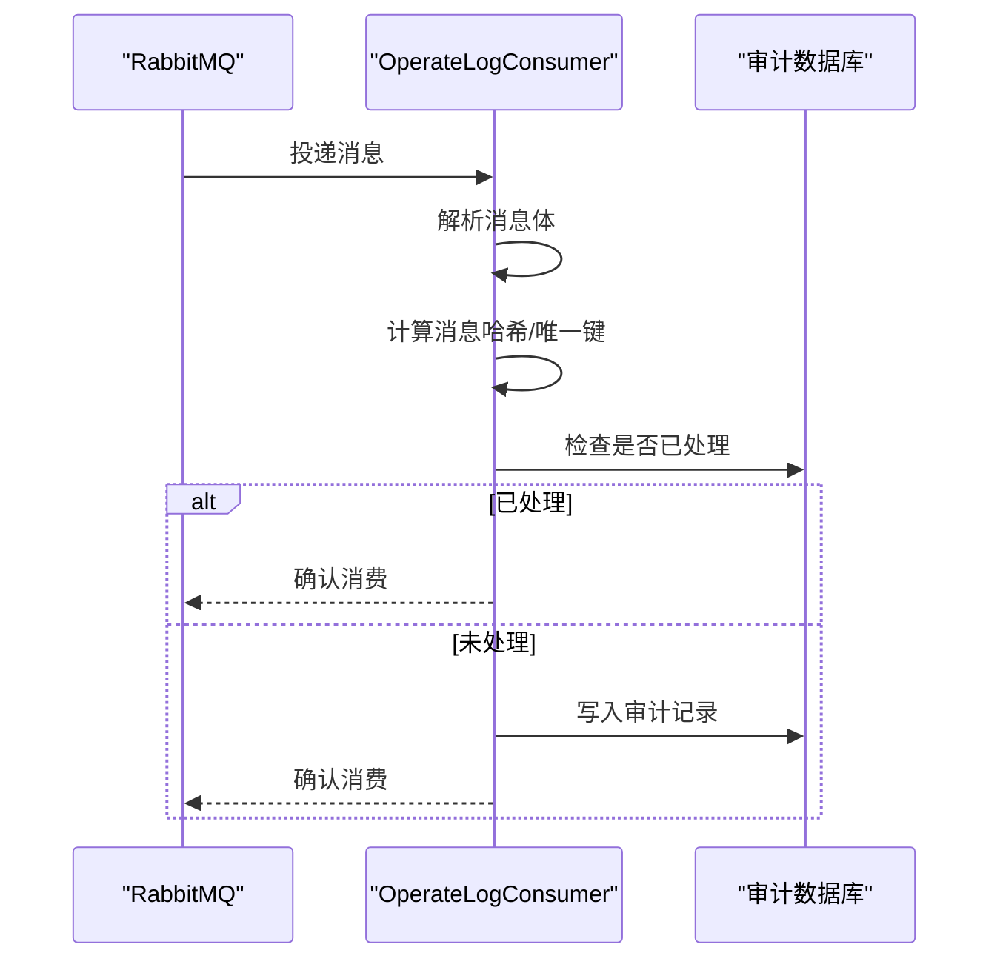
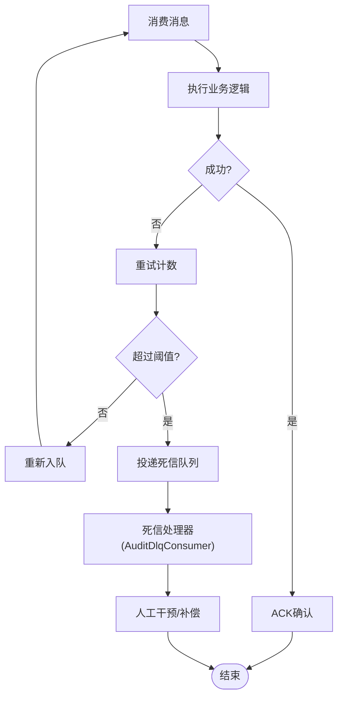
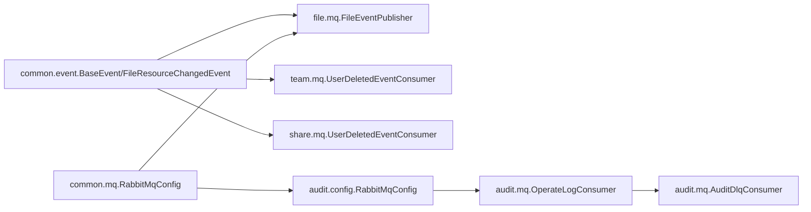

# 领域事件

<cite>
**本文引用的文件**   
- [zxyz-common/src/main/java/uno/acloud/common/event/BaseEvent.java](file://ZXYZdatabaseBack/zxyz-common/src/main/java/uno/acloud/common/event/BaseEvent.java)
- [zxyz-common/src/main/java/uno/acloud/common/event/FileResourceChangedEvent.java](file://ZXYZdatabaseBack/zxyz-common/src/main/java/uno/acloud/common/event/FileResourceChangedEvent.java)
- [zxyz-common/src/main/java/uno/acloud/common/mq/RabbitMqConfig.java](file://ZXYZdatabaseBack/zxyz-common/src/main/java/uno/acloud/common/mq/RabbitMqConfig.java)
- [zxyz-audit-service/src/main/java/uno/acloud/audit/config/RabbitMqConfig.java](file://ZXYZdatabaseBack/zxyz-audit-service/src/main/java/uno/acloud/audit/config/RabbitMqConfig.java)
- [zxyz-audit-service/src/main/java/uno/acloud/audit/mq/OperateLogConsumer.java](file://ZXYZdatabaseBack/zxyz-audit-service/src/main/java/uno/acloud/audit/mq/OperateLogConsumer.java)
- [zxyz-audit-service/src/main/java/uno/acloud/audit/mq/AuditDlqConsumer.java](file://ZXYZdatabaseBack/zxyz-audit-service/src/main/java/uno/acloud/audit/mq/AuditDlqConsumer.java)
- [zxyz-file-service/src/main/java/uno/acloud/file/mq/FileEventPublisher.java](file://ZXYZdatabaseBack/zxyz-file-service/src/main/java/uno/acloud/file/mq/FileEventPublisher.java)
- [zxyz-team-service/src/main/java/uno/acloud/team/mq/UserDeletedEventConsumer.java](file://ZXYZdatabaseBack/zxyz-team-service/src/main/java/uno/acloud/team/mq/UserDeletedEventConsumer.java)
- [zxyz-share-service/src/main/java/uno/acloud/share/mq/UserDeletedEventConsumer.java](file://ZXYZdatabaseBack/zxyz-share-service/src/main/java/uno/acloud/share/mq/UserDeletedEventConsumer.java)
- [zxyz-audit-service/src/main/resources/db/migration/V3__add_message_hash_unique.sql](file://ZXYZdatabaseBack/zxyz-audit-service/src/main/resources/db/migration/V3__add_message_hash_unique.sql)
- [nacos-config/zxyz-dynamic.yml](file://nacos-config/zxyz-dynamic.yml)
</cite>

## 目录
1. [引言](#引言)
2. [项目结构](#项目结构)
3. [核心组件](#核心组件)
4. [架构总览](#架构总览)
5. [详细组件分析](#详细组件分析)
6. [依赖关系分析](#依赖关系分析)
7. [性能考量](#性能考量)
8. [故障排查指南](#故障排查指南)
9. [结论](#结论)
10. [附录](#附录)

## 引言
本文件面向 ZXYZ 项目的领域事件设计与实现，聚焦以下目标：
- 通过领域事件解耦业务组件，支撑最终一致性。
- 以 BaseEvent、FileResourceChangedEvent 为例，说明事件的定义、发布与订阅机制。
- 基于 RabbitMQ Topic Exchange（zxyz.topic）实现异步事件处理。
- 覆盖事件版本管理、幂等性保证与错误处理策略。
- 对比领域事件与传统消息队列的差异与适用场景。

## 项目结构
ZXYZ 后端为多模块 Maven 工程，事件相关代码主要分布在：
- zxyz-common：公共事件模型与 MQ 基础配置。
- zxyz-file-service：文件资源变更事件发布者。
- zxyz-audit-service：审计日志消费者与死信队列消费者。
- zxyz-team-service、zxyz-share-service：用户删除等跨服务事件的消费者。

图表来源
- [zxyz-common/src/main/java/uno/acloud/common/event/BaseEvent.java](file://ZXYZdatabaseBack/zxyz-common/src/main/java/uno/acloud/common/event/BaseEvent.java)
- [zxyz-common/src/main/java/uno/acloud/common/event/FileResourceChangedEvent.java](file://ZXYZdatabaseBack/zxyz-common/src/main/java/uno/acloud/common/event/FileResourceChangedEvent.java)
- [zxyz-common/src/main/java/uno/acloud/common/mq/RabbitMqConfig.java](file://ZXYZdatabaseBack/zxyz-common/src/main/java/uno/acloud/common/mq/RabbitMqConfig.java)
- [zxyz-file-service/src/main/java/uno/acloud/file/mq/FileEventPublisher.java](file://ZXYZdatabaseBack/zxyz-file-service/src/main/java/uno/acloud/file/mq/FileEventPublisher.java)
- [zxyz-audit-service/src/main/java/uno/acloud/audit/config/RabbitMqConfig.java](file://ZXYZdatabaseBack/zxyz-audit-service/src/main/java/uno/acloud/audit/config/RabbitMqConfig.java)
- [zxyz-audit-service/src/main/java/uno/acloud/audit/mq/OperateLogConsumer.java](file://ZXYZdatabaseBack/zxyz-audit-service/src/main/java/uno/acloud/audit/mq/OperateLogConsumer.java)
- [zxyz-audit-service/src/main/java/uno/acloud/audit/mq/AuditDlqConsumer.java](file://ZXYZdatabaseBack/zxyz-audit-service/src/main/java/uno/acloud/audit/mq/AuditDlqConsumer.java)
- [zxyz-team-service/src/main/java/uno/acloud/team/mq/UserDeletedEventConsumer.java](file://ZXYZdatabaseBack/zxyz-team-service/src/main/java/uno/acloud/team/mq/UserDeletedEventConsumer.java)
- [zxyz-share-service/src/main/java/uno/acloud/share/mq/UserDeletedEventConsumer.java](file://ZXYZdatabaseBack/zxyz-share-service/src/main/java/uno/acloud/share/mq/UserDeletedEventConsumer.java)

章节来源
- [zxyz-common/src/main/java/uno/acloud/common/event/BaseEvent.java](file://ZXYZdatabaseBack/zxyz-common/src/main/java/uno/acloud/common/event/BaseEvent.java)
- [zxyz-common/src/main/java/uno/acloud/common/event/FileResourceChangedEvent.java](file://ZXYZdatabaseBack/zxyz-common/src/main/java/uno/acloud/common/event/FileResourceChangedEvent.java)
- [zxyz-common/src/main/java/uno/acloud/common/mq/RabbitMqConfig.java](file://ZXYZdatabaseBack/zxyz-common/src/main/java/uno/acloud/common/mq/RabbitMqConfig.java)
- [zxyz-file-service/src/main/java/uno/acloud/file/mq/FileEventPublisher.java](file://ZXYZdatabaseBack/zxyz-file-service/src/main/java/uno/acloud/file/mq/FileEventPublisher.java)
- [zxyz-audit-service/src/main/java/uno/acloud/audit/config/RabbitMqConfig.java](file://ZXYZdatabaseBack/zxyz-audit-service/src/main/java/uno/acloud/audit/config/RabbitMqConfig.java)
- [zxyz-audit-service/src/main/java/uno/acloud/audit/mq/OperateLogConsumer.java](file://ZXYZdatabaseBack/zxyz-audit-service/src/main/java/uno/acloud/audit/mq/OperateLogConsumer.java)
- [zxyz-audit-service/src/main/java/uno/acloud/audit/mq/AuditDlqConsumer.java](file://ZXYZdatabaseBack/zxyz-audit-service/src/main/java/uno/acloud/audit/mq/AuditDlqConsumer.java)
- [zxyz-team-service/src/main/java/uno/acloud/team/mq/UserDeletedEventConsumer.java](file://ZXYZdatabaseBack/zxyz-team-service/src/main/java/uno/acloud/team/mq/UserDeletedEventConsumer.java)
- [zxyz-share-service/src/main/java/uno/acloud/share/mq/UserDeletedEventConsumer.java](file://ZXYZdatabaseBack/zxyz-share-service/src/main/java/uno/acloud/share/mq/UserDeletedEventConsumer.java)

## 核心组件
- 事件基类 BaseEvent：统一事件元数据（如事件类型、时间戳、关联上下文），便于追踪与审计。
- 具体事件 FileResourceChangedEvent：描述文件资源变更的领域语义，包含资源标识、操作类型、影响范围等。
- 事件发布器 FileEventPublisher：封装事件序列化与发送逻辑，将事件投递到 RabbitMQ 指定 Topic。
- 事件消费者 OperateLogConsumer：消费审计相关事件，持久化审计记录并支持重试与死信。
- 其他消费者 UserDeletedEventConsumer（team/share）：在用户删除时清理或更新下游状态，保障最终一致性。

章节来源
- [zxyz-common/src/main/java/uno/acloud/common/event/BaseEvent.java](file://ZXYZdatabaseBack/zxyz-common/src/main/java/uno/acloud/common/event/BaseEvent.java)
- [zxyz-common/src/main/java/uno/acloud/common/event/FileResourceChangedEvent.java](file://ZXYZdatabaseBack/zxyz-common/src/main/java/uno/acloud/common/event/FileResourceChangedEvent.java)
- [zxyz-file-service/src/main/java/uno/acloud/file/mq/FileEventPublisher.java](file://ZXYZdatabaseBack/zxyz-file-service/src/main/java/uno/acloud/file/mq/FileEventPublisher.java)
- [zxyz-audit-service/src/main/java/uno/acloud/audit/mq/OperateLogConsumer.java](file://ZXYZdatabaseBack/zxyz-audit-service/src/main/java/uno/acloud/audit/mq/OperateLogConsumer.java)
- [zxyz-team-service/src/main/java/uno/acloud/team/mq/UserDeletedEventConsumer.java](file://ZXYZdatabaseBack/zxyz-team-service/src/main/java/uno/acloud/team/mq/UserDeletedEventConsumer.java)
- [zxyz-share-service/src/main/java/uno/acloud/share/mq/UserDeletedEventConsumer.java](file://ZXYZdatabaseBack/zxyz-share-service/src/main/java/uno/acloud/share/mq/UserDeletedEventConsumer.java)

## 架构总览
采用“事件驱动 + 异步消息”的架构模式：
- 生产者（文件服务等）在业务完成后发布领域事件。
- RabbitMQ 作为消息总线，Topic Exchange 按路由键分发。
- 消费者（审计、团队、分享等服务）订阅相应 Topic，执行副作用（写库、索引、通知等）。
- 通过幂等与重试、死信队列与监控，保障可靠性与可观测性。

图表来源
- [zxyz-file-service/src/main/java/uno/acloud/file/mq/FileEventPublisher.java](file://ZXYZdatabaseBack/zxyz-file-service/src/main/java/uno/acloud/file/mq/FileEventPublisher.java)
- [zxyz-audit-service/src/main/java/uno/acloud/audit/mq/OperateLogConsumer.java](file://ZXYZdatabaseBack/zxyz-audit-service/src/main/java/uno/acloud/audit/mq/OperateLogConsumer.java)
- [zxyz-team-service/src/main/java/uno/acloud/team/mq/UserDeletedEventConsumer.java](file://ZXYZdatabaseBack/zxyz-team-service/src/main/java/uno/acloud/team/mq/UserDeletedEventConsumer.java)
- [zxyz-share-service/src/main/java/uno/acloud/share/mq/UserDeletedEventConsumer.java](file://ZXYZdatabaseBack/zxyz-share-service/src/main/java/uno/acloud/share/mq/UserDeletedEventConsumer.java)

## 详细组件分析

### 事件模型与基类设计
- BaseEvent：提供统一的字段与行为（如事件ID、时间戳、版本、扩展属性），确保所有事件具备可追踪性与兼容性。
- FileResourceChangedEvent：继承 BaseEvent，表达“文件资源变更”的领域语义，包含资源ID、操作类型、影响范围等关键信息。

图表来源
- [zxyz-common/src/main/java/uno/acloud/common/event/BaseEvent.java](file://ZXYZdatabaseBack/zxyz-common/src/main/java/uno/acloud/common/event/BaseEvent.java)
- [zxyz-common/src/main/java/uno/acloud/common/event/FileResourceChangedEvent.java](file://ZXYZdatabaseBack/zxyz-common/src/main/java/uno/acloud/common/event/FileResourceChangedEvent.java)

章节来源
- [zxyz-common/src/main/java/uno/acloud/common/event/BaseEvent.java](file://ZXYZdatabaseBack/zxyz-common/src/main/java/uno/acloud/common/event/BaseEvent.java)
- [zxyz-common/src/main/java/uno/acloud/common/event/FileResourceChangedEvent.java](file://ZXYZdatabaseBack/zxyz-common/src/main/java/uno/acloud/common/event/FileResourceChangedEvent.java)

### 事件发布机制
- FileEventPublisher 负责将领域事件序列化为 JSON，并通过 RabbitTemplate 发送到 zxyz.topic 的指定路由键。
- 发布时机通常位于事务提交后，避免回滚导致不一致。

图表来源
- [zxyz-file-service/src/main/java/uno/acloud/file/mq/FileEventPublisher.java](file://ZXYZdatabaseBack/zxyz-file-service/src/main/java/uno/acloud/file/mq/FileEventPublisher.java)
- [zxyz-common/src/main/java/uno/acloud/common/mq/RabbitMqConfig.java](file://ZXYZdatabaseBack/zxyz-common/src/main/java/uno/acloud/common/mq/RabbitMqConfig.java)

章节来源
- [zxyz-file-service/src/main/java/uno/acloud/file/mq/FileEventPublisher.java](file://ZXYZdatabaseBack/zxyz-file-service/src/main/java/uno/acloud/file/mq/FileEventPublisher.java)
- [zxyz-common/src/main/java/uno/acloud/common/mq/RabbitMqConfig.java](file://ZXYZdatabaseBack/zxyz-common/src/main/java/uno/acloud/common/mq/RabbitMqConfig.java)

### 事件订阅与处理流程
- OperateLogConsumer 订阅审计主题，进行幂等校验、落库与统计。
- UserDeletedEventConsumer（team/share）订阅用户删除主题，执行下游清理。

图表来源
- [zxyz-audit-service/src/main/java/uno/acloud/audit/mq/OperateLogConsumer.java](file://ZXYZdatabaseBack/zxyz-audit-service/src/main/java/uno/acloud/audit/mq/OperateLogConsumer.java)
- [zxyz-audit-service/src/main/resources/db/migration/V3__add_message_hash_unique.sql](file://ZXYZdatabaseBack/zxyz-audit-service/src/main/resources/db/migration/V3__add_message_hash_unique.sql)

章节来源
- [zxyz-audit-service/src/main/java/uno/acloud/audit/mq/OperateLogConsumer.java](file://ZXYZdatabaseBack/zxyz-audit-service/src/main/java/uno/acloud/audit/mq/OperateLogConsumer.java)
- [zxyz-audit-service/src/main/resources/db/migration/V3__add_message_hash_unique.sql](file://ZXYZdatabaseBack/zxyz-audit-service/src/main/resources/db/migration/V3__add_message_hash_unique.sql)

### 错误处理与死信队列
- 消费者异常进入重试机制，超过阈值后转入死信队列（DLQ）。
- AuditDlqConsumer 专门处理失败消息，便于人工介入与补偿。

图表来源
- [zxyz-audit-service/src/main/java/uno/acloud/audit/mq/AuditDlqConsumer.java](file://ZXYZdatabaseBack/zxyz-audit-service/src/main/java/uno/acloud/audit/mq/AuditDlqConsumer.java)

章节来源
- [zxyz-audit-service/src/main/java/uno/acloud/audit/mq/AuditDlqConsumer.java](file://ZXYZdatabaseBack/zxyz-audit-service/src/main/java/uno/acloud/audit/mq/AuditDlqConsumer.java)

### 事件版本管理与兼容性
- BaseEvent.version 字段用于兼容不同版本的事件结构。
- 消费者需根据版本号进行分支处理或降级策略，避免破坏性变更。

章节来源
- [zxyz-common/src/main/java/uno/acloud/common/event/BaseEvent.java](file://ZXYZdatabaseBack/zxyz-common/src/main/java/uno/acloud/common/event/BaseEvent.java)

### 幂等性保证
- 通过消息哈希或业务唯一键（如 eventId）在数据库中建立唯一约束，防止重复处理。
- V3__add_message_hash_unique.sql 体现幂等性的落地手段。

章节来源
- [zxyz-audit-service/src/main/resources/db/migration/V3__add_message_hash_unique.sql](file://ZXYZdatabaseBack/zxyz-audit-service/src/main/resources/db/migration/V3__add_message_hash_unique.sql)

### 配置与路由
- RabbitMqConfig（common/audit）声明交换机、队列与绑定关系。
- nacos-config/zxyz-dynamic.yml 集中管理动态配置（如队列名、路由键、重试策略）。

章节来源
- [zxyz-common/src/main/java/uno/acloud/common/mq/RabbitMqConfig.java](file://ZXYZdatabaseBack/zxyz-common/src/main/java/uno/acloud/common/mq/RabbitMqConfig.java)
- [zxyz-audit-service/src/main/java/uno/acloud/audit/config/RabbitMqConfig.java](file://ZXYZdatabaseBack/zxyz-audit-service/src/main/java/uno/acloud/audit/config/RabbitMqConfig.java)
- [nacos-config/zxyz-dynamic.yml](file://nacos-config/zxyz-dynamic.yml)

## 依赖关系分析
- 事件模型（common.event）被各服务引用，形成稳定的契约。
- 发布端依赖 RabbitTemplate，消费端依赖 RabbitListener。
- 审计服务依赖数据库唯一约束实现幂等；团队/分享服务依赖事件完成状态同步。

图表来源
- [zxyz-common/src/main/java/uno/acloud/common/event/BaseEvent.java](file://ZXYZdatabaseBack/zxyz-common/src/main/java/uno/acloud/common/event/BaseEvent.java)
- [zxyz-common/src/main/java/uno/acloud/common/event/FileResourceChangedEvent.java](file://ZXYZdatabaseBack/zxyz-common/src/main/java/uno/acloud/common/event/FileResourceChangedEvent.java)
- [zxyz-common/src/main/java/uno/acloud/common/mq/RabbitMqConfig.java](file://ZXYZdatabaseBack/zxyz-common/src/main/java/uno/acloud/common/mq/RabbitMqConfig.java)
- [zxyz-file-service/src/main/java/uno/acloud/file/mq/FileEventPublisher.java](file://ZXYZdatabaseBack/zxyz-file-service/src/main/java/uno/acloud/file/mq/FileEventPublisher.java)
- [zxyz-audit-service/src/main/java/uno/acloud/audit/config/RabbitMqConfig.java](file://ZXYZdatabaseBack/zxyz-audit-service/src/main/java/uno/acloud/audit/config/RabbitMqConfig.java)
- [zxyz-audit-service/src/main/java/uno/acloud/audit/mq/OperateLogConsumer.java](file://ZXYZdatabaseBack/zxyz-audit-service/src/main/java/uno/acloud/audit/mq/OperateLogConsumer.java)
- [zxyz-audit-service/src/main/java/uno/acloud/audit/mq/AuditDlqConsumer.java](file://ZXYZdatabaseBack/zxyz-audit-service/src/main/java/uno/acloud/audit/mq/AuditDlqConsumer.java)
- [zxyz-team-service/src/main/java/uno/acloud/team/mq/UserDeletedEventConsumer.java](file://ZXYZdatabaseBack/zxyz-team-service/src/main/java/uno/acloud/team/mq/UserDeletedEventConsumer.java)
- [zxyz-share-service/src/main/java/uno/acloud/share/mq/UserDeletedEventConsumer.java](file://ZXYZdatabaseBack/zxyz-share-service/src/main/java/uno/acloud/share/mq/UserDeletedEventConsumer.java)

章节来源
- [zxyz-common/src/main/java/uno/acloud/common/event/BaseEvent.java](file://ZXYZdatabaseBack/zxyz-common/src/main/java/uno/acloud/common/event/BaseEvent.java)
- [zxyz-common/src/main/java/uno/acloud/common/event/FileResourceChangedEvent.java](file://ZXYZdatabaseBack/zxyz-common/src/main/java/uno/acloud/common/event/FileResourceChangedEvent.java)
- [zxyz-common/src/main/java/uno/acloud/common/mq/RabbitMqConfig.java](file://ZXYZdatabaseBack/zxyz-common/src/main/java/uno/acloud/common/mq/RabbitMqConfig.java)
- [zxyz-file-service/src/main/java/uno/acloud/file/mq/FileEventPublisher.java](file://ZXYZdatabaseBack/zxyz-file-service/src/main/java/uno/acloud/file/mq/FileEventPublisher.java)
- [zxyz-audit-service/src/main/java/uno/acloud/audit/config/RabbitMqConfig.java](file://ZXYZdatabaseBack/zxyz-audit-service/src/main/java/uno/acloud/audit/config/RabbitMqConfig.java)
- [zxyz-audit-service/src/main/java/uno/acloud/audit/mq/OperateLogConsumer.java](file://ZXYZdatabaseBack/zxyz-audit-service/src/main/java/uno/acloud/audit/mq/OperateLogConsumer.java)
- [zxyz-audit-service/src/main/java/uno/acloud/audit/mq/AuditDlqConsumer.java](file://ZXYZdatabaseBack/zxyz-audit-service/src/main/java/uno/acloud/audit/mq/AuditDlqConsumer.java)
- [zxyz-team-service/src/main/java/uno/acloud/team/mq/UserDeletedEventConsumer.java](file://ZXYZdatabaseBack/zxyz-team-service/src/main/java/uno/acloud/team/mq/UserDeletedEventConsumer.java)
- [zxyz-share-service/src/main/java/uno/acloud/share/mq/UserDeletedEventConsumer.java](file://ZXYZdatabaseBack/zxyz-share-service/src/main/java/uno/acloud/share/mq/UserDeletedEventConsumer.java)

## 性能考量
- 批量发布与消费：在高吞吐场景下，建议对事件进行批量化处理以降低网络与序列化开销。
- 异步化与背压：合理设置消费者并发度与限流策略，避免下游数据库压力过大。
- 索引与幂等表：幂等表应针对唯一键建立索引，提升查询效率。
- 连接池与超时：优化 RabbitMQ 客户端连接池与超时参数，减少阻塞。

[本节为通用指导，不直接分析具体文件]

## 故障排查指南
- 消息堆积：检查消费者健康状态与重试策略，关注 DLQ 中积压消息。
- 幂等失效：核对唯一键生成逻辑与数据库约束是否生效。
- 路由错误：确认交换机、队列与绑定关系是否正确，检查路由键匹配。
- 版本不兼容：根据 BaseEvent.version 定位消费者分支逻辑，必要时增加兼容层。

章节来源
- [zxyz-audit-service/src/main/java/uno/acloud/audit/mq/AuditDlqConsumer.java](file://ZXYZdatabaseBack/zxyz-audit-service/src/main/java/uno/acloud/audit/mq/AuditDlqConsumer.java)
- [zxyz-audit-service/src/main/resources/db/migration/V3__add_message_hash_unique.sql](file://ZXYZdatabaseBack/zxyz-audit-service/src/main/resources/db/migration/V3__add_message_hash_unique.sql)
- [zxyz-common/src/main/java/uno/acloud/common/event/BaseEvent.java](file://ZXYZdatabaseBack/zxyz-common/src/main/java/uno/acloud/common/event/BaseEvent.java)

## 结论
ZXYZ 通过领域事件与 RabbitMQ 实现了松耦合的最终一致性方案。以 BaseEvent 与 FileResourceChangedEvent 为代表的模型设计，配合幂等、重试与死信机制，保障了系统的可靠性与可演进性。建议在后续迭代中持续完善监控与可观测性，并遵循版本兼容与幂等最佳实践。

[本节为总结性内容，不直接分析具体文件]

## 附录
- 领域事件 vs 传统消息队列
  - 领域事件强调业务语义与不变量，适合跨边界的状态同步与副作用处理。
  - 传统消息队列更偏向系统级通信（如任务调度、RPC 替代），不一定承载领域语义。
- 使用场景
  - 文件资源变更后的索引重建、审计记录、权限清理、通知推送等。
  - 用户生命周期事件（注册、删除）驱动的跨服务状态同步。

[本节为概念性内容，不直接分析具体文件]