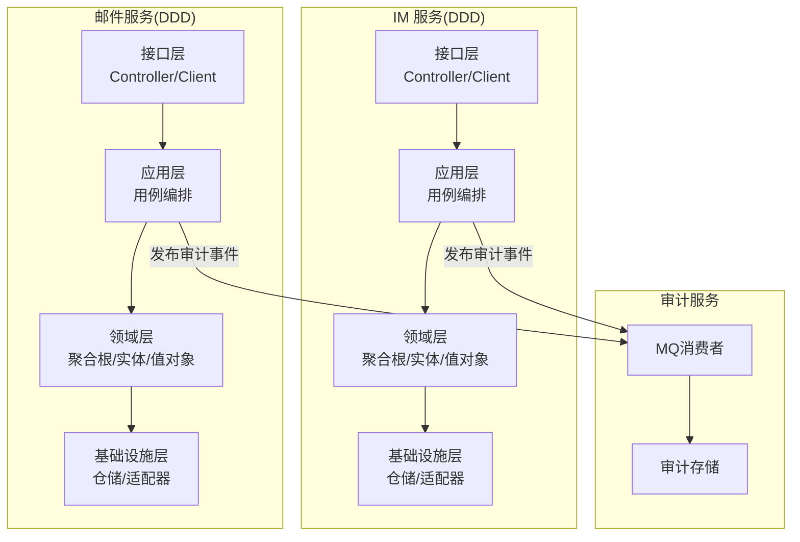
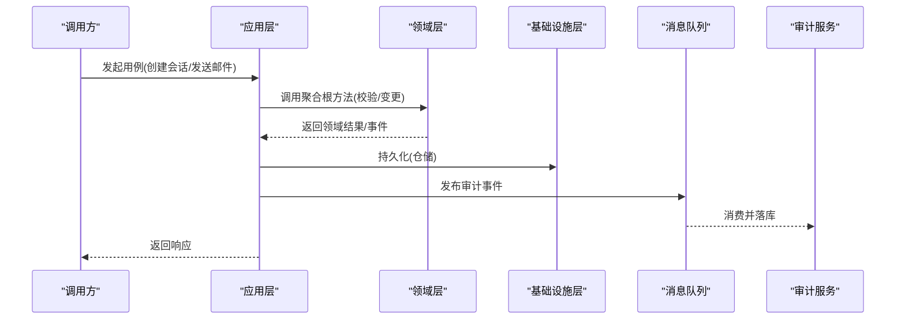
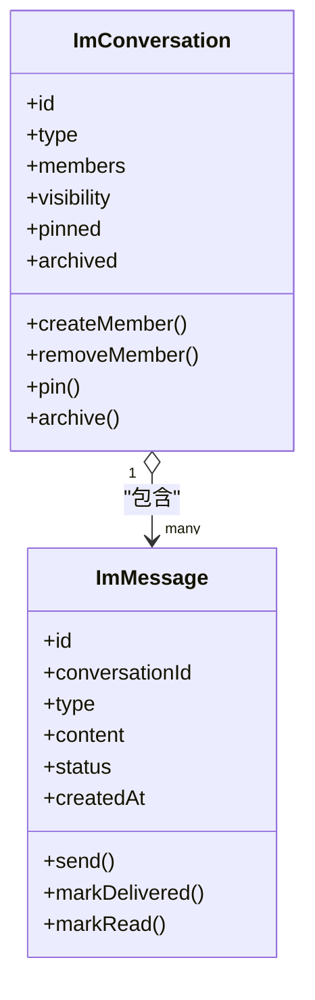
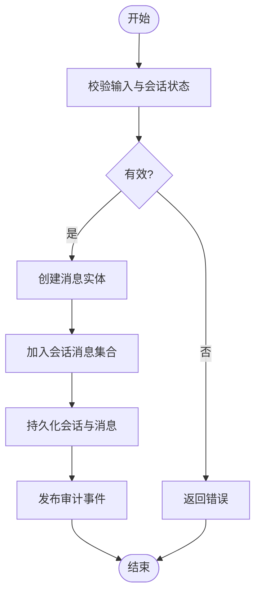
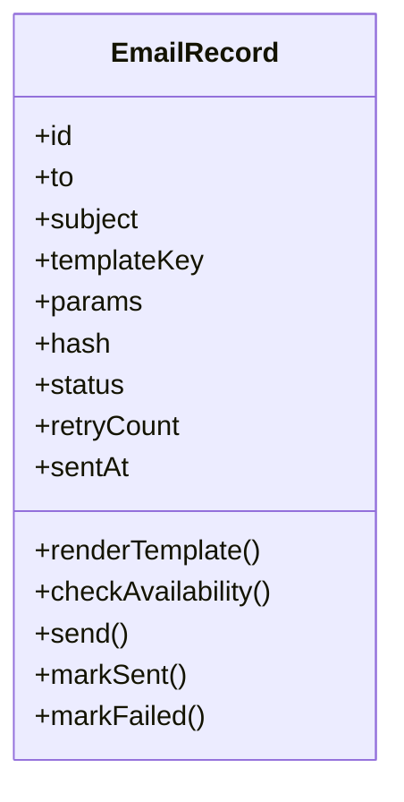
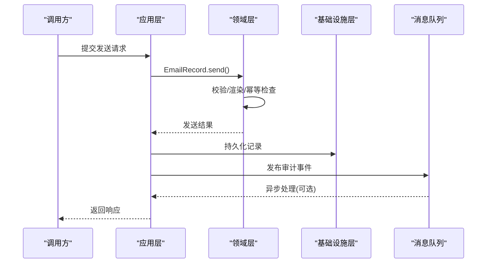
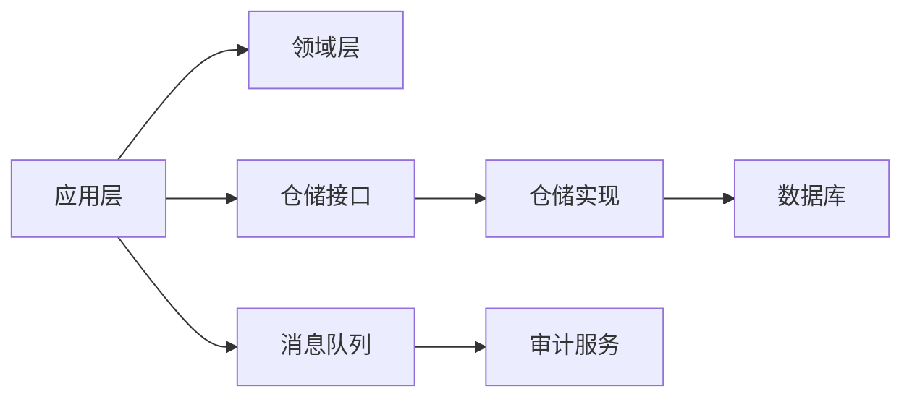
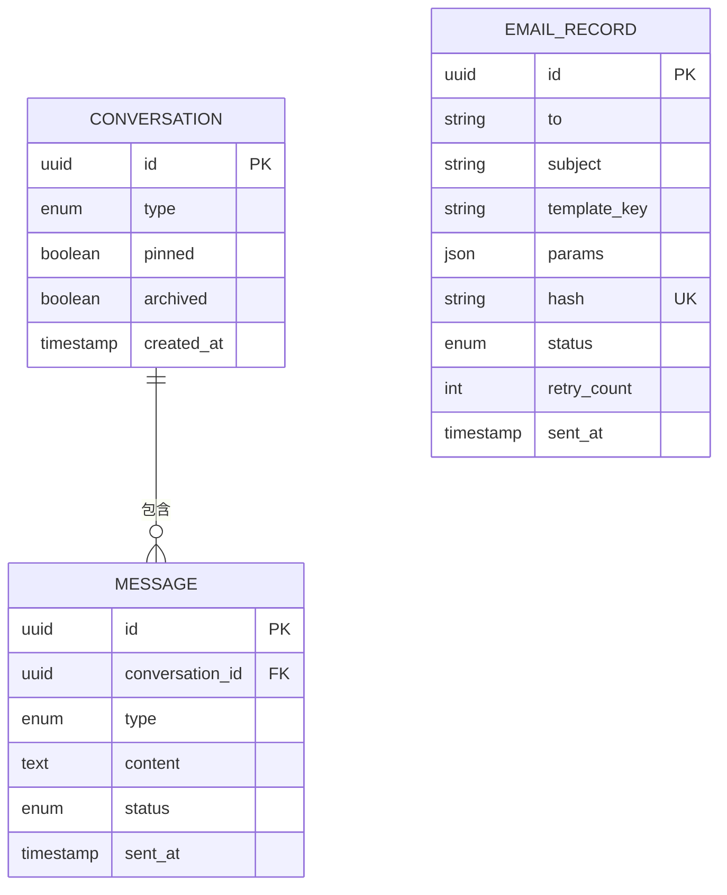

# 领域建模

<cite>
**本文引用的文件**   
- [zxyz-im-service/src/main/java/uno/acloud/im/domain/model/ImConversation.java](file://ZXYZdatabaseBack/zxyz-im-service/src/main/java/uno/acloud/im/domain/model/ImConversation.java)
- [zxyz-im-service/src/main/java/uno/acloud/im/domain/model/ImMessage.java](file://ZXYZdatabaseBack/zxyz-im-service/src/main/java/uno/acloud/im/domain/model/ImMessage.java)
- [zxyz-email-service/src/main/java/uno/acloud/email/domain/entity/EmailRecord.java](file://ZXYZdatabaseBack/zxyz-email-service/src/main/java/uno/acloud/email/domain/entity/EmailRecord.java)
- [ZXYZdatabaseBack/ZXYZdatabaseBack/zxyz-email-service/src/main/java/uno/acloud/email/application/EmailDispatchService.java](file://ZXYZdatabaseBack/zxyz-email-service/src/main/java/uno/acloud/email/application/EmailDispatchService.java)
- [ZXYZdatabaseBack/ZXYZdatabaseBack/zxyz-email-service/src/main/java/uno/acloud/email/application/EmailRecordQueryService.java](file://ZXYZdatabaseBack/zxyz-email-service/src/main/java/uno/acloud/email/application/EmailRecordQueryService.java)
- [ZXYZdatabaseBack/ZXYZdatabaseBack/zxyz-email-service/src/main/resources/db/migration/V1__init_schema.sql](file://ZXYZdatabaseBack/ZXYZdatabaseBack/zxyz-email-service/src/main/resources/db/migration/V1__init_schema.sql)
- [ZXYZdatabaseBack/ZXYZdatabaseBack/zxyz-email-service/src/main/resources/db/migration/V2__add_operate_log_before_after_values.sql](file://ZXYZdatabaseBack/ZXYZdatabaseBack/zxyz-email-service/src/main/resources/db/migration/V2__add_operate_log_before_after_values.sql)
- [ZXYZdatabaseBack/ZXYZdatabaseBack/zxyz-email-service/src/main/resources/db/migration/V3__add_message_hash_unique.sql](file://ZXYZdatabaseBack/ZXYZdatabaseBack/zxyz-email-service/src/main/resources/db/migration/V3__add_message_hash_unique.sql)
- [ZXYZdatabaseBack/ZXYZdatabaseBack/zxyz-im-service/src/main/resources/db/migration/V1__init_im_schema.sql](file://ZXYZdatabaseBack/ZXYZdatabaseBack/zxyz-im-service/src/main/resources/db/migration/V1__init_im_schema.sql)
- [ZXYZdatabaseBack/ZXYZdatabaseBack/zxyz-im-service/src/main/resources/db/migration/V2__add_conversation_type.sql](file://ZXYZdatabaseBack/ZXYZdatabaseBack/zxyz-im-service/src/main/resources/db/migration/V2__add_conversation_type.sql)
- [ZXYZdatabaseBack/ZXYZdatabaseBack/zxyz-im-service/src/main/resources/db/migration/V3__add_message_status.sql](file://ZXYZdatabaseBack/ZXYZdatabaseBack/zxyz-im-service/src/main/resources/db/migration/V3__add_message_status.sql)
- [ZXYZdatabaseBack/ZXYZdatabaseBack/zxyz-im-service/src/main/resources/db/migration/V4__add_message_index.sql](file://ZXYZdatabaseBack/ZXYZdatabaseBack/zxyz-im-service/src/main/resources/db/migration/V4__add_message_index.sql)
- [ZXYZdatabaseBack/ZXYZdatabaseBack/zxyz-common/src/main/java/uno/acloud/common/event/AuditEventPublisher.java](file://ZXYZdatabaseBack/ZXYZdatabaseBack/zxyz-common/src/main/java/uno/acloud/common/event/AuditEventPublisher.java)
- [ZXYZdatabaseBack/ZXYZdatabaseBack/zxyz-audit-service/src/main/java/uno/acloud/audit/mq/OperateLogConsumer.java](file://ZXYZdatabaseBack/ZXYZdatabaseBack/zxyz-audit-service/src/main/java/uno/acloud/audit/mq/OperateLogConsumer.java)
</cite>

## 目录
1. [引言](#引言)
2. [项目结构](#项目结构)
3. [核心组件](#核心组件)
4. [架构总览](#架构总览)
5. [详细组件分析](#详细组件分析)
6. [依赖分析](#依赖分析)
7. [性能考虑](#性能考虑)
8. [故障排查指南](#故障排查指南)
9. [结论](#结论)
10. [附录](#附录)

## 引言
本领域建模文档面向 ZXYZ 项目的后端服务，聚焦于 DDD 风格下的实体（Entity）、值对象（Value Object）与聚合根（Aggregate Root）的设计与实现。重点以即时通讯领域的 ImConversation、ImMessage 以及邮件领域的 EmailRecord 为例，阐述如何识别业务实体、定义属性约束与业务方法，划分聚合边界并通过聚合根保证一致性。同时给出领域模型的演进策略与版本管理方式，并说明领域模型与数据库表的映射关系与设计考量。

## 项目结构
ZXYZ 采用微服务架构，其中 im-service 与 email-service 遵循 DDD 分层（interfaces → application → domain → infrastructure），其他服务采用传统分层。DDD 层内：
- domain：聚合根、实体、值对象、领域服务与仓储接口
- application：用例编排、事务边界、防腐层
- infrastructure：持久化、消息队列、外部系统适配
- interfaces：对外暴露的控制器或客户端

图表来源
- [zxyz-im-service/src/main/java/uno/acloud/im/domain/model/ImConversation.java](file://ZXYZdatabaseBack/zxyz-im-service/src/main/java/uno/acloud/im/domain/model/ImConversation.java)
- [zxyz-email-service/src/main/java/uno/acloud/email/domain/entity/EmailRecord.java](file://ZXYZdatabaseBack/zxyz-email-service/src/main/java/uno/acloud/email/domain/entity/EmailRecord.java)
- [ZXYZdatabaseBack/ZXYZdatabaseBack/zxyz-common/src/main/java/uno/acloud/common/event/AuditEventPublisher.java](file://ZXYZdatabaseBack/ZXYZdatabaseBack/zxyz-common/src/main/java/uno/acloud/common/event/AuditEventPublisher.java)
- [ZXYZdatabaseBack/ZXYZdatabaseBack/zxyz-audit-service/src/main/java/uno/acloud/audit/mq/OperateLogConsumer.java](file://ZXYZdatabaseBack/ZXYZdatabaseBack/zxyz-audit-service/src/main/java/uno/acloud/audit/mq/OperateLogConsumer.java)

章节来源
- [zxyz-im-service/src/main/java/uno/acloud/im/domain/model/ImConversation.java](file://ZXYZdatabaseBack/zxyz-im-service/src/main/java/uno/acloud/im/domain/model/ImConversation.java)
- [zxyz-email-service/src/main/java/uno/acloud/email/domain/entity/EmailRecord.java](file://ZXYZdatabaseBack/zxyz-email-service/src/main/java/uno/acloud/email/domain/entity/EmailRecord.java)

## 核心组件
本节概述两个关键聚合及其成员：
- IM 聚合：ImConversation（聚合根）、ImMessage（实体）。聚合负责会话生命周期、成员管理与消息一致性。
- 邮件记录：EmailRecord（实体/聚合根）。聚合负责发送流程、幂等与状态流转。

设计要点
- 实体：拥有唯一标识与生命周期，承载业务状态与行为
- 值对象：不可变、按值比较，用于表达约束与语义（如邮箱地址、消息类型、状态枚举）
- 聚合根：协调内部实体的变更，维护不变式，作为事务边界
- 领域服务：跨聚合或无状态的业务规则封装
- 仓储接口：抽象持久化细节，供应用层调用

章节来源
- [zxyz-im-service/src/main/java/uno/acloud/im/domain/model/ImConversation.java](file://ZXYZdatabaseBack/zxyz-im-service/src/main/java/uno/acloud/im/domain/model/ImConversation.java)
- [zxyz-im-service/src/main/java/uno/acloud/im/domain/model/ImMessage.java](file://ZXYZdatabaseBack/zxyz-im-service/src/main/java/uno/acloud/im/domain/model/ImMessage.java)
- [zxyz-email-service/src/main/java/uno/acloud/email/domain/entity/EmailRecord.java](file://ZXYZdatabaseBack/zxyz-email-service/src/main/java/uno/acloud/email/domain/entity/EmailRecord.java)

## 架构总览
下图展示 IM 与邮件服务的领域层与应用层交互，以及通过审计事件进行异步解耦的整体流程。

图表来源
- [ZXYZdatabaseBack/ZXYZdatabaseBack/zxyz-common/src/main/java/uno/acloud/common/event/AuditEventPublisher.java](file://ZXYZdatabaseBack/ZXYZdatabaseBack/zxyz-common/src/main/java/uno/acloud/common/event/AuditEventPublisher.java)
- [ZXYZdatabaseBack/ZXYZdatabaseBack/zxyz-audit-service/src/main/java/uno/acloud/audit/mq/OperateLogConsumer.java](file://ZXYZdatabaseBack/ZXYZdatabaseBack/zxyz-audit-service/src/main/java/uno/acloud/audit/mq/OperateLogConsumer.java)

## 详细组件分析

### IM 聚合：ImConversation 与 ImMessage
- 聚合根：ImConversation
  - 职责：会话创建、成员增删、可见性控制、置顶/归档、消息路由与排序
  - 不变式：同一会话内消息有序；成员权限与可见性一致；删除/归档后状态不可逆
- 实体：ImMessage
  - 职责：消息内容、类型、状态、时间戳、附件引用
  - 不变式：消息状态机（草稿→已发送→已送达→已读）；同一会话内幂等投递

图表来源
- [zxyz-im-service/src/main/java/uno/acloud/im/domain/model/ImConversation.java](file://ZXYZdatabaseBack/zxyz-im-service/src/main/java/uno/acloud/im/domain/model/ImConversation.java)
- [zxyz-im-service/src/main/java/uno/acloud/im/domain/model/ImMessage.java](file://ZXYZdatabaseBack/zxyz-im-service/src/main/java/uno/acloud/im/domain/model/ImMessage.java)

#### 数据流与一致性
- 应用层在事务中调用聚合根方法，确保成员与消息的一致性
- 消息状态变更由聚合根统一调度，避免并发冲突
- 审计事件异步发布，不影响主流程一致性

图表来源
- [zxyz-im-service/src/main/java/uno/acloud/im/domain/model/ImConversation.java](file://ZXYZdatabaseBack/zxyz-im-service/src/main/java/uno/acloud/im/domain/model/ImConversation.java)
- [zxyz-im-service/src/main/java/uno/acloud/im/domain/model/ImMessage.java](file://ZXYZdatabaseBack/zxyz-im-service/src/main/java/uno/acloud/im/domain/model/ImMessage.java)

章节来源
- [zxyz-im-service/src/main/java/uno/acloud/im/domain/model/ImConversation.java](file://ZXYZdatabaseBack/zxyz-im-service/src/main/java/uno/acloud/im/domain/model/ImConversation.java)
- [zxyz-im-service/src/main/java/uno/acloud/im/domain/model/ImMessage.java](file://ZXYZdatabaseBack/zxyz-im-service/src/main/java/uno/acloud/im/domain/model/ImMessage.java)

### 邮件记录：EmailRecord
- 实体/聚合根：EmailRecord
  - 职责：邮件模板渲染、发送可用性检查、幂等去重、发送状态追踪
  - 不变式：同一请求幂等（基于消息哈希）；发送失败重试上限；敏感信息加密存储

图表来源
- [zxyz-email-service/src/main/java/uno/acloud/email/domain/entity/EmailRecord.java](file://ZXYZdatabaseBack/zxyz-email-service/src/main/java/uno/acloud/email/domain/entity/EmailRecord.java)

#### 发送流程序列图

图表来源
- [ZXYZdatabaseBack/ZXYZdatabaseBack/zxyz-email-service/src/main/java/uno/acloud/email/application/EmailDispatchService.java](file://ZXYZdatabaseBack/ZXYZdatabaseBack/zxyz-email-service/src/main/java/uno/acloud/email/application/EmailDispatchService.java)
- [zxyz-email-service/src/main/java/uno/acloud/email/domain/entity/EmailRecord.java](file://ZXYZdatabaseBack/zxyz-email-service/src/main/java/uno/acloud/email/domain/entity/EmailRecord.java)

章节来源
- [zxyz-email-service/src/main/java/uno/acloud/email/domain/entity/EmailRecord.java](file://ZXYZdatabaseBack/zxyz-email-service/src/main/java/uno/acloud/email/domain/entity/EmailRecord.java)
- [ZXYZdatabaseBack/ZXYZdatabaseBack/zxyz-email-service/src/main/java/uno/acloud/email/application/EmailDispatchService.java](file://ZXYZdatabaseBack/ZXYZdatabaseBack/zxyz-email-service/src/main/java/uno/acloud/email/application/EmailDispatchService.java)

### 查询与投影：EmailRecordQueryService
- 职责：提供面向调用方的投影 VO，屏蔽领域细节
- 原则：窄端点 + 投影模式，禁止返回胖 DTO；字段按需裁剪

章节来源
- [ZXYZdatabaseBack/ZXYZdatabaseBack/zxyz-email-service/src/main/java/uno/acloud/email/application/EmailRecordQueryService.java](file://ZXYZdatabaseBack/ZXYZdatabaseBack/zxyz-email-service/src/main/java/uno/acloud/email/application/EmailRecordQueryService.java)

## 依赖分析
- 领域层依赖：值对象与实体之间强内聚，聚合根协调内部实体变更
- 应用层依赖：聚合根与仓储接口，不感知基础设施实现
- 基础设施层依赖：仓储实现、消息队列、外部服务客户端
- 跨服务依赖：通过 ServiceClient + X-Internal-Service-Token 鉴权；异步通过 RabbitMQ Topic Exchange zxyz.topic

图表来源
- [ZXYZdatabaseBack/ZXYZdatabaseBack/zxyz-common/src/main/java/uno/acloud/common/event/AuditEventPublisher.java](file://ZXYZdatabaseBack/ZXYZdatabaseBack/zxyz-common/src/main/java/uno/acloud/common/event/AuditEventPublisher.java)
- [ZXYZdatabaseBack/ZXYZdatabaseBack/zxyz-audit-service/src/main/java/uno/acloud/audit/mq/OperateLogConsumer.java](file://ZXYZdatabaseBack/ZXYZdatabaseBack/zxyz-audit-service/src/main/java/uno/acloud/audit/mq/OperateLogConsumer.java)

章节来源
- [ZXYZdatabaseBack/ZXYZdatabaseBack/zxyz-common/src/main/java/uno/acloud/common/event/AuditEventPublisher.java](file://ZXYZdatabaseBack/ZXYZdatabaseBack/zxyz-common/src/main/java/uno/acloud/common/event/AuditEventPublisher.java)
- [ZXYZdatabaseBack/ZXYZdatabaseBack/zxyz-audit-service/src/main/java/uno/acloud/audit/mq/OperateLogConsumer.java](file://ZXYZdatabaseBack/ZXYZdatabaseBack/zxyz-audit-service/src/main/java/uno/acloud/audit/mq/OperateLogConsumer.java)

## 性能考虑
- 聚合内操作尽量在单事务内完成，减少跨聚合锁竞争
- 消息索引优化：为高频查询字段建立复合索引（会话ID+时间戳）
- 幂等键与去重表：避免重复发送与重复写入
- 异步解耦：审计与通知走 MQ，降低主链路延迟
- 投影裁剪：仅返回必要字段，减少序列化与传输开销

[本节为通用指导，无需特定文件来源]

## 故障排查指南
- 幂等失败：检查消息哈希是否唯一，确认去重逻辑与索引
- 状态不一致：核对聚合根状态机与仓储更新顺序
- 审计缺失：确认事件发布与消费者订阅配置正确
- 权限异常：验证会话成员与可见性规则

章节来源
- [ZXYZdatabaseBack/ZXYZdatabaseBack/zxyz-common/src/main/java/uno/acloud/common/event/AuditEventPublisher.java](file://ZXYZdatabaseBack/ZXYZdatabaseBack/zxyz-common/src/main/java/uno/acloud/common/event/AuditEventPublisher.java)
- [ZXYZdatabaseBack/ZXYZdatabaseBack/zxyz-audit-service/src/main/java/uno/acloud/audit/mq/OperateLogConsumer.java](file://ZXYZdatabaseBack/ZXYZdatabaseBack/zxyz-audit-service/src/main/java/uno/acloud/audit/mq/OperateLogConsumer.java)

## 结论
通过对 ImConversation、ImMessage 与 EmailRecord 的领域建模，明确了实体、值对象与聚合根的边界与职责。应用层通过聚合根保证一致性，基础设施层提供持久化与异步能力。结合迁移脚本与幂等机制，实现了可演进的领域模型与稳定的数据一致性。

[本节为总结，无需特定文件来源]

## 附录

### 领域模型与数据库映射
- IM 表结构
  - conversation：会话基本信息（类型、可见性、置顶、归档）
  - message：消息内容、类型、状态、时间戳
- 邮件表结构
  - email_record：收件人、主题、模板、参数、哈希、状态、重试次数、发送时间

图表来源
- [ZXYZdatabaseBack/ZXYZdatabaseBack/zxyz-im-service/src/main/resources/db/migration/V1__init_im_schema.sql](file://ZXYZdatabaseBack/ZXYZdatabaseBack/zxyz-im-service/src/main/resources/db/migration/V1__init_im_schema.sql)
- [ZXYZdatabaseBack/ZXYZdatabaseBack/zxyz-im-service/src/main/resources/db/migration/V2__add_conversation_type.sql](file://ZXYZdatabaseBack/ZXYZdatabaseBack/zxyz-im-service/src/main/resources/db/migration/V2__add_conversation_type.sql)
- [ZXYZdatabaseBack/ZXYZdatabaseBack/zxyz-im-service/src/main/resources/db/migration/V3__add_message_status.sql](file://ZXYZdatabaseBack/ZXYZdatabaseBack/zxyz-im-service/src/main/resources/db/migration/V3__add_message_status.sql)
- [ZXYZdatabaseBack/ZXYZdatabaseBack/zxyz-im-service/src/main/resources/db/migration/V4__add_message_index.sql](file://ZXYZdatabaseBack/ZXYZdatabaseBack/zxyz-im-service/src/main/resources/db/migration/V4__add_message_index.sql)
- [ZXYZdatabaseBack/ZXYZdatabaseBack/zxyz-email-service/src/main/resources/db/migration/V1__init_schema.sql](file://ZXYZdatabaseBack/ZXYZdatabaseBack/zxyz-email-service/src/main/resources/db/migration/V1__init_schema.sql)
- [ZXYZdatabaseBack/ZXYZdatabaseBack/zxyz-email-service/src/main/resources/db/migration/V2__add_operate_log_before_after_values.sql](file://ZXYZdatabaseBack/ZXYZdatabaseBack/zxyz-email-service/src/main/resources/db/migration/V2__add_operate_log_before_after_values.sql)
- [ZXYZdatabaseBack/ZXYZdatabaseBack/zxyz-email-service/src/main/resources/db/migration/V3__add_message_hash_unique.sql](file://ZXYZdatabaseBack/ZXYZdatabaseBack/zxyz-email-service/src/main/resources/db/migration/V3__add_message_hash_unique.sql)

### 领域模型演进与版本管理
- 使用 Flyway 迁移脚本管理数据库版本，增量演进字段与索引
- 领域模型向后兼容：新增字段默认值，废弃字段软删除
- 幂等键与哈希索引保障重复请求安全
- 审计日志记录变更前后的值，便于回溯与合规

章节来源
- [ZXYZdatabaseBack/ZXYZdatabaseBack/zxyz-email-service/src/main/resources/db/migration/V1__init_schema.sql](file://ZXYZdatabaseBack/ZXYZdatabaseBack/zxyz-email-service/src/main/resources/db/migration/V1__init_schema.sql)
- [ZXYZdatabaseBack/ZXYZdatabaseBack/zxyz-email-service/src/main/resources/db/migration/V2__add_operate_log_before_after_values.sql](file://ZXYZdatabaseBack/ZXYZdatabaseBack/zxyz-email-service/src/main/resources/db/migration/V2__add_operate_log_before_after_values.sql)
- [ZXYZdatabaseBack/ZXYZdatabaseBack/zxyz-email-service/src/main/resources/db/migration/V3__add_message_hash_unique.sql](file://ZXYZdatabaseBack/ZXYZdatabaseBack/zxyz-email-service/src/main/resources/db/migration/V3__add_message_hash_unique.sql)
- [ZXYZdatabaseBack/ZXYZdatabaseBack/zxyz-im-service/src/main/resources/db/migration/V1__init_im_schema.sql](file://ZXYZdatabaseBack/ZXYZdatabaseBack/zxyz-im-service/src/main/resources/db/migration/V1__init_im_schema.sql)
- [ZXYZdatabaseBack/ZXYZdatabaseBack/zxyz-im-service/src/main/resources/db/migration/V2__add_conversation_type.sql](file://ZXYZdatabaseBack/ZXYZdatabaseBack/zxyz-im-service/src/main/resources/db/migration/V2__add_conversation_type.sql)
- [ZXYZdatabaseBack/ZXYZdatabaseBack/zxyz-im-service/src/main/resources/db/migration/V3__add_message_status.sql](file://ZXYZdatabaseBack/ZXYZdatabaseBack/zxyz-im-service/src/main/resources/db/migration/V3__add_message_status.sql)
- [ZXYZdatabaseBack/ZXYZdatabaseBack/zxyz-im-service/src/main/resources/db/migration/V4__add_message_index.sql](file://ZXYZdatabaseBack/ZXYZdatabaseBack/zxyz-im-service/src/main/resources/db/migration/V4__add_message_index.sql)