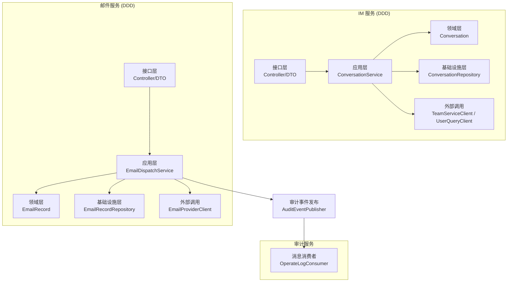
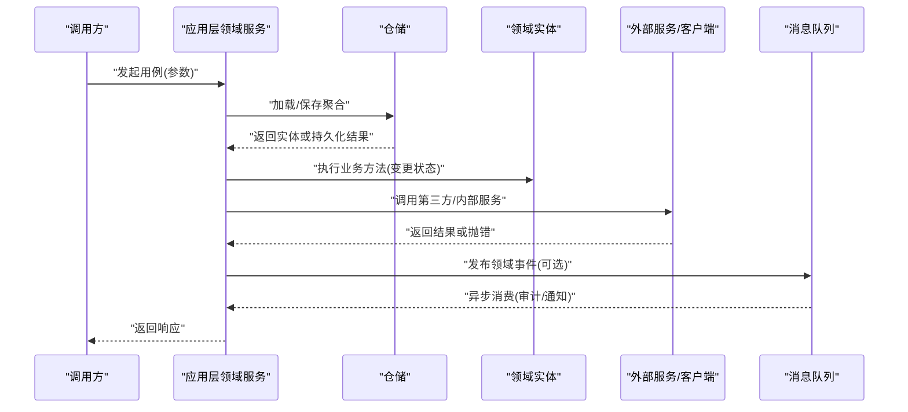
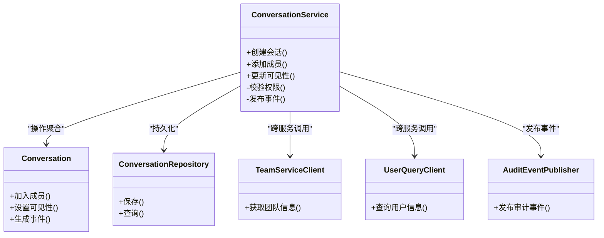
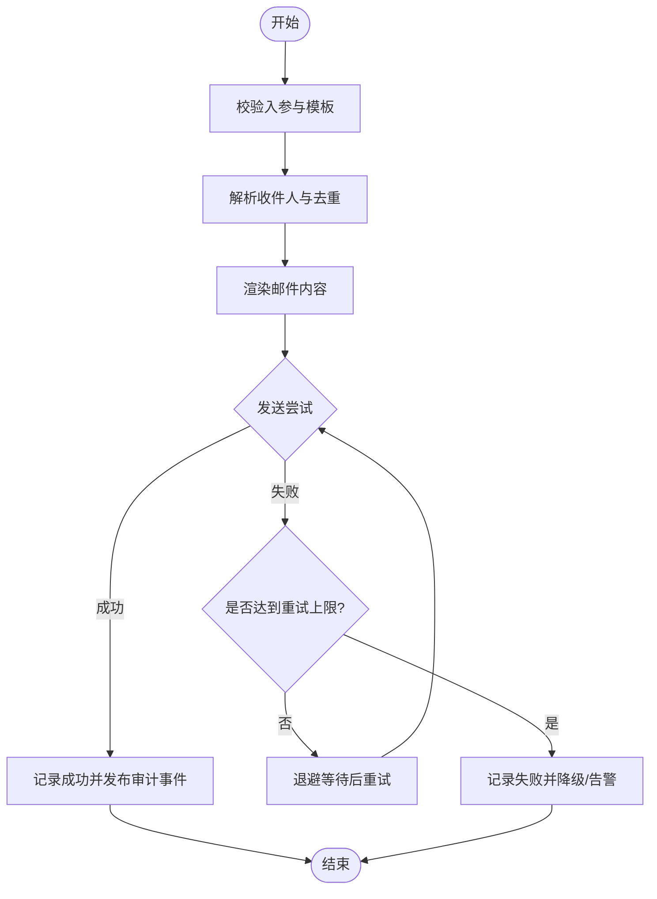
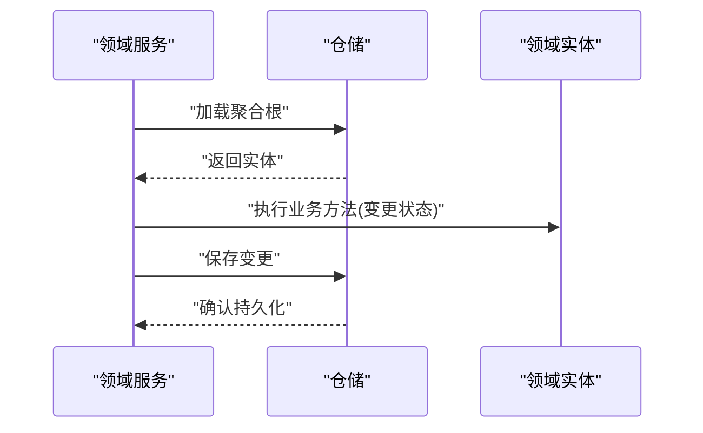
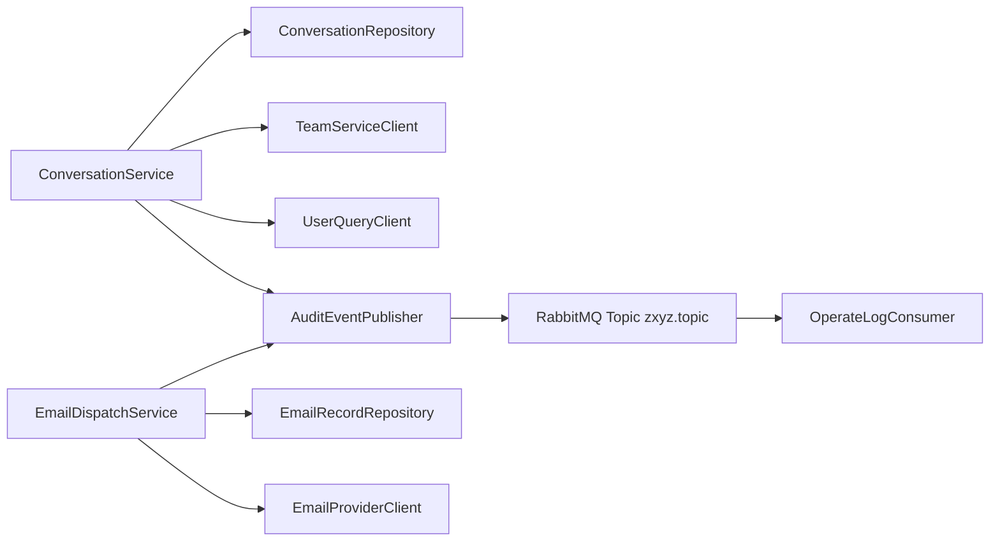

# 领域服务

<cite>
**本文引用的文件**   
- [zxyz-email-service/src/main/java/uno/acloud/email/application/EmailDispatchService.java](file://ZXYZdatabaseBack/zxyz-email-service/src/main/java/uno/acloud/email/application/EmailDispatchService.java)
- [zxyz-email-service/src/main/java/uno/acloud/email/domain/EmailRecord.java](file://ZXYZdatabaseBack/zxyz-email-service/src/main/java/uno/acloud/email/domain/EmailRecord.java)
- [zxyz-email-service/src/main/java/uno/acloud/email/infrastructure/repository/EmailRecordRepository.java](file://ZXYZdatabaseBack/zxyz-email-service/src/main/java/uno/acloud/email/infrastructure/repository/EmailRecordRepository.java)
- [zxyz-email-service/src/main/java/uno/acloud/email/provider/EmailProviderClient.java](file://ZXYZdatabaseBack/zxyz-email-service/src/main/java/uno/acloud/email/provider/EmailProviderClient.java)
- [zxyz-im-service/src/main/java/uno/acloud/im/application/ConversationService.java](file://ZXYZdatabaseBack/zxyz-im-service/src/main/java/uno/acloud/im/application/ConversationService.java)
- [zxyz-im-service/src/main/java/uno/acloud/im/domain/conversation/Conversation.java](file://ZXYZdatabaseBack/zxyz-im-service/src/main/java/uno/acloud/im/domain/conversation/Conversation.java)
- [zxyz-im-service/src/main/java/uno/acloud/im/infrastructure/repository/ConversationRepository.java](file://ZXYZdatabaseBack/zxyz-im-service/src/main/java/uno/acloud/im/infrastructure/repository/ConversationRepository.java)
- [zxyz-common/src/main/java/uno/acloud/client/TeamServiceClient.java](file://ZXYZdatabaseBack/zxyz-common/src/main/java/uno/acloud/client/TeamServiceClient.java)
- [zxyz-common/src/main/java/uno/acloud/client/UserQueryClient.java](file://ZXYZdatabaseBack/zxyz-common/src/main/java/uno/acloud/client/UserQueryClient.java)
- [zxyz-common/src/main/java/uno/acloud/common/event/AuditEventPublisher.java](file://ZXYZdatabaseBack/zxyz-common/src/main/java/uno/acloud/common/event/AuditEventPublisher.java)
- [zxyz-audit-service/src/main/java/uno/acloud/audit/mq/OperateLogConsumer.java](file://ZXYZdatabaseBack/zxyz-audit-service/src/main/java/uno/acloud/audit/mq/OperateLogConsumer.java)
- [zxyz-email-service/src/test/java/uno/acloud/email/application/EmailDispatchServiceTest.java](file://ZXYZdatabaseBack/zxyz-email-service/src/test/java/uno/acloud/email/application/EmailDispatchServiceTest.java)
- [zxyz-im-service/src/test/java/uno/acloud/im/application/ConversationServiceTest.java](file://ZXYZdatabaseBack/zxyz-im-service/src/test/java/uno/acloud/im/application/ConversationServiceTest.java)
</cite>

## 目录
1. [引言](#引言)
2. [项目结构](#项目结构)
3. [核心组件](#核心组件)
4. [架构总览](#架构总览)
5. [详细组件分析](#详细组件分析)
6. [依赖关系分析](#依赖关系分析)
7. [性能考量](#性能考量)
8. [故障排查指南](#故障排查指南)
9. [结论](#结论)
10. [附录](#附录)

## 引言
本文件面向 ZXYZ 项目的领域服务设计与实现，聚焦 DDD 风格下的跨聚合协调、复杂业务规则封装与流程编排。以 ConversationService（IM 会话）与 EmailDispatchService（邮件分发）为例，说明领域服务在应用层如何编排领域实体、仓储与外部提供者，并给出事务管理、异常处理与性能优化的实践建议。同时解释领域服务在 DDD 分层中的位置与作用边界。

## 项目结构
ZXYZ 采用微服务架构，部分服务（im-service、email-service）遵循 DDD 分层：interfaces → application → domain → infrastructure；其余服务为传统分层。DDD 风格下：
- application 层暴露用例（Use Case），由领域服务编排业务流程
- domain 层定义聚合根、实体与领域事件
- infrastructure 层提供仓储接口与外部系统适配

图表来源
- [zxyz-im-service/src/main/java/uno/acloud/im/application/ConversationService.java](file://ZXYZdatabaseBack/zxyz-im-service/src/main/java/uno/acloud/im/application/ConversationService.java)
- [zxyz-im-service/src/main/java/uno/acloud/im/domain/conversation/Conversation.java](file://ZXYZdatabaseBack/zxyz-im-service/src/main/java/uno/acloud/im/domain/conversation/Conversation.java)
- [zxyz-im-service/src/main/java/uno/acloud/im/infrastructure/repository/ConversationRepository.java](file://ZXYZdatabaseBack/zxyz-im-service/src/main/java/uno/acloud/im/infrastructure/repository/ConversationRepository.java)
- [zxyz-email-service/src/main/java/uno/acloud/email/application/EmailDispatchService.java](file://ZXYZdatabaseBack/zxyz-email-service/src/main/java/uno/acloud/email/application/EmailDispatchService.java)
- [zxyz-email-service/src/main/java/uno/acloud/email/domain/EmailRecord.java](file://ZXYZdatabaseBack/zxyz-email-service/src/main/java/uno/acloud/email/domain/EmailRecord.java)
- [zxyz-email-service/src/main/java/uno/acloud/email/infrastructure/repository/EmailRecordRepository.java](file://ZXYZdatabaseBack/zxyz-email-service/src/main/java/uno/acloud/email/infrastructure/repository/EmailRecordRepository.java)
- [zxyz-common/src/main/java/uno/acloud/client/TeamServiceClient.java](file://ZXYZdatabaseBack/zxyz-common/src/main/java/uno/acloud/client/TeamServiceClient.java)
- [zxyz-common/src/main/java/uno/acloud/client/UserQueryClient.java](file://ZXYZdatabaseBack/zxyz-common/src/main/java/uno/acloud/client/UserQueryClient.java)
- [zxyz-common/src/main/java/uno/acloud/common/event/AuditEventPublisher.java](file://ZXYZdatabaseBack/zxyz-common/src/main/java/uno/acloud/common/event/AuditEventPublisher.java)
- [zxyz-audit-service/src/main/java/uno/acloud/audit/mq/OperateLogConsumer.java](file://ZXYZdatabaseBack/zxyz-audit-service/src/main/java/uno/acloud/audit/mq/OperateLogConsumer.java)

章节来源
- [zxyz-email-service/src/main/java/uno/acloud/email/application/EmailDispatchService.java](file://ZXYZdatabaseBack/zxyz-email-service/src/main/java/uno/acloud/email/application/EmailDispatchService.java)
- [zxyz-im-service/src/main/java/uno/acloud/im/application/ConversationService.java](file://ZXYZdatabaseBack/zxyz-im-service/src/main/java/uno/acloud/im/application/ConversationService.java)

## 核心组件
- 领域服务（Application Service）
  - 职责：编排跨聚合的业务流程、封装复杂业务规则、协调仓储与外部服务、保证事务边界与一致性策略
  - 典型代表：ConversationService、EmailDispatchService
- 领域实体（Domain Entity）
  - 职责：承载领域状态与不变式，对外暴露行为方法
  - 典型代表：Conversation、EmailRecord
- 仓储（Repository）
  - 职责：抽象数据访问，屏蔽持久化细节
  - 典型代表：ConversationRepository、EmailRecordRepository
- 外部客户端（ServiceClient）
  - 职责：封装跨服务调用与错误映射
  - 典型代表：TeamServiceClient、UserQueryClient、EmailProviderClient
- 事件发布（Event Publisher）
  - 职责：解耦副作用（如审计日志、通知）
  - 典型代表：AuditEventPublisher

章节来源
- [zxyz-email-service/src/main/java/uno/acloud/email/application/EmailDispatchService.java](file://ZXYZdatabaseBack/zxyz-email-service/src/main/java/uno/acloud/email/application/EmailDispatchService.java)
- [zxyz-im-service/src/main/java/uno/acloud/im/application/ConversationService.java](file://ZXYZdatabaseBack/zxyz-im-service/src/main/java/uno/acloud/im/application/ConversationService.java)
- [zxyz-email-service/src/main/java/uno/acloud/email/domain/EmailRecord.java](file://ZXYZdatabaseBack/zxyz-email-service/src/main/java/uno/acloud/email/domain/EmailRecord.java)
- [zxyz-im-service/src/main/java/uno/acloud/im/domain/conversation/Conversation.java](file://ZXYZdatabaseBack/zxyz-im-service/src/main/java/uno/acloud/im/domain/conversation/Conversation.java)
- [zxyz-email-service/src/main/java/uno/acloud/email/infrastructure/repository/EmailRecordRepository.java](file://ZXYZdatabaseBack/zxyz-email-service/src/main/java/uno/acloud/email/infrastructure/repository/EmailRecordRepository.java)
- [zxyz-im-service/src/main/java/uno/acloud/im/infrastructure/repository/ConversationRepository.java](file://ZXYZdatabaseBack/zxyz-im-service/src/main/java/uno/acloud/im/infrastructure/repository/ConversationRepository.java)
- [zxyz-common/src/main/java/uno/acloud/client/TeamServiceClient.java](file://ZXYZdatabaseBack/zxyz-common/src/main/java/uno/acloud/client/TeamServiceClient.java)
- [zxyz-common/src/main/java/uno/acloud/client/UserQueryClient.java](file://ZXYZdatabaseBack/zxyz-common/src/main/java/uno/acloud/client/UserQueryClient.java)
- [zxyz-common/src/main/java/uno/acloud/common/event/AuditEventPublisher.java](file://ZXYZdatabaseBack/zxyz-common/src/main/java/uno/acloud/common/event/AuditEventPublisher.java)

## 架构总览
领域服务位于应用层，作为用例的编排者：
- 从请求入口接收参数，校验输入
- 通过仓储加载或创建领域实体，执行业务不变式
- 必要时调用其他服务的客户端进行跨聚合协作
- 将领域事件发布到消息总线，完成异步副作用
- 统一异常与事务边界，确保一致性与可观测性

图表来源
- [zxyz-email-service/src/main/java/uno/acloud/email/application/EmailDispatchService.java](file://ZXYZdatabaseBack/zxyz-email-service/src/main/java/uno/acloud/email/application/EmailDispatchService.java)
- [zxyz-im-service/src/main/java/uno/acloud/im/application/ConversationService.java](file://ZXYZdatabaseBack/zxyz-im-service/src/main/java/uno/acloud/im/application/ConversationService.java)
- [zxyz-common/src/main/java/uno/acloud/common/event/AuditEventPublisher.java](file://ZXYZdatabaseBack/zxyz-common/src/main/java/uno/acloud/common/event/AuditEventPublisher.java)

## 详细组件分析

### ConversationService（会话领域服务）
- 职责
  - 编排会话生命周期：创建、成员管理、可见性同步等
  - 跨聚合协作：与团队、用户服务交互，校验权限与上下文
  - 领域事件：发布会话变更事件，驱动审计与通知
- 关键交互
  - 通过 ConversationRepository 读写会话聚合
  - 通过 TeamServiceClient、UserQueryClient 获取团队与用户信息
  - 通过 AuditEventPublisher 发布审计事件

图表来源
- [zxyz-im-service/src/main/java/uno/acloud/im/application/ConversationService.java](file://ZXYZdatabaseBack/zxyz-im-service/src/main/java/uno/acloud/im/application/ConversationService.java)
- [zxyz-im-service/src/main/java/uno/acloud/im/domain/conversation/Conversation.java](file://ZXYZdatabaseBack/zxyz-im-service/src/main/java/uno/acloud/im/domain/conversation/Conversation.java)
- [zxyz-im-service/src/main/java/uno/acloud/im/infrastructure/repository/ConversationRepository.java](file://ZXYZdatabaseBack/zxyz-im-service/src/main/java/uno/acloud/im/infrastructure/repository/ConversationRepository.java)
- [zxyz-common/src/main/java/uno/acloud/client/TeamServiceClient.java](file://ZXYZdatabaseBack/zxyz-common/src/main/java/uno/acloud/client/TeamServiceClient.java)
- [zxyz-common/src/main/java/uno/acloud/client/UserQueryClient.java](file://ZXYZdatabaseBack/zxyz-common/src/main/java/uno/acloud/client/UserQueryClient.java)
- [zxyz-common/src/main/java/uno/acloud/common/event/AuditEventPublisher.java](file://ZXYZdatabaseBack/zxyz-common/src/main/java/uno/acloud/common/event/AuditEventPublisher.java)

章节来源
- [zxyz-im-service/src/main/java/uno/acloud/im/application/ConversationService.java](file://ZXYZdatabaseBack/zxyz-im-service/src/main/java/uno/acloud/im/application/ConversationService.java)
- [zxyz-im-service/src/test/java/uno/acloud/im/application/ConversationServiceTest.java](file://ZXYZdatabaseBack/zxyz-im-service/src/test/java/uno/acloud/im/application/ConversationServiceTest.java)

### EmailDispatchService（邮件分发领域服务）
- 职责
  - 编排邮件发送流程：模板渲染、收件人解析、发送执行、记录落库
  - 复杂规则：重试策略、失败回退、幂等控制
  - 审计与可观测性：发布审计事件，记录发送轨迹
- 关键交互
  - 通过 EmailRecordRepository 持久化发送记录
  - 通过 EmailProviderClient 调用邮件提供商
  - 通过 AuditEventPublisher 发布审计事件

图表来源
- [zxyz-email-service/src/main/java/uno/acloud/email/application/EmailDispatchService.java](file://ZXYZdatabaseBack/zxyz-email-service/src/main/java/uno/acloud/email/application/EmailDispatchService.java)
- [zxyz-email-service/src/main/java/uno/acloud/email/domain/EmailRecord.java](file://ZXYZdatabaseBack/zxyz-email-service/src/main/java/uno/acloud/email/domain/EmailRecord.java)
- [zxyz-email-service/src/main/java/uno/acloud/email/infrastructure/repository/EmailRecordRepository.java](file://ZXYZdatabaseBack/zxyz-email-service/src/main/java/uno/acloud/email/infrastructure/repository/EmailRecordRepository.java)
- [zxyz-email-service/src/main/java/uno/acloud/email/provider/EmailProviderClient.java](file://ZXYZdatabaseBack/zxyz-email-service/src/main/java/uno/acloud/email/provider/EmailProviderClient.java)
- [zxyz-common/src/main/java/uno/acloud/common/event/AuditEventPublisher.java](file://ZXYZdatabaseBack/zxyz-common/src/main/java/uno/acloud/common/event/AuditEventPublisher.java)

章节来源
- [zxyz-email-service/src/main/java/uno/acloud/email/application/EmailDispatchService.java](file://ZXYZdatabaseBack/zxyz-email-service/src/main/java/uno/acloud/email/application/EmailDispatchService.java)
- [zxyz-email-service/src/test/java/uno/acloud/email/application/EmailDispatchServiceTest.java](file://ZXYZdatabaseBack/zxyz-email-service/src/test/java/uno/acloud/email/application/EmailDispatchServiceTest.java)

### 领域服务与领域实体的协作方式
- 领域服务负责用例编排，不持有领域状态
- 领域实体维护不变式，对外暴露行为方法
- 仓储仅做数据存取，不包含业务逻辑
- 领域服务通过仓储加载实体，调用实体方法变更状态，再写回仓储

图表来源
- [zxyz-im-service/src/main/java/uno/acloud/im/application/ConversationService.java](file://ZXYZdatabaseBack/zxyz-im-service/src/main/java/uno/acloud/im/application/ConversationService.java)
- [zxyz-email-service/src/main/java/uno/acloud/email/application/EmailDispatchService.java](file://ZXYZdatabaseBack/zxyz-email-service/src/main/java/uno/acloud/email/application/EmailDispatchService.java)

## 依赖关系分析
- 内聚与耦合
  - 领域服务对仓储与外部客户端存在依赖，但通过接口隔离，保持高内聚低耦合
  - 事件发布用于解耦副作用，避免在领域服务中直接耦合消息中间件
- 跨服务调用
  - 使用 ServiceClient 进行窄端点调用，返回投影 VO，避免胖 DTO
  - 内部端点前缀 /api/internal/**，由网关鉴权过滤公网访问
- 事件流
  - 审计事件通过 AuditEventPublisher 发布，OperateLogConsumer 消费写入审计服务

图表来源
- [zxyz-im-service/src/main/java/uno/acloud/im/application/ConversationService.java](file://ZXYZdatabaseBack/zxyz-im-service/src/main/java/uno/acloud/im/application/ConversationService.java)
- [zxyz-email-service/src/main/java/uno/acloud/email/application/EmailDispatchService.java](file://ZXYZdatabaseBack/zxyz-email-service/src/main/java/uno/acloud/email/application/EmailDispatchService.java)
- [zxyz-common/src/main/java/uno/acloud/client/TeamServiceClient.java](file://ZXYZdatabaseBack/zxyz-common/src/main/java/uno/acloud/client/TeamServiceClient.java)
- [zxyz-common/src/main/java/uno/acloud/client/UserQueryClient.java](file://ZXYZdatabaseBack/zxyz-common/src/main/java/uno/acloud/client/UserQueryClient.java)
- [zxyz-common/src/main/java/uno/acloud/common/event/AuditEventPublisher.java](file://ZXYZdatabaseBack/zxyz-common/src/main/java/uno/acloud/common/event/AuditEventPublisher.java)
- [zxyz-audit-service/src/main/java/uno/acloud/audit/mq/OperateLogConsumer.java](file://ZXYZdatabaseBack/zxyz-audit-service/src/main/java/uno/acloud/audit/mq/OperateLogConsumer.java)

章节来源
- [zxyz-common/src/main/java/uno/acloud/client/TeamServiceClient.java](file://ZXYZdatabaseBack/zxyz-common/src/main/java/uno/acloud/client/TeamServiceClient.java)
- [zxyz-common/src/main/java/uno/acloud/client/UserQueryClient.java](file://ZXYZdatabaseBack/zxyz-common/src/main/java/uno/acloud/client/UserQueryClient.java)
- [zxyz-common/src/main/java/uno/acloud/common/event/AuditEventPublisher.java](file://ZXYZdatabaseBack/zxyz-common/src/main/java/uno/acloud/common/event/AuditEventPublisher.java)
- [zxyz-audit-service/src/main/java/uno/acloud/audit/mq/OperateLogConsumer.java](file://ZXYZdatabaseBack/zxyz-audit-service/src/main/java/uno/acloud/audit/mq/OperateLogConsumer.java)

## 性能考量
- 减少跨服务往返
  - 批量查询与缓存热点数据，降低 TeamServiceClient、UserQueryClient 调用频率
- 重试与退避
  - 对邮件发送等易失败操作实施指数退避与最大重试次数限制
- 异步化
  - 通过事件发布将非关键路径（审计、通知）异步化，缩短主流程时延
- 数据库访问优化
  - 合理设计仓储查询，避免 N+1 问题；使用分页与投影减少数据传输
- 资源限流
  - 对邮件提供商与外部 API 调用增加限流与熔断保护

[本节为通用指导，无需引用具体文件]

## 故障排查指南
- 常见问题定位
  - 跨服务调用失败：检查 ServiceClient 的错误映射与超时配置
  - 邮件发送失败：查看重试策略、退避间隔与提供商限流
  - 审计事件未消费：检查 RabbitMQ Topic 路由与消费者连接状态
- 调试建议
  - 在领域服务中记录关键步骤与异常堆栈
  - 使用单元测试覆盖边界条件与异常分支
- 测试参考
  - EmailDispatchService 的重试与失败路径可通过其测试用例验证
  - ConversationService 的成员管理与权限校验可通过其测试用例验证

章节来源
- [zxyz-email-service/src/test/java/uno/acloud/email/application/EmailDispatchServiceTest.java](file://ZXYZdatabaseBack/zxyz-email-service/src/test/java/uno/acloud/email/application/EmailDispatchServiceTest.java)
- [zxyz-im-service/src/test/java/uno/acloud/im/application/ConversationServiceTest.java](file://ZXYZdatabaseBack/zxyz-im-service/src/test/java/uno/acloud/im/application/ConversationServiceTest.java)

## 结论
领域服务在 DDD 架构中承担用例编排与复杂规则封装的职责，通过仓储与外部客户端协同完成跨聚合的业务流程。结合事件发布与重试机制，可实现高内聚、低耦合且具备良好可观测性的系统。建议在项目中持续强化领域实体的不变式约束与服务编排的一致性策略，以提升系统的稳定性与可维护性。

[本节为总结性内容，无需引用具体文件]

## 附录
- 术语
  - 领域服务：应用层编排用例的服务
  - 聚合：一组相关领域对象与不变式的边界
  - 仓储：数据访问抽象
  - 事件发布：解耦副作用的消息机制
- 最佳实践
  - 单一职责：每个领域服务对应一个用例
  - 明确边界：领域服务不持有状态，领域实体维护不变式
  - 最小依赖：通过接口与客户端隔离外部依赖
  - 可测试性：用单元测试覆盖关键路径与异常分支

[本节为补充信息，无需引用具体文件]