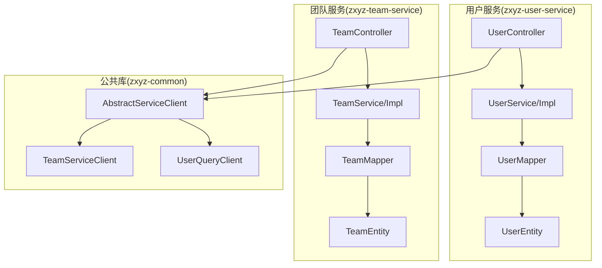
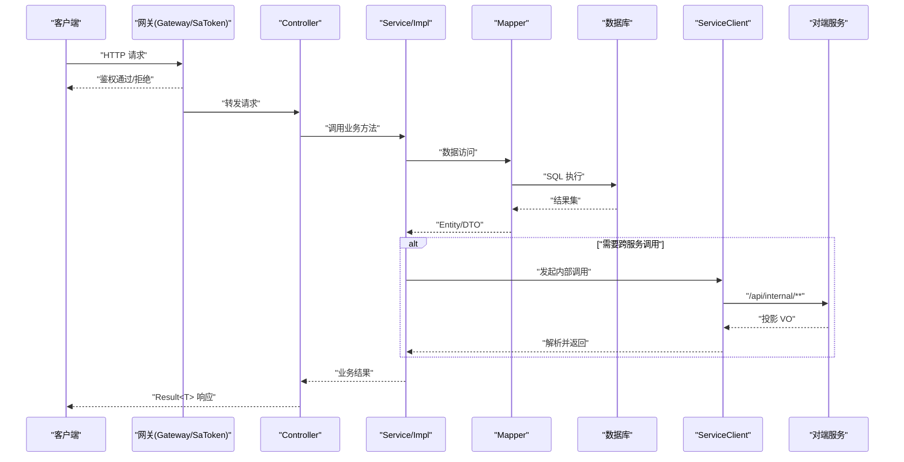
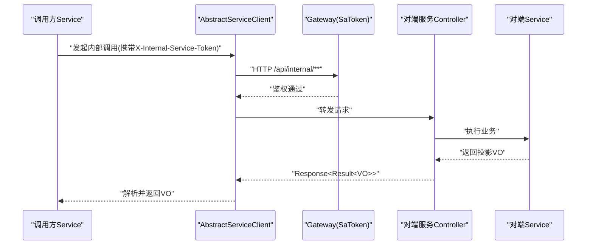
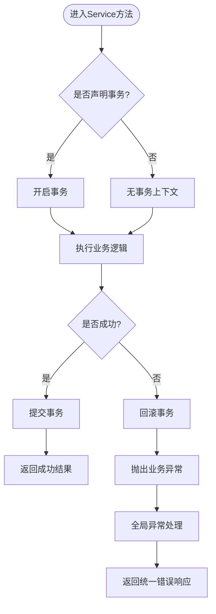
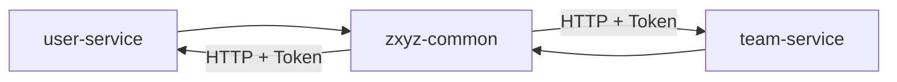

# 分层架构模式

<cite>
**本文档引用的文件**   
- [README.md](file://ZXYZdatabaseBack/README.md)
- [pom.xml](file://ZXYZdatabaseBack/pom.xml)
- [zxyz-user-service Application.java](file://ZXYZdatabaseBack/zxyz-user-service/src/main/java/uno/acloud/user/ZxyzUserApplication.java)
- [user Controller.java](file://ZXYZdatabaseBack/zxyz-user-service/src/main/java/uno/acloud/user/controller/UserController.java)
- [UserService.java](file://ZXYZdatabaseBack/zxyz-user-service/src/main/java/uno/acloud/user/service/UserService.java)
- [UserServiceImpl.java](file://ZXYZdatabaseBack/zxyz-user-service/src/main/java/uno/acloud/user/service/impl/UserServiceImpl.java)
- [UserMapper.java](file://ZXYZdatabaseBack/zxyz-user-service/src/main/java/uno/acloud/user/mapper/UserMapper.java)
- [UserEntity.java](file://ZXYZdatabaseBack/zxyz-user-service/src/main/java/uno/acloud/user/entity/UserEntity.java)
- [zxyz-team-service Application.java](file://ZXYZdatabaseBack/zxyz-team-service/src/main/java/uno/acloud/team/ZxyzTeamServiceApplication.java)
- [team Controller.java](file://ZXYZdatabaseBack/zxyz-team-service/src/main/java/uno/acloud/team/controller/TeamController.java)
- [TeamService.java](file://ZXYZdatabaseBack/zxyz-team-service/src/main/java/uno/acloud/team/service/TeamService.java)
- [TeamServiceImpl.java](file://ZXYZdatabaseBack/zxyz-team-service/src/main/java/uno/acloud/team/service/impl/TeamServiceImpl.java)
- [TeamMapper.java](file://ZXYZdatabaseBack/zxyz-team-service/src/main/java/uno/acloud/team/mapper/TeamMapper.java)
- [TeamEntity.java](file://ZXYZdatabaseBack/zxyz-team-service/src/main/java/uno/acloud/team/entity/TeamEntity.java)
- [AbstractServiceClient.java](file://ZXYZdatabaseBack/zxyz-common/src/main/java/uno/acloud/client/AbstractServiceClient.java)
- [TeamServiceClient.java](file://ZXYZdatabaseBack/zxyz-common/src/main/java/uno/acloud/client/TeamServiceClient.java)
- [UserQueryClient.java](file://ZXYZdatabaseBack/zxyz-common/src/main/java/uno/acloud/client/UserQueryClient.java)
- [application.yml (user-service)](file://ZXYZdatabaseBack/zxyz-user-service/src/main/resources/application.yml)
- [application.yml (team-service)](file://ZXYZdatabaseBack/zxyz-team-service/src/main/resources/application.yml)
- [architecture.md](file://docs/architecture.md)
</cite>

## 目录
1. [简介](#简介)
2. [项目结构](#项目结构)
3. [核心组件](#核心组件)
4. [架构总览](#架构总览)
5. [详细组件分析](#详细组件分析)
6. [依赖关系分析](#依赖关系分析)
7. [性能考虑](#性能考虑)
8. [故障排查指南](#故障排查指南)
9. [结论](#结论)
10. [附录](#附录)

## 简介
本文件面向 ZXYZ 项目的后端微服务，系统性阐述传统分层架构模式（Controller → Service → Mapper → Entity）在各服务中的职责边界、数据流转与协作规范。重点覆盖：
- 各层职责：Controller 负责请求接收与参数校验；Service 处理业务逻辑；Mapper 负责数据访问；Entity 定义数据模型。
- 层间调用规范：单向依赖、窄端点与投影 VO、统一响应体 Result<T>。
- 异常传递机制：全局异常处理与错误码约定。
- 事务管理策略：@Transactional 的使用范围与传播行为。
- 跨服务调用：通过 zxyz-common 的 ServiceClient + X-Internal-Service-Token 鉴权，内部端点 /api/internal/** 受 Gateway SaToken 保护。
- 在 user-service、team-service 等大多数服务中的通用实践。

## 项目结构
ZXYZ 后端采用多模块 Maven 工程，包含多个独立微服务与公共库。典型的服务模块遵循传统分层目录组织：
- controller：HTTP 接口层
- service/impl：业务逻辑层
- mapper：数据访问层
- entity：持久化实体
- dto/vo：数据传输对象与视图对象
- config：配置类
- mq：消息队列消费者/生产者
- aop/satoken：横切关注点与安全



图表来源
- [zxyz-user-service Application.java](file://ZXYZdatabaseBack/zxyz-user-service/src/main/java/uno/acloud/user/ZxyzUserApplication.java)
- [user Controller.java](file://ZXYZdatabaseBack/zxyz-user-service/src/main/java/uno/acloud/user/controller/UserController.java)
- [UserService.java](file://ZXYZdatabaseBack/zxyz-user-service/src/main/java/uno/acloud/user/service/UserService.java)
- [UserServiceImpl.java](file://ZXYZdatabaseBack/zxyz-user-service/src/main/java/uno/acloud/user/service/impl/UserServiceImpl.java)
- [UserMapper.java](file://ZXYZdatabaseBack/zxyz-user-service/src/main/java/uno/acloud/user/mapper/UserMapper.java)
- [UserEntity.java](file://ZXYZdatabaseBack/zxyz-user-service/src/main/java/uno/acloud/user/entity/UserEntity.java)
- [zxyz-team-service Application.java](file://ZXYZdatabaseBack/zxyz-team-service/src/main/java/uno/acloud/team/ZxyzTeamServiceApplication.java)
- [team Controller.java](file://ZXYZdatabaseBack/zxyz-team-service/src/main/java/uno/acloud/team/controller/TeamController.java)
- [TeamService.java](file://ZXYZdatabaseBack/zxyz-team-service/src/main/java/uno/acloud/team/service/TeamService.java)
- [TeamServiceImpl.java](file://ZXYZdatabaseBack/zxyz-team-service/src/main/java/uno/acloud/team/service/impl/TeamServiceImpl.java)
- [TeamMapper.java](file://ZXYZdatabaseBack/zxyz-team-service/src/main/java/uno/acloud/team/mapper/TeamMapper.java)
- [TeamEntity.java](file://ZXYZdatabaseBack/zxyz-team-service/src/main/java/uno/acloud/team/entity/TeamEntity.java)
- [AbstractServiceClient.java](file://ZXYZdatabaseBack/zxyz-common/src/main/java/uno/acloud/client/AbstractServiceClient.java)
- [TeamServiceClient.java](file://ZXYZdatabaseBack/zxyz-common/src/main/java/uno/acloud/client/TeamServiceClient.java)
- [UserQueryClient.java](file://ZXYZdatabaseBack/zxyz-common/src/main/java/uno/acloud/client/UserQueryClient.java)

章节来源
- [README.md](file://ZXYZdatabaseBack/README.md)
- [pom.xml](file://ZXYZdatabaseBack/pom.xml)
- [architecture.md](file://docs/architecture.md)

## 核心组件
- Controller 层
  - 职责：接收 HTTP 请求、参数校验、权限校验、调用 Service、封装统一响应 Result<T>。
  - 规范：不写复杂业务逻辑；使用 @Valid/@Validated 进行入参校验；返回 Result<T>。
- Service 层
  - 职责：编排业务流程、事务控制、领域规则校验、跨服务调用（通过 ServiceClient）。
  - 规范：对外暴露方法语义清晰；必要时使用 @Transactional；避免直接操作数据库。
- Mapper 层
  - 职责：数据访问抽象，映射 SQL/ORM 操作；仅做数据存取，不含业务逻辑。
  - 规范：命名与表字段一致；复杂查询可拆分到多个方法或配合 XML。
- Entity 层
  - 职责：与数据库表一一对应的持久化模型。
  - 规范：只含基础属性与注解；不包含业务方法；VO/DTO 用于接口传输。

章节来源
- [user Controller.java](file://ZXYZdatabaseBack/zxyz-user-service/src/main/java/uno/acloud/user/controller/UserController.java)
- [UserService.java](file://ZXYZdatabaseBack/zxyz-user-service/src/main/java/uno/acloud/user/service/UserService.java)
- [UserServiceImpl.java](file://ZXYZdatabaseBack/zxyz-user-service/src/main/java/uno/acloud/user/service/impl/UserServiceImpl.java)
- [UserMapper.java](file://ZXYZdatabaseBack/zxyz-user-service/src/main/java/uno/acloud/user/mapper/UserMapper.java)
- [UserEntity.java](file://ZXYZdatabaseBack/zxyz-user-service/src/main/java/uno/acloud/user/entity/UserEntity.java)
- [team Controller.java](file://ZXYZdatabaseBack/zxyz-team-service/src/main/java/uno/acloud/team/controller/TeamController.java)
- [TeamService.java](file://ZXYZdatabaseBack/zxyz-team-service/src/main/java/uno/acloud/team/service/TeamService.java)
- [TeamServiceImpl.java](file://ZXYZdatabaseBack/zxyz-team-service/src/main/java/uno/acloud/team/service/impl/TeamServiceImpl.java)
- [TeamMapper.java](file://ZXYZdatabaseBack/zxyz-team-service/src/main/java/uno/acloud/team/mapper/TeamMapper.java)
- [TeamEntity.java](file://ZXYZdatabaseBack/zxyz-team-service/src/main/java/uno/acloud/team/entity/TeamEntity.java)

## 架构总览
传统分层在 ZXYZ 中广泛落地于 user-service、team-service、project-service、file-service、share-service 等模块。整体调用链如下：
- 客户端 → Gateway(SaToken) → Service 的 Controller
- Controller → Service（业务编排）→ Mapper（数据访问）→ DB
- 跨服务调用：Service → AbstractServiceClient → 目标服务 /api/internal/** 端点



图表来源
- [zxyz-user-service Application.java](file://ZXYZdatabaseBack/zxyz-user-service/src/main/java/uno/acloud/user/ZxyzUserApplication.java)
- [user Controller.java](file://ZXYZdatabaseBack/zxyz-user-service/src/main/java/uno/acloud/user/controller/UserController.java)
- [UserService.java](file://ZXYZdatabaseBack/zxyz-user-service/src/main/java/uno/acloud/user/service/UserService.java)
- [UserServiceImpl.java](file://ZXYZdatabaseBack/zxyz-user-service/src/main/java/uno/acloud/user/service/impl/UserServiceImpl.java)
- [UserMapper.java](file://ZXYZdatabaseBack/zxyz-user-service/src/main/java/uno/acloud/user/mapper/UserMapper.java)
- [AbstractServiceClient.java](file://ZXYZdatabaseBack/zxyz-common/src/main/java/uno/acloud/client/AbstractServiceClient.java)
- [TeamServiceClient.java](file://ZXYZdatabaseBack/zxyz-common/src/main/java/uno/acloud/client/TeamServiceClient.java)
- [UserQueryClient.java](file://ZXYZdatabaseBack/zxyz-common/src/main/java/uno/acloud/client/UserQueryClient.java)

## 详细组件分析

### 用户服务(user-service)分层实现
- Controller
  - 接收用户相关请求，进行参数校验，调用 UserService，返回 Result<T>。
- Service/Impl
  - 实现用户注册、登录、信息查询等业务；必要时开启事务；调用 UserMapper。
- Mapper
  - 提供用户表的 CRUD 与条件查询方法。
- Entity
  - 用户表映射实体。

```mermaid
classDiagram
class UserController {
"+创建用户(request) Result<UserVO>"
"+登录(request) Result<TokenVO>"
"+获取用户详情(id) Result<UserVO>"
}
class UserService {
"+register(dto) void"
"+login(dto) String"
"+getById(id) UserVO"
}
class UserServiceImpl {
"-UserMapper userMapper"
"+register(dto) void"
"+login(dto) String"
"+getById(id) UserVO"
}
class UserMapper {
"+insert(entity) int"
"+selectById(id) UserEntity"
"+selectByCondition(query) UserEntity[]"
}
class UserEntity {
"+id"
"+username"
"+password"
"+email"
"+status"
}
UserController --> UserService : "调用"
UserService <|.. UserServiceImpl : "实现"
UserServiceImpl --> UserMapper : "依赖"
UserMapper --> UserEntity : "映射"
```

图表来源
- [user Controller.java](file://ZXYZdatabaseBack/zxyz-user-service/src/main/java/uno/acloud/user/controller/UserController.java)
- [UserService.java](file://ZXYZdatabaseBack/zxyz-user-service/src/main/java/uno/acloud/user/service/UserService.java)
- [UserServiceImpl.java](file://ZXYZdatabaseBack/zxyz-user-service/src/main/java/uno/acloud/user/service/impl/UserServiceImpl.java)
- [UserMapper.java](file://ZXYZdatabaseBack/zxyz-user-service/src/main/java/uno/acloud/user/mapper/UserMapper.java)
- [UserEntity.java](file://ZXYZdatabaseBack/zxyz-user-service/src/main/java/uno/acloud/user/entity/UserEntity.java)

章节来源
- [user Controller.java](file://ZXYZdatabaseBack/zxyz-user-service/src/main/java/uno/acloud/user/controller/UserController.java)
- [UserService.java](file://ZXYZdatabaseBack/zxyz-user-service/src/main/java/uno/acloud/user/service/UserService.java)
- [UserServiceImpl.java](file://ZXYZdatabaseBack/zxyz-user-service/src/main/java/uno/acloud/user/service/impl/UserServiceImpl.java)
- [UserMapper.java](file://ZXYZdatabaseBack/zxyz-user-service/src/main/java/uno/acloud/user/mapper/UserMapper.java)
- [UserEntity.java](file://ZXYZdatabaseBack/zxyz-user-service/src/main/java/uno/acloud/user/entity/UserEntity.java)

### 团队服务(team-service)分层实现
- Controller
  - 接收团队管理请求，参数校验后调用 TeamService。
- Service/Impl
  - 实现团队创建、成员管理、权限校验等；必要时开启事务；调用 TeamMapper。
- Mapper
  - 提供团队表及关联表的查询与更新。
- Entity
  - 团队及相关实体的映射。

```mermaid
classDiagram
class TeamController {
"+创建团队(request) Result<TeamVO>"
"+邀请成员(request) Result<Void>"
"+移除成员(memberId, teamId) Result<Void>"
}
class TeamService {
"+createTeam(dto) long"
"+inviteMember(dto) void"
"+removeMember(userId, teamId) void"
}
class TeamServiceImpl {
"-TeamMapper teamMapper"
"+createTeam(dto) long"
"+inviteMember(dto) void"
"+removeMember(userId, teamId) void"
}
class TeamMapper {
"+insert(entity) int"
"+selectById(id) TeamEntity"
"+updateStatus(id, status) int"
}
class TeamEntity {
"+id"
"+name"
"+ownerId"
"+status"
}
TeamController --> TeamService : "调用"
TeamService <|.. TeamServiceImpl : "实现"
TeamServiceImpl --> TeamMapper : "依赖"
TeamMapper --> TeamEntity : "映射"
```

图表来源
- [team Controller.java](file://ZXYZdatabaseBack/zxyz-team-service/src/main/java/uno/acloud/team/controller/TeamController.java)
- [TeamService.java](file://ZXYZdatabaseBack/zxyz-team-service/src/main/java/uno/acloud/team/service/TeamService.java)
- [TeamServiceImpl.java](file://ZXYZdatabaseBack/zxyz-team-service/src/main/java/uno/acloud/team/service/impl/TeamServiceImpl.java)
- [TeamMapper.java](file://ZXYZdatabaseBack/zxyz-team-service/src/main/java/uno/acloud/team/mapper/TeamMapper.java)
- [TeamEntity.java](file://ZXYZdatabaseBack/zxyz-team-service/src/main/java/uno/acloud/team/entity/TeamEntity.java)

章节来源
- [team Controller.java](file://ZXYZdatabaseBack/zxyz-team-service/src/main/java/uno/acloud/team/controller/TeamController.java)
- [TeamService.java](file://ZXYZdatabaseBack/zxyz-team-service/src/main/java/uno/acloud/team/service/TeamService.java)
- [TeamServiceImpl.java](file://ZXYZdatabaseBack/zxyz-team-service/src/main/java/uno/acloud/team/service/impl/TeamServiceImpl.java)
- [TeamMapper.java](file://ZXYZdatabaseBack/zxyz-team-service/src/main/java/uno/acloud/team/mapper/TeamMapper.java)
- [TeamEntity.java](file://ZXYZdatabaseBack/zxyz-team-service/src/main/java/uno/acloud/team/entity/TeamEntity.java)

### 跨服务调用与内部端点
- 调用方通过 zxyz-common 的 AbstractServiceClient 发起 HTTP 调用，自动附加 X-Internal-Service-Token。
- 被调服务的内部端点位于 /api/internal/**，由 Gateway SaToken 过滤器拦截，确保公网不可达。
- 返回数据为窄端点投影 VO，禁止返回胖 DTO；JsonNode 手动映射字段，不使用 treeToValue。



图表来源
- [AbstractServiceClient.java](file://ZXYZdatabaseBack/zxyz-common/src/main/java/uno/acloud/client/AbstractServiceClient.java)
- [TeamServiceClient.java](file://ZXYZdatabaseBack/zxyz-common/src/main/java/uno/acloud/client/TeamServiceClient.java)
- [UserQueryClient.java](file://ZXYZdatabaseBack/zxyz-common/src/main/java/uno/acloud/client/UserQueryClient.java)

章节来源
- [AbstractServiceClient.java](file://ZXYZdatabaseBack/zxyz-common/src/main/java/uno/acloud/client/AbstractServiceClient.java)
- [TeamServiceClient.java](file://ZXYZdatabaseBack/zxyz-common/src/main/java/uno/acloud/client/TeamServiceClient.java)
- [UserQueryClient.java](file://ZXYZdatabaseBack/zxyz-common/src/main/java/uno/acloud/client/UserQueryClient.java)

### 事务管理与异常传递
- 事务管理
  - 在 ServiceImpl 的方法上使用 @Transactional，保证同一业务操作的原子性。
  - 合理设置 propagation/isolation 等属性，避免长事务与锁竞争。
- 异常传递
  - Controller 层捕获业务异常并转换为统一 Result<T> 的错误结构。
  - 全局异常处理器统一处理未捕获异常，记录日志并返回标准错误码。



章节来源
- [UserServiceImpl.java](file://ZXYZdatabaseBack/zxyz-user-service/src/main/java/uno/acloud/user/service/impl/UserServiceImpl.java)
- [TeamServiceImpl.java](file://ZXYZdatabaseBack/zxyz-team-service/src/main/java/uno/acloud/team/service/impl/TeamServiceImpl.java)

## 依赖关系分析
- 模块内依赖
  - Controller 依赖 Service；Service 依赖 Mapper；Mapper 依赖 Entity。
  - 单向依赖，避免循环引用。
- 模块间依赖
  - 通过 zxyz-common 的 ServiceClient 进行跨服务调用。
  - 被调服务暴露 /api/internal/** 内部端点，受 Gateway 安全过滤。



图表来源
- [pom.xml](file://ZXYZdatabaseBack/pom.xml)
- [AbstractServiceClient.java](file://ZXYZdatabaseBack/zxyz-common/src/main/java/uno/acloud/client/AbstractServiceClient.java)

章节来源
- [pom.xml](file://ZXYZdatabaseBack/pom.xml)
- [AbstractServiceClient.java](file://ZXYZdatabaseBack/zxyz-common/src/main/java/uno/acloud/client/AbstractServiceClient.java)

## 性能考虑
- 接口层面
  - 使用投影 VO 减少网络负载；避免返回冗余字段。
  - 合理使用分页与排序，避免全量查询。
- 数据访问
  - 在 Mapper 层编写高效 SQL，避免 N+1 查询；必要时使用批量操作。
  - 热点数据可结合缓存（如 Redis），注意一致性策略。
- 事务优化
  - 缩小事务边界，避免在事务中进行远程调用或耗时计算。
  - 合理设置隔离级别，降低锁冲突概率。
- 跨服务调用
  - 使用窄端点与投影 VO；避免大对象传输。
  - 对高频调用增加超时与重试策略（幂等前提下）。

[本节为通用指导，不直接分析具体文件]

## 故障排查指南
- 常见问题
  - 参数校验失败：检查 Controller 层的 @Valid/@Validated 注解与 DTO 校验约束。
  - 事务未生效：确认方法可见性、是否被代理调用、是否正确标注 @Transactional。
  - 跨服务调用失败：检查 X-Internal-Service-Token 配置、对端内部端点路径与权限。
  - 响应体不一致：确认 Result<T> 结构与字段映射，避免 JsonNode 映射遗漏。
- 定位建议
  - 查看服务启动日志与 Nacos 配置。
  - 检查 Gateway 的 SaToken 过滤器日志。
  - 使用链路追踪工具观察跨服务调用时序。

章节来源
- [application.yml (user-service)](file://ZXYZdatabaseBack/zxyz-user-service/src/main/resources/application.yml)
- [application.yml (team-service)](file://ZXYZdatabaseBack/zxyz-team-service/src/main/resources/application.yml)

## 结论
ZXYZ 项目在大多数服务中采用传统分层架构（Controller → Service → Mapper → Entity），职责清晰、耦合度低、易于维护。通过 zxyz-common 的 ServiceClient 实现安全的跨服务调用，配合 Gateway 的安全过滤与统一响应体，形成稳定可靠的微服务协作体系。建议在开发中严格遵循层间调用规范、异常处理与事务管理最佳实践，持续提升系统质量与可观测性。

[本节为总结性内容，不直接分析具体文件]

## 附录
- DDD 风格说明
  - im-service 与 email-service 采用 DDD 分层（interfaces → application → domain → infrastructure），与传统分层不同，需按各自规范设计。
- 部署与配置
  - 使用 Docker Compose 编排容器，Nacos 管理配置与服务注册，Jasypt 加密敏感配置。
  - CI/CD 基于 GitHub Actions，选择性构建与镜像推送 GHCR。

章节来源
- [architecture.md](file://docs/architecture.md)
- [README.md](file://ZXYZdatabaseBack/README.md)