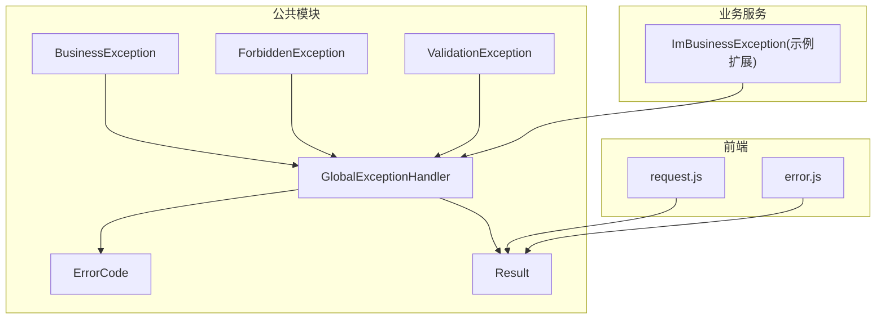
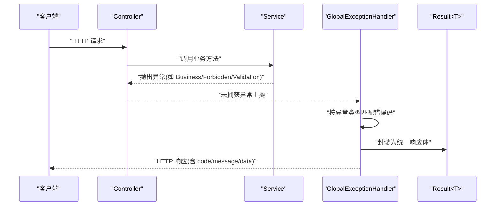
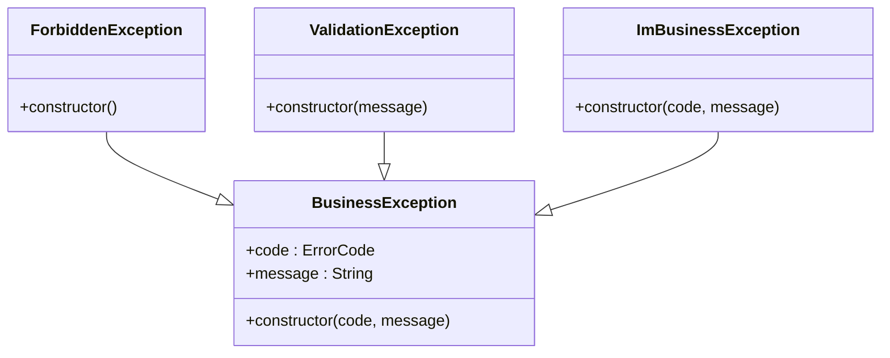
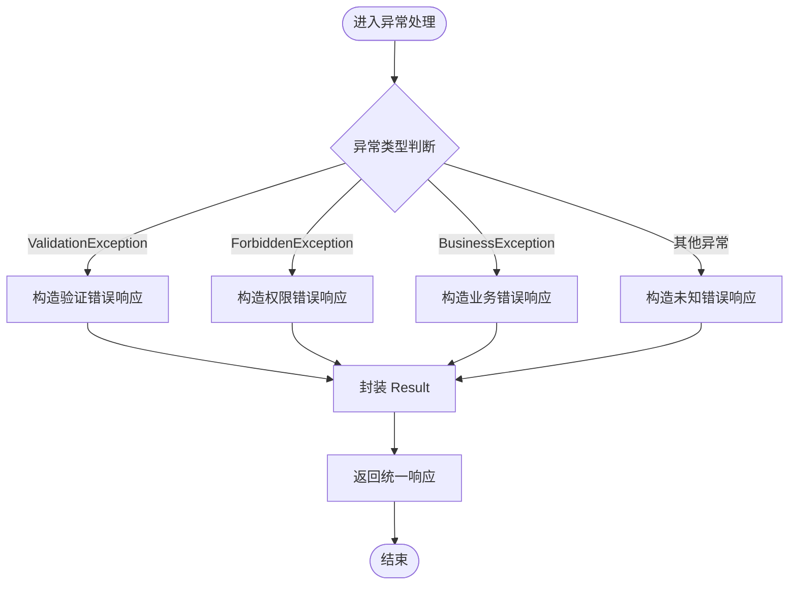
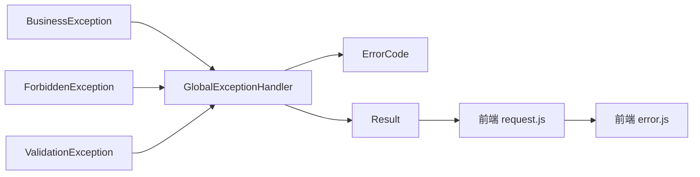

# 异常处理模式

<cite>
**本文引用的文件**   
- [zxyz-common/src/main/java/uno/acloud/exception/BusinessException.java](file://ZXYZdatabaseBack/zxyz-common/src/main/java/uno/acloud/exception/BusinessException.java)
- [zxyz-common/src/main/java/uno/acloud/exception/ForbiddenException.java](file://ZXYZdatabaseBack/zxyz-common/src/main/java/uno/acloud/exception/ForbiddenException.java)
- [zxyz-common/src/main/java/uno/acloud/exception/ValidationException.java](file://ZXYZdatabaseBack/zxyz-common/src/main/java/uno/acloud/exception/ValidationException.java)
- [zxyz-common/src/main/java/uno/acloud/common/web/GlobalExceptionHandler.java](file://ZXYZdatabaseBack/zxyz-common/src/main/java/uno/acloud/common/web/GlobalExceptionHandler.java)
- [zxyz-common/src/main/java/uno/acloud/common/web/ErrorCode.java](file://ZXYZdatabaseBack/zxyz-common/src/main/java/uno/acloud/common/web/ErrorCode.java)
- [zxyz-common/src/main/java/uno/acloud/common/web/Result.java](file://ZXYZdatabaseBack/zxyz-common/src/main/java/uno/acloud/common/web/Result.java)
- [zxyz-im-service/src/main/java/uno/acloud/im/exception/ImBusinessException.java](file://ZXYZdatabaseBack/zxyz-im-service/src/main/java/uno/acloud/im/exception/ImBusinessException.java)
- [ZXYZdatabaseFront/src/utils/error.js](file://ZXYZdatabaseFront/src/utils/error.js)
- [ZXYZdatabaseFront/src/utils/request.js](file://ZXYZdatabaseFront/src/utils/request.js)
</cite>

## 目录
1. [简介](#简介)
2. [项目结构](#项目结构)
3. [核心组件](#核心组件)
4. [架构总览](#架构总览)
5. [详细组件分析](#详细组件分析)
6. [依赖分析](#依赖分析)
7. [性能考虑](#性能考虑)
8. [故障排查指南](#故障排查指南)
9. [结论](#结论)
10. [附录](#附录)

## 简介
本文件面向 ZXYZ 项目的异常处理模式，聚焦以下目标：
- 自定义异常体系：BusinessException、ForbiddenException、ValidationException 的层次结构与职责边界。
- GlobalExceptionHandler 全局异常处理器：统一捕获、错误码映射、响应格式标准化。
- ErrorCode 枚举的错误码设计规范与管理策略。
- 异常传播机制、事务回滚策略与用户友好的错误提示。
- 异常处理的测试策略与调试技巧（后端与前端）。

## 项目结构
异常相关代码主要位于公共模块 zxyz-common 中，并在各业务服务按需扩展；前端在 utils 层对统一响应进行解析与友好提示。

图表来源 
- [zxyz-common/src/main/java/uno/acloud/exception/BusinessException.java](file://ZXYZdatabaseBack/zxyz-common/src/main/java/uno/acloud/exception/BusinessException.java)
- [zxyz-common/src/main/java/uno/acloud/exception/ForbiddenException.java](file://ZXYZdatabaseBack/zxyz-common/src/main/java/uno/acloud/exception/ForbiddenException.java)
- [zxyz-common/src/main/java/uno/acloud/exception/ValidationException.java](file://ZXYZdatabaseBack/zxyz-common/src/main/java/uno/acloud/exception/ValidationException.java)
- [zxyz-common/src/main/java/uno/acloud/common/web/GlobalExceptionHandler.java](file://ZXYZdatabaseBack/zxyz-common/src/main/java/uno/acloud/common/web/GlobalExceptionHandler.java)
- [zxyz-common/src/main/java/uno/acloud/common/web/ErrorCode.java](file://ZXYZdatabaseBack/zxyz-common/src/main/java/uno/acloud/common/web/ErrorCode.java)
- [zxyz-common/src/main/java/uno/acloud/common/web/Result.java](file://ZXYZdatabaseBack/zxyz-common/src/main/java/uno/acloud/common/web/Result.java)
- [zxyz-im-service/src/main/java/uno/acloud/im/exception/ImBusinessException.java](file://ZXYZdatabaseBack/zxyz-im-service/src/main/java/uno/acloud/im/exception/ImBusinessException.java)
- [ZXYZdatabaseFront/src/utils/error.js](file://ZXYZdatabaseFront/src/utils/error.js)
- [ZXYZdatabaseFront/src/utils/request.js](file://ZXYZdatabaseFront/src/utils/request.js)

章节来源
- [zxyz-common/src/main/java/uno/acloud/common/web/GlobalExceptionHandler.java](file://ZXYZdatabaseBack/zxyz-common/src/main/java/uno/acloud/common/web/GlobalExceptionHandler.java)
- [zxyz-common/src/main/java/uno/acloud/common/web/ErrorCode.java](file://ZXYZdatabaseBack/zxyz-common/src/main/java/uno/acloud/common/web/ErrorCode.java)
- [zxyz-common/src/main/java/uno/acloud/common/web/Result.java](file://ZXYZdatabaseBack/zxyz-common/src/main/java/uno/acloud/common/web/Result.java)
- [ZXYZdatabaseFront/src/utils/request.js](file://ZXYZdatabaseFront/src/utils/request.js)
- [ZXYZdatabaseFront/src/utils/error.js](file://ZXYZdatabaseFront/src/utils/error.js)

## 核心组件
- 自定义异常基类与派生类
  - BusinessException：业务规则违反或可预期业务错误的基类，承载错误码与消息。
  - ForbiddenException：权限不足或鉴权失败的专用异常，通常对应 403。
  - ValidationException：参数校验失败或输入不合法，通常对应 400。
- 全局异常处理器
  - GlobalExceptionHandler：集中捕获 Controller 层抛出的异常，按类型匹配并转换为统一的 Result<T> 响应体。
- 错误码与响应体
  - ErrorCode：定义错误码常量及语义，作为异常与响应的桥梁。
  - Result<T>：统一返回结构，包含 code、message、data 等字段。

章节来源
- [zxyz-common/src/main/java/uno/acloud/exception/BusinessException.java](file://ZXYZdatabaseBack/zxyz-common/src/main/java/uno/acloud/exception/BusinessException.java)
- [zxyz-common/src/main/java/uno/acloud/exception/ForbiddenException.java](file://ZXYZdatabaseBack/zxyz-common/src/main/java/uno/acloud/exception/ForbiddenException.java)
- [zxyz-common/src/main/java/uno/acloud/exception/ValidationException.java](file://ZXYZdatabaseBack/zxyz-common/src/main/java/uno/acloud/exception/ValidationException.java)
- [zxyz-common/src/main/java/uno/acloud/common/web/GlobalExceptionHandler.java](file://ZXYZdatabaseBack/zxyz-common/src/main/java/uno/acloud/common/web/GlobalExceptionHandler.java)
- [zxyz-common/src/main/java/uno/acloud/common/web/ErrorCode.java](file://ZXYZdatabaseBack/zxyz-common/src/main/java/uno/acloud/common/web/ErrorCode.java)
- [zxyz-common/src/main/java/uno/acloud/common/web/Result.java](file://ZXYZdatabaseBack/zxyz-common/src/main/java/uno/acloud/common/web/Result.java)

## 架构总览
下图展示从请求进入控制器到异常被全局处理器捕获并返回统一格式的完整流程。

图表来源 
- [zxyz-common/src/main/java/uno/acloud/common/web/GlobalExceptionHandler.java](file://ZXYZdatabaseBack/zxyz-common/src/main/java/uno/acloud/common/web/GlobalExceptionHandler.java)
- [zxyz-common/src/main/java/uno/acloud/common/web/ErrorCode.java](file://ZXYZdatabaseBack/zxyz-common/src/main/java/uno/acloud/common/web/ErrorCode.java)
- [zxyz-common/src/main/java/uno/acloud/common/web/Result.java](file://ZXYZdatabaseBack/zxyz-common/src/main/java/uno/acloud/common/web/Result.java)

## 详细组件分析

### 自定义异常体系
- 继承关系与职责
  - BusinessException：通用业务异常基类，用于表达“业务层面”的可预期错误。
  - ForbiddenException：权限相关异常，表示鉴权失败或无操作权限。
  - ValidationException：参数校验异常，表示输入不符合约束。
- 设计要点
  - 所有异常应携带 ErrorCode，避免硬编码错误信息。
  - 异常仅承载错误标识与必要上下文，不泄露敏感细节。
  - 在 Service 层抛出，由 Controller 层透传至全局处理器。

图表来源 
- [zxyz-common/src/main/java/uno/acloud/exception/BusinessException.java](file://ZXYZdatabaseBack/zxyz-common/src/main/java/uno/acloud/exception/BusinessException.java)
- [zxyz-common/src/main/java/uno/acloud/exception/ForbiddenException.java](file://ZXYZdatabaseBack/zxyz-common/src/main/java/uno/acloud/exception/ForbiddenException.java)
- [zxyz-common/src/main/java/uno/acloud/exception/ValidationException.java](file://ZXYZdatabaseBack/zxyz-common/src/main/java/uno/acloud/exception/ValidationException.java)
- [zxyz-im-service/src/main/java/uno/acloud/im/exception/ImBusinessException.java](file://ZXYZdatabaseBack/zxyz-im-service/src/main/java/uno/acloud/im/exception/ImBusinessException.java)

章节来源
- [zxyz-common/src/main/java/uno/acloud/exception/BusinessException.java](file://ZXYZdatabaseBack/zxyz-common/src/main/java/uno/acloud/exception/BusinessException.java)
- [zxyz-common/src/main/java/uno/acloud/exception/ForbiddenException.java](file://ZXYZdatabaseBack/zxyz-common/src/main/java/uno/acloud/exception/ForbiddenException.java)
- [zxyz-common/src/main/java/uno/acloud/exception/ValidationException.java](file://ZXYZdatabaseBack/zxyz-common/src/main/java/uno/acloud/exception/ValidationException.java)
- [zxyz-im-service/src/main/java/uno/acloud/im/exception/ImBusinessException.java](file://ZXYZdatabaseBack/zxyz-im-service/src/main/java/uno/acloud/im/exception/ImBusinessException.java)

### GlobalExceptionHandler 全局异常处理器
- 功能职责
  - 统一捕获 Controller 层抛出的各类异常。
  - 将异常映射为 ErrorCode，并生成标准 Result<T> 响应。
  - 对不同异常设置合适的 HTTP 状态码（如 400、403、500）。
- 处理流程
  - 优先匹配具体异常类型（如 ValidationException、ForbiddenException）。
  - 若未匹配则回退到通用业务异常或未知异常分支。
  - 记录必要的日志，避免暴露堆栈给客户端。

图表来源 
- [zxyz-common/src/main/java/uno/acloud/common/web/GlobalExceptionHandler.java](file://ZXYZdatabaseBack/zxyz-common/src/main/java/uno/acloud/common/web/GlobalExceptionHandler.java)
- [zxyz-common/src/main/java/uno/acloud/common/web/ErrorCode.java](file://ZXYZdatabaseBack/zxyz-common/src/main/java/uno/acloud/common/web/ErrorCode.java)
- [zxyz-common/src/main/java/uno/acloud/common/web/Result.java](file://ZXYZdatabaseBack/zxyz-common/src/main/java/uno/acloud/common/web/Result.java)

章节来源
- [zxyz-common/src/main/java/uno/acloud/common/web/GlobalExceptionHandler.java](file://ZXYZdatabaseBack/zxyz-common/src/main/java/uno/acloud/common/web/GlobalExceptionHandler.java)

### ErrorCode 枚举的设计与管理
- 设计原则
  - 单一事实来源：所有错误码集中在 ErrorCode 中维护，禁止散落在业务代码中。
  - 分类清晰：按模块或场景分组（如 auth、validation、business），便于检索与治理。
  - 语义稳定：错误码一旦发布，保持向后兼容；新增错误码需评审与文档更新。
- 使用规范
  - 在异常构造时传入 ErrorCode，确保 message 与 code 一致。
  - 对外只暴露 code 与 message，不暴露内部实现细节。
  - 前端根据 code 做差异化提示与路由跳转。

章节来源
- [zxyz-common/src/main/java/uno/acloud/common/web/ErrorCode.java](file://ZXYZdatabaseBack/zxyz-common/src/main/java/uno/acloud/common/web/ErrorCode.java)

### 事务回滚策略
- 建议实践
  - 在 Service 层使用声明式事务（如 @Transactional）包裹写操作。
  - 当抛出 RuntimeException（包括自定义异常）时，默认触发回滚。
  - 对于需要区分检查型异常的子场景，显式配置 rollbackFor。
- 注意事项
  - 避免在事务内执行耗时 IO 或外部调用，必要时拆分异步化。
  - 跨服务调用失败不应导致本地事务回滚，除非有补偿机制。

章节来源
- [zxyz-common/src/main/java/uno/acloud/common/web/GlobalExceptionHandler.java](file://ZXYZdatabaseBack/zxyz-common/src/main/java/uno/acloud/common/web/GlobalExceptionHandler.java)

### 用户友好的错误提示
- 后端
  - 通过 ErrorCode 提供稳定的错误标识，message 面向用户可读。
  - 避免堆栈、SQL 片段、内部路径等敏感信息。
- 前端
  - request.js 统一拦截响应，根据 code 判定成功与否。
  - error.js 将后端错误码映射为用户友好的提示文案，并可结合路由跳转（如登录态失效）。

章节来源
- [ZXYZdatabaseFront/src/utils/request.js](file://ZXYZdatabaseFront/src/utils/request.js)
- [ZXYZdatabaseFront/src/utils/error.js](file://ZXYZdatabaseFront/src/utils/error.js)

## 依赖分析
- 模块内依赖
  - GlobalExceptionHandler 依赖 ErrorCode 与 Result，负责将异常转为统一响应。
  - 各业务异常依赖 ErrorCode，保证错误码一致性。
- 前后端契约
  - 前端基于 Result<T> 的 code 字段进行成功/失败判断与提示。
  - 后端通过 ErrorCode 驱动 message 内容，前端据此呈现友好提示。

图表来源 
- [zxyz-common/src/main/java/uno/acloud/common/web/GlobalExceptionHandler.java](file://ZXYZdatabaseBack/zxyz-common/src/main/java/uno/acloud/common/web/GlobalExceptionHandler.java)
- [zxyz-common/src/main/java/uno/acloud/common/web/ErrorCode.java](file://ZXYZdatabaseBack/zxyz-common/src/main/java/uno/acloud/common/web/ErrorCode.java)
- [zxyz-common/src/main/java/uno/acloud/common/web/Result.java](file://ZXYZdatabaseBack/zxyz-common/src/main/java/uno/acloud/common/web/Result.java)
- [ZXYZdatabaseFront/src/utils/request.js](file://ZXYZdatabaseFront/src/utils/request.js)
- [ZXYZdatabaseFront/src/utils/error.js](file://ZXYZdatabaseFront/src/utils/error.js)

章节来源
- [zxyz-common/src/main/java/uno/acloud/common/web/GlobalExceptionHandler.java](file://ZXYZdatabaseBack/zxyz-common/src/main/java/uno/acloud/common/web/GlobalExceptionHandler.java)
- [zxyz-common/src/main/java/uno/acloud/common/web/ErrorCode.java](file://ZXYZdatabaseBack/zxyz-common/src/main/java/uno/acloud/common/web/ErrorCode.java)
- [zxyz-common/src/main/java/uno/acloud/common/web/Result.java](file://ZXYZdatabaseBack/zxyz-common/src/main/java/uno/acloud/common/web/Result.java)
- [ZXYZdatabaseFront/src/utils/request.js](file://ZXYZdatabaseFront/src/utils/request.js)
- [ZXYZdatabaseFront/src/utils/error.js](file://ZXYZdatabaseFront/src/utils/error.js)

## 性能考虑
- 异常路径属于非主流程，应避免在异常分支中进行昂贵计算或 IO。
- 全局异常处理器应尽量轻量，仅做类型匹配与响应封装。
- 错误码与消息的查找应为 O(1)（如枚举或常量表），避免运行时复杂逻辑。
- 前端错误提示应在网络层统一处理，减少重复逻辑。

## 故障排查指南
- 后端定位
  - 确认异常是否在 Service 层正确抛出，且未被上层吞掉。
  - 检查 GlobalExceptionHandler 是否命中对应分支，错误码是否正确映射。
  - 查看日志输出，确认未泄露敏感信息但保留足够上下文。
- 前端定位
  - 检查 request.js 的拦截器是否正确解析 code 与 message。
  - 核对 error.js 的错误码映射是否覆盖新错误码。
  - 针对鉴权失败（如 401/403）检查会话与重定向逻辑。
- 常见症状与对策
  - 前端一直显示“未知错误”：检查后端是否返回了未定义的 code。
  - 权限提示不准确：确认 ForbiddenException 与 ErrorCode 的对应关系。
  - 参数校验无效：确认 ValidationException 的抛出点与校验框架集成。

章节来源
- [zxyz-common/src/main/java/uno/acloud/common/web/GlobalExceptionHandler.java](file://ZXYZdatabaseBack/zxyz-common/src/main/java/uno/acloud/common/web/GlobalExceptionHandler.java)
- [ZXYZdatabaseFront/src/utils/request.js](file://ZXYZdatabaseFront/src/utils/request.js)
- [ZXYZdatabaseFront/src/utils/error.js](file://ZXYZdatabaseFront/src/utils/error.js)

## 结论
通过统一的异常体系与全局处理器，ZXYZ 在后端实现了异常捕获、错误码映射与响应标准化的闭环；前端基于统一响应结构完成友好提示与交互控制。遵循 ErrorCode 管理规范与事务回滚策略，可在保障一致性的同时提升可维护性与可观测性。

## 附录

### 测试策略
- 单元测试
  - 针对 Service 层用例，断言在非法输入或权限不足时抛出指定异常。
  - 针对 ErrorCode 的完整性与唯一性进行回归检查。
- 集成测试
  - 使用 Mock 或 TestContainer 启动 Web 环境，验证 GlobalExceptionHandler 的响应格式与状态码。
  - 覆盖关键异常分支：ValidationException、ForbiddenException、BusinessException。
- 前端测试
  - 模拟不同 code 的响应，验证 error.js 的提示与路由行为。
  - 对 request.js 拦截器进行断言，确保成功与失败路径均被正确处理。

章节来源
- [zxyz-common/src/main/java/uno/acloud/common/web/GlobalExceptionHandler.java](file://ZXYZdatabaseBack/zxyz-common/src/main/java/uno/acloud/common/web/GlobalExceptionHandler.java)
- [ZXYZdatabaseFront/src/utils/request.js](file://ZXYZdatabaseFront/src/utils/request.js)
- [ZXYZdatabaseFront/src/utils/error.js](file://ZXYZdatabaseFront/src/utils/error.js)

### 调试技巧
- 后端
  - 在 GlobalExceptionHandler 中增加临时日志，打印异常类型与错误码。
  - 使用断点调试异常抛出点，确认调用链与事务边界。
- 前端
  - 打开浏览器开发者工具，观察 Network 面板中的响应体结构。
  - 在 error.js 中增加断点，追踪错误码映射过程。

章节来源
- [zxyz-common/src/main/java/uno/acloud/common/web/GlobalExceptionHandler.java](file://ZXYZdatabaseBack/zxyz-common/src/main/java/uno/acloud/common/web/GlobalExceptionHandler.java)
- [ZXYZdatabaseFront/src/utils/request.js](file://ZXYZdatabaseFront/src/utils/request.js)
- [ZXYZdatabaseFront/src/utils/error.js](file://ZXYZdatabaseFront/src/utils/error.js)