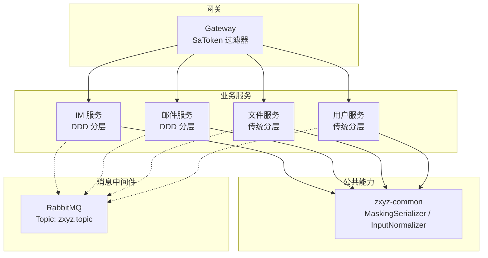
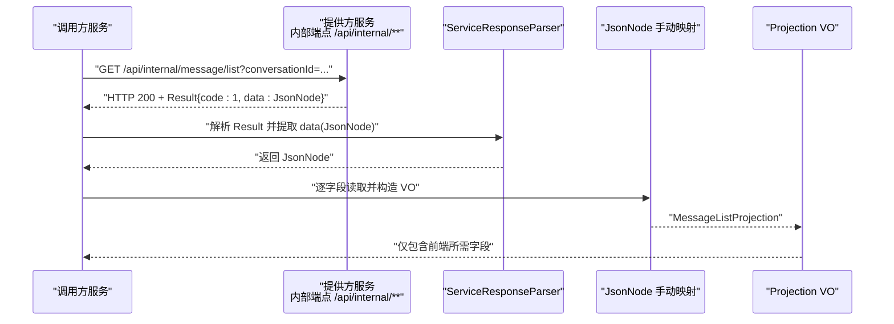
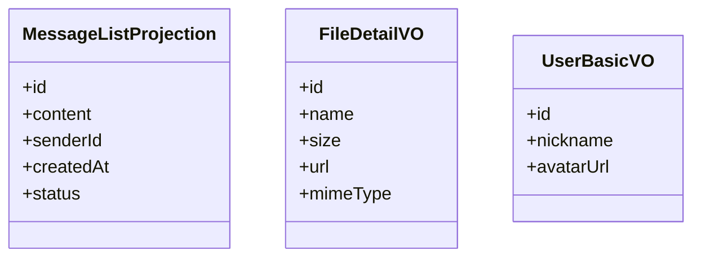
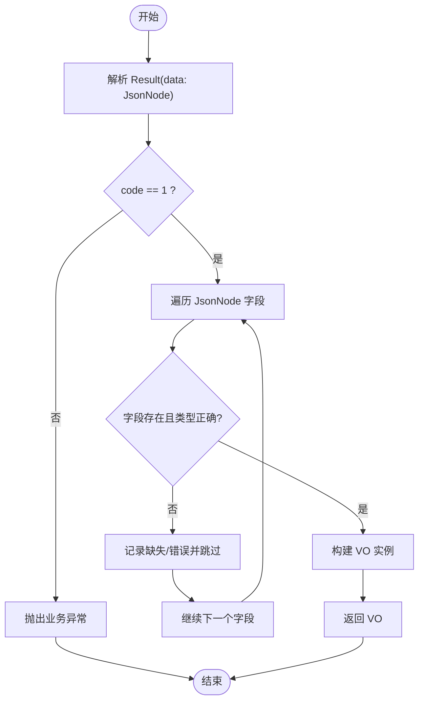
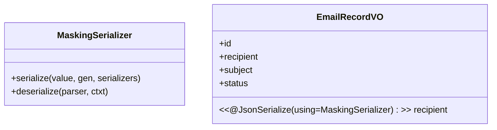
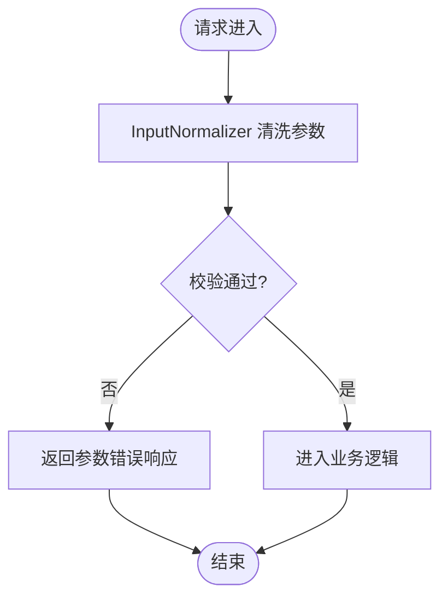
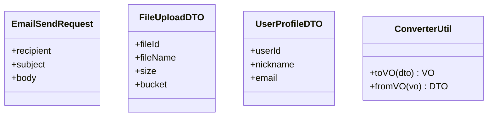
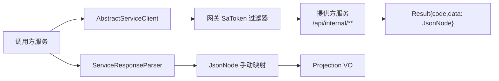

# 数据传输模式

<cite>
**本文引用的文件**   
- [zxyz-common/src/main/java/uno/acloud/common/web/MaskingSerializer.java](file://ZXYZdatabaseBack/zxyz-common/src/main/java/uno/acloud/common/web/MaskingSerializer.java)
- [zxyz-common/src/main/java/uno/acloud/common/util/InputNormalizer.java](file://ZXYZdatabaseBack/zxyz-common/src/main/java/uno/acloud/common/util/InputNormalizer.java)
- [zxyz-common/src/test/java/uno/acloud/common/InputNormalizerTest.java](file://ZXYZdatabaseBack/zxyz-common/src/test/java/uno/acloud/common/InputNormalizerTest.java)
- [zxyz-email-service/src/main/java/uno/acloud/email/dto/EmailSendRequest.java](file://ZXYZdatabaseBack/zxyz-email-service/src/main/java/uno/acloud/email/dto/EmailSendRequest.java)
- [zxyz-email-service/src/main/java/uno/acloud/email/vo/EmailRecordVO.java](file://ZXYZdatabaseBack/zxyz-email-service/src/main/java/uno/acloud/email/vo/EmailRecordVO.java)
- [zxyz-file-service/src/main/java/uno/acloud/file/controller/FileController.java](file://ZXYZdatabaseBack/zxyz-file-service/src/main/java/uno/acloud/file/controller/FileController.java)
- [zxyz-file-service/src/main/java/uno/acloud/file/dto/FileUploadDTO.java](file://ZXYZdatabaseBack/zxyz-file-service/src/main/java/uno/acloud/file/dto/FileUploadDTO.java)
- [zxyz-file-service/src/main/java/uno/acloud/file/vo/FileDetailVO.java](file://ZXYZdatabaseBack/zxyz-file-service/src/main/java/uno/acloud/file/vo/FileDetailVO.java)
- [zxyz-im-service/src/main/java/uno/acloud/im/application/MessageQueryService.java](file://ZXYZdatabaseBack/zxyz-im-service/src/main/java/uno/acloud/im/application/MessageQueryService.java)
- [zxyz-im-service/src/main/java/uno/acloud/im/vo/MessageListProjection.java](file://ZXYZdatabaseBack/zxyz-im-service/src/main/java/uno/acloud/im/vo/MessageListProjection.java)
- [zxyz-user-service/src/main/java/uno/acloud/user/dto/UserProfileDTO.java](file://ZXYZdatabaseBack/zxyz-user-service/src/main/java/uno/acloud/user/dto/UserProfileDTO.java)
- [zxyz-user-service/src/main/java/uno/acloud/user/vo/UserBasicVO.java](file://ZXYZdatabaseBack/zxyz-user-service/src/main/java/uno/acloud/user/vo/UserBasicVO.java)
- [zxyz-common/src/main/java/uno/acloud/client/AbstractServiceClient.java](file://ZXYZdatabaseBack/zxyz-common/src/main/java/uno/acloud/client/AbstractServiceClient.java)
- [zxyz-common/src/main/java/uno/acloud/client/ServiceResponseParser.java](file://ZXYZdatabaseBack/zxyz-common/src/main/java/uno/acloud/client/ServiceResponseParser.java)
</cite>

## 目录
1. [简介](#简介)
2. [项目结构](#项目结构)
3. [核心组件](#核心组件)
4. [架构总览](#架构总览)
5. [详细组件分析](#详细组件分析)
6. [依赖分析](#依赖分析)
7. [性能考虑](#性能考虑)
8. [故障排查指南](#故障排查指南)
9. [结论](#结论)
10. [附录](#附录)

## 简介
本文件面向 ZXYZ 项目的数据传输模式，聚焦以下主题：
- DTO（数据传输对象）与 VO（视图对象）的设计原则与使用场景
- 窄端点投影模式：内部接口返回调用方专用 Projection VO，禁止返回胖 DTO
- JsonNode 手动字段映射的最佳实践，避免 treeToValue
- 数据脱敏序列化 MaskingSerializer 的实现与使用
- 输入参数规范化 InputNormalizer 的参数清洗与验证
- DTO/VO 转换的工具类与最佳实践指南

## 项目结构
ZXYZ 后端采用多模块 Maven 工程，服务间通过 ServiceClient + X-Internal-Service-Token 鉴权进行同步通信，异步通信使用 RabbitMQ Topic Exchange。内部端点统一前缀 /api/internal/**，由网关 SaToken 过滤器拒绝公网访问。

图表来源
- [zxyz-common/src/main/java/uno/acloud/common/web/MaskingSerializer.java](file://ZXYZdatabaseBack/zxyz-common/src/main/java/uno/acloud/common/web/MaskingSerializer.java)
- [zxyz-common/src/main/java/uno/acloud/common/util/InputNormalizer.java](file://ZXYZdatabaseBack/zxyz-common/src/main/java/uno/acloud/common/util/InputNormalizer.java)
- [zxyz-common/src/main/java/uno/acloud/client/AbstractServiceClient.java](file://ZXYZdatabaseBack/zxyz-common/src/main/java/uno/acloud/client/AbstractServiceClient.java)
- [zxyz-common/src/main/java/uno/acloud/client/ServiceResponseParser.java](file://ZXYZdatabaseBack/zxyz-common/src/main/java/uno/acloud/client/ServiceResponseParser.java)

章节来源
- [zxyz-common/src/main/java/uno/acloud/common/web/MaskingSerializer.java](file://ZXYZdatabaseBack/zxyz-common/src/main/java/uno/acloud/common/web/MaskingSerializer.java)
- [zxyz-common/src/main/java/uno/acloud/common/util/InputNormalizer.java](file://ZXYZdatabaseBack/zxyz-common/src/main/java/uno/acloud/common/util/InputNormalizer.java)
- [zxyz-common/src/main/java/uno/acloud/client/AbstractServiceClient.java](file://ZXYZdatabaseBack/zxyz-common/src/main/java/uno/acloud/client/AbstractServiceClient.java)
- [zxyz-common/src/main/java/uno/acloud/client/ServiceResponseParser.java](file://ZXYZdatabaseBack/zxyz-common/src/main/java/uno/acloud/client/ServiceResponseParser.java)

## 核心组件
- 窄端点投影模式
  - 内部接口仅暴露最小必要字段，返回调用方专用的 Projection VO，禁止返回包含冗余字段的“胖 DTO”。
  - 典型示例：消息列表查询返回 MessageListProjection，而非完整消息实体或通用 DTO。
- JsonNode 手动字段映射
  - 在跨服务解析响应时，优先对 JsonNode 进行逐字段读取与校验，避免使用 treeToValue，以降低耦合与反序列化风险。
- 数据脱敏序列化 MaskingSerializer
  - 针对敏感字段提供统一的掩码输出策略，确保对外响应不泄露隐私信息。
- 输入参数规范化 InputNormalizer
  - 在服务入口集中完成参数清洗、默认值填充与基础校验，保证下游逻辑的稳定性。
- DTO/VO 转换工具与最佳实践
  - 以轻量转换器为主，遵循“单向转换”和“按场景裁剪”的原则，避免双向强耦合。

章节来源
- [zxyz-im-service/src/main/java/uno/acloud/im/application/MessageQueryService.java](file://ZXYZdatabaseBack/zxyz-im-service/src/main/java/uno/acloud/im/application/MessageQueryService.java)
- [zxyz-im-service/src/main/java/uno/acloud/im/vo/MessageListProjection.java](file://ZXYZdatabaseBack/zxyz-im-service/src/main/java/uno/acloud/im/vo/MessageListProjection.java)
- [zxyz-common/src/main/java/uno/acloud/common/web/MaskingSerializer.java](file://ZXYZdatabaseBack/zxyz-common/src/main/java/uno/acloud/common/web/MaskingSerializer.java)
- [zxyz-common/src/main/java/uno/acloud/common/util/InputNormalizer.java](file://ZXYZdatabaseBack/zxyz-common/src/main/java/uno/acloud/common/util/InputNormalizer.java)
- [zxyz-common/src/main/java/uno/acloud/client/ServiceResponseParser.java](file://ZXYZdatabaseBack/zxyz-common/src/main/java/uno/acloud/client/ServiceResponseParser.java)

## 架构总览
下图展示一次典型的“窄端点 + 投影”调用流程，强调调用方专用 VO 与手动 JsonNode 映射。

图表来源
- [zxyz-common/src/main/java/uno/acloud/client/ServiceResponseParser.java](file://ZXYZdatabaseBack/zxyz-common/src/main/java/uno/acloud/client/ServiceResponseParser.java)
- [zxyz-im-service/src/main/java/uno/acloud/im/application/MessageQueryService.java](file://ZXYZdatabaseBack/zxyz-im-service/src/main/java/uno/acloud/im/application/MessageQueryService.java)
- [zxyz-im-service/src/main/java/uno/acloud/im/vo/MessageListProjection.java](file://ZXYZdatabaseBack/zxyz-im-service/src/main/java/uno/acloud/im/vo/MessageListProjection.java)

## 详细组件分析

### 窄端点投影模式（Projection VO）
- 设计原则
  - 每个内部端点只返回调用方所需的字段集合，形成独立的 Projection VO。
  - 禁止将领域实体或通用 DTO 直接作为响应体返回，避免“胖 DTO”扩散。
- 使用场景
  - 列表查询：如消息列表、文件列表等，仅需关键字段与分页元数据。
  - 详情查询：如用户基本信息、文件详情等，按需裁剪字段。
- 示例参考
  - 消息列表查询：MessageQueryService 返回 MessageListProjection。
  - 文件详情：FileController 返回 FileDetailVO。
  - 用户信息：UserBasicVO 用于跨服务传递最小化用户信息。

图表来源
- [zxyz-im-service/src/main/java/uno/acloud/im/vo/MessageListProjection.java](file://ZXYZdatabaseBack/zxyz-im-service/src/main/java/uno/acloud/im/vo/MessageListProjection.java)
- [zxyz-file-service/src/main/java/uno/acloud/file/vo/FileDetailVO.java](file://ZXYZdatabaseBack/zxyz-file-service/src/main/java/uno/acloud/file/vo/FileDetailVO.java)
- [zxyz-user-service/src/main/java/uno/acloud/user/vo/UserBasicVO.java](file://ZXYZdatabaseBack/zxyz-user-service/src/main/java/uno/acloud/user/vo/UserBasicVO.java)

章节来源
- [zxyz-im-service/src/main/java/uno/acloud/im/application/MessageQueryService.java](file://ZXYZdatabaseBack/zxyz-im-service/src/main/java/uno/acloud/im/application/MessageQueryService.java)
- [zxyz-file-service/src/main/java/uno/acloud/file/controller/FileController.java](file://ZXYZdatabaseBack/zxyz-file-service/src/main/java/uno/acloud/file/controller/FileController.java)
- [zxyz-user-service/src/main/java/uno/acloud/user/vo/UserBasicVO.java](file://ZXYZdatabaseBack/zxyz-user-service/src/main/java/uno/acloud/user/vo/UserBasicVO.java)

### JsonNode 手动字段映射（避免 treeToValue）
- 最佳实践
  - 使用 ServiceResponseParser 解析统一 Result 结构后，对 data 字段进行 JsonNode 遍历。
  - 逐字段读取并进行类型检查与空值处理，再构造目标 VO。
  - 避免 treeToValue，以减少对 Jackson 配置的隐式依赖与潜在兼容性问题。
- 适用场景
  - 跨服务调用中，提供方可能变更字段命名或结构，手动映射可增强鲁棒性。
  - 需要选择性忽略未知字段或进行额外校验的场景。

图表来源
- [zxyz-common/src/main/java/uno/acloud/client/ServiceResponseParser.java](file://ZXYZdatabaseBack/zxyz-common/src/main/java/uno/acloud/client/ServiceResponseParser.java)

章节来源
- [zxyz-common/src/main/java/uno/acloud/client/ServiceResponseParser.java](file://ZXYZdatabaseBack/zxyz-common/src/main/java/uno/acloud/client/ServiceResponseParser.java)

### 数据脱敏序列化 MaskingSerializer
- 设计目标
  - 对敏感字段（如手机号、邮箱、身份证等）提供统一的掩码输出策略，防止隐私泄露。
- 使用方式
  - 在 VO 字段上标注脱敏注解，由 MaskingSerializer 在序列化阶段自动替换为掩码值。
  - 支持自定义掩码规则（如保留首尾字符、固定长度替换等）。
- 注意事项
  - 仅在对外响应路径启用，内部服务间传输不应包含敏感信息。
  - 避免在日志中直接输出含敏感信息的对象，应配合脱敏策略。

图表来源
- [zxyz-common/src/main/java/uno/acloud/common/web/MaskingSerializer.java](file://ZXYZdatabaseBack/zxyz-common/src/main/java/uno/acloud/common/web/MaskingSerializer.java)
- [zxyz-email-service/src/main/java/uno/acloud/email/vo/EmailRecordVO.java](file://ZXYZdatabaseBack/zxyz-email-service/src/main/java/uno/acloud/email/vo/EmailRecordVO.java)

章节来源
- [zxyz-common/src/main/java/uno/acloud/common/web/MaskingSerializer.java](file://ZXYZdatabaseBack/zxyz-common/src/main/java/uno/acloud/common/web/MaskingSerializer.java)
- [zxyz-email-service/src/main/java/uno/acloud/email/vo/EmailRecordVO.java](file://ZXYZdatabaseBack/zxyz-email-service/src/main/java/uno/acloud/email/vo/EmailRecordVO.java)

### 输入参数规范化 InputNormalizer
- 设计目标
  - 在服务入口集中完成参数清洗、默认值填充与基础校验，降低下游分支判断复杂度。
- 功能要点
  - 去除空白、统一大小写、截断超长字符串。
  - 必填项校验、格式校验（如邮箱、URL）、范围校验（如页码、条数）。
  - 提供测试用例覆盖常见边界情况。
- 使用建议
  - 在 Controller 层或 Application 层入口处调用，尽早失败。
  - 与统一异常处理结合，返回清晰的错误信息。

图表来源
- [zxyz-common/src/main/java/uno/acloud/common/util/InputNormalizer.java](file://ZXYZdatabaseBack/zxyz-common/src/main/java/uno/acloud/common/util/InputNormalizer.java)
- [zxyz-common/src/test/java/uno/acloud/common/InputNormalizerTest.java](file://ZXYZdatabaseBack/zxyz-common/src/test/java/uno/acloud/common/InputNormalizerTest.java)

章节来源
- [zxyz-common/src/main/java/uno/acloud/common/util/InputNormalizer.java](file://ZXYZdatabaseBack/zxyz-common/src/main/java/uno/acloud/common/util/InputNormalizer.java)
- [zxyz-common/src/test/java/uno/acloud/common/InputNormalizerTest.java](file://ZXYZdatabaseBack/zxyz-common/src/test/java/uno/acloud/common/InputNormalizerTest.java)

### DTO/VO 转换工具与最佳实践
- 转换原则
  - 单向转换：DTO → VO，避免反向依赖导致循环耦合。
  - 按场景裁剪：不同 VO 仅包含当前场景所需字段。
  - 轻量实现：优先使用构造函数或静态工厂方法，减少反射开销。
- 工具类建议
  - 提供 XxxConverter 或 XxxAssembler，职责单一、易于测试。
  - 对于复杂嵌套对象，拆分为子转换器，提升可读性与复用性。
- 示例参考
  - 邮件发送请求 DTO：EmailSendRequest。
  - 文件上传 DTO：FileUploadDTO。
  - 用户资料 DTO：UserProfileDTO。

图表来源
- [zxyz-email-service/src/main/java/uno/acloud/email/dto/EmailSendRequest.java](file://ZXYZdatabaseBack/zxyz-email-service/src/main/java/uno/acloud/email/dto/EmailSendRequest.java)
- [zxyz-file-service/src/main/java/uno/acloud/file/dto/FileUploadDTO.java](file://ZXYZdatabaseBack/zxyz-file-service/src/main/java/uno/acloud/file/dto/FileUploadDTO.java)
- [zxyz-user-service/src/main/java/uno/acloud/user/dto/UserProfileDTO.java](file://ZXYZdatabaseBack/zxyz-user-service/src/main/java/uno/acloud/user/dto/UserProfileDTO.java)

章节来源
- [zxyz-email-service/src/main/java/uno/acloud/email/dto/EmailSendRequest.java](file://ZXYZdatabaseBack/zxyz-email-service/src/main/java/uno/acloud/email/dto/EmailSendRequest.java)
- [zxyz-file-service/src/main/java/uno/acloud/file/dto/FileUploadDTO.java](file://ZXYZdatabaseBack/zxyz-file-service/src/main/java/uno/acloud/file/dto/FileUploadDTO.java)
- [zxyz-user-service/src/main/java/uno/acloud/user/dto/UserProfileDTO.java](file://ZXYZdatabaseBack/zxyz-user-service/src/main/java/uno/acloud/user/dto/UserProfileDTO.java)

## 依赖分析
- 服务间调用依赖
  - AbstractServiceClient 封装了统一的服务调用模板，注入 X-Internal-Service-Token 头。
  - ServiceResponseParser 负责解析统一 Result 结构，提取 data 字段供后续手动映射。
- 内部端点约束
  - 所有内部端点以 /api/internal/** 前缀暴露，被网关 SaToken 过滤器拦截，拒绝公网访问。
- 投影类演进
  - 提供方与调用方的 Projection VO 独立演进，不放入公共模块，避免不必要的耦合。

图表来源
- [zxyz-common/src/main/java/uno/acloud/client/AbstractServiceClient.java](file://ZXYZdatabaseBack/zxyz-common/src/main/java/uno/acloud/client/AbstractServiceClient.java)
- [zxyz-common/src/main/java/uno/acloud/client/ServiceResponseParser.java](file://ZXYZdatabaseBack/zxyz-common/src/main/java/uno/acloud/client/ServiceResponseParser.java)

章节来源
- [zxyz-common/src/main/java/uno/acloud/client/AbstractServiceClient.java](file://ZXYZdatabaseBack/zxyz-common/src/main/java/uno/acloud/client/AbstractServiceClient.java)
- [zxyz-common/src/main/java/uno/acloud/client/ServiceResponseParser.java](file://ZXYZdatabaseBack/zxyz-common/src/main/java/uno/acloud/client/ServiceResponseParser.java)

## 性能考虑
- 投影模式减少网络传输体积，降低序列化/反序列化成本。
- 手动 JsonNode 映射避免 treeToValue 的额外开销与配置依赖。
- MaskingSerializer 在序列化阶段执行，避免在业务逻辑中重复处理。
- InputNormalizer 在入口处集中处理，减少下游分支判断与重复校验。

## 故障排查指南
- 常见问题
  - 内部端点被网关拒绝：检查是否使用了 /api/internal/** 前缀以及正确的 X-Internal-Service-Token。
  - 字段缺失或类型错误：确认 JsonNode 手动映射时的字段名与类型一致性。
  - 敏感信息泄露：检查 VO 字段是否正确应用 MaskingSerializer。
  - 参数校验失败：查看 InputNormalizer 的校验规则与错误提示。
- 定位步骤
  - 开启网关与服务日志，核对请求路径与鉴权头。
  - 打印 JsonNode 原始结构与解析结果，对比目标 VO 字段。
  - 在单元测试中覆盖 InputNormalizer 的边界用例。

章节来源
- [zxyz-common/src/main/java/uno/acloud/common/web/MaskingSerializer.java](file://ZXYZdatabaseBack/zxyz-common/src/main/java/uno/acloud/common/web/MaskingSerializer.java)
- [zxyz-common/src/main/java/uno/acloud/common/util/InputNormalizer.java](file://ZXYZdatabaseBack/zxyz-common/src/main/java/uno/acloud/common/util/InputNormalizer.java)
- [zxyz-common/src/main/java/uno/acloud/client/ServiceResponseParser.java](file://ZXYZdatabaseBack/zxyz-common/src/main/java/uno/acloud/client/ServiceResponseParser.java)

## 结论
ZXYZ 项目通过“窄端点 + 投影”模式、JsonNode 手动映射、MaskingSerializer 脱敏与 InputNormalizer 规范化，构建了稳定、安全、可扩展的数据传输体系。遵循本文档的原则与实践，可有效降低服务间耦合、提升系统安全性与可维护性。

## 附录
- 术语说明
  - DTO：数据传输对象，用于服务间或层间传递数据。
  - VO：视图对象，面向特定场景的最小化数据模型。
  - Projection：投影对象，窄端点返回的专用 VO。
- 参考实现
  - 消息列表投影：MessageListProjection
  - 文件详情投影：FileDetailVO
  - 用户基础信息投影：UserBasicVO
  - 邮件发送请求：EmailSendRequest
  - 文件上传请求：FileUploadDTO
  - 用户资料请求：UserProfileDTO