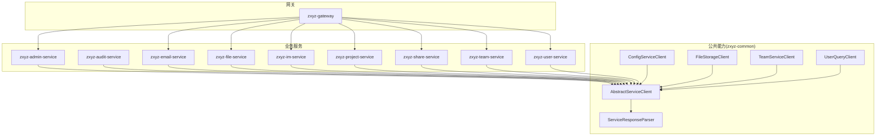
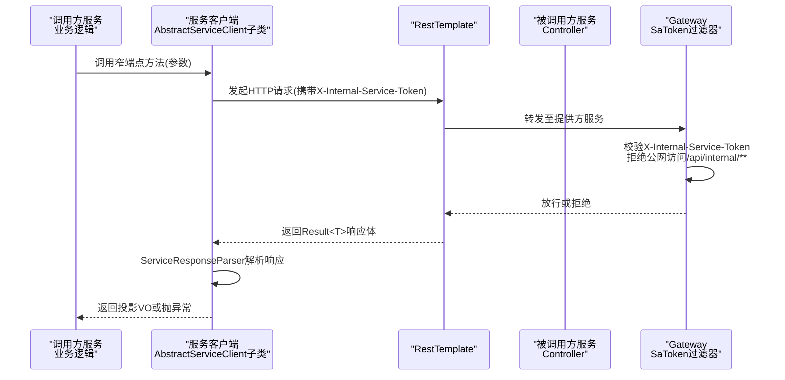
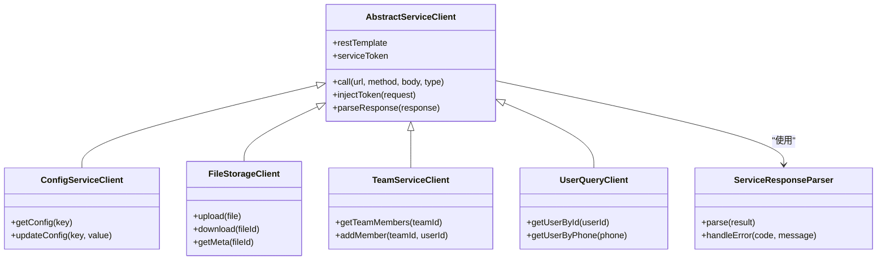

# 服务客户端模式

<cite>
**本文引用的文件**   
- [AbstractServiceClient.java](file://ZXYZdatabaseBack/zxyz-common/src/main/java/uno/acloud/client/AbstractServiceClient.java)
- [ServiceResponseParser.java](file://ZXYZdatabaseBack/zxyz-common/src/main/java/uno/acloud/client/ServiceResponseParser.java)
- [ConfigServiceClient.java](file://ZXYZdatabaseBack/zxyz-common/src/main/java/uno/acloud/client/ConfigServiceClient.java)
- [FileStorageClient.java](file://ZXYZdatabaseBack/zxyz-common/src/main/java/uno/acloud/client/FileStorageClient.java)
- [TeamServiceClient.java](file://ZXYZdatabaseBack/zxyz-common/src/main/java/uno/acloud/client/TeamServiceClient.java)
- [UserQueryClient.java](file://ZXYZdatabaseBack/zxyz-common/src/main/java/uno/acloud/client/UserQueryClient.java)
- [RestClientConfig.java](file://ZXYZdatabaseBack/zxyz-admin-service/src/main/java/uno/acloud/admin/config/RestClientConfig.java)
- [RestClientConfig.java](file://ZXYZdatabaseBack/zxyz-audit-service/src/main/java/uno/acloud/audit/config/RestClientConfig.java)
- [SaTokenConfigure.java](file://ZXYZdatabaseBack/zxyz-admin-service/src/main/java/uno/acloud/admin/config/SaTokenConfigure.java)
- [EmailProviderClient.java](file://ZXYZdatabaseBack/ZXYZdatabaseBack/zxyz-admin-service/src/main/java/uno/acloud/admin/client/EmailProviderClient.java)
- [StorageProviderClient.java](file://ZXYZdatabaseBack/ZXYZdatabaseBack/zxyz-admin-service/src/main/java/uno/acloud/admin/client/StorageProviderClient.java)
- [application.yml](file://ZXYZdatabaseBack/zxyz-gateway/src/main/resources/application.yml)
- [zxyz-gateway.yml](file://nacos-config/zxyz-gateway.yml)
</cite>

## 目录
1. [简介](#简介)
2. [项目结构](#项目结构)
3. [核心组件](#核心组件)
4. [架构总览](#架构总览)
5. [详细组件分析](#详细组件分析)
6. [依赖关系分析](#依赖关系分析)
7. [性能考虑](#性能考虑)
8. [故障排查指南](#故障排查指南)
9. [结论](#结论)
10. [附录：使用示例与最佳实践](#附录使用示例与最佳实践)

## 简介
本文件面向 ZXYZ 微服务项目的“服务客户端模式”，聚焦于跨服务同步通信的标准化实现。核心要点包括：
- 抽象基类 AbstractServiceClient 统一封装 RestTemplate 调用、请求头注入（X-Internal-Service-Token）、超时与重试策略、以及响应解析。
- ServiceResponseParser 提供统一的响应体解析与错误处理，确保各服务间返回结构一致、错误可观测。
- 内部服务调用采用窄端点设计（/api/internal/**）与投影 VO 返回，避免胖 DTO 泄露与过度耦合。
- Gateway 层通过 SaToken 过滤器拒绝公网访问内部端点，保障内网安全。
- 各业务服务通过继承 AbstractServiceClient 快速构建稳定、可维护的服务客户端。

## 项目结构
ZXYZ 后端由多个 Maven 模块组成，其中 zxyz-common 模块集中提供跨服务调用的通用能力（客户端抽象、响应解析等），各业务服务按需引入并扩展具体 Client。

图表来源
- [AbstractServiceClient.java](file://ZXYZdatabaseBack/zxyz-common/src/main/java/uno/acloud/client/AbstractServiceClient.java)
- [ServiceResponseParser.java](file://ZXYZdatabaseBack/zxyz-common/src/main/java/uno/acloud/client/ServiceResponseParser.java)
- [ConfigServiceClient.java](file://ZXYZdatabaseBack/zxyz-common/src/main/java/uno/acloud/client/ConfigServiceClient.java)
- [FileStorageClient.java](file://ZXYZdatabaseBack/zxyz-common/src/main/java/uno/acloud/client/FileStorageClient.java)
- [TeamServiceClient.java](file://ZXYZdatabaseBack/zxyz-common/src/main/java/uno/acloud/client/TeamServiceClient.java)
- [UserQueryClient.java](file://ZXYZdatabaseBack/zxyz-common/src/main/java/uno/acloud/client/UserQueryClient.java)

章节来源
- [AbstractServiceClient.java](file://ZXYZdatabaseBack/zxyz-common/src/main/java/uno/acloud/client/AbstractServiceClient.java)
- [ServiceResponseParser.java](file://ZXYZdatabaseBack/zxyz-common/src/main/java/uno/acloud/client/ServiceResponseParser.java)

## 核心组件
- AbstractServiceClient：抽象基类，封装 RestTemplate 初始化、请求拦截（注入 X-Internal-Service-Token）、超时配置、重试策略、以及统一调用入口。
- ServiceResponseParser：统一解析响应体，将标准 Result<T> 结构映射为业务对象或抛出规范化异常；对错误码、消息进行统一处理。
- 具体 Client：ConfigServiceClient、FileStorageClient、TeamServiceClient、UserQueryClient 等，继承 AbstractServiceClient 并定义窄端点调用方法，返回投影 VO。

章节来源
- [AbstractServiceClient.java](file://ZXYZdatabaseBack/zxyz-common/src/main/java/uno/acloud/client/AbstractServiceClient.java)
- [ServiceResponseParser.java](file://ZXYZdatabaseBack/zxyz-common/src/main/java/uno/acloud/client/ServiceResponseParser.java)
- [ConfigServiceClient.java](file://ZXYZdatabaseBack/zxyz-common/src/main/java/uno/acloud/client/ConfigServiceClient.java)
- [FileStorageClient.java](file://ZXYZdatabaseBack/zxyz-common/src/main/java/uno/acloud/client/FileStorageClient.java)
- [TeamServiceClient.java](file://ZXYZdatabaseBack/zxyz-common/src/main/java/uno/acloud/client/TeamServiceClient.java)
- [UserQueryClient.java](file://ZXYZdatabaseBack/zxyz-common/src/main/java/uno/acloud/client/UserQueryClient.java)

## 架构总览
下图展示了服务间调用从调用方到提供方、再经 Gateway 的安全校验的整体流程。

图表来源
- [AbstractServiceClient.java](file://ZXYZdatabaseBack/zxyz-common/src/main/java/uno/acloud/client/AbstractServiceClient.java)
- [ServiceResponseParser.java](file://ZXYZdatabaseBack/zxyz-common/src/main/java/uno/acloud/client/ServiceResponseParser.java)
- [application.yml](file://ZXYZdatabaseBack/zxyz-gateway/src/main/resources/application.yml)
- [zxyz-gateway.yml](file://nacos-config/zxyz-gateway.yml)

## 详细组件分析

### AbstractServiceClient 抽象基类
- 职责
  - 初始化并管理 RestTemplate（连接池、超时、重试）。
  - 在每次请求前注入 X-Internal-Service-Token 请求头。
  - 统一调用入口，屏蔽 HTTP 细节，向上暴露领域语义方法。
  - 与 ServiceResponseParser 协作，完成响应解析与错误转换。
- 关键设计
  - 模板方法：子类只需定义目标服务地址与窄端点路径，无需关心底层网络细节。
  - 安全头注入：所有内部调用必须携带鉴权令牌，防止越权访问。
  - 超时与重试：默认超时时间、最大重试次数、退避策略可配置化。
- 复杂度
  - 单次调用时间复杂度 O(1)，重试策略影响整体耗时。
  - 内存占用取决于连接池大小与并发度。

章节来源
- [AbstractServiceClient.java](file://ZXYZdatabaseBack/zxyz-common/src/main/java/uno/acloud/client/AbstractServiceClient.java)

### ServiceResponseParser 统一响应解析
- 职责
  - 解析标准 Result<T> 响应体，提取数据与错误信息。
  - 根据 code 字段判断成功/失败，失败时抛出规范化异常。
  - 支持 JsonNode 手动映射，避免 treeToValue 的性能问题。
- 错误处理
  - 统一错误码映射，便于上层捕获与告警。
  - 记录关键上下文（请求URL、状态码、部分响应体）用于排障。
- 性能
  - 避免不必要的对象转换，减少 GC 压力。
  - 对大响应体进行流式处理建议（如适用）。

章节来源
- [ServiceResponseParser.java](file://ZXYZdatabaseBack/zxyz-common/src/main/java/uno/acloud/client/ServiceResponseParser.java)

### 具体服务客户端示例
- ConfigServiceClient：配置中心相关窄端点调用，返回配置项投影 VO。
- FileStorageClient：文件存储服务的上传/下载/元信息查询，返回文件投影 VO。
- TeamServiceClient：团队权限、成员管理等窄端点调用，返回团队投影 VO。
- UserQueryClient：用户信息查询窄端点，返回用户投影 VO。

章节来源
- [ConfigServiceClient.java](file://ZXYZdatabaseBack/zxyz-common/src/main/java/uno/acloud/client/ConfigServiceClient.java)
- [FileStorageClient.java](file://ZXYZdatabaseBack/zxyz-common/src/main/java/uno/acloud/client/FileStorageClient.java)
- [TeamServiceClient.java](file://ZXYZdatabaseBack/zxyz-common/src/main/java/uno/acloud/client/TeamServiceClient.java)
- [UserQueryClient.java](file://ZXYZdatabaseBack/zxyz-common/src/main/java/uno/acloud/client/UserQueryClient.java)

### RestTemplate 配置与超时设置
- 配置位置
  - 各服务 RestClientConfig 中定义 RestTemplate Bean，设置连接超时、读取超时、连接池参数。
  - 可通过环境变量或 Nacos 动态调整。
- 超时策略
  - 连接超时：建立 TCP 连接的等待时间。
  - 读取超时：等待服务端响应的最长时间。
  - 重试间隔与最大重试次数：应对瞬时故障。
- 线程池
  - 合理配置连接池大小，避免资源耗尽。

章节来源
- [RestClientConfig.java](file://ZXYZdatabaseBack/zxyz-admin-service/src/main/java/uno/acloud/admin/config/RestClientConfig.java)
- [RestClientConfig.java](file://ZXYZdatabaseBack/zxyz-audit-service/src/main/java/uno/acloud/audit/config/RestClientConfig.java)

### 重试机制
- 触发条件
  - 网络异常、超时、特定 HTTP 状态码（如 5xx）。
- 策略
  - 指数退避 + 抖动，避免雪崩。
  - 幂等性保证：仅对 GET/HEAD 等幂等方法重试。
- 监控
  - 记录重试次数、最终结果、耗时分布。

章节来源
- [AbstractServiceClient.java](file://ZXYZdatabaseBack/zxyz-common/src/main/java/uno/acloud/client/AbstractServiceClient.java)

### 与 Gateway 的安全集成
- 内部端点保护
  - /api/internal/** 路径由 Gateway 的 SaToken 过滤器拦截，要求有效的 X-Internal-Service-Token。
  - 公网无法直接访问内部端点，防止越权。
- 认证流程
  - 调用方在服务启动时获取 Token 并缓存。
  - 每次请求自动注入请求头。
  - Gateway 校验 Token 有效性后放行。

章节来源
- [SaTokenConfigure.java](file://ZXYZdatabaseBack/zxyz-admin-service/src/main/java/uno/acloud/admin/config/SaTokenConfigure.java)
- [application.yml](file://ZXYZdatabaseBack/zxyz-gateway/src/main/resources/application.yml)
- [zxyz-gateway.yml](file://nacos-config/zxyz-gateway.yml)

## 依赖关系分析

图表来源
- [AbstractServiceClient.java](file://ZXYZdatabaseBack/zxyz-common/src/main/java/uno/acloud/client/AbstractServiceClient.java)
- [ServiceResponseParser.java](file://ZXYZdatabaseBack/zxyz-common/src/main/java/uno/acloud/client/ServiceResponseParser.java)
- [ConfigServiceClient.java](file://ZXYZdatabaseBack/zxyz-common/src/main/java/uno/acloud/client/ConfigServiceClient.java)
- [FileStorageClient.java](file://ZXYZdatabaseBack/zxyz-common/src/main/java/uno/acloud/client/FileStorageClient.java)
- [TeamServiceClient.java](file://ZXYZdatabaseBack/zxyz-common/src/main/java/uno/acloud/client/TeamServiceClient.java)
- [UserQueryClient.java](file://ZXYZdatabaseBack/zxyz-common/src/main/java/uno/acloud/client/UserQueryClient.java)

## 性能考虑
- 连接池优化
  - 合理设置最大连接数、空闲连接回收时间。
  - 避免短连接频繁创建销毁。
- 超时与重试
  - 根据业务 SLA 设置合理的超时阈值。
  - 重试需结合幂等性与熔断降级。
- 响应体处理
  - 使用投影 VO 减少数据传输量。
  - 避免不必要的 JSON 反序列化。
- 监控与告警
  - 记录 P95/P99 延迟、错误率、重试次数。
  - 设置阈值告警，及时发现异常。

## 故障排查指南
- 常见问题
  - 连接超时：检查网络连通性、服务端负载、超时配置。
  - 认证失败：确认 X-Internal-Service-Token 是否有效、是否过期。
  - 响应解析错误：检查 Result<T> 结构是否符合规范。
- 排查步骤
  - 查看网关日志，确认请求是否被放行。
  - 检查调用方与服务端的超时、重试配置。
  - 使用链路追踪工具定位慢调用。
- 日志建议
  - 记录请求 URL、方法、状态码、耗时、错误堆栈。
  - 脱敏敏感信息，避免泄露。

## 结论
ZXYZ 项目的服务客户端模式通过抽象基类与统一响应解析器，实现了跨服务调用的标准化、安全化与高性能化。窄端点设计与投影 VO 返回进一步降低了服务间耦合，提升了系统可维护性。配合 Gateway 的安全控制，确保了内部调用的安全性与稳定性。

## 附录：使用示例与最佳实践
- 新建服务客户端
  - 继承 AbstractServiceClient，定义目标服务地址与窄端点路径。
  - 实现具体方法，调用 ServiceResponseParser 解析响应。
  - 返回投影 VO，避免返回胖 DTO。
- 安全配置
  - 确保 X-Internal-Service-Token 正确注入。
  - 在 Gateway 中配置 /api/internal/** 的访问控制。
- 性能调优
  - 调整 RestTemplate 连接池与超时参数。
  - 启用重试与熔断，提升系统韧性。
- 监控与告警
  - 接入链路追踪与指标采集。
  - 设置关键指标告警阈值。

章节来源
- [EmailProviderClient.java](file://ZXYZdatabaseBack/ZXYZdatabaseBack/zxyz-admin-service/src/main/java/uno/acloud/admin/client/EmailProviderClient.java)
- [StorageProviderClient.java](file://ZXYZdatabaseBack/ZXYZdatabaseBack/zxyz-admin-service/src/main/java/uno/acloud/admin/client/StorageProviderClient.java)
- [AbstractServiceClient.java](file://ZXYZdatabaseBack/zxyz-common/src/main/java/uno/acloud/client/AbstractServiceClient.java)
- [ServiceResponseParser.java](file://ZXYZdatabaseBack/zxyz-common/src/main/java/uno/acloud/client/ServiceResponseParser.java)
- [application.yml](file://ZXYZdatabaseBack/zxyz-gateway/src/main/resources/application.yml)
- [zxyz-gateway.yml](file://nacos-config/zxyz-gateway.yml)