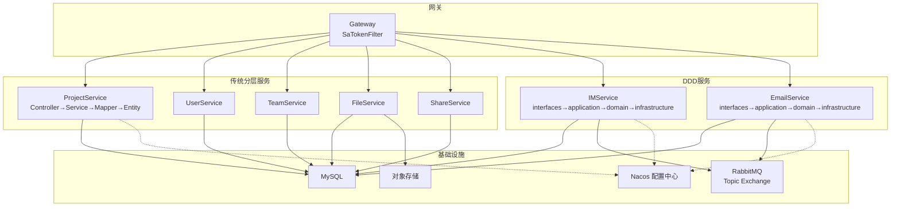
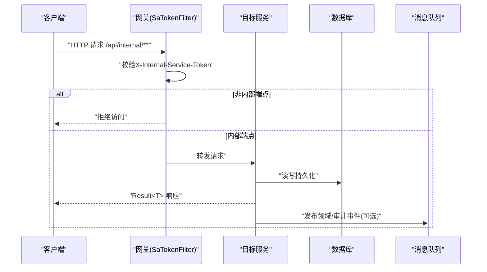
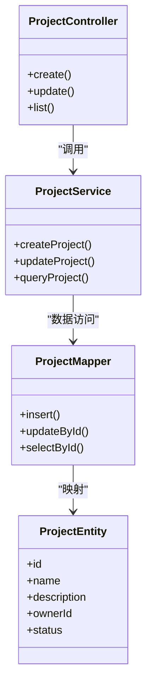
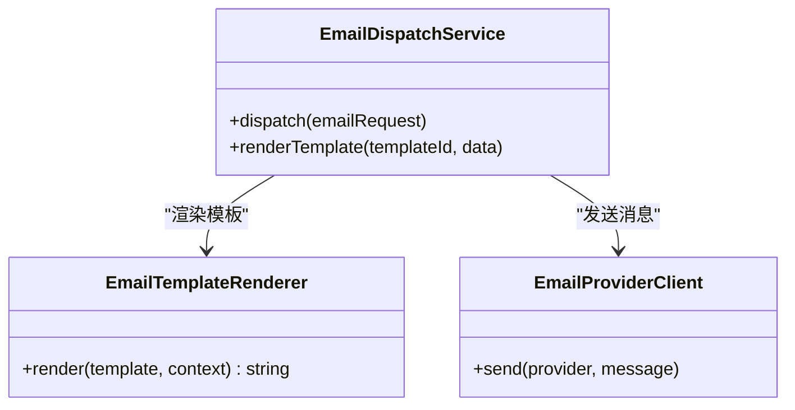
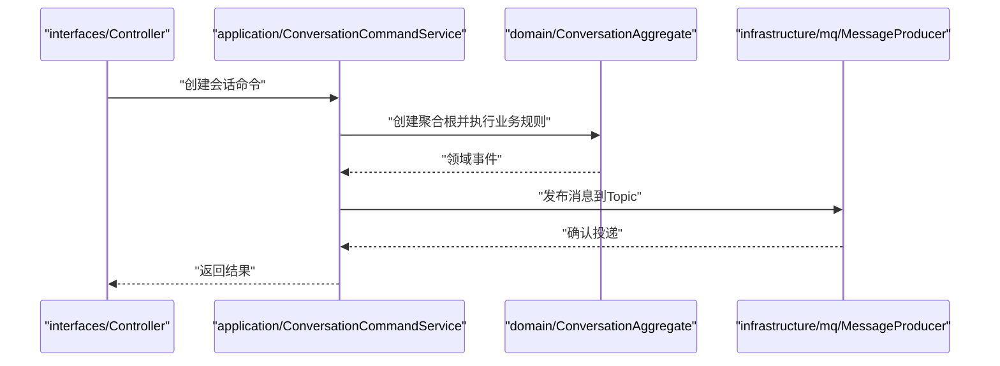
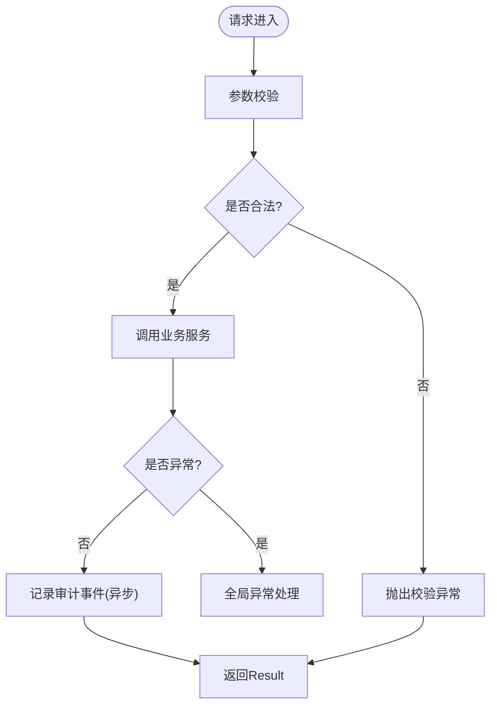
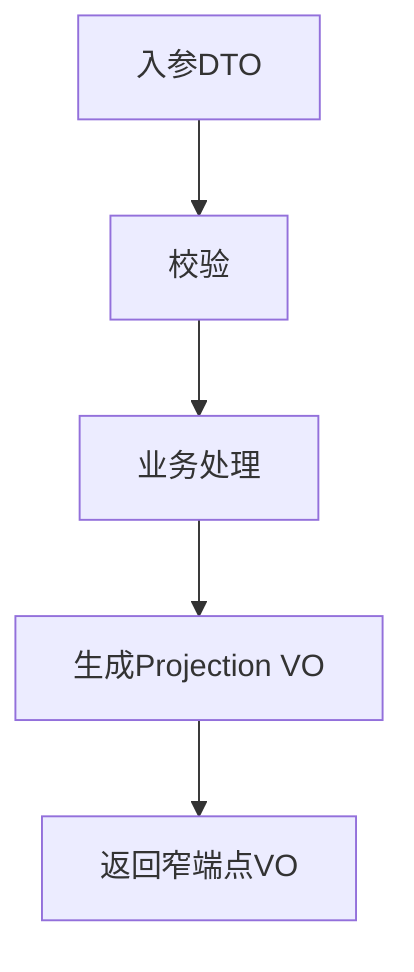
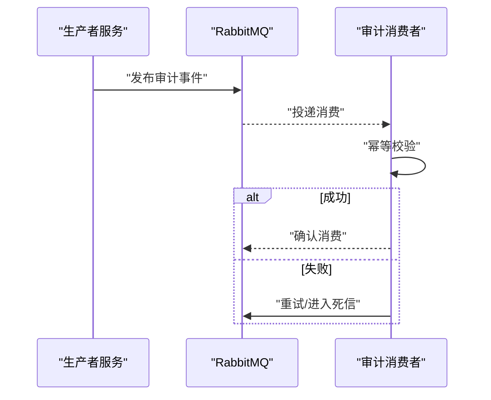
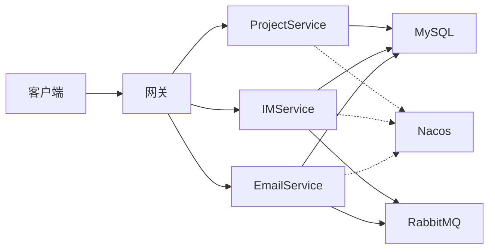

# 编码模式

<cite>
**本文引用的文件**   
- [zxyz-common/src/main/java/uno/acloud/client/AbstractServiceClient.java](file://ZXYZdatabaseBack/zxyz-common/src/main/java/uno/acloud/client/AbstractServiceClient.java)
- [zxyz-email-service/src/main/java/uno/acloud/email/application/EmailDispatchService.java](file://ZXYZdatabaseBack/zxyz-email-service/src/main/java/uno/acloud/email/application/EmailDispatchService.java)
- [zxyz-email-service/src/main/java/uno/acloud/email/domain/EmailTemplateRenderer.java](file://ZXYZdatabaseBack/zxyz-email-service/src/main/java/uno/acloud/email/domain/EmailTemplateRenderer.java)
- [zxyz-email-service/src/main/java/uno/acloud/email/infrastructure/EmailProviderClient.java](file://ZXYZdatabaseBack/zxyz-email-service/src/main/java/uno/acloud/email/infrastructure/EmailProviderClient.java)
- [zxyz-im-service/src/main/java/uno/acloud/im/application/ConversationCommandService.java](file://ZXYZdatabaseBack/zxyz-im-service/src/main/java/uno/acloud/im/application/ConversationCommandService.java)
- [zxyz-im-service/src/main/java/uno/acloud/im/domain/conversation/ConversationAggregate.java](file://ZXYZdatabaseBack/zxyz-im-service/src/main/java/uno/acloud/im/domain/conversation/ConversationAggregate.java)
- [zxyz-im-service/src/main/java/uno/acloud/im/infrastructure/mq/MessageProducer.java](file://ZXYZdatabaseBack/zxyz-im-service/src/main/java/uno/acloud/im/infrastructure/mq/MessageProducer.java)
- [zxyz-project-service/src/main/java/uno/acloud/project/service/ProjectService.java](file://ZXYZdatabaseBack/zxyz-project-service/src/main/java/uno/acloud/project/service/ProjectService.java)
- [zxyz-project-service/src/main/java/uno/acloud/project/mapper/ProjectMapper.java](file://ZXYZdatabaseBack/zxyz-project-service/src/main/java/uno/acloud/project/mapper/ProjectMapper.java)
- [zxyz-project-service/src/main/java/uno/acloud/project/entity/ProjectEntity.java](file://ZXYZdatabaseBack/zxyz-project-service/src/main/java/uno/acloud/project/entity/ProjectEntity.java)
- [zxyz-common/src/main/java/uno/acloud/common/web/Result.java](file://ZXYZdatabaseBack/zxyz-common/src/main/java/uno/acloud/common/web/Result.java)
- [zxyz-common/src/main/java/uno/acloud/exception/GlobalExceptionHandler.java](file://ZXYZdatabaseBack/zxyz-common/src/main/java/uno/acloud/exception/GlobalExceptionHandler.java)
- [zxyz-common/src/main/java/uno/acloud/common/config/AuditAspect.java](file://ZXYZdatabaseBack/zxyz-common/src/main/java/uno/acloud/common/config/AuditAspect.java)
- [zxyz-common/src/main/java/uno/acloud/common/config/ValidationConfig.java](file://ZXYZdatabaseBack/zxyz-common/src/main/java/uno/acloud/common/config/ValidationConfig.java)
- [zxyz-common/src/main/java/uno/acloud/common/audit/AuditEventPublisher.java](file://ZXYZdatabaseBack/zxyz-common/src/main/java/uno/acloud/common/audit/AuditEventPublisher.java)
- [zxyz-common/src/main/java/uno/acloud/common/event/BaseDomainEvent.java](file://ZXYZdatabaseBack/zxyz-common/src/main/java/uno/acloud/common/event/BaseDomainEvent.java)
- [zxyz-audit-service/src/main/java/uno/acloud/audit/mq/OperateLogConsumer.java](file://ZXYZdatabaseBack/zxyz-audit-service/src/main/java/uno/acloud/audit/mq/OperateLogConsumer.java)
- [zxyz-gateway/src/main/java/uno/acloud/gateway/filter/SaTokenFilter.java](file://ZXYZdatabaseBack/zxyz-gateway/src/main/java/uno/acloud/gateway/filter/SaTokenFilter.java)
- [nacos-config/zxyz-dynamic.yml](file://nacos-config/zxyz-dynamic.yml)
- [docker-compose.yml](file://docker-compose.yml)
</cite>

## 目录
1. [简介](#简介)
2. [项目结构](#项目结构)
3. [核心组件](#核心组件)
4. [架构总览](#架构总览)
5. [详细组件分析](#详细组件分析)
6. [依赖关系分析](#依赖关系分析)
7. [性能考量](#性能考量)
8. [故障排查指南](#故障排查指南)
9. [结论](#结论)
10. [附录](#附录)

## 简介
本编码模式文档面向 ZXYZ 微服务工程，系统阐述两类分层架构与通用组件实践：
- 传统分层架构（Controller → Service → Mapper → Entity）：适用于大多数业务服务，强调职责清晰、数据流转线性。
- DDD 分层架构（interfaces → application → domain → infrastructure）：在 im-service 与 email-service 中落地，强调领域模型与边界清晰。
同时覆盖通用组件设计（抽象客户端、AOP、参数校验、异常处理、日志审计）、DTO/VO 转换与窄端点投影模式、事务管理与一致性保证（分布式事务、最终一致性、补偿机制），并给出架构图与最佳实践。

## 项目结构
ZXYZ 采用多模块 Maven + Docker Compose 编排的单体仓库式微服务工程。后端包含 11 个服务模块与一个公共库 zxyz-common；前端为 Vue 3 SPA。关键组织方式：
- 传统分层服务：controller/service/impl/mapper/entity/vo/dto 等包结构清晰，数据流自上而下。
- DDD 服务：interfaces/application/domain/infrastructure 四层分离，领域事件驱动跨层协作。
- 公共能力下沉至 zxyz-common：统一响应、异常、鉴权、审计、MQ、配置、工具类等。

图示来源
- [docker-compose.yml](file://docker-compose.yml)
- [zxyz-gateway/src/main/java/uno/acloud/gateway/filter/SaTokenFilter.java](file://ZXYZdatabaseBack/zxyz-gateway/src/main/java/uno/acloud/gateway/filter/SaTokenFilter.java)

章节来源
- [docker-compose.yml](file://docker-compose.yml)

## 核心组件
- 抽象客户端 AbstractServiceClient：封装服务间 HTTP 调用、重试、超时、错误码解析与内部令牌注入，统一对外暴露 Client 接口。
- AOP 切面：统一审计、幂等、限流、监控等横切关注点，减少样板代码。
- 参数校验：基于 JSR-303/380 注解与全局校验配置，确保入参合法性。
- 异常处理：统一异常类型与全局处理器，返回标准 Result<T>。
- 日志与审计：通过事件发布器将操作审计异步化，降低主流程开销。

章节来源
- [zxyz-common/src/main/java/uno/acloud/client/AbstractServiceClient.java](file://ZXYZdatabaseBack/zxyz-common/src/main/java/uno/acloud/client/AbstractServiceClient.java)
- [zxyz-common/src/main/java/uno/acloud/common/config/AuditAspect.java](file://ZXYZdatabaseBack/zxyz-common/src/main/java/uno/acloud/common/config/AuditAspect.java)
- [zxyz-common/src/main/java/uno/acloud/common/config/ValidationConfig.java](file://ZXYZdatabaseBack/zxyz-common/src/main/java/uno/acloud/common/config/ValidationConfig.java)
- [zxyz-common/src/main/java/uno/acloud/exception/GlobalExceptionHandler.java](file://ZXYZdatabaseBack/zxyz-common/src/main/java/uno/acloud/exception/GlobalExceptionHandler.java)
- [zxyz-common/src/main/java/uno/acloud/common/web/Result.java](file://ZXYZdatabaseBack/zxyz-common/src/main/java/uno/acloud/common/web/Result.java)
- [zxyz-common/src/main/java/uno/acloud/common/audit/AuditEventPublisher.java](file://ZXYZdatabaseBack/zxyz-common/src/main/java/uno/acloud/common/audit/AuditEventPublisher.java)

## 架构总览
ZXYZ 整体遵循“网关统一入口 + 服务自治 + 基础设施解耦”的微服务架构。请求进入 Gateway，经 SaToken 鉴权后路由到具体服务；服务内部根据风格选择传统分层或 DDD 分层；跨服务同步调用通过 ServiceClient，异步通信通过 RabbitMQ Topic Exchange；配置由 Nacos 统一管理，敏感信息使用 Jasypt 加密。

图示来源
- [zxyz-gateway/src/main/java/uno/acloud/gateway/filter/SaTokenFilter.java](file://ZXYZdatabaseBack/zxyz-gateway/src/main/java/uno/acloud/gateway/filter/SaTokenFilter.java)

## 详细组件分析

### 传统分层架构（Controller → Service → Mapper → Entity）
- Controller：接收请求、参数校验、调用 Service，返回 Result<T>。
- Service：业务编排、事务边界、调用其他服务客户端。
- Mapper：MyBatis/JPA 映射，负责 SQL 与实体映射。
- Entity：数据库表映射对象，保持轻量。

图示来源
- [zxyz-project-service/src/main/java/uno/acloud/project/service/ProjectService.java](file://ZXYZdatabaseBack/zxyz-project-service/src/main/java/uno/acloud/project/service/ProjectService.java)
- [zxyz-project-service/src/main/java/uno/acloud/project/mapper/ProjectMapper.java](file://ZXYZdatabaseBack/zxyz-project-service/src/main/java/uno/acloud/project/mapper/ProjectMapper.java)
- [zxyz-project-service/src/main/java/uno/acloud/project/entity/ProjectEntity.java](file://ZXYZdatabaseBack/zxyz-project-service/src/main/java/uno/acloud/project/entity/ProjectEntity.java)

章节来源
- [zxyz-project-service/src/main/java/uno/acloud/project/service/ProjectService.java](file://ZXYZdatabaseBack/zxyz-project-service/src/main/java/uno/acloud/project/service/ProjectService.java)
- [zxyz-project-service/src/main/java/uno/acloud/project/mapper/ProjectMapper.java](file://ZXYZdatabaseBack/zxyz-project-service/src/main/java/uno/acloud/project/mapper/ProjectMapper.java)
- [zxyz-project-service/src/main/java/uno/acloud/project/entity/ProjectEntity.java](file://ZXYZdatabaseBack/zxyz-project-service/src/main/java/uno/acloud/project/entity/ProjectEntity.java)

### DDD 分层架构（interfaces → application → domain → infrastructure）
- interfaces：对外 API 契约（Controller/DTO/VO）。
- application：用例编排、协调领域与基础设施，无领域知识。
- domain：领域模型、聚合根、领域服务、领域事件。
- infrastructure：外部依赖实现（DB、MQ、第三方 SDK）。

#### EmailService 中的 DDD 应用

图示来源
- [zxyz-email-service/src/main/java/uno/acloud/email/application/EmailDispatchService.java](file://ZXYZdatabaseBack/zxyz-email-service/src/main/java/uno/acloud/email/application/EmailDispatchService.java)
- [zxyz-email-service/src/main/java/uno/acloud/email/domain/EmailTemplateRenderer.java](file://ZXYZdatabaseBack/zxyz-email-service/src/main/java/uno/acloud/email/domain/EmailTemplateRenderer.java)
- [zxyz-email-service/src/main/java/uno/acloud/email/infrastructure/EmailProviderClient.java](file://ZXYZdatabaseBack/zxyz-email-service/src/main/java/uno/acloud/email/infrastructure/EmailProviderClient.java)

章节来源
- [zxyz-email-service/src/main/java/uno/acloud/email/application/EmailDispatchService.java](file://ZXYZdatabaseBack/zxyz-email-service/src/main/java/uno/acloud/email/application/EmailDispatchService.java)
- [zxyz-email-service/src/main/java/uno/acloud/email/domain/EmailTemplateRenderer.java](file://ZXYZdatabaseBack/zxyz-email-service/src/main/java/uno/acloud/email/domain/EmailTemplateRenderer.java)
- [zxyz-email-service/src/main/java/uno/acloud/email/infrastructure/EmailProviderClient.java](file://ZXYZdatabaseBack/zxyz-email-service/src/main/java/uno/acloud/email/infrastructure/EmailProviderClient.java)

#### IMService 中的 DDD 应用

图示来源
- [zxyz-im-service/src/main/java/uno/acloud/im/application/ConversationCommandService.java](file://ZXYZdatabaseBack/zxyz-im-service/src/main/java/uno/acloud/im/application/ConversationCommandService.java)
- [zxyz-im-service/src/main/java/uno/acloud/im/domain/conversation/ConversationAggregate.java](file://ZXYZdatabaseBack/zxyz-im-service/src/main/java/uno/acloud/im/domain/conversation/ConversationAggregate.java)
- [zxyz-im-service/src/main/java/uno/acloud/im/infrastructure/mq/MessageProducer.java](file://ZXYZdatabaseBack/zxyz-im-service/src/main/java/uno/acloud/im/infrastructure/mq/MessageProducer.java)

章节来源
- [zxyz-im-service/src/main/java/uno/acloud/im/application/ConversationCommandService.java](file://ZXYZdatabaseBack/zxyz-im-service/src/main/java/uno/acloud/im/application/ConversationCommandService.java)
- [zxyz-im-service/src/main/java/uno/acloud/im/domain/conversation/ConversationAggregate.java](file://ZXYZdatabaseBack/zxyz-im-service/src/main/java/uno/acloud/im/domain/conversation/ConversationAggregate.java)
- [zxyz-im-service/src/main/java/uno/acloud/im/infrastructure/mq/MessageProducer.java](file://ZXYZdatabaseBack/zxyz-im-service/src/main/java/uno/acloud/im/infrastructure/mq/MessageProducer.java)

### 通用组件设计
- AbstractServiceClient：统一封装 HTTP 客户端、重试策略、超时控制、错误码解析与内部令牌注入，避免重复造轮子。
- AOP 切面：集中实现审计、幂等、限流、监控等横切逻辑，提升可维护性。
- 参数校验：基于注解的全局校验配置，快速拦截非法输入。
- 异常处理：统一异常类型与全局处理器，输出标准 Result<T>。
- 日志与审计：通过事件发布器将审计事件异步化，降低主链路延迟。

图示来源
- [zxyz-common/src/main/java/uno/acloud/common/config/ValidationConfig.java](file://ZXYZdatabaseBack/zxyz-common/src/main/java/uno/acloud/common/config/ValidationConfig.java)
- [zxyz-common/src/main/java/uno/acloud/exception/GlobalExceptionHandler.java](file://ZXYZdatabaseBack/zxyz-common/src/main/java/uno/acloud/exception/GlobalExceptionHandler.java)
- [zxyz-common/src/main/java/uno/acloud/common/audit/AuditEventPublisher.java](file://ZXYZdatabaseBack/zxyz-common/src/main/java/uno/acloud/common/audit/AuditEventPublisher.java)

章节来源
- [zxyz-common/src/main/java/uno/acloud/client/AbstractServiceClient.java](file://ZXYZdatabaseBack/zxyz-common/src/main/java/uno/acloud/client/AbstractServiceClient.java)
- [zxyz-common/src/main/java/uno/acloud/common/config/AuditAspect.java](file://ZXYZdatabaseBack/zxyz-common/src/main/java/uno/acloud/common/config/AuditAspect.java)
- [zxyz-common/src/main/java/uno/acloud/common/config/ValidationConfig.java](file://ZXYZdatabaseBack/zxyz-common/src/main/java/uno/acloud/common/config/ValidationConfig.java)
- [zxyz-common/src/main/java/uno/acloud/exception/GlobalExceptionHandler.java](file://ZXYZdatabaseBack/zxyz-common/src/main/java/uno/acloud/exception/GlobalExceptionHandler.java)
- [zxyz-common/src/main/java/uno/acloud/common/audit/AuditEventPublisher.java](file://ZXYZdatabaseBack/zxyz-common/src/main/java/uno/acloud/common/audit/AuditEventPublisher.java)

### DTO/VO 转换与窄端点投影模式
- DTO：用于入参传输，承载校验与约束。
- VO：用于出参展示，按视图需求裁剪字段，避免胖 DTO。
- 投影模式：内部端点返回调用方专用 Projection VO，禁止返回完整领域对象；JsonNode 手动映射字段，不使用 treeToValue，便于双方独立演进。

章节来源
- [zxyz-common/src/main/java/uno/acloud/common/web/Result.java](file://ZXYZdatabaseBack/zxyz-common/src/main/java/uno/acloud/common/web/Result.java)

### 事务管理与一致性保证
- 本地事务：Service 层使用声明式事务管理数据库操作。
- 分布式一致性：通过 RabbitMQ Topic Exchange 实现最终一致性；关键路径采用“事件+补偿”机制，失败重试与死信队列保障可靠性。
- 审计与幂等：审计事件异步化，结合消息去重与幂等键，避免重复处理。

图示来源
- [zxyz-common/src/main/java/uno/acloud/common/audit/AuditEventPublisher.java](file://ZXYZdatabaseBack/zxyz-common/src/main/java/uno/acloud/common/audit/AuditEventPublisher.java)
- [zxyz-audit-service/src/main/java/uno/acloud/audit/mq/OperateLogConsumer.java](file://ZXYZdatabaseBack/zxyz-audit-service/src/main/java/uno/acloud/audit/mq/OperateLogConsumer.java)

章节来源
- [zxyz-common/src/main/java/uno/acloud/common/event/BaseDomainEvent.java](file://ZXYZdatabaseBack/zxyz-common/src/main/java/uno/acloud/common/event/BaseDomainEvent.java)
- [zxyz-audit-service/src/main/java/uno/acloud/audit/mq/OperateLogConsumer.java](file://ZXYZdatabaseBack/zxyz-audit-service/src/main/java/uno/acloud/audit/mq/OperateLogConsumer.java)

## 依赖关系分析
- 服务间耦合：通过 ServiceClient 进行弱耦合调用，配合内部令牌鉴权与窄端点投影，降低接口变更影响。
- 基础设施依赖：DB、MQ、OSS、Nacos 等通过 Infrastructure 层隔离，领域与应用层不感知实现细节。
- 配置与部署：Nacos 动态配置，Docker Compose 编排容器，CI/CD 选择性构建与镜像推送。

图示来源
- [docker-compose.yml](file://docker-compose.yml)
- [nacos-config/zxyz-dynamic.yml](file://nacos-config/zxyz-dynamic.yml)

章节来源
- [docker-compose.yml](file://docker-compose.yml)
- [nacos-config/zxyz-dynamic.yml](file://nacos-config/zxyz-dynamic.yml)

## 性能考量
- 连接池与超时：合理设置 HTTP/DB/MQ 连接池大小与超时时间，避免资源耗尽。
- 异步化：将审计、通知等非关键路径异步化，缩短主链路 RT。
- 缓存与投影：对热点查询引入缓存；使用窄端点投影减少网络传输与序列化成本。
- 重试与退避：对不稳定依赖实施指数退避重试，避免雪崩。

[本节为通用指导，无需特定文件引用]

## 故障排查指南
- 鉴权失败：检查 Gateway 的 SaToken 过滤器与 X-Internal-Service-Token 是否正确传递。
- 参数校验失败：查看全局校验配置与注解使用，定位非法字段。
- 异常未捕获：确认全局异常处理器是否生效，Result<T> 结构是否一致。
- 审计缺失：检查事件发布器与消费者是否正常消费，死信队列是否有堆积。
- 配置问题：核对 Nacos 动态配置项与服务启动参数。

章节来源
- [zxyz-gateway/src/main/java/uno/acloud/gateway/filter/SaTokenFilter.java](file://ZXYZdatabaseBack/zxyz-gateway/src/main/java/uno/acloud/gateway/filter/SaTokenFilter.java)
- [zxyz-common/src/main/java/uno/acloud/common/config/ValidationConfig.java](file://ZXYZdatabaseBack/zxyz-common/src/main/java/uno/acloud/common/config/ValidationConfig.java)
- [zxyz-common/src/main/java/uno/acloud/exception/GlobalExceptionHandler.java](file://ZXYZdatabaseBack/zxyz-common/src/main/java/uno/acloud/exception/GlobalExceptionHandler.java)
- [zxyz-common/src/main/java/uno/acloud/common/audit/AuditEventPublisher.java](file://ZXYZdatabaseBack/zxyz-common/src/main/java/uno/acloud/common/audit/AuditEventPublisher.java)
- [zxyz-audit-service/src/main/java/uno/acloud/audit/mq/OperateLogConsumer.java](file://ZXYZdatabaseBack/zxyz-audit-service/src/main/java/uno/acloud/audit/mq/OperateLogConsumer.java)
- [nacos-config/zxyz-dynamic.yml](file://nacos-config/zxyz-dynamic.yml)

## 结论
ZXYZ 通过混合分层架构与通用组件沉淀，实现了清晰的职责边界与高内聚低耦合。传统分层适合稳定 CRUD 场景，DDD 分层适合复杂领域与事件驱动场景。统一的客户端、AOP、校验、异常与审计机制提升了可维护性与稳定性。借助 MQ 的最终一致性与补偿机制，系统在分布式环境下具备更强的鲁棒性。建议持续优化投影与缓存策略，完善监控与告警体系，进一步提升性能与可观测性。

[本节为总结，无需特定文件引用]

## 附录
- 最佳实践清单
  - 严格区分 DTO/VO，内部端点仅返回必要字段。
  - 所有跨服务调用走 ServiceClient，统一错误码与重试策略。
  - 业务事务边界放在 Service 层，避免在 Controller 或 Mapper 中管理事务。
  - 使用 AOP 集中处理横切关注点，保持业务代码简洁。
  - 关键路径引入事件与补偿，确保最终一致性。
  - 配置集中化管理，敏感信息加密存储。

[本节为补充说明，无需特定文件引用]