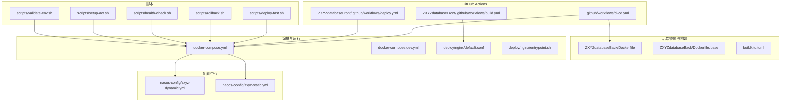
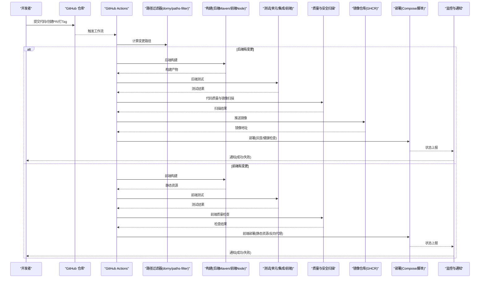
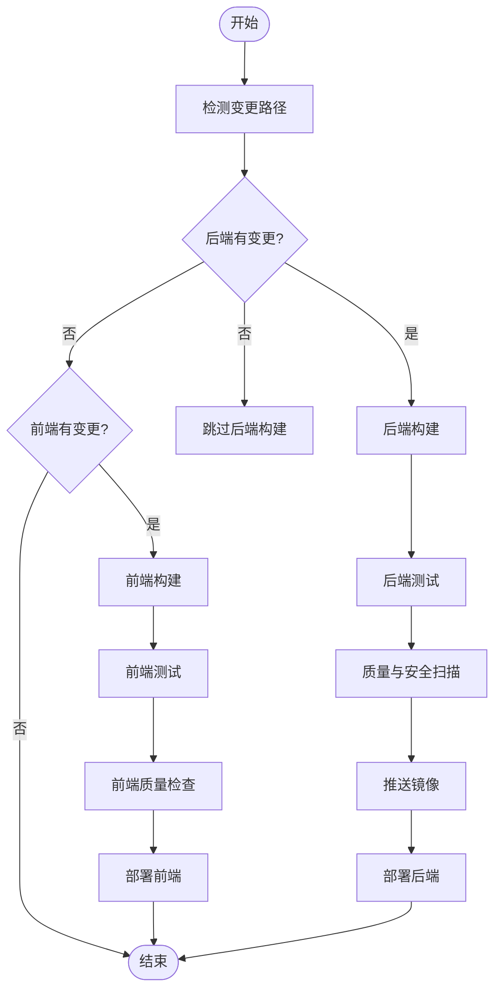
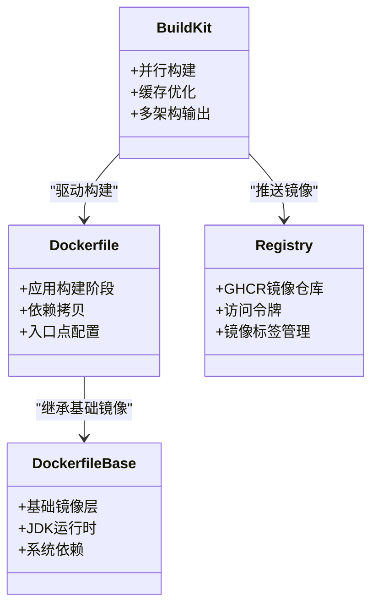
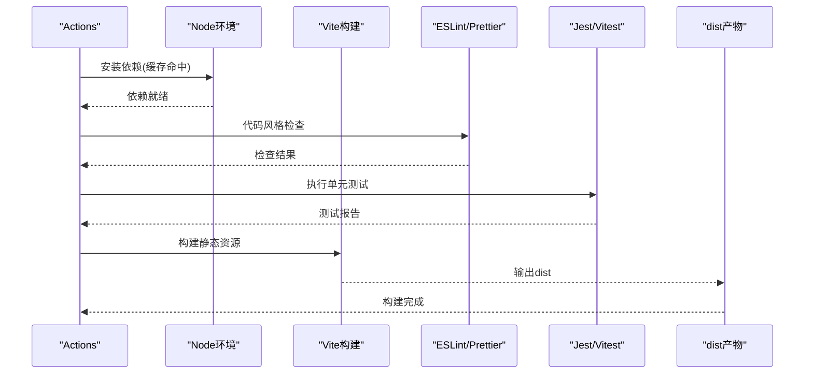
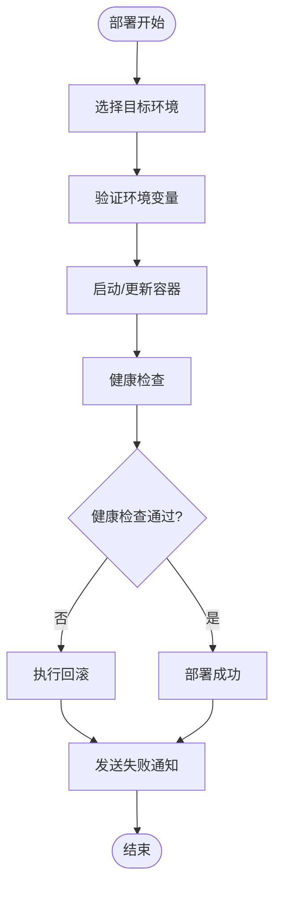
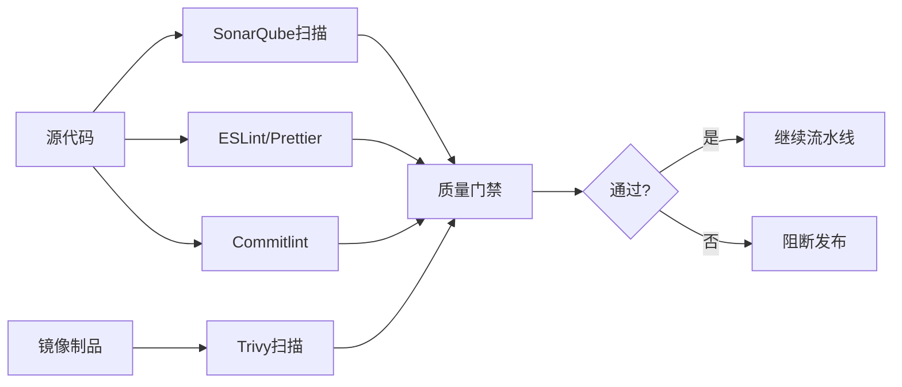
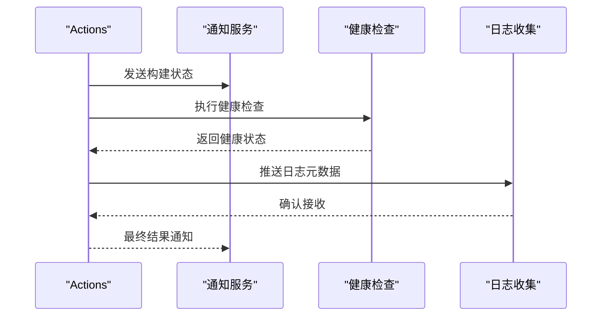
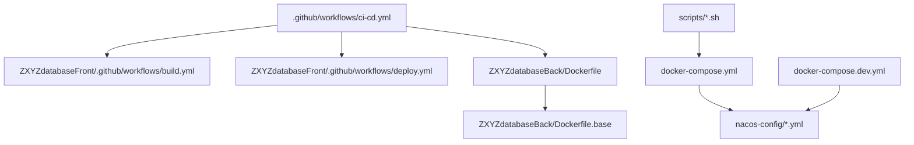

# CI/CD流水线

<cite>
**本文引用的文件**   
- [ci-cd.yml](file://.github/workflows/ci-cd.yml)
- [build.yml](file://ZXYZdatabaseFront/.github/workflows/build.yml)
- [deploy.yml](file://ZXYZdatabaseFront/.github/workflows/deploy.yml)
- [Dockerfile](file://ZXYZdatabaseBack/Dockerfile)
- [Dockerfile.base](file://ZXYZdatabaseBack/Dockerfile.base)
- [docker-compose.yml](file://docker-compose.yml)
- [docker-compose.dev.yml](file://docker-compose.dev.yml)
- [buildkitd.toml](file://buildkitd.toml)
- [deploy-fast.sh](file://scripts/deploy-fast.sh)
- [rollback.sh](file://scripts/rollback.sh)
- [health-check.sh](file://scripts/health-check.sh)
- [setup-acr.sh](file://scripts/setup-acr.sh)
- [validate-env.sh](file://scripts/validate-env.sh)
- [nginx/default.conf](file://deploy/nginx/default.conf)
- [nginx/entrypoint.sh](file://deploy/nginx/entrypoint.sh)
- [promtail-config.yml](file://deploy/promtail-config.yml)
- [nacos-config/zxyz-dynamic.yml](file://nacos-config/zxyz-dynamic.yml)
- [nacos-config/zxyz-static.yml](file://nacos-config/zxyz-static.yml)
- [package.json](file://ZXYZdatabaseFront/package.json)
- [vite.config.js](file://ZXYZdatabaseFront/vite.config.js)
- [eslint.config.mjs](file://ZXYZdatabaseFront/eslint.config.mjs)
- [commitlint.config.js](file://ZXYZdatabaseFront/commitlint.config.js)
</cite>

## 目录
1. [简介](#简介)
2. [项目结构](#项目结构)
3. [核心组件](#核心组件)
4. [架构总览](#架构总览)
5. [详细组件分析](#详细组件分析)
6. [依赖分析](#依赖分析)
7. [性能考虑](#性能考虑)
8. [故障排查指南](#故障排查指南)
9. [结论](#结论)
10. [附录](#附录)

## 简介
本文件为 ZXYZ 项目的 CI/CD 流水线提供全面说明，覆盖基于 GitHub Actions 的自动化构建、测试与发布流程。重点包括：
- 选择性构建策略：使用 dorny/paths-filter 实现代码变更检测与增量构建
- 镜像构建：多架构支持、镜像标签管理与 GHCR 推送策略
- 自动化测试：后端单元测试/集成测试、前端单元测试与静态检查
- 部署流水线：环境隔离、灰度发布与回滚策略
- 安全扫描与质量门禁：SonarQube 集成、安全漏洞扫描
- 监控与通知：构建状态通知与失败告警

## 项目结构
ZXYZ 采用微服务架构（后端 Maven 多模块 + Vue 前端），CI/CD 配置集中在 .github/workflows 与前端子工程的 .github/workflows；镜像与编排由 Docker 与 docker-compose 管理；Nacos 配置集中管理；脚本位于 scripts 与 deploy 目录。

图表来源
- [ci-cd.yml](file://.github/workflows/ci-cd.yml)
- [build.yml](file://ZXYZdatabaseFront/.github/workflows/build.yml)
- [deploy.yml](file://ZXYZdatabaseFront/.github/workflows/deploy.yml)
- [Dockerfile](file://ZXYZdatabaseBack/Dockerfile)
- [Dockerfile.base](file://ZXYZdatabaseBack/Dockerfile.base)
- [docker-compose.yml](file://docker-compose.yml)
- [docker-compose.dev.yml](file://docker-compose.dev.yml)
- [nginx/default.conf](file://deploy/nginx/default.conf)
- [nginx/entrypoint.sh](file://deploy/nginx/entrypoint.sh)
- [nacos-config/zxyz-dynamic.yml](file://nacos-config/zxyz-dynamic.yml)
- [nacos-config/zxyz-static.yml](file://nacos-config/zxyz-static.yml)
- [deploy-fast.sh](file://scripts/deploy-fast.sh)
- [rollback.sh](file://scripts/rollback.sh)
- [health-check.sh](file://scripts/health-check.sh)
- [setup-acr.sh](file://scripts/setup-acr.sh)
- [validate-env.sh](file://scripts/validate-env.sh)

章节来源
- [ci-cd.yml](file://.github/workflows/ci-cd.yml)
- [docker-compose.yml](file://docker-compose.yml)
- [docker-compose.dev.yml](file://docker-compose.dev.yml)

## 核心组件
- 选择性构建与触发器
  - 通过 dorny/paths-filter 对后端与前端路径进行差异检测，仅对变更模块执行构建与测试，减少流水线耗时
  - 分支策略：main/develop 等分支触发不同阶段（构建、测试、发布）
- 后端构建与测试
  - Maven 多模块编译、打包与缓存加速
  - 单元测试与集成测试并行执行，生成覆盖率报告
- 前端构建与测试
  - Node 依赖缓存、Vite 构建产物输出
  - ESLint/Prettier/Commitlint 静态检查与提交规范校验
  - Jest/Vitest 单元测试执行
- 镜像构建与推送
  - 多架构镜像构建（如 linux/amd64、linux/arm64）
  - 镜像标签策略：按分支、Tag、SHA 生成唯一标签，推送到 GHCR
- 部署与发布
  - 基于 docker-compose 的环境隔离（dev/staging/prod）
  - 灰度发布：滚动更新与健康检查
  - 回滚策略：保留历史镜像版本并快速切换
- 质量与安全
  - SonarQube 代码质量门禁
  - 容器镜像安全扫描（Trivy/Snyk）
- 监控与通知
  - 构建状态通知（邮件/Slack/钉钉）
  - 健康检查与失败告警

章节来源
- [ci-cd.yml](file://.github/workflows/ci-cd.yml)
- [build.yml](file://ZXYZdatabaseFront/.github/workflows/build.yml)
- [deploy.yml](file://ZXYZdatabaseFront/.github/workflows/deploy.yml)
- [package.json](file://ZXYZdatabaseFront/package.json)
- [vite.config.js](file://ZXYZdatabaseFront/vite.config.js)
- [eslint.config.mjs](file://ZXYZdatabaseFront/eslint.config.mjs)
- [commitlint.config.js](file://ZXYZdatabaseFront/commitlint.config.js)

## 架构总览
下图展示了从代码提交到镜像构建、测试、推送与部署的端到端流程，以及关键工具链与制品流转。

图表来源
- [ci-cd.yml](file://.github/workflows/ci-cd.yml)
- [build.yml](file://ZXYZdatabaseFront/.github/workflows/build.yml)
- [deploy.yml](file://ZXYZdatabaseFront/.github/workflows/deploy.yml)
- [docker-compose.yml](file://docker-compose.yml)
- [deploy-fast.sh](file://scripts/deploy-fast.sh)
- [health-check.sh](file://scripts/health-check.sh)

## 详细组件分析

### 选择性构建与增量测试
- 使用 dorny/paths-filter 识别后端与前端变更路径，避免全量构建
- 根据变更范围决定执行哪些模块的测试与构建
- 缓存 Maven 依赖与 Node_modules，提升二次构建速度

图表来源
- [ci-cd.yml](file://.github/workflows/ci-cd.yml)

章节来源
- [ci-cd.yml](file://.github/workflows/ci-cd.yml)

### 后端镜像构建与多架构支持
- 基础镜像分层：使用 Dockerfile.base 定义公共基础层，减少重复构建
- 多架构构建：通过 buildx 或等效机制同时产出 amd64/arm64 镜像
- 镜像标签策略：按分支名、Git Tag、Commit SHA 生成标签，便于追踪与回滚
- 推送至 GHCR：使用 GitHub 认证推送镜像，确保访问控制

图表来源
- [Dockerfile](file://ZXYZdatabaseBack/Dockerfile)
- [Dockerfile.base](file://ZXYZdatabaseBack/Dockerfile.base)
- [buildkitd.toml](file://buildkitd.toml)
- [ci-cd.yml](file://.github/workflows/ci-cd.yml)

章节来源
- [Dockerfile](file://ZXYZdatabaseBack/Dockerfile)
- [Dockerfile.base](file://ZXYZdatabaseBack/Dockerfile.base)
- [buildkitd.toml](file://buildkitd.toml)
- [ci-cd.yml](file://.github/workflows/ci-cd.yml)

### 前端构建与测试
- 依赖安装与缓存：Node 版本锁定与依赖缓存
- 构建产物：Vite 构建静态资源，输出到 dist 目录
- 静态检查：ESLint、Prettier、Commitlint 保障代码质量
- 单元测试：Jest/Vitest 执行前端测试用例

图表来源
- [build.yml](file://ZXYZdatabaseFront/.github/workflows/build.yml)
- [package.json](file://ZXYZdatabaseFront/package.json)
- [vite.config.js](file://ZXYZdatabaseFront/vite.config.js)
- [eslint.config.mjs](file://ZXYZdatabaseFront/eslint.config.mjs)
- [commitlint.config.js](file://ZXYZdatabaseFront/commitlint.config.js)

章节来源
- [build.yml](file://ZXYZdatabaseFront/.github/workflows/build.yml)
- [package.json](file://ZXYZdatabaseFront/package.json)
- [vite.config.js](file://ZXYZdatabaseFront/vite.config.js)
- [eslint.config.mjs](file://ZXYZdatabaseFront/eslint.config.mjs)
- [commitlint.config.js](file://ZXYZdatabaseFront/commitlint.config.js)

### 部署流水线与环境隔离
- 环境隔离：通过 docker-compose 配置文件区分 dev/staging/prod
- 灰度发布：逐步替换旧实例，配合健康检查确保服务可用
- 回滚策略：保留历史镜像版本，一键回滚到上一稳定版本
- 配置管理：Nacos 动态配置与静态配置分离

图表来源
- [docker-compose.yml](file://docker-compose.yml)
- [docker-compose.dev.yml](file://docker-compose.dev.yml)
- [deploy-fast.sh](file://scripts/deploy-fast.sh)
- [rollback.sh](file://scripts/rollback.sh)
- [health-check.sh](file://scripts/health-check.sh)
- [validate-env.sh](file://scripts/validate-env.sh)
- [nacos-config/zxyz-dynamic.yml](file://nacos-config/zxyz-dynamic.yml)
- [nacos-config/zxyz-static.yml](file://nacos-config/zxyz-static.yml)

章节来源
- [docker-compose.yml](file://docker-compose.yml)
- [docker-compose.dev.yml](file://docker-compose.dev.yml)
- [deploy-fast.sh](file://scripts/deploy-fast.sh)
- [rollback.sh](file://scripts/rollback.sh)
- [health-check.sh](file://scripts/health-check.sh)
- [validate-env.sh](file://scripts/validate-env.sh)
- [nacos-config/zxyz-dynamic.yml](file://nacos-config/zxyz-dynamic.yml)
- [nacos-config/zxyz-static.yml](file://nacos-config/zxyz-static.yml)

### 安全扫描与代码质量
- 代码质量：SonarQube 集成，设置质量门禁阈值
- 安全扫描：容器镜像漏洞扫描（Trivy/Snyk）、依赖漏洞检查
- 前端质量：ESLint 规则、Prettier 格式化、Commitlint 提交信息规范

图表来源
- [ci-cd.yml](file://.github/workflows/ci-cd.yml)
- [eslint.config.mjs](file://ZXYZdatabaseFront/eslint.config.mjs)
- [commitlint.config.js](file://ZXYZdatabaseFront/commitlint.config.js)

章节来源
- [ci-cd.yml](file://.github/workflows/ci-cd.yml)
- [eslint.config.mjs](file://ZXYZdatabaseFront/eslint.config.mjs)
- [commitlint.config.js](file://ZXYZdatabaseFront/commitlint.config.js)

### 监控与通知机制
- 构建状态通知：成功/失败状态通过邮件、Slack、钉钉等渠道通知
- 健康检查：部署后自动执行健康检查，确保服务可用性
- 日志收集：Promtail 采集容器日志，便于问题定位

图表来源
- [ci-cd.yml](file://.github/workflows/ci-cd.yml)
- [health-check.sh](file://scripts/health-check.sh)
- [promtail-config.yml](file://deploy/promtail-config.yml)

章节来源
- [ci-cd.yml](file://.github/workflows/ci-cd.yml)
- [health-check.sh](file://scripts/health-check.sh)
- [promtail-config.yml](file://deploy/promtail-config.yml)

## 依赖分析
- 工作流依赖：ci-cd.yml 作为主入口，调用前后端构建与部署任务
- 镜像依赖：Dockerfile 依赖 Dockerfile.base，构建过程依赖 buildkitd.toml 配置
- 编排依赖：docker-compose.yml 依赖 Nacos 配置与外部服务（数据库、消息队列等）
- 脚本依赖：部署脚本依赖 docker-compose 命令与网络连通性

图表来源
- [ci-cd.yml](file://.github/workflows/ci-cd.yml)
- [build.yml](file://ZXYZdatabaseFront/.github/workflows/build.yml)
- [deploy.yml](file://ZXYZdatabaseFront/.github/workflows/deploy.yml)
- [Dockerfile](file://ZXYZdatabaseBack/Dockerfile)
- [Dockerfile.base](file://ZXYZdatabaseBack/Dockerfile.base)
- [docker-compose.yml](file://docker-compose.yml)
- [docker-compose.dev.yml](file://docker-compose.dev.yml)
- [nacos-config/zxyz-dynamic.yml](file://nacos-config/zxyz-dynamic.yml)
- [nacos-config/zxyz-static.yml](file://nacos-config/zxyz-static.yml)

章节来源
- [ci-cd.yml](file://.github/workflows/ci-cd.yml)
- [docker-compose.yml](file://docker-compose.yml)
- [docker-compose.dev.yml](file://docker-compose.dev.yml)

## 性能考虑
- 构建缓存：Maven 依赖缓存、Node 依赖缓存、Docker 层缓存
- 并行执行：后端多模块测试并行、前后端任务并行
- 镜像优化：多阶段构建、精简基础镜像、按需安装依赖
- 网络优化：使用国内镜像源、CDN 加速依赖下载

[本节为通用指导，不直接分析具体文件]

## 故障排查指南
- 构建失败：检查依赖安装、编译错误、测试失败日志
- 镜像推送失败：验证 GHCR 权限、网络连通性、镜像标签格式
- 部署失败：检查环境变量、端口冲突、健康检查失败原因
- 回滚操作：确认历史镜像版本存在，执行回滚脚本并验证服务状态

章节来源
- [deploy-fast.sh](file://scripts/deploy-fast.sh)
- [rollback.sh](file://scripts/rollback.sh)
- [health-check.sh](file://scripts/health-check.sh)
- [validate-env.sh](file://scripts/validate-env.sh)

## 结论
ZXYZ 项目的 CI/CD 流水线通过 GitHub Actions 实现了自动化构建、测试、镜像构建与部署。利用 dorny/paths-filter 进行选择性构建，结合多架构镜像支持与 GHCR 推送，确保了高效可靠的交付流程。通过质量门禁、安全扫描与监控通知机制，保障了代码质量与系统稳定性。部署流程支持环境隔离、灰度发布与快速回滚，满足生产环境的严格要求。

[本节为总结性内容，不直接分析具体文件]

## 附录
- 相关文档：DEPLOYMENT.md、docs/architecture.md、docs/infrastructure.md
- 配置文件：nacos-config 下的服务配置、docker-compose 编排文件
- 脚本工具：部署、回滚、健康检查、环境验证等脚本

[本节为补充信息，不直接分析具体文件]